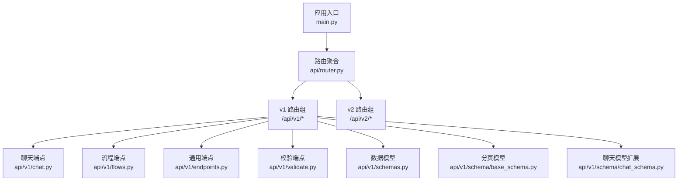
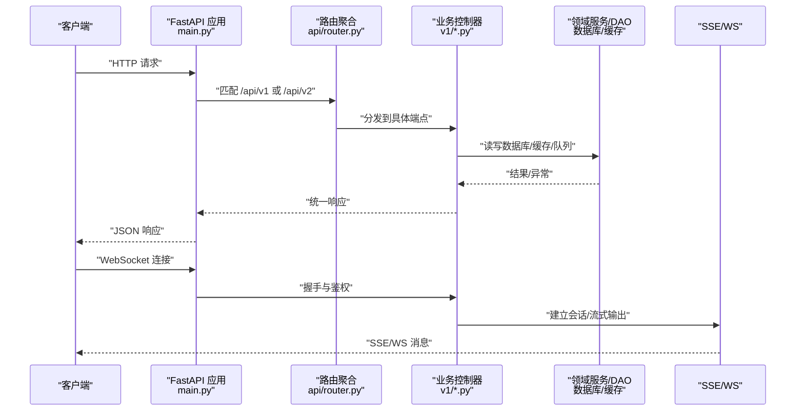
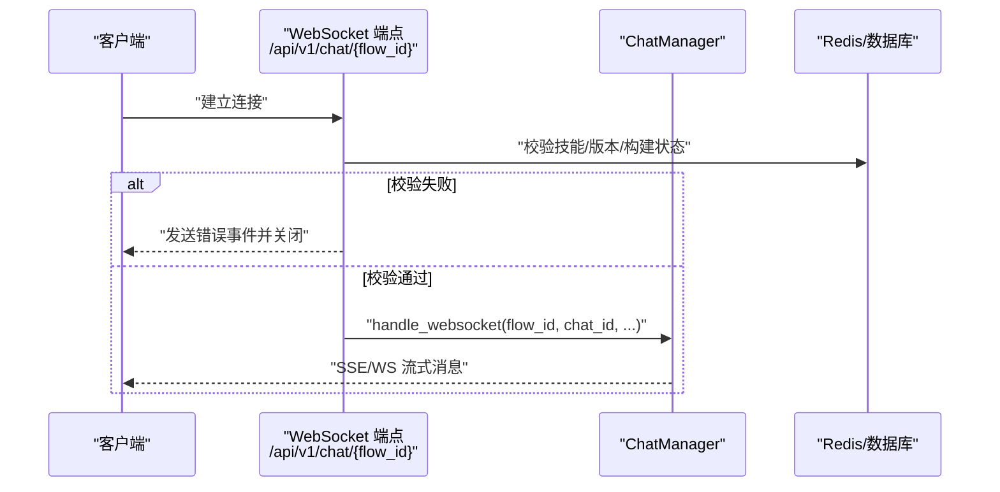
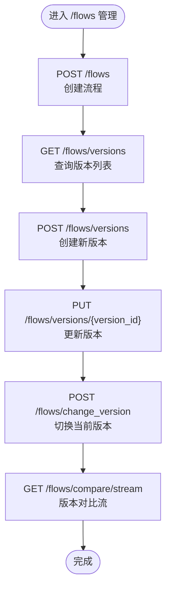
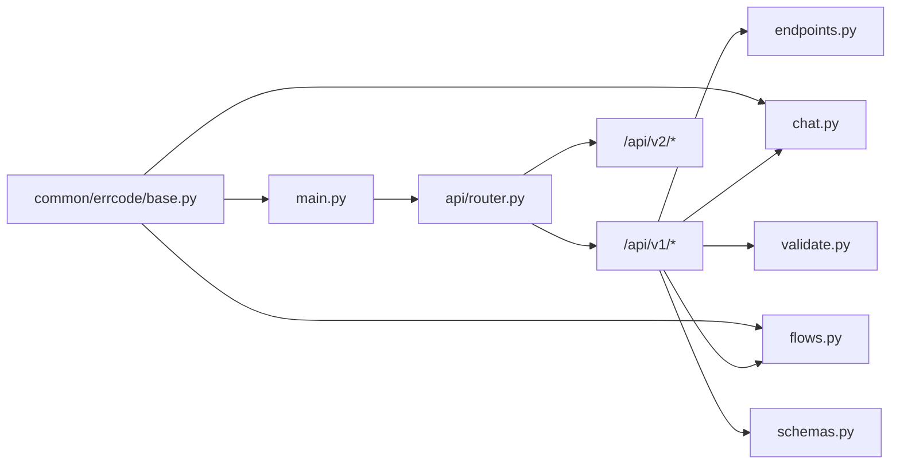

# API 参考文档

<cite>
**本文引用的文件**
- [src/backend/bisheng/main.py](file://src/backend/bisheng/main.py)
- [src/backend/bisheng/server.py](file://src/backend/bisheng/server.py)
- [src/backend/bisheng/api/router.py](file://src/backend/bisheng/api/router.py)
- [src/backend/bisheng/api/v1/chat.py](file://src/backend/bisheng/api/v1/chat.py)
- [src/backend/bisheng/api/v1/flows.py](file://src/backend/bisheng/api/v1/flows.py)
- [src/backend/bisheng/api/v1/endpoints.py](file://src/backend/bisheng/api/v1/endpoints.py)
- [src/backend/bisheng/api/v1/validate.py](file://src/backend/bisheng/api/v1/validate.py)
- [src/backend/bisheng/api/v1/schemas.py](file://src/backend/bisheng/api/v1/schemas.py)
- [src/backend/bisheng/api/v1/schema/base_schema.py](file://src/backend/bisheng/api/v1/schema/base_schema.py)
- [src/backend/bisheng/api/v1/schema/chat_schema.py](file://src/backend/bisheng/api/v1/schema/chat_schema.py)
- [src/backend/bisheng/common/errcode/base.py](file://src/backend/bisheng/common/errcode/base.py)
- [src/backend/bisheng/common/errcode/http_error.py](file://src/backend/bisheng/common/errcode/http_error.py)
</cite>

## 目录
1. [简介](#简介)
2. [项目结构](#项目结构)
3. [核心组件](#核心组件)
4. [架构总览](#架构总览)
5. [详细组件分析](#详细组件分析)
6. [依赖关系分析](#依赖关系分析)
7. [性能与可扩展性](#性能与可扩展性)
8. [故障排查指南](#故障排查指南)
9. [结论](#结论)
10. [附录](#附录)

## 简介
本文件为 Bisheng API 的权威参考文档，覆盖 RESTful API 与 WebSocket API 的端点、请求/响应模型、认证与授权、版本策略、错误处理与最佳实践。文档以“自顶向下”的方式组织，先给出整体架构与路由分层，再逐个模块详解端点与数据模型，并提供常见使用场景与集成建议。

## 项目结构
Bisheng 后端基于 FastAPI 构建，采用“版本前缀 + 子路由聚合”的组织方式：
- 应用入口与中间件在主程序中配置，统一异常处理与生命周期管理。
- API 路由按版本拆分：v1 为主版本，v2 提供开放 RPC 端点集合。
- 各功能域（聊天、流程、知识库、验证等）分别定义子路由并挂载到对应版本前缀下。

图表来源
- [src/backend/bisheng/main.py](file://src/backend/bisheng/main.py#L64-L102)
- [src/backend/bisheng/api/router.py](file://src/backend/bisheng/api/router.py#L23-L61)

章节来源
- [src/backend/bisheng/main.py](file://src/backend/bisheng/main.py#L64-L102)
- [src/backend/bisheng/api/router.py](file://src/backend/bisheng/api/router.py#L23-L61)

## 核心组件
- 应用与中间件
  - 异常处理器：统一处理 HTTP 异常、参数校验异常与业务错误码，返回统一响应结构。
  - 中间件：CORS、自定义中间件、WebSocket 日志中间件。
  - 生命周期：启动时初始化上下文、服务与默认数据，关闭时释放资源。
- 路由与版本
  - v1：完整业务能力，含聊天、流程、知识库、工作流、审计、报表等。
  - v2：开放 RPC 端点集合，面向外部直连场景。
- 统一响应模型
  - 所有成功/失败响应遵循统一结构，便于前端解析与错误提示。

章节来源
- [src/backend/bisheng/main.py](file://src/backend/bisheng/main.py#L21-L49)
- [src/backend/bisheng/api/router.py](file://src/backend/bisheng/api/router.py#L23-L61)
- [src/backend/bisheng/api/v1/schemas.py](file://src/backend/bisheng/api/v1/schemas.py#L69-L87)

## 架构总览
下图展示从客户端到服务端的典型调用链路，包括 REST 请求与 WebSocket 实时交互。

图表来源
- [src/backend/bisheng/main.py](file://src/backend/bisheng/main.py#L64-L102)
- [src/backend/bisheng/api/router.py](file://src/backend/bisheng/api/router.py#L23-L61)
- [src/backend/bisheng/api/v1/chat.py](file://src/backend/bisheng/api/v1/chat.py#L510-L565)

## 详细组件分析

### 认证与授权
- 用户依赖注入：通过用户依赖工具获取登录用户信息，用于权限校验与审计。
- 权限检查：部分端点对资源写入/删除进行访问控制，拒绝无权限请求。
- WebSocket 鉴权：WS 握手阶段进行用户身份校验，失败时发送错误消息并关闭连接。
- 全局异常处理：统一捕获未授权、不存在、服务器错误等业务异常，返回标准错误响应。

章节来源
- [src/backend/bisheng/api/v1/chat.py](file://src/backend/bisheng/api/v1/chat.py#L517-L518)
- [src/backend/bisheng/api/v1/flows.py](file://src/backend/bisheng/api/v1/flows.py#L137-L138)
- [src/backend/bisheng/common/errcode/http_error.py](file://src/backend/bisheng/common/errcode/http_error.py#L4-L16)
- [src/backend/bisheng/common/errcode/base.py](file://src/backend/bisheng/common/errcode/base.py#L36-L37)

### RESTful API 设计规范
- 资源命名
  - 使用名词复数形式表达资源集合，如 /flows、/chat/messages。
  - 资源路径中包含唯一标识符，如 /flows/{flow_id}。
- HTTP 方法
  - GET：查询列表或单个资源。
  - POST：创建资源或触发动作。
  - PUT/PATCH：更新资源。
  - DELETE：删除资源。
- 状态码
  - 成功：200；创建：201；无内容：204；参数错误：422；未授权：401/403；未找到：404；服务器错误：500。
- 错误处理
  - 统一错误响应体包含状态码、状态消息与附加数据。
  - SSE/WS 场景使用事件封装错误信息。

章节来源
- [src/backend/bisheng/api/v1/flows.py](file://src/backend/bisheng/api/v1/flows.py#L137-L138)
- [src/backend/bisheng/api/v1/endpoints.py](file://src/backend/bisheng/api/v1/endpoints.py#L174-L350)
- [src/backend/bisheng/common/errcode/base.py](file://src/backend/bisheng/common/errcode/base.py#L24-L37)

### 版本管理策略
- 版本前缀
  - v1：当前稳定版本，承载主要业务能力。
  - v2：开放 RPC 端点集合，便于外部直接对接。
- 向后兼容
  - 新增端点优先放入 v2，避免破坏 v1 稳定契约。
  - 对 v1 的变更遵循最小破坏原则，必要时通过新端点替代旧行为。
- 迁移指导
  - 从 v1 迁移到 v2：对照端点清单，替换 URL 前缀与请求体差异。
  - 保持现有 v1 客户端的同时逐步引入 v2 端点。

章节来源
- [src/backend/bisheng/api/router.py](file://src/backend/bisheng/api/router.py#L53-L61)

### 统一响应模型
- 结构
  - 字段：status_code、status_message、data。
  - 成功：status_code=200；失败：status_code=自定义业务码。
- 工具函数
  - resp_200(resp_200)：快速构造成功响应。
  - resp_500(resp_500)：快速构造错误响应。

章节来源
- [src/backend/bisheng/api/v1/schemas.py](file://src/backend/bisheng/api/v1/schemas.py#L69-L87)

### 聊天与会话（REST + WebSocket）
- REST 端点
  - 获取会话列表、历史消息、会话详情、重命名/复制/删除会话。
  - 添加/更新/删除消息、点赞/复制/评论。
  - 在线技能/助手查询、构建初始化与状态查询、构建流式输出。
- WebSocket
  - 端点：/api/v1/chat/{flow_id}。
  - 握手：校验技能存在性、上线状态与构建状态；失败时发送错误消息并关闭连接。
  - 交互：支持流式消息与事件类型（开始、流式、结束、错误、信息、文件等）。

图表来源
- [src/backend/bisheng/api/v1/chat.py](file://src/backend/bisheng/api/v1/chat.py#L510-L565)

章节来源
- [src/backend/bisheng/api/v1/chat.py](file://src/backend/bisheng/api/v1/chat.py#L54-L153)
- [src/backend/bisheng/api/v1/chat.py](file://src/backend/bisheng/api/v1/chat.py#L156-L170)
- [src/backend/bisheng/api/v1/chat.py](file://src/backend/bisheng/api/v1/chat.py#L173-L178)
- [src/backend/bisheng/api/v1/chat.py](file://src/backend/bisheng/api/v1/chat.py#L181-L226)
- [src/backend/bisheng/api/v1/chat.py](file://src/backend/bisheng/api/v1/chat.py#L227-L267)
- [src/backend/bisheng/api/v1/chat.py](file://src/backend/bisheng/api/v1/chat.py#L270-L369)
- [src/backend/bisheng/api/v1/chat.py](file://src/backend/bisheng/api/v1/chat.py#L372-L398)
- [src/backend/bisheng/api/v1/chat.py](file://src/backend/bisheng/api/v1/chat.py#L401-L405)
- [src/backend/bisheng/api/v1/chat.py](file://src/backend/bisheng/api/v1/chat.py#L408-L442)
- [src/backend/bisheng/api/v1/chat.py](file://src/backend/bisheng/api/v1/chat.py#L445-L454)
- [src/backend/bisheng/api/v1/chat.py](file://src/backend/bisheng/api/v1/chat.py#L457-L460)
- [src/backend/bisheng/api/v1/chat.py](file://src/backend/bisheng/api/v1/chat.py#L463-L495)
- [src/backend/bisheng/api/v1/chat.py](file://src/backend/bisheng/api/v1/chat.py#L499-L507)
- [src/backend/bisheng/api/v1/chat.py](file://src/backend/bisheng/api/v1/chat.py#L510-L565)
- [src/backend/bisheng/api/v1/chat.py](file://src/backend/bisheng/api/v1/chat.py#L567-L621)
- [src/backend/bisheng/api/v1/chat.py](file://src/backend/bisheng/api/v1/chat.py#L623-L718)

### 流程与版本（Flows）
- 端点
  - 创建/查询/更新/删除流程。
  - 版本管理：查询、创建、更新、删除、切换当前版本。
  - 流程对比：对比不同版本节点差异，支持 SSE 流式输出。
- 权限与安全
  - 写权限校验；上线前构建校验；在线状态不可直接编辑。
- 数据模型
  - 流程、版本、比较请求等模型定义于统一响应体中。

图表来源
- [src/backend/bisheng/api/v1/flows.py](file://src/backend/bisheng/api/v1/flows.py#L29-L45)
- [src/backend/bisheng/api/v1/flows.py](file://src/backend/bisheng/api/v1/flows.py#L48-L93)
- [src/backend/bisheng/api/v1/flows.py](file://src/backend/bisheng/api/v1/flows.py#L95-L104)
- [src/backend/bisheng/api/v1/flows.py](file://src/backend/bisheng/api/v1/flows.py#L198-L225)

章节来源
- [src/backend/bisheng/api/v1/flows.py](file://src/backend/bisheng/api/v1/flows.py#L29-L45)
- [src/backend/bisheng/api/v1/flows.py](file://src/backend/bisheng/api/v1/flows.py#L48-L93)
- [src/backend/bisheng/api/v1/flows.py](file://src/backend/bisheng/api/v1/flows.py#L95-L104)
- [src/backend/bisheng/api/v1/flows.py](file://src/backend/bisheng/api/v1/flows.py#L107-L116)
- [src/backend/bisheng/api/v1/flows.py](file://src/backend/bisheng/api/v1/flows.py#L119-L123)
- [src/backend/bisheng/api/v1/flows.py](file://src/backend/bisheng/api/v1/flows.py#L126-L170)
- [src/backend/bisheng/api/v1/flows.py](file://src/backend/bisheng/api/v1/flows.py#L173-L195)
- [src/backend/bisheng/api/v1/flows.py](file://src/backend/bisheng/api/v1/flows.py#L198-L225)

### 通用端点（环境、配置、上传、处理）
- 环境与配置
  - 获取系统环境变量、读取/保存配置、前端配置读写。
- 处理与上传
  - 通用流程处理（同步/异步）、文件上传（图标、工作流、通用）。
- 版本查询
  - 返回当前服务版本号。

章节来源
- [src/backend/bisheng/api/v1/endpoints.py](file://src/backend/bisheng/api/v1/endpoints.py#L64-L98)
- [src/backend/bisheng/api/v1/endpoints.py](file://src/backend/bisheng/api/v1/endpoints.py#L101-L129)
- [src/backend/bisheng/api/v1/endpoints.py](file://src/backend/bisheng/api/v1/endpoints.py#L132-L154)
- [src/backend/bisheng/api/v1/endpoints.py](file://src/backend/bisheng/api/v1/endpoints.py#L157-L350)
- [src/backend/bisheng/api/v1/endpoints.py](file://src/backend/bisheng/api/v1/endpoints.py#L371-L421)
- [src/backend/bisheng/api/v1/endpoints.py](file://src/backend/bisheng/api/v1/endpoints.py#L424-L427)

### 校验端点（Prompt/代码）
- 代码校验：返回导入与函数级别的错误信息。
- Prompt 校验：提取输入变量、更新模板字段、返回校验结果。

章节来源
- [src/backend/bisheng/api/v1/validate.py](file://src/backend/bisheng/api/v1/validate.py#L13-L23)
- [src/backend/bisheng/api/v1/validate.py](file://src/backend/bisheng/api/v1/validate.py#L26-L46)
- [src/backend/bisheng/api/v1/validate.py](file://src/backend/bisheng/api/v1/validate.py#L49-L106)

### 数据模型与分页
- 统一响应模型：status_code、status_message、data。
- 分页模型：PageList(list, total)，用于列表型查询。
- 聊天相关模型：会话列表、消息、SSE 响应等。
- 通用模型：流程、版本、上传文件、构建状态、流式数据等。

章节来源
- [src/backend/bisheng/api/v1/schemas.py](file://src/backend/bisheng/api/v1/schemas.py#L69-L87)
- [src/backend/bisheng/api/v1/schema/base_schema.py](file://src/backend/bisheng/api/v1/schema/base_schema.py#L9-L12)
- [src/backend/bisheng/api/v1/schema/chat_schema.py](file://src/backend/bisheng/api/v1/schema/chat_schema.py#L12-L29)
- [src/backend/bisheng/api/v1/schema/chat_schema.py](file://src/backend/bisheng/api/v1/schema/chat_schema.py#L79-L84)

## 依赖关系分析
- 应用层
  - main.py 注册全局异常处理器、CORS、中间件与健康检查端点。
  - server.py 提供基于 Gunicorn 的应用包装器。
- 路由层
  - router.py 将各功能子路由挂载至 /api/v1 与 /api/v2。
- 控制器层
  - 各 v1/*.py 定义具体端点，依赖 DAO、服务与统一响应模型。
- 错误码层
  - base.py 定义统一错误码基类与 SSE/WS 错误转换；http_error.py 提供常用 HTTP 错误。

图表来源
- [src/backend/bisheng/main.py](file://src/backend/bisheng/main.py#L64-L102)
- [src/backend/bisheng/api/router.py](file://src/backend/bisheng/api/router.py#L23-L61)
- [src/backend/bisheng/common/errcode/base.py](file://src/backend/bisheng/common/errcode/base.py#L24-L37)

章节来源
- [src/backend/bisheng/main.py](file://src/backend/bisheng/main.py#L64-L102)
- [src/backend/bisheng/api/router.py](file://src/backend/bisheng/api/router.py#L23-L61)
- [src/backend/bisheng/common/errcode/base.py](file://src/backend/bisheng/common/errcode/base.py#L24-L37)

## 性能与可扩展性
- SSE/WS 流式输出
  - 构建过程与聊天消息采用事件流推送，降低长轮询开销。
- 缓存与异步
  - Redis 缓存流程构建数据；异步任务支持后台处理。
- 并发与资源
  - WebSocket 连接需配合连接池与超时策略；SSE 事件需注意客户端断连重试。
- 建议
  - 对高频端点增加本地缓存与限流。
  - 使用异步任务处理耗时操作，避免阻塞主线程。

[本节为通用建议，不直接分析具体文件]

## 故障排查指南
- 常见错误码
  - 401 未授权：检查鉴权头与用户有效性。
  - 403 无权限：确认资源写入权限与访问控制。
  - 404 未找到：检查资源 ID 是否有效。
  - 500 服务器错误：查看服务端日志定位异常。
- WebSocket 错误
  - 握手失败：技能不存在、未上线或未构建成功。
  - 运行期异常：服务端抛出异常时会通过错误事件通知客户端并关闭连接。
- 参数校验
  - 422 参数错误：核对请求体字段与类型，参考模型定义。

章节来源
- [src/backend/bisheng/common/errcode/http_error.py](file://src/backend/bisheng/common/errcode/http_error.py#L4-L16)
- [src/backend/bisheng/api/v1/chat.py](file://src/backend/bisheng/api/v1/chat.py#L524-L564)
- [src/backend/bisheng/api/v1/flows.py](file://src/backend/bisheng/api/v1/flows.py#L142-L155)

## 结论
本文档提供了 Bisheng API 的完整参考，涵盖 REST 与 WebSocket 的端点、数据模型、认证授权、版本策略与错误处理。建议在集成时：
- 优先使用 /api/v1 的稳定端点，必要时引入 /api/v2 的开放 RPC。
- 严格遵循统一响应模型与错误码约定。
- 对实时交互采用 SSE/WS 并做好断连与重试策略。
- 关注性能与并发，合理使用缓存与异步任务。

[本节为总结，不直接分析具体文件]

## 附录

### 常见使用场景与示例指引
- 创建并运行一个技能
  - POST /api/v1/flows：创建流程。
  - POST /api/v1/flows/versions：创建版本。
  - POST /api/v1/process：同步执行流程。
- 实时聊天
  - GET /api/v1/chat/build/stream/{flow_id}：构建流式输出。
  - WebSocket /api/v1/chat/{flow_id}：实时对话。
- 管理会话与消息
  - GET /api/v1/chat/list：获取会话列表。
  - GET /api/v1/chat/history：获取历史消息。
  - POST /api/v1/chat/message：添加问答记录。
  - PUT /api/v1/chat/message/{message_id}：更新消息。
  - DELETE /api/v1/chat/message/{message_id}：删除消息。
- 配置与上传
  - GET /api/v1/env：获取环境配置。
  - POST /api/v1/upload/{flow_id}：上传文件。
  - POST /api/v1/upload/icon：上传图标。

章节来源
- [src/backend/bisheng/api/v1/flows.py](file://src/backend/bisheng/api/v1/flows.py#L29-L45)
- [src/backend/bisheng/api/v1/flows.py](file://src/backend/bisheng/api/v1/flows.py#L56-L64)
- [src/backend/bisheng/api/v1/endpoints.py](file://src/backend/bisheng/api/v1/endpoints.py#L174-L350)
- [src/backend/bisheng/api/v1/chat.py](file://src/backend/bisheng/api/v1/chat.py#L463-L495)
- [src/backend/bisheng/api/v1/chat.py](file://src/backend/bisheng/api/v1/chat.py#L156-L170)
- [src/backend/bisheng/api/v1/chat.py](file://src/backend/bisheng/api/v1/chat.py#L270-L369)
- [src/backend/bisheng/api/v1/chat.py](file://src/backend/bisheng/api/v1/chat.py#L372-L398)
- [src/backend/bisheng/api/v1/chat.py](file://src/backend/bisheng/api/v1/chat.py#L401-L405)
- [src/backend/bisheng/api/v1/endpoints.py](file://src/backend/bisheng/api/v1/endpoints.py#L403-L421)
- [src/backend/bisheng/api/v1/endpoints.py](file://src/backend/bisheng/api/v1/endpoints.py#L371-L386)

### 客户端实现要点
- 统一响应解析：始终读取 status_code 与 status_message，按 data 字段解析业务数据。
- WebSocket 事件类型：start/stream/end/error/info/file/end_cover/over 等。
- SSE 事件：message/error 两类，错误事件包含统一错误结构。
- 上传与下载：遵循相对路径与对象存储规则，注意文件扩展名限制。

章节来源
- [src/backend/bisheng/api/v1/schemas.py](file://src/backend/bisheng/api/v1/schemas.py#L224-L231)
- [src/backend/bisheng/api/v1/schemas.py](file://src/backend/bisheng/api/v1/schemas.py#L159-L177)
- [src/backend/bisheng/api/v1/endpoints.py](file://src/backend/bisheng/api/v1/endpoints.py#L352-L368)
- [src/backend/bisheng/api/v1/endpoints.py](file://src/backend/bisheng/api/v1/endpoints.py#L388-L400)