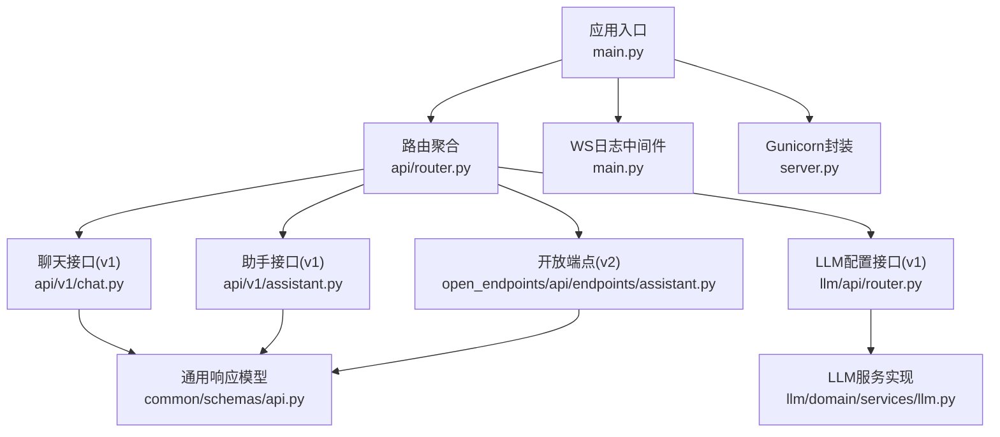
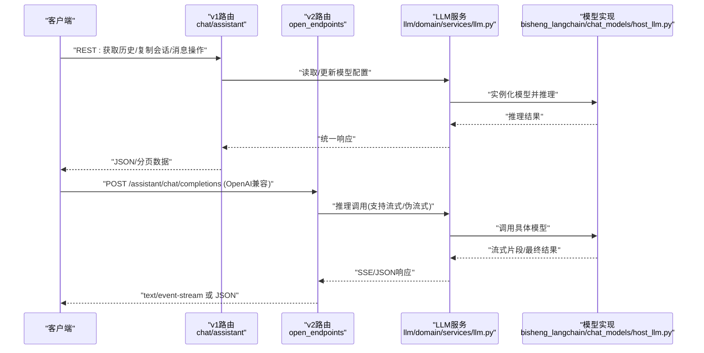
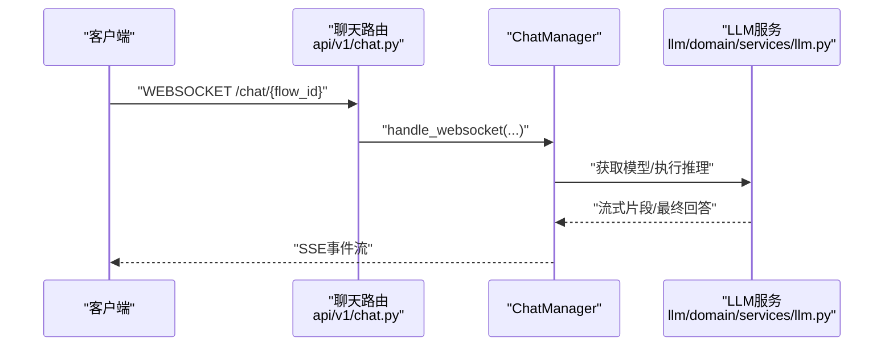
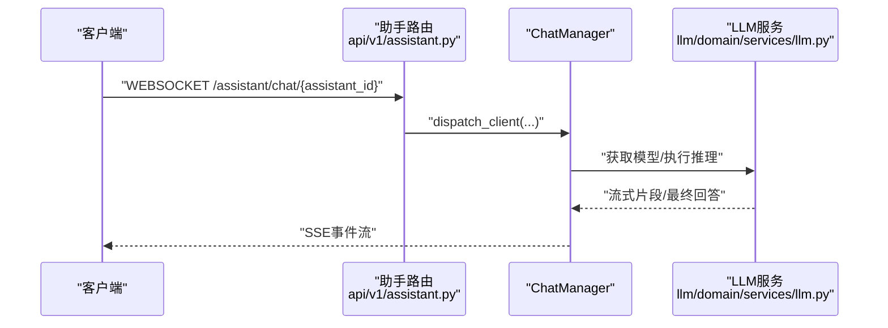
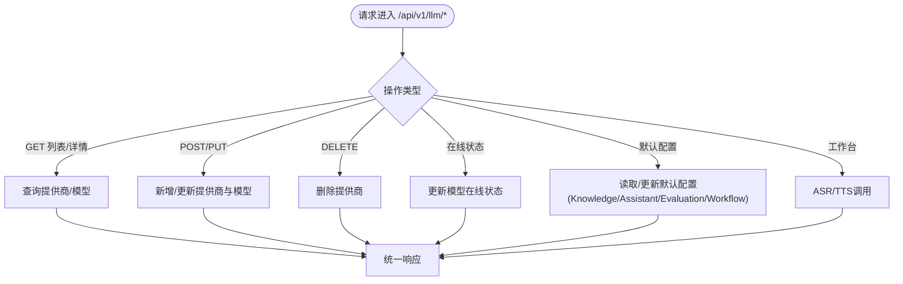
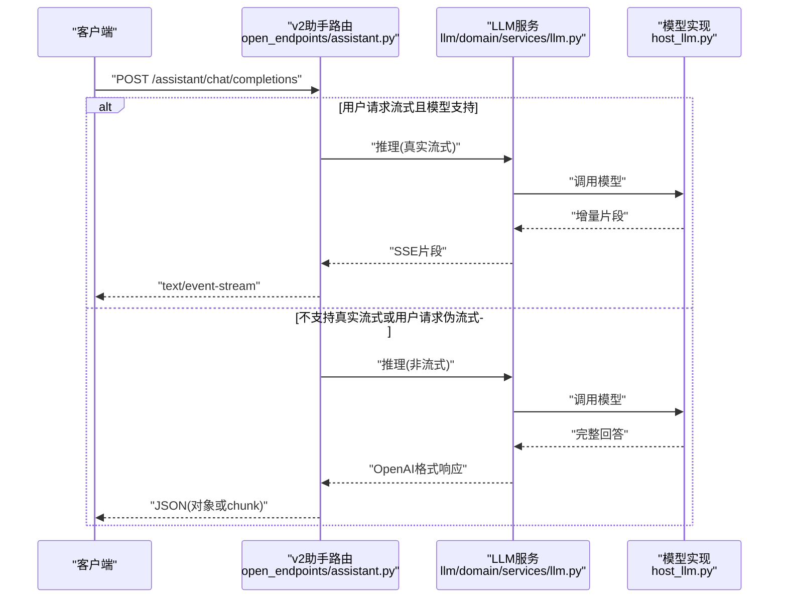
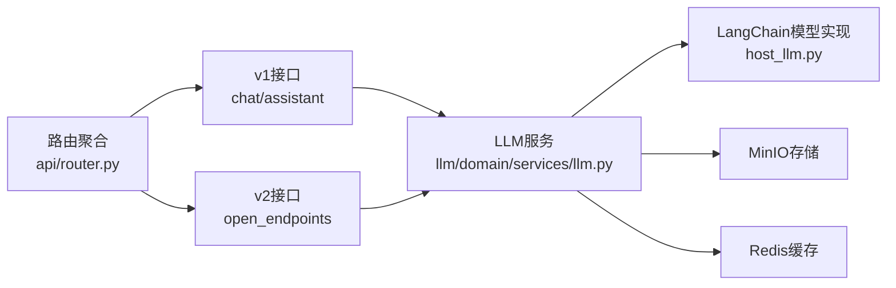

# LLM 服务 API

<cite>
**本文引用的文件**
- [src/backend/bisheng/main.py](file://src/backend/bisheng/main.py)
- [src/backend/bisheng/server.py](file://src/backend/bisheng/server.py)
- [src/backend/bisheng/api/router.py](file://src/backend/bisheng/api/router.py)
- [src/backend/bisheng/api/v1/chat.py](file://src/backend/bisheng/api/v1/chat.py)
- [src/backend/bisheng/api/v1/assistant.py](file://src/backend/bisheng/api/v1/assistant.py)
- [src/backend/bisheng/api/v1/schemas.py](file://src/backend/bisheng/api/v1/schemas.py)
- [src/backend/bisheng/api/v1/schema/chat_schema.py](file://src/backend/bisheng/api/v1/schema/chat_schema.py)
- [src/backend/bisheng/llm/api/router.py](file://src/backend/bisheng/llm/api/router.py)
- [src/backend/bisheng/llm/domain/services/llm.py](file://src/backend/bisheng/llm/domain/services/llm.py)
- [src/backend/bisheng/common/schemas/api.py](file://src/backend/bisheng/common/schemas/api.py)
- [src/backend/bisheng/open_endpoints/api/endpoints/assistant.py](file://src/backend/bisheng/open_endpoints/api/endpoints/assistant.py)
- [src/backend/bisheng_langchain/chat_models/host_llm.py](file://src/backend/bisheng_langchain/chat_models/host_llm.py)
</cite>

## 目录
1. [简介](#简介)
2. [项目结构](#项目结构)
3. [核心组件](#核心组件)
4. [架构总览](#架构总览)
5. [详细组件分析](#详细组件分析)
6. [依赖关系分析](#依赖关系分析)
7. [性能考量](#性能考量)
8. [故障排查指南](#故障排查指南)
9. [结论](#结论)
10. [附录](#附录)

## 简介
本文件为 Bisheng LLM 服务系统的全面 API 文档，覆盖模型配置、推理调用与流式响应、多提供商模型管理、参数配置与性能优化、聊天补全与文本生成、批量推理、模型监控与使用统计、成本控制以及模型选择策略、错误处理与性能调优等专业指南。文档以“v1/v2”两个版本路由为核心，结合 LLM 配置管理、聊天与助手对话、知识库与工作台能力，形成统一的接口规范。

## 项目结构
后端采用 FastAPI 构建，主应用在入口文件中初始化中间件、异常处理器与服务生命周期，并通过路由聚合器将各模块 API 路由挂载到统一前缀下。LLM 配置与推理服务位于独立模块，聊天与助手对话在 v1 路由下提供 REST 与 WebSocket 接口，开放端点在 v2 路由下提供兼容 OpenAI 格式的推理接口。

图表来源
- [src/backend/bisheng/main.py](file://src/backend/bisheng/main.py#L64-L102)
- [src/backend/bisheng/api/router.py](file://src/backend/bisheng/api/router.py#L23-L61)
- [src/backend/bisheng/api/v1/chat.py](file://src/backend/bisheng/api/v1/chat.py#L49-L719)
- [src/backend/bisheng/api/v1/assistant.py](file://src/backend/bisheng/api/v1/assistant.py#L23-L177)
- [src/backend/bisheng/llm/api/router.py](file://src/backend/bisheng/llm/api/router.py#L9-L151)
- [src/backend/bisheng/llm/domain/services/llm.py](file://src/backend/bisheng/llm/domain/services/llm.py#L32-L710)
- [src/backend/bisheng/common/schemas/api.py](file://src/backend/bisheng/common/schemas/api.py#L8-L53)
- [src/backend/bisheng/server.py](file://src/backend/bisheng/server.py#L4-L21)

章节来源
- [src/backend/bisheng/main.py](file://src/backend/bisheng/main.py#L64-L102)
- [src/backend/bisheng/api/router.py](file://src/backend/bisheng/api/router.py#L23-L61)

## 核心组件
- 应用与中间件
  - 异常与校验错误处理、CORS、自定义中间件与 WS 日志中间件注册。
  - 健康检查端点与服务生命周期钩子。
- 路由聚合
  - v1 路由：聊天、助手、知识库、工作流、评估、LLM 配置等。
  - v2 路由：开放端点（兼容 OpenAI ChatCompletion），支持非流式与伪流式返回。
- LLM 服务
  - 提供模型提供商增删改查、在线状态切换、默认模型配置读写、工作台语音模型调用、向量化与重排等能力。
- 聊天与助手
  - 提供历史查询、会话复制、消息点赞/复制/评论、WebSocket 对话、构建流程与输入键收集等。
- 数据模型与响应
  - 统一响应体、分页模型、聊天消息与 SSE 数据结构、OpenAI 兼容请求/响应模型。

章节来源
- [src/backend/bisheng/main.py](file://src/backend/bisheng/main.py#L21-L49)
- [src/backend/bisheng/api/router.py](file://src/backend/bisheng/api/router.py#L23-L61)
- [src/backend/bisheng/llm/domain/services/llm.py](file://src/backend/bisheng/llm/domain/services/llm.py#L32-L710)
- [src/backend/bisheng/api/v1/schemas.py](file://src/backend/bisheng/api/v1/schemas.py#L69-L232)
- [src/backend/bisheng/api/v1/schema/chat_schema.py](file://src/backend/bisheng/api/v1/schema/chat_schema.py#L12-L99)

## 架构总览
下图展示从客户端到聊天/助手/LLM 的典型调用链路，包括 v1 REST 与 v2 开放端点两种路径。

图表来源
- [src/backend/bisheng/api/v1/chat.py](file://src/backend/bisheng/api/v1/chat.py#L510-L565)
- [src/backend/bisheng/api/v1/assistant.py](file://src/backend/bisheng/api/v1/assistant.py#L158-L177)
- [src/backend/bisheng/open_endpoints/api/endpoints/assistant.py](file://src/backend/bisheng/open_endpoints/api/endpoints/assistant.py#L94-L197)
- [src/backend/bisheng/llm/domain/services/llm.py](file://src/backend/bisheng/llm/domain/services/llm.py#L440-L447)
- [src/backend/bisheng_langchain/chat_models/host_llm.py](file://src/backend/bisheng_langchain/chat_models/host_llm.py#L219-L251)

## 详细组件分析

### 聊天接口（v1）
- 功能要点
  - 会话列表、历史查询、会话信息、消息增删改、点赞/复制/评论。
  - WebSocket 对话：构建流程、输入键收集、流式输出。
  - 构建状态查询与流式构建。
- 关键端点
  - GET /api/v1/chat/history
  - GET /api/v1/chat/info
  - POST /api/v1/chat/message
  - PUT /api/v1/chat/message/{message_id}
  - DELETE /api/v1/chat/message/{message_id}
  - POST /api/v1/chat/liked
  - POST /api/v1/chat/copied
  - POST /api/v1/chat/comment
  - GET /api/v1/chat/list
  - GET /api/v1/chat/online
  - GET /api/v1/chat/app/list
  - DELETE /api/v1/chat/{chat_id}
  - POST /api/v1/chat/conversation/rename
  - POST /api/v1/chat/conversation/copy
  - WEBSOCKET /api/v1/chat/{flow_id}
  - POST /api/v1/chat/build/init/{flow_id}
  - GET /api/v1/chat/build/{flow_id}/status
  - GET /api/v1/chat/build/stream/{flow_id}

图表来源
- [src/backend/bisheng/api/v1/chat.py](file://src/backend/bisheng/api/v1/chat.py#L510-L565)
- [src/backend/bisheng/api/v1/chat.py](file://src/backend/bisheng/api/v1/chat.py#L623-L718)

章节来源
- [src/backend/bisheng/api/v1/chat.py](file://src/backend/bisheng/api/v1/chat.py#L54-L153)
- [src/backend/bisheng/api/v1/chat.py](file://src/backend/bisheng/api/v1/chat.py#L156-L170)
- [src/backend/bisheng/api/v1/chat.py](file://src/backend/bisheng/api/v1/chat.py#L173-L178)
- [src/backend/bisheng/api/v1/chat.py](file://src/backend/bisheng/api/v1/chat.py#L180-L267)
- [src/backend/bisheng/api/v1/chat.py](file://src/backend/bisheng/api/v1/chat.py#L270-L369)
- [src/backend/bisheng/api/v1/chat.py](file://src/backend/bisheng/api/v1/chat.py#L372-L398)
- [src/backend/bisheng/api/v1/chat.py](file://src/backend/bisheng/api/v1/chat.py#L401-L405)
- [src/backend/bisheng/api/v1/chat.py](file://src/backend/bisheng/api/v1/chat.py#L408-L442)
- [src/backend/bisheng/api/v1/chat.py](file://src/backend/bisheng/api/v1/chat.py#L445-L454)
- [src/backend/bisheng/api/v1/chat.py](file://src/backend/bisheng/api/v1/chat.py#L457-L460)
- [src/backend/bisheng/api/v1/chat.py](file://src/backend/bisheng/api/v1/chat.py#L463-L495)
- [src/backend/bisheng/api/v1/chat.py](file://src/backend/bisheng/api/v1/chat.py#L499-L507)
- [src/backend/bisheng/api/v1/chat.py](file://src/backend/bisheng/api/v1/chat.py#L510-L565)
- [src/backend/bisheng/api/v1/chat.py](file://src/backend/bisheng/api/v1/chat.py#L567-L621)
- [src/backend/bisheng/api/v1/chat.py](file://src/backend/bisheng/api/v1/chat.py#L623-L718)

### 助手接口（v1）
- 功能要点
  - 助手列表、详情、创建、更新、删除、上下线、自动优化任务提交与流式反馈。
  - WebSocket 助手对话。
- 关键端点
  - GET /api/v1/assistant
  - GET /api/v1/assistant/info/{assistant_id}
  - POST /api/v1/assistant
  - PUT /api/v1/assistant
  - POST /api/v1/assistant/delete
  - POST /api/v1/assistant/status
  - POST /api/v1/assistant/auto/task
  - GET /api/v1/assistant/auto
  - POST /api/v1/assistant/prompt
  - POST /api/v1/assistant/flow
  - POST /api/v1/assistant/tool
  - WEBSOCKET /api/v1/assistant/chat/{assistant_id}

图表来源
- [src/backend/bisheng/api/v1/assistant.py](file://src/backend/bisheng/api/v1/assistant.py#L158-L177)

章节来源
- [src/backend/bisheng/api/v1/assistant.py](file://src/backend/bisheng/api/v1/assistant.py#L27-L36)
- [src/backend/bisheng/api/v1/assistant.py](file://src/backend/bisheng/api/v1/assistant.py#L39-L45)
- [src/backend/bisheng/api/v1/assistant.py](file://src/backend/bisheng/api/v1/assistant.py#L48-L55)
- [src/backend/bisheng/api/v1/assistant.py](file://src/backend/bisheng/api/v1/assistant.py#L58-L76)
- [src/backend/bisheng/api/v1/assistant.py](file://src/backend/bisheng/api/v1/assistant.py#L79-L86)
- [src/backend/bisheng/api/v1/assistant.py](file://src/backend/bisheng/api/v1/assistant.py#L89-L102)
- [src/backend/bisheng/api/v1/assistant.py](file://src/backend/bisheng/api/v1/assistant.py#L106-L125)
- [src/backend/bisheng/api/v1/assistant.py](file://src/backend/bisheng/api/v1/assistant.py#L129-L135)
- [src/backend/bisheng/api/v1/assistant.py](file://src/backend/bisheng/api/v1/assistant.py#L138-L144)
- [src/backend/bisheng/api/v1/assistant.py](file://src/backend/bisheng/api/v1/assistant.py#L147-L154)
- [src/backend/bisheng/api/v1/assistant.py](file://src/backend/bisheng/api/v1/assistant.py#L157-L177)

### LLM 配置与推理接口（v1）
- 功能要点
  - 模型提供商增删改查、在线状态切换、默认模型配置读写（知识库、助手、评估、工作流）。
  - 工作台语音模型调用（ASR/TTS）。
- 关键端点
  - GET /api/v1/llm
  - POST /api/v1/llm
  - DELETE /api/v1/llm
  - PUT /api/v1/llm
  - GET /api/v1/llm/info
  - POST /api/v1/llm/online
  - GET /api/v1/llm/workbench
  - POST /api/v1/llm/workbench
  - POST /api/v1/llm/workbench/asr
  - POST /api/v1/llm/workbench/tts
  - GET /api/v1/llm/knowledge
  - POST /api/v1/llm/knowledge
  - GET /api/v1/llm/assistant
  - POST /api/v1/llm/assistant
  - GET /api/v1/llm/evaluation
  - POST /api/v1/llm/evaluation
  - GET /api/v1/llm/workflow
  - POST /api/v1/llm/workflow
  - GET /api/v1/llm/assistant/llm_list

图表来源
- [src/backend/bisheng/llm/api/router.py](file://src/backend/bisheng/llm/api/router.py#L12-L151)
- [src/backend/bisheng/llm/domain/services/llm.py](file://src/backend/bisheng/llm/domain/services/llm.py#L34-L300)
- [src/backend/bisheng/llm/domain/services/llm.py](file://src/backend/bisheng/llm/domain/services/llm.py#L302-L541)
- [src/backend/bisheng/llm/domain/services/llm.py](file://src/backend/bisheng/llm/domain/services/llm.py#L578-L709)

章节来源
- [src/backend/bisheng/llm/api/router.py](file://src/backend/bisheng/llm/api/router.py#L12-L151)
- [src/backend/bisheng/llm/domain/services/llm.py](file://src/backend/bisheng/llm/domain/services/llm.py#L34-L300)
- [src/backend/bisheng/llm/domain/services/llm.py](file://src/backend/bisheng/llm/domain/services/llm.py#L302-L541)
- [src/backend/bisheng/llm/domain/services/llm.py](file://src/backend/bisheng/llm/domain/services/llm.py#L578-L709)

### 开放端点（v2）- 兼容 OpenAI ChatCompletion
- 功能要点
  - 支持非流式与伪流式返回，当底层模型不支持真实流式时，使用 SSE 包装一次性返回。
  - 流式场景下按 OpenAI 格式返回增量片段，结束时发送 [DONE]。
- 关键端点
  - POST /api/v2/assistant/chat/completions
- 请求/响应模型
  - OpenAIChatCompletionReq、OpenAIChoice、OpenAIChatCompletionResp

图表来源
- [src/backend/bisheng/open_endpoints/api/endpoints/assistant.py](file://src/backend/bisheng/open_endpoints/api/endpoints/assistant.py#L94-L197)
- [src/backend/bisheng/llm/domain/services/llm.py](file://src/backend/bisheng/llm/domain/services/llm.py#L440-L447)
- [src/backend/bisheng_langchain/chat_models/host_llm.py](file://src/backend/bisheng_langchain/chat_models/host_llm.py#L219-L251)

章节来源
- [src/backend/bisheng/open_endpoints/api/endpoints/assistant.py](file://src/backend/bisheng/open_endpoints/api/endpoints/assistant.py#L94-L197)
- [src/backend/bisheng/api/v1/schemas.py](file://src/backend/bisheng/api/v1/schemas.py#L330-L358)
- [src/backend/bisheng/api/v1/schemas.py](file://src/backend/bisheng/api/v1/schemas.py#L343-L348)
- [src/backend/bisheng/api/v1/schemas.py](file://src/backend/bisheng/api/v1/schemas.py#L350-L357)

### 数据模型与响应规范
- 统一响应模型
  - status_code、status_message、data 字段，支持泛型数据体。
- 分页模型
  - PageData（推荐）、PageList（兼容保留）。
- 聊天消息与 SSE
  - ChatMessage/ChatResponse、StreamData、OpenAI 兼容模型。
- 聊天 Schema
  - AppChatList、APIChatCompletion、SSEResponse 等。

章节来源
- [src/backend/bisheng/common/schemas/api.py](file://src/backend/bisheng/common/schemas/api.py#L8-L53)
- [src/backend/bisheng/api/v1/schemas.py](file://src/backend/bisheng/api/v1/schemas.py#L69-L232)
- [src/backend/bisheng/api/v1/schema/chat_schema.py](file://src/backend/bisheng/api/v1/schema/chat_schema.py#L12-L99)

## 依赖关系分析
- 组件耦合
  - 路由层仅负责参数解析与转发，业务逻辑集中在 LLM 服务与聊天管理器。
  - v1 与 v2 路由分别面向平台内部与外部兼容需求，避免互相污染。
- 外部依赖
  - WebSocket 日志中间件、Redis 缓存、MinIO 存储（用于 TTS 结果分享链接缓存）。
  - LangChain 组件（聊天模型、嵌入、重排、ASR/TTS）。

图表来源
- [src/backend/bisheng/api/router.py](file://src/backend/bisheng/api/router.py#L23-L61)
- [src/backend/bisheng/llm/domain/services/llm.py](file://src/backend/bisheng/llm/domain/services/llm.py#L677-L709)
- [src/backend/bisheng_langchain/chat_models/host_llm.py](file://src/backend/bisheng_langchain/chat_models/host_llm.py#L219-L251)

章节来源
- [src/backend/bisheng/api/router.py](file://src/backend/bisheng/api/router.py#L23-L61)
- [src/backend/bisheng/llm/domain/services/llm.py](file://src/backend/bisheng/llm/domain/services/llm.py#L677-L709)

## 性能考量
- 流式传输
  - v1 使用 SSE 流式构建与对话，降低首字延迟；v2 在模型不支持时回退为伪流式。
- 缓存与复用
  - TTS 结果在 Redis 中按文本+语音参数做缓存，减少重复合成与上传开销。
- 并发与线程池
  - 应用启动时初始化线程池，服务关闭时回收资源。
- 中间件
  - CORS 与自定义中间件、WS 日志中间件，确保跨域与可观测性。
- Gunicorn 封装
  - 通过 BishengApplication 统一配置与加载，便于生产部署。

章节来源
- [src/backend/bisheng/main.py](file://src/backend/bisheng/main.py#L18-L19)
- [src/backend/bisheng/main.py](file://src/backend/bisheng/main.py#L52-L61)
- [src/backend/bisheng/main.py](file://src/backend/bisheng/main.py#L81-L90)
- [src/backend/bisheng/server.py](file://src/backend/bisheng/server.py#L4-L21)
- [src/backend/bisheng/llm/domain/services/llm.py](file://src/backend/bisheng/llm/domain/services/llm.py#L689-L708)

## 故障排查指南
- 常见异常处理
  - HTTPException、请求验证错误、业务错误码统一映射到统一响应模型。
  - WebSocket 异常与认证失败的 WS 关闭码与原因。
- 错误码与响应
  - 统一响应体包含 status_code 与 status_message，便于前端一致处理。
- 日志与可观测性
  - WS 日志中间件记录连接与异常；健康检查端点用于存活探测。

章节来源
- [src/backend/bisheng/main.py](file://src/backend/bisheng/main.py#L21-L49)
- [src/backend/bisheng/api/v1/assistant.py](file://src/backend/bisheng/api/v1/assistant.py#L167-L176)
- [src/backend/bisheng/api/v1/chat.py](file://src/backend/bisheng/api/v1/chat.py#L559-L564)
- [src/backend/bisheng/common/schemas/api.py](file://src/backend/bisheng/common/schemas/api.py#L8-L27)

## 结论
本 API 文档系统性梳理了 Bisheng LLM 服务的 v1/v2 接口体系，涵盖模型配置、推理调用、流式响应、多提供商管理、参数与性能优化、监控与统计、成本控制与模型选择策略。通过统一响应模型与清晰的路由分层，既满足平台内部高效协作，也对外提供 OpenAI 兼容能力，适合在企业级知识库、智能助手与工作流场景中落地。

## 附录
- 健康检查
  - GET /health 返回服务状态。
- 部署建议
  - 使用 Gunicorn 封装运行，结合 CORS 与中间件，确保跨域与可观测性。
- 最佳实践
  - 优先使用流式接口提升用户体验；对不支持流式的模型采用伪流式回退。
  - 合理设置默认模型配置，结合缓存与并发策略优化吞吐。

章节来源
- [src/backend/bisheng/main.py](file://src/backend/bisheng/main.py#L77-L79)
- [src/backend/bisheng/server.py](file://src/backend/bisheng/server.py#L4-L21)