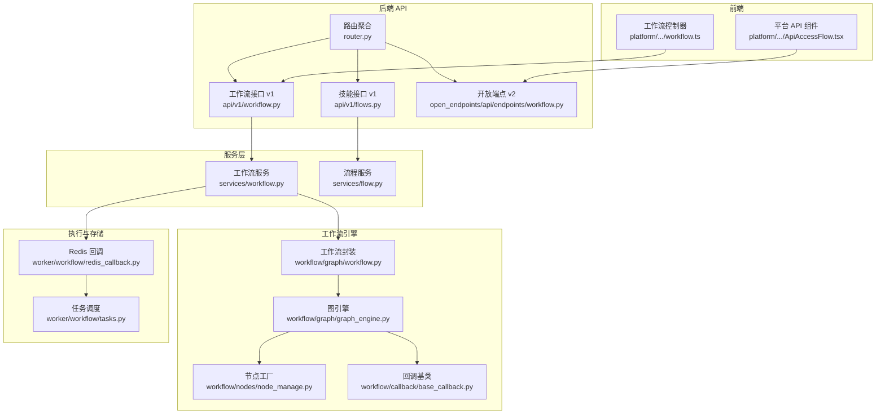
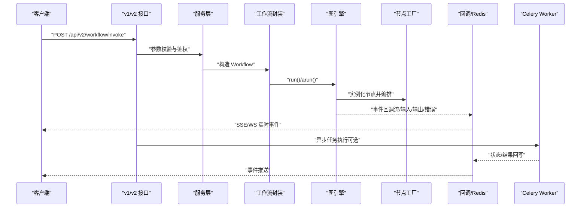
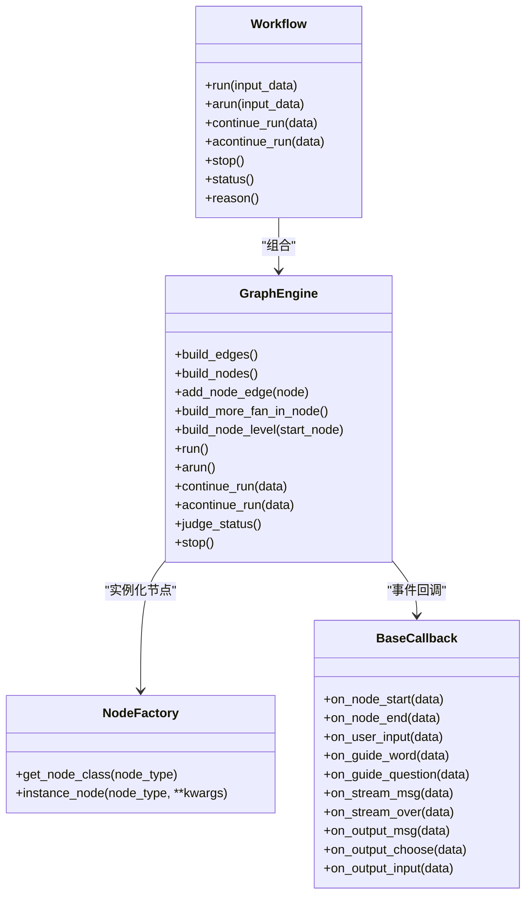
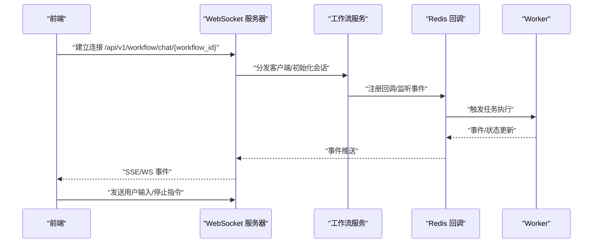
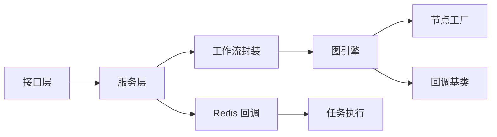

# 工作流 API

<cite>
**本文引用的文件**
- [src/backend/bisheng/api/router.py](file://src/backend/bisheng/api/router.py)
- [src/backend/bisheng/api/v1/workflow.py](file://src/backend/bisheng/api/v1/workflow.py)
- [src/backend/bisheng/api/v1/flows.py](file://src/backend/bisheng/api/v1/flows.py)
- [src/backend/bisheng/api/v1/schema/workflow.py](file://src/backend/bisheng/api/v1/schema/workflow.py)
- [src/backend/bisheng/api/v1/schemas.py](file://src/backend/bisheng/api/v1/schemas.py)
- [src/backend/bisheng/api/services/workflow.py](file://src/backend/bisheng/api/services/workflow.py)
- [src/backend/bisheng/api/services/flow.py](file://src/backend/bisheng/api/services/flow.py)
- [src/backend/bisheng/open_endpoints/api/endpoints/workflow.py](file://src/backend/bisheng/open_endpoints/api/endpoints/workflow.py)
- [src/backend/bisheng/workflow/graph/workflow.py](file://src/backend/bisheng/workflow/graph/workflow.py)
- [src/backend/bisheng/workflow/graph/graph_engine.py](file://src/backend/bisheng/workflow/graph/graph_engine.py)
- [src/backend/bisheng/workflow/nodes/node_manage.py](file://src/backend/bisheng/workflow/nodes/node_manage.py)
- [src/backend/bisheng/workflow/callback/base_callback.py](file://src/backend/bisheng/workflow/callback/base_callback.py)
- [src/backend/bisheng/worker/workflow/redis_callback.py](file://src/backend/bisheng/worker/workflow/redis_callback.py)
- [src/backend/bisheng/worker/workflow/tasks.py](file://src/backend/bisheng/worker/workflow/tasks.py)
- [src/frontend/platform/src/components/bs-comp/apiComponent/ApiAccessFlow.tsx](file://src/frontend/platform/src/components/bs-comp/apiComponent/ApiAccessFlow.tsx)
- [src/frontend/platform/src/controllers/API/workflow.ts](file://src/frontend/platform/src/controllers/API/workflow.ts)
</cite>

## 目录
1. [简介](#简介)
2. [项目结构](#项目结构)
3. [核心组件](#核心组件)
4. [架构总览](#架构总览)
5. [详细组件分析](#详细组件分析)
6. [依赖关系分析](#依赖关系分析)
7. [性能考量](#性能考量)
8. [故障排查指南](#故障排查指南)
9. [结论](#结论)
10. [附录](#附录)

## 简介
本文件为 Bisheng 工作流系统的全面 API 文档，覆盖工作流的创建、编辑、版本管理、上线/下线、执行与回调、实时通信、节点与连接管理、以及工作流验证等能力。文档同时给出最佳实践建议，帮助开发者高效集成与优化。

## 项目结构
后端采用 FastAPI 路由组织，v1 提供工作流与技能通用接口，v2 提供开放端点（OpenAPI）接口。前端通过平台与客户端分别提供工作流构建与调用示例。

图表来源
- [src/backend/bisheng/api/router.py](file://src/backend/bisheng/api/router.py#L23-L61)
- [src/backend/bisheng/api/v1/workflow.py](file://src/backend/bisheng/api/v1/workflow.py#L32-L312)
- [src/backend/bisheng/api/v1/flows.py](file://src/backend/bisheng/api/v1/flows.py#L26-L226)
- [src/backend/bisheng/open_endpoints/api/endpoints/workflow.py](file://src/backend/bisheng/open_endpoints/api/endpoints/workflow.py#L1-L154)
- [src/backend/bisheng/api/services/workflow.py](file://src/backend/bisheng/api/services/workflow.py#L35-L451)
- [src/backend/bisheng/api/services/flow.py](file://src/backend/bisheng/api/services/flow.py#L38-L491)
- [src/backend/bisheng/workflow/graph/workflow.py](file://src/backend/bisheng/workflow/graph/workflow.py#L10-L92)
- [src/backend/bisheng/workflow/graph/graph_engine.py](file://src/backend/bisheng/workflow/graph/graph_engine.py#L27-L388)
- [src/backend/bisheng/workflow/nodes/node_manage.py](file://src/backend/bisheng/workflow/nodes/node_manage.py#L33-L44)
- [src/backend/bisheng/workflow/callback/base_callback.py](file://src/backend/bisheng/workflow/callback/base_callback.py#L8-L47)
- [src/backend/bisheng/worker/workflow/redis_callback.py](file://src/backend/bisheng/worker/workflow/redis_callback.py#L33-L268)
- [src/backend/bisheng/worker/workflow/tasks.py](file://src/backend/bisheng/worker/workflow/tasks.py#L34-L61)
- [src/frontend/platform/src/components/bs-comp/apiComponent/ApiAccessFlow.tsx](file://src/frontend/platform/src/components/bs-comp/apiComponent/ApiAccessFlow.tsx#L64-L85)
- [src/frontend/platform/src/controllers/API/workflow.ts](file://src/frontend/platform/src/controllers/API/workflow.ts#L61-L161)

章节来源
- [src/backend/bisheng/api/router.py](file://src/backend/bisheng/api/router.py#L23-L61)

## 核心组件
- 路由与版本
  - v1 路由聚合：统一挂载工作流、技能、聊天、组件等接口。
  - v2 路由聚合：开放端点（如工作流执行、聊天、知识库等）。
- 工作流接口（v1）
  - 写权限校验、报告模板文件、单节点运行、WebSocket 聊天、创建/读取/更新/删除工作流、版本管理、状态变更、列表查询等。
- 技能接口（v1）
  - 技能创建/读取/更新/删除、版本管理、比较与流式对比。
- 工作流服务
  - 列表扩展字段、单节点运行、状态更新、事件转换、常用/未分类工作流查询等。
- 流程服务
  - 版本列表/详情/创建/更新/删除、当前版本切换、在线校验、比较任务与流式输出。
- 执行与回调
  - 工作流封装、图引擎构建与运行、节点工厂映射、回调基类、Redis 回调与任务执行。
- 前端
  - 平台侧提供 v2 工作流执行与停止接口示例，控制器封装版本管理与运行接口。

章节来源
- [src/backend/bisheng/api/v1/workflow.py](file://src/backend/bisheng/api/v1/workflow.py#L32-L312)
- [src/backend/bisheng/api/v1/flows.py](file://src/backend/bisheng/api/v1/flows.py#L26-L226)
- [src/backend/bisheng/api/services/workflow.py](file://src/backend/bisheng/api/services/workflow.py#L35-L451)
- [src/backend/bisheng/api/services/flow.py](file://src/backend/bisheng/api/services/flow.py#L38-L491)
- [src/backend/bisheng/workflow/graph/workflow.py](file://src/backend/bisheng/workflow/graph/workflow.py#L10-L92)
- [src/backend/bisheng/workflow/graph/graph_engine.py](file://src/backend/bisheng/workflow/graph/graph_engine.py#L27-L388)
- [src/backend/bisheng/workflow/nodes/node_manage.py](file://src/backend/bisheng/workflow/nodes/node_manage.py#L33-L44)
- [src/backend/bisheng/workflow/callback/base_callback.py](file://src/backend/bisheng/workflow/callback/base_callback.py#L8-L47)
- [src/backend/bisheng/worker/workflow/redis_callback.py](file://src/backend/bisheng/worker/workflow/redis_callback.py#L33-L268)
- [src/backend/bisheng/worker/workflow/tasks.py](file://src/backend/bisheng/worker/workflow/tasks.py#L34-L61)
- [src/frontend/platform/src/components/bs-comp/apiComponent/ApiAccessFlow.tsx](file://src/frontend/platform/src/components/bs-comp/apiComponent/ApiAccessFlow.tsx#L64-L85)
- [src/frontend/platform/src/controllers/API/workflow.ts](file://src/frontend/platform/src/controllers/API/workflow.ts#L61-L161)

## 架构总览
工作流从“接口层”进入，经“服务层”进行权限与业务逻辑处理，最终由“工作流引擎”驱动执行，并通过“回调/任务”实现异步与实时通信。

图表来源
- [src/backend/bisheng/api/v1/workflow.py](file://src/backend/bisheng/api/v1/workflow.py#L135-L144)
- [src/backend/bisheng/open_endpoints/api/endpoints/workflow.py](file://src/backend/bisheng/open_endpoints/api/endpoints/workflow.py#L1-L154)
- [src/backend/bisheng/api/services/workflow.py](file://src/backend/bisheng/api/services/workflow.py#L114-L178)
- [src/backend/bisheng/workflow/graph/workflow.py](file://src/backend/bisheng/workflow/graph/workflow.py#L50-L82)
- [src/backend/bisheng/workflow/graph/graph_engine.py](file://src/backend/bisheng/workflow/graph/graph_engine.py#L288-L357)
- [src/backend/bisheng/workflow/nodes/node_manage.py](file://src/backend/bisheng/workflow/nodes/node_manage.py#L33-L44)
- [src/backend/bisheng/worker/workflow/redis_callback.py](file://src/backend/bisheng/worker/workflow/redis_callback.py#L33-L268)
- [src/backend/bisheng/worker/workflow/tasks.py](file://src/backend/bisheng/worker/workflow/tasks.py#L53-L61)

## 详细组件分析

### 工作流接口（v1）
- 写权限校验
  - 方法：GET /api/v1/workflow/write/auth
  - 参数：flow_id, flow_type
  - 返回：200 表示有写权限
- 报告模板文件
  - 获取：GET /api/v1/workflow/report/file
  - 复制：POST /api/v1/workflow/report/copy
  - 回调保存：POST /api/v1/workflow/report/callback
- 单节点运行
  - 方法：POST /api/v1/workflow/run_once
  - 用途：调试或独立节点测试
- WebSocket 聊天
  - 路径：/api/v1/workflow/chat/{workflow_id}
  - 作用：实时事件推送与用户输入交互
- 创建/读取/更新/删除工作流
  - 创建：POST /api/v1/workflow/create
  - 读取：GET /api/v1/workflow/get_one_flow/{flow_id}
  - 更新：PATCH /api/v1/workflow/update/{flow_id}
  - 删除：DELETE /api/v1/workflow/{flow_id}
- 版本管理
  - 查询版本列表：GET /api/v1/workflow/versions
  - 创建版本：POST /api/v1/workflow/versions
  - 更新版本：PUT /api/v1/workflow/versions/{version_id}
  - 删除版本：DELETE /api/v1/workflow/versions/{version_id}
  - 获取版本详情：GET /api/v1/workflow/versions/{version_id}
  - 切换当前版本：POST /api/v1/workflow/change_version
- 状态变更与列表
  - 上线/下线：PATCH /api/v1/workflow/status
  - 列表：GET /api/v1/workflow/list

章节来源
- [src/backend/bisheng/api/v1/workflow.py](file://src/backend/bisheng/api/v1/workflow.py#L35-L312)

### 技能接口（v1）
- 创建/读取/更新/删除技能
  - 创建：POST /api/v1/flows/
  - 读取：GET /api/v1/flows/{flow_id}
  - 更新：PATCH /api/v1/flows/{flow_id}
  - 删除：DELETE /api/v1/flows/{flow_id}
- 版本管理与比较
  - 版本列表/详情/创建/更新/删除与切换当前版本同上
  - 比较：POST /api/v1/flows/compare
  - 流式比较：GET /api/v1/flows/compare/stream

章节来源
- [src/backend/bisheng/api/v1/flows.py](file://src/backend/bisheng/api/v1/flows.py#L29-L226)

### 开放端点（v2）
- 工作流执行与停止
  - 执行：POST /api/v2/workflow/invoke
  - 停止：POST /api/v2/workflow/stop
- WebSocket
  - 路径：/api/v2/workflow/chat/{workflow_id}

章节来源
- [src/backend/bisheng/open_endpoints/api/endpoints/workflow.py](file://src/backend/bisheng/open_endpoints/api/endpoints/workflow.py#L1-L154)
- [src/frontend/platform/src/components/bs-comp/apiComponent/ApiAccessFlow.tsx](file://src/frontend/platform/src/components/bs-comp/apiComponent/ApiAccessFlow.tsx#L64-L85)

### 数据模型与事件
- 工作流事件类型
  - 节点运行、引导词、引导问题、用户输入、输出消息、带输入输出、流式消息、关闭、错误
- 输入/输出模式
  - 支持表单输入、内联输入、选择输入、文件上传等
- 事件结构
  - 包含事件类型、消息 ID、节点信息、输出/输入模式、状态等

章节来源
- [src/backend/bisheng/api/v1/schema/workflow.py](file://src/backend/bisheng/api/v1/schema/workflow.py#L7-L73)
- [src/backend/bisheng/api/v1/schemas.py](file://src/backend/bisheng/api/v1/schemas.py#L159-L178)

### 工作流服务与流程服务
- 工作流服务
  - 列表扩展字段、单节点运行、状态更新、事件转换、常用/未分类工作流查询
- 流程服务
  - 版本 CRUD、当前版本切换、在线校验、比较任务与流式输出、钩子（创建/更新/删除）

章节来源
- [src/backend/bisheng/api/services/workflow.py](file://src/backend/bisheng/api/services/workflow.py#L35-L451)
- [src/backend/bisheng/api/services/flow.py](file://src/backend/bisheng/api/services/flow.py#L38-L491)

### 执行与回调
- 工作流封装
  - run/arun、继续执行、保存用户输入历史、停止、状态/原因查询
- 图引擎
  - 构建边与节点、多路汇聚处理、条件分支、LangGraph 编译与中断点设置
- 节点工厂
  - 节点类型到类映射，按类型实例化
- 回调基类
  - 节点开始/结束、用户输入、引导词/问题、流式消息、输出消息/输入/选择、错误
- Redis 回调
  - 事件键、状态键、输入键、停止键、过期时间、同步/异步响应流
- 任务执行
  - 状态判断、对象持久化、失败清理、超时检测

图表来源
- [src/backend/bisheng/workflow/graph/workflow.py](file://src/backend/bisheng/workflow/graph/workflow.py#L10-L92)
- [src/backend/bisheng/workflow/graph/graph_engine.py](file://src/backend/bisheng/workflow/graph/graph_engine.py#L27-L388)
- [src/backend/bisheng/workflow/nodes/node_manage.py](file://src/backend/bisheng/workflow/nodes/node_manage.py#L33-L44)
- [src/backend/bisheng/workflow/callback/base_callback.py](file://src/backend/bisheng/workflow/callback/base_callback.py#L8-L47)

章节来源
- [src/backend/bisheng/workflow/graph/workflow.py](file://src/backend/bisheng/workflow/graph/workflow.py#L10-L92)
- [src/backend/bisheng/workflow/graph/graph_engine.py](file://src/backend/bisheng/workflow/graph/graph_engine.py#L27-L388)
- [src/backend/bisheng/workflow/nodes/node_manage.py](file://src/backend/bisheng/workflow/nodes/node_manage.py#L33-L44)
- [src/backend/bisheng/workflow/callback/base_callback.py](file://src/backend/bisheng/workflow/callback/base_callback.py#L8-L47)

### 节点与连接管理
- 节点类型映射
  - START/END/INPUT/OUTPUT/TOOL/RAG/REPORT/QA_RETRIEVER/CONDITION/AGENT/CODE/LLM/KNOWLEDGE_RETRIEVER
- 边处理
  - 更新源/目标句柄、根据组节点更新边、校验连接合法性
- 前端连接校验
  - 选择性校验、自由输出节点数量限制、代理字段处理

章节来源
- [src/backend/bisheng/workflow/nodes/node_manage.py](file://src/backend/bisheng/workflow/nodes/node_manage.py#L16-L30)
- [src/backend/bisheng/graph/graph/utils.py](file://src/backend/bisheng/graph/graph/utils.py#L189-L227)
- [src/frontend/platform/src/util/reactflowUtils.ts](file://src/frontend/platform/src/util/reactflowUtils.ts#L294-L301)
- [src/frontend/platform/src/util/reactflowUtils.ts](file://src/frontend/platform/src/util/reactflowUtils.ts#L330-L371)
- [src/frontend/platform/src/util/reactflowUtils.ts](file://src/frontend/platform/src/util/reactflowUtils.ts#L805-L834)

### 工作流验证与状态变更
- 在线上线前校验
  - 技能/工作流在上线时进行构建校验，避免非法图结构
- 状态变更
  - 上线/下线、当前版本切换、写权限校验
- 事件转换
  - 将聊天响应转换为工作流事件，支持流式、输入、输出、错误等

章节来源
- [src/backend/bisheng/api/v1/flows.py](file://src/backend/bisheng/api/v1/flows.py#L126-L170)
- [src/backend/bisheng/api/v1/workflow.py](file://src/backend/bisheng/api/v1/workflow.py#L286-L292)
- [src/backend/bisheng/api/services/workflow.py](file://src/backend/bisheng/api/services/workflow.py#L180-L212)
- [src/backend/bisheng/api/services/workflow.py](file://src/backend/bisheng/api/services/workflow.py#L214-L335)

### 实时通信与回调
- SSE/WS
  - 通过 WebSocket 推送事件，支持用户输入、流式输出、错误等
- Redis 回调
  - 事件键、状态键、输入键、停止键，配合 Celery Worker 异步执行
- 前端示例
  - 平台侧提供 v2 工作流执行与停止接口示例，控制器封装版本管理与运行接口

图表来源
- [src/backend/bisheng/api/v1/workflow.py](file://src/backend/bisheng/api/v1/workflow.py#L146-L157)
- [src/backend/bisheng/api/services/workflow.py](file://src/backend/bisheng/api/services/workflow.py#L214-L256)
- [src/backend/bisheng/worker/workflow/redis_callback.py](file://src/backend/bisheng/worker/workflow/redis_callback.py#L33-L268)
- [src/backend/bisheng/worker/workflow/tasks.py](file://src/backend/bisheng/worker/workflow/tasks.py#L34-L61)
- [src/frontend/platform/src/components/bs-comp/apiComponent/ApiAccessFlow.tsx](file://src/frontend/platform/src/components/bs-comp/apiComponent/ApiAccessFlow.tsx#L64-L85)
- [src/frontend/platform/src/controllers/API/workflow.ts](file://src/frontend/platform/src/controllers/API/workflow.ts#L61-L161)

## 依赖关系分析
- 路由聚合
  - v1 路由挂载工作流、技能、聊天、组件、评估、标签、工作站等接口
  - v2 路由挂载开放端点（知识库、文件库、聊天、技能、助手、工作流、LLM）
- 服务层依赖
  - 工作流服务依赖工作流封装、图引擎、节点工厂、回调基类
  - 流程服务依赖 DAO/模型与处理工具
- 执行链路
  - 接口 → 服务 → 工作流封装 → 图引擎 → 节点工厂 → 回调/Redis → Worker

图表来源
- [src/backend/bisheng/api/router.py](file://src/backend/bisheng/api/router.py#L23-L61)
- [src/backend/bisheng/api/services/workflow.py](file://src/backend/bisheng/api/services/workflow.py#L35-L451)
- [src/backend/bisheng/workflow/graph/workflow.py](file://src/backend/bisheng/workflow/graph/workflow.py#L10-L92)
- [src/backend/bisheng/workflow/graph/graph_engine.py](file://src/backend/bisheng/workflow/graph/graph_engine.py#L27-L388)
- [src/backend/bisheng/workflow/nodes/node_manage.py](file://src/backend/bisheng/workflow/nodes/node_manage.py#L33-L44)
- [src/backend/bisheng/workflow/callback/base_callback.py](file://src/backend/bisheng/workflow/callback/base_callback.py#L8-L47)
- [src/backend/bisheng/worker/workflow/redis_callback.py](file://src/backend/bisheng/worker/workflow/redis_callback.py#L33-L268)
- [src/backend/bisheng/worker/workflow/tasks.py](file://src/backend/bisheng/worker/workflow/tasks.py#L34-L61)

章节来源
- [src/backend/bisheng/api/router.py](file://src/backend/bisheng/api/router.py#L23-L61)

## 性能考量
- 异步执行与并发
  - 使用异步图引擎与回调，减少阻塞；合理设置 recursion_limit 与 max_steps
- 缓存与预热
  - 流式比较与缓存执行，降低重复计算开销
- 资源隔离
  - 条件/输出节点的互斥路径与多路汇聚处理，避免不必要的等待
- 超时与重试
  - Redis 回调设置过期时间与超时检测，防止长时间占用资源

## 故障排查指南
- 常见错误
  - 未授权：返回 401/403
  - 名称冲突：创建工作流/版本时名称已存在
  - 在线上编辑：在线状态下禁止修改版本数据
  - 版本删除：当前版本不可删除
- 定位方法
  - 查看事件状态键与输入键，确认是否进入等待/错误状态
  - 检查 Worker 是否繁忙或任务队列积压
  - 校验图结构：确保每个节点至少有一条边，避免孤立节点
- 建议
  - 对外暴露的 v2 接口优先用于自动化场景，v1 接口适合平台管理
  - 使用流式对比与版本切换前先做构建校验

章节来源
- [src/backend/bisheng/api/v1/workflow.py](file://src/backend/bisheng/api/v1/workflow.py#L266-L268)
- [src/backend/bisheng/api/services/flow.py](file://src/backend/bisheng/api/services/flow.py#L62-L92)
- [src/backend/bisheng/worker/workflow/redis_callback.py](file://src/backend/bisheng/worker/workflow/redis_callback.py#L249-L268)

## 结论
Bisheng 工作流系统通过清晰的接口分层、完善的版本与状态管理、强大的图引擎与回调机制，提供了从设计到执行再到实时反馈的完整能力。结合本文的接口规范与最佳实践，可快速集成并稳定运行复杂工作流。

## 附录
- 前端集成要点
  - 使用平台提供的 v2 工作流执行与停止接口示例
  - 控制器封装版本管理与运行接口，便于复用
- 设计模式与最佳实践
  - 使用节点工厂统一实例化，便于扩展新节点类型
  - 通过回调抽象事件，便于接入不同传输层（SSE/WS/Redis）
  - 对外暴露 v2 接口，内部保留 v1 管理接口，保持职责分离

章节来源
- [src/frontend/platform/src/components/bs-comp/apiComponent/ApiAccessFlow.tsx](file://src/frontend/platform/src/components/bs-comp/apiComponent/ApiAccessFlow.tsx#L64-L85)
- [src/frontend/platform/src/controllers/API/workflow.ts](file://src/frontend/platform/src/controllers/API/workflow.ts#L61-L161)