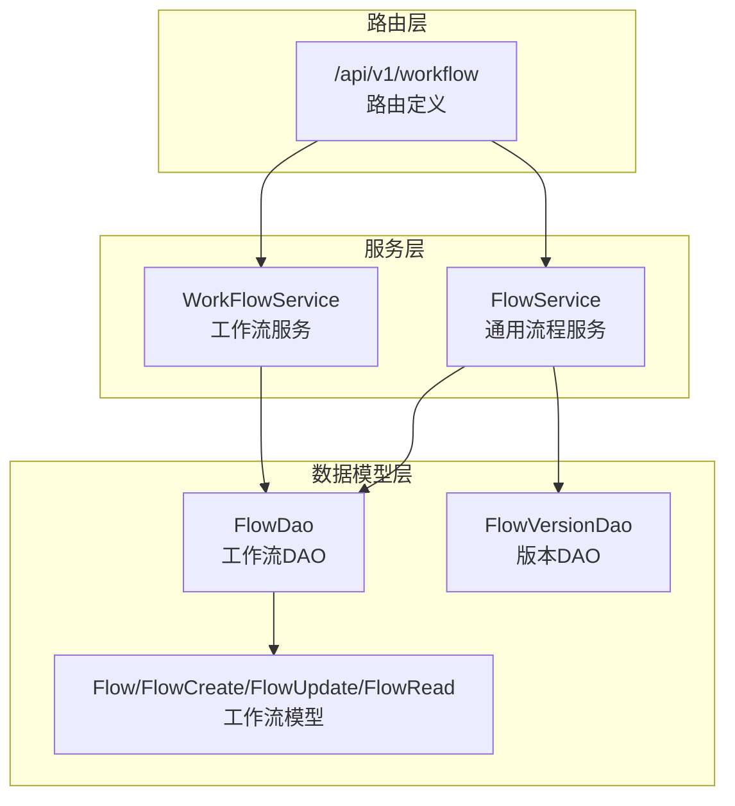
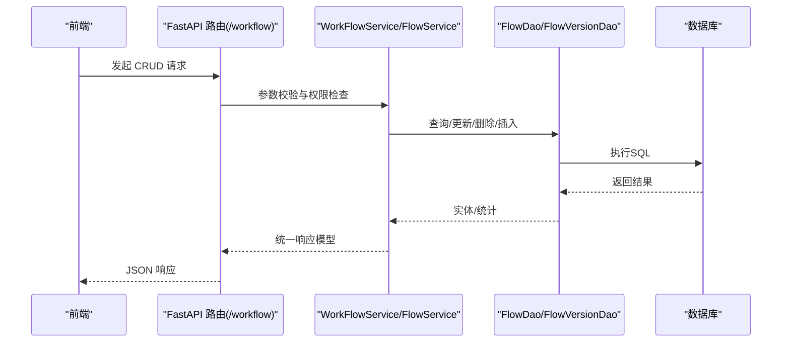
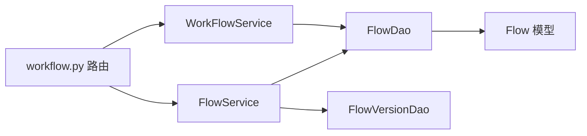

# 工作流 CRUD API

<cite>
**本文引用的文件**
- [src/backend/bisheng/api/v1/workflow.py](file://src/backend/bisheng/api/v1/workflow.py)
- [src/backend/bisheng/api/services/workflow.py](file://src/backend/bisheng/api/services/workflow.py)
- [src/backend/bisheng/api/services/flow.py](file://src/backend/bisheng/api/services/flow.py)
- [src/backend/bisheng/database/models/flow.py](file://src/backend/bisheng/database/models/flow.py)
- [src/backend/bisheng/api/v1/schema/workflow.py](file://src/backend/bisheng/api/v1/schema/workflow.py)
- [src/backend/bisheng/common/dependencies/user_deps.py](file://src/backend/bisheng/common/dependencies/user_deps.py)
- [src/backend/bisheng/common/constants/enums/telemetry.py](file://src/backend/bisheng/common/constants/enums/telemetry.py)
- [src/backend/bisheng/api/v1/__init__.py](file://src/backend/bisheng/api/v1/__init__.py)
- [src/backend/bisheng/open_endpoints/api/endpoints/workflow.py](file://src/backend/bisheng/open_endpoints/api/endpoints/workflow.py)
- [src/frontend/platform/src/controllers/API/workflow.ts](file://src/frontend/platform/src/controllers/API/workflow.ts)
- [src/frontend/platform/src/controllers/API/flow.ts](file://src/frontend/platform/src/controllers/API/flow.ts)
</cite>

## 目录
1. [简介](#简介)
2. [项目结构](#项目结构)
3. [核心组件](#核心组件)
4. [架构总览](#架构总览)
5. [详细组件分析](#详细组件分析)
6. [依赖关系分析](#依赖关系分析)
7. [性能考量](#性能考量)
8. [故障排查指南](#故障排查指南)
9. [结论](#结论)
10. [附录](#附录)

## 简介
本文件面向后端与前端开发者，系统化梳理工作流 CRUD API 的设计与实现，覆盖以下主题：
- 工作流基本信息管理：名称、描述、标签、状态、Logo 等字段的增删改查与版本化管理
- 权限控制与访问校验：基于用户角色与资源授权的读写权限判定
- 安全检查与错误处理：统一的错误码与异常返回策略
- 批量操作、分页查询与过滤条件：按名称、标签、类型、状态等维度筛选
- 版本管理：版本创建、切换、更新、删除与在线编辑限制
- 流式事件与 WebSocket：工作流执行过程中的事件推送与交互

## 项目结构
工作流 API 主要由三层构成：
- 路由层：定义 HTTP 接口与参数解析
- 服务层：封装业务逻辑、权限校验、审计日志与遥测事件
- 数据模型层：定义实体、DAO 查询方法与枚举常量

图表来源
- [src/backend/bisheng/api/v1/workflow.py](file://src/backend/bisheng/api/v1/workflow.py#L32-L312)
- [src/backend/bisheng/api/services/workflow.py](file://src/backend/bisheng/api/services/workflow.py#L35-L451)
- [src/backend/bisheng/api/services/flow.py](file://src/backend/bisheng/api/services/flow.py#L38-L491)
- [src/backend/bisheng/database/models/flow.py](file://src/backend/bisheng/database/models/flow.py#L80-L650)

章节来源
- [src/backend/bisheng/api/v1/workflow.py](file://src/backend/bisheng/api/v1/workflow.py#L32-L312)
- [src/backend/bisheng/api/services/workflow.py](file://src/backend/bisheng/api/services/workflow.py#L35-L451)
- [src/backend/bisheng/api/services/flow.py](file://src/backend/bisheng/api/services/flow.py#L38-L491)
- [src/backend/bisheng/database/models/flow.py](file://src/backend/bisheng/database/models/flow.py#L80-L650)

## 核心组件
- 路由器与端点
  - 工作流 CRUD：创建、读取、更新、版本列表、版本创建、版本更新、版本删除、版本切换、当前版本变更、状态变更、列表查询
  - 写入权限校验：针对工作流写权限的快速校验
  - 报告模板：报告模板文件生成、复制与回调上传
  - 单节点执行：一次性节点执行能力
  - WebSocket：工作流聊天通道
- 服务层
  - WorkFlowService：工作流执行、状态变更、常用/未分类工作流查询、事件转换等
  - FlowService：版本管理、权限校验、审计日志与遥测事件记录、Logo 分享链接处理
- 数据模型
  - Flow/FlowCreate/FlowUpdate/FlowRead：工作流实体与字段约束
  - FlowDao：工作流查询、计数、更新、删除、分页与联合查询
  - 枚举：FlowStatus、FlowType、AccessType 等

章节来源
- [src/backend/bisheng/api/v1/workflow.py](file://src/backend/bisheng/api/v1/workflow.py#L35-L312)
- [src/backend/bisheng/api/services/workflow.py](file://src/backend/bisheng/api/services/workflow.py#L35-L451)
- [src/backend/bisheng/api/services/flow.py](file://src/backend/bisheng/api/services/flow.py#L38-L491)
- [src/backend/bisheng/database/models/flow.py](file://src/backend/bisheng/database/models/flow.py#L26-L149)

## 架构总览
工作流 API 的调用链路如下：

图表来源
- [src/backend/bisheng/api/v1/workflow.py](file://src/backend/bisheng/api/v1/workflow.py#L159-L312)
- [src/backend/bisheng/api/services/workflow.py](file://src/backend/bisheng/api/services/workflow.py#L114-L212)
- [src/backend/bisheng/api/services/flow.py](file://src/backend/bisheng/api/services/flow.py#L139-L215)
- [src/backend/bisheng/database/models/flow.py](file://src/backend/bisheng/database/models/flow.py#L109-L149)

## 详细组件分析

### 1) 工作流基本信息管理 API
- 创建工作流
  - 方法与路径：POST /api/v1/workflow/create
  - 请求体：FlowCreate（包含 name、description、logo、data 等）
  - 行为：校验同名冲突、设置默认值、创建工作流与初始版本、触发创建钩子（表单变量提取、用户组关联、审计日志、遥测事件）
  - 响应：FlowRead（含 version_id）
  - 错误：名称重复时返回特定错误码
- 读取工作流
  - 方法与路径：GET /api/v1/workflow/get_one_flow/{flow_id}
  - 行为：根据资源授权或分享链接校验读取权限，返回工作流详情（Logo 处理为可访问链接）
- 更新工作流
  - 方法与路径：PATCH /api/v1/workflow/update/{flow_id}
  - 请求体：FlowUpdate（name、logo、description、data、status、guide_word 等）
  - 行为：写权限校验；若工作流已上线且非下线操作，禁止修改；记录遥测事件与更新钩子
  - 注意：部分字段（如 data、create_time、update_time）不支持直接更新
- 状态变更
  - 方法与路径：PATCH /api/v1/workflow/status
  - 请求体：flow_id、version_id、status
  - 行为：写权限校验；上线前进行初始化校验；成功后切换当前版本并记录事件
- 列表查询
  - 方法与路径：GET /api/v1/workflow/list
  - 查询参数：name、tag_id、flow_type、page_size、page_num、status、managed
  - 行为：管理员可见全部；普通用户受角色/授权范围限制；支持标签过滤、类型过滤、状态过滤、分页；附加 write、version_list、group_ids、tags、logo 等扩展字段

章节来源
- [src/backend/bisheng/api/v1/workflow.py](file://src/backend/bisheng/api/v1/workflow.py#L159-L312)
- [src/backend/bisheng/api/services/workflow.py](file://src/backend/bisheng/api/services/workflow.py#L85-L112)
- [src/backend/bisheng/api/services/flow.py](file://src/backend/bisheng/api/services/flow.py#L218-L237)
- [src/backend/bisheng/database/models/flow.py](file://src/backend/bisheng/database/models/flow.py#L89-L107)

### 2) 权限控制与访问验证
- 用户上下文：UserPayload 继承自登录用户服务，提供异步/同步权限检查方法
- 授权类型：
  - FLOW/FLOW_WRITE：通用应用
  - WORKFLOW/WORKFLOW_WRITE：工作流
  - ASSISTANT/ASSISTANT_WRITE：助手
- 校验规则：
  - 读取：按资源类型选择 ACCESS_TYPE（WORKFLOW 或 FLOW），结合资源拥有者与授权范围
  - 写入：仅资源拥有者或具备 WRITE 权限时允许；工作流上线后禁止修改 data 字段
- 写入权限快速校验：GET /api/v1/workflow/write/auth，返回布尔授权结果

章节来源
- [src/backend/bisheng/common/dependencies/user_deps.py](file://src/backend/bisheng/common/dependencies/user_deps.py#L4-L6)
- [src/backend/bisheng/api/v1/workflow.py](file://src/backend/bisheng/api/v1/workflow.py#L35-L56)
- [src/backend/bisheng/api/services/flow.py](file://src/backend/bisheng/api/services/flow.py#L94-L106)

### 3) 版本管理 API
- 版本列表
  - GET /api/v1/workflow/versions?flow_id=...
  - 返回版本列表与总数（包含已删除版本）
- 创建版本
  - POST /api/v1/workflow/versions?flow_id=...
  - 请求体：版本名称、描述、原始版本 ID、图数据
  - 行为：写权限校验；名称唯一性检查；技能类型会复制/刷新表单变量
- 更新版本
  - PUT /api/v1/workflow/versions/{version_id}
  - 请求体：name/description/data
  - 行为：上线且为工作流时禁止修改 data；记录遥测事件与更新钩子
- 删除版本
  - DELETE /api/v1/workflow/versions/{version_id}
  - 行为：禁止删除当前版本；记录遥测事件
- 切换当前版本
  - POST /api/v1/workflow/change_version
  - 行为：上线工作流禁止切换版本；切换后触发更新钩子
- 获取版本详情
  - GET /api/v1/workflow/versions/{version_id}

章节来源
- [src/backend/bisheng/api/v1/workflow.py](file://src/backend/bisheng/api/v1/workflow.py#L183-L228)
- [src/backend/bisheng/api/services/flow.py](file://src/backend/bisheng/api/services/flow.py#L41-L91)
- [src/backend/bisheng/api/services/workflow.py](file://src/backend/bisheng/api/services/workflow.py#L180-L212)

### 4) 报告模板与文件管理
- 获取报告模板文件链接
  - GET /api/v1/workflow/report/file?version_key=&workflow_id=
  - 行为：读取权限校验；若未提供 version_key 则生成新版本号；返回可访问链接与 version_key
- 复制报告模板
  - POST /api/v1/workflow/report/copy
  - 请求体：version_key
  - 行为：复制对象到新版本 key
- 回调上传（Office）
  - POST /api/v1/workflow/report/callback
  - 请求体：status、url、key
  - 行为：仅当状态为保存成功时写入 MinIO

章节来源
- [src/backend/bisheng/api/v1/workflow.py](file://src/backend/bisheng/api/v1/workflow.py#L59-L132)

### 5) 单节点执行与 WebSocket
- 单节点执行
  - POST /api/v1/workflow/run_once
  - 请求体：node_input、node_data、workflow_id
  - 行为：构建节点、注入输入、执行并返回日志与输出键值
- WebSocket 聊天通道
  - WS /api/v1/workflow/chat/{workflow_id}
  - 行为：通过聊天管理器分发客户端，支持流式事件

章节来源
- [src/backend/bisheng/api/v1/workflow.py](file://src/backend/bisheng/api/v1/workflow.py#L135-L157)
- [src/backend/bisheng/api/services/workflow.py](file://src/backend/bisheng/api/services/workflow.py#L115-L178)

### 6) 工作流事件模型
- 事件类型：引导语、问题、用户输入、输出消息、带输入/选择的输出、流式消息、关闭、错误
- 输入/输出模式：支持表单输入、内联输入、选择输入、文件上传、流式内容与来源链接
- 事件转换：将聊天响应转换为工作流事件，便于前端渲染与交互

章节来源
- [src/backend/bisheng/api/v1/schema/workflow.py](file://src/backend/bisheng/api/v1/schema/workflow.py#L7-L73)
- [src/backend/bisheng/api/services/workflow.py](file://src/backend/bisheng/api/services/workflow.py#L215-L334)

### 7) 遥测与审计
- 遥测事件：新建应用、编辑应用、应用存活等
- 审计日志：创建/更新/删除工作流的审计记录
- 记录时机：创建/更新钩子、状态变更、版本切换、删除版本等

章节来源
- [src/backend/bisheng/common/constants/enums/telemetry.py](file://src/backend/bisheng/common/constants/enums/telemetry.py#L39-L89)
- [src/backend/bisheng/api/services/flow.py](file://src/backend/bisheng/api/services/flow.py#L437-L490)
- [src/backend/bisheng/api/services/workflow.py](file://src/backend/bisheng/api/services/workflow.py#L180-L212)

### 8) 前端对接参考
- 工作流版本管理与列表查询
  - 创建/保存/删除版本、获取版本列表与详情
  - 列表查询：分页、关键词、标签、类型、管理视角
- 参考路径
  - [src/frontend/platform/src/controllers/API/workflow.ts](file://src/frontend/platform/src/controllers/API/workflow.ts#L1-L105)
  - [src/frontend/platform/src/controllers/API/flow.ts](file://src/frontend/platform/src/controllers/API/flow.ts#L152-L181)

章节来源
- [src/frontend/platform/src/controllers/API/workflow.ts](file://src/frontend/platform/src/controllers/API/workflow.ts#L1-L105)
- [src/frontend/platform/src/controllers/API/flow.ts](file://src/frontend/platform/src/controllers/API/flow.ts#L152-L181)

## 依赖关系分析
- 路由注册
  - v1 包聚合了各模块路由，确保 /workflow 路由被正确挂载
- 服务依赖
  - WorkFlowService 依赖 FlowDao、FlowVersionDao、NodeFactory、GraphState、回调与遥测
  - FlowService 依赖 FlowDao、FlowVersionDao、Tag/Group/UserLink 等 DAO，以及审计与遥测
- 数据模型
  - Flow/FlowCreate/FlowUpdate/FlowRead 定义字段与校验
  - FlowDao 提供分页、计数、联合查询、权限过滤等能力

图表来源
- [src/backend/bisheng/api/v1/workflow.py](file://src/backend/bisheng/api/v1/workflow.py#L32-L312)
- [src/backend/bisheng/api/services/workflow.py](file://src/backend/bisheng/api/services/workflow.py#L35-L451)
- [src/backend/bisheng/api/services/flow.py](file://src/backend/bisheng/api/services/flow.py#L38-L491)
- [src/backend/bisheng/database/models/flow.py](file://src/backend/bisheng/database/models/flow.py#L80-L149)

章节来源
- [src/backend/bisheng/api/v1/__init__.py](file://src/backend/bisheng/api/v1/__init__.py#L16-L36)

## 性能考量
- 分页与过滤：列表查询支持分页与多维过滤，建议前端按需传参，避免一次性拉取大量数据
- Logo 处理：服务层统一将相对路径转换为可访问链接，减少前端重复处理
- 异步权限与查询：读取与权限检查采用异步 DAO，降低阻塞
- 版本切换与初始化：上线前进行工作流初始化校验，避免运行期失败

[本节为通用指导，无需列出具体文件来源]

## 故障排查指南
- 常见错误码
  - 名称重复：创建工作流时名称冲突
  - 未授权：读取/写入权限不足
  - 未找到：资源不存在
  - 在线上编辑：工作流上线后禁止修改 data
  - 当前版本删除：禁止删除当前版本
- 排查步骤
  - 确认用户是否具备相应 ACCESS_TYPE 权限
  - 确认工作流状态与目标操作是否冲突
  - 检查版本是否存在、是否为当前版本
  - 查看遥测与审计日志定位异常时间点
- 相关实现
  - 错误码与异常：在服务层与路由层抛出/返回统一错误响应
  - 遥测与审计：在关键操作处记录事件与日志

章节来源
- [src/backend/bisheng/api/v1/workflow.py](file://src/backend/bisheng/api/v1/workflow.py#L162-L167)
- [src/backend/bisheng/api/services/flow.py](file://src/backend/bisheng/api/services/flow.py#L62-L91)
- [src/backend/bisheng/api/services/workflow.py](file://src/backend/bisheng/api/services/workflow.py#L180-L212)

## 结论
工作流 CRUD API 以清晰的分层设计实现了从路由、服务到数据模型的完整闭环，具备完善的权限控制、版本管理与事件流支持。通过统一的错误码与遥测/审计机制，系统在可用性与可观测性方面表现良好。建议在生产环境中配合前端按需分页与过滤、严格校验输入参数，并在上线前后做好版本与配置的回滚预案。

[本节为总结性内容，无需列出具体文件来源]

## 附录

### A. 接口清单与参数说明
- 创建工作流
  - 方法：POST /api/v1/workflow/create
  - 请求体：FlowCreate（name、description、logo、data 等）
  - 响应：FlowRead（含 version_id）
- 读取工作流
  - 方法：GET /api/v1/workflow/get_one_flow/{flow_id}
  - 响应：Flow
- 更新工作流
  - 方法：PATCH /api/v1/workflow/update/{flow_id}
  - 请求体：FlowUpdate（name、logo、description、data、status、guide_word）
  - 响应：Flow
- 状态变更
  - 方法：PATCH /api/v1/workflow/status
  - 请求体：flow_id、version_id、status
  - 响应：空
- 列表查询
  - 方法：GET /api/v1/workflow/list
  - 查询参数：name、tag_id、flow_type、page_size、page_num、status、managed
  - 响应：{ data, total }
- 写入权限校验
  - 方法：GET /api/v1/workflow/write/auth
  - 查询参数：flow_id、flow_type
  - 响应：布尔授权结果
- 版本管理
  - 列表：GET /api/v1/workflow/versions?flow_id=...
  - 创建：POST /api/v1/workflow/versions?flow_id=...
  - 更新：PUT /api/v1/workflow/versions/{version_id}
  - 删除：DELETE /api/v1/workflow/versions/{version_id}
  - 切换当前版本：POST /api/v1/workflow/change_version
  - 版本详情：GET /api/v1/workflow/versions/{version_id}
- 报告模板
  - 获取：GET /api/v1/workflow/report/file?version_key=&workflow_id=
  - 复制：POST /api/v1/workflow/report/copy
  - 回调上传：POST /api/v1/workflow/report/callback
- 单节点执行
  - 方法：POST /api/v1/workflow/run_once
  - 请求体：node_input、node_data、workflow_id
  - 响应：执行结果
- WebSocket
  - 方法：WS /api/v1/workflow/chat/{workflow_id}

章节来源
- [src/backend/bisheng/api/v1/workflow.py](file://src/backend/bisheng/api/v1/workflow.py#L35-L312)

### B. 数据模型与字段说明
- Flow/FlowCreate/FlowUpdate/FlowRead
  - 关键字段：id、name、user_id、description、data、logo、status、flow_type、guide_word、create_time、update_time
  - 校验：data 必须为合法 JSON 且包含 nodes/edges
- 枚举
  - FlowStatus：OFFLINE、ONLINE
  - FlowType：FLOW、ASSISTANT、WORKFLOW、WORKSTATION、LINSIGHT
  - AccessType：按资源类型区分读/写权限

章节来源
- [src/backend/bisheng/database/models/flow.py](file://src/backend/bisheng/database/models/flow.py#L26-L107)

### C. 事件模型与流式输出
- 事件类型：NodeRun、GuideWord、GuideQuestion、UserInput、OutputMsg、OutputWithInput、OutputWithChoose、StreamMsg、Close、Error
- 输入/输出模式：表单、内联、选择、文件、流式内容与来源链接
- 转换逻辑：将聊天响应映射为工作流事件，便于前端渲染

章节来源
- [src/backend/bisheng/api/v1/schema/workflow.py](file://src/backend/bisheng/api/v1/schema/workflow.py#L7-L73)
- [src/backend/bisheng/api/services/workflow.py](file://src/backend/bisheng/api/services/workflow.py#L215-L334)

### D. 开放端点（外部调用）
- 执行与停止（v2）
  - 执行：POST /api/v2/workflow/invoke
  - 停止：POST /api/v2/workflow/stop
  - 行为：记录应用存活事件，支持通过 session_id 控制执行生命周期

章节来源
- [src/backend/bisheng/open_endpoints/api/endpoints/workflow.py](file://src/backend/bisheng/open_endpoints/api/endpoints/workflow.py#L130-L154)