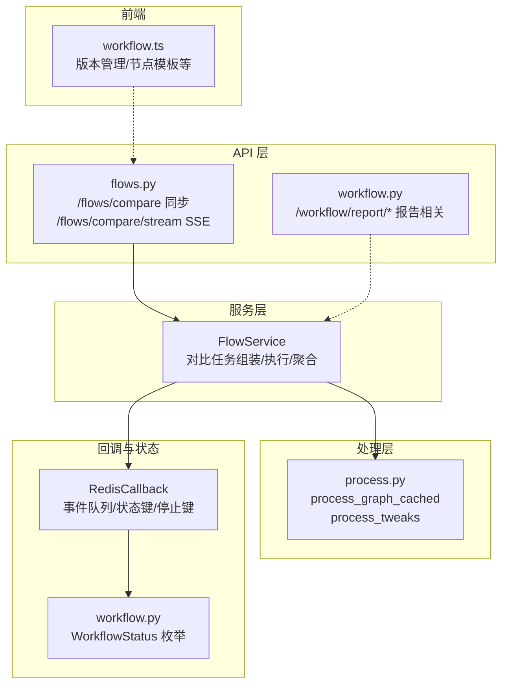
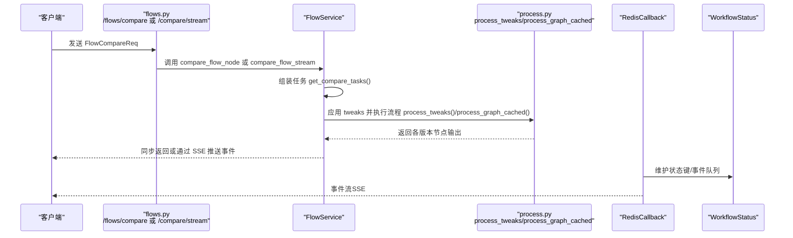
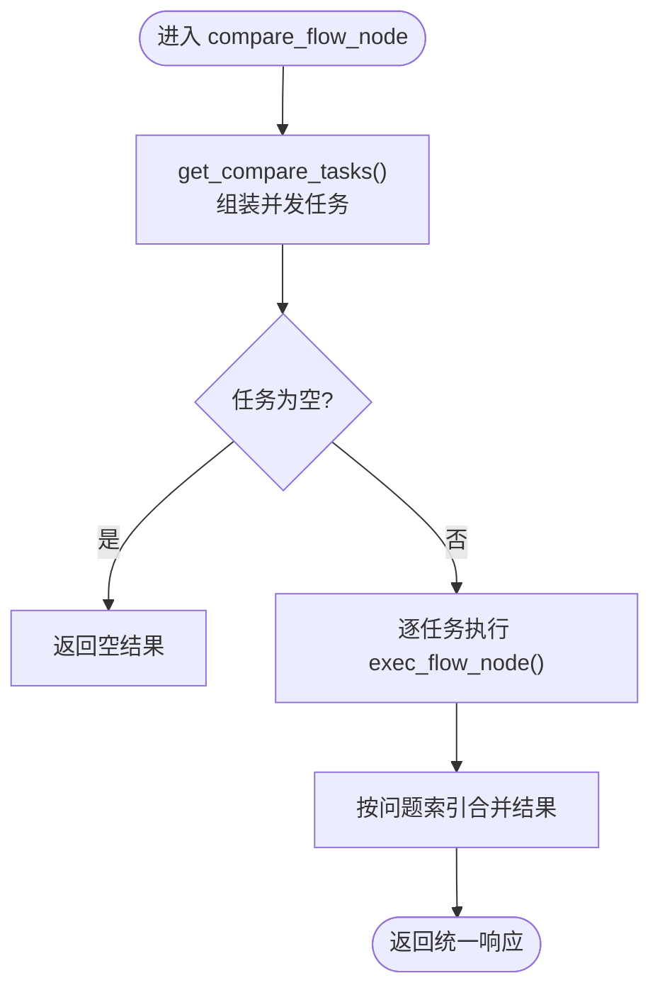
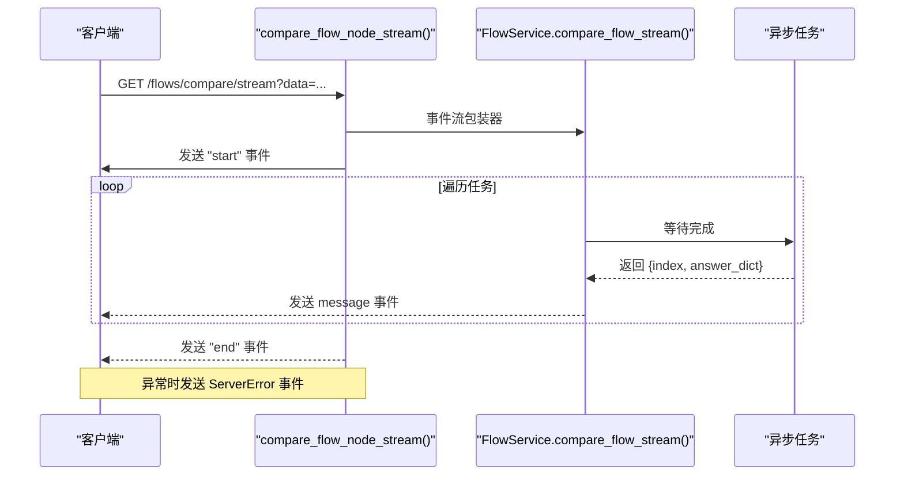
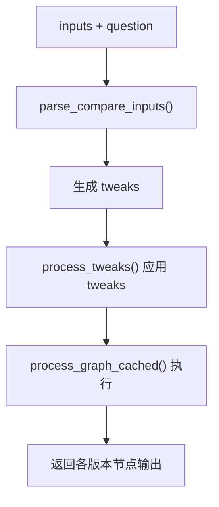
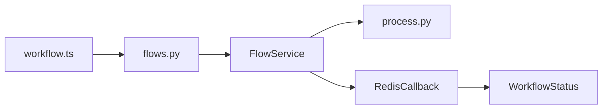

# 工作流对比分析 API

<cite>
**本文引用的文件**
- [src/backend/bisheng/api/v1/flows.py](file://src/backend/bisheng/api/v1/flows.py)
- [src/backend/bisheng/api/services/flow.py](file://src/backend/bisheng/api/services/flow.py)
- [src/backend/bisheng/api/v1/schemas.py](file://src/backend/bisheng/api/v1/schemas.py)
- [src/backend/bisheng/processing/process.py](file://src/backend/bisheng/processing/process.py)
- [src/backend/bisheng/worker/workflow/redis_callback.py](file://src/backend/bisheng/worker/workflow/redis_callback.py)
- [src/backend/bisheng/workflow/common/workflow.py](file://src/backend/bisheng/workflow/common/workflow.py)
- [src/backend/bisheng/api/v1/workflow.py](file://src/backend/bisheng/api/v1/workflow.py)
- [src/frontend/platform/src/controllers/API/workflow.ts](file://src/frontend/platform/src/controllers/API/workflow.ts)
</cite>

## 目录
1. [简介](#简介)
2. [项目结构](#项目结构)
3. [核心组件](#核心组件)
4. [架构总览](#架构总览)
5. [详细组件分析](#详细组件分析)
6. [依赖关系分析](#依赖关系分析)
7. [性能考量](#性能考量)
8. [故障排查指南](#故障排查指南)
9. [结论](#结论)
10. [附录](#附录)

## 简介
本文件为“工作流对比分析 API”的专用文档，聚焦于以下能力：
- 对比不同工作流版本在相同输入下的节点输出差异
- 支持同步与异步两种模式，异步模式支持 SSE 流式传输与事件推送
- 输出对比结果、差异标记与变更统计
- 提供工作流演进分析、版本差异报告与回归检测的实践范式

该能力通过后端路由与服务层实现，结合流程执行缓存与参数微调机制，确保对比过程高效、可扩展。

## 项目结构
围绕工作流对比分析的关键代码分布在如下模块：
- API 层：提供对比接口（同步与 SSE 异步）
- 服务层：组织任务、解析输入、执行流程、聚合结果
- 数据处理层：流程图构建、参数微调、历史记忆注入
- 回调与状态：Redis 事件队列与状态键，支撑异步事件推送
- 前端对接：版本管理与工作流节点模板等辅助能力

图表来源
- [src/backend/bisheng/api/v1/flows.py](file://src/backend/bisheng/api/v1/flows.py#L197-L226)
- [src/backend/bisheng/api/services/flow.py](file://src/backend/bisheng/api/services/flow.py#L319-L434)
- [src/backend/bisheng/processing/process.py](file://src/backend/bisheng/processing/process.py#L154-L245)
- [src/backend/bisheng/worker/workflow/redis_callback.py](file://src/backend/bisheng/worker/workflow/redis_callback.py#L33-L122)
- [src/backend/bisheng/workflow/common/workflow.py](file://src/backend/bisheng/workflow/common/workflow.py#L4-L11)
- [src/backend/bisheng/api/v1/workflow.py](file://src/backend/bisheng/api/v1/workflow.py#L59-L133)
- [src/frontend/platform/src/controllers/API/workflow.ts](file://src/frontend/platform/src/controllers/API/workflow.ts#L1-L105)

章节来源
- [src/backend/bisheng/api/v1/flows.py](file://src/backend/bisheng/api/v1/flows.py#L1-L226)
- [src/backend/bisheng/api/services/flow.py](file://src/backend/bisheng/api/services/flow.py#L1-L491)
- [src/backend/bisheng/processing/process.py](file://src/backend/bisheng/processing/process.py#L1-L357)
- [src/backend/bisheng/worker/workflow/redis_callback.py](file://src/backend/bisheng/worker/workflow/redis_callback.py#L1-L601)
- [src/backend/bisheng/workflow/common/workflow.py](file://src/backend/bisheng/workflow/common/workflow.py#L1-L11)
- [src/backend/bisheng/api/v1/workflow.py](file://src/backend/bisheng/api/v1/workflow.py#L1-L312)
- [src/frontend/platform/src/controllers/API/workflow.ts](file://src/frontend/platform/src/controllers/API/workflow.ts#L1-L105)

## 核心组件
- 对比请求模型：FlowCompareReq
  - 字段：inputs、question_list、version_list、node_id、thread_num
  - 用途：描述对比所需的输入、测试用例、版本集合、目标节点与并发度
- 对比服务 FlowService
  - 组装对比任务：get_compare_tasks
  - 解析输入并生成 tweaks：parse_compare_inputs
  - 同步对比：compare_flow_node
  - 异步对比（SSE）：compare_flow_stream
  - 执行单节点对比：exec_flow_node
- 流程执行与参数微调
  - process_tweaks：按节点 ID 应用 tweaks
  - process_graph_cached：构建/加载图并执行，支持历史记忆注入
- 异步事件与状态
  - RedisCallback：事件入队、状态键维护、停止键、错误解析
  - WorkflowStatus：WAITING/RUNNING/SUCCESS/FAILED/INPUT/INPUT_OVER

章节来源
- [src/backend/bisheng/api/v1/schemas.py](file://src/backend/bisheng/api/v1/schemas.py#L307-L313)
- [src/backend/bisheng/api/services/flow.py](file://src/backend/bisheng/api/services/flow.py#L319-L434)
- [src/backend/bisheng/processing/process.py](file://src/backend/bisheng/processing/process.py#L154-L245)
- [src/backend/bisheng/worker/workflow/redis_callback.py](file://src/backend/bisheng/worker/workflow/redis_callback.py#L33-L122)
- [src/backend/bisheng/workflow/common/workflow.py](file://src/backend/bisheng/workflow/common/workflow.py#L4-L11)

## 架构总览
对比分析的端到端流程如下：

图表来源
- [src/backend/bisheng/api/v1/flows.py](file://src/backend/bisheng/api/v1/flows.py#L197-L226)
- [src/backend/bisheng/api/services/flow.py](file://src/backend/bisheng/api/services/flow.py#L319-L434)
- [src/backend/bisheng/processing/process.py](file://src/backend/bisheng/processing/process.py#L154-L245)
- [src/backend/bisheng/worker/workflow/redis_callback.py](file://src/backend/bisheng/worker/workflow/redis_callback.py#L33-L122)
- [src/backend/bisheng/workflow/common/workflow.py](file://src/backend/bisheng/workflow/common/workflow.py#L4-L11)

## 详细组件分析

### 同步对比接口
- 路由：/flows/compare（POST）
- 请求体：FlowCompareReq
- 响应：统一响应模型，data 为对比结果数组
- 执行逻辑：
  - 组装任务：遍历 question_list × version_list，创建并发任务
  - 解析输入：parse_compare_inputs 将 inputs 中的默认字段替换为问题值，并从 data 生成 tweaks
  - 执行流程：process_tweaks + process_graph_cached
  - 聚合结果：按问题索引合并各版本输出

图表来源
- [src/backend/bisheng/api/services/flow.py](file://src/backend/bisheng/api/services/flow.py#L319-L390)

章节来源
- [src/backend/bisheng/api/v1/flows.py](file://src/backend/bisheng/api/v1/flows.py#L197-L202)
- [src/backend/bisheng/api/services/flow.py](file://src/backend/bisheng/api/services/flow.py#L319-L390)

### 异步对比接口（SSE）
- 路由：/flows/compare/stream（GET，SSE）
- 查询参数：data（JSON 字符串，反序列化为 FlowCompareReq）
- 事件类型：
  - start/end：开始/结束标记
  - message：携带 {question_index, version_id, answer}
- 执行逻辑：
  - 事件流中先发送 start，再逐个任务完成时推送 message，最后发送 end
  - 错误时转换为 ServerError 的 SSE 事件字符串

图表来源
- [src/backend/bisheng/api/v1/flows.py](file://src/backend/bisheng/api/v1/flows.py#L204-L226)
- [src/backend/bisheng/api/services/flow.py](file://src/backend/bisheng/api/services/flow.py#L391-L406)

章节来源
- [src/backend/bisheng/api/v1/flows.py](file://src/backend/bisheng/api/v1/flows.py#L204-L226)
- [src/backend/bisheng/api/services/flow.py](file://src/backend/bisheng/api/services/flow.py#L391-L406)

### 输入解析与参数微调
- parse_compare_inputs：
  - 将 inputs 中的默认字段替换为 question_list 的每个问题
  - 从 data 生成 tweaks，用于 process_tweaks 按节点覆盖参数
- process_tweaks：
  - 校验节点结构，按节点 ID 应用 tweaks
- process_graph_cached：
  - 加载/构建图对象，注入历史对话记忆，执行并返回结果

图表来源
- [src/backend/bisheng/api/services/flow.py](file://src/backend/bisheng/api/services/flow.py#L345-L369)
- [src/backend/bisheng/processing/process.py](file://src/backend/bisheng/processing/process.py#L332-L357)
- [src/backend/bisheng/processing/process.py](file://src/backend/bisheng/processing/process.py#L154-L245)

章节来源
- [src/backend/bisheng/api/services/flow.py](file://src/backend/bisheng/api/services/flow.py#L345-L369)
- [src/backend/bisheng/processing/process.py](file://src/backend/bisheng/processing/process.py#L332-L357)
- [src/backend/bisheng/processing/process.py](file://src/backend/bisheng/processing/process.py#L154-L245)

### 结果格式与差异标记
- 同步返回结构：
  - 外层：统一响应模型（status_code、status_message、data）
  - data：数组，长度等于 question_list
  - 数组元素：字典，键为版本 ID，值为对应节点输出
- 异步事件结构：
  - event: "message"
  - data: {question_index, version_id, answer}
- 差异标记与统计：
  - 可在前端或业务侧对 answer 进行 diff 计算，输出差异标记与变更统计
  - 建议以问题维度聚合，便于回归检测与版本演进分析

章节来源
- [src/backend/bisheng/api/services/flow.py](file://src/backend/bisheng/api/services/flow.py#L371-L390)
- [src/backend/bisheng/api/services/flow.py](file://src/backend/bisheng/api/services/flow.py#L391-L406)
- [src/backend/bisheng/api/v1/schemas.py](file://src/backend/bisheng/api/v1/schemas.py#L224-L232)

### 版本管理与工作流节点模板
- 版本管理：
  - /workflow/versions（GET/POST/PUT/DELETE）
  - /workflow/change_version（POST）
  - /workflow/get_one_flow/{flow_id}（GET）
- 节点模板与报告：
  - /workflow/report/file（GET）
  - /workflow/report/copy（POST）
  - /workflow/report/callback（POST）

章节来源
- [src/backend/bisheng/api/v1/workflow.py](file://src/backend/bisheng/api/v1/workflow.py#L183-L229)
- [src/backend/bisheng/api/v1/workflow.py](file://src/backend/bisheng/api/v1/workflow.py#L59-L133)
- [src/frontend/platform/src/controllers/API/workflow.ts](file://src/frontend/platform/src/controllers/API/workflow.ts#L1-L105)

## 依赖关系分析
- API 层依赖服务层：flows.py 调用 FlowService 的对比方法
- 服务层依赖处理层：FlowService 使用 process_tweaks/process_graph_cached
- 服务层依赖回调与状态：RedisCallback 用于事件与状态管理
- 前端依赖 API 控制器：workflow.ts 提供版本与节点模板等操作

图表来源
- [src/backend/bisheng/api/v1/flows.py](file://src/backend/bisheng/api/v1/flows.py#L1-L226)
- [src/backend/bisheng/api/services/flow.py](file://src/backend/bisheng/api/services/flow.py#L1-L491)
- [src/backend/bisheng/processing/process.py](file://src/backend/bisheng/processing/process.py#L1-L357)
- [src/backend/bisheng/worker/workflow/redis_callback.py](file://src/backend/bisheng/worker/workflow/redis_callback.py#L1-L601)
- [src/backend/bisheng/workflow/common/workflow.py](file://src/backend/bisheng/workflow/common/workflow.py#L1-L11)
- [src/frontend/platform/src/controllers/API/workflow.ts](file://src/frontend/platform/src/controllers/API/workflow.ts#L1-L105)

章节来源
- [src/backend/bisheng/api/v1/flows.py](file://src/backend/bisheng/api/v1/flows.py#L1-L226)
- [src/backend/bisheng/api/services/flow.py](file://src/backend/bisheng/api/services/flow.py#L1-L491)
- [src/backend/bisheng/processing/process.py](file://src/backend/bisheng/processing/process.py#L1-L357)
- [src/backend/bisheng/worker/workflow/redis_callback.py](file://src/backend/bisheng/worker/workflow/redis_callback.py#L1-L601)
- [src/backend/bisheng/workflow/common/workflow.py](file://src/backend/bisheng/workflow/common/workflow.py#L1-L11)
- [src/frontend/platform/src/controllers/API/workflow.ts](file://src/frontend/platform/src/controllers/API/workflow.ts#L1-L105)

## 性能考量
- 并发控制：thread_num 控制并发度，建议根据系统资源与任务复杂度调整
- 缓存复用：process_graph_cached 支持会话级缓存，减少重复构建成本
- 流式传输：SSE 降低等待时间，适合长耗时对比任务
- 内存与历史：process_graph_cached 注入历史记忆，可能增加内存占用，需合理设置 history_count

## 故障排查指南
- 常见错误与定位：
  - 任务为空：检查 version_list 与 question_list 是否为空
  - 执行异常：查看服务层捕获的异常并返回统一错误响应
  - SSE 异常：compare_flow_node_stream 捕获异常并转换为 ServerError 事件字符串
  - 回调失败：RedisCallback 解析失败原因并返回相应错误事件
- 建议排查步骤：
  - 确认 FlowCompareReq 参数完整
  - 检查版本数据是否可加载
  - 观察 SSE 事件流是否正常收尾（start → message×N → end）
  - 关注 Redis 状态键与事件队列是否存在堆积

章节来源
- [src/backend/bisheng/api/services/flow.py](file://src/backend/bisheng/api/services/flow.py#L371-L390)
- [src/backend/bisheng/api/v1/flows.py](file://src/backend/bisheng/api/v1/flows.py#L211-L226)
- [src/backend/bisheng/worker/workflow/redis_callback.py](file://src/backend/bisheng/worker/workflow/redis_callback.py#L156-L177)

## 结论
工作流对比分析 API 提供了灵活的同步与异步对比能力，结合参数微调与流程执行缓存，能够高效地比较不同版本在相同输入下的节点输出差异。通过 SSE 事件流，用户可实时感知对比进度与结果；结合前端版本管理与节点模板，可进一步完善工作流演进分析、版本差异报告与回归检测的闭环。

## 附录

### 接口定义与使用示例

- 同步对比
  - 方法与路径：POST /flows/compare
  - 请求体：FlowCompareReq
  - 响应：统一响应模型，data 为数组，元素为 {版本ID: 节点输出}
  - 示例场景：批量用例对比、自动化回归检测

- 异步对比（SSE）
  - 方法与路径：GET /flows/compare/stream?data=JSON
  - 事件：
    - start：开始
    - message：{question_index, version_id, answer}
    - end：结束
  - 示例场景：可视化对比面板、实时展示差异

- 版本管理
  - 获取版本列表：GET /workflow/versions?flow_id=...
  - 创建版本：POST /workflow/versions?flow_id=...
  - 切换当前版本：POST /workflow/change_version
  - 获取单个版本：GET /workflow/versions/{version_id}

- 报告与节点模板
  - 获取报告模板：GET /workflow/report/file
  - 复制报告模板：POST /workflow/report/copy
  - 回调保存报告：POST /workflow/report/callback

章节来源
- [src/backend/bisheng/api/v1/flows.py](file://src/backend/bisheng/api/v1/flows.py#L197-L226)
- [src/backend/bisheng/api/v1/workflow.py](file://src/backend/bisheng/api/v1/workflow.py#L183-L229)
- [src/backend/bisheng/api/v1/workflow.py](file://src/backend/bisheng/api/v1/workflow.py#L59-L133)
- [src/frontend/platform/src/controllers/API/workflow.ts](file://src/frontend/platform/src/controllers/API/workflow.ts#L1-L105)