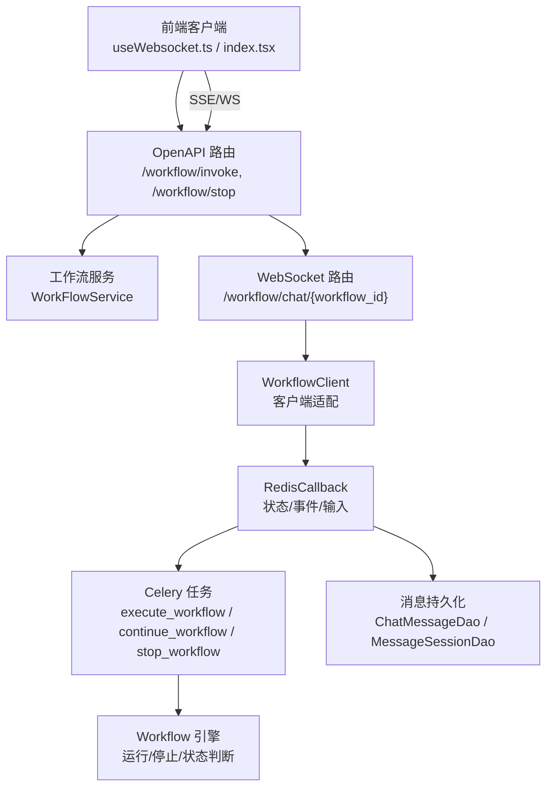
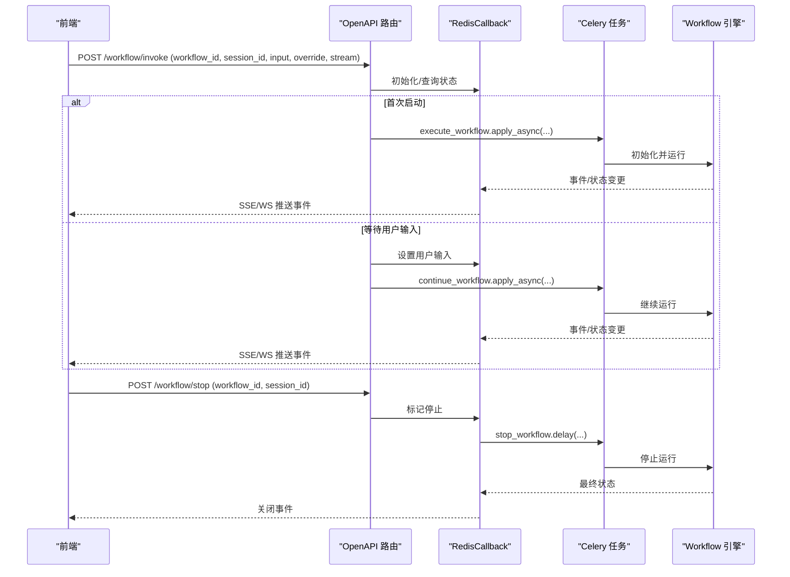
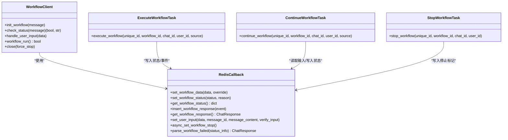

# 工作流执行控制 API

<cite>
**本文引用的文件**
- [src/backend/bisheng/open_endpoints/api/endpoints/workflow.py](file://src/backend/bisheng/open_endpoints/api/endpoints/workflow.py)
- [src/backend/bisheng/api/v1/workflow.py](file://src/backend/bisheng/api/v1/workflow.py)
- [src/backend/bisheng/chat/clients/workflow_client.py](file://src/backend/bisheng/chat/clients/workflow_client.py)
- [src/backend/bisheng/worker/workflow/redis_callback.py](file://src/backend/bisheng/worker/workflow/redis_callback.py)
- [src/backend/bisheng/worker/workflow/tasks.py](file://src/backend/bisheng/worker/workflow/tasks.py)
- [src/backend/bisheng/api/v1/schema/workflow.py](file://src/backend/bisheng/api/v1/schema/workflow.py)
- [src/backend/bisheng/workflow/common/workflow.py](file://src/backend/bisheng/workflow/common/workflow.py)
- [src/backend/bisheng/core/config/settings.py](file://src/backend/bisheng/core/config/settings.py)
- [src/backend/bisheng/worker/utils/stateful_worker.py](file://src/backend/bisheng/worker/utils/stateful_worker.py)
- [src/frontend/client/src/pages/appChat/useWebsocket.ts](file://src/frontend/client/src/pages/appChat/useWebsocket.ts)
- [src/frontend/client/src/hooks/Websocket/index.tsx](file://src/frontend/client/src/hooks/Websocket/index.tsx)
- [src/frontend/platform/src/components/bs-comp/apiComponent/ApiAccessFlow.tsx](file://src/frontend/platform/src/components/bs-comp/apiComponent/ApiAccessFlow.tsx)
</cite>

## 目录
1. [简介](#简介)
2. [项目结构](#项目结构)
3. [核心组件](#核心组件)
4. [架构总览](#架构总览)
5. [详细组件分析](#详细组件分析)
6. [依赖关系分析](#依赖关系分析)
7. [性能考量](#性能考量)
8. [故障排查指南](#故障排查指南)
9. [结论](#结论)
10. [附录：API 规范与示例](#附录api-规范与示例)

## 简介
本文件面向“工作流执行控制”的后端 API，系统性梳理工作流的启动、暂停、恢复与终止控制接口，以及状态查询、进度监控、结果获取、回调机制、事件通知与实时通信的实现细节。文档同时覆盖执行上下文、参数传递、结果处理、执行超时、重试与错误恢复策略，并提供可操作的使用示例与排障建议。

## 项目结构
围绕工作流执行控制的关键模块分布如下：
- OpenAPI 路由层：对外暴露工作流调用与停止接口，支持 SSE 流式输出与 WebSocket 实时交互
- V1 路由层：工作流版本管理、权限校验、报告模板等辅助能力
- 客户端适配层：WebSocket 客户端封装，负责初始化、状态检查、用户输入处理与运行循环
- 执行与回调层：基于 Redis 的状态/事件存储、回调分发、错误解析与超时处理
- 任务调度层：Celery 任务封装，执行/继续/停止工作流，维护全局工作流对象
- 模型与状态：事件类型、工作流状态枚举、配置项（超时、最大步数）
- 前端集成：WebSocket 处理、事件解析与 UI 更新

图表来源
- [src/backend/bisheng/open_endpoints/api/endpoints/workflow.py](file://src/backend/bisheng/open_endpoints/api/endpoints/workflow.py#L31-L175)
- [src/backend/bisheng/api/v1/workflow.py](file://src/backend/bisheng/api/v1/workflow.py#L146-L157)
- [src/backend/bisheng/chat/clients/workflow_client.py](file://src/backend/bisheng/chat/clients/workflow_client.py#L23-L212)
- [src/backend/bisheng/worker/workflow/redis_callback.py](file://src/backend/bisheng/worker/workflow/redis_callback.py#L33-L601)
- [src/backend/bisheng/worker/workflow/tasks.py](file://src/backend/bisheng/worker/workflow/tasks.py#L53-L182)

章节来源
- [src/backend/bisheng/open_endpoints/api/endpoints/workflow.py](file://src/backend/bisheng/open_endpoints/api/endpoints/workflow.py#L1-L175)
- [src/backend/bisheng/api/v1/workflow.py](file://src/backend/bisheng/api/v1/workflow.py#L1-L312)

## 核心组件
- OpenAPI 工作流路由：提供 /workflow/invoke（启动/继续）、/workflow/stop（停止）、/workflow/chat/{workflow_id}（WebSocket）三大能力
- V1 工作流路由：提供工作流版本管理、权限校验、报告模板等
- WorkflowClient：WebSocket 客户端，负责初始化、状态检查、用户输入处理与运行循环
- RedisCallback：以 Redis 为媒介的状态机与事件队列，负责工作流数据、状态、输入、事件、停止标记的存取与解析
- Celery 任务：execute_workflow、continue_workflow、stop_workflow，封装工作流生命周期
- 事件模型与状态：WorkflowEventType、WorkflowStatus、WorkflowEvent/WorkflowStream
- 配置：WorkflowConf（超时、最大步数）、Celery 路由（workflow_celery）

章节来源
- [src/backend/bisheng/api/v1/schema/workflow.py](file://src/backend/bisheng/api/v1/schema/workflow.py#L7-L73)
- [src/backend/bisheng/workflow/common/workflow.py](file://src/backend/bisheng/workflow/common/workflow.py#L4-L10)
- [src/backend/bisheng/core/config/settings.py](file://src/backend/bisheng/core/config/settings.py#L123-L127)

## 架构总览
下图展示从 API 到执行引擎的完整链路，包括状态流转、事件推送与错误恢复：

图表来源
- [src/backend/bisheng/open_endpoints/api/endpoints/workflow.py](file://src/backend/bisheng/open_endpoints/api/endpoints/workflow.py#L31-L142)
- [src/backend/bisheng/worker/workflow/tasks.py](file://src/backend/bisheng/worker/workflow/tasks.py#L85-L182)
- [src/backend/bisheng/worker/workflow/redis_callback.py](file://src/backend/bisheng/worker/workflow/redis_callback.py#L384-L400)

## 详细组件分析

### OpenAPI 工作流路由（启动/停止/实时）
- 启动接口：/workflow/invoke
  - 支持参数：workflow_id、session_id、input、override、stream
  - 行为：若无状态则初始化并异步执行；若处于等待输入则设置输入并继续执行
  - 返回：SSE 流或非流式聚合事件列表
- 停止接口：/workflow/stop
  - 支持参数：workflow_id、session_id
  - 行为：设置停止标记并触发 stop_workflow 延迟任务
- WebSocket 接口：/workflow/chat/{workflow_id}
  - 行为：通过聊天管理器分发到 WorkflowClient，实现实时交互

章节来源
- [src/backend/bisheng/open_endpoints/api/endpoints/workflow.py](file://src/backend/bisheng/open_endpoints/api/endpoints/workflow.py#L31-L175)

### V1 工作流路由（版本与权限）
- 权限校验：/workflow/write/auth
- 报告模板：/workflow/report/file、/workflow/report/copy、/workflow/report/callback
- WebSocket：/workflow/chat/{workflow_id}

章节来源
- [src/backend/bisheng/api/v1/workflow.py](file://src/backend/bisheng/api/v1/workflow.py#L35-L157)

### WebSocket 客户端适配（WorkflowClient）
- 初始化历史与状态检查：根据 chat_id 与状态决定是否重新执行
- 用户输入处理：当工作流进入等待输入状态时，接收前端输入并继续执行
- 运行循环：持续从 RedisCallback 获取事件并推送至前端
- 关闭逻辑：支持主动停止与被动关闭

章节来源
- [src/backend/bisheng/chat/clients/workflow_client.py](file://src/backend/bisheng/chat/clients/workflow_client.py#L55-L212)

### Redis 回调（状态/事件/输入）
- 数据键：workflow:{unique_id}:data（工作流数据，支持参数覆盖）
- 状态键：workflow:{unique_id}:status（状态+原因+时间戳）
- 事件键：workflow:{unique_id}:event（事件队列）
- 输入键：workflow:{unique_id}:input（用户输入）
- 停止键：workflow:{unique_id}:stop（停止标记）
- 超时与错误：超过阈值自动失败并清理资源
- 事件转换：将内部事件转为前端可用的 WorkflowEvent/WorkflowStream

章节来源
- [src/backend/bisheng/worker/workflow/redis_callback.py](file://src/backend/bisheng/worker/workflow/redis_callback.py#L33-L121)
- [src/backend/bisheng/worker/workflow/redis_callback.py](file://src/backend/bisheng/worker/workflow/redis_callback.py#L178-L275)
- [src/backend/bisheng/worker/workflow/redis_callback.py](file://src/backend/bisheng/worker/workflow/redis_callback.py#L227-L275)

### Celery 任务（执行/继续/停止）
- execute_workflow：初始化状态为 RUNNING，加载数据并运行，结束后更新最终状态
- continue_workflow：从全局缓存恢复工作流对象，读取用户输入并继续运行
- stop_workflow：停止运行中的工作流，确保最终状态为 FAILED 并清理对象

章节来源
- [src/backend/bisheng/worker/workflow/tasks.py](file://src/backend/bisheng/worker/workflow/tasks.py#L53-L108)
- [src/backend/bisheng/worker/workflow/tasks.py](file://src/backend/bisheng/worker/workflow/tasks.py#L110-L158)
- [src/backend/bisheng/worker/workflow/tasks.py](file://src/backend/bisheng/worker/workflow/tasks.py#L160-L182)

### 事件模型与状态
- 事件类型：节点运行、引导词/问题、用户输入、输出消息、带输入/选择的输出、流式消息、关闭、错误
- 事件结构：包含事件名、节点信息、消息 ID、输出/输入模式等
- 状态枚举：WAITING、RUNNING、SUCCESS、FAILED、INPUT、INPUT_OVER

章节来源
- [src/backend/bisheng/api/v1/schema/workflow.py](file://src/backend/bisheng/api/v1/schema/workflow.py#L7-L73)
- [src/backend/bisheng/workflow/common/workflow.py](file://src/backend/bisheng/workflow/common/workflow.py#L4-L10)

### 执行超时、重试与错误恢复
- 超时与最大步数：由 WorkflowConf 控制（超时分钟、最大步数）
- 超时检测：若长时间无状态更新或超过 1 天未更新，自动标记失败并停止
- 错误分类：节点运行次数超限、等待用户输入超时、节点参数错误、版本更新、用户主动停止、其他错误
- 恢复策略：清理状态键与输入键，释放资源；前端收到错误事件后进行 UI 提示

章节来源
- [src/backend/bisheng/core/config/settings.py](file://src/backend/bisheng/core/config/settings.py#L123-L127)
- [src/backend/bisheng/worker/workflow/redis_callback.py](file://src/backend/bisheng/worker/workflow/redis_callback.py#L156-L176)
- [src/backend/bisheng/worker/workflow/redis_callback.py](file://src/backend/bisheng/worker/workflow/redis_callback.py#L205-L219)
- [src/backend/bisheng/worker/workflow/redis_callback.py](file://src/backend/bisheng/worker/workflow/redis_callback.py#L255-L268)

## 依赖关系分析

图表来源
- [src/backend/bisheng/chat/clients/workflow_client.py](file://src/backend/bisheng/chat/clients/workflow_client.py#L23-L212)
- [src/backend/bisheng/worker/workflow/redis_callback.py](file://src/backend/bisheng/worker/workflow/redis_callback.py#L33-L601)
- [src/backend/bisheng/worker/workflow/tasks.py](file://src/backend/bisheng/worker/workflow/tasks.py#L85-L182)

## 性能考量
- 状态轮询与事件拉取：Redis 列表与键过期策略降低内存占用；SSE/WS 采用增量推送，避免全量传输
- 超时与忙碌检测：对长时间无状态更新与队列繁忙场景快速失败，防止资源浪费
- 一致性哈希与有界节点：通过 StatefulWorker 将任务路由到固定节点，提升稳定性与可扩展性
- 日志与遥测：任务执行前后记录遥测事件，便于性能分析与问题定位

章节来源
- [src/backend/bisheng/worker/utils/stateful_worker.py](file://src/backend/bisheng/worker/utils/stateful_worker.py#L13-L36)
- [src/backend/bisheng/worker/workflow/tasks.py](file://src/backend/bisheng/worker/workflow/tasks.py#L94-L107)
- [src/backend/bisheng/worker/workflow/tasks.py](file://src/backend/bisheng/worker/workflow/tasks.py#L144-L157)

## 故障排查指南
- 无法启动/卡住
  - 检查工作流状态键是否存在且最近更新时间是否正常
  - 若超过阈值，系统会自动标记失败并停止
- 等待用户输入但前端无提示
  - 确认 INPUT 状态下的事件是否正确推送
  - 检查前端 WebSocket 处理逻辑是否正确解析事件
- 主动停止无效
  - 确认停止键是否写入，stop_workflow 是否被延迟执行
  - 检查工作流对象是否仍存在于全局缓存中
- 结果缺失或不完整
  - 非流式模式下需等待所有事件完成后才返回聚合结果
  - 检查事件过滤逻辑（流式事件在非流模式下会被忽略）

章节来源
- [src/backend/bisheng/worker/workflow/redis_callback.py](file://src/backend/bisheng/worker/workflow/redis_callback.py#L205-L219)
- [src/backend/bisheng/worker/workflow/redis_callback.py](file://src/backend/bisheng/worker/workflow/redis_callback.py#L255-L268)
- [src/frontend/client/src/pages/appChat/useWebsocket.ts](file://src/frontend/client/src/pages/appChat/useWebsocket.ts#L91-L130)
- [src/frontend/client/src/hooks/Websocket/index.tsx](file://src/frontend/client/src/hooks/Websocket/index.tsx#L249-L279)

## 结论
该工作流执行控制体系以 Redis 为中枢，结合 Celery 任务与 WebSocket/SSE 实时通道，实现了从启动、暂停、恢复到终止的全生命周期管理。通过明确的事件模型与状态机，系统能够稳定地处理复杂流程与用户交互，并提供完善的错误分类与恢复策略。建议在生产环境中配合可观测性与容量规划，确保高并发下的稳定性与可追踪性。

## 附录：API 规范与示例

### 启动工作流（SSE/WS）
- 方法与路径
  - POST /api/v2/workflow/invoke
- 请求体参数
  - workflow_id: UUID（工作流唯一标识）
  - session_id: 字符串（一次调用的唯一会话标识，可选）
  - input: 对象（用户输入，仅在等待输入时需要）
  - message_id: 整数（消息 ID，与 input 搭配使用）
  - override: 对象（节点参数覆盖）
  - stream: 布尔（是否流式返回，默认 true）
- 响应
  - 流式：text/event-stream，逐条推送事件
  - 非流式：返回 { session_id, events: [...] }
- 示例（非流式）
  - 请求：POST /api/v2/workflow/invoke
  - 参数：{ "workflow_id": "<uuid>", "session_id": "chat123_async_task_id", "stream": false }
  - 返回：{ "code": 200, "data": { "session_id": "...", "events": [ { "event": "node_run", "node_id": "...", ... } ] } }

章节来源
- [src/backend/bisheng/open_endpoints/api/endpoints/workflow.py](file://src/backend/bisheng/open_endpoints/api/endpoints/workflow.py#L31-L124)
- [src/frontend/platform/src/components/bs-comp/apiComponent/ApiAccessFlow.tsx](file://src/frontend/platform/src/components/bs-comp/apiComponent/ApiAccessFlow.tsx#L76-L85)

### 停止工作流
- 方法与路径
  - POST /api/v2/workflow/stop
- 请求体参数
  - workflow_id: UUID
  - session_id: 字符串（一次调用的唯一会话标识）
- 响应
  - 成功：{ "code": 200 }

章节来源
- [src/backend/bisheng/open_endpoints/api/endpoints/workflow.py](file://src/backend/bisheng/open_endpoints/api/endpoints/workflow.py#L144-L154)

### WebSocket 实时交互
- 路径
  - GET /api/v1/workflow/chat/{workflow_id}
- 行为
  - 建立 WebSocket 连接，接收事件并处理用户输入
  - 前端解析事件类型并更新 UI
- 示例（前端处理）
  - onmessage 解析事件，type 为 "close" 时结束会话
  - 错误与关闭事件统一走错误处理逻辑

章节来源
- [src/backend/bisheng/api/v1/workflow.py](file://src/backend/bisheng/api/v1/workflow.py#L146-L157)
- [src/frontend/client/src/pages/appChat/useWebsocket.ts](file://src/frontend/client/src/pages/appChat/useWebsocket.ts#L91-L130)
- [src/frontend/client/src/hooks/Websocket/index.tsx](file://src/frontend/client/src/hooks/Websocket/index.tsx#L249-L279)

### 事件类型与结构
- 事件类型（WorkflowEventType）
  - node_run、guide_word、guide_question、input、output_msg、output_with_input_msg、output_with_choose_msg、stream_msg、close、error
- 事件结构（WorkflowEvent）
  - 包含 event、node_id、node_name、node_execution_id、message_id、output_schema、input_schema 等字段
- 流式结构（WorkflowStream）
  - 包含 session_id 与 data（单个事件或事件数组）

章节来源
- [src/backend/bisheng/api/v1/schema/workflow.py](file://src/backend/bisheng/api/v1/schema/workflow.py#L7-L73)

### 执行上下文与参数传递
- 上下文键
  - workflow:{unique_id}:data（工作流数据）
  - workflow:{unique_id}:status（状态）
  - workflow:{unique_id}:event（事件队列）
  - workflow:{unique_id}:input（用户输入）
  - workflow:{unique_id}:stop（停止标记）
- 参数覆盖
  - override 支持按节点 ID 与参数键覆盖节点参数
- 会话标识
  - session_id 由调用方提供或自动生成，格式为 chat_id_async_task_id

章节来源
- [src/backend/bisheng/worker/workflow/redis_callback.py](file://src/backend/bisheng/worker/workflow/redis_callback.py#L54-L82)
- [src/backend/bisheng/open_endpoints/api/endpoints/workflow.py](file://src/backend/bisheng/open_endpoints/api/endpoints/workflow.py#L50-L58)

### 结果处理与错误恢复
- 成功：返回 SUCCESS 状态与最终事件
- 失败：根据原因分类返回错误事件（如超时、参数错误、版本更新、用户停止）
- 清理：成功/失败后清理 data 与 input 键，释放资源
- 前端：根据事件类型更新 UI，错误事件弹窗提示并结束会话

章节来源
- [src/backend/bisheng/worker/workflow/redis_callback.py](file://src/backend/bisheng/worker/workflow/redis_callback.py#L156-L176)
- [src/backend/bisheng/worker/workflow/redis_callback.py](file://src/backend/bisheng/worker/workflow/redis_callback.py#L187-L197)
- [src/frontend/client/src/hooks/Websocket/index.tsx](file://src/frontend/client/src/hooks/Websocket/index.tsx#L263-L279)