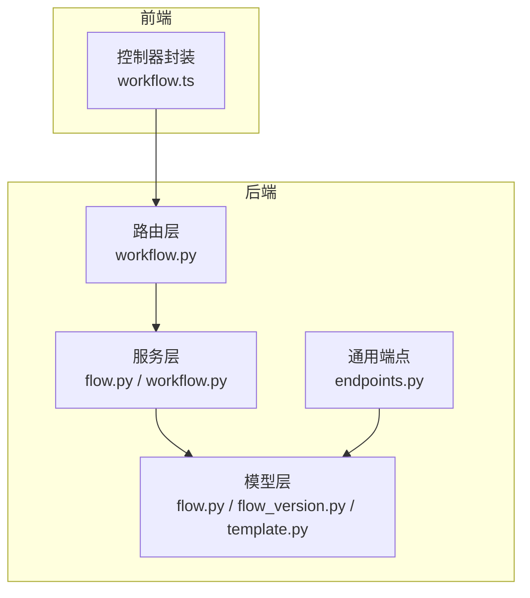
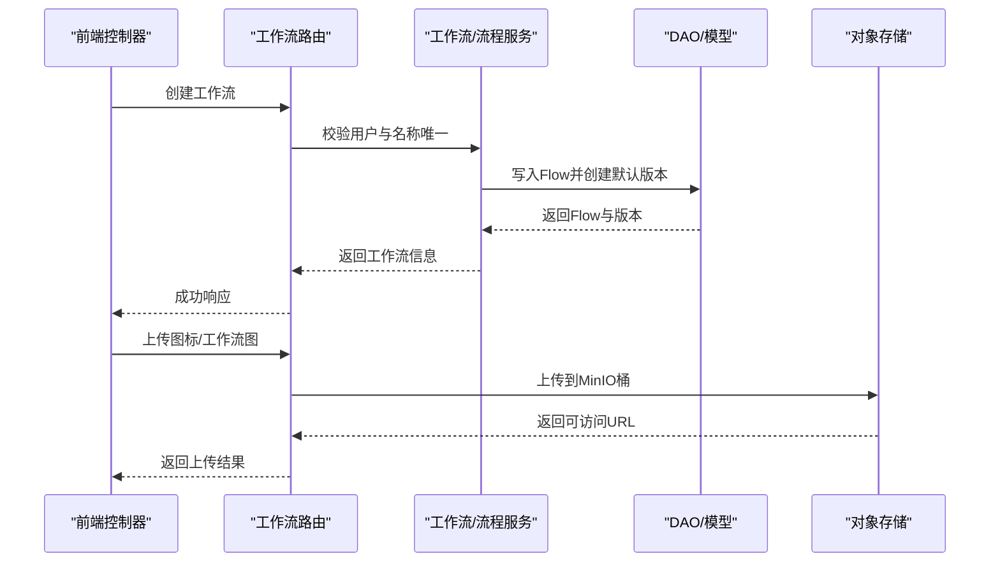
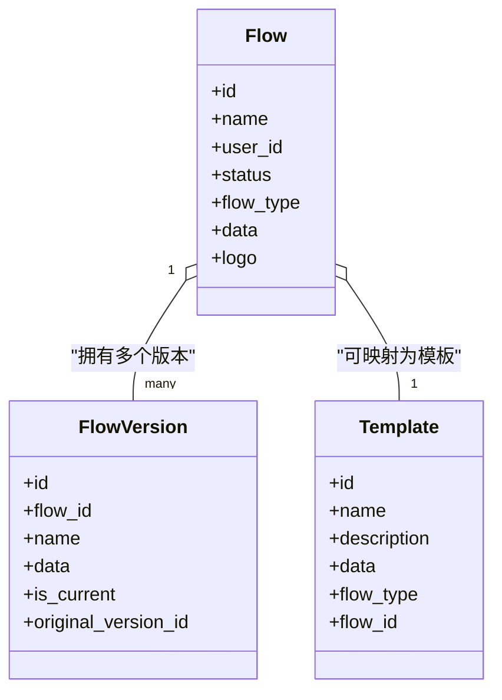

# 工作流模板 API

<cite>
**本文引用的文件**   
- [src/backend/bisheng/api/v1/workflow.py](file://src/backend/bisheng/api/v1/workflow.py)
- [src/backend/bisheng/api/v1/endpoints.py](file://src/backend/bisheng/api/v1/endpoints.py)
- [src/backend/bisheng/api/services/flow.py](file://src/backend/bisheng/api/services/flow.py)
- [src/backend/bisheng/api/services/workflow.py](file://src/backend/bisheng/api/services/workflow.py)
- [src/backend/bisheng/database/models/flow.py](file://src/backend/bisheng/database/models/flow.py)
- [src/backend/bisheng/database/models/flow_version.py](file://src/backend/bisheng/database/models/flow_version.py)
- [src/backend/bisheng/database/models/template.py](file://src/backend/bisheng/database/models/template.py)
- [src/backend/bisheng/api/v1/validate.py](file://src/backend/bisheng/api/v1/validate.py)
- [src/frontend/platform/src/controllers/API/workflow.ts](file://src/frontend/platform/src/controllers/API/workflow.ts)
</cite>

## 目录
1. [简介](#简介)
2. [项目结构](#项目结构)
3. [核心组件](#核心组件)
4. [架构总览](#架构总览)
5. [详细组件分析](#详细组件分析)
6. [依赖关系分析](#依赖关系分析)
7. [性能考量](#性能考量)
8. [故障排查指南](#故障排查指南)
9. [结论](#结论)
10. [附录](#附录)

## 简介
本文件面向“工作流模板管理”的完整 API 文档，覆盖以下主题：
- 工作流模板的创建、版本化与发布（上线/下线）
- 模板收藏与分享能力
- 模板标准化、导入导出与模板市场管理
- 权限控制、版本兼容性与质量评估
- 推荐、搜索与复用的最佳实践

该系统以 FastAPI 提供后端接口，前端通过控制器封装调用，数据库模型采用 SQLModel，版本数据与主流程解耦，支持多类型应用（技能/助手/工作流）统一管理。

## 项目结构
后端模块按职责分层：
- 路由层：定义 REST 接口与参数校验
- 服务层：封装业务逻辑、权限校验与状态变更
- 数据访问层：DAO/模型负责持久化与查询
- 前端控制器：封装 API 请求，便于复用与测试

图表来源
- [src/backend/bisheng/api/v1/workflow.py](file://src/backend/bisheng/api/v1/workflow.py#L32-L312)
- [src/backend/bisheng/api/services/flow.py](file://src/backend/bisheng/api/services/flow.py#L38-L200)
- [src/backend/bisheng/api/services/workflow.py](file://src/backend/bisheng/api/services/workflow.py#L35-L200)
- [src/backend/bisheng/database/models/flow.py](file://src/backend/bisheng/database/models/flow.py#L80-L150)
- [src/backend/bisheng/database/models/flow_version.py](file://src/backend/bisheng/database/models/flow_version.py#L49-L102)
- [src/backend/bisheng/database/models/template.py](file://src/backend/bisheng/database/models/template.py#L26-L54)
- [src/backend/bisheng/api/v1/endpoints.py](file://src/backend/bisheng/api/v1/endpoints.py#L64-L106)
- [src/frontend/platform/src/controllers/API/workflow.ts](file://src/frontend/platform/src/controllers/API/workflow.ts#L1-L59)

章节来源
- [src/backend/bisheng/api/v1/workflow.py](file://src/backend/bisheng/api/v1/workflow.py#L32-L312)
- [src/backend/bisheng/api/v1/endpoints.py](file://src/backend/bisheng/api/v1/endpoints.py#L64-L106)
- [src/frontend/platform/src/controllers/API/workflow.ts](file://src/frontend/platform/src/controllers/API/workflow.ts#L1-L59)

## 核心组件
- 工作流路由与接口
  - 创建工作流、读取列表、读取单个、更新状态、版本管理、运行一次等
- 版本管理服务
  - 版本列表、创建新版本、更新版本、切换当前版本、删除版本
- 工作流服务
  - 列表聚合、权限检查、运行单节点、状态变更
- 数据模型
  - Flow/FlowVersion/Template 统一承载工作流模板数据与版本元数据
- 通用上传与环境配置端点
  - 图标上传、工作流图片上传、环境变量与配置读取

章节来源
- [src/backend/bisheng/api/v1/workflow.py](file://src/backend/bisheng/api/v1/workflow.py#L159-L312)
- [src/backend/bisheng/api/services/flow.py](file://src/backend/bisheng/api/services/flow.py#L40-L200)
- [src/backend/bisheng/api/services/workflow.py](file://src/backend/bisheng/api/services/workflow.py#L85-L200)
- [src/backend/bisheng/database/models/flow.py](file://src/backend/bisheng/database/models/flow.py#L80-L150)
- [src/backend/bisheng/database/models/flow_version.py](file://src/backend/bisheng/database/models/flow_version.py#L49-L102)
- [src/backend/bisheng/database/models/template.py](file://src/backend/bisheng/database/models/template.py#L26-L54)
- [src/backend/bisheng/api/v1/endpoints.py](file://src/backend/bisheng/api/v1/endpoints.py#L371-L401)

## 架构总览
工作流模板管理的端到端交互如下：

图表来源
- [src/backend/bisheng/api/v1/workflow.py](file://src/backend/bisheng/api/v1/workflow.py#L159-L180)
- [src/backend/bisheng/api/v1/endpoints.py](file://src/backend/bisheng/api/v1/endpoints.py#L371-L401)
- [src/backend/bisheng/api/services/flow.py](file://src/backend/bisheng/api/services/flow.py#L138-L172)
- [src/backend/bisheng/database/models/flow.py](file://src/backend/bisheng/database/models/flow.py#L112-L149)

## 详细组件分析

### 1) 工作流模板创建与基础管理
- 接口概览
  - POST /api/v1/workflow/create：创建新的工作流模板，写入 Flow，并生成初始版本
  - GET /api/v1/workflow/list：分页列出工作流模板，支持名称/标签/状态/类型过滤
  - GET /api/v1/workflow/get_one_flow/{flow_id}：获取单个工作流详情（含分享鉴权）
  - PATCH /api/v1/workflow/update/{flow_id}：更新工作流基本信息（名称、描述、Logo 等）
  - PATCH /api/v1/workflow/status：设置工作流版本状态（上线/下线）

- 关键行为
  - 名称唯一性校验（同一用户同名不可重复）
  - Logo 相对路径转换为可访问链接
  - 管理员与角色权限控制（读写/发布）

- 前端调用参考
  - 创建工作流、保存工作流、删除版本等

章节来源
- [src/backend/bisheng/api/v1/workflow.py](file://src/backend/bisheng/api/v1/workflow.py#L159-L312)
- [src/frontend/platform/src/controllers/API/workflow.ts](file://src/frontend/platform/src/controllers/API/workflow.ts#L23-L59)

### 2) 版本管理（标准化与兼容）
- 接口概览
  - GET /api/v1/workflow/versions：获取工作流所有版本列表
  - POST /api/v1/workflow/versions：创建新版本（支持从原版本复制）
  - PUT /api/v1/workflow/versions/{version_id}：更新版本信息（名称/描述/数据）
  - DELETE /api/v1/workflow/versions/{version_id}：删除非当前版本
  - GET /api/v1/workflow/versions/{version_id}：获取版本详情
  - POST /api/v1/workflow/change_version：切换当前版本（在线状态下禁止编辑数据）

- 版本数据模型
  - FlowVersion 包含 nodes/edges 的图数据，支持 is_current 标识当前生效版本
  - 更新当前版本会同步回 Flow.data 字段

- 兼容性策略
  - 在线状态下禁止修改当前版本的数据字段
  - 创建版本时可选择 original_version_id 进行继承

章节来源
- [src/backend/bisheng/api/v1/workflow.py](file://src/backend/bisheng/api/v1/workflow.py#L183-L241)
- [src/backend/bisheng/api/services/flow.py](file://src/backend/bisheng/api/services/flow.py#L40-L200)
- [src/backend/bisheng/database/models/flow_version.py](file://src/backend/bisheng/database/models/flow_version.py#L49-L102)

### 3) 模板发布与状态控制
- 发布流程
  - 通过 PATCH /api/v1/workflow/status 设置版本状态（上线/下线）
  - 上线前进行初始化校验（如工作流图可用性）

- 权限控制
  - 需具备 WORKFLOW_WRITE 权限
  - 管理员与角色授权结合使用

章节来源
- [src/backend/bisheng/api/v1/workflow.py](file://src/backend/bisheng/api/v1/workflow.py#L286-L292)
- [src/backend/bisheng/api/services/workflow.py](file://src/backend/bisheng/api/services/workflow.py#L180-L200)

### 4) 模板收藏与分享
- 分享能力
  - 后端提供分享链路与鉴权（header_share_token_parser），前端通过共享链接访问
  - 支持刷新/隐藏/删除分享链接

- 收藏机制
  - 前端展示收藏卡片与搜索覆盖层，收藏状态通过本地状态管理
  - 可结合模板市场与标签体系实现“常用”“精选”等推荐位

章节来源
- [src/backend/bisheng/api/v1/workflow.py](file://src/backend/bisheng/api/v1/workflow.py#L244-L247)
- [src/frontend/client/src/pages/apps/components/SearchOverlay.tsx](file://src/frontend/client/src/pages/apps/components/SearchOverlay.tsx#L1-L160)

### 5) 模板导入导出与模板市场
- 导入
  - 通过上传接口将外部工作流图数据导入系统（支持文件缓存与 MinIO 存储）
  - 通用上传端点：POST /api/v1/upload/icon、POST /api/v1/upload/workflow/{workflow_id}

- 导出
  - 建议以 FlowVersion.data 为载体进行导出（nodes/edges 完整图结构）
  - 可结合模板市场服务进行批量导出与版本对比

- 模板市场
  - 通过标签、作者、评分等维度筛选与排序
  - 支持搜索（名称/描述/标签）、私有/公开过滤、点赞/收藏

章节来源
- [src/backend/bisheng/api/v1/endpoints.py](file://src/backend/bisheng/api/v1/endpoints.py#L371-L401)
- [src/backend/bisheng/services/store/service.py](file://src/backend/bisheng/services/store/service.py#L155-L163)

### 6) 权限控制
- 角色与资源授权
  - 使用 AccessType.FLOW/FLOW_WRITE、WORKFLOW/WORKFLOW_WRITE、ASSISTANT/ASSISTANT_WRITE 等枚举
  - 用户组与角色访问表 RoleAccessDao 结合，支持管理员与受控访问

- 写权限校验
  - /api/v1/workflow/write/auth：校验用户对工作流的写权限
  - 更新/删除/切换版本均需具备相应 WRITE 权限

章节来源
- [src/backend/bisheng/api/v1/workflow.py](file://src/backend/bisheng/api/v1/workflow.py#L35-L56)
- [src/backend/bisheng/api/services/flow.py](file://src/backend/bisheng/api/services/flow.py#L94-L106)

### 7) 模板标准化与质量评估
- 标准化
  - FlowVersion.data 必须包含 nodes/edges 字段，确保图结构完整性
  - TemplateSkillBase 对模板元数据进行约束（名称、描述、顺序号、类型等）

- 质量评估
  - 建议在模板市场中引入评分/评论/复用次数等指标
  - 可扩展字段用于标注“复杂度”“稳定性”“适用场景”等

章节来源
- [src/backend/bisheng/database/models/flow_version.py](file://src/backend/bisheng/database/models/flow_version.py#L32-L46)
- [src/backend/bisheng/database/models/template.py](file://src/backend/bisheng/database/models/template.py#L11-L54)

### 8) 模板搜索与推荐
- 搜索
  - 通用搜索条件：name/_icontains、description/_icontains、标签关联、作者用户名
  - 支持分页与排序

- 推荐
  - “常用”“最近使用”“热门”“精选”等维度组合
  - 结合用户行为日志与模板评分构建个性化推荐

章节来源
- [src/backend/bisheng/services/store/service.py](file://src/backend/bisheng/services/store/service.py#L155-L163)
- [src/frontend/client/src/pages/apps/components/SearchOverlay.tsx](file://src/frontend/client/src/pages/apps/components/SearchOverlay.tsx#L38-L44)

### 9) 单节点运行与验证
- 单节点运行
  - POST /api/v1/workflow/run_once：对工作流中的单个节点进行快速执行与调试

- 代码/提示词验证
  - POST /api/v1/validate/code、POST /api/v1/validate/prompt：辅助模板开发阶段的质量把关

章节来源
- [src/backend/bisheng/api/v1/workflow.py](file://src/backend/bisheng/api/v1/workflow.py#L135-L143)
- [src/backend/bisheng/api/v1/validate.py](file://src/backend/bisheng/api/v1/validate.py#L13-L37)

## 依赖关系分析

图表来源
- [src/backend/bisheng/database/models/flow.py](file://src/backend/bisheng/database/models/flow.py#L80-L150)
- [src/backend/bisheng/database/models/flow_version.py](file://src/backend/bisheng/database/models/flow_version.py#L49-L102)
- [src/backend/bisheng/database/models/template.py](file://src/backend/bisheng/database/models/template.py#L26-L54)

章节来源
- [src/backend/bisheng/database/models/flow.py](file://src/backend/bisheng/database/models/flow.py#L80-L150)
- [src/backend/bisheng/database/models/flow_version.py](file://src/backend/bisheng/database/models/flow_version.py#L49-L102)
- [src/backend/bisheng/database/models/template.py](file://src/backend/bisheng/database/models/template.py#L26-L54)

## 性能考量
- 查询优化
  - 列表接口使用分页与索引字段（名称、状态、类型、时间戳）
  - 复合过滤（标签/作者/类型）建议走索引或物化视图
- 版本切换
  - 当前版本切换需原子更新 FlowVersion.is_current 与 Flow.data，避免并发冲突
- 文件上传
  - 图标与工作流图上传走 MinIO，注意桶权限与过期链接策略
- 缓存与异步
  - 大数据量场景建议引入 Redis 缓存与异步任务队列

## 故障排查指南
- 常见错误码
  - 名称重复：创建失败（同用户同名不可重复）
  - 权限不足：未授权（需要 WRITE 权限）
  - 在线状态下禁止编辑：当前版本处于 ONLINE 状态
  - 版本不存在/已删除：查询/更新失败
- 排查步骤
  - 确认用户是否具备对应资源的 WRITE 权限
  - 检查工作流状态与版本是否满足操作要求
  - 核对 FlowVersion.data 是否包含 nodes/edges
  - 检查 MinIO 桶权限与对象是否存在

章节来源
- [src/backend/bisheng/api/v1/workflow.py](file://src/backend/bisheng/api/v1/workflow.py#L159-L180)
- [src/backend/bisheng/api/services/flow.py](file://src/backend/bisheng/api/services/flow.py#L62-L91)
- [src/backend/bisheng/database/models/flow_version.py](file://src/backend/bisheng/database/models/flow_version.py#L32-L46)

## 结论
本 API 体系围绕“工作流模板”的生命周期管理，提供了从创建、版本化、发布到分享与市场的完整闭环。通过明确的权限模型、版本兼容策略与标准化的数据结构，能够支撑团队协作与规模化复用。建议在模板市场中进一步完善评分、标签与推荐机制，提升模板质量与发现效率。

## 附录

### A. 接口清单与规范（摘要）
- 创建工作流
  - 方法：POST
  - 路径：/api/v1/workflow/create
  - 参数：FlowCreate（名称、描述、Logo、数据等）
  - 权限：登录用户
- 读取工作流列表
  - 方法：GET
  - 路径：/api/v1/workflow/list
  - 查询参数：name、tag_id、flow_type、page_size、page_num、status、managed
  - 权限：登录用户
- 读取单个工作流
  - 方法：GET
  - 路径：/api/v1/workflow/get_one_flow/{flow_id}
  - 权限：登录用户或分享令牌
- 更新工作流
  - 方法：PATCH
  - 路径：/api/v1/workflow/update/{flow_id}
  - 权限：具备 WORKFLOW_WRITE
- 设置版本状态
  - 方法：PATCH
  - 路径：/api/v1/workflow/status
  - 参数：flow_id、version_id、status
  - 权限：具备 WORKFLOW_WRITE
- 版本管理
  - 获取版本列表：GET /api/v1/workflow/versions?flow_id=...
  - 创建版本：POST /api/v1/workflow/versions
  - 更新版本：PUT /api/v1/workflow/versions/{version_id}
  - 删除版本：DELETE /api/v1/workflow/versions/{version_id}
  - 切换当前版本：POST /api/v1/workflow/change_version
  - 权限：具备 WORKFLOW_WRITE
- 上传资源
  - 图标上传：POST /api/v1/upload/icon
  - 工作流图上传：POST /api/v1/upload/workflow/{workflow_id}
  - 权限：登录用户

章节来源
- [src/backend/bisheng/api/v1/workflow.py](file://src/backend/bisheng/api/v1/workflow.py#L159-L312)
- [src/backend/bisheng/api/v1/endpoints.py](file://src/backend/bisheng/api/v1/endpoints.py#L371-L401)