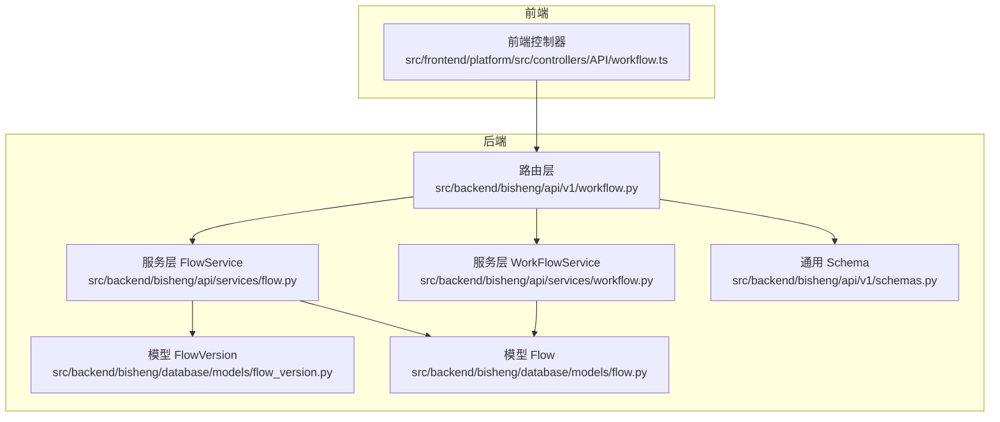
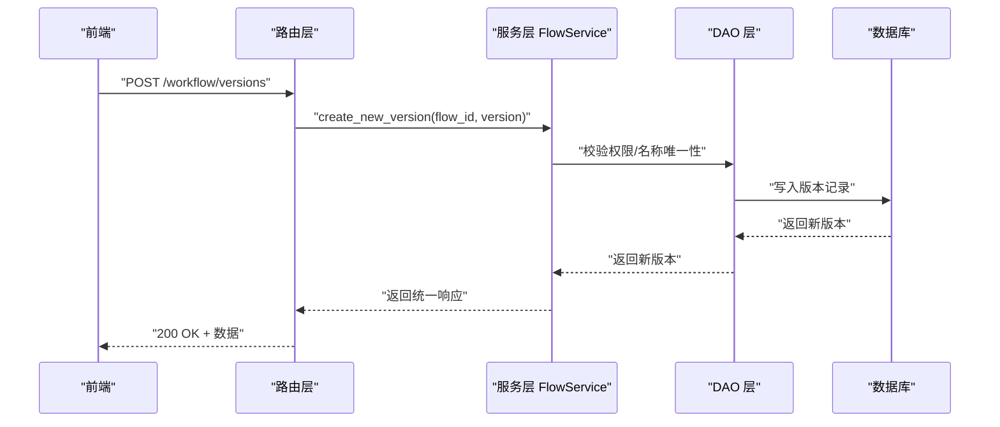
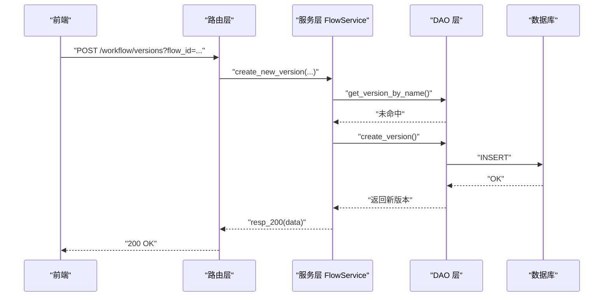
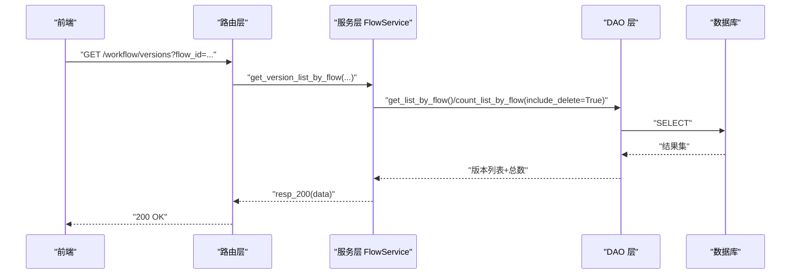
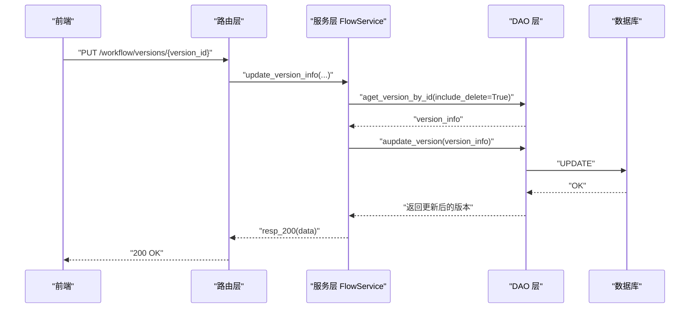
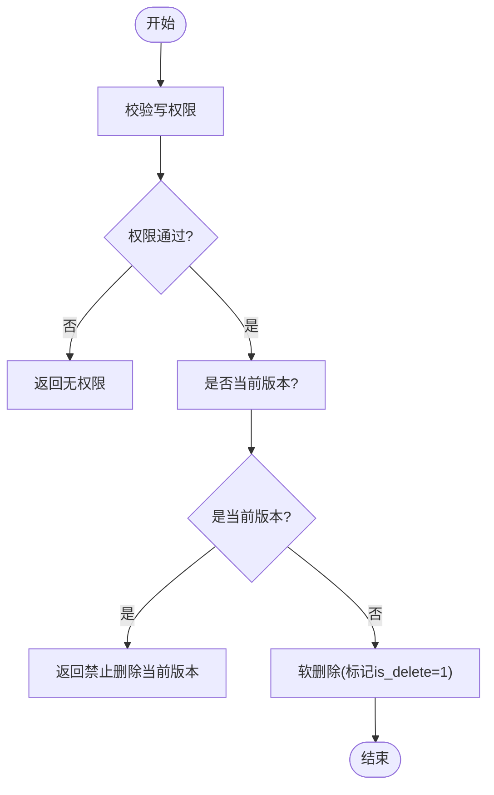
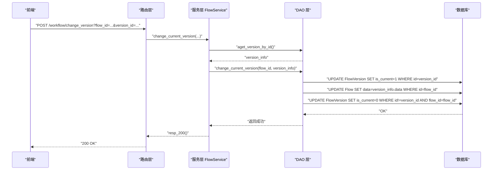
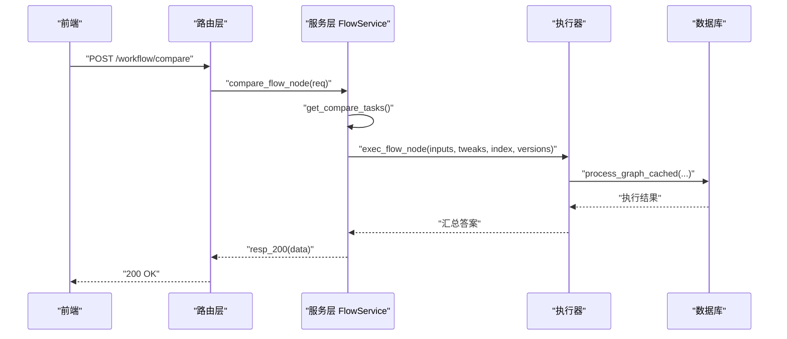
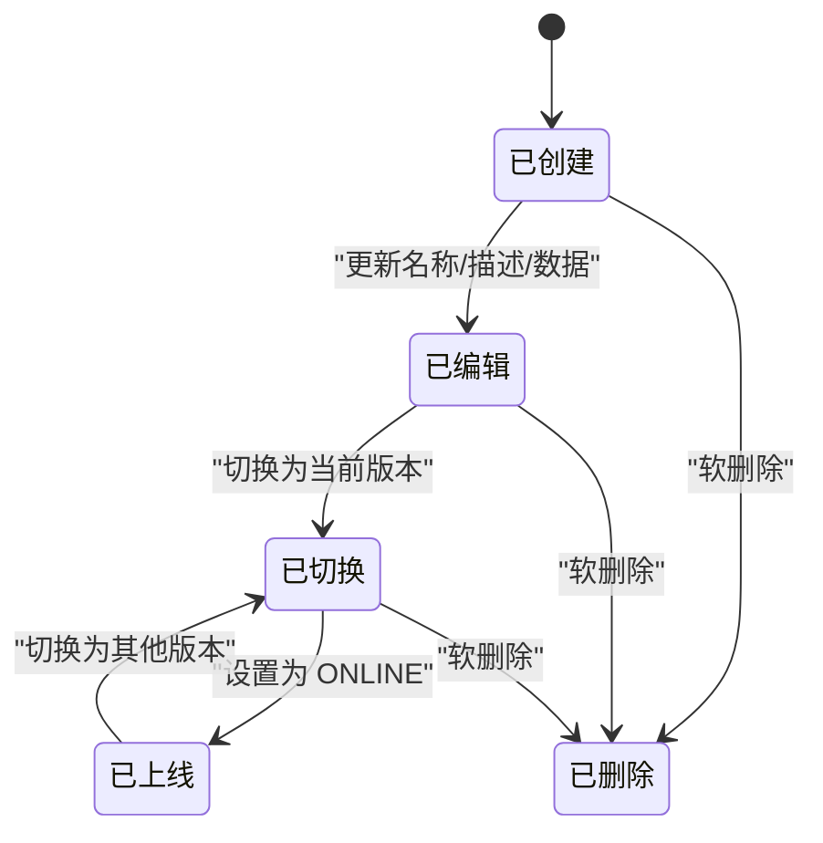
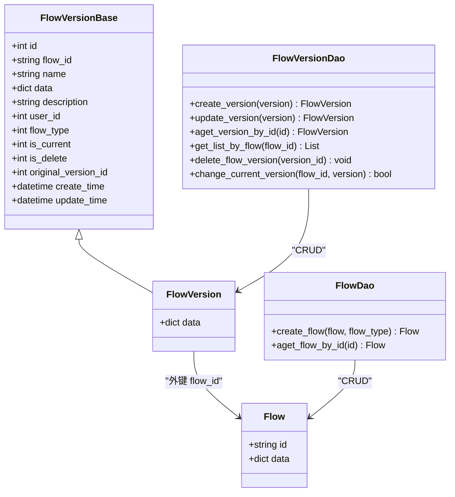

# 工作流版本管理 API

<cite>
**本文引用的文件**
- [src/backend/bisheng/api/v1/workflow.py](file://src/backend/bisheng/api/v1/workflow.py)
- [src/backend/bisheng/api/services/flow.py](file://src/backend/bisheng/api/services/flow.py)
- [src/backend/bisheng/api/services/workflow.py](file://src/backend/bisheng/api/services/workflow.py)
- [src/backend/bisheng/database/models/flow_version.py](file://src/backend/bisheng/database/models/flow_version.py)
- [src/backend/bisheng/database/models/flow.py](file://src/backend/bisheng/database/models/flow.py)
- [src/backend/bisheng/api/v1/schemas.py](file://src/backend/bisheng/api/v1/schemas.py)
- [src/frontend/platform/src/controllers/API/workflow.ts](file://src/frontend/platform/src/controllers/API/workflow.ts)
</cite>

## 目录
1. [简介](#简介)
2. [项目结构](#项目结构)
3. [核心组件](#核心组件)
4. [架构总览](#架构总览)
5. [详细组件分析](#详细组件分析)
6. [依赖关系分析](#依赖关系分析)
7. [性能考量](#性能考量)
8. [故障排查指南](#故障排查指南)
9. [结论](#结论)
10. [附录](#附录)

## 简介
本文件为“工作流版本管理 API”的权威文档，覆盖工作流版本的创建、查询、更新与删除接口；版本号管理、版本比较与版本切换规范；版本历史记录、版本回滚与版本合并操作流程；版本冲突检测、版本锁定与并发控制机制；以及版本数据结构、状态转换与生命周期管理。本文同时提供面向前端调用的接口清单与示例路径，并通过图示展示关键流程。

## 项目结构
工作流版本管理由后端 FastAPI 路由层、服务层与数据库模型层协同完成，前端通过控制器封装调用后端接口。

**图表来源**
- [src/backend/bisheng/api/v1/workflow.py](file://src/backend/bisheng/api/v1/workflow.py#L32-L312)
- [src/backend/bisheng/api/services/flow.py](file://src/backend/bisheng/api/services/flow.py#L38-L491)
- [src/backend/bisheng/api/services/workflow.py](file://src/backend/bisheng/api/services/workflow.py#L35-L451)
- [src/backend/bisheng/database/models/flow_version.py](file://src/backend/bisheng/database/models/flow_version.py#L16-L237)
- [src/backend/bisheng/database/models/flow.py](file://src/backend/bisheng/database/models/flow.py#L26-L200)
- [src/backend/bisheng/api/v1/schemas.py](file://src/backend/bisheng/api/v1/schemas.py#L299-L313)
- [src/frontend/platform/src/controllers/API/workflow.ts](file://src/frontend/platform/src/controllers/API/workflow.ts#L61-L105)

**章节来源**
- [src/backend/bisheng/api/v1/workflow.py](file://src/backend/bisheng/api/v1/workflow.py#L32-L312)
- [src/backend/bisheng/api/services/flow.py](file://src/backend/bisheng/api/services/flow.py#L38-L491)
- [src/backend/bisheng/api/services/workflow.py](file://src/backend/bisheng/api/services/workflow.py#L35-L451)
- [src/backend/bisheng/database/models/flow_version.py](file://src/backend/bisheng/database/models/flow_version.py#L16-L237)
- [src/backend/bisheng/database/models/flow.py](file://src/backend/bisheng/database/models/flow.py#L26-L200)
- [src/backend/bisheng/api/v1/schemas.py](file://src/backend/bisheng/api/v1/schemas.py#L299-L313)
- [src/frontend/platform/src/controllers/API/workflow.ts](file://src/frontend/platform/src/controllers/API/workflow.ts#L61-L105)

## 核心组件
- 路由层（FastAPI）：定义工作流版本相关 HTTP 接口，负责参数解析、鉴权与响应封装。
- 服务层（FlowService/WorkFlowService）：实现业务逻辑，包括版本创建、查询、更新、删除、切换、比较等。
- 数据模型（Flow/FlowVersion）：持久化存储工作流与版本数据，约束数据结构与校验规则。
- 前端控制器：封装调用后端接口，便于前端统一管理版本操作。

**章节来源**
- [src/backend/bisheng/api/v1/workflow.py](file://src/backend/bisheng/api/v1/workflow.py#L32-L312)
- [src/backend/bisheng/api/services/flow.py](file://src/backend/bisheng/api/services/flow.py#L38-L491)
- [src/backend/bisheng/database/models/flow_version.py](file://src/backend/bisheng/database/models/flow_version.py#L16-L237)
- [src/backend/bisheng/database/models/flow.py](file://src/backend/bisheng/database/models/flow.py#L26-L200)
- [src/frontend/platform/src/controllers/API/workflow.ts](file://src/frontend/platform/src/controllers/API/workflow.ts#L61-L105)

## 架构总览
工作流版本管理采用“路由层-服务层-数据模型层”分层架构，前后端通过统一的 Schema 进行数据交换，服务层在 DAO 层之上进行权限校验、状态检查与并发控制。

**图表来源**
- [src/backend/bisheng/api/v1/workflow.py](file://src/backend/bisheng/api/v1/workflow.py#L191-L201)
- [src/backend/bisheng/api/services/flow.py](file://src/backend/bisheng/api/services/flow.py#L139-L172)
- [src/backend/bisheng/database/models/flow_version.py](file://src/backend/bisheng/database/models/flow_version.py#L59-L68)

**章节来源**
- [src/backend/bisheng/api/v1/workflow.py](file://src/backend/bisheng/api/v1/workflow.py#L191-L201)
- [src/backend/bisheng/api/services/flow.py](file://src/backend/bisheng/api/services/flow.py#L139-L172)
- [src/backend/bisheng/database/models/flow_version.py](file://src/backend/bisheng/database/models/flow_version.py#L59-L68)

## 详细组件分析

### 1) 版本创建接口
- 接口定义
  - 方法：POST
  - 路径：/workflow/versions
  - 查询参数：flow_id（工作流 ID）
  - 请求体：版本信息（名称、描述、数据、原始版本 ID、类型）
  - 权限：需具备工作流写权限
  - 返回：统一响应模型
- 业务流程
  - 校验用户对工作流的写权限
  - 检查同名版本是否存在
  - 写入版本记录，若为表单类工作流，复制变量并刷新参数
- 并发与冲突
  - 同名版本检查避免重复命名
  - 写权限校验防止越权
- 错误码
  - 版本名称已存在
  - 无权限
  - 工作流不存在

**图表来源**
- [src/backend/bisheng/api/v1/workflow.py](file://src/backend/bisheng/api/v1/workflow.py#L191-L201)
- [src/backend/bisheng/api/services/flow.py](file://src/backend/bisheng/api/services/flow.py#L139-L172)
- [src/backend/bisheng/database/models/flow_version.py](file://src/backend/bisheng/database/models/flow_version.py#L59-L68)

**章节来源**
- [src/backend/bisheng/api/v1/workflow.py](file://src/backend/bisheng/api/v1/workflow.py#L191-L201)
- [src/backend/bisheng/api/services/flow.py](file://src/backend/bisheng/api/services/flow.py#L139-L172)
- [src/backend/bisheng/database/models/flow_version.py](file://src/backend/bisheng/database/models/flow_version.py#L59-L68)

### 2) 版本查询接口
- 接口定义
  - 方法：GET
  - 路径：/workflow/versions
  - 查询参数：flow_id（工作流 ID）
  - 返回：版本列表与总数
- 业务流程
  - 查询该工作流下所有版本（排除已删除）
  - 统计全部版本数量（包含已删除）

**图表来源**
- [src/backend/bisheng/api/v1/workflow.py](file://src/backend/bisheng/api/v1/workflow.py#L183-L188)
- [src/backend/bisheng/api/services/flow.py](file://src/backend/bisheng/api/services/flow.py#L40-L51)
- [src/backend/bisheng/database/models/flow_version.py](file://src/backend/bisheng/database/models/flow_version.py#L158-L191)

**章节来源**
- [src/backend/bisheng/api/v1/workflow.py](file://src/backend/bisheng/api/v1/workflow.py#L183-L188)
- [src/backend/bisheng/api/services/flow.py](file://src/backend/bisheng/api/services/flow.py#L40-L51)
- [src/backend/bisheng/database/models/flow_version.py](file://src/backend/bisheng/database/models/flow_version.py#L158-L191)

### 3) 单版本详情查询接口
- 接口定义
  - 方法：GET
  - 路径：/workflow/versions/{version_id}
  - 路径参数：version_id（版本 ID）
  - 返回：版本详情
- 业务流程
  - 根据版本 ID 查询版本信息

**章节来源**
- [src/backend/bisheng/api/v1/workflow.py](file://src/backend/bisheng/api/v1/workflow.py#L223-L228)
- [src/backend/bisheng/api/services/flow.py](file://src/backend/bisheng/api/services/flow.py#L53-L59)
- [src/backend/bisheng/database/models/flow_version.py](file://src/backend/bisheng/database/models/flow_version.py#L115-L136)

### 4) 版本更新接口
- 接口定义
  - 方法：PUT
  - 路径：/workflow/versions/{version_id}
  - 路径参数：version_id（版本 ID）
  - 请求体：版本信息（名称、描述、可选数据）
  - 权限：需具备工作流写权限
  - 返回：统一响应模型
- 业务流程
  - 校验用户对工作流的写权限
  - 若为在线状态且更新了数据，禁止更新（工作流有特殊限制）
  - 更新名称/描述/数据，恢复软删除标记
  - 异步更新版本数据，如为当前版本则同步更新工作流数据
- 并发与冲突
  - 在线状态下禁止修改数据字段
  - 软删除版本可被恢复

**图表来源**
- [src/backend/bisheng/api/v1/workflow.py](file://src/backend/bisheng/api/v1/workflow.py#L203-L212)
- [src/backend/bisheng/api/services/flow.py](file://src/backend/bisheng/api/services/flow.py#L174-L215)
- [src/backend/bisheng/database/models/flow_version.py](file://src/backend/bisheng/database/models/flow_version.py#L87-L102)

**章节来源**
- [src/backend/bisheng/api/v1/workflow.py](file://src/backend/bisheng/api/v1/workflow.py#L203-L212)
- [src/backend/bisheng/api/services/flow.py](file://src/backend/bisheng/api/services/flow.py#L174-L215)
- [src/backend/bisheng/database/models/flow_version.py](file://src/backend/bisheng/database/models/flow_version.py#L87-L102)

### 5) 版本删除接口
- 接口定义
  - 方法：DELETE
  - 路径：/workflow/versions/{version_id}
  - 路径参数：version_id（版本 ID）
  - 权限：需具备工作流写权限
  - 返回：统一响应模型
- 业务流程
  - 校验用户对工作流的写权限
  - 当前版本不可删除
  - 软删除（标记 is_delete=1），保留历史记录
- 并发与冲突
  - 当前版本保护，防止误删

**图表来源**
- [src/backend/bisheng/api/v1/workflow.py](file://src/backend/bisheng/api/v1/workflow.py#L215-L220)
- [src/backend/bisheng/api/services/flow.py](file://src/backend/bisheng/api/services/flow.py#L62-L91)
- [src/backend/bisheng/database/models/flow_version.py](file://src/backend/bisheng/database/models/flow_version.py#L194-L202)

**章节来源**
- [src/backend/bisheng/api/v1/workflow.py](file://src/backend/bisheng/api/v1/workflow.py#L215-L220)
- [src/backend/bisheng/api/services/flow.py](file://src/backend/bisheng/api/services/flow.py#L62-L91)
- [src/backend/bisheng/database/models/flow_version.py](file://src/backend/bisheng/database/models/flow_version.py#L194-L202)

### 6) 版本切换接口
- 接口定义
  - 方法：POST
  - 路径：/workflow/change_version
  - 查询参数：flow_id（工作流 ID）、version_id（目标版本 ID）
  - 权限：需具备工作流写权限
  - 返回：统一响应模型
- 业务流程
  - 校验用户对工作流的写权限
  - 工作流在线状态下禁止切换版本
  - 将目标版本设为当前版本，同步更新工作流数据，并取消其他版本的“当前版本”标记
- 并发与冲突
  - 在线状态保护
  - 原子性更新当前版本标记与工作流数据

**图表来源**
- [src/backend/bisheng/api/v1/workflow.py](file://src/backend/bisheng/api/v1/workflow.py#L231-L240)
- [src/backend/bisheng/api/services/flow.py](file://src/backend/bisheng/api/services/flow.py#L108-L136)
- [src/backend/bisheng/database/models/flow_version.py](file://src/backend/bisheng/database/models/flow_version.py#L204-L236)

**章节来源**
- [src/backend/bisheng/api/v1/workflow.py](file://src/backend/bisheng/api/v1/workflow.py#L231-L240)
- [src/backend/bisheng/api/services/flow.py](file://src/backend/bisheng/api/services/flow.py#L108-L136)
- [src/backend/bisheng/database/models/flow_version.py](file://src/backend/bisheng/database/models/flow_version.py#L204-L236)

### 7) 版本比较接口
- 接口定义
  - 方法：POST
  - 路径：/workflow/compare
  - 请求体：输入参数、问题列表、版本 ID 列表、节点 ID、线程数
  - 返回：统一响应模型（比较结果）
- 业务流程
  - 解析输入，构造对比任务
  - 对每个问题与版本组合异步执行节点执行
  - 汇总结果并返回
- 并发与性能
  - 使用异步任务并发执行
  - 支持多线程参数

**图表来源**
- [src/backend/bisheng/api/services/flow.py](file://src/backend/bisheng/api/services/flow.py#L320-L434)

**章节来源**
- [src/backend/bisheng/api/services/flow.py](file://src/backend/bisheng/api/services/flow.py#L320-L434)

### 8) 版本状态管理与工作流上线
- 接口定义
  - 方法：PATCH
  - 路径：/workflow/status
  - 请求体：flow_id、version_id、status（ONLINE/OFFLINE）
  - 权限：需具备工作流写权限
- 业务流程
  - 校验用户对工作流的写权限
  - 若设置为 ONLINE，先初始化工作流验证
  - 设置工作流状态，并将对应版本设为当前版本
- 并发与冲突
  - 初始化失败时拒绝上线
  - 上线后自动切换当前版本

**章节来源**
- [src/backend/bisheng/api/v1/workflow.py](file://src/backend/bisheng/api/v1/workflow.py#L286-L292)
- [src/backend/bisheng/api/services/workflow.py](file://src/backend/bisheng/api/services/workflow.py#L180-L212)
- [src/backend/bisheng/database/models/flow.py](file://src/backend/bisheng/database/models/flow.py#L26-L37)

### 9) 版本数据结构与校验
- 版本实体（FlowVersion）
  - 字段：id、flow_id、name、data、description、user_id、flow_type、is_current、is_delete、original_version_id、create_time、update_time
  - 校验：data 必须包含 nodes 和 edges，且为合法 JSON
- 工作流实体（Flow）
  - 字段：id、name、user_id、description、data、logo、status、flow_type、guide_word、create_time、update_time
  - 校验：data 必须包含 nodes 和 edges，且为合法 JSON

**章节来源**
- [src/backend/bisheng/database/models/flow_version.py](file://src/backend/bisheng/database/models/flow_version.py#L16-L46)
- [src/backend/bisheng/database/models/flow.py](file://src/backend/bisheng/database/models/flow.py#L49-L77)

### 10) 版本生命周期与状态转换
- 生命周期阶段
  - 创建：默认生成 v0 版本
  - 编辑：支持更新名称、描述与数据（在线状态有约束）
  - 切换：将某版本设为当前版本
  - 上线：设置为 ONLINE，自动切换当前版本并初始化校验
  - 删除：软删除（保留历史）
- 状态枚举
  - FlowStatus：OFFLINE（1）、ONLINE（2）
  - FlowType：WORKFLOW（10）

**图表来源**
- [src/backend/bisheng/database/models/flow.py](file://src/backend/bisheng/database/models/flow.py#L26-L37)
- [src/backend/bisheng/database/models/flow_version.py](file://src/backend/bisheng/database/models/flow_version.py#L204-L236)

**章节来源**
- [src/backend/bisheng/database/models/flow.py](file://src/backend/bisheng/database/models/flow.py#L26-L37)
- [src/backend/bisheng/database/models/flow_version.py](file://src/backend/bisheng/database/models/flow_version.py#L204-L236)

### 11) 版本合并与回滚
- 回滚
  - 通过“版本切换”将历史版本设为当前版本，实现回滚效果
- 合并
  - 通过“版本创建”指定 original_version_id，建立版本来源关系，便于后续合并策略（如基于差异的合并工具链）

**章节来源**
- [src/backend/bisheng/api/v1/workflow.py](file://src/backend/bisheng/api/v1/workflow.py#L191-L201)
- [src/backend/bisheng/api/services/flow.py](file://src/backend/bisheng/api/services/flow.py#L139-L172)
- [src/backend/bisheng/database/models/flow_version.py](file://src/backend/bisheng/database/models/flow_version.py#L26-L26)

### 12) 并发控制与版本锁定
- 并发控制机制
  - 在线状态下禁止修改版本数据字段
  - 切换当前版本时使用原子更新，确保一致性
  - 删除时保护当前版本不被删除
- 版本锁定
  - 未发现显式分布式锁实现；通过状态与权限双重约束实现逻辑锁定

**章节来源**
- [src/backend/bisheng/api/services/flow.py](file://src/backend/bisheng/api/services/flow.py#L192-L197)
- [src/backend/bisheng/database/models/flow_version.py](file://src/backend/bisheng/database/models/flow_version.py#L204-L236)
- [src/backend/bisheng/api/v1/workflow.py](file://src/backend/bisheng/api/v1/workflow.py#L215-L220)

### 13) 前端调用示例
- 创建版本
  - 路径：/api/v1/workflow/versions?flow_id=...
  - 方法：POST
  - 参数：versionData（name/description/data/original_version_id）
- 获取版本列表
  - 路径：/api/v1/workflow/versions
  - 方法：GET
  - 查询参数：flow_id
- 获取单版本详情
  - 路径：/api/v1/workflow/versions/{versionId}
  - 方法：GET
- 更新版本
  - 路径：/api/v1/workflow/versions/{versionId}
  - 方法：PUT
  - 参数：versionData（name/description/data）
- 删除版本
  - 路径：/api/v1/workflow/versions/{versionId}
  - 方法：DELETE
- 切换版本
  - 路径：/api/v1/workflow/change_version
  - 方法：POST
  - 查询参数：flow_id、version_id

**章节来源**
- [src/frontend/platform/src/controllers/API/workflow.ts](file://src/frontend/platform/src/controllers/API/workflow.ts#L61-L105)

## 依赖关系分析

**图表来源**
- [src/backend/bisheng/database/models/flow_version.py](file://src/backend/bisheng/database/models/flow_version.py#L16-L50)
- [src/backend/bisheng/database/models/flow.py](file://src/backend/bisheng/database/models/flow.py#L49-L82)

**章节来源**
- [src/backend/bisheng/database/models/flow_version.py](file://src/backend/bisheng/database/models/flow_version.py#L16-L50)
- [src/backend/bisheng/database/models/flow.py](file://src/backend/bisheng/database/models/flow.py#L49-L82)

## 性能考量
- 异步执行：版本比较接口使用异步任务并发执行，提升大规模对比效率。
- 数据校验：在模型层对 JSON 结构进行严格校验，减少运行期异常。
- 原子更新：切换当前版本采用数据库原子更新，避免竞态条件。
- 建议
  - 对于大量版本的查询，建议分页与缓存结合
  - 版本数据较大时，考虑压缩或分片存储

[本节为通用指导，无需列出具体文件来源]

## 故障排查指南
- 常见错误与定位
  - 无权限：检查用户对工作流的写权限
  - 版本名称冲突：创建/更新时返回名称已存在
  - 在线状态禁止修改数据：设置为 ONLINE 后仅允许更新名称/描述
  - 禁止删除当前版本：删除接口返回禁止删除当前版本
- 定位方法
  - 查看服务层日志与异常返回
  - 核对 FlowStatus 与 FlowVersion.is_current 状态
  - 检查 FlowVersionDao 的原子更新是否成功

**章节来源**
- [src/backend/bisheng/api/services/flow.py](file://src/backend/bisheng/api/services/flow.py#L71-L91)
- [src/backend/bisheng/api/services/flow.py](file://src/backend/bisheng/api/services/flow.py#L192-L197)
- [src/backend/bisheng/database/models/flow_version.py](file://src/backend/bisheng/database/models/flow_version.py#L194-L202)

## 结论
工作流版本管理 API 提供了从创建、查询、更新、删除到切换与比较的完整能力，配合严格的权限与状态约束，保障了版本演进的安全与可控。通过原子更新与异步执行优化，系统在高并发场景下仍能保持稳定。建议在生产环境中结合缓存与分页策略进一步优化性能，并持续完善版本合并与冲突检测的自动化工具链。

[本节为总结性内容，无需列出具体文件来源]

## 附录

### A. 接口一览（按功能分组）
- 版本管理
  - POST /workflow/versions?flow_id=...：创建版本
  - GET /workflow/versions?flow_id=...：获取版本列表
  - GET /workflow/versions/{version_id}：获取版本详情
  - PUT /workflow/versions/{version_id}：更新版本
  - DELETE /workflow/versions/{version_id}：删除版本
  - POST /workflow/change_version?flow_id=...&version_id=...：切换版本
- 工作流状态
  - PATCH /workflow/status：设置工作流状态并切换版本
- 版本比较
  - POST /workflow/compare：版本节点对比

**章节来源**
- [src/backend/bisheng/api/v1/workflow.py](file://src/backend/bisheng/api/v1/workflow.py#L159-L312)
- [src/backend/bisheng/api/services/flow.py](file://src/backend/bisheng/api/services/flow.py#L320-L434)

### B. 关键数据结构
- FlowVersionCreate
  - 字段：name、description、data、original_version_id、flow_type
- FlowCompareReq
  - 字段：inputs、question_list、version_list、node_id、thread_num

**章节来源**
- [src/backend/bisheng/api/v1/schemas.py](file://src/backend/bisheng/api/v1/schemas.py#L299-L313)