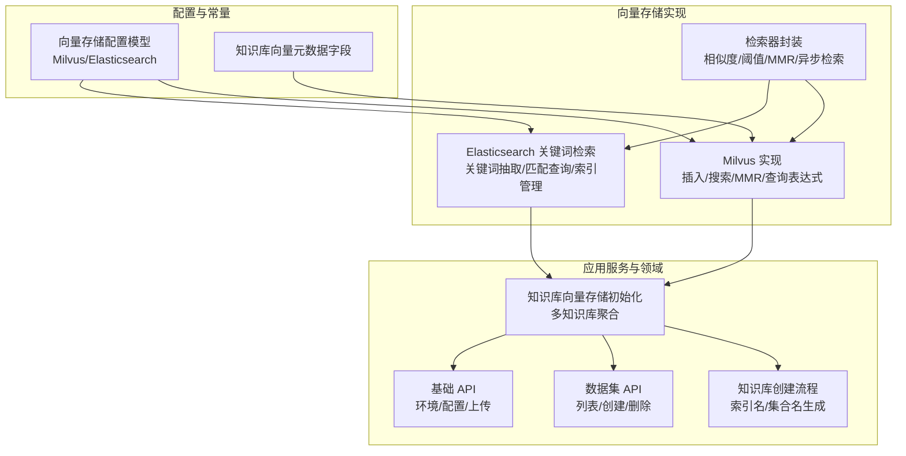
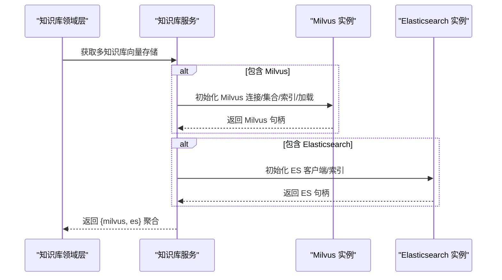
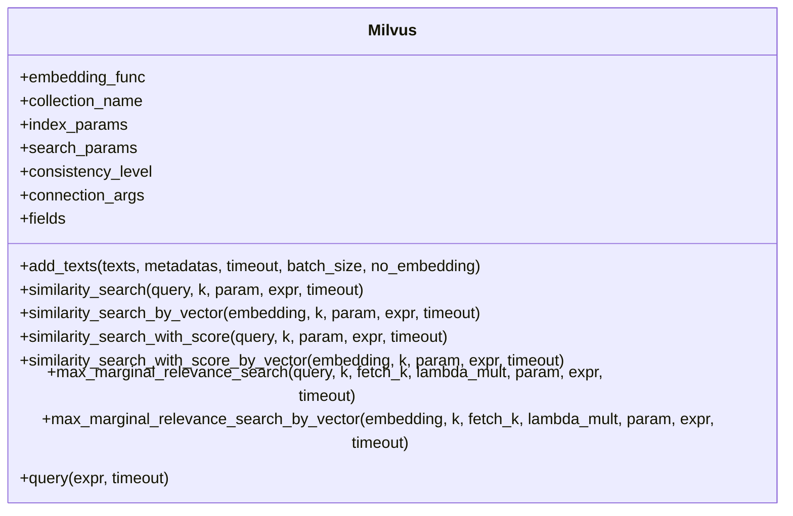
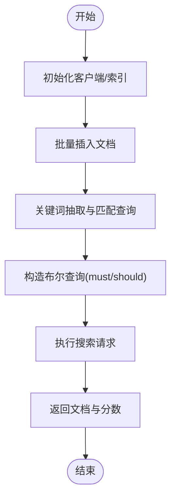
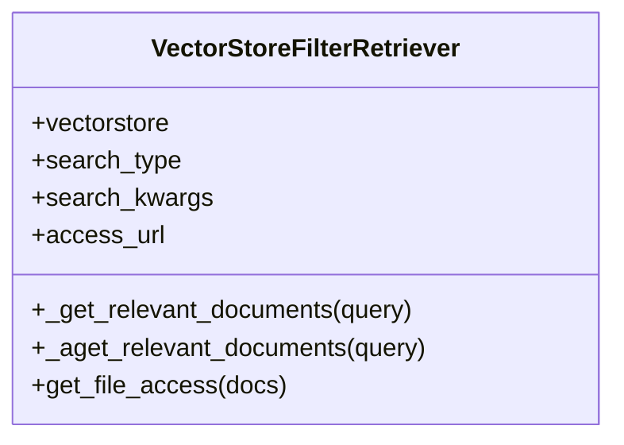
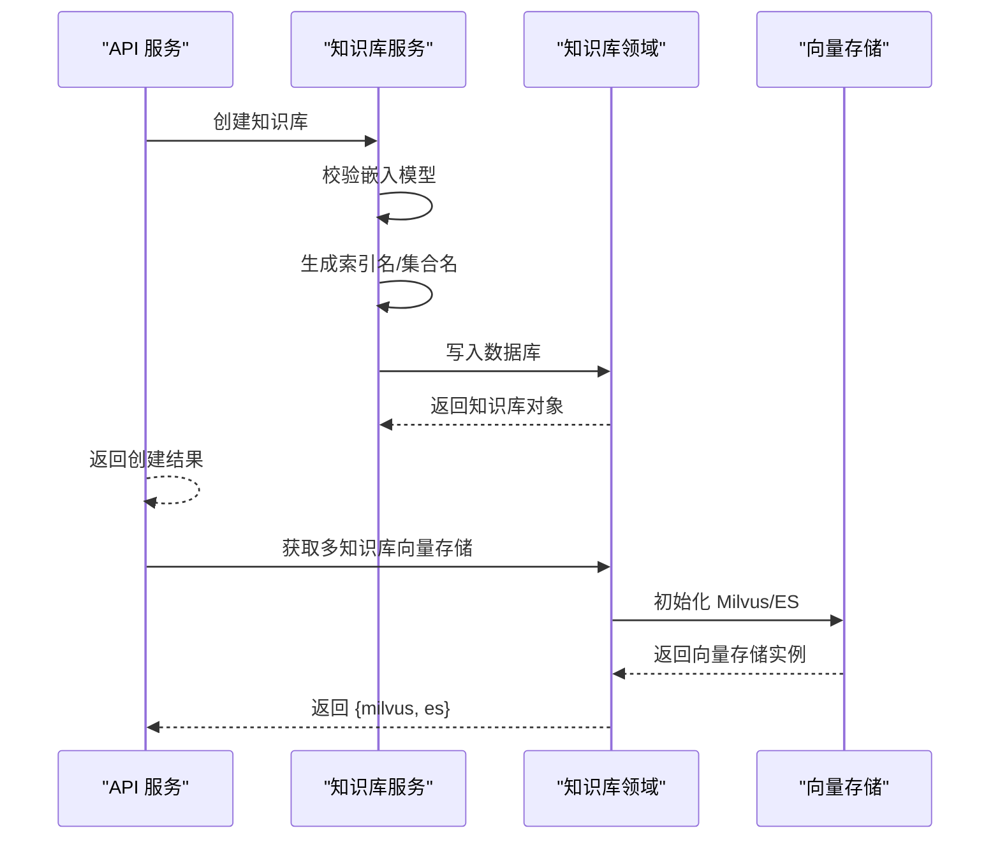
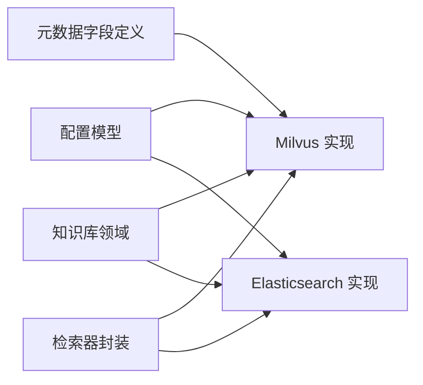

# 向量存储 API

<cite>
**本文引用的文件**
- [milvus.py](file://src/backend/bisheng_langchain/vectorstores/milvus.py)
- [elastic_keywords_search.py](file://src/backend/bisheng_langchain/vectorstores/elastic_keywords_search.py)
- [retriever.py](file://src/backend/bisheng_langchain/vectorstores/retriever.py)
- [settings.py](file://src/backend/bisheng/core/config/settings.py)
- [vectorstore_metadata.py](file://src/backend/bisheng/common/constants/vectorstore_metadata.py)
- [knowledge_rag.py](file://src/backend/bisheng/knowledge/domain/knowledge_rag.py)
- [knowledge.py](file://src/backend/bisheng/api/services/knowledge.py)
- [dataset.py](file://src/backend/bisheng/api/v1/dataset.py)
- [endpoints.py](file://src/backend/bisheng/api/v1/endpoints.py)
- [__init__.py](file://src/backend/bisheng/core/vectorstore/__init__.py)
</cite>

## 目录
1. [简介](#简介)
2. [项目结构](#项目结构)
3. [核心组件](#核心组件)
4. [架构总览](#架构总览)
5. [详细组件分析](#详细组件分析)
6. [依赖关系分析](#依赖关系分析)
7. [性能与优化建议](#性能与优化建议)
8. [故障排查指南](#故障排查指南)
9. [结论](#结论)
10. [附录](#附录)

## 简介
本文件面向向量存储系统的使用者与维护者，系统化梳理基于 Milvus 与 Elasticsearch 的向量数据库集成与管理 API，覆盖向量数据的插入、查询、相似度搜索、过滤检索、批量写入、索引与一致性配置、以及检索器封装与前端展示等能力。文档同时给出接口规范、流程图与时序图，并提供检索优化、性能调优与存储管理的实践建议。

## 项目结构
围绕向量存储的关键模块分布如下：
- 向量存储实现层（LangChain 封装）
  - Milvus 实现：向量插入、相似度搜索、MMR、查询表达式、索引与搜索参数、连接复用与加载
  - Elasticsearch 关键词检索实现：关键词抽取（jieba 或 LLM）、匹配查询、索引创建与删除、按 ID 删除
  - 检索器封装：统一检索类型（相似度、阈值、MMR），支持异步检索与访问控制过滤
- 配置与常量
  - 向量存储配置模型（Milvus、Elasticsearch）
  - 知识库向量元数据字段定义
- 应用服务与领域层
  - 知识库向量存储初始化与多知识库聚合
  - 知识库创建流程（索引名与集合名生成）
  - 数据集 API（列表、创建、删除）
  - 基础 API（环境变量、配置读取/保存、上传等）

**图表来源**
- [milvus.py](file://src/backend/bisheng_langchain/vectorstores/milvus.py#L26-L966)
- [elastic_keywords_search.py](file://src/backend/bisheng_langchain/vectorstores/elastic_keywords_search.py#L48-L392)
- [retriever.py](file://src/backend/bisheng_langchain/vectorstores/retriever.py#L18-L95)
- [settings.py](file://src/backend/bisheng/core/config/settings.py#L65-L100)
- [vectorstore_metadata.py](file://src/backend/bisheng/common/constants/vectorstore_metadata.py#L3-L17)
- [knowledge_rag.py](file://src/backend/bisheng/knowledge/domain/knowledge_rag.py#L79-L116)
- [knowledge.py](file://src/backend/bisheng/api/services/knowledge.py#L168-L185)
- [dataset.py](file://src/backend/bisheng/api/v1/dataset.py#L15-L52)
- [endpoints.py](file://src/backend/bisheng/api/v1/endpoints.py#L64-L98)

**章节来源**
- [milvus.py](file://src/backend/bisheng_langchain/vectorstores/milvus.py#L26-L966)
- [elastic_keywords_search.py](file://src/backend/bisheng_langchain/vectorstores/elastic_keywords_search.py#L48-L392)
- [retriever.py](file://src/backend/bisheng_langchain/vectorstores/retriever.py#L18-L95)
- [settings.py](file://src/backend/bisheng/core/config/settings.py#L65-L100)
- [vectorstore_metadata.py](file://src/backend/bisheng/common/constants/vectorstore_metadata.py#L3-L17)
- [knowledge_rag.py](file://src/backend/bisheng/knowledge/domain/knowledge_rag.py#L79-L116)
- [knowledge.py](file://src/backend/bisheng/api/services/knowledge.py#L168-L185)
- [dataset.py](file://src/backend/bisheng/api/v1/dataset.py#L15-L52)
- [endpoints.py](file://src/backend/bisheng/api/v1/endpoints.py#L64-L98)

## 核心组件
- Milvus 向量存储
  - 支持连接复用、集合自动创建、字段推断、索引创建与默认搜索参数生成、集合加载、批量插入、相似度搜索、按向量搜索、带评分返回、MMR、查询表达式过滤、分区键与元数据表达式拼接
- Elasticsearch 关键词检索
  - 支持关键词抽取（jieba 或 LLM）、匹配查询（match_phrase/match）、布尔 must/should 组合、索引创建/删除、按 ID 批量删除、版本兼容搜索请求
- 检索器封装
  - 统一检索类型校验与执行（相似度、阈值、MMR），异步检索，结合访问控制对结果进行二次过滤
- 配置与常量
  - Milvus/Elasticsearch 配置模型，知识库向量元数据字段定义
- 领域与服务
  - 多知识库向量存储初始化与聚合，知识库创建时索引名/集合名生成，数据集 API，基础环境与配置 API

**章节来源**
- [milvus.py](file://src/backend/bisheng_langchain/vectorstores/milvus.py#L26-L966)
- [elastic_keywords_search.py](file://src/backend/bisheng_langchain/vectorstores/elastic_keywords_search.py#L48-L392)
- [retriever.py](file://src/backend/bisheng_langchain/vectorstores/retriever.py#L18-L95)
- [settings.py](file://src/backend/bisheng/core/config/settings.py#L65-L100)
- [vectorstore_metadata.py](file://src/backend/bisheng/common/constants/vectorstore_metadata.py#L3-L17)
- [knowledge_rag.py](file://src/backend/bisheng/knowledge/domain/knowledge_rag.py#L79-L116)
- [knowledge.py](file://src/backend/bisheng/api/services/knowledge.py#L168-L185)
- [dataset.py](file://src/backend/bisheng/api/v1/dataset.py#L15-L52)
- [endpoints.py](file://src/backend/bisheng/api/v1/endpoints.py#L64-L98)

## 架构总览
下图展示了从知识库到向量存储的初始化链路，以及 Milvus 与 Elasticsearch 的并行接入方式：

**图表来源**
- [knowledge_rag.py](file://src/backend/bisheng/knowledge/domain/knowledge_rag.py#L79-L116)
- [milvus.py](file://src/backend/bisheng_langchain/vectorstores/milvus.py#L26-L966)
- [elastic_keywords_search.py](file://src/backend/bisheng_langchain/vectorstores/elastic_keywords_search.py#L48-L392)

## 详细组件分析

### Milvus 向量存储 API 规范
- 连接与初始化
  - 连接参数：主机/端口/URI/地址、用户/密码、TLS（单向/双向）、别名复用
  - 集合名称、一致性级别、索引参数、搜索参数、是否丢弃旧集合
  - 字段约定：主键、文本、向量字段名；分区字段用于多租户
- 插入（批量）
  - 输入：texts、可选 metadatas、批大小、超时、是否跳过嵌入
  - 自动推断维度与元数据字段类型，创建集合与索引，批量写入
- 查询与相似度搜索
  - 文本查询：自动嵌入后相似度搜索，支持 k、param、expr、timeout
  - 向量查询：直接以向量进行相似度搜索
  - 带评分返回：返回文档与分数
  - MMR：最大边缘相关性重排
  - 表达式过滤：支持分区键与自定义元数据表达式拼接
- 元数据与字段
  - 自动推断元数据字段类型，VARCHAR 最大长度限制
  - 输出字段剔除向量字段，保留文本与元数据
- 索引与搜索参数
  - 默认索引类型与参数（HNSW/AUTOINDEX），根据索引类型生成默认搜索参数
  - 支持覆盖索引参数与搜索参数
- 加载与一致性
  - 创建索引后加载集合，确保可用性
  - 一致性级别可配置

**图表来源**
- [milvus.py](file://src/backend/bisheng_langchain/vectorstores/milvus.py#L26-L966)

**章节来源**
- [milvus.py](file://src/backend/bisheng_langchain/vectorstores/milvus.py#L26-L966)

### Elasticsearch 关键词检索 API 规范
- 初始化
  - elasticsearch_url、index_name、是否丢弃旧索引、SSL 验证参数、后过滤器
- 插入（批量）
  - texts、可选 metadatas、ids、刷新索引
  - 自动创建索引映射（text 字段）
- 查询
  - 文本查询：关键词抽取（jieba 或 LLM）、match_phrase/match 组合、must/should 控制
  - 返回文档与分数
- 索引管理
  - 创建索引（兼容 ES 8+ 映射语法）
  - 删除索引
  - 按 ID 批量删除文档
- 版本兼容
  - ES 8+ 使用新映射语法，低版本使用 body 映射

**图表来源**
- [elastic_keywords_search.py](file://src/backend/bisheng_langchain/vectorstores/elastic_keywords_search.py#L140-L259)

**章节来源**
- [elastic_keywords_search.py](file://src/backend/bisheng_langchain/vectorstores/elastic_keywords_search.py#L48-L392)

### 检索器封装 API 规范
- 支持的检索类型
  - similarity：相似度检索
  - similarity_score_threshold：带阈值的相似度检索
  - mmr：最大边缘相关性
- 异步检索
  - 提供异步版本的检索方法
- 访问控制过滤
  - 通过访问 URL 对检索结果进行二次过滤，标记不可见文档

**图表来源**
- [retriever.py](file://src/backend/bisheng_langchain/vectorstores/retriever.py#L18-L95)

**章节来源**
- [retriever.py](file://src/backend/bisheng_langchain/vectorstores/retriever.py#L18-L95)

### 配置与常量
- 向量存储配置模型
  - Milvus：连接参数、是否分区模式（已废弃）
  - Elasticsearch：URL、SSL 验证参数
- 知识库向量元数据字段
  - 定义文档级元数据字段类型与约束（如 int64、text、json 等）

**章节来源**
- [settings.py](file://src/backend/bisheng/core/config/settings.py#L65-L100)
- [vectorstore_metadata.py](file://src/backend/bisheng/common/constants/vectorstore_metadata.py#L3-L17)

### 领域与服务 API
- 多知识库向量存储初始化
  - 支持同步/异步初始化 Milvus 与 Elasticsearch
  - 返回包含知识库对象与向量存储句柄的聚合字典
- 知识库创建流程
  - 校验嵌入模型有效性
  - 自动生成 index_name 与 collection_name
  - 写入数据库并返回知识库对象
- 数据集 API
  - 列表、创建、删除
- 基础 API
  - 环境变量、配置读取/保存、上传文件等

**图表来源**
- [knowledge.py](file://src/backend/bisheng/api/services/knowledge.py#L168-L185)
- [knowledge_rag.py](file://src/backend/bisheng/knowledge/domain/knowledge_rag.py#L79-L116)
- [dataset.py](file://src/backend/bisheng/api/v1/dataset.py#L15-L52)
- [endpoints.py](file://src/backend/bisheng/api/v1/endpoints.py#L64-L98)

**章节来源**
- [knowledge.py](file://src/backend/bisheng/api/services/knowledge.py#L168-L185)
- [knowledge_rag.py](file://src/backend/bisheng/knowledge/domain/knowledge_rag.py#L79-L116)
- [dataset.py](file://src/backend/bisheng/api/v1/dataset.py#L15-L52)
- [endpoints.py](file://src/backend/bisheng/api/v1/endpoints.py#L64-L98)

## 依赖关系分析
- 向量存储实现依赖 LangChain 抽象与底层数据库 SDK（pymilvus、elasticsearch）
- 配置模型提供 Milvus/Elasticsearch 的参数解析与验证
- 领域层负责多知识库向量存储的初始化与聚合
- 检索器封装统一检索入口，屏蔽具体实现差异

**图表来源**
- [settings.py](file://src/backend/bisheng/core/config/settings.py#L65-L100)
- [milvus.py](file://src/backend/bisheng_langchain/vectorstores/milvus.py#L26-L966)
- [elastic_keywords_search.py](file://src/backend/bisheng_langchain/vectorstores/elastic_keywords_search.py#L48-L392)
- [vectorstore_metadata.py](file://src/backend/bisheng/common/constants/vectorstore_metadata.py#L3-L17)
- [knowledge_rag.py](file://src/backend/bisheng/knowledge/domain/knowledge_rag.py#L79-L116)
- [retriever.py](file://src/backend/bisheng_langchain/vectorstores/retriever.py#L18-L95)

**章节来源**
- [settings.py](file://src/backend/bisheng/core/config/settings.py#L65-L100)
- [milvus.py](file://src/backend/bisheng_langchain/vectorstores/milvus.py#L26-L966)
- [elastic_keywords_search.py](file://src/backend/bisheng_langchain/vectorstores/elastic_keywords_search.py#L48-L392)
- [vectorstore_metadata.py](file://src/backend/bisheng/common/constants/vectorstore_metadata.py#L3-L17)
- [knowledge_rag.py](file://src/backend/bisheng/knowledge/domain/knowledge_rag.py#L79-L116)
- [retriever.py](file://src/backend/bisheng_langchain/vectorstores/retriever.py#L18-L95)

## 性能与优化建议
- 索引选择与参数
  - Milvus：默认 HNSW/AUTOINDEX，可根据数据规模与延迟目标调整 M、efConstruction、nprobe、ef 等参数
  - Elasticsearch：关键词抽取策略（jieba/LLM）与匹配策略（match_phrase/match）影响召回与性能
- 批量写入
  - 合理设置 batch_size，避免单批次过大导致内存压力或超时
- 连接与加载
  - 连接别名复用减少重复握手；创建索引后及时加载集合
- 分区与过滤
  - 使用分区键与元数据表达式进行过滤，减少搜索空间
- 相似度归一化
  - Milvus 返回分数可按距离归一化，便于阈值设定与跨场景比较

[本节为通用指导，无需特定文件引用]

## 故障排查指南
- Milvus
  - 连接异常：检查 host/port/uri/address/user/password/TLS 参数；确认连接别名复用逻辑
  - 集合/索引创建失败：确认字段类型推断与 VARCHAR 长度限制；AUTOINDEX 作为兜底方案
  - 搜索无结果：确认集合已加载、索引已创建、搜索参数与索引类型匹配
- Elasticsearch
  - 索引映射错误：ES 8+ 与低版本映射语法差异；确保映射字段包含 text
  - 关键词抽取失败：回退至 jieba 抽取；检查 LLM Chain 配置
- 检索器
  - 检索类型非法：仅允许 similarity/similarity_score_threshold/mmr
  - 访问控制过滤异常：检查 access_url 返回结构与状态码

**章节来源**
- [milvus.py](file://src/backend/bisheng_langchain/vectorstores/milvus.py#L26-L966)
- [elastic_keywords_search.py](file://src/backend/bisheng_langchain/vectorstores/elastic_keywords_search.py#L48-L392)
- [retriever.py](file://src/backend/bisheng_langchain/vectorstores/retriever.py#L18-L95)

## 结论
本系统在 LangChain 抽象之上提供了对 Milvus 与 Elasticsearch 的统一封装，覆盖了从数据写入、索引构建、查询检索到访问控制的完整链路。通过配置模型与领域层的解耦，实现了多知识库向量存储的灵活初始化与聚合。建议在生产环境中结合业务数据规模与查询特征，合理选择索引类型与参数，并通过批量写入、连接复用与过滤策略提升整体性能与稳定性。

[本节为总结性内容，无需特定文件引用]

## 附录
- 接口清单（概念性）
  - Milvus
    - 插入：add_texts(texts, metadatas, timeout, batch_size, no_embedding)
    - 查询：similarity_search/query/similarity_search_with_score
    - 向量查询：similarity_search_by_vector/similarity_search_with_score_by_vector
    - MMR：max_marginal_relevance_search/_by_vector
    - 表达式查询：query(expr, timeout)
  - Elasticsearch
    - 插入：add_texts(texts, metadatas, ids, refresh_indices)
    - 查询：similarity_search/similarity_search_with_score
    - 索引管理：create_index/delete_index
    - 删除：delete(ids, refresh_indices)
  - 检索器
    - 检索：_get_relevant_documents/_aget_relevant_documents
    - 过滤：get_file_access

[本节为概览性内容，无需特定文件引用]