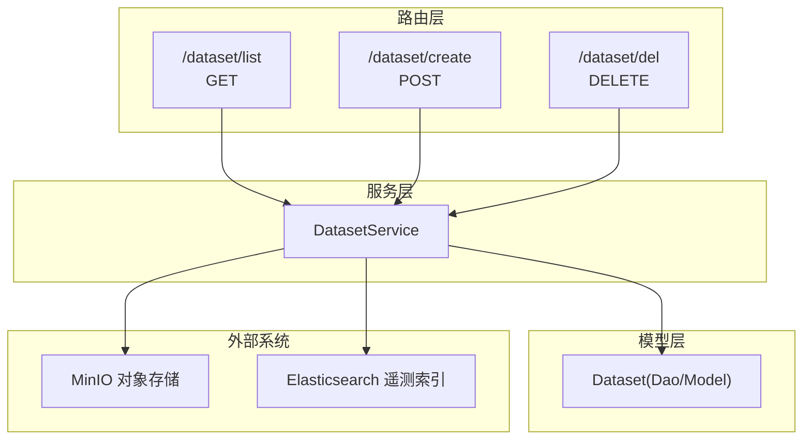
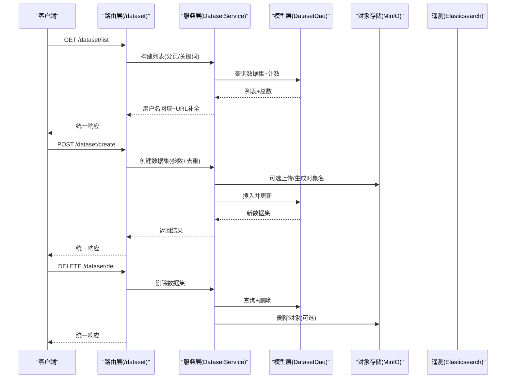
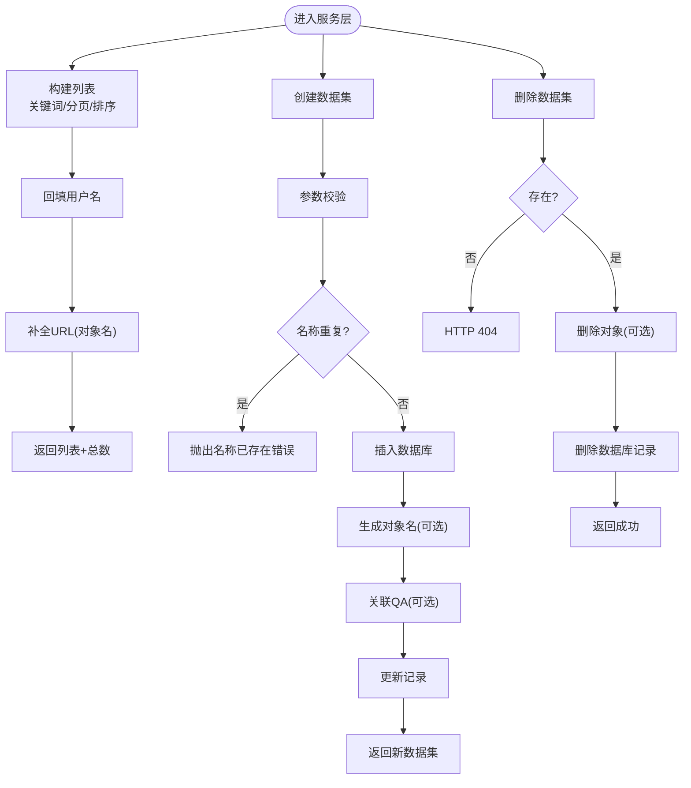
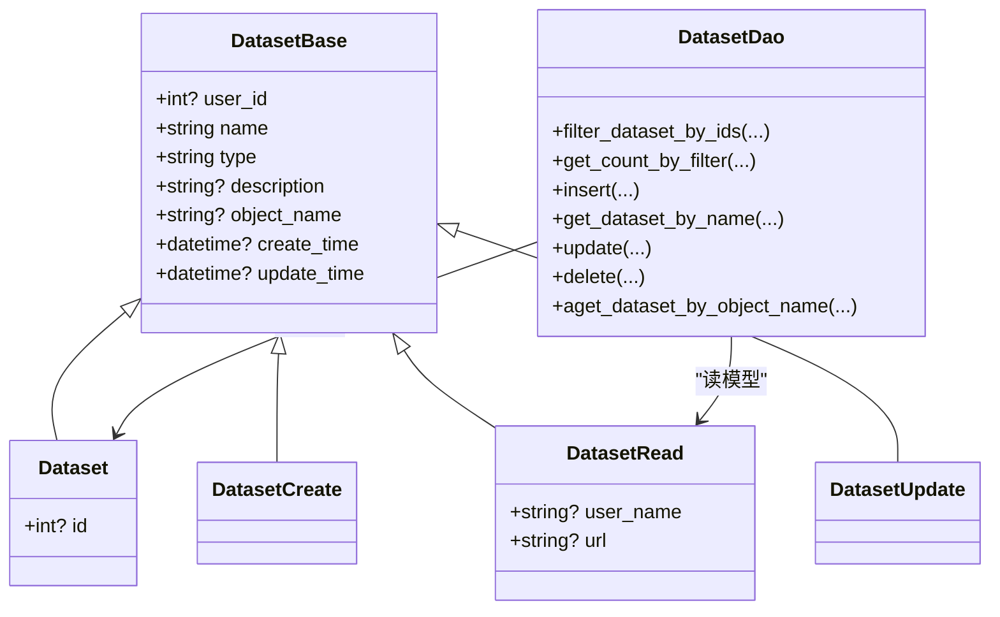
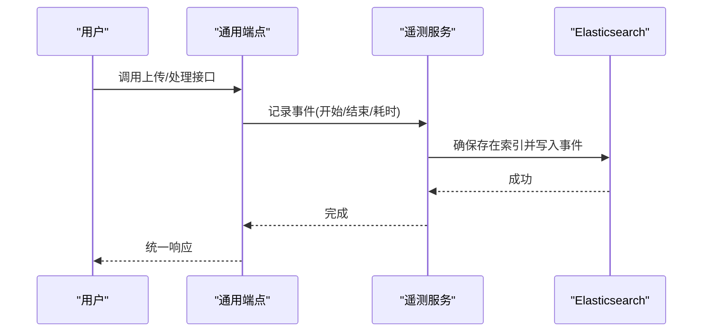
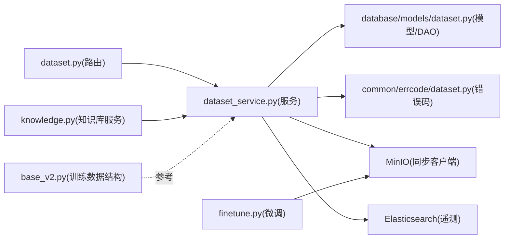

# 数据集管理 API

<cite>
**本文引用的文件**
- [dataset.py](file://src/backend/bisheng/api/v1/dataset.py)
- [dataset_service.py](file://src/backend/bisheng/api/services/dataset_service.py)
- [dataset_param.py](file://src/backend/bisheng/api/v1/schema/dataset_param.py)
- [dataset.py](file://src/backend/bisheng/database/models/dataset.py)
- [dataset.py](file://src/backend/bisheng/common/errcode/dataset.py)
- [endpoints.py](file://src/backend/bisheng/api/v1/endpoints.py)
- [knowledge.py](file://src/backend/bisheng/api/services/knowledge.py)
- [knowledge_file.py](file://src/backend/bisheng/knowledge/domain/models/knowledge_file.py)
- [finetune.py](file://src/backend/bisheng/finetune/domain/services/finetune.py)
- [base_v2.py](file://src/backend/bisheng_langchain/chains/qa_generation/base_v2.py)
- [manager.py](file://src/backend/bisheng/core/search/elasticsearch/manager.py)
- [telemetry_service.py](file://src/backend/bisheng/common/services/telemetry/telemetry_service.py)
</cite>

## 目录
1. [简介](#简介)
2. [项目结构](#项目结构)
3. [核心组件](#核心组件)
4. [架构总览](#架构总览)
5. [详细组件分析](#详细组件分析)
6. [依赖关系分析](#依赖关系分析)
7. [性能考量](#性能考量)
8. [故障排查指南](#故障排查指南)
9. [结论](#结论)
10. [附录](#附录)

## 简介
本文件面向数据集管理系统，提供从后端 API 到服务层、模型层的完整接口文档与实现解析。重点覆盖以下能力：
- 数据集的创建、查询列表、删除等基础操作
- 训练数据集、验证数据集、测试数据集的管理规范与实践建议
- 数据集与知识库的关联方式与边界
- 数据质量检查与版本控制的现状与扩展点
- 数据集统计分析、性能监控与数据治理的实用示例

## 项目结构
围绕数据集管理的关键代码分布在如下模块：
- 路由层：提供 REST API 入口，负责参数接收与响应封装
- 服务层：封装业务逻辑（如去重校验、对象存储交互、数据库更新）
- 模型层：定义数据模型、DAO 查询与事务处理
- 错误码：统一错误类型与消息
- 知识库与微调：展示数据集与知识库、训练任务的衔接点
- 性能监控：上传、处理流程中的遥测事件与指标

图表来源
- [dataset.py](file://src/backend/bisheng/api/v1/dataset.py#L15-L52)
- [dataset_service.py](file://src/backend/bisheng/api/services/dataset_service.py#L13-L79)
- [dataset.py](file://src/backend/bisheng/database/models/dataset.py#L40-L91)

章节来源
- [dataset.py](file://src/backend/bisheng/api/v1/dataset.py#L1-L53)
- [dataset_service.py](file://src/backend/bisheng/api/services/dataset_service.py#L1-L80)
- [dataset.py](file://src/backend/bisheng/database/models/dataset.py#L1-L92)

## 核心组件
- 路由与控制器
  - 提供三个核心端点：获取数据集列表、创建数据集、删除数据集
  - 使用统一响应封装与用户依赖注入进行鉴权
- 服务层
  - 列表构建：支持关键词过滤、分页、用户信息回填
  - 创建：参数校验、名称唯一性检查、对象存储路径生成、QA 列表关联预留
  - 删除：存在性校验、对象存储清理、数据库删除
- 模型层
  - 定义数据集基础字段、读写模型、DAO 查询与事务方法
- 错误码
  - 统一“数据集名称已存在”错误类型

章节来源
- [dataset.py](file://src/backend/bisheng/api/v1/dataset.py#L15-L52)
- [dataset_service.py](file://src/backend/bisheng/api/services/dataset_service.py#L13-L79)
- [dataset_param.py](file://src/backend/bisheng/api/v1/schema/dataset_param.py#L7-L12)
- [dataset.py](file://src/backend/bisheng/database/models/dataset.py#L11-L91)
- [dataset.py](file://src/backend/bisheng/common/errcode/dataset.py#L4-L8)

## 架构总览
下图展示了数据集管理在系统中的位置与交互：

图表来源
- [dataset.py](file://src/backend/bisheng/api/v1/dataset.py#L15-L52)
- [dataset_service.py](file://src/backend/bisheng/api/services/dataset_service.py#L16-L79)
- [dataset.py](file://src/backend/bisheng/database/models/dataset.py#L40-L91)

## 详细组件分析

### 数据集 API 规范
- 获取数据集列表
  - 方法与路径：GET /dataset/list
  - 查询参数：keyword（可选）、page、limit
  - 响应：包含列表与总数的统一格式
  - 实现要点：支持关键词模糊匹配、分页排序、用户信息回填
- 创建数据集
  - 方法与路径：POST /dataset/create
  - 请求体：CreateDatasetParam（名称、描述、文件URL、QA 列表）
  - 响应：返回新建数据集
  - 实现要点：参数校验、名称唯一性检查、对象存储路径生成、QA 关联预留
- 删除数据集
  - 方法与路径：DELETE /dataset/del
  - 查询参数：dataset_id
  - 响应：统一成功响应
  - 实现要点：存在性校验、对象存储清理、数据库删除

章节来源
- [dataset.py](file://src/backend/bisheng/api/v1/dataset.py#L15-L52)
- [dataset_param.py](file://src/backend/bisheng/api/v1/schema/dataset_param.py#L7-L12)
- [dataset_service.py](file://src/backend/bisheng/api/services/dataset_service.py#L16-L79)
- [dataset.py](file://src/backend/bisheng/database/models/dataset.py#L40-L91)

### 服务层实现模式
- 列表构建
  - 过滤条件：支持按名称关键词过滤
  - 分页与排序：按更新时间倒序
  - 用户信息：通过用户 ID 回填用户名
  - URL 补全：若存在对象名则作为访问 URL
- 创建流程
  - 参数校验：使用 Pydantic 模型
  - 去重策略：按名称查询是否存在
  - 存储路径：生成对象名（如需上传文件）
  - 关联扩展：为 QA 列表预留字段（插入时设置数据集 ID）
- 删除流程
  - 存在性校验：未找到返回 404
  - 对象清理：若存在对象名则调用 MinIO 同步客户端删除
  - 数据清理：执行数据库删除

图表来源
- [dataset_service.py](file://src/backend/bisheng/api/services/dataset_service.py#L16-L79)
- [dataset.py](file://src/backend/bisheng/database/models/dataset.py#L40-L91)
- [dataset.py](file://src/backend/bisheng/common/errcode/dataset.py#L4-L8)

章节来源
- [dataset_service.py](file://src/backend/bisheng/api/services/dataset_service.py#L13-L79)
- [dataset.py](file://src/backend/bisheng/database/models/dataset.py#L40-L91)
- [dataset.py](file://src/backend/bisheng/common/errcode/dataset.py#L4-L8)

### 数据模型与 DAO
- 数据集模型
  - 字段：用户 ID、名称、类型、描述、对象名、创建/更新时间
  - 读模型：扩展用户名与 URL 字段
- DAO 能力
  - 过滤查询：支持 ID 列表、关键词、分页
  - 计数：按过滤条件统计总数
  - CRUD：插入、按名查询、更新、删除
  - 异步查询：按对象名异步查询

图表来源
- [dataset.py](file://src/backend/bisheng/database/models/dataset.py#L11-L91)

章节来源
- [dataset.py](file://src/backend/bisheng/database/models/dataset.py#L11-L91)

### 训练/验证/测试数据集管理规范
- 设计建议
  - 类型字段：可在模型层扩展枚举或字符串标识区分训练/验证/测试
  - 标签体系：引入标签字段用于标注数据用途与版本
  - 分离存储：不同用途的数据集使用独立对象命名空间或桶
  - 版本化：以对象名后缀或元数据记录版本号，便于回溯与对比
- 当前实现状态
  - 模型层保留“type”字段，但默认值为 0；服务层未对用途做特殊处理
  - 建议在服务层增加用途校验与命名规范，避免混用

章节来源
- [dataset.py](file://src/backend/bisheng/database/models/dataset.py#L14-L14)
- [dataset_service.py](file://src/backend/bisheng/api/services/dataset_service.py#L43-L62)

### 数据集与知识库关联
- 关联方式
  - 数据集与知识库并非直接外键关联，而是通过业务流程耦合
  - 知识库侧提供 QA 与普通文档两类条目，可通过知识库 ID 批量查询
- 实践建议
  - 在数据集模型中新增“知识库 ID”字段，建立一对一或多对多映射
  - 导入流程：先创建数据集，再将数据集内容导入对应知识库集合
- 相关参考
  - 知识库 QA 条目模型与批量查询
  - 知识库权限校验（仅允许对 QA 类知识库进行写操作）

章节来源
- [knowledge_file.py](file://src/backend/bisheng/knowledge/domain/models/knowledge_file.py#L68-L503)
- [knowledge.py](file://src/backend/bisheng/api/services/knowledge.py#L1284-L1298)

### 数据质量检查与版本控制
- 数据质量检查
  - 现状：仓库内提供知识库数据一致性扫描脚本，可用于发现缺失或不一致的向量/索引条目
  - 建议：在数据集导入完成后，执行一致性检查并输出报告
- 版本控制
  - 现状：未见显式版本字段或版本表
  - 建议：引入版本表记录每次导入/更新的元数据（时间、来源、变更摘要），并在对象存储中以版本号命名

章节来源
- [knowledge_data_fix.py](file://src/backend/bisheng/script/knowledge_data_fix.py#L132-L232)

### 性能监控与数据治理示例
- 性能监控
  - 上传与处理流程：在通用端点中记录遥测事件（会话开始、处理耗时等）
  - 遥测索引：服务启动时自动确保 ES 索引存在
- 数据治理
  - 统一响应与错误码：所有 API 使用统一响应封装，错误码集中管理
  - 配置中心：前端 Web 配置项可动态下发与更新

图表来源
- [endpoints.py](file://src/backend/bisheng/api/v1/endpoints.py#L172-L350)
- [telemetry_service.py](file://src/backend/bisheng/common/services/telemetry/telemetry_service.py#L77-L111)
- [manager.py](file://src/backend/bisheng/core/search/elasticsearch/manager.py#L73-L121)

章节来源
- [endpoints.py](file://src/backend/bisheng/api/v1/endpoints.py#L172-L350)
- [telemetry_service.py](file://src/backend/bisheng/common/services/telemetry/telemetry_service.py#L77-L111)
- [manager.py](file://src/backend/bisheng/core/search/elasticsearch/manager.py#L73-L121)

## 依赖关系分析
- 路由依赖服务层，服务层依赖模型层与外部组件（MinIO、ES）
- 错误码集中于公共模块，被服务层抛出
- 知识库与微调模块提供了数据集与下游系统的衔接点

图表来源
- [dataset.py](file://src/backend/bisheng/api/v1/dataset.py#L1-L53)
- [dataset_service.py](file://src/backend/bisheng/api/services/dataset_service.py#L1-L80)
- [dataset.py](file://src/backend/bisheng/database/models/dataset.py#L1-L92)
- [dataset.py](file://src/backend/bisheng/common/errcode/dataset.py#L1-L8)
- [knowledge.py](file://src/backend/bisheng/api/services/knowledge.py#L1284-L1298)
- [finetune.py](file://src/backend/bisheng/finetune/domain/services/finetune.py#L69-L77)
- [base_v2.py](file://src/backend/bisheng_langchain/chains/qa_generation/base_v2.py#L89-L108)

章节来源
- [dataset.py](file://src/backend/bisheng/api/v1/dataset.py#L1-L53)
- [dataset_service.py](file://src/backend/bisheng/api/services/dataset_service.py#L1-L80)
- [dataset.py](file://src/backend/bisheng/database/models/dataset.py#L1-L92)
- [dataset.py](file://src/backend/bisheng/common/errcode/dataset.py#L1-L8)
- [knowledge.py](file://src/backend/bisheng/api/services/knowledge.py#L1284-L1298)
- [finetune.py](file://src/backend/bisheng/finetune/domain/services/finetune.py#L69-L77)
- [base_v2.py](file://src/backend/bisheng_langchain/chains/qa_generation/base_v2.py#L89-L108)

## 性能考量
- 列表查询
  - 建议对名称与用户 ID 建立复合索引，优化关键词与分页查询
  - 控制分页大小，避免超大偏移导致慢查询
- 对象存储
  - 大文件上传建议采用分片或断点续传策略（当前实现为一次性上传）
  - 删除对象时注意并发安全与失败重试
- 遥测写入
  - 批量写入 ES 时启用刷新间隔与批量提交，降低写放大

## 故障排查指南
- 常见错误
  - 数据集名称已存在：创建时触发，需更换名称或合并
  - 数据集不存在：删除时触发，确认 ID 是否正确
- 排查步骤
  - 检查请求参数是否符合 CreateDatasetParam 规范
  - 确认对象存储连接配置与桶权限
  - 查看 ES 遥测索引是否存在且映射正确
- 监控与日志
  - 上传/处理流程中的异常会被统一捕获并返回 500
  - 建议开启更细粒度的日志级别以便定位问题

章节来源
- [dataset.py](file://src/backend/bisheng/common/errcode/dataset.py#L4-L8)
- [dataset_service.py](file://src/backend/bisheng/api/services/dataset_service.py#L65-L79)
- [endpoints.py](file://src/backend/bisheng/api/v1/endpoints.py#L322-L325)
- [telemetry_service.py](file://src/backend/bisheng/common/services/telemetry/telemetry_service.py#L77-L111)

## 结论
- 当前数据集管理 API 提供了基础的增删改查能力，并与对象存储、遥测系统形成闭环
- 建议在模型层扩展用途与版本字段，在服务层完善用途校验与版本化策略
- 通过知识库与微调模块，数据集可自然延伸到下游应用，建议进一步明确映射关系与治理规范

## 附录
- 实用示例
  - 训练数据集导入：先创建数据集，再将文件上传至对象存储，最后在知识库中导入该集合
  - 数据质量检查：在导入完成后运行一致性扫描脚本，修复缺失或不一致的条目
  - 性能监控：关注上传与处理阶段的 ES 写入延迟与成功率