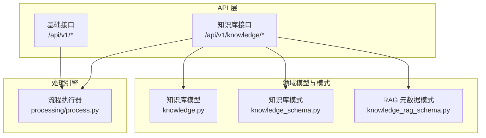
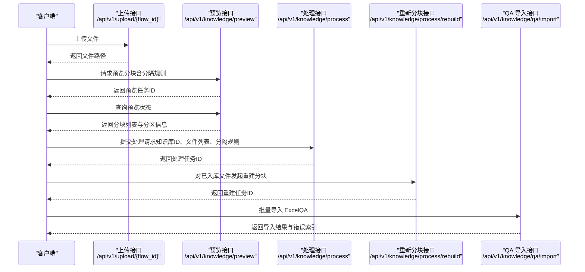
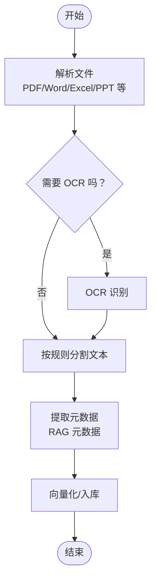
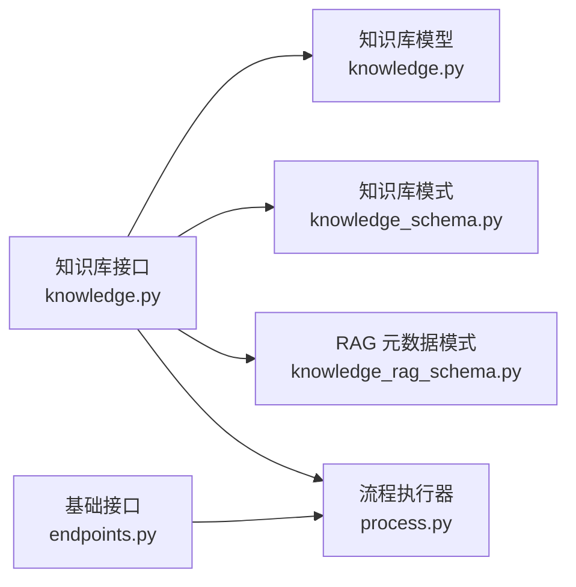

# 文档处理 API

<cite>
**本文引用的文件**
- [src/backend/bisheng/api/v1/endpoints.py](file://src/backend/bisheng/api/v1/endpoints.py)
- [src/backend/bisheng/api/v1/schemas.py](file://src/backend/bisheng/api/v1/schemas.py)
- [src/backend/bisheng/knowledge/api/endpoints/knowledge.py](file://src/backend/bisheng/knowledge/api/endpoints/knowledge.py)
- [src/backend/bisheng/knowledge/domain/models/knowledge.py](file://src/backend/bisheng/knowledge/domain/models/knowledge.py)
- [src/backend/bisheng/knowledge/domain/schemas/knowledge_schema.py](file://src/backend/bisheng/knowledge/domain/schemas/knowledge_schema.py)
- [src/backend/bisheng/knowledge/domain/schemas/knowledge_rag_schema.py](file://src/backend/bisheng/knowledge/domain/schemas/knowledge_rag_schema.py)
- [src/backend/bisheng/processing/process.py](file://src/backend/bisheng/processing/process.py)
</cite>

## 目录
1. [简介](#简介)
2. [项目结构](#项目结构)
3. [核心组件](#核心组件)
4. [架构总览](#架构总览)
5. [详细组件分析](#详细组件分析)
6. [依赖关系分析](#依赖关系分析)
7. [性能考量](#性能考量)
8. [故障排查指南](#故障排查指南)
9. [结论](#结论)
10. [附录](#附录)

## 简介
本文件为“文档处理系统”的 API 文档，聚焦于文档上传、解析、预处理与批量导入的接口规范，覆盖 PDF、Word、Excel、PPT 等多格式文档处理流程，并涵盖 OCR 识别、文本分割、元数据提取与格式转换等能力。同时提供文档质量评估、错误处理与性能优化的最佳实践建议。

## 项目结构
后端采用 FastAPI 路由组织知识库与通用基础接口，文档处理主要通过知识库路由完成，核心流程围绕“上传 → 预览分块 → 处理入库 → 批量导入（QA）”展开。

图表来源
- [src/backend/bisheng/api/v1/endpoints.py](file://src/backend/bisheng/api/v1/endpoints.py#L1-L428)
- [src/backend/bisheng/knowledge/api/endpoints/knowledge.py](file://src/backend/bisheng/knowledge/api/endpoints/knowledge.py#L1-L800)
- [src/backend/bisheng/knowledge/domain/models/knowledge.py](file://src/backend/bisheng/knowledge/domain/models/knowledge.py#L1-L532)
- [src/backend/bisheng/knowledge/domain/schemas/knowledge_schema.py](file://src/backend/bisheng/knowledge/domain/schemas/knowledge_schema.py#L1-L83)
- [src/backend/bisheng/knowledge/domain/schemas/knowledge_rag_schema.py](file://src/backend/bisheng/knowledge/domain/schemas/knowledge_rag_schema.py#L1-L20)
- [src/backend/bisheng/processing/process.py](file://src/backend/bisheng/processing/process.py#L1-L357)

章节来源
- [src/backend/bisheng/api/v1/endpoints.py](file://src/backend/bisheng/api/v1/endpoints.py#L1-L428)
- [src/backend/bisheng/knowledge/api/endpoints/knowledge.py](file://src/backend/bisheng/knowledge/api/endpoints/knowledge.py#L1-L800)

## 核心组件
- 基础接口层：提供通用上传、环境配置查询、流程执行等能力。
- 知识库接口层：提供文档上传、预览分块、处理入库、QA 导入与导出、元数据管理等。
- 领域模型与模式：定义知识库类型、状态、元数据字段与 RAG 元数据结构。
- 流程执行器：封装图式构建与执行、缓存与会话管理、中间步骤处理等。

章节来源
- [src/backend/bisheng/api/v1/schemas.py](file://src/backend/bisheng/api/v1/schemas.py#L424-L524)
- [src/backend/bisheng/knowledge/domain/models/knowledge.py](file://src/backend/bisheng/knowledge/domain/models/knowledge.py#L18-L72)
- [src/backend/bisheng/knowledge/domain/schemas/knowledge_rag_schema.py](file://src/backend/bisheng/knowledge/domain/schemas/knowledge_rag_schema.py#L6-L20)
- [src/backend/bisheng/processing/process.py](file://src/backend/bisheng/processing/process.py#L154-L245)

## 架构总览
文档处理整体流程从“上传文件”开始，进入“预览分块”，随后根据配置进行“处理入库”，支持对已入库文档进行“重新分块处理”。对于 QA 类知识库，提供“预览导入”和“批量导入”能力，并支持导出模板与结果。

图表来源
- [src/backend/bisheng/api/v1/endpoints.py](file://src/backend/bisheng/api/v1/endpoints.py#L403-L420)
- [src/backend/bisheng/knowledge/api/endpoints/knowledge.py](file://src/backend/bisheng/knowledge/api/endpoints/knowledge.py#L116-L213)
- [src/backend/bisheng/knowledge/api/endpoints/knowledge.py](file://src/backend/bisheng/knowledge/api/endpoints/knowledge.py#L192-L201)
- [src/backend/bisheng/knowledge/api/endpoints/knowledge.py](file://src/backend/bisheng/knowledge/api/endpoints/knowledge.py#L205-L213)
- [src/backend/bisheng/knowledge/api/endpoints/knowledge.py](file://src/backend/bisheng/knowledge/api/endpoints/knowledge.py#L731-L792)

## 详细组件分析

### 1) 通用上传与环境接口
- 上传文件到工作流目录
  - 方法与路径：POST /api/v1/upload/{flow_id}
  - 输入：multipart/form-data，file 字段
  - 输出：UploadFileResponse（包含 flowId、file_path）
  - 行为：保存文件至本地临时目录，返回相对路径
- 图标上传（可选）
  - 方法与路径：POST /api/v1/upload/icon
  - 输入：multipart/form-data，file 字段（限制 jpeg/jpg/png）
  - 输出：UploadFileResponse（minio 可访问链接）
- 环境查询
  - 方法与路径：GET /api/v1/env
  - 输出：环境参数（包含支持的文件扩展名、是否启用 etl4lm、版本号等）

章节来源
- [src/backend/bisheng/api/v1/endpoints.py](file://src/backend/bisheng/api/v1/endpoints.py#L403-L420)
- [src/backend/bisheng/api/v1/endpoints.py](file://src/backend/bisheng/api/v1/endpoints.py#L371-L401)
- [src/backend/bisheng/api/v1/endpoints.py](file://src/backend/bisheng/api/v1/endpoints.py#L71-L98)

### 2) 知识库上传与去重
- 普通上传（原始文件）
  - 方法与路径：POST /api/v1/knowledge/upload
  - 输入：multipart/form-data，file 字段
  - 输出：UploadFileResponse（file_path）
- 知识库上传（带去重）
  - 方法与路径：POST /api/v1/knowledge/upload/{knowledge_id}
  - 输入：multipart/form-data，file 字段
  - 输出：UploadFileResponse（含重复标记与重复文件信息）
  - 行为：计算文件 SHA256，查询知识库内重复文件，返回重复状态

章节来源
- [src/backend/bisheng/knowledge/api/endpoints/knowledge.py](file://src/backend/bisheng/knowledge/api/endpoints/knowledge.py#L51-L114)

### 3) 预览分块与更新
- 预览分块（异步）
  - 方法与路径：POST /api/v1/knowledge/preview
  - 输入：KnowledgeFileProcess（包含 knowledge_id、file_list、分隔规则、是否 OCR、公式识别等）
  - 输出：{ preview_file_id }
  - 行为：后台任务生成预览，Redis 缓存状态与结果
- 预览状态查询
  - 方法与路径：GET /api/v1/knowledge/preview/status
  - 输入：preview_file_id
  - 输出：状态与数据（completed/error）
- 更新/删除预览分块
  - PUT /api/v1/knowledge/preview
  - DELETE /api/v1/knowledge/preview
  - 输入：UpdatePreviewFileChunk（knowledge_id、file_path、text、chunk_index、bbox）

章节来源
- [src/backend/bisheng/knowledge/api/endpoints/knowledge.py](file://src/backend/bisheng/knowledge/api/endpoints/knowledge.py#L116-L190)
- [src/backend/bisheng/api/v1/schemas.py](file://src/backend/bisheng/api/v1/schemas.py#L475-L487)

### 4) 文档处理入库
- 处理入库（异步）
  - 方法与路径：POST /api/v1/knowledge/process
  - 输入：KnowledgeFileProcess（包含 knowledge_id、file_list、分隔规则、回调地址、额外信息）
  - 输出：任务标识
  - 行为：后台任务执行解析、OCR、文本分割、向量入库
- 重新分块处理
  - 方法与路径：POST /api/v1/knowledge/process/rebuild
  - 输入：KnowledgeFileReProcess（包含 kb_file_id、file_path、分隔规则、回调地址、额外信息）
  - 输出：任务标识

章节来源
- [src/backend/bisheng/knowledge/api/endpoints/knowledge.py](file://src/backend/bisheng/knowledge/api/endpoints/knowledge.py#L192-L213)
- [src/backend/bisheng/knowledge/api/endpoints/knowledge.py](file://src/backend/bisheng/knowledge/api/endpoints/knowledge.py#L205-L213)
- [src/backend/bisheng/api/v1/schemas.py](file://src/backend/bisheng/api/v1/schemas.py#L495-L508)

### 5) QA 知识库导入与导出
- 预览导入（Excel）
  - 方法与路径：POST /api/v1/knowledge/qa/preview/{qa_knowledge_id}
  - 输入：file_url、size、offset
  - 输出：预览插入数据片段
- 批量导入（Excel）
  - 方法与路径：POST /api/v1/knowledge/qa/import/{qa_knowledge_id}
  - 输入：file_list、background_tasks
  - 输出：errors（错误索引列表）
  - 行为：读取 Excel，校验列名，去重与去空，批量写入数据库并异步入库
- 导出模板与结果
  - GET /api/v1/knowledge/qa/export/template
  - GET /api/v1/knowledge/qa/export/{qa_knowledge_id}

章节来源
- [src/backend/bisheng/knowledge/api/endpoints/knowledge.py](file://src/backend/bisheng/knowledge/api/endpoints/knowledge.py#L694-L792)

### 6) 元数据与 RAG 元数据
- 元数据字段管理
  - 添加/更新知识库元数据字段（请求体见模式）
  - 修改文件用户自定义元数据（请求体见模式）
- RAG 元数据结构
  - 包含文档 ID、名称、摘要、块索引、bbox、页码、知识库 ID、上传/更新时间、上传者/更新者、用户自定义元数据等

章节来源
- [src/backend/bisheng/knowledge/domain/schemas/knowledge_schema.py](file://src/backend/bisheng/knowledge/domain/schemas/knowledge_schema.py#L18-L83)
- [src/backend/bisheng/knowledge/domain/schemas/knowledge_rag_schema.py](file://src/backend/bisheng/knowledge/domain/schemas/knowledge_rag_schema.py#L6-L20)

### 7) 文档类型与支持范围
- 支持的扩展名（示例）：doc、docx、ppt、pptx、xls、xlsx、txt、md、html、pdf、csv
- 当启用 etl4lm 时，图片类扩展名（png、jpg、jpeg、bmp）也可被支持
- 环境接口会动态合并支持列表

章节来源
- [src/backend/bisheng/api/v1/endpoints.py](file://src/backend/bisheng/api/v1/endpoints.py#L75-L80)
- [src/backend/bisheng/api/v1/endpoints.py](file://src/backend/bisheng/api/v1/endpoints.py#L97-L98)

### 8) 文档处理流程（算法级）

图表来源
- [src/backend/bisheng/knowledge/api/endpoints/knowledge.py](file://src/backend/bisheng/knowledge/api/endpoints/knowledge.py#L116-L213)
- [src/backend/bisheng/knowledge/domain/schemas/knowledge_rag_schema.py](file://src/backend/bisheng/knowledge/domain/schemas/knowledge_rag_schema.py#L6-L20)

## 依赖关系分析
- 知识库接口依赖领域模型与模式，用于约束输入输出与业务状态。
- 预览与处理流程通过 Redis 缓存任务状态，避免阻塞请求。
- 流程执行器负责图式构建、缓存与会话管理，支撑同步/异步处理。

图表来源
- [src/backend/bisheng/knowledge/api/endpoints/knowledge.py](file://src/backend/bisheng/knowledge/api/endpoints/knowledge.py#L1-L800)
- [src/backend/bisheng/knowledge/domain/models/knowledge.py](file://src/backend/bisheng/knowledge/domain/models/knowledge.py#L1-L532)
- [src/backend/bisheng/knowledge/domain/schemas/knowledge_schema.py](file://src/backend/bisheng/knowledge/domain/schemas/knowledge_schema.py#L1-L83)
- [src/backend/bisheng/knowledge/domain/schemas/knowledge_rag_schema.py](file://src/backend/bisheng/knowledge/domain/schemas/knowledge_rag_schema.py#L1-L20)
- [src/backend/bisheng/processing/process.py](file://src/backend/bisheng/processing/process.py#L154-L245)

章节来源
- [src/backend/bisheng/knowledge/api/endpoints/knowledge.py](file://src/backend/bisheng/knowledge/api/endpoints/knowledge.py#L1-L800)
- [src/backend/bisheng/processing/process.py](file://src/backend/bisheng/processing/process.py#L154-L245)

## 性能考量
- 异步化：预览与处理均采用后台任务与 Redis 状态缓存，避免长耗时阻塞。
- 分块策略：合理设置分隔符、分隔规则、分块大小与重叠，平衡召回与检索效率。
- OCR 与公式识别：按需开启，避免不必要的计算开销。
- 缓存与会话：流程执行器支持会话缓存与清理，减少重复构建成本。
- 批量导入：Excel 导入前进行去重与空值过滤，降低入库失败率与二次处理成本。

## 故障排查指南
- 文件上传失败
  - 检查文件大小与扩展名是否在支持范围内；查看服务端异常日志。
- 预览状态异常
  - 使用预览状态接口确认任务状态；若为 error，检查上游解析与 OCR 配置。
- 处理任务未完成
  - 确认后台任务队列运行状态；检查回调地址可达性与幂等性。
- QA 导入错误
  - 校验 Excel 列名（必须包含 Question 与 Answer）；查看返回的错误索引定位问题行。
- 权限与去重
  - 确认用户对知识库的写权限；重复文件会被标记并返回重复信息。

章节来源
- [src/backend/bisheng/knowledge/api/endpoints/knowledge.py](file://src/backend/bisheng/knowledge/api/endpoints/knowledge.py#L116-L190)
- [src/backend/bisheng/knowledge/api/endpoints/knowledge.py](file://src/backend/bisheng/knowledge/api/endpoints/knowledge.py#L731-L792)

## 结论
该文档处理 API 以“上传 → 预览分块 → 处理入库 → 批量导入（QA）”为主线，结合 OCR、文本分割、元数据提取与格式转换，形成完整的多格式文档处理闭环。通过异步任务与缓存机制提升吞吐，配合严格的输入模式与错误码体系保障稳定性。建议在生产中结合分块策略、OCR 开关与批量导入去重逻辑，持续优化处理质量与性能。

## 附录

### A. 关键请求/响应模式概览
- 上传文件响应：UploadFileResponse（包含 flowId、file_path、relative_path 等）
- 预览分块请求：KnowledgeFileProcess（包含 knowledge_id、file_list、分隔规则、OCR/公式识别开关等）
- 预览分块响应：{ preview_file_id }
- 处理入库请求：KnowledgeFileProcess（可带回调地址与额外信息）
- 重新分块请求：KnowledgeFileReProcess（基于已入库文件）
- QA 预览导入请求：file_url、size、offset
- QA 批量导入请求：file_list、background_tasks
- RAG 元数据：Metadata（包含 document_id、document_name、abstract、chunk_index、bbox、page、knowledge_id、upload_time、update_time、uploader、updater、user_metadata）

章节来源
- [src/backend/bisheng/api/v1/schemas.py](file://src/backend/bisheng/api/v1/schemas.py#L212-L222)
- [src/backend/bisheng/api/v1/schemas.py](file://src/backend/bisheng/api/v1/schemas.py#L475-L508)
- [src/backend/bisheng/knowledge/domain/schemas/knowledge_rag_schema.py](file://src/backend/bisheng/knowledge/domain/schemas/knowledge_rag_schema.py#L6-L20)