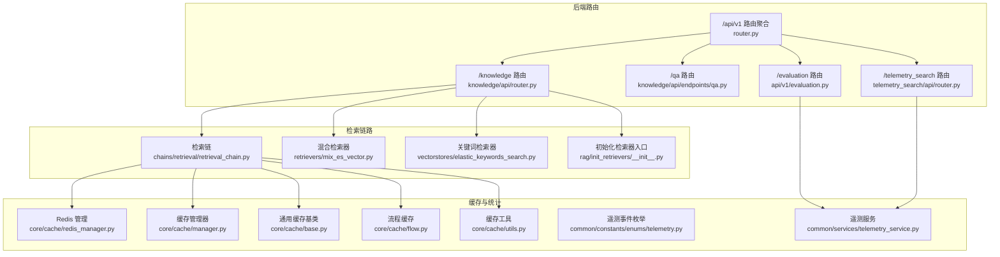
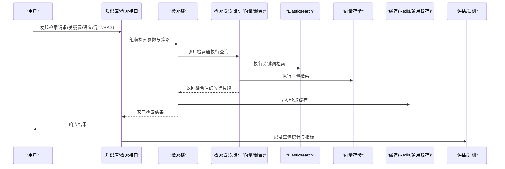
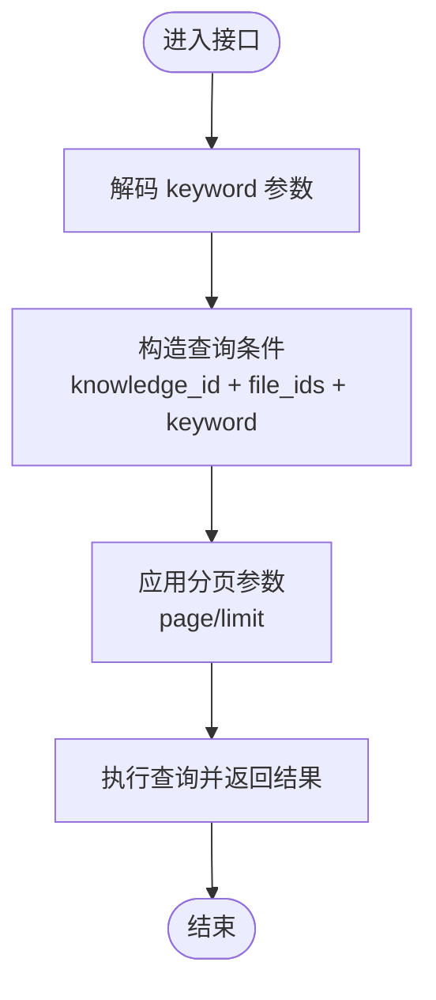
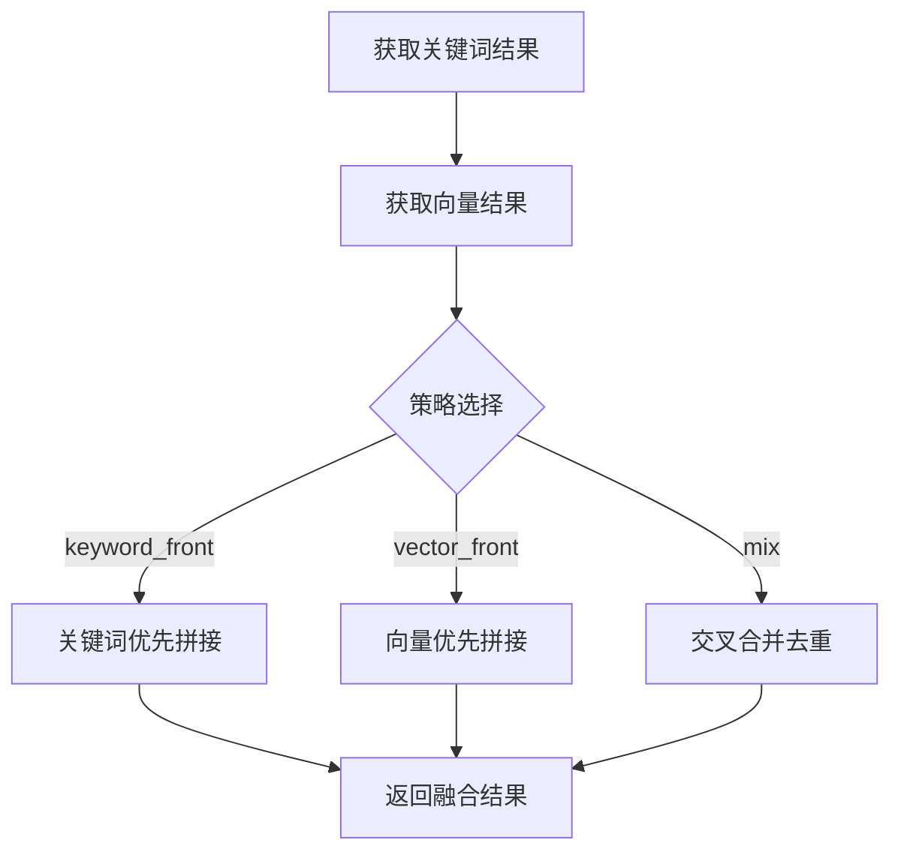
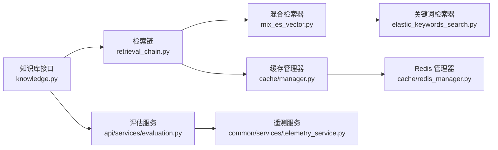

# 检索查询 API

<cite>
**本文引用的文件**
- [src/backend/bisheng/api/router.py](file://src/backend/bisheng/api/router.py)
- [src/backend/bisheng/api/v1/schemas.py](file://src/backend/bisheng/api/v1/schemas.py)
- [src/backend/bisheng/knowledge/api/router.py](file://src/backend/bisheng/knowledge/api/router.py)
- [src/backend/bisheng/knowledge/api/endpoints/knowledge.py](file://src/backend/bisheng/knowledge/api/endpoints/knowledge.py)
- [src/backend/bisheng/knowledge/api/endpoints/qa.py](file://src/backend/bisheng/knowledge/api/endpoints/qa.py)
- [src/backend/bisheng/api/v1/evaluation.py](file://src/backend/bisheng/api/v1/evaluation.py)
- [src/backend/bisheng/api/services/evaluation.py](file://src/backend/bisheng/api/services/evaluation.py)
- [src/backend/bisheng_langchain/retrievers/mix_es_vector.py](file://src/backend/bisheng_langchain/retrievers/mix_es_vector.py)
- [src/backend/bisheng_langchain/rag/init_retrievers/__init__.py](file://src/backend/bisheng_langchain/rag/init_retrievers/__init__.py)
- [src/backend/bisheng_langchain/vectorstores/elastic_keywords_search.py](file://src/backend/bisheng_langchain/vectorstores/elastic_keywords_search.py)
- [src/backend/bisheng_langchain/chains/retrieval/retrieval_chain.py](file://src/backend/bisheng_langchain/chains/retrieval/retrieval_chain.py)
- [src/backend/bisheng/core/cache/redis_manager.py](file://src/backend/bisheng/core/cache/redis_manager.py)
- [src/backend/bisheng/core/cache/manager.py](file://src/backend/bisheng/core/cache/manager.py)
- [src/backend/bisheng/core/cache/base.py](file://src/backend/bisheng/core/cache/base.py)
- [src/backend/bisheng/core/cache/flow.py](file://src/backend/bisheng/core/cache/flow.py)
- [src/backend/bisheng/core/cache/utils.py](file://src/backend/bisheng/core/cache/utils.py)
- [src/backend/bisheng/common/constants/enums/telemetry.py](file://src/backend/bisheng/common/constants/enums/telemetry.py)
- [src/backend/bisheng/common/services/telemetry_service.py](file://src/backend/bisheng/common/services/telemetry_service.py)
- [src/backend/bisheng/telemetry_search/api/router.py](file://src/backend/bisheng/telemetry_search/api/router.py)
- [src/backend/bisheng/telemetry_search/api/endpoints/search.py](file://src/backend/bisheng/telemetry_search/api/endpoints/search.py)
- [src/backend/bisheng/telemetry_search/domain/models/search.py](file://src/backend/bisheng/telemetry_search/domain/models/search.py)
- [src/backend/bisheng/telemetry_search/domain/services/search.py](file://src/backend/bisheng/telemetry_search/domain/services/search.py)
- [src/backend/bisheng/telemetry_search/domain/schemas/search.py](file://src/backend/bisheng/telemetry_search/domain/schemas/search.py)
</cite>

## 目录
1. [简介](#简介)
2. [项目结构](#项目结构)
3. [核心组件](#核心组件)
4. [架构总览](#架构总览)
5. [详细组件分析](#详细组件分析)
6. [依赖分析](#依赖分析)
7. [性能考虑](#性能考虑)
8. [故障排查指南](#故障排查指南)
9. [结论](#结论)
10. [附录](#附录)

## 简介
本文件面向检索查询系统，提供关键词检索、语义检索、混合检索与 RAG 查询的接口规范与实现要点说明。内容覆盖检索策略配置、结果排序、过滤条件、分页查询、性能优化、缓存策略、查询统计与评估、错误处理与调试工具等。

## 项目结构
后端采用 FastAPI 路由聚合，检索相关能力主要分布在知识库与 RAG 链路中，并通过统一路由挂载到 /api/v1 与 /api/v2 前缀下。前端通过独立的前端仓库调用这些接口。

**图表来源**
- [src/backend/bisheng/api/router.py](file://src/backend/bisheng/api/router.py#L23-L60)
- [src/backend/bisheng/knowledge/api/router.py](file://src/backend/bisheng/knowledge/api/router.py#L1-L4)
- [src/backend/bisheng/knowledge/api/endpoints/knowledge.py](file://src/backend/bisheng/knowledge/api/endpoints/knowledge.py#L1-L120)
- [src/backend/bisheng/knowledge/api/endpoints/qa.py](file://src/backend/bisheng/knowledge/api/endpoints/qa.py#L1-L40)
- [src/backend/bisheng/api/v1/evaluation.py](file://src/backend/bisheng/api/v1/evaluation.py#L1-L40)
- [src/backend/bisheng/telemetry_search/api/router.py](file://src/backend/bisheng/telemetry_search/api/router.py#L1-L20)
- [src/backend/bisheng_langchain/chains/retrieval/retrieval_chain.py](file://src/backend/bisheng_langchain/chains/retrieval/retrieval_chain.py#L1-L120)
- [src/backend/bisheng_langchain/retrievers/mix_es_vector.py](file://src/backend/bisheng_langchain/retrievers/mix_es_vector.py#L34-L112)
- [src/backend/bisheng_langchain/vectorstores/elastic_keywords_search.py](file://src/backend/bisheng_langchain/vectorstores/elastic_keywords_search.py#L1-L120)
- [src/backend/bisheng/core/cache/redis_manager.py](file://src/backend/bisheng/core/cache/redis_manager.py#L1-L120)
- [src/backend/bisheng/common/constants/enums/telemetry.py](file://src/backend/bisheng/common/constants/enums/telemetry.py#L1-L120)
- [src/backend/bisheng/common/services/telemetry_service.py](file://src/backend/bisheng/common/services/telemetry_service.py#L1-L120)

**章节来源**
- [src/backend/bisheng/api/router.py](file://src/backend/bisheng/api/router.py#L23-L60)
- [src/backend/bisheng/knowledge/api/router.py](file://src/backend/bisheng/knowledge/api/router.py#L1-L4)

## 核心组件
- 检索链：封装检索策略与结果处理，支持关键词、向量与混合策略。
- 混合检索器：组合关键词与向量检索结果，支持多种融合策略。
- 关键词检索器：基于 ElasticKeywordsSearch 的关键词检索实现。
- 初始化检索器入口：提供向量、关键词、混合与小块向量检索器的工厂入口。
- 缓存层：Redis 管理器与通用缓存基类，支撑检索中间结果与会话缓存。
- 评估与遥测：评估任务与查询统计埋点，便于检索效果评估与性能监控。

**章节来源**
- [src/backend/bisheng_langchain/chains/retrieval/retrieval_chain.py](file://src/backend/bisheng_langchain/chains/retrieval/retrieval_chain.py#L1-L120)
- [src/backend/bisheng_langchain/retrievers/mix_es_vector.py](file://src/backend/bisheng_langchain/retrievers/mix_es_vector.py#L34-L112)
- [src/backend/bisheng_langchain/vectorstores/elastic_keywords_search.py](file://src/backend/bisheng_langchain/vectorstores/elastic_keywords_search.py#L1-L120)
- [src/backend/bisheng_langchain/rag/init_retrievers/__init__.py](file://src/backend/bisheng_langchain/rag/init_retrievers/__init__.py#L1-L4)
- [src/backend/bisheng/core/cache/redis_manager.py](file://src/backend/bisheng/core/cache/redis_manager.py#L1-L120)
- [src/backend/bisheng/core/cache/base.py](file://src/backend/bisheng/core/cache/base.py#L1-L120)

## 架构总览
检索查询系统围绕“知识库 + 检索链 + 缓存 + 评估/遥测”的闭环构建。用户通过知识库接口上传/预览/处理文件，随后在检索链中选择关键词、语义或混合策略进行查询，结果经缓存与统计模块记录，最终由评估模块对检索质量进行度量。

**图表来源**
- [src/backend/bisheng/knowledge/api/endpoints/knowledge.py](file://src/backend/bisheng/knowledge/api/endpoints/knowledge.py#L116-L151)
- [src/backend/bisheng_langchain/chains/retrieval/retrieval_chain.py](file://src/backend/bisheng_langchain/chains/retrieval/retrieval_chain.py#L1-L120)
- [src/backend/bisheng_langchain/retrievers/mix_es_vector.py](file://src/backend/bisheng_langchain/retrievers/mix_es_vector.py#L34-L112)
- [src/backend/bisheng/core/cache/redis_manager.py](file://src/backend/bisheng/core/cache/redis_manager.py#L1-L120)
- [src/backend/bisheng/common/services/telemetry_service.py](file://src/backend/bisheng/common/services/telemetry_service.py#L1-L120)

## 详细组件分析

### 关键词检索
- 接口位置：知识库预览与文件处理流程中，提供分页与关键字过滤能力。
- 关键参数
  - 分页：page、limit
  - 过滤：keyword（支持 URL 解码）
  - 其他：knowledge_id、file_ids
- 处理逻辑：对 keyword 进行 URL 解码后，按分页返回匹配的文本块与总数。

**图表来源**
- [src/backend/bisheng/knowledge/api/endpoints/knowledge.py](file://src/backend/bisheng/knowledge/api/endpoints/knowledge.py#L431-L447)

**章节来源**
- [src/backend/bisheng/knowledge/api/endpoints/knowledge.py](file://src/backend/bisheng/knowledge/api/endpoints/knowledge.py#L431-L447)

### 语义检索
- 实现方式：通过向量检索器从向量数据库获取相似文档。
- 关键参数：与关键词检索一致的分页与过滤参数，结合向量嵌入模型配置。
- 结果：返回与查询向量最相似的文档片段列表。

**章节来源**
- [src/backend/bisheng_langchain/vectorstores/elastic_keywords_search.py](file://src/backend/bisheng_langchain/vectorstores/elastic_keywords_search.py#L1-L120)

### 混合检索
- 实现方式：组合关键词与向量检索结果，支持 keyword_front、vector_front、mix 三种融合策略。
- 关键参数：combine_strategy（策略名）、向量/关键词检索器实例。
- 结果：根据策略合并去重后的候选片段。

**图表来源**
- [src/backend/bisheng_langchain/retrievers/mix_es_vector.py](file://src/backend/bisheng_langchain/retrievers/mix_es_vector.py#L47-L112)

**章节来源**
- [src/backend/bisheng_langchain/retrievers/mix_es_vector.py](file://src/backend/bisheng_langchain/retrievers/mix_es_vector.py#L34-L112)

### RAG 查询
- 实现方式：通过检索链整合检索器输出，结合提示词模板与大模型生成最终回答。
- 关键参数：检索策略、检索器类型、上下文窗口大小、流式输出开关等。
- 结果：返回结构化响应，包含检索片段、生成答案与可选的流式事件。

**章节来源**
- [src/backend/bisheng_langchain/chains/retrieval/retrieval_chain.py](file://src/backend/bisheng_langchain/chains/retrieval/retrieval_chain.py#L1-L120)

### 检索策略配置
- 策略入口：初始化检索器入口提供多种检索器工厂方法。
- 可配置项：检索器类型（向量/关键词/混合/小块向量）、融合策略、向量维度、相似度阈值等。

**章节来源**
- [src/backend/bisheng_langchain/rag/init_retrievers/__init__.py](file://src/backend/bisheng_langchain/rag/init_retrievers/__init__.py#L1-L4)

### 结果排序、过滤与分页
- 排序字段：支持按 create_time、update_time、name 排序（知识库列表）。
- 过滤条件：关键词过滤、状态过滤、文件 ID 过滤等。
- 分页参数：page/page_size 或 page/limit，具体视接口而定。

**章节来源**
- [src/backend/bisheng/knowledge/api/endpoints/knowledge.py](file://src/backend/bisheng/knowledge/api/endpoints/knowledge.py#L283-L298)
- [src/backend/bisheng/knowledge/api/endpoints/knowledge.py](file://src/backend/bisheng/knowledge/api/endpoints/knowledge.py#L353-L373)
- [src/backend/bisheng/knowledge/api/endpoints/knowledge.py](file://src/backend/bisheng/knowledge/api/endpoints/knowledge.py#L431-L447)

### 缓存策略
- 缓存组件：Redis 管理器、通用缓存基类、流程缓存与缓存工具。
- 使用场景：预览文件分片结果、会话状态、检索中间结果等。
- 生命周期：设置过期时间、键空间清理、客户端侧失效通知等。

**章节来源**
- [src/backend/bisheng/core/cache/redis_manager.py](file://src/backend/bisheng/core/cache/redis_manager.py#L1-L120)
- [src/backend/bisheng/core/cache/manager.py](file://src/backend/bisheng/core/cache/manager.py#L1-L120)
- [src/backend/bisheng/core/cache/base.py](file://src/backend/bisheng/core/cache/base.py#L1-L120)
- [src/backend/bisheng/core/cache/flow.py](file://src/backend/bisheng/core/cache/flow.py#L1-L120)
- [src/backend/bisheng/core/cache/utils.py](file://src/backend/bisheng/core/cache/utils.py#L1-L120)

### 查询统计与遥测
- 遥测事件：定义了删除知识文件、新增知识文件等事件类型。
- 遥测服务：异步记录事件，便于后续分析检索行为与系统健康度。
- 评估集成：评估任务与进度通过 Redis 键维护，前端轮询获取状态。

**章节来源**
- [src/backend/bisheng/common/constants/enums/telemetry.py](file://src/backend/bisheng/common/constants/enums/telemetry.py#L1-L120)
- [src/backend/bisheng/common/services/telemetry_service.py](file://src/backend/bisheng/common/services/telemetry_service.py#L1-L120)
- [src/backend/bisheng/api/services/evaluation.py](file://src/backend/bisheng/api/services/evaluation.py#L41-L116)

### 检索效果评估
- 评估任务：支持 CSV 导入、任务后台执行、进度上报与结果下载。
- 指标汇总：计算平均分与各维度得分，生成评估报告文件并上传对象存储。
- 错误处理：异常捕获与描述截断，避免错误信息过长。

**章节来源**
- [src/backend/bisheng/api/v1/evaluation.py](file://src/backend/bisheng/api/v1/evaluation.py#L19-L104)
- [src/backend/bisheng/api/services/evaluation.py](file://src/backend/bisheng/api/services/evaluation.py#L118-L425)

## 依赖分析
检索查询系统的关键依赖关系如下：

**图表来源**
- [src/backend/bisheng/knowledge/api/endpoints/knowledge.py](file://src/backend/bisheng/knowledge/api/endpoints/knowledge.py#L116-L151)
- [src/backend/bisheng_langchain/chains/retrieval/retrieval_chain.py](file://src/backend/bisheng_langchain/chains/retrieval/retrieval_chain.py#L1-L120)
- [src/backend/bisheng_langchain/retrievers/mix_es_vector.py](file://src/backend/bisheng_langchain/retrievers/mix_es_vector.py#L34-L112)
- [src/backend/bisheng_langchain/vectorstores/elastic_keywords_search.py](file://src/backend/bisheng_langchain/vectorstores/elastic_keywords_search.py#L1-L120)
- [src/backend/bisheng/core/cache/manager.py](file://src/backend/bisheng/core/cache/manager.py#L1-L120)
- [src/backend/bisheng/core/cache/redis_manager.py](file://src/backend/bisheng/core/cache/redis_manager.py#L1-L120)
- [src/backend/bisheng/api/services/evaluation.py](file://src/backend/bisheng/api/services/evaluation.py#L41-L116)
- [src/backend/bisheng/common/services/telemetry_service.py](file://src/backend/bisheng/common/services/telemetry_service.py#L1-L120)

**章节来源**
- [src/backend/bisheng/knowledge/api/endpoints/knowledge.py](file://src/backend/bisheng/knowledge/api/endpoints/knowledge.py#L116-L151)
- [src/backend/bisheng_langchain/chains/retrieval/retrieval_chain.py](file://src/backend/bisheng_langchain/chains/retrieval/retrieval_chain.py#L1-L120)
- [src/backend/bisheng/core/cache/manager.py](file://src/backend/bisheng/core/cache/manager.py#L1-L120)

## 性能考虑
- 检索策略
  - 混合检索：合理选择融合策略，避免过度去重导致召回下降。
  - 向量检索：控制向量维度与相似度阈值，减少无效候选。
- 缓存
  - 预览与分页结果使用 Redis 缓存，设置合理过期时间，降低重复查询成本。
  - 客户端侧缓存失效表内存上限可控，防止内存膨胀。
- 并发与异步
  - 文件预览与导入采用后台任务，避免阻塞主请求。
- 数据库与存储
  - Elasticsearch 与向量存储的连接池与批量写入策略需按负载调整。

[本节为通用指导，无需列出具体文件来源]

## 故障排查指南
- 常见错误
  - 文件预览失败：检查 Redis 键是否存在与状态是否为 completed/error。
  - 评估任务失败：查看错误描述截断信息，定位异常堆栈。
  - 权限不足：知识库写权限校验未通过时返回未授权错误。
- 调试建议
  - 开启日志追踪，关注检索链与缓存命中率。
  - 使用遥测事件核对检索行为分布。
  - 对比关键词与向量检索结果，定位策略问题。

**章节来源**
- [src/backend/bisheng/knowledge/api/endpoints/knowledge.py](file://src/backend/bisheng/knowledge/api/endpoints/knowledge.py#L153-L168)
- [src/backend/bisheng/api/services/evaluation.py](file://src/backend/bisheng/api/services/evaluation.py#L420-L425)

## 结论
检索查询系统通过“知识库 + 检索链 + 缓存 + 评估/遥测”的完整链路，提供了关键词、语义、混合与 RAG 的多样化检索能力。配合缓存与评估机制，可在保证性能的同时持续优化检索质量。

[本节为总结性内容，无需列出具体文件来源]

## 附录

### API 规范概览（示例）
- 获取知识库文件分页列表
  - 方法与路径：GET /api/v1/knowledge/file_list/{knowledge_id}
  - 查询参数：file_name、file_ids、status[]、page_size、page_num
  - 返回：data、total、writeable
- 获取知识库文本块
  - 方法与路径：GET /api/v1/knowledge/chunk
  - 查询参数：knowledge_id、file_ids[]、keyword、page、limit
  - 返回：data、total
- 获取问答关键词
  - 方法与路径：GET /api/v1/qa/keyword
  - 查询参数：message_id
  - 返回：关键词数组
- 获取问答原始文件片段
  - 方法与路径：POST /api/v1/qa/chunk
  - 请求体：message_id、keys（分号分隔）
  - 返回：片段列表（含坐标、来源、匹配分数等）

**章节来源**
- [src/backend/bisheng/knowledge/api/endpoints/knowledge.py](file://src/backend/bisheng/knowledge/api/endpoints/knowledge.py#L353-L373)
- [src/backend/bisheng/knowledge/api/endpoints/knowledge.py](file://src/backend/bisheng/knowledge/api/endpoints/knowledge.py#L431-L447)
- [src/backend/bisheng/knowledge/api/endpoints/qa.py](file://src/backend/bisheng/knowledge/api/endpoints/qa.py#L20-L84)