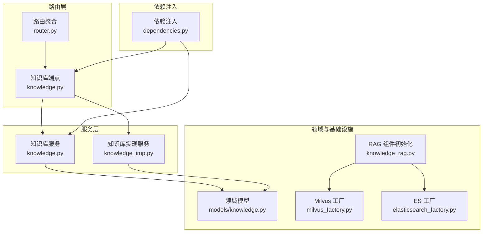
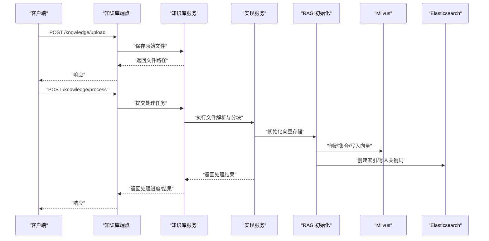
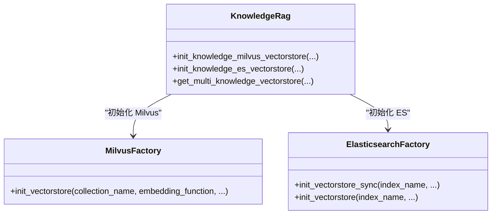
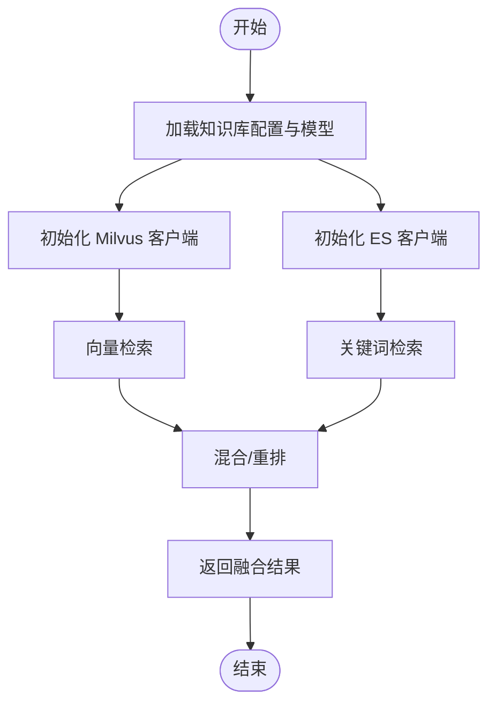
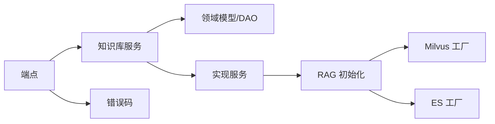

# 知识库 API

<cite>
**本文引用的文件**
- [src/backend/bisheng/knowledge/api/endpoints/knowledge.py](file://src/backend/bisheng/knowledge/api/endpoints/knowledge.py)
- [src/backend/bisheng/api/services/knowledge.py](file://src/backend/bisheng/api/services/knowledge.py)
- [src/backend/bisheng/api/services/knowledge_imp.py](file://src/backend/bisheng/api/services/knowledge_imp.py)
- [src/backend/bisheng/knowledge/api/dependencies.py](file://src/backend/bisheng/knowledge/api/dependencies.py)
- [src/backend/bisheng/knowledge/domain/models/knowledge.py](file://src/backend/bisheng/knowledge/domain/models/knowledge.py)
- [src/backend/bisheng/knowledge/domain/knowledge_rag.py](file://src/backend/bisheng/knowledge/domain/knowledge_rag.py)
- [src/backend/bisheng/knowledge/rag/milvus_factory.py](file://src/backend/bisheng/knowledge/rag/milvus_factory.py)
- [src/backend/bisheng/knowledge/rag/elasticsearch_factory.py](file://src/backend/bisheng/knowledge/rag/elasticsearch_factory.py)
- [src/backend/bisheng/common/errcode/knowledge.py](file://src/backend/bisheng/common/errcode/knowledge.py)
- [src/backend/bisheng/knowledge/api/router.py](file://src/backend/bisheng/knowledge/api/router.py)
- [src/backend/bisheng/api/services/evaluation.py](file://src/backend/bisheng/api/services/evaluation.py)
</cite>

## 目录
1. [简介](#简介)
2. [项目结构](#项目结构)
3. [核心组件](#核心组件)
4. [架构总览](#架构总览)
5. [详细组件分析](#详细组件分析)
6. [依赖关系分析](#依赖关系分析)
7. [性能考量](#性能考量)
8. [故障排查指南](#故障排查指南)
9. [结论](#结论)
10. [附录：接口规范与示例](#附录接口规范与示例)

## 简介
本文件为 Bisheng 知识库系统的详细 API 文档，覆盖知识库创建、文档上传、预览与分块、向量化处理、检索查询、元数据管理、批量导入、向量存储管理、关键词检索与混合检索、统计与评估等能力。文档同时提供处理流程图、错误码说明、性能优化建议与常见问题排查指引，帮助开发者与运维人员快速理解并正确使用知识库相关接口。

## 项目结构
知识库 API 主要位于后端 Python 代码的知识库模块中，采用“路由层（endpoints）—服务层（services）—领域模型与工厂（domain/factories）”的分层设计，并通过依赖注入实现清晰的职责分离。

图表来源
- [src/backend/bisheng/knowledge/api/endpoints/knowledge.py](file://src/backend/bisheng/knowledge/api/endpoints/knowledge.py#L1-L120)
- [src/backend/bisheng/knowledge/api/router.py](file://src/backend/bisheng/knowledge/api/router.py#L1-L5)
- [src/backend/bisheng/api/services/knowledge.py](file://src/backend/bisheng/api/services/knowledge.py#L1-L120)
- [src/backend/bisheng/api/services/knowledge_imp.py](file://src/backend/bisheng/api/services/knowledge_imp.py#L1-L120)
- [src/backend/bisheng/knowledge/domain/models/knowledge.py](file://src/backend/bisheng/knowledge/domain/models/knowledge.py#L1-L120)
- [src/backend/bisheng/knowledge/domain/knowledge_rag.py](file://src/backend/bisheng/knowledge/domain/knowledge_rag.py#L1-L80)
- [src/backend/bisheng/knowledge/rag/milvus_factory.py](file://src/backend/bisheng/knowledge/rag/milvus_factory.py#L1-L60)
- [src/backend/bisheng/knowledge/rag/elasticsearch_factory.py](file://src/backend/bisheng/knowledge/rag/elasticsearch_factory.py#L1-L80)
- [src/backend/bisheng/knowledge/api/dependencies.py](file://src/backend/bisheng/knowledge/api/dependencies.py#L1-L47)

章节来源
- [src/backend/bisheng/knowledge/api/endpoints/knowledge.py](file://src/backend/bisheng/knowledge/api/endpoints/knowledge.py#L1-L120)
- [src/backend/bisheng/knowledge/api/router.py](file://src/backend/bisheng/knowledge/api/router.py#L1-L5)

## 核心组件
- 路由与端点：提供知识库 CRUD、文件列表、分块管理、QA 管理、元数据字段管理、个人知识库、状态检查、复制与重建等接口。
- 服务层：
  - KnowledgeService：封装知识库与文件的业务逻辑，负责鉴权、分页、权限过滤、调用底层实现服务。
  - KnowledgeImp：实现具体的数据处理流程，包括文件解析、分块、向量化、索引、重试、导入导出等。
- 领域模型：定义知识库类型、状态、元数据字段类型等。
- RAG 组件工厂：根据配置初始化 Milvus 与 Elasticsearch 向量存储，支持元数据映射。
- 错误码：统一返回知识库模块的错误码，便于前端与监控系统识别。

章节来源
- [src/backend/bisheng/api/services/knowledge.py](file://src/backend/bisheng/api/services/knowledge.py#L72-L200)
- [src/backend/bisheng/api/services/knowledge_imp.py](file://src/backend/bisheng/api/services/knowledge_imp.py#L85-L200)
- [src/backend/bisheng/knowledge/domain/models/knowledge.py](file://src/backend/bisheng/knowledge/domain/models/knowledge.py#L18-L72)
- [src/backend/bisheng/knowledge/domain/knowledge_rag.py](file://src/backend/bisheng/knowledge/domain/knowledge_rag.py#L15-L155)

## 架构总览
知识库系统围绕“文档解析—文本分块—向量化—检索—结果融合”的链路构建，支持 Milvus 向量检索与 Elasticsearch 关键词检索的混合检索，并提供元数据管理与批量导入能力。

图表来源
- [src/backend/bisheng/knowledge/api/endpoints/knowledge.py](file://src/backend/bisheng/knowledge/api/endpoints/knowledge.py#L51-L202)
- [src/backend/bisheng/api/services/knowledge.py](file://src/backend/bisheng/api/services/knowledge.py#L157-L200)
- [src/backend/bisheng/api/services/knowledge_imp.py](file://src/backend/bisheng/api/services/knowledge_imp.py#L1-L120)
- [src/backend/bisheng/knowledge/domain/knowledge_rag.py](file://src/backend/bisheng/knowledge/domain/knowledge_rag.py#L35-L61)
- [src/backend/bisheng/knowledge/rag/milvus_factory.py](file://src/backend/bisheng/knowledge/rag/milvus_factory.py#L16-L60)
- [src/backend/bisheng/knowledge/rag/elasticsearch_factory.py](file://src/backend/bisheng/knowledge/rag/elasticsearch_factory.py#L46-L80)

## 详细组件分析

### 1) 知识库创建与管理
- 创建知识库
  - 方法与路径：POST /knowledge/create
  - 请求体：KnowledgeCreate（名称、类型、描述、嵌入模型ID等）
  - 响应：创建后的知识库对象
  - 行为：校验嵌入模型有效性；生成索引名与集合名；初始化 Milvus 与 ES 索引；触发后续钩子
- 更新知识库模型
  - 方法与路径：POST /knowledge/update_knowledge
  - 请求体：UpdateKnowledgeReq（知识库ID、新模型ID、可选名称/描述）
  - 行为：若模型变更则置状态为“重建中”，并异步启动重建任务
- 复制知识库
  - 方法与路径：POST /knowledge/copy
  - 行为：仅允许已发布且无进行中文件时复制；复制后返回新知识库
- 获取知识库列表与详情
  - GET /knowledge、GET /knowledge/info
  - 支持按名称、类型、排序字段分页查询
- 删除知识库
  - DELETE /knowledge/

章节来源
- [src/backend/bisheng/knowledge/api/endpoints/knowledge.py](file://src/backend/bisheng/knowledge/api/endpoints/knowledge.py#L216-L329)
- [src/backend/bisheng/api/services/knowledge.py](file://src/backend/bisheng/api/services/knowledge.py#L157-L200)
- [src/backend/bisheng/knowledge/domain/models/knowledge.py](file://src/backend/bisheng/knowledge/domain/models/knowledge.py#L94-L153)

### 2) 文档上传与预览
- 上传原始文件
  - 方法与路径：POST /knowledge/upload
  - 行为：保存文件到存储，返回文件路径
- 上传到指定知识库
  - 方法与路径：POST /knowledge/upload/{knowledge_id}
  - 行为：保存文件并计算 MD5，检测重复文件，返回是否重复
- 预览分块
  - 方法与路径：POST /knowledge/preview
  - 行为：后台任务执行解析，返回 preview_file_id；轮询 /knowledge/preview/status 获取状态；支持更新/删除预览分块
- 处理为知识库文件
  - 方法与路径：POST /knowledge/process
  - 行为：提交处理任务，后台执行解析、分块、向量化与入库

章节来源
- [src/backend/bisheng/knowledge/api/endpoints/knowledge.py](file://src/backend/bisheng/knowledge/api/endpoints/knowledge.py#L51-L198)
- [src/backend/bisheng/api/services/knowledge_imp.py](file://src/backend/bisheng/api/services/knowledge_imp.py#L75-L83)

### 3) 文档解析、文本分块与元数据
- 解析器映射：txt/pdf/html/md/docx/pptx 等文件类型对应不同加载器
- 分块策略：支持字符级分块与元素级分块，支持聚合元数据到分块内容
- 元数据管理：
  - 添加字段：POST /knowledge/add_metadata_fields
  - 更新字段：PUT /knowledge/update_metadata_fields（支持后台任务）
  - 删除字段：DELETE /knowledge/delete_metadata_fields（支持后台任务）
  - 自定义文件元数据：PUT /knowledge/file/user_metadata

章节来源
- [src/backend/bisheng/api/services/knowledge_imp.py](file://src/backend/bisheng/api/services/knowledge_imp.py#L75-L83)
- [src/backend/bisheng/knowledge/api/endpoints/knowledge.py](file://src/backend/bisheng/knowledge/api/endpoints/knowledge.py#L924-L1016)

### 4) 向量化处理与存储
- 向量存储初始化：
  - Milvus：通过 MilvusFactory 按配置连接，设置索引参数与元数据 schema
  - Elasticsearch：通过 ElasticsearchFactory 初始化 BM25 关键词策略与元数据映射
- 多知识库向量存储获取：支持同步/异步方式批量获取 Milvus 与 ES 客户端
- 重试与失败处理：提供失败重试接口与错误码

图表来源
- [src/backend/bisheng/knowledge/domain/knowledge_rag.py](file://src/backend/bisheng/knowledge/domain/knowledge_rag.py#L15-L155)
- [src/backend/bisheng/knowledge/rag/milvus_factory.py](file://src/backend/bisheng/knowledge/rag/milvus_factory.py#L13-L60)
- [src/backend/bisheng/knowledge/rag/elasticsearch_factory.py](file://src/backend/bisheng/knowledge/rag/elasticsearch_factory.py#L44-L80)

章节来源
- [src/backend/bisheng/knowledge/domain/knowledge_rag.py](file://src/backend/bisheng/knowledge/domain/knowledge_rag.py#L35-L155)
- [src/backend/bisheng/knowledge/rag/milvus_factory.py](file://src/backend/bisheng/knowledge/rag/milvus_factory.py#L16-L60)
- [src/backend/bisheng/knowledge/rag/elasticsearch_factory.py](file://src/backend/bisheng/knowledge/rag/elasticsearch_factory.py#L46-L80)

### 5) 检索与混合检索
- 单知识库检索：通过 KnowledgeRag 获取 Milvus/ES 客户端，执行检索
- 多知识库检索：批量获取多个知识库的向量存储，支持权限校验
- 混合检索：结合 Milvus 向量检索与 ES 关键词检索，可进行重排与压缩

图表来源
- [src/backend/bisheng/knowledge/domain/knowledge_rag.py](file://src/backend/bisheng/knowledge/domain/knowledge_rag.py#L63-L139)

章节来源
- [src/backend/bisheng/knowledge/domain/knowledge_rag.py](file://src/backend/bisheng/knowledge/domain/knowledge_rag.py#L63-L139)

### 6) QA 知识库与批量导入
- QA 列表与详情：GET /knowledge/qa/list/{qa_knowledge_id}、GET /knowledge/qa/detail
- 状态切换：POST /knowledge/qa/status_switch
- 新增/追加/删除 QA：POST /knowledge/qa/add、POST /knowledge/qa/append、DELETE /knowledge/qa/delete
- 自动问答生成：POST /knowledge/qa/auto_question
- 导入模板与预览：GET /knowledge/qa/export/template、POST /knowledge/qa/preview/{qa_knowledge_id}
- 批量导入：POST /knowledge/qa/import/{qa_knowledge_id}

章节来源
- [src/backend/bisheng/knowledge/api/endpoints/knowledge.py](file://src/backend/bisheng/knowledge/api/endpoints/knowledge.py#L375-L793)

### 7) 分块管理与文件信息
- 获取分块：GET /knowledge/chunk（支持关键字、分页）
- 更新/删除分块：PUT /knowledge/chunk、DELETE /knowledge/chunk
- 文件分享链接：GET /knowledge/file_share
- 文件 bbox：GET /knowledge/file_bbox
- 文件列表：GET /knowledge/file_list/{knowledge_id}

章节来源
- [src/backend/bisheng/knowledge/api/endpoints/knowledge.py](file://src/backend/bisheng/knowledge/api/endpoints/knowledge.py#L431-L491)

### 8) 个人知识库与状态检查
- 个人知识库：GET /knowledge/personal_knowledge_info（首次访问自动创建）
- 状态检查：GET /knowledge/status（检查个人知识库是否处于重建或失败状态）

章节来源
- [src/backend/bisheng/knowledge/api/endpoints/knowledge.py](file://src/backend/bisheng/knowledge/api/endpoints/knowledge.py#L332-L351)
- [src/backend/bisheng/knowledge/api/endpoints/knowledge.py](file://src/backend/bisheng/knowledge/api/endpoints/knowledge.py#L795-L832)

### 9) 依赖注入与服务绑定
- 通过 dependencies.py 提供 KnowledgeService/KnowledgeFileService 的实例化与注入
- 端点通过 Depends 获取服务实例，确保事务与会话管理

章节来源
- [src/backend/bisheng/knowledge/api/dependencies.py](file://src/backend/bisheng/knowledge/api/dependencies.py#L29-L46)

## 依赖关系分析
- 端点依赖服务层：所有端点最终调用 KnowledgeService 或 KnowledgeImp 实现业务逻辑
- 服务层依赖领域模型与工厂：使用 KnowledgeDao、KnowledgeRag、MilvusFactory、ElasticsearchFactory
- 错误码集中管理：统一抛出知识库模块错误码，便于前端与监控系统识别

图表来源
- [src/backend/bisheng/knowledge/api/endpoints/knowledge.py](file://src/backend/bisheng/knowledge/api/endpoints/knowledge.py#L1-L120)
- [src/backend/bisheng/api/services/knowledge.py](file://src/backend/bisheng/api/services/knowledge.py#L72-L200)
- [src/backend/bisheng/api/services/knowledge_imp.py](file://src/backend/bisheng/api/services/knowledge_imp.py#L85-L200)
- [src/backend/bisheng/knowledge/domain/models/knowledge.py](file://src/backend/bisheng/knowledge/domain/models/knowledge.py#L94-L153)
- [src/backend/bisheng/knowledge/domain/knowledge_rag.py](file://src/backend/bisheng/knowledge/domain/knowledge_rag.py#L15-L155)
- [src/backend/bisheng/common/errcode/knowledge.py](file://src/backend/bisheng/common/errcode/knowledge.py#L1-L147)

章节来源
- [src/backend/bisheng/knowledge/api/endpoints/knowledge.py](file://src/backend/bisheng/knowledge/api/endpoints/knowledge.py#L1-L120)
- [src/backend/bisheng/api/services/knowledge.py](file://src/backend/bisheng/api/services/knowledge.py#L72-L200)
- [src/backend/bisheng/common/errcode/knowledge.py](file://src/backend/bisheng/common/errcode/knowledge.py#L1-L147)

## 性能考量
- 异步与后台任务：文件处理、QA 导入、知识库重建均通过后台任务执行，避免阻塞请求
- 缓存与预览：使用 Redis 缓存预览分块，降低重复解析成本
- 向量存储参数：Milvus 默认索引参数可按数据规模调优；ES 使用 BM25 关键词策略，适合短文本检索
- 分块策略：合理设置分块大小与重叠，平衡召回与上下文长度
- 权限与过滤：列表查询支持按名称、类型、排序与分页，减少不必要的全量扫描

## 故障排查指南
- 常见错误码
  - 知识库不存在、重复名称、未选择嵌入模型、文件损坏/不支持、分块过长、预览失败、重建中、QA 不是 QA 类型、元数据字段冲突/不存在/不可修改、值类型转换错误等
- 建议排查步骤
  - 检查嵌入模型配置与可用性
  - 查看文件格式是否受支持
  - 核对分块策略与大小限制
  - 确认知识库状态（是否处于重建/失败）
  - 检查向量存储连接参数与索引/集合是否存在
  - 查看后台任务日志与 Redis 缓存状态

章节来源
- [src/backend/bisheng/common/errcode/knowledge.py](file://src/backend/bisheng/common/errcode/knowledge.py#L1-L147)
- [src/backend/bisheng/knowledge/api/endpoints/knowledge.py](file://src/backend/bisheng/knowledge/api/endpoints/knowledge.py#L795-L832)

## 结论
本知识库 API 以清晰的分层设计与完善的错误码体系为基础，覆盖从文档上传、解析、分块、向量化到检索与混合检索的完整链路，并提供元数据管理与批量导入能力。通过后台任务与缓存机制提升吞吐与用户体验，适合在企业级场景中部署与扩展。

## 附录：接口规范与示例

### A. 知识库创建与管理
- 创建知识库
  - 方法：POST /knowledge/create
  - 请求体：KnowledgeCreate（名称、类型、描述、嵌入模型ID）
  - 响应：创建后的知识库对象
- 更新知识库模型
  - 方法：POST /knowledge/update_knowledge
  - 请求体：UpdateKnowledgeReq（知识库ID、新模型ID、可选名称/描述）
  - 响应：空或提示重建任务已启动
- 复制知识库
  - 方法：POST /knowledge/copy
  - 请求体：Body(knowledge_id, knowledge_name)
  - 响应：复制后的知识库对象
- 获取知识库列表
  - 方法：GET /knowledge
  - 查询参数：name、type、sort_by、page_size、page_num
  - 响应：data、total
- 获取知识库详情
  - 方法：GET /knowledge/info
  - 查询参数：knowledge_id（数组）
  - 响应：知识库信息列表
- 删除知识库
  - 方法：DELETE /knowledge/
  - 请求体：Body(knowledge_id)
  - 响应：删除成功消息

章节来源
- [src/backend/bisheng/knowledge/api/endpoints/knowledge.py](file://src/backend/bisheng/knowledge/api/endpoints/knowledge.py#L216-L329)

### B. 文档上传与处理
- 上传原始文件
  - 方法：POST /knowledge/upload
  - 表单字段：file（UploadFile）
  - 响应：UploadFileResponse（file_path）
- 上传到指定知识库
  - 方法：POST /knowledge/upload/{knowledge_id}
  - 表单字段：file（UploadFile）
  - 响应：UploadFileResponse（含重复标记与更新时间）
- 预览分块
  - 方法：POST /knowledge/preview
  - 请求体：KnowledgeFileProcess
  - 响应：preview_file_id
  - 轮询状态：GET /knowledge/preview/status?preview_file_id=...
  - 更新预览：PUT /knowledge/preview
  - 删除预览：DELETE /knowledge/preview
- 处理为知识库文件
  - 方法：POST /knowledge/process
  - 请求体：KnowledgeFileProcess
  - 响应：处理结果（异步任务）

章节来源
- [src/backend/bisheng/knowledge/api/endpoints/knowledge.py](file://src/backend/bisheng/knowledge/api/endpoints/knowledge.py#L51-L198)

### C. 分块管理与文件信息
- 获取分块
  - 方法：GET /knowledge/chunk
  - 查询参数：knowledge_id、file_ids、keyword、page、limit
  - 响应：data、total
- 更新分块
  - 方法：PUT /knowledge/chunk
  - 请求体：Body(knowledge_id, file_id, chunk_index, text, bbox)
  - 响应：空
- 删除分块
  - 方法：DELETE /knowledge/chunk
  - 请求体：Body(knowledge_id, file_id, chunk_index)
  - 响应：空
- 文件分享链接
  - 方法：GET /knowledge/file_share
  - 查询参数：file_id
  - 响应：original_url、preview_url
- 文件 bbox
  - 方法：GET /knowledge/file_bbox
  - 查询参数：file_id
  - 响应：bbox 数据
- 文件列表
  - 方法：GET /knowledge/file_list/{knowledge_id}
  - 查询参数：file_name、file_ids、status、page_size、page_num
  - 响应：data、total、writeable

章节来源
- [src/backend/bisheng/knowledge/api/endpoints/knowledge.py](file://src/backend/bisheng/knowledge/api/endpoints/knowledge.py#L431-L491)

### D. QA 知识库与批量导入
- QA 列表
  - 方法：GET /knowledge/qa/list/{qa_knowledge_id}
  - 查询参数：page_size、page_num、question、answer、keyword、status
  - 响应：data、total、writeable
- QA 详情
  - 方法：GET /knowledge/qa/detail
  - 查询参数：id
  - 响应：QA 记录
- 状态切换
  - 方法：POST /knowledge/qa/status_switch
  - 请求体：Body(id, status)
  - 响应：空
- 新增 QA
  - 方法：POST /knowledge/qa/add
  - 请求体：QAKnowledgeUpsert
  - 响应：空
- 追加相似问题
  - 方法：POST /knowledge/qa/append
  - 请求体：Body(ids, question)
  - 响应：空
- 删除 QA
  - 方法：DELETE /knowledge/qa/delete
  - 请求体：Body(ids)
  - 响应：空
- 自动问答生成
  - 方法：POST /knowledge/qa/auto_question
  - 请求体：Body(number, ori_question, answer)
  - 响应：questions
- 导入模板
  - 方法：GET /knowledge/qa/export/template
  - 响应：文件路径
- 预览导入
  - 方法：POST /knowledge/qa/preview/{qa_knowledge_id}
  - 请求体：Body(file_url, size, offset)
  - 响应：预览结果
- 批量导入
  - 方法：POST /knowledge/qa/import/{qa_knowledge_id}
  - 请求体：Body(file_list, background_tasks)
  - 响应：errors

章节来源
- [src/backend/bisheng/knowledge/api/endpoints/knowledge.py](file://src/backend/bisheng/knowledge/api/endpoints/knowledge.py#L375-L793)

### E. 元数据管理
- 添加字段
  - 方法：POST /knowledge/add_metadata_fields
  - 请求体：AddKnowledgeMetadataFieldsReq
  - 响应：知识库对象
- 更新字段
  - 方法：PUT /knowledge/update_metadata_fields
  - 请求体：UpdateKnowledgeMetadataFieldsReq
  - 响应：知识库对象
- 删除字段
  - 方法：DELETE /knowledge/delete_metadata_fields
  - 请求体：Body(knowledge_id, field_names)
  - 响应：知识库对象
- 修改文件自定义元数据
  - 方法：PUT /knowledge/file/user_metadata
  - 请求体：ModifyKnowledgeFileMetaDataReq
  - 响应：文件元数据

章节来源
- [src/backend/bisheng/knowledge/api/endpoints/knowledge.py](file://src/backend/bisheng/knowledge/api/endpoints/knowledge.py#L924-L1016)

### F. 个人知识库与状态检查
- 个人知识库
  - 方法：GET /knowledge/personal_knowledge_info
  - 响应：知识库列表（如不存在则自动创建）
- 状态检查
  - 方法：GET /knowledge/status
  - 响应：状态码与提示（重建中或失败时返回特定错误）

章节来源
- [src/backend/bisheng/knowledge/api/endpoints/knowledge.py](file://src/backend/bisheng/knowledge/api/endpoints/knowledge.py#L332-L351)
- [src/backend/bisheng/knowledge/api/endpoints/knowledge.py](file://src/backend/bisheng/knowledge/api/endpoints/knowledge.py#L795-L832)

### G. 评估与监控
- 评估任务列表
  - 方法：GET /evaluation
  - 查询参数：page、limit
  - 响应：data、total、progress、描述等
- 删除评估任务
  - 方法：DELETE /evaluation/{evaluation_id}
  - 响应：空
- CSV 数据集上传与结果导出
  - 方法：POST /evaluation/upload、POST /evaluation/result
  - 响应：文件路径

章节来源
- [src/backend/bisheng/api/services/evaluation.py](file://src/backend/bisheng/api/services/evaluation.py#L48-L126)