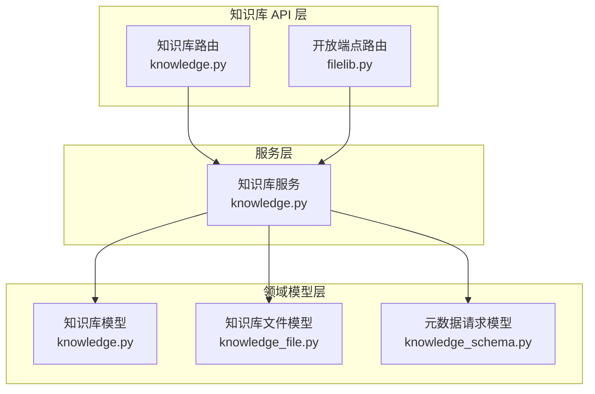
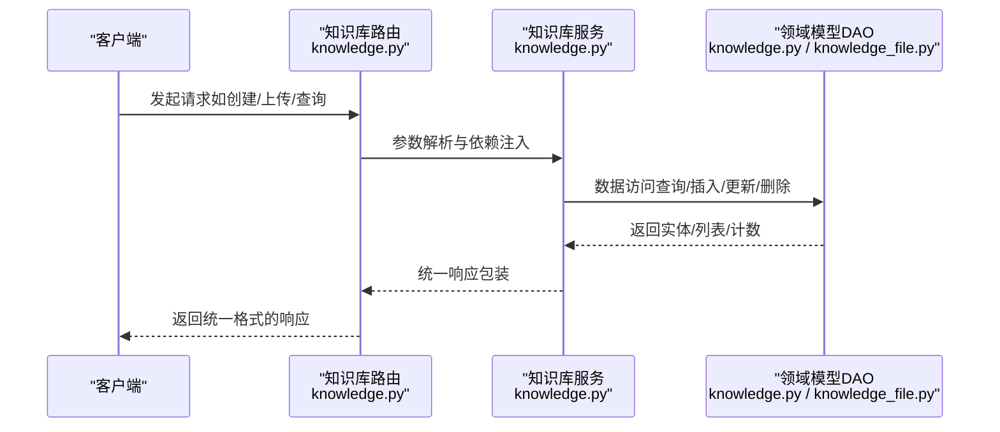
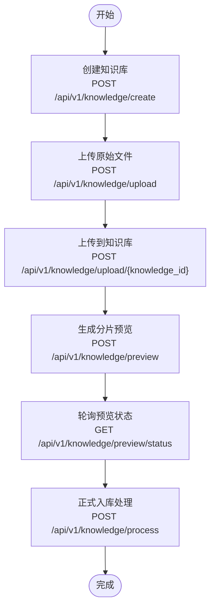

# 知识库管理 API

<cite>
**本文引用的文件**
- [知识库路由定义 knowledge.py](file://src/backend/bisheng/knowledge/api/endpoints/knowledge.py)
- [知识库服务实现 knowledge.py](file://src/backend/bisheng/api/services/knowledge.py)
- [知识库领域模型 knowledge.py](file://src/backend/bisheng/knowledge/domain/models/knowledge.py)
- [知识库文件领域模型 knowledge_file.py](file://src/backend/bisheng/knowledge/domain/models/knowledge_file.py)
- [知识库元数据请求模型 knowledge_schema.py](file://src/backend/bisheng/knowledge/domain/schemas/knowledge_schema.py)
- [开放端点文件库 filelib.py](file://src/backend/bisheng/open_endpoints/api/endpoints/filelib.py)
- [知识库路由聚合 router.py](file://src/backend/bisheng/knowledge/api/router.py)
</cite>

## 目录
1. [简介](#简介)
2. [项目结构](#项目结构)
3. [核心组件](#核心组件)
4. [架构总览](#架构总览)
5. [详细组件分析](#详细组件分析)
6. [依赖关系分析](#依赖关系分析)
7. [性能考量](#性能考量)
8. [故障排查指南](#故障排查指南)
9. [结论](#结论)
10. [附录](#附录)

## 简介
本文件为知识库管理系统的详细 API 文档，覆盖知识库的创建、删除、更新、查询、权限控制、状态变更、与文件关联、标签/元数据管理、统计信息查询等能力，并提供生命周期管理、批量操作与数据同步的实用示例。读者可据此对接前端或第三方系统，完成知识库全生命周期的管理。

## 项目结构
知识库相关模块位于后端 Python 工程中，采用按功能域划分的组织方式：
- 路由层：定义 REST 接口与参数校验
- 服务层：封装业务逻辑（如创建、处理文件、状态变更等）
- 领域模型层：SQLModel 定义的知识库、文件、QA 等实体及 DAO 方法
- 开放端点：供外部调用的简化接口（如删除知识库）



图表来源
- [知识库路由定义 knowledge.py](file://src/backend/bisheng/knowledge/api/endpoints/knowledge.py#L1-L1016)
- [知识库服务实现 knowledge.py](file://src/backend/bisheng/api/services/knowledge.py#L1-L1299)
- [知识库领域模型 knowledge.py](file://src/backend/bisheng/knowledge/domain/models/knowledge.py#L1-L532)
- [知识库文件领域模型 knowledge_file.py](file://src/backend/bisheng/knowledge/domain/models/knowledge_file.py#L1-L590)
- [知识库元数据请求模型 knowledge_schema.py](file://src/backend/bisheng/knowledge/domain/schemas/knowledge_schema.py#L1-L83)
- [开放端点文件库 filelib.py](file://src/backend/bisheng/open_endpoints/api/endpoints/filelib.py#L68-L82)

章节来源
- [知识库路由定义 knowledge.py](file://src/backend/bisheng/knowledge/api/endpoints/knowledge.py#L1-L1016)
- [知识库服务实现 knowledge.py](file://src/backend/bisheng/api/services/knowledge.py#L1-L1299)
- [知识库领域模型 knowledge.py](file://src/backend/bisheng/knowledge/domain/models/knowledge.py#L1-L532)
- [知识库文件领域模型 knowledge_file.py](file://src/backend/bisheng/knowledge/domain/models/knowledge_file.py#L1-L590)
- [知识库元数据请求模型 knowledge_schema.py](file://src/backend/bisheng/knowledge/domain/schemas/knowledge_schema.py#L1-L83)
- [开放端点文件库 filelib.py](file://src/backend/bisheng/open_endpoints/api/endpoints/filelib.py#L68-L82)

## 核心组件
- 路由与端点：提供知识库 CRUD、文件处理、预览、QA 管理、元数据管理、状态查询等接口
- 服务层：封装权限校验、向量化索引初始化、文件入库与异步处理、状态机切换、审计日志与遥测上报
- 领域模型：知识库、文件、QA 的实体定义与 DAO 查询方法；支持分页、过滤、排序、批量操作
- 元数据模型：知识库元字段增删改查、文件用户自定义元数据修改
- 开放端点：简化删除与清空接口，便于外部系统快速集成

章节来源
- [知识库路由定义 knowledge.py](file://src/backend/bisheng/knowledge/api/endpoints/knowledge.py#L1-L1016)
- [知识库服务实现 knowledge.py](file://src/backend/bisheng/api/services/knowledge.py#L1-L1299)
- [知识库领域模型 knowledge.py](file://src/backend/bisheng/knowledge/domain/models/knowledge.py#L1-L532)
- [知识库文件领域模型 knowledge_file.py](file://src/backend/bisheng/knowledge/domain/models/knowledge_file.py#L1-L590)
- [知识库元数据请求模型 knowledge_schema.py](file://src/backend/bisheng/knowledge/domain/schemas/knowledge_schema.py#L1-L83)

## 架构总览
知识库 API 的典型调用链路如下：



图表来源
- [知识库路由定义 knowledge.py](file://src/backend/bisheng/knowledge/api/endpoints/knowledge.py#L1-L1016)
- [知识库服务实现 knowledge.py](file://src/backend/bisheng/api/services/knowledge.py#L1-L1299)
- [知识库领域模型 knowledge.py](file://src/backend/bisheng/knowledge/domain/models/knowledge.py#L1-L532)
- [知识库文件领域模型 knowledge_file.py](file://src/backend/bisheng/knowledge/domain/models/knowledge_file.py#L1-L590)

## 详细组件分析

### 1) 基础信息管理与权限控制
- 创建知识库
  - 方法与路径：POST /api/v1/knowledge/create
  - 请求体：KnowledgeCreate（名称、类型、描述、嵌入模型等）
  - 权限：需具备知识库写权限；管理员可绕过个人限制
  - 行为：校验同名冲突、初始化向量索引、记录审计日志与遥测事件
- 更新知识库
  - 方法与路径：PUT /api/v1/knowledge/
  - 请求体：KnowledgeUpdate（名称、描述）
  - 权限：仅知识库所有者或具备写权限的用户
  - 行为：重名校验、持久化更新
- 删除知识库
  - 方法与路径：DELETE /api/v1/knowledge/
  - 请求体：knowledge_id（内联 body）
  - 权限：写权限校验
  - 行为：清理向量库、MinIO 文件、MySQL 记录；支持仅清空内容
- 查询知识库列表
  - 方法与路径：GET /api/v1/knowledge
  - 查询参数：name、type、sort_by、page_size、page_num
  - 权限：非管理员需受角色访问控制约束
  - 行为：支持按名称模糊匹配、类型过滤、排序与分页
- 获取指定知识库详情
  - 方法与路径：GET /api/v1/knowledge/info
  - 查询参数：knowledge_id（数组）
  - 权限：普通用户仅能查看有访问权限的知识库
  - 行为：返回带用户名与可复制标记的只读视图

章节来源
- [知识库路由定义 knowledge.py](file://src/backend/bisheng/knowledge/api/endpoints/knowledge.py#L216-L328)
- [知识库服务实现 knowledge.py](file://src/backend/bisheng/api/services/knowledge.py#L157-L264)
- [知识库领域模型 knowledge.py](file://src/backend/bisheng/knowledge/domain/models/knowledge.py#L18-L30)
- [知识库领域模型 knowledge.py](file://src/backend/bisheng/knowledge/domain/models/knowledge.py#L222-L288)

### 2) 状态变更与个人知识库
- 状态查询
  - 方法与路径：GET /api/v1/knowledge/status
  - 行为：若用户存在个人知识库且状态为重建中或失败，则触发重建任务并返回错误
- 更新嵌入模型并重建
  - 方法与路径：POST /api/v1/knowledge/update_knowledge
  - 请求体：UpdateKnowledgeReq（knowledge_id、model_id、model_type、knowledge_name、description）
  - 行为：校验嵌入模型、更新知识库状态为“重建中”，异步重建 Milvus/ES 索引

章节来源
- [知识库路由定义 knowledge.py](file://src/backend/bisheng/knowledge/api/endpoints/knowledge.py#L795-L900)
- [知识库路由定义 knowledge.py](file://src/backend/bisheng/knowledge/api/endpoints/knowledge.py#L834-L900)
- [知识库服务实现 knowledge.py](file://src/backend/bisheng/api/services/knowledge.py#L237-L298)

### 3) 文件关联与处理
- 上传原始文件（临时存储）
  - 方法与路径：POST /api/v1/knowledge/upload
  - 行为：保存原始文件名映射到 Redis，返回临时文件路径
- 上传到指定知识库
  - 方法与路径：POST /api/v1/knowledge/upload/{knowledge_id}
  - 行为：去重检查（名称/MD5），返回重复标识与更新时间
- 预览分片
  - 方法与路径：POST /api/v1/knowledge/preview
  - 行为：后台生成分片预览，返回 preview_file_id；轮询 /preview/status 获取结果
- 分片更新/删除
  - 方法与路径：PUT /api/v1/knowledge/preview
  - 方法与路径：DELETE /api/v1/knowledge/preview
- 正式入库处理
  - 方法与路径：POST /api/v1/knowledge/process
  - 行为：保存文件记录并异步解析入库；支持回调 URL
- 重新处理（重建）
  - 方法与路径：POST /api/v1/knowledge/process/rebuild
  - 行为：基于文件路径与规则重建分片
- 失败重试
  - 方法与路径：POST /api/v1/knowledge/retry
  - 行为：批量重试失败文件，更新状态并重新入队
- 文件列表查询
  - 方法与路径：GET /api/v1/knowledge/file_list/{knowledge_id}
  - 查询参数：file_name、file_ids、status、page_size、page_num
  - 行为：支持按状态过滤、分页与写权限判定
- 单文件删除
  - 方法与路径：DELETE /api/v1/knowledge/file/{file_id}
- 分块内容管理
  - 查询分块：GET /api/v1/knowledge/chunk
  - 更新分块：PUT /api/v1/knowledge/chunk
  - 删除分块：DELETE /api/v1/knowledge/chunk
- 文件分享链接
  - 方法与路径：GET /api/v1/knowledge/file_share
  - 行为：返回原始文件与预览文件的分享链接
- 文件 bbox 查询
  - 方法与路径：GET /api/v1/knowledge/file_bbox

章节来源
- [知识库路由定义 knowledge.py](file://src/backend/bisheng/knowledge/api/endpoints/knowledge.py#L51-L190)
- [知识库路由定义 knowledge.py](file://src/backend/bisheng/knowledge/api/endpoints/knowledge.py#L192-L214)
- [知识库路由定义 knowledge.py](file://src/backend/bisheng/knowledge/api/endpoints/knowledge.py#L410-L473)
- [知识库路由定义 knowledge.py](file://src/backend/bisheng/knowledge/api/endpoints/knowledge.py#L475-L491)
- [知识库路由定义 knowledge.py](file://src/backend/bisheng/knowledge/api/endpoints/knowledge.py#L421-L428)
- [知识库路由定义 knowledge.py](file://src/backend/bisheng/knowledge/api/endpoints/knowledge.py#L431-L472)
- [知识库服务实现 knowledge.py](file://src/backend/bisheng/api/services/knowledge.py#L379-L391)
- [知识库服务实现 knowledge.py](file://src/backend/bisheng/api/services/knowledge.py#L393-L475)
- [知识库服务实现 knowledge.py](file://src/backend/bisheng/api/services/knowledge.py#L545-L591)
- [知识库服务实现 knowledge.py](file://src/backend/bisheng/api/services/knowledge.py#L594-L631)
- [知识库服务实现 knowledge.py](file://src/backend/bisheng/api/services/knowledge.py#L634-L694)
- [知识库服务实现 knowledge.py](file://src/backend/bisheng/api/services/knowledge.py#L511-L591)
- [知识库领域模型 knowledge_file.py](file://src/backend/bisheng/knowledge/domain/models/knowledge_file.py#L16-L40)

### 4) QA 知识库管理
- 新增 QA
  - 方法与路径：POST /api/v1/knowledge/qa/add
  - 行为：校验知识库类型为 QA，写权限校验，去重检查后入库
- 批量导入/预览
  - 方法与路径：POST /api/v1/knowledge/qa/preview/{qa_knowledge_id}
  - 方法与路径：POST /api/v1/knowledge/qa/import/{qa_knowledge_id}
  - 行为：读取 Excel，校验列名，支持分段偏移与大小限制
- 导出模板与数据
  - 方法与路径：GET /api/v1/knowledge/qa/export/template
  - 方法与路径：GET /api/v1/knowledge/qa/export/{qa_knowledge_id}
  - 行为：生成模板或分页导出为 Excel
- 列表查询
  - 方法与路径：GET /api/v1/knowledge/qa/list/{qa_knowledge_id}
  - 查询参数：question、answer、keyword、status、page_size、page_num
  - 行为：支持关键字搜索、分页与写权限判定
- 状态切换
  - 方法与路径：POST /api/v1/knowledge/qa/status_switch
  - 行为：根据传入状态更新 QA 记录状态
- 删除 QA
  - 方法与路径：DELETE /api/v1/knowledge/qa/delete
  - 行为：批量删除并清理向量库
- 自动问答生成
  - 方法与路径：POST /api/v1/knowledge/qa/auto_question
  - 行为：基于大模型生成问题建议

章节来源
- [知识库路由定义 knowledge.py](file://src/backend/bisheng/knowledge/api/endpoints/knowledge.py#L494-L593)
- [知识库路由定义 knowledge.py](file://src/backend/bisheng/knowledge/api/endpoints/knowledge.py#L608-L792)
- [知识库路由定义 knowledge.py](file://src/backend/bisheng/knowledge/api/endpoints/knowledge.py#L375-L407)
- [知识库路由定义 knowledge.py](file://src/backend/bisheng/knowledge/api/endpoints/knowledge.py#L516-L537)
- [知识库路由定义 knowledge.py](file://src/backend/bisheng/knowledge/api/endpoints/knowledge.py#L573-L592)
- [知识库路由定义 knowledge.py](file://src/backend/bisheng/knowledge/api/endpoints/knowledge.py#L595-L605)
- [知识库领域模型 knowledge_file.py](file://src/backend/bisheng/knowledge/domain/models/knowledge_file.py#L431-L590)

### 5) 元数据与标签管理
- 添加知识库元字段
  - 方法与路径：POST /api/v1/knowledge/add_metadata_fields
  - 请求体：AddKnowledgeMetadataFieldsReq（knowledge_id、metadata_fields）
- 更新知识库元字段
  - 方法与路径：PUT /api/v1/knowledge/update_metadata_fields
  - 请求体：UpdateKnowledgeMetadataFieldsReq（旧字段名→新字段名）
- 删除知识库元字段
  - 方法与路径：DELETE /api/v1/knowledge/delete_metadata_fields
  - 请求体：knowledge_id、field_names（内联 body）
- 修改文件用户自定义元数据
  - 方法与路径：PUT /api/v1/knowledge/file/user_metadata
  - 请求体：ModifyKnowledgeFileMetaDataReq（knowledge_file_id、user_metadata_list）

章节来源
- [知识库路由定义 knowledge.py](file://src/backend/bisheng/knowledge/api/endpoints/knowledge.py#L924-L1015)
- [知识库元数据请求模型 knowledge_schema.py](file://src/backend/bisheng/knowledge/domain/schemas/knowledge_schema.py#L36-L83)

### 6) 开放端点与批量操作
- 删除知识库（开放端点）
  - 方法与路径：DELETE /api/open_endpoints/filelib/{knowledge_id}
  - 行为：使用默认操作员身份删除知识库
- 清空知识库内容（开放端点）
  - 方法与路径：DELETE /api/open_endpoints/filelib/clear/{knowledge_id}
  - 行为：仅清空文件内容，保留知识库记录
- 复制知识库
  - 方法与路径：POST /api/v1/knowledge/copy
  - 行为：校验状态与权限，异步复制并返回新知识库
- 复制 QA 知识库
  - 方法与路径：POST /api/v1/knowledge/qa/copy
  - 行为：校验类型与权限，异步复制 QA 内容

章节来源
- [开放端点文件库 filelib.py](file://src/backend/bisheng/open_endpoints/api/endpoints/filelib.py#L68-L82)
- [知识库路由定义 knowledge.py](file://src/backend/bisheng/knowledge/api/endpoints/knowledge.py#L226-L280)

### 7) 统计与状态查询
- 知识库状态检查
  - 方法与路径：GET /api/v1/knowledge/status
  - 行为：个人知识库状态异常时触发重建任务并返回错误
- 个人知识库信息
  - 方法与路径：GET /api/v1/knowledge/personal_knowledge_info
  - 行为：若不存在则自动创建默认个人知识库

章节来源
- [知识库路由定义 knowledge.py](file://src/backend/bisheng/knowledge/api/endpoints/knowledge.py#L795-L831)
- [知识库路由定义 knowledge.py](file://src/backend/bisheng/knowledge/api/endpoints/knowledge.py#L332-L350)

### 8) 生命周期管理与数据同步
- 生命周期关键节点
  - 创建：校验嵌入模型、初始化索引、记录审计与遥测
  - 更新：模型变更触发重建状态与异步重建任务
  - 删除：清理向量库、MinIO 文件与 MySQL 记录
  - 复制：异步复制知识库与文件，保持权限与元数据一致
- 数据同步
  - 文件入库：先落盘 MinIO，再写入数据库，最后异步解析入库
  - 向量库同步：Milvus/ES 索引按知识库维度维护，支持分区与重建

章节来源
- [知识库服务实现 knowledge.py](file://src/backend/bisheng/api/services/knowledge.py#L157-L234)
- [知识库服务实现 knowledge.py](file://src/backend/bisheng/api/services/knowledge.py#L267-L298)
- [知识库服务实现 knowledge.py](file://src/backend/bisheng/api/services/knowledge.py#L545-L591)
- [知识库服务实现 knowledge.py](file://src/backend/bisheng/api/services/knowledge.py#L886-L899)

## 依赖关系分析

```mermaid
classDiagram
class KnowledgeRouter {
+POST "/create"
+PUT "/"
+DELETE "/"
+GET ""
+GET "/info"
+GET "/status"
+POST "/upload"
+POST "/process"
+POST "/process/rebuild"
+POST "/retry"
+GET "/file_list/{knowledge_id}"
+GET "/chunk"
+PUT "/chunk"
+DELETE "/chunk"
+GET "/file_share"
+GET "/file_bbox"
+POST "/qa/add"
+POST "/qa/status_switch"
+GET "/qa/list/{qa_knowledge_id}"
+DELETE "/qa/delete"
+POST "/qa/auto_question"
+GET "/qa/export/template"
+GET "/qa/export/{qa_knowledge_id}"
+POST "/update_knowledge"
+POST "/copy"
+POST "/qa/copy"
+POST "/add_metadata_fields"
+PUT "/update_metadata_fields"
+DELETE "/delete_metadata_fields"
+PUT "/file/user_metadata"
}
class KnowledgeService {
+create_knowledge()
+update_knowledge()
+delete_knowledge()
+process_knowledge_file()
+rebuild_knowledge_file()
+retry_files()
+get_knowledge()
+get_knowledge_info()
+update_knowledge_model()
+copy_knowledge()
+copy_qa_knowledge()
+add_metadata_fields()
+update_metadata_fields()
+delete_metadata_fields()
+modify_file_user_metadata()
}
class KnowledgeDao {
+insert_one()
+update_one()
+query_by_id()
+get_user_knowledge()
+count_user_knowledge()
+delete_knowledge()
+async_update_state()
}
class KnowledgeFileDao {
+add_file()
+update()
+get_file_by_filters()
+count_file_by_filters()
+update_status_bulk()
+delete_batch()
}
KnowledgeRouter --> KnowledgeService : "调用"
KnowledgeService --> KnowledgeDao : "数据访问"
KnowledgeService --> KnowledgeFileDao : "数据访问"
```

图表来源
- [知识库路由定义 knowledge.py](file://src/backend/bisheng/knowledge/api/endpoints/knowledge.py#L1-L1016)
- [知识库服务实现 knowledge.py](file://src/backend/bisheng/api/services/knowledge.py#L72-L1299)
- [知识库领域模型 knowledge.py](file://src/backend/bisheng/knowledge/domain/models/knowledge.py#L94-L532)
- [知识库文件领域模型 knowledge_file.py](file://src/backend/bisheng/knowledge/domain/models/knowledge_file.py#L130-L590)

章节来源
- [知识库路由定义 knowledge.py](file://src/backend/bisheng/knowledge/api/endpoints/knowledge.py#L1-L1016)
- [知识库服务实现 knowledge.py](file://src/backend/bisheng/api/services/knowledge.py#L1-L1299)
- [知识库领域模型 knowledge.py](file://src/backend/bisheng/knowledge/domain/models/knowledge.py#L1-L532)
- [知识库文件领域模型 knowledge_file.py](file://src/backend/bisheng/knowledge/domain/models/knowledge_file.py#L1-L590)

## 性能考量
- 异步处理：文件解析与入库通过 Celery 异步执行，避免阻塞主流程
- 缓存预览：分片预览结果缓存于 Redis，减少重复解析开销
- 分页与过滤：列表查询支持分页与多维过滤，降低单次响应体积
- 向量库分区：支持按知识库维度分区，提升重建与查询效率
- 批量操作：批量更新状态、批量删除文件与 QA，减少多次往返

## 故障排查指南
- 常见错误码
  - 知识库不存在：返回对应错误响应
  - 权限不足：返回未授权响应
  - 嵌入模型不正确：返回非嵌入模型错误
  - 个人知识库重建中/失败：返回重建中错误并触发重建任务
- 建议排查步骤
  - 检查用户权限与角色访问控制
  - 确认嵌入模型配置与类型
  - 查看文件状态（等待/处理中/成功/失败/超时）
  - 关注异步任务回调与日志
  - 使用 /status 接口确认个人知识库状态

章节来源
- [知识库路由定义 knowledge.py](file://src/backend/bisheng/knowledge/api/endpoints/knowledge.py#L795-L831)
- [知识库服务实现 knowledge.py](file://src/backend/bisheng/api/services/knowledge.py#L237-L298)

## 结论
本知识库管理 API 提供了从创建、处理、查询到权限控制、状态变更、元数据管理与批量操作的完整能力。通过异步任务与缓存机制，兼顾了易用性与性能；通过严格的权限校验与审计日志，保障了安全性与可追溯性。建议在生产环境中结合回调通知与监控告警，确保大规模知识库的稳定运行。

## 附录

### A. API 一览（按功能分类）
- 基础信息管理
  - POST /api/v1/knowledge/create
  - PUT /api/v1/knowledge/
  - DELETE /api/v1/knowledge/
  - GET /api/v1/knowledge
  - GET /api/v1/knowledge/info
- 状态与个人知识库
  - GET /api/v1/knowledge/status
  - GET /api/v1/knowledge/personal_knowledge_info
  - POST /api/v1/knowledge/update_knowledge
- 文件处理
  - POST /api/v1/knowledge/upload
  - POST /api/v1/knowledge/upload/{knowledge_id}
  - POST /api/v1/knowledge/preview
  - GET /api/v1/knowledge/preview/status
  - PUT /api/v1/knowledge/preview
  - DELETE /api/v1/knowledge/preview
  - POST /api/v1/knowledge/process
  - POST /api/v1/knowledge/process/rebuild
  - POST /api/v1/knowledge/retry
  - GET /api/v1/knowledge/file_list/{knowledge_id}
  - DELETE /api/v1/knowledge/file/{file_id}
  - GET /api/v1/knowledge/chunk
  - PUT /api/v1/knowledge/chunk
  - DELETE /api/v1/knowledge/chunk
  - GET /api/v1/knowledge/file_share
  - GET /api/v1/knowledge/file_bbox
- QA 管理
  - POST /api/v1/knowledge/qa/add
  - POST /api/v1/knowledge/qa/preview/{qa_knowledge_id}
  - POST /api/v1/knowledge/qa/import/{qa_knowledge_id}
  - GET /api/v1/knowledge/qa/export/template
  - GET /api/v1/knowledge/qa/export/{qa_knowledge_id}
  - GET /api/v1/knowledge/qa/list/{qa_knowledge_id}
  - POST /api/v1/knowledge/qa/status_switch
  - DELETE /api/v1/knowledge/qa/delete
  - POST /api/v1/knowledge/qa/auto_question
- 元数据与标签
  - POST /api/v1/knowledge/add_metadata_fields
  - PUT /api/v1/knowledge/update_metadata_fields
  - DELETE /api/v1/knowledge/delete_metadata_fields
  - PUT /api/v1/knowledge/file/user_metadata
- 批量与开放端点
  - POST /api/v1/knowledge/copy
  - POST /api/v1/knowledge/qa/copy
  - DELETE /api/open_endpoints/filelib/{knowledge_id}
  - DELETE /api/open_endpoints/filelib/clear/{knowledge_id}

### B. 实用示例（流程图）
以下以“创建知识库并上传文件”的典型流程为例：



图表来源
- [知识库路由定义 knowledge.py](file://src/backend/bisheng/knowledge/api/endpoints/knowledge.py#L51-L190)
- [知识库路由定义 knowledge.py](file://src/backend/bisheng/knowledge/api/endpoints/knowledge.py#L192-L214)