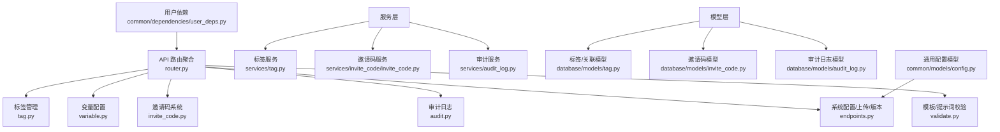
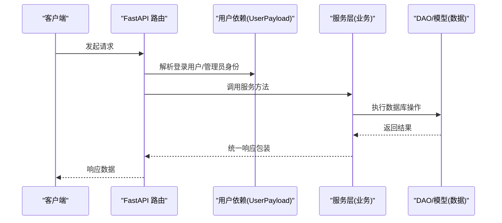
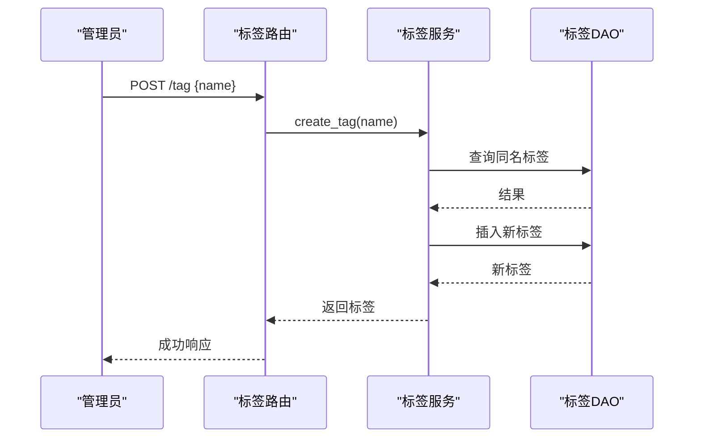
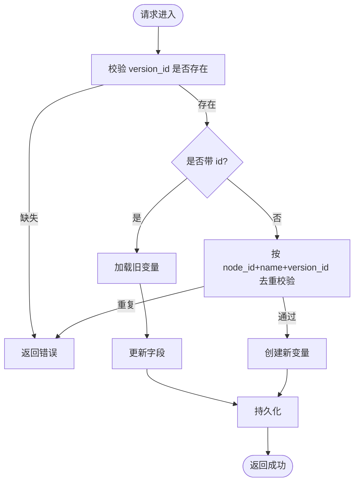
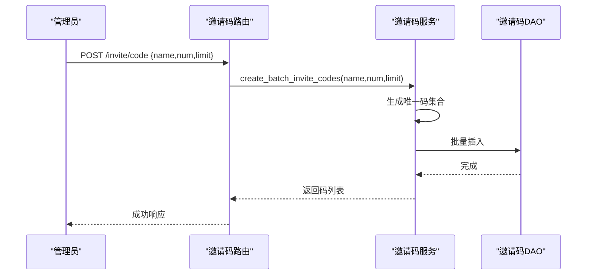
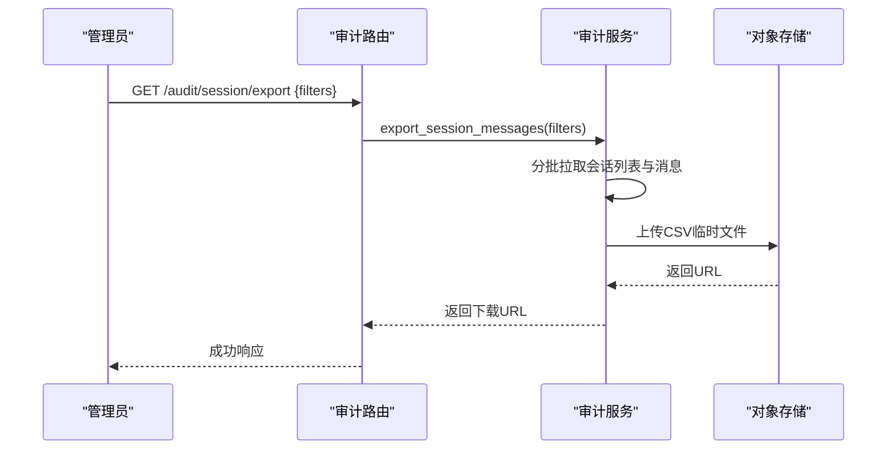
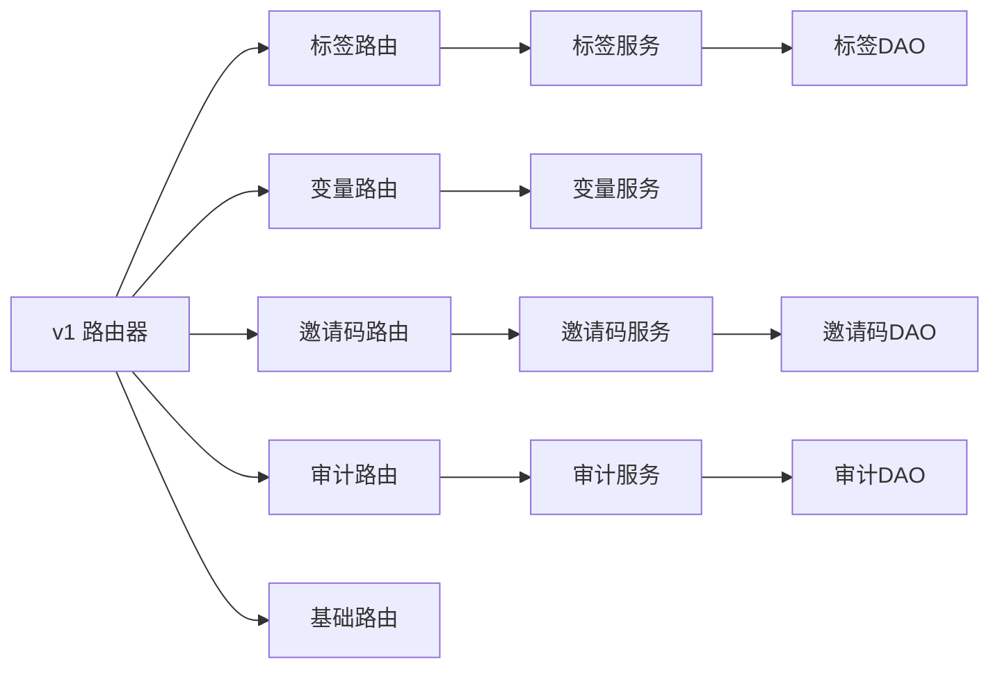

# 系统管理 API

<cite>
**本文引用的文件**
- [src/backend/bisheng/api/v1/router.py](file://src/backend/bisheng/api/v1/router.py)
- [src/backend/bisheng/api/v1/tag.py](file://src/backend/bisheng/api/v1/tag.py)
- [src/backend/bisheng/api/v1/variable.py](file://src/backend/bisheng/api/v1/variable.py)
- [src/backend/bisheng/api/v1/invite_code.py](file://src/backend/bisheng/api/v1/invite_code.py)
- [src/backend/bisheng/api/v1/audit.py](file://src/backend/bisheng/api/v1/audit.py)
- [src/backend/bisheng/api/v1/endpoints.py](file://src/backend/bisheng/api/v1/endpoints.py)
- [src/backend/bisheng/api/v1/validate.py](file://src/backend/bisheng/api/v1/validate.py)
- [src/backend/bisheng/api/v1/schemas.py](file://src/backend/bisheng/api/v1/schemas.py)
- [src/backend/bisheng/api/services/tag.py](file://src/backend/bisheng/api/services/tag.py)
- [src/backend/bisheng/api/services/invite_code/invite_code.py](file://src/backend/bisheng/api/services/invite_code/invite_code.py)
- [src/backend/bisheng/api/services/audit_log.py](file://src/backend/bisheng/api/services/audit_log.py)
- [src/backend/bisheng/common/dependencies/user_deps.py](file://src/backend/bisheng/common/dependencies/user_deps.py)
- [src/backend/bisheng/common/models/config.py](file://src/backend/bisheng/common/models/config.py)
- [src/backend/bisheng/database/models/tag.py](file://src/backend/bisheng/database/models/tag.py)
- [src/backend/bisheng/database/models/invite_code.py](file://src/backend/bisheng/database/models/invite_code.py)
- [src/backend/bisheng/database/models/audit_log.py](file://src/backend/bisheng/database/models/audit_log.py)
</cite>

## 目录
1. [简介](#简介)
2. [项目结构](#项目结构)
3. [核心组件](#核心组件)
4. [架构总览](#架构总览)
5. [详细组件分析](#详细组件分析)
6. [依赖关系分析](#依赖关系分析)
7. [性能与扩展性](#性能与扩展性)
8. [运维与排障指南](#运维与排障指南)
9. [结论](#结论)

## 简介
本文件面向系统管理员与平台运维人员，系统性梳理 Bisheng 的“系统管理 API”，覆盖以下能力域：
- 标签管理：标签的增删改查、资源关联与首页展示配置
- 变量配置：工作流版本级变量的增删改查与批量保存
- 邀请码系统：批量生成、绑定、使用次数统计
- 审计日志：操作审计、会话审计、导出与查询
- 系统配置：初始化配置、前端配置项、环境参数
- 资源控制与权限：基于用户组与资源类型的访问控制
- 运维工具：上传、版本查询、调试快照等

本指南以“接口规范 + 权限模型 + 数据模型 + 流程图 + 故障排查”为主线，帮助快速定位问题、安全合规地进行系统运维。

## 项目结构
后端采用 FastAPI + SQLModel 架构，API 路由通过统一入口聚合，各模块按功能域拆分：
- 路由聚合：统一在 v1 路由器中注册各子路由
- 功能域路由：标签、变量、邀请码、审计、基础配置等
- 服务层：封装业务逻辑与错误处理
- 模型层：SQLModel 数据模型与 DAO 查询方法
- 依赖注入：用户上下文、权限校验

图表来源
- [src/backend/bisheng/api/v1/router.py](file://src/backend/bisheng/api/v1/router.py#L1-L61)
- [src/backend/bisheng/api/v1/tag.py](file://src/backend/bisheng/api/v1/tag.py#L1-L93)
- [src/backend/bisheng/api/v1/variable.py](file://src/backend/bisheng/api/v1/variable.py#L1-L95)
- [src/backend/bisheng/api/v1/invite_code.py](file://src/backend/bisheng/api/v1/invite_code.py#L1-L48)
- [src/backend/bisheng/api/v1/audit.py](file://src/backend/bisheng/api/v1/audit.py#L1-L99)
- [src/backend/bisheng/api/v1/endpoints.py](file://src/backend/bisheng/api/v1/endpoints.py#L1-L428)
- [src/backend/bisheng/api/v1/validate.py](file://src/backend/bisheng/api/v1/validate.py#L1-L106)
- [src/backend/bisheng/api/services/tag.py](file://src/backend/bisheng/api/services/tag.py#L1-L164)
- [src/backend/bisheng/api/services/invite_code/invite_code.py](file://src/backend/bisheng/api/services/invite_code/invite_code.py#L1-L116)
- [src/backend/bisheng/api/services/audit_log.py](file://src/backend/bisheng/api/services/audit_log.py#L1-L819)
- [src/backend/bisheng/database/models/tag.py](file://src/backend/bisheng/database/models/tag.py#L1-L209)
- [src/backend/bisheng/database/models/invite_code.py](file://src/backend/bisheng/database/models/invite_code.py#L1-L106)
- [src/backend/bisheng/database/models/audit_log.py](file://src/backend/bisheng/database/models/audit_log.py#L1-L161)
- [src/backend/bisheng/common/models/config.py](file://src/backend/bisheng/common/models/config.py#L1-L89)
- [src/backend/bisheng/common/dependencies/user_deps.py](file://src/backend/bisheng/common/dependencies/user_deps.py#L1-L6)

章节来源
- [src/backend/bisheng/api/v1/router.py](file://src/backend/bisheng/api/v1/router.py#L1-L61)

## 核心组件
- 标签管理：支持全站标签检索、创建、更新、删除；资源标签关联/解绑；首页展示标签集配置
- 变量配置：工作流版本级变量的增改、列表查询、单个删除、整包批量保存
- 邀请码系统：管理员批量生成、用户绑定、使用次数统计；内部支持使用/撤销使用
- 审计日志：按用户组/操作人/时间/系统模块/事件类型过滤；会话列表与消息导出
- 系统配置：初始化配置读写、前端配置项读写、环境参数查询、版本信息
- 资源控制：基于资源类型与用户组的写入权限校验
- 运维工具：图标/工作流/本地文件上传、版本查询、调试快照

章节来源
- [src/backend/bisheng/api/v1/tag.py](file://src/backend/bisheng/api/v1/tag.py#L1-L93)
- [src/backend/bisheng/api/v1/variable.py](file://src/backend/bisheng/api/v1/variable.py#L1-L95)
- [src/backend/bisheng/api/v1/invite_code.py](file://src/backend/bisheng/api/v1/invite_code.py#L1-L48)
- [src/backend/bisheng/api/v1/audit.py](file://src/backend/bisheng/api/v1/audit.py#L1-L99)
- [src/backend/bisheng/api/v1/endpoints.py](file://src/backend/bisheng/api/v1/endpoints.py#L1-L428)

## 架构总览
系统管理 API 的调用链路遵循“路由 → 依赖注入 → 服务层 → DAO/模型”的分层设计，统一返回统一响应体。

图表来源
- [src/backend/bisheng/api/v1/tag.py](file://src/backend/bisheng/api/v1/tag.py#L1-L93)
- [src/backend/bisheng/api/v1/variable.py](file://src/backend/bisheng/api/v1/variable.py#L1-L95)
- [src/backend/bisheng/api/v1/invite_code.py](file://src/backend/bisheng/api/v1/invite_code.py#L1-L48)
- [src/backend/bisheng/api/v1/audit.py](file://src/backend/bisheng/api/v1/audit.py#L1-L99)
- [src/backend/bisheng/common/dependencies/user_deps.py](file://src/backend/bisheng/common/dependencies/user_deps.py#L1-L6)

## 详细组件分析

### 标签管理 API
- 路由前缀：/api/v1/tag
- 主要端点
  - GET /tag：分页检索标签，支持关键词搜索
  - POST /tag：创建标签（管理员）
  - PUT /tag：更新标签（管理员）
  - DELETE /tag：删除标签（管理员）
  - POST /tag/link：资源打标签（登录用户），支持资源类型枚举
  - DELETE /tag/link：取消资源标签（登录用户）
  - GET /tag/home：获取首页展示标签列表
  - POST /tag/home：设置首页展示标签（管理员）

- 权限与控制
  - 创建/更新/删除标签需管理员身份
  - 资源打标签需具备对应资源写权限或用户组管理员身份
  - 首页标签集存储于系统配置键 HOME_TAGS

- 数据模型
  - 标签表与标签关联表，支持唯一约束避免重复关联
  - 关联时根据资源类型映射到不同资源模型

- 错误处理
  - 标签重名、不存在、关联已存在等场景抛出特定错误码

图表来源
- [src/backend/bisheng/api/v1/tag.py](file://src/backend/bisheng/api/v1/tag.py#L26-L48)
- [src/backend/bisheng/api/services/tag.py](file://src/backend/bisheng/api/services/tag.py#L29-L66)
- [src/backend/bisheng/database/models/tag.py](file://src/backend/bisheng/database/models/tag.py#L70-L77)

章节来源
- [src/backend/bisheng/api/v1/tag.py](file://src/backend/bisheng/api/v1/tag.py#L1-L93)
- [src/backend/bisheng/api/services/tag.py](file://src/backend/bisheng/api/services/tag.py#L1-L164)
- [src/backend/bisheng/database/models/tag.py](file://src/backend/bisheng/database/models/tag.py#L1-L209)
- [src/backend/bisheng/common/models/config.py](file://src/backend/bisheng/common/models/config.py#L12-L22)

### 变量配置 API
- 路由前缀：/api/v1/variable
- 主要端点
  - POST /variable：新增/更新变量（需 version_id）
  - GET /variable/list：按 flow_id/node_id/variable_name/version_id 查询变量列表
  - DELETE /variable/del：按 id 删除变量
  - POST /variable/save_all：按 flow_id 全量替换变量集合

- 设计要点
  - 变量与工作流版本强绑定，更新采用完整替换策略
  - 同节点下变量名去重校验
  - 支持批量导入，先清空再写入

图表来源
- [src/backend/bisheng/api/v1/variable.py](file://src/backend/bisheng/api/v1/variable.py#L16-L48)

章节来源
- [src/backend/bisheng/api/v1/variable.py](file://src/backend/bisheng/api/v1/variable.py#L1-L95)

### 邀请码系统 API
- 路由前缀：/api/v1/invite
- 主要端点
  - POST /invite/code：管理员批量生成邀请码（名称、数量、每码使用上限）
  - POST /invite/bind：用户绑定邀请码（仅一次有效）
  - GET /invite/code：查询当前用户可使用的邀请码次数

- 业务流程
  - 批量生成：生成唯一码集合，入库
  - 绑定：校验格式与未绑定状态，执行绑定
  - 使用：按用户绑定的可用码逐一尝试使用并扣减使用次数
  - 撤销：对已使用过的码进行撤销使用次数

图表来源
- [src/backend/bisheng/api/v1/invite_code.py](file://src/backend/bisheng/api/v1/invite_code.py#L12-L27)
- [src/backend/bisheng/api/services/invite_code/invite_code.py](file://src/backend/bisheng/api/services/invite_code/invite_code.py#L51-L81)
- [src/backend/bisheng/database/models/invite_code.py](file://src/backend/bisheng/database/models/invite_code.py#L37-L42)

章节来源
- [src/backend/bisheng/api/v1/invite_code.py](file://src/backend/bisheng/api/v1/invite_code.py#L1-L48)
- [src/backend/bisheng/api/services/invite_code/invite_code.py](file://src/backend/bisheng/api/services/invite_code/invite_code.py#L1-L116)
- [src/backend/bisheng/database/models/invite_code.py](file://src/backend/bisheng/database/models/invite_code.py#L1-L106)

### 审计日志 API
- 路由前缀：/api/v1/audit
- 主要端点
  - GET /audit：按用户组/操作人/时间/系统模块/事件类型分页查询
  - GET /audit/operators：获取有操作行为的用户列表
  - GET /audit/session：按应用/用户/用户组/时间/反馈/敏感状态筛选会话列表
  - GET /audit/session/export：导出会话明细 CSV（异步生成并返回下载链接）
  - GET /audit/session/export/data：拉取会话明细数据

- 权限与控制
  - 非管理员仅能查看其管理用户组范围内的审计
  - 会话查询支持多维条件组合与分页

图表来源
- [src/backend/bisheng/api/v1/audit.py](file://src/backend/bisheng/api/v1/audit.py#L61-L79)
- [src/backend/bisheng/api/services/audit_log.py](file://src/backend/bisheng/api/services/audit_log.py#L756-L800)

章节来源
- [src/backend/bisheng/api/v1/audit.py](file://src/backend/bisheng/api/v1/audit.py#L1-L99)
- [src/backend/bisheng/api/services/audit_log.py](file://src/backend/bisheng/api/services/audit_log.py#L1-L819)

### 系统配置与运维工具 API
- 路由前缀：/api/v1（部分在 endpoints 中）
- 主要端点
  - GET /env：返回环境参数（含前端支持的文件类型、版本、特性开关等）
  - GET /config：管理员读取初始化配置
  - POST /config/save：管理员保存初始化配置（YAML 校验与类型校验）
  - GET /web/config：读取前端定制配置
  - POST /web/config：管理员更新前端定制配置
  - POST /process：执行工作流（同步/异步），记录会话与遥测事件
  - POST /upload/icon：上传图标（限制格式）
  - POST /upload/workflow/{workflow_id}：上传工作流图片
  - POST /upload/{flow_id}：缓存本地文件
  - GET /version：返回系统版本号

- 统一响应
  - 所有成功响应均采用统一响应体包装

章节来源
- [src/backend/bisheng/api/v1/endpoints.py](file://src/backend/bisheng/api/v1/endpoints.py#L71-L154)
- [src/backend/bisheng/api/v1/endpoints.py](file://src/backend/bisheng/api/v1/endpoints.py#L174-L350)
- [src/backend/bisheng/api/v1/endpoints.py](file://src/backend/bisheng/api/v1/endpoints.py#L371-L427)
- [src/backend/bisheng/api/v1/schemas.py](file://src/backend/bisheng/api/v1/schemas.py#L69-L87)

### 资源控制与权限模型
- 用户上下文
  - UserPayload 继承自登录用户服务，提供 is_admin、access_check、check_groups_admin 等能力
- 资源类型与写权限
  - 标签关联涉及资源类型枚举，按资源类型映射到具体模型并校验写权限
- 用户组维度
  - 审计与会话查询默认仅允许管理员或其管理的用户组范围内的数据

章节来源
- [src/backend/bisheng/common/dependencies/user_deps.py](file://src/backend/bisheng/common/dependencies/user_deps.py#L1-L6)
- [src/backend/bisheng/api/services/tag.py](file://src/backend/bisheng/api/services/tag.py#L69-L103)
- [src/backend/bisheng/api/services/audit_log.py](file://src/backend/bisheng/api/services/audit_log.py#L36-L55)

## 依赖关系分析
- 路由聚合
  - v1 路由器集中注册标签、变量、邀请码、审计、工作流、知识库、工具、会话等子路由
- 服务层与模型层
  - 服务层封装业务规则与异常，DAO 提供数据访问
- 统一响应
  - 所有路由返回统一响应体，便于前端一致处理

图表来源
- [src/backend/bisheng/api/v1/router.py](file://src/backend/bisheng/api/v1/router.py#L4-L51)
- [src/backend/bisheng/api/services/tag.py](file://src/backend/bisheng/api/services/tag.py#L1-L164)
- [src/backend/bisheng/api/services/invite_code/invite_code.py](file://src/backend/bisheng/api/services/invite_code/invite_code.py#L1-L116)
- [src/backend/bisheng/api/services/audit_log.py](file://src/backend/bisheng/api/services/audit_log.py#L1-L819)

章节来源
- [src/backend/bisheng/api/v1/router.py](file://src/backend/bisheng/api/v1/router.py#L1-L61)

## 性能与扩展性
- 分页与过滤
  - 标签与审计均支持分页与多维过滤，建议前端按需传参，避免一次性拉取大量数据
- 异步导出
  - 审计会话导出采用分页拉取与对象存储上传，降低内存占用
- 缓存与任务
  - 工作流执行支持同步/异步两种模式，异步模式通过任务服务调度
- 批量写入
  - 变量批量保存采用“清空-写入”策略，适合配置迁移场景

[本节为通用指导，无需列出具体文件来源]

## 运维与排障指南
- 常见问题定位
  - 标签重名：创建/更新时若同名已存在，服务层抛出特定错误码
  - 权限不足：非管理员或无用户组管理权限时，审计与会话查询返回未授权
  - 邀请码无效：绑定时校验格式与绑定状态，失败抛出相应错误
  - 配置非法：保存初始化配置时进行 YAML 校验与布尔值校验
- 快速恢复
  - 若变量导入异常，可重新调用批量保存接口进行修正
  - 审计导出失败时，检查对象存储连接与桶配置
- 日志与追踪
  - 所有关键操作均有审计日志记录，结合 trace_id 进行链路追踪

章节来源
- [src/backend/bisheng/api/services/tag.py](file://src/backend/bisheng/api/services/tag.py#L34-L54)
- [src/backend/bisheng/api/services/audit_log.py](file://src/backend/bisheng/api/services/audit_log.py#L36-L55)
- [src/backend/bisheng/api/services/invite_code/invite_code.py](file://src/backend/bisheng/api/services/invite_code/invite_code.py#L104-L115)
- [src/backend/bisheng/api/v1/endpoints.py](file://src/backend/bisheng/api/v1/endpoints.py#L108-L129)

## 结论
本文档从“接口规范 + 权限模型 + 数据模型 + 流程图 + 故障排查”五个维度，系统化梳理了 Bisheng 的系统管理 API。建议在生产环境中：
- 严格区分管理员与普通用户的操作范围
- 对批量导入/导出类接口设置合理的并发与超时策略
- 定期清理过期审计数据，保障存储与查询性能
- 将关键配置变更纳入变更管理流程，配合审计日志回溯