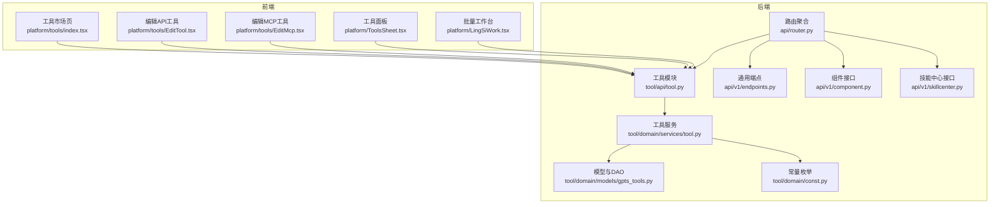
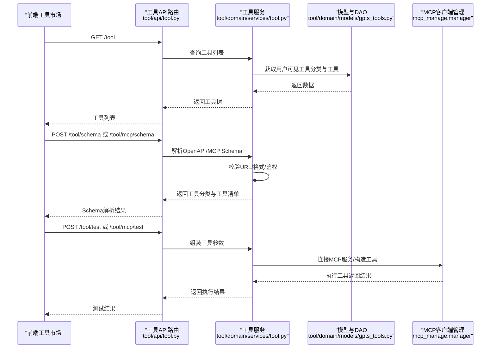
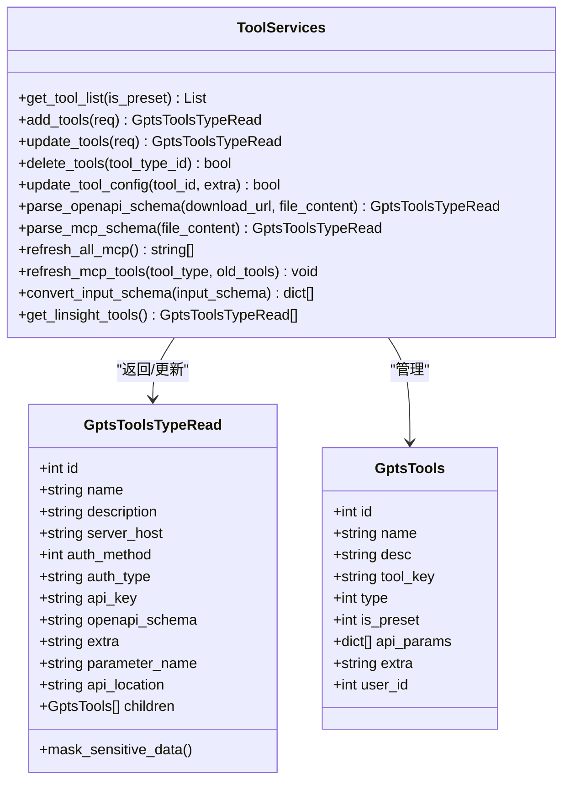
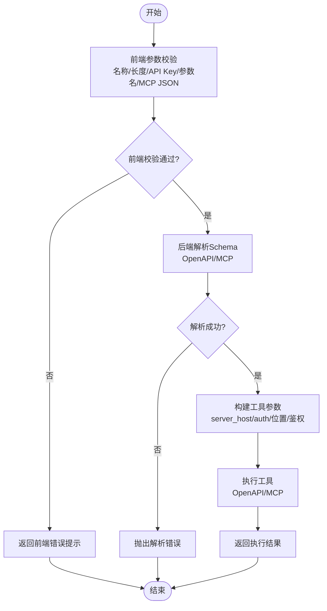
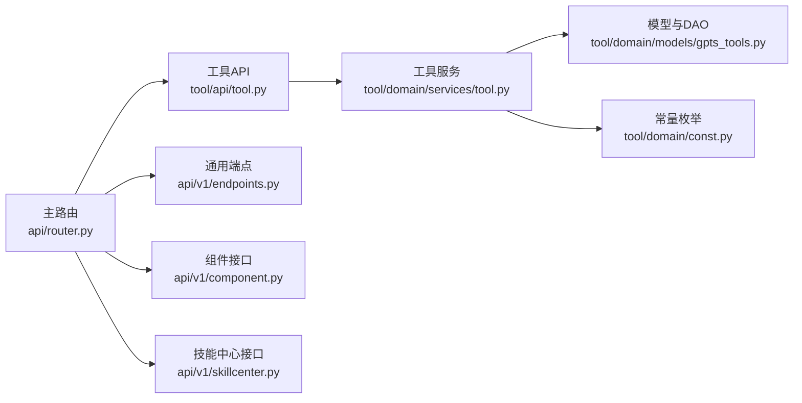

# 工具管理 API

<cite>
**本文引用的文件**
- [src/backend/bisheng/tool/api/tool.py](file://src/backend/bisheng/tool/api/tool.py)
- [src/backend/bisheng/tool/domain/services/tool.py](file://src/backend/bisheng/tool/domain/services/tool.py)
- [src/backend/bisheng/tool/domain/models/gpts_tools.py](file://src/backend/bisheng/tool/domain/models/gpts_tools.py)
- [src/backend/bisheng/tool/domain/const.py](file://src/backend/bisheng/tool/domain/const.py)
- [src/backend/bisheng/api/router.py](file://src/backend/bisheng/api/router.py)
- [src/backend/bisheng/api/v1/endpoints.py](file://src/backend/bisheng/api/v1/endpoints.py)
- [src/backend/bisheng/api/v1/component.py](file://src/backend/bisheng/api/v1/component.py)
- [src/backend/bisheng/api/v1/skillcenter.py](file://src/backend/bisheng/api/v1/skillcenter.py)
- [src/backend/bisheng/common/errcode/tool.py](file://src/backend/bisheng/common/errcode/tool.py)
- [src/frontend/platform/src/pages/BuildPage/tools/index.tsx](file://src/frontend/platform/src/pages/BuildPage/tools/index.tsx)
- [src/frontend/platform/src/pages/BuildPage/tools/EditTool.tsx](file://src/frontend/platform/src/pages/BuildPage/tools/EditTool.tsx)
- [src/frontend/platform/src/pages/BuildPage/tools/EditMcp.tsx](file://src/frontend/platform/src/pages/BuildPage/tools/EditMcp.tsx)
- [src/frontend/platform/src/components/bs-comp/sheets/ToolsSheet.tsx](file://src/frontend/platform/src/components/bs-comp/sheets/ToolsSheet.tsx)
- [src/frontend/platform/src/pages/BuildPage/bench/LingSiWork.tsx](file://src/frontend/platform/src/pages/BuildPage/bench/LingSiWork.tsx)
</cite>

## 目录
1. [简介](#简介)
2. [项目结构](#项目结构)
3. [核心组件](#核心组件)
4. [架构总览](#架构总览)
5. [详细组件分析](#详细组件分析)
6. [依赖分析](#依赖分析)
7. [性能考虑](#性能考虑)
8. [故障排查指南](#故障排查指南)
9. [结论](#结论)
10. [附录](#附录)

## 简介
本文件为 Bisheng 工具管理系统提供详细的 API 文档，覆盖工具的注册、配置、执行与管理接口规范；说明工具的发现机制、动态加载与运行时管理；文档化工具的参数验证、执行上下文与结果处理流程；并提供工具开发规范、接口定义与集成模式的技术指南，以及工具市场使用方法、批量管理操作与性能监控的最佳实践。

## 项目结构
后端通过 FastAPI 路由聚合工具相关接口，工具域服务负责解析与管理工具（含 OpenAPI 与 MCP），前端提供工具市场与批量管理界面。

图表来源
- [src/backend/bisheng/api/router.py](file://src/backend/bisheng/api/router.py#L23-L60)
- [src/backend/bisheng/tool/api/tool.py](file://src/backend/bisheng/tool/api/tool.py#L1-L132)
- [src/backend/bisheng/tool/domain/services/tool.py](file://src/backend/bisheng/tool/domain/services/tool.py#L1-L515)
- [src/backend/bisheng/tool/domain/models/gpts_tools.py](file://src/backend/bisheng/tool/domain/models/gpts_tools.py#L1-L463)
- [src/backend/bisheng/tool/domain/const.py](file://src/backend/bisheng/tool/domain/const.py#L1-L19)
- [src/backend/bisheng/api/v1/endpoints.py](file://src/backend/bisheng/api/v1/endpoints.py#L1-L428)
- [src/backend/bisheng/api/v1/component.py](file://src/backend/bisheng/api/v1/component.py#L1-L89)
- [src/backend/bisheng/api/v1/skillcenter.py](file://src/backend/bisheng/api/v1/skillcenter.py#L1-L110)
- [src/frontend/platform/src/pages/BuildPage/tools/index.tsx](file://src/frontend/platform/src/pages/BuildPage/tools/index.tsx#L36-L248)
- [src/frontend/platform/src/pages/BuildPage/tools/EditTool.tsx](file://src/frontend/platform/src/pages/BuildPage/tools/EditTool.tsx#L269-L301)
- [src/frontend/platform/src/pages/BuildPage/tools/EditMcp.tsx](file://src/frontend/platform/src/pages/BuildPage/tools/EditMcp.tsx#L255-L300)
- [src/frontend/platform/src/components/bs-comp/sheets/ToolsSheet.tsx](file://src/frontend/platform/src/components/bs-comp/sheets/ToolsSheet.tsx#L82-L108)
- [src/frontend/platform/src/pages/BuildPage/bench/LingSiWork.tsx](file://src/frontend/platform/src/pages/BuildPage/bench/LingSiWork.tsx#L182-L304)

章节来源
- [src/backend/bisheng/api/router.py](file://src/backend/bisheng/api/router.py#L23-L60)
- [src/backend/bisheng/tool/api/tool.py](file://src/backend/bisheng/tool/api/tool.py#L1-L132)

## 核心组件
- 工具 API 路由：提供工具列表查询、新增/更新/删除工具分类、解析 OpenAPI/MCP Schema、测试工具、刷新 MCP 工具、获取 LinSight 预置工具等接口。
- 工具服务：封装权限校验、数据脱敏、OpenAPI/MCP 解析、工具分类与工具项的增删改查、审计日志钩子等。
- 模型与 DAO：定义工具与工具分类的数据结构、额外配置字段、敏感信息脱敏策略、异步/同步查询与批量更新逻辑。
- 前端工具市场：支持按类型筛选（默认/自定义/MCP）、搜索、创建/编辑工具、刷新 MCP 工具列表、批量选择工具等。

章节来源
- [src/backend/bisheng/tool/api/tool.py](file://src/backend/bisheng/tool/api/tool.py#L1-L132)
- [src/backend/bisheng/tool/domain/services/tool.py](file://src/backend/bisheng/tool/domain/services/tool.py#L32-L86)
- [src/backend/bisheng/tool/domain/models/gpts_tools.py](file://src/backend/bisheng/tool/domain/models/gpts_tools.py#L67-L90)
- [src/frontend/platform/src/pages/BuildPage/tools/index.tsx](file://src/frontend/platform/src/pages/BuildPage/tools/index.tsx#L36-L248)

## 架构总览
工具管理的请求流从前端发起，经路由聚合到工具 API，再调用工具服务进行业务处理，涉及权限校验、Schema 解析、数据库持久化与审计日志。

图表来源
- [src/backend/bisheng/tool/api/tool.py](file://src/backend/bisheng/tool/api/tool.py#L19-L114)
- [src/backend/bisheng/tool/domain/services/tool.py](file://src/backend/bisheng/tool/domain/services/tool.py#L176-L266)
- [src/backend/bisheng/tool/domain/models/gpts_tools.py](file://src/backend/bisheng/tool/domain/models/gpts_tools.py#L362-L449)

## 详细组件分析

### 工具 API 接口规范
- 获取工具列表
  - 方法：GET
  - 路径：/api/v1/tool
  - 参数：is_preset（可选）用于过滤预置/自定义/MCP 类别
  - 权限：登录用户
  - 结果：工具分类树（含工具项），并对预置类别的敏感配置进行脱敏
- 新增工具分类
  - 方法：POST
  - 路径：/api/v1/tool
  - 请求体：工具分类与工具项的 JSON（含 openapi_schema、server_host、auth 等）
  - 权限：登录用户
  - 行为：解析 OpenAPI/MCP Schema，校验名称长度与重复，插入分类与工具项，并触发审计日志
- 更新工具分类
  - 方法：PUT
  - 路径：/api/v1/tool
  - 请求体：同上，支持增量更新工具项（新增/删除/修改）
  - 权限：具备写权限的用户
  - 行为：合并旧/新工具项，异步更新数据库
- 删除工具分类
  - 方法：DELETE
  - 路径：/api/v1/tool
  - 参数：tool_type_id
  - 权限：管理员或分类创建者
  - 行为：逻辑删除分类与工具项，并清理关联资源
- 更新工具分类配置
  - 方法：POST
  - 路径：/api/v1/tool/config
  - 参数：tool_id、extra（配置信息）
  - 权限：管理员
  - 行为：对预置工具的 extra 字段进行安全合并与脱敏存储
- 解析 OpenAPI Schema
  - 方法：POST
  - 路径：/api/v1/tool/schema
  - 参数：download_url 或 file_content
  - 行为：下载/解析 YAML/JSON，校验服务器地址协议，生成工具分类与工具项
- 解析 MCP Schema
  - 方法：POST
  - 路径：/api/v1/tool/mcp/schema
  - 参数：file_content（MCP 配置）
  - 行为：连接 MCP 服务，列举工具，生成工具分类与工具项
- 测试工具
  - 方法：POST
  - 路径：/api/v1/tool/test（OpenAPI）
  - 路径：/api/v1/tool/mcp/test（MCP）
  - 参数：server_host、auth_method、auth_type、api_key、api_location、parameter_name、extra、request_params
  - 行为：构造工具实例并执行，返回结果
- 刷新 MCP 工具
  - 方法：POST
  - 路径：/api/v1/tool/mcp/refresh
  - 行为：遍历用户 MCP 分类，重新拉取工具列表并更新
- 获取 LinSight 预置工具
  - 方法：GET
  - 路径：/api/v1/tool/linsight/preset
  - 行为：返回内置工具分类与工具项

章节来源
- [src/backend/bisheng/tool/api/tool.py](file://src/backend/bisheng/tool/api/tool.py#L19-L132)
- [src/backend/bisheng/api/router.py](file://src/backend/bisheng/api/router.py#L47-L47)

### 工具服务与数据模型
- 权限与可见性
  - 用户可查看预置工具与自身创建的自定义工具；自定义工具可通过资源授权扩展给其他用户组
- 数据脱敏
  - 对预置工具分类的 extra 字段进行敏感信息掩码
- OpenAPI 解析
  - 支持从 URL 下载或直接解析 YAML/JSON；校验默认服务器地址以 http/https 开头；提取路径与参数生成工具项
- MCP 解析
  - 从 JSON 配置中读取 mcpServers，连接服务并列举工具，转换输入参数格式
- 工具键生成
  - 自定义工具：基于分类ID与工具名的哈希；MCP 工具：附加随机后缀确保唯一性
- 审计日志
  - 新增/更新/删除工具分类均触发审计事件

图表来源
- [src/backend/bisheng/tool/domain/models/gpts_tools.py](file://src/backend/bisheng/tool/domain/models/gpts_tools.py#L67-L90)
- [src/backend/bisheng/tool/domain/models/gpts_tools.py](file://src/backend/bisheng/tool/domain/models/gpts_tools.py#L362-L449)
- [src/backend/bisheng/tool/domain/services/tool.py](file://src/backend/bisheng/tool/domain/services/tool.py#L32-L515)

章节来源
- [src/backend/bisheng/tool/domain/models/gpts_tools.py](file://src/backend/bisheng/tool/domain/models/gpts_tools.py#L16-L90)
- [src/backend/bisheng/tool/domain/services/tool.py](file://src/backend/bisheng/tool/domain/services/tool.py#L32-L175)

### 参数验证与执行上下文
- 前端校验
  - 工具名称非空且长度限制；API Key 长度限制；自定义鉴权需提供参数名
  - MCP 配置 JSON 校验与名称唯一性检查
- 后端校验
  - 工具分类名称长度与重复性；预置分类不可删除；OpenAPI Schema 下载/解析错误；MCP 配置解析失败
- 执行上下文
  - OpenAPI：根据 server_host、auth_method、auth_type、api_key、api_location、parameter_name 组装工具参数
  - MCP：从 openapi_schema 中解析服务配置，连接服务并按 inputSchema 生成参数描述

图表来源
- [src/frontend/platform/src/pages/BuildPage/tools/EditTool.tsx](file://src/frontend/platform/src/pages/BuildPage/tools/EditTool.tsx#L269-L301)
- [src/frontend/platform/src/pages/BuildPage/tools/EditMcp.tsx](file://src/frontend/platform/src/pages/BuildPage/tools/EditMcp.tsx#L255-L300)
- [src/backend/bisheng/common/errcode/tool.py](file://src/backend/bisheng/common/errcode/tool.py#L1-L51)
- [src/backend/bisheng/tool/api/tool.py](file://src/backend/bisheng/tool/api/tool.py#L89-L114)

章节来源
- [src/frontend/platform/src/pages/BuildPage/tools/EditTool.tsx](file://src/frontend/platform/src/pages/BuildPage/tools/EditTool.tsx#L269-L301)
- [src/frontend/platform/src/pages/BuildPage/tools/EditMcp.tsx](file://src/frontend/platform/src/pages/BuildPage/tools/EditMcp.tsx#L255-L300)
- [src/backend/bisheng/common/errcode/tool.py](file://src/backend/bisheng/common/errcode/tool.py#L1-L51)

### 工具发现机制与动态加载
- 发现机制
  - 工具分类与工具项存储于数据库；通过用户权限与资源授权控制可见性
  - MCP 工具通过连接服务动态列举并更新
- 动态加载
  - OpenAPI：解析后的工具项包含 API 参数与路径信息，便于前端渲染与参数收集
  - MCP：将 inputSchema 转换为查询参数格式，供前端表单渲染

章节来源
- [src/backend/bisheng/tool/domain/services/tool.py](file://src/backend/bisheng/tool/domain/services/tool.py#L176-L266)
- [src/backend/bisheng/tool/domain/services/tool.py](file://src/backend/bisheng/tool/domain/services/tool.py#L421-L437)

### 运行时管理与审计
- 写权限判定：管理员或分类创建者拥有写权限；也可通过资源授权授予其他用户组
- 审计钩子：新增/更新/删除工具分类时记录审计事件，包含用户、IP、分组信息

章节来源
- [src/backend/bisheng/tool/domain/services/tool.py](file://src/backend/bisheng/tool/domain/services/tool.py#L71-L86)
- [src/backend/bisheng/tool/domain/services/tool.py](file://src/backend/bisheng/tool/domain/services/tool.py#L119-L136)
- [src/backend/bisheng/tool/domain/services/tool.py](file://src/backend/bisheng/tool/domain/services/tool.py#L347-L351)
- [src/backend/bisheng/tool/domain/services/tool.py](file://src/backend/bisheng/tool/domain/services/tool.py#L369-L377)

### 工具市场与批量管理
- 工具市场
  - 支持按类型切换（默认/自定义/MCP），搜索工具与 API 描述，创建/编辑工具，刷新 MCP 列表
- 批量管理
  - 在批量工作台中选择工具集合，支持分页与筛选，便于 SOP 场景下的工具编排

章节来源
- [src/frontend/platform/src/pages/BuildPage/tools/index.tsx](file://src/frontend/platform/src/pages/BuildPage/tools/index.tsx#L36-L248)
- [src/frontend/platform/src/components/bs-comp/sheets/ToolsSheet.tsx](file://src/frontend/platform/src/components/bs-comp/sheets/ToolsSheet.tsx#L82-L108)
- [src/frontend/platform/src/pages/BuildPage/bench/LingSiWork.tsx](file://src/frontend/platform/src/pages/BuildPage/bench/LingSiWork.tsx#L182-L304)

## 依赖分析
- 路由聚合：工具 API 路由被主路由 include，统一前缀 /api/v1
- 工具服务依赖：用户权限、资源授权、MCP 客户端管理、OpenAPI Schema 解析器、审计日志服务
- 前端依赖：工具市场页面与编辑组件通过 API 调用实现工具的增删改查与测试

图表来源
- [src/backend/bisheng/api/router.py](file://src/backend/bisheng/api/router.py#L23-L60)
- [src/backend/bisheng/tool/api/tool.py](file://src/backend/bisheng/tool/api/tool.py#L1-L132)
- [src/backend/bisheng/tool/domain/services/tool.py](file://src/backend/bisheng/tool/domain/services/tool.py#L1-L515)
- [src/backend/bisheng/tool/domain/models/gpts_tools.py](file://src/backend/bisheng/tool/domain/models/gpts_tools.py#L1-L463)
- [src/backend/bisheng/tool/domain/const.py](file://src/backend/bisheng/tool/domain/const.py#L1-L19)
- [src/backend/bisheng/api/v1/endpoints.py](file://src/backend/bisheng/api/v1/endpoints.py#L1-L428)
- [src/backend/bisheng/api/v1/component.py](file://src/backend/bisheng/api/v1/component.py#L1-L89)
- [src/backend/bisheng/api/v1/skillcenter.py](file://src/backend/bisheng/api/v1/skillcenter.py#L1-L110)

章节来源
- [src/backend/bisheng/api/router.py](file://src/backend/bisheng/api/router.py#L23-L60)

## 性能考虑
- 异步查询与更新：工具列表与分类查询采用异步 DAO，减少阻塞
- 缓存与任务：流程执行支持同步/异步模式，异步模式通过任务服务调度
- 文件上传：支持对象存储直传与本地缓存，避免大文件阻塞
- 建议
  - 大规模工具导入建议使用异步任务模式
  - 对频繁刷新的 MCP 工具，建议增加缓存与批量刷新策略
  - 对 OpenAPI Schema 解析，建议限制文件大小与解析超时

章节来源
- [src/backend/bisheng/tool/domain/models/gpts_tools.py](file://src/backend/bisheng/tool/domain/models/gpts_tools.py#L146-L202)
- [src/backend/bisheng/api/v1/endpoints.py](file://src/backend/bisheng/api/v1/endpoints.py#L172-L350)

## 故障排查指南
- 常见错误码
  - 工具名称重复、工具不存在、名称长度不合法、预置分类不可删除
  - OpenAPI Schema 下载失败、内容为空、解析失败、服务器地址协议不合法
  - MCP 配置解析失败
- 排查步骤
  - 确认前端参数校验是否通过（名称、长度、API Key、MCP JSON）
  - 检查后端错误码与异常堆栈，定位解析/鉴权/权限问题
  - 对 MCP 工具，确认服务连通性与配置 JSON 正确性
  - 对 OpenAPI 工具，确认 server_host 协议与路径正确

章节来源
- [src/backend/bisheng/common/errcode/tool.py](file://src/backend/bisheng/common/errcode/tool.py#L1-L51)
- [src/frontend/platform/src/pages/BuildPage/tools/EditTool.tsx](file://src/frontend/platform/src/pages/BuildPage/tools/EditTool.tsx#L269-L301)
- [src/frontend/platform/src/pages/BuildPage/tools/EditMcp.tsx](file://src/frontend/platform/src/pages/BuildPage/tools/EditMcp.tsx#L255-L300)

## 结论
Bisheng 工具管理 API 提供了完整的工具生命周期管理能力，涵盖注册、配置、执行与管理。通过 OpenAPI 与 MCP 的双通道支持，结合权限与审计机制，既满足灵活扩展，又保障安全可控。前端工具市场与批量管理界面进一步提升了工具使用的易用性与效率。

## 附录
- 工具开发规范
  - OpenAPI：确保 server_host 以 http/https 开头，提供清晰的 operationId 与参数描述
  - MCP：提供正确的 mcpServers 配置，确保工具输入参数 schema 完整
  - 鉴权：合理设置 auth_method 与 auth_type，必要时使用自定义参数名
- 集成模式
  - 通过 /tool/schema 与 /tool/mcp/schema 将外部工具快速接入系统
  - 使用 /tool/test 与 /tool/mcp/test 进行联调与回归测试
- 最佳实践
  - 使用 /tool/mcp/refresh 批量刷新 MCP 工具列表
  - 对预置工具配置变更使用 /tool/config 接口进行安全合并
  - 结合前端工具市场与批量工作台进行 SOP 场景下的工具编排