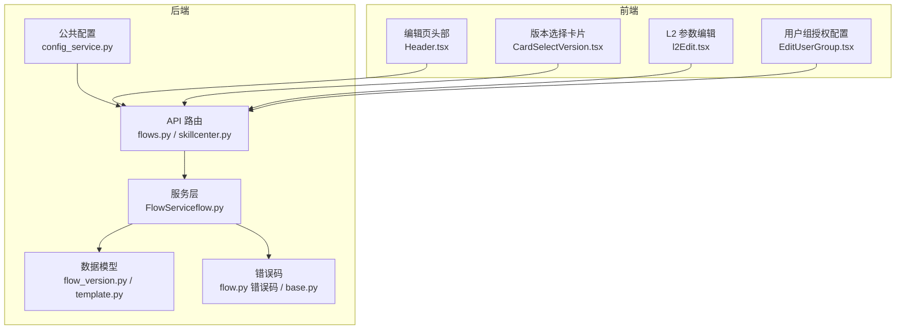
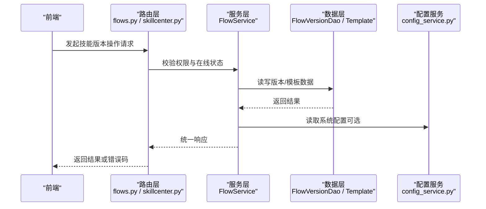
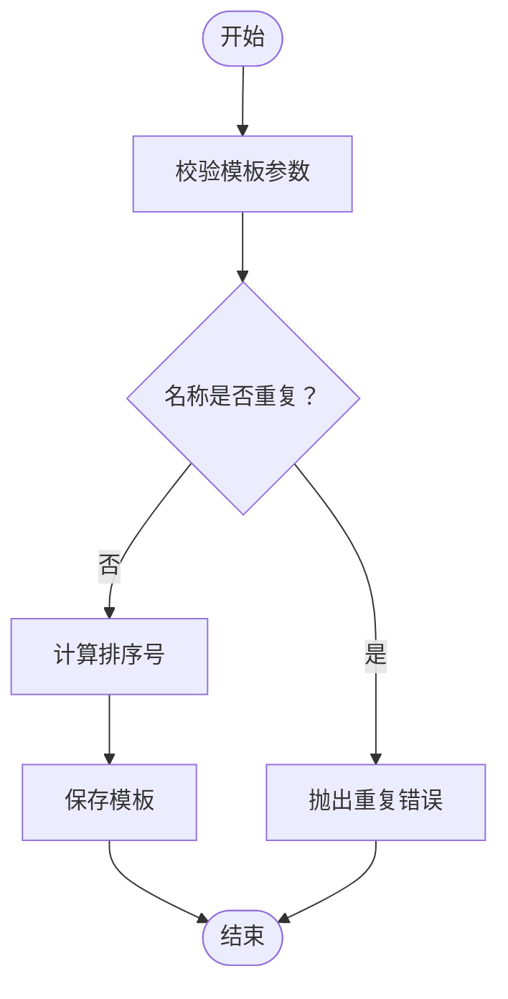
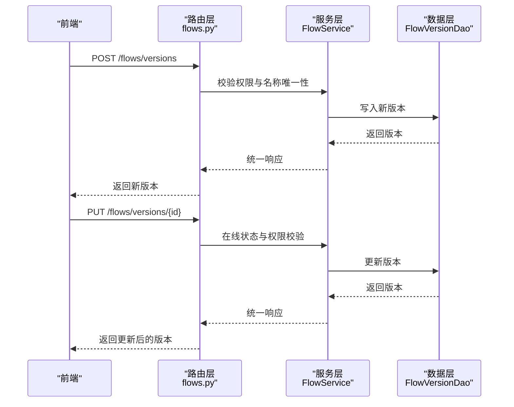
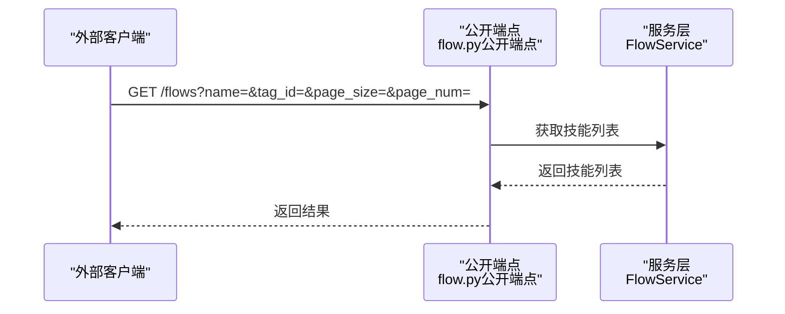
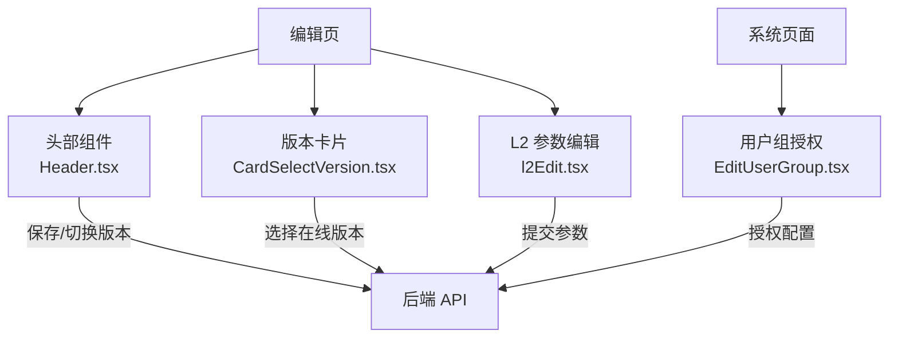
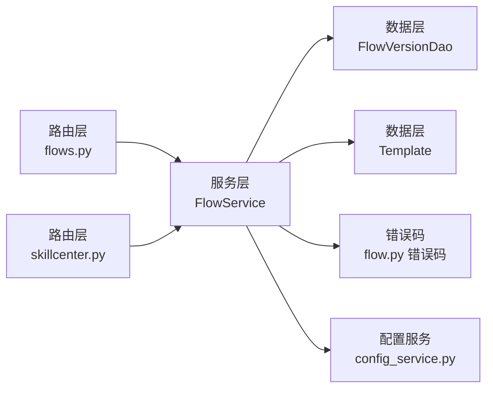

# 技能中心 API

<cite>
**本文引用的文件**
- [skillcenter.py](file://src/backend/bisheng/api/v1/skillcenter.py)
- [flows.py](file://src/backend/bisheng/api/v1/flows.py)
- [flow.py（服务）](file://src/backend/bisheng/api/services/flow.py)
- [flow_version.py](file://src/backend/bisheng/database/models/flow_version.py)
- [template.py](file://src/backend/bisheng/database/models/template.py)
- [flow.py（公开端点）](file://src/backend/bisheng/open_endpoints/api/endpoints/flow.py)
- [flow.py（错误码）](file://src/backend/bisheng/common/errcode/flow.py)
- [base.py（错误码基类）](file://src/backend/bisheng/common/errcode/base.py)
- [config_service.py](file://src/backend/bisheng/common/services/config_service.py)
- [Header.tsx（编辑页头部）](file://src/frontend/platform/src/pages/BuildPage/skills/editSkill/Header.tsx)
- [CardSelectVersion.tsx](file://src/frontend/platform/src/pages/BuildPage/skills/CardSelectVersion.tsx)
- [l2Edit.tsx](file://src/frontend/platform/src/pages/BuildPage/skills/l2Edit.tsx)
- [EditUserGroup.tsx](file://src/frontend/platform/src/pages/SystemPage/components/EditUserGroup.tsx)
- [workstation.py](file://src/backend/bisheng/api/services/workstation/workstation.py)
</cite>

## 目录
1. [简介](#简介)
2. [项目结构](#项目结构)
3. [核心组件](#核心组件)
4. [架构总览](#架构总览)
5. [详细组件分析](#详细组件分析)
6. [依赖关系分析](#依赖关系分析)
7. [性能考虑](#性能考虑)
8. [故障排除指南](#故障排除指南)
9. [结论](#结论)
10. [附录](#附录)

## 简介
本文件为 Bisheng 技能中心系统的 API 文档，覆盖技能的发现、安装、管理与卸载接口规范；记录技能市场接入、技能包下载与本地安装流程；文档化技能依赖解析、版本兼容性检查与冲突解决机制；并提供技能开发规范、打包要求与发布流程的技术指南，以及配置选项、性能优化与故障排除的专业内容。

## 项目结构
技能中心相关后端路由集中在 v1 接口层，核心业务逻辑由 FlowService 统一编排，数据模型位于 database/models，前端在 platform 前端工程中提供可视化与交互能力。

图表来源
- [flows.py](file://src/backend/bisheng/api/v1/flows.py#L25-L226)
- [skillcenter.py](file://src/backend/bisheng/api/v1/skillcenter.py#L1-L110)
- [flow.py（服务）](file://src/backend/bisheng/api/services/flow.py#L38-L491)
- [flow_version.py](file://src/backend/bisheng/database/models/flow_version.py#L49-L156)
- [template.py](file://src/backend/bisheng/database/models/template.py#L11-L54)
- [config_service.py](file://src/backend/bisheng/common/services/config_service.py#L58-L237)
- [flow.py（错误码）](file://src/backend/bisheng/common/errcode/flow.py#L1-L57)
- [base.py（错误码基类）](file://src/backend/bisheng/common/errcode/base.py#L9-L97)
- [Header.tsx](file://src/frontend/platform/src/pages/BuildPage/skills/editSkill/Header.tsx#L147-L340)
- [CardSelectVersion.tsx](file://src/frontend/platform/src/pages/BuildPage/skills/CardSelectVersion.tsx#L37-L52)
- [l2Edit.tsx](file://src/frontend/platform/src/pages/BuildPage/skills/l2Edit.tsx#L56-L277)
- [EditUserGroup.tsx](file://src/frontend/platform/src/pages/SystemPage/components/EditUserGroup.tsx#L265-L287)

章节来源
- [flows.py](file://src/backend/bisheng/api/v1/flows.py#L25-L226)
- [skillcenter.py](file://src/backend/bisheng/api/v1/skillcenter.py#L1-L110)
- [flow.py（服务）](file://src/backend/bisheng/api/services/flow.py#L38-L491)
- [flow_version.py](file://src/backend/bisheng/database/models/flow_version.py#L49-L156)
- [template.py](file://src/backend/bisheng/database/models/template.py#L11-L54)
- [config_service.py](file://src/backend/bisheng/common/services/config_service.py#L58-L237)
- [flow.py（错误码）](file://src/backend/bisheng/common/errcode/flow.py#L1-L57)
- [base.py（错误码基类）](file://src/backend/bisheng/common/errcode/base.py#L9-L97)
- [Header.tsx](file://src/frontend/platform/src/pages/BuildPage/skills/editSkill/Header.tsx#L147-L340)
- [CardSelectVersion.tsx](file://src/frontend/platform/src/pages/BuildPage/skills/CardSelectVersion.tsx#L37-L52)
- [l2Edit.tsx](file://src/frontend/platform/src/pages/BuildPage/skills/l2Edit.tsx#L56-L277)
- [EditUserGroup.tsx](file://src/frontend/platform/src/pages/SystemPage/components/EditUserGroup.tsx#L265-L287)

## 核心组件
- 技能模板管理：提供模板的创建、查询、更新与删除接口，支持排序与分页。
- 技能版本管理：提供版本列表、创建、更新、删除与当前版本切换接口，并内置在线状态限制与权限校验。
- 技能市场与公开接口：提供公开技能列表查询接口，便于外部系统接入。
- 配置与安全：通过配置服务加载系统配置，支持敏感字段清理与权限控制。
- 错误码体系：统一返回格式与异常类型，便于前端与客户端处理。

章节来源
- [skillcenter.py](file://src/backend/bisheng/api/v1/skillcenter.py#L20-L110)
- [flows.py](file://src/backend/bisheng/api/v1/flows.py#L29-L195)
- [flow.py（服务）](file://src/backend/bisheng/api/services/flow.py#L40-L215)
- [flow.py（公开端点）](file://src/backend/bisheng/open_endpoints/api/endpoints/flow.py#L28-L46)
- [config_service.py](file://src/backend/bisheng/common/services/config_service.py#L58-L237)
- [flow.py（错误码）](file://src/backend/bisheng/common/errcode/flow.py#L1-L57)
- [base.py（错误码基类）](file://src/backend/bisheng/common/errcode/base.py#L24-L37)

## 架构总览
技能中心采用“路由层-服务层-数据层”的分层架构，前端通过 REST 接口与 WebSocket 进行交互，服务层负责权限校验、版本控制与在线状态检查，数据层提供版本与模板持久化。

图表来源
- [flows.py](file://src/backend/bisheng/api/v1/flows.py#L29-L195)
- [skillcenter.py](file://src/backend/bisheng/api/v1/skillcenter.py#L20-L110)
- [flow.py（服务）](file://src/backend/bisheng/api/services/flow.py#L94-L215)
- [flow_version.py](file://src/backend/bisheng/database/models/flow_version.py#L57-L156)
- [template.py](file://src/backend/bisheng/database/models/template.py#L26-L54)
- [config_service.py](file://src/backend/bisheng/common/services/config_service.py#L58-L237)

## 详细组件分析

### 技能模板管理（/skill 模块）
- 接口概览
  - POST /skill/template/create：创建模板，自动填充默认数据与排序号。
  - GET /skill/template：查询模板列表，支持按名称、类型、分页筛选。
  - POST /skill/template/{id}：更新模板，支持敏感字段清理。
  - DELETE /skill/template/{id}：删除模板。
- 关键行为
  - 名称唯一性校验与重复错误处理。
  - 排序号使用固定间隔进行分配，避免冲突。
  - 更新时根据配置决定是否清理敏感字段。

图表来源
- [skillcenter.py](file://src/backend/bisheng/api/v1/skillcenter.py#L20-L44)

章节来源
- [skillcenter.py](file://src/backend/bisheng/api/v1/skillcenter.py#L20-L110)
- [template.py](file://src/backend/bisheng/database/models/template.py#L11-L54)
- [flow.py（错误码）](file://src/backend/bisheng/common/errcode/flow.py#L20-L22)
- [base.py（错误码基类）](file://src/backend/bisheng/common/errcode/base.py#L24-L37)

### 技能版本管理（/flows 模块）
- 接口概览
  - POST /flows/versions：创建新版本，校验名称唯一性与在线状态。
  - PUT /flows/versions/{version_id}：更新版本信息，支持在线状态下仅修改描述与名称。
  - DELETE /flows/versions/{version_id}：删除版本，禁止删除当前版本。
  - GET /flows/versions/{version_id}：获取版本详情。
  - POST /flows/change_version：切换当前版本，受在线状态限制。
  - GET /flows/versions：获取技能版本列表与总数。
- 关键行为
  - 在线状态下禁止编辑版本数据，仅允许修改名称与描述。
  - 切换当前版本时同步更新技能数据。
  - 删除版本前进行权限与状态校验。

图表来源
- [flows.py](file://src/backend/bisheng/api/v1/flows.py#L56-L92)
- [flow.py（服务）](file://src/backend/bisheng/api/services/flow.py#L138-L215)
- [flow_version.py](file://src/backend/bisheng/database/models/flow_version.py#L57-L102)

章节来源
- [flows.py](file://src/backend/bisheng/api/v1/flows.py#L29-L195)
- [flow.py（服务）](file://src/backend/bisheng/api/services/flow.py#L40-L215)
- [flow_version.py](file://src/backend/bisheng/database/models/flow_version.py#L57-L156)
- [flow.py（错误码）](file://src/backend/bisheng/common/errcode/flow.py#L5-L17)
- [base.py（错误码基类）](file://src/backend/bisheng/common/errcode/base.py#L24-L37)

### 技能市场与公开接口（/flows 公共端点）
- 接口概览
  - GET /flows：公开技能列表查询，支持名称、标签、分页与状态过滤。
  - GET /flows/{flow_id}：公开技能详情获取。
- 关键行为
  - 使用默认操作者获取技能列表，便于外部系统调用。
  - 支持分享链接解析与访问控制。

图表来源
- [flow.py（公开端点）](file://src/backend/bisheng/open_endpoints/api/endpoints/flow.py#L28-L46)
- [flows.py](file://src/backend/bisheng/api/v1/flows.py#L107-L123)

章节来源
- [flow.py（公开端点）](file://src/backend/bisheng/open_endpoints/api/endpoints/flow.py#L28-L46)
- [flows.py](file://src/backend/bisheng/api/v1/flows.py#L107-L123)

### 前端交互与工作流
- 版本选择与保存
  - 编辑页头部提供版本保存、新建版本与版本切换功能。
  - 版本卡片组件支持在线版本选择与禁用状态。
  - L2 参数编辑页提供基础信息与参数信息表单校验。
- 用户组授权
  - 系统页面组件支持对技能与工作流的授权配置。

图表来源
- [Header.tsx](file://src/frontend/platform/src/pages/BuildPage/skills/editSkill/Header.tsx#L147-L340)
- [CardSelectVersion.tsx](file://src/frontend/platform/src/pages/BuildPage/skills/CardSelectVersion.tsx#L37-L52)
- [l2Edit.tsx](file://src/frontend/platform/src/pages/BuildPage/skills/l2Edit.tsx#L56-L277)
- [EditUserGroup.tsx](file://src/frontend/platform/src/pages/SystemPage/components/EditUserGroup.tsx#L265-L287)

章节来源
- [Header.tsx](file://src/frontend/platform/src/pages/BuildPage/skills/editSkill/Header.tsx#L147-L340)
- [CardSelectVersion.tsx](file://src/frontend/platform/src/pages/BuildPage/skills/CardSelectVersion.tsx#L37-L52)
- [l2Edit.tsx](file://src/frontend/platform/src/pages/BuildPage/skills/l2Edit.tsx#L56-L277)
- [EditUserGroup.tsx](file://src/frontend/platform/src/pages/SystemPage/components/EditUserGroup.tsx#L265-L287)

## 依赖关系分析
- 路由到服务：路由层负责参数解析与权限注入，服务层承担业务规则与状态校验。
- 服务到数据：服务层通过 DAO 访问数据库，维护版本与模板一致性。
- 配置到服务：配置服务提供系统级配置读取，影响敏感字段清理等行为。
- 错误码到统一响应：错误码类提供统一的响应结构与 HTTP 异常转换。

图表来源
- [flows.py](file://src/backend/bisheng/api/v1/flows.py#L25-L226)
- [skillcenter.py](file://src/backend/bisheng/api/v1/skillcenter.py#L1-L110)
- [flow.py（服务）](file://src/backend/bisheng/api/services/flow.py#L38-L491)
- [flow_version.py](file://src/backend/bisheng/database/models/flow_version.py#L57-L156)
- [template.py](file://src/backend/bisheng/database/models/template.py#L26-L54)
- [flow.py（错误码）](file://src/backend/bisheng/common/errcode/flow.py#L1-L57)
- [config_service.py](file://src/backend/bisheng/common/services/config_service.py#L58-L237)

章节来源
- [flows.py](file://src/backend/bisheng/api/v1/flows.py#L25-L226)
- [skillcenter.py](file://src/backend/bisheng/api/v1/skillcenter.py#L1-L110)
- [flow.py（服务）](file://src/backend/bisheng/api/services/flow.py#L38-L491)
- [flow_version.py](file://src/backend/bisheng/database/models/flow_version.py#L57-L156)
- [template.py](file://src/backend/bisheng/database/models/template.py#L26-L54)
- [flow.py（错误码）](file://src/backend/bisheng/common/errcode/flow.py#L1-L57)
- [config_service.py](file://src/backend/bisheng/common/services/config_service.py#L58-L237)

## 性能考虑
- 版本比较与流式输出：提供 SSE 流式比较接口，降低大任务阻塞风险。
- 缓存与会话：会话缓存与键生成策略提升重复执行效率。
- 权限与在线状态快速判定：在服务层前置校验，减少无效数据库访问。
- 配置缓存：配置服务支持 Redis 缓存，降低频繁读取成本。

章节来源
- [flows.py](file://src/backend/bisheng/api/v1/flows.py#L204-L226)
- [flow.py（服务）](file://src/backend/bisheng/api/services/flow.py#L391-L434)
- [config_service.py](file://src/backend/bisheng/common/services/config_service.py#L140-L173)

## 故障排除指南
- 常见错误与定位
  - 版本不存在：返回对应错误码，检查版本 ID 与软删除状态。
  - 当前版本不可删除：确保切换至其他版本后再删除。
  - 技能已上线不可编辑：仅允许修改名称与描述，避免变更数据。
  - 名称重复：创建/更新时检查唯一性约束。
- 统一响应与异常
  - 所有错误通过统一错误码类返回，前端可据此进行提示与回退。
  - SSE 场景下错误以事件形式返回，便于流式处理。
- 日志与追踪
  - 服务层记录关键事件与追踪 ID，便于问题定位与审计。

章节来源
- [flow.py（错误码）](file://src/backend/bisheng/common/errcode/flow.py#L5-L17)
- [base.py（错误码基类）](file://src/backend/bisheng/common/errcode/base.py#L24-L69)
- [flows.py](file://src/backend/bisheng/api/v1/flows.py#L142-L155)
- [flow.py（服务）](file://src/backend/bisheng/api/services/flow.py#L66-L91)

## 结论
技能中心 API 提供了从模板管理到版本控制、从公开市场接入到前端交互的完整能力。通过严格的权限与在线状态校验、统一的错误码与响应格式，以及可扩展的配置与缓存机制，系统在保证安全性的同时兼顾性能与可维护性。建议在实际部署中结合配置服务与前端组件，完善版本对比、参数校验与授权流程，确保技能生命周期管理的稳定性与一致性。

## 附录

### 技能开发规范与发布流程
- 开发规范
  - 使用统一的数据结构定义节点与边，确保版本可移植性。
  - 参数化关键字段，支持 L2 参数提取与动态替换。
  - 严格命名规范与描述完整性，便于检索与授权。
- 打包要求
  - 包含必要的元数据与依赖声明，确保安装与运行环境一致。
  - 对外暴露的 API 应具备稳定的版本标识与兼容策略。
- 发布流程
  - 在本地完成参数校验与版本测试，提交至模板库。
  - 通过公开端点进行市场展示与分发，必要时进行授权配置。

章节来源
- [flow_version.py](file://src/backend/bisheng/database/models/flow_version.py#L41-L46)
- [l2Edit.tsx](file://src/frontend/platform/src/pages/BuildPage/skills/l2Edit.tsx#L60-L81)
- [EditUserGroup.tsx](file://src/frontend/platform/src/pages/SystemPage/components/EditUserGroup.tsx#L265-L287)

### 技能市场接入与版本兼容性
- 市场接入
  - 通过公开端点获取技能列表与详情，支持分页与标签过滤。
  - 结合用户组授权，控制可见范围与访问权限。
- 兼容性与冲突解决
  - 版本命名唯一性保障，避免冲突。
  - 在线状态下禁止修改版本数据，冲突通过切换版本解决。
  - 提供版本对比与流式输出，辅助兼容性验证。

章节来源
- [flow.py（公开端点）](file://src/backend/bisheng/open_endpoints/api/endpoints/flow.py#L28-L46)
- [flows.py](file://src/backend/bisheng/api/v1/flows.py#L198-L226)
- [flow.py（服务）](file://src/backend/bisheng/api/services/flow.py#L138-L215)

### 配置选项与性能优化
- 配置项
  - 系统登录方式、默认 LLM、知识库配置等通过配置服务读取。
  - 支持环境变量注入与 YAML 合并，便于多环境部署。
- 性能优化
  - 使用排序号间隔分配避免并发冲突。
  - SSE 流式输出与会话缓存降低延迟。
  - 配置缓存与异步 DAO 访问提升吞吐。

章节来源
- [config_service.py](file://src/backend/bisheng/common/services/config_service.py#L74-L96)
- [config_service.py](file://src/backend/bisheng/common/services/config_service.py#L140-L173)
- [workstation.py](file://src/backend/bisheng/api/services/workstation/workstation.py#L31-L44)