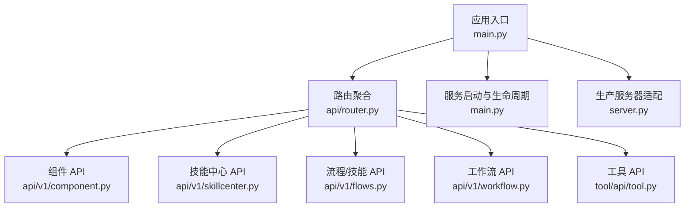
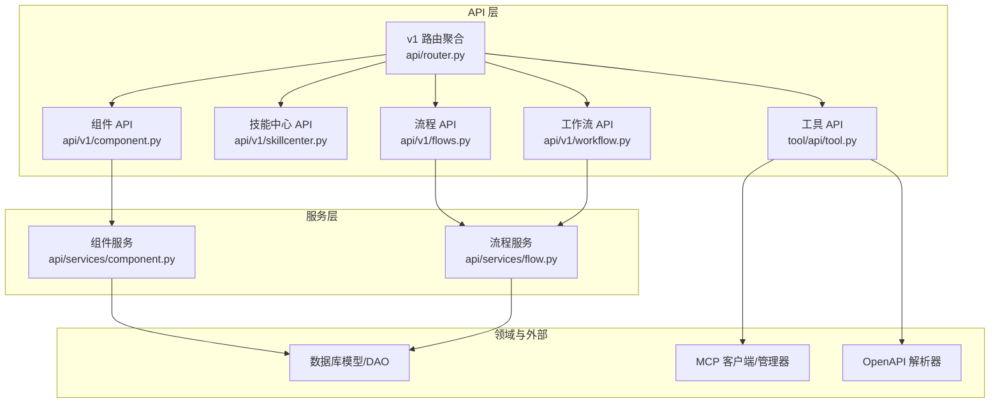
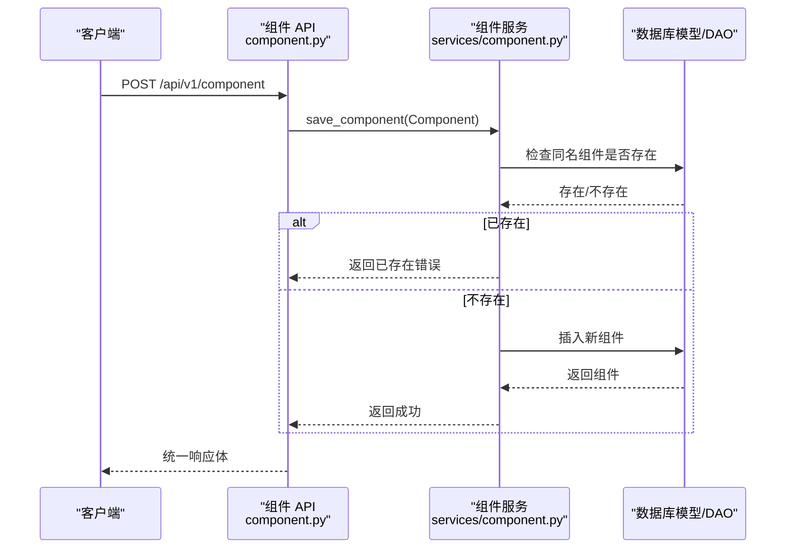
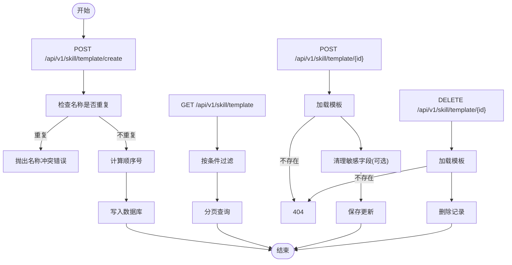
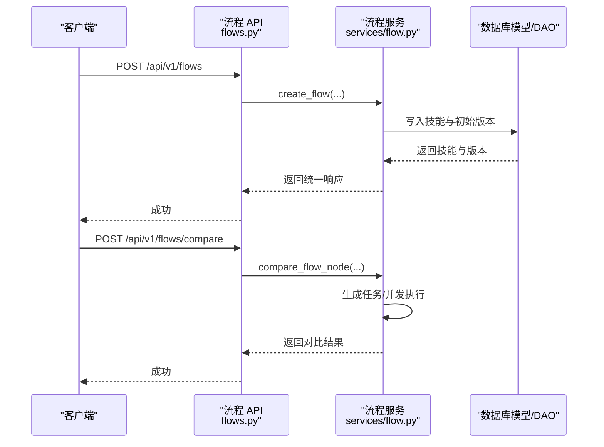
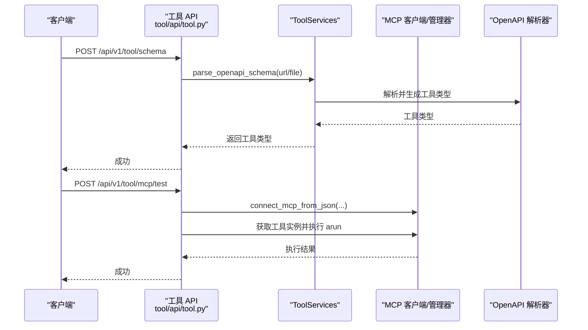
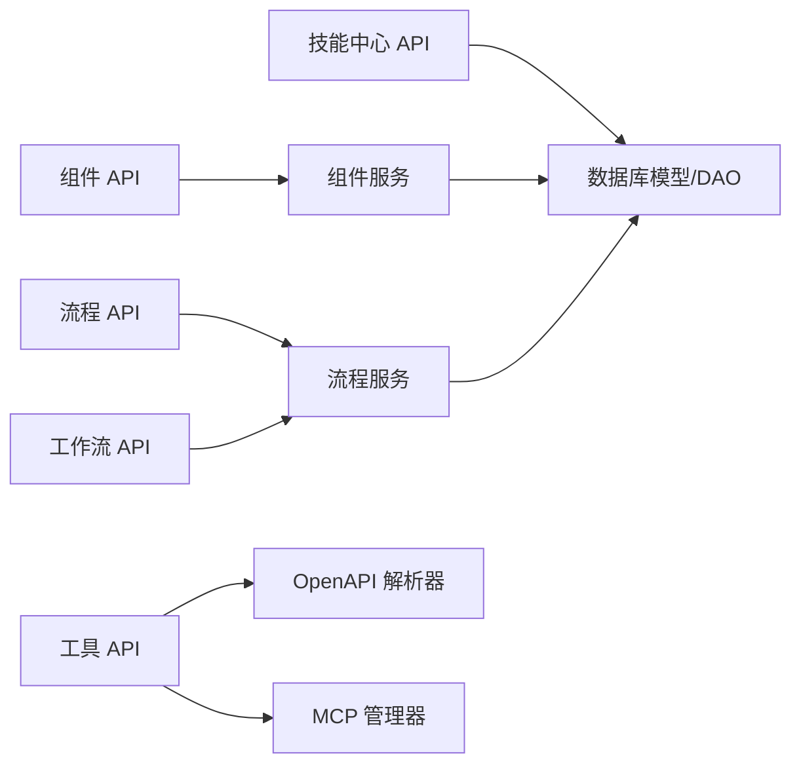

# 组件与工具 API

<cite>
**本文引用的文件**
- [src/backend/bisheng/main.py](file://src/backend/bisheng/main.py)
- [src/backend/bisheng/server.py](file://src/backend/bisheng/server.py)
- [src/backend/bisheng/api/router.py](file://src/backend/bisheng/api/router.py)
- [src/backend/bisheng/api/v1/component.py](file://src/backend/bisheng/api/v1/component.py)
- [src/backend/bisheng/api/services/component.py](file://src/backend/bisheng/api/services/component.py)
- [src/backend/bisheng/api/v1/skillcenter.py](file://src/backend/bisheng/api/v1/skillcenter.py)
- [src/backend/bisheng/api/v1/flows.py](file://src/backend/bisheng/api/v1/flows.py)
- [src/backend/bisheng/api/services/flow.py](file://src/backend/bisheng/api/services/flow.py)
- [src/backend/bisheng/api/v1/workflow.py](file://src/backend/bisheng/api/v1/workflow.py)
- [src/backend/bisheng/api/v1/schemas.py](file://src/backend/bisheng/api/v1/schemas.py)
- [src/backend/bisheng/api/v1/base.py](file://src/backend/bisheng/api/v1/base.py)
- [src/backend/bisheng/tool/api/tool.py](file://src/backend/bisheng/tool/api/tool.py)
</cite>

## 目录
1. [简介](#简介)
2. [项目结构](#项目结构)
3. [核心组件](#核心组件)
4. [架构总览](#架构总览)
5. [详细组件分析](#详细组件分析)
6. [依赖关系分析](#依赖关系分析)
7. [性能考量](#性能考量)
8. [故障排查指南](#故障排查指南)
9. [结论](#结论)
10. [附录](#附录)

## 简介
本文件面向 Bisheng 的组件与工具系统，提供全面的 API 文档与架构说明。内容覆盖组件注册与自定义组件开发、工具扩展与 OpenAPI/MCP 工具解析、技能中心模板管理、工作流与流程版本管理、以及工具市场与运行时测试等能力。文档同时给出接口规范、数据模型、错误处理策略与集成最佳实践，帮助开发者快速理解并扩展系统。

## 项目结构
后端基于 FastAPI 构建，入口应用在主模块中创建，统一挂载多条路由前缀，形成 v1 与 v2 两套 API 前缀，并通过服务层解耦业务逻辑。

图表来源
- [src/backend/bisheng/main.py](file://src/backend/bisheng/main.py#L64-L102)
- [src/backend/bisheng/api/router.py](file://src/backend/bisheng/api/router.py#L23-L61)

章节来源
- [src/backend/bisheng/main.py](file://src/backend/bisheng/main.py#L1-L113)
- [src/backend/bisheng/api/router.py](file://src/backend/bisheng/api/router.py#L1-L61)

## 核心组件
- 应用与中间件
  - 应用创建、CORS、异常处理器、健康检查、日志与线程池管理。
- 路由聚合
  - v1/v2 前缀路由，按功能域拆分（组件、技能、流程、工作流、工具、知识、微调等）。
- 服务层
  - 统一响应模型、权限校验、审计日志、遥测事件、版本与流程执行钩子。
- 数据模型与校验
  - 统一响应体、流式 SSE、工具与组件请求模型、提示词校验工具。

章节来源
- [src/backend/bisheng/main.py](file://src/backend/bisheng/main.py#L21-L102)
- [src/backend/bisheng/api/router.py](file://src/backend/bisheng/api/router.py#L1-L61)
- [src/backend/bisheng/api/v1/schemas.py](file://src/backend/bisheng/api/v1/schemas.py#L69-L88)
- [src/backend/bisheng/api/v1/base.py](file://src/backend/bisheng/api/v1/base.py#L74-L154)

## 架构总览
下图展示 API 层到服务层与领域模型的关系，以及工具与 MCP 管理器的交互。

图表来源
- [src/backend/bisheng/api/router.py](file://src/backend/bisheng/api/router.py#L23-L61)
- [src/backend/bisheng/api/v1/component.py](file://src/backend/bisheng/api/v1/component.py#L1-L89)
- [src/backend/bisheng/api/services/component.py](file://src/backend/bisheng/api/services/component.py#L1-L41)
- [src/backend/bisheng/api/v1/flows.py](file://src/backend/bisheng/api/v1/flows.py#L1-L226)
- [src/backend/bisheng/api/services/flow.py](file://src/backend/bisheng/api/services/flow.py#L1-L491)
- [src/backend/bisheng/tool/api/tool.py](file://src/backend/bisheng/tool/api/tool.py#L1-L132)

## 详细组件分析

### 组件 API（组件注册与自定义组件）
- 功能要点
  - 获取用户所有组件列表
  - 新增/更新组件（带版本号与用户信息）
  - 删除组件
  - 自定义组件代码生成前端节点模板
  - 从文件重载自定义组件并生成模板
  - 更新字段级模板
- 关键路径
  - GET /api/v1/component → 查询组件
  - POST /api/v1/component → 创建组件
  - PATCH /api/v1/component → 更新组件
  - DELETE /api/v1/component → 删除组件
  - POST /api/v1/component/custom_component → 生成前端节点模板
  - POST /api/v1/component/custom_component/reload → 重载文件并生成模板
  - POST /api/v1/component/custom_component/update → 更新字段模板
- 数据模型
  - CreateComponentReq：组件名称、数据、描述
  - CustomComponentCode：原始代码、字段名、前端节点模板片段
- 错误处理
  - 组件存在/不存在错误码封装
- 集成建议
  - 使用统一响应模型与用户依赖注入，确保鉴权与审计日志

图表来源
- [src/backend/bisheng/api/v1/component.py](file://src/backend/bisheng/api/v1/component.py#L21-L47)
- [src/backend/bisheng/api/services/component.py](file://src/backend/bisheng/api/services/component.py#L16-L21)

章节来源
- [src/backend/bisheng/api/v1/component.py](file://src/backend/bisheng/api/v1/component.py#L1-L89)
- [src/backend/bisheng/api/services/component.py](file://src/backend/bisheng/api/services/component.py#L1-L41)
- [src/backend/bisheng/api/v1/schemas.py](file://src/backend/bisheng/api/v1/schemas.py#L234-L244)

### 技能中心 API（模板管理）
- 功能要点
  - 创建模板（自动分配顺序号）
  - 分页查询模板（支持按名称/类型过滤）
  - 更新模板（可移除敏感字段）
  - 删除模板
- 关键路径
  - POST /api/v1/skill/template/create
  - GET /api/v1/skill/template
  - POST /api/v1/skill/template/{id}
  - DELETE /api/v1/skill/template/{id}

图表来源
- [src/backend/bisheng/api/v1/skillcenter.py](file://src/backend/bisheng/api/v1/skillcenter.py#L20-L110)

章节来源
- [src/backend/bisheng/api/v1/skillcenter.py](file://src/backend/bisheng/api/v1/skillcenter.py#L1-L110)

### 流程/技能 API（版本与比较）
- 功能要点
  - 创建技能、获取版本列表、创建/更新/删除版本、切换当前版本
  - 读取单个技能、批量更新、删除技能
  - 技能节点对比（同步与流式 SSE）
- 关键路径
  - POST /api/v1/flows → 创建技能
  - GET /api/v1/flows/versions → 版本列表
  - POST /api/v1/flows/versions → 创建版本
  - PUT /api/v1/flows/versions/{id} → 更新版本
  - DELETE /api/v1/flows/versions/{id} → 删除版本
  - POST /api/v1/flows/change_version → 切换当前版本
  - GET /api/v1/flows → 技能列表
  - GET /api/v1/flows/{id} → 读取技能
  - PATCH /api/v1/flows/{id} → 更新技能
  - DELETE /api/v1/flows/{id} → 删除技能
  - POST /api/v1/flows/compare → 对比结果（同步）
  - GET /api/v1/flows/compare/stream → 对比结果（SSE 流）

图表来源
- [src/backend/bisheng/api/v1/flows.py](file://src/backend/bisheng/api/v1/flows.py#L29-L45)
- [src/backend/bisheng/api/services/flow.py](file://src/backend/bisheng/api/services/flow.py#L372-L390)

章节来源
- [src/backend/bisheng/api/v1/flows.py](file://src/backend/bisheng/api/v1/flows.py#L1-L226)
- [src/backend/bisheng/api/services/flow.py](file://src/backend/bisheng/api/services/flow.py#L1-L491)

### 工作流 API（运行与报告）
- 功能要点
  - 写权限校验
  - 报告模板文件上传回调、复制与下载链接生成
  - 单节点运行
  - WebSocket 聊天通道
  - 创建/更新工作流、状态变更、版本管理
  - 列表查询与分页
- 关键路径
  - GET /api/v1/workflow/write/auth
  - GET /api/v1/workflow/report/file
  - POST /api/v1/workflow/report/copy
  - POST /api/v1/workflow/report/callback
  - POST /api/v1/workflow/run_once
  - WEBSOCKET /api/v1/workflow/chat/{workflow_id}
  - POST /api/v1/workflow/create
  - GET /api/v1/workflow/versions
  - POST /api/v1/workflow/versions
  - PUT /api/v1/workflow/versions/{id}
  - DELETE /api/v1/workflow/versions/{id}
  - GET /api/v1/workflow/versions/{id}
  - POST /api/v1/workflow/change_version
  - GET /api/v1/workflow/get_one_flow/{flow_id}
  - PATCH /api/v1/workflow/update/{flow_id}
  - PATCH /api/v1/workflow/status
  - GET /api/v1/workflow/list

章节来源
- [src/backend/bisheng/api/v1/workflow.py](file://src/backend/bisheng/api/v1/workflow.py#L1-L312)

### 工具 API（OpenAPI/MCP 工具）
- 功能要点
  - 获取工具列表（预置/自定义）
  - 添加/更新/删除工具类型
  - 更新工具配置（管理员）
  - 解析 OpenAPI/Swagger Schema 并转换为助手工具格式
  - 解析 MCP 工具配置
  - 测试工具运行（OpenAPI/MCP）
  - 刷新用户所有 MCP 工具列表
  - 获取 Ideas 预置工具
- 关键路径
  - GET /api/v1/tool
  - POST /api/v1/tool
  - PUT /api/v1/tool
  - DELETE /api/v1/tool
  - POST /api/v1/tool/config
  - POST /api/v1/tool/schema
  - POST /api/v1/tool/mcp/schema
  - POST /api/v1/tool/test
  - POST /api/v1/tool/mcp/test
  - POST /api/v1/tool/mcp/refresh
  - GET /api/v1/tool/linsight/preset

图表来源
- [src/backend/bisheng/tool/api/tool.py](file://src/backend/bisheng/tool/api/tool.py#L68-L122)

章节来源
- [src/backend/bisheng/tool/api/tool.py](file://src/backend/bisheng/tool/api/tool.py#L1-L132)

### 提示词与前端节点校验（辅助能力）
- 功能要点
  - 校验提示词输入变量合法性
  - 生成前端节点模板请求模型
  - 统一导入/函数校验响应结构
- 关键路径
  - 校验提示词：校验变量名、字符集、重复与空变量
  - 前端节点请求：携带模板字典
  - 导入/函数校验响应：默认填充空错误数组

章节来源
- [src/backend/bisheng/api/v1/base.py](file://src/backend/bisheng/api/v1/base.py#L19-L154)

## 依赖关系分析
- 组件 API 依赖服务层进行持久化操作，服务层再依赖 DAO 与数据库会话。
- 流程 API 与工作流 API 共享流程服务，提供版本管理、对比、钩子与审计日志。
- 工具 API 依赖 OpenAPI 解析器与 MCP 管理器，实现工具 Schema 解析与运行测试。
- 统一响应模型与流式 SSE 在多个模块复用，保证一致的返回格式。

图表来源
- [src/backend/bisheng/api/v1/component.py](file://src/backend/bisheng/api/v1/component.py#L1-L11)
- [src/backend/bisheng/api/services/component.py](file://src/backend/bisheng/api/services/component.py#L1-L7)
- [src/backend/bisheng/api/v1/flows.py](file://src/backend/bisheng/api/v1/flows.py#L1-L26)
- [src/backend/bisheng/api/services/flow.py](file://src/backend/bisheng/api/services/flow.py#L1-L38)
- [src/backend/bisheng/tool/api/tool.py](file://src/backend/bisheng/tool/api/tool.py#L1-L16)

章节来源
- [src/backend/bisheng/api/v1/component.py](file://src/backend/bisheng/api/v1/component.py#L1-L11)
- [src/backend/bisheng/api/services/component.py](file://src/backend/bisheng/api/services/component.py#L1-L41)
- [src/backend/bisheng/api/v1/flows.py](file://src/backend/bisheng/api/v1/flows.py#L1-L26)
- [src/backend/bisheng/api/services/flow.py](file://src/backend/bisheng/api/services/flow.py#L1-L491)
- [src/backend/bisheng/tool/api/tool.py](file://src/backend/bisheng/tool/api/tool.py#L1-L16)

## 性能考量
- 版本对比采用异步并发执行与缓存处理，减少长耗时任务等待。
- SSE 流式输出用于大规模对比任务，避免一次性大响应。
- 权限与访问控制前置校验，降低无效请求对后端的压力。
- 建议：对频繁查询的列表接口增加分页参数与索引优化；对工具 Schema 解析与 MCP 连接设置超时与重试策略。

## 故障排查指南
- 统一异常处理
  - HTTP 异常、请求校验异常、业务错误码均映射为统一响应体，便于前端识别。
- 常见错误定位
  - 组件：名称冲突、组件不存在
  - 技能：模板名称冲突、模板不存在、在线编辑限制
  - 工具：OpenAPI/MCP 解析失败、测试参数缺失或认证错误
- 日志与追踪
  - 应用启动与关闭、服务初始化与销毁、请求异常均有日志记录；遥测事件可用于审计与性能分析。

章节来源
- [src/backend/bisheng/main.py](file://src/backend/bisheng/main.py#L21-L49)
- [src/backend/bisheng/api/services/component.py](file://src/backend/bisheng/api/services/component.py#L16-L40)
- [src/backend/bisheng/api/services/flow.py](file://src/backend/bisheng/api/services/flow.py#L113-L136)

## 结论
Bisheng 的组件与工具系统以清晰的 API 分层与服务层解耦为核心，围绕组件、技能中心、流程/工作流与工具四大能力域提供完整接口。通过统一响应模型、权限校验、审计与遥测，系统具备良好的可维护性与可观测性。建议在实际集成中遵循接口规范、使用统一响应模型、合理使用版本与对比能力，并对工具 Schema 与 MCP 连接做好容错与监控。

## 附录
- 统一响应模型
  - 字段：status_code、status_message、data
  - 辅助方法：resp_200、resp_500
- 流式数据模型
  - 字段：event、data（字符串化）
- 请求模型示例
  - CreateComponentReq：组件名称、数据、描述
  - CustomComponentCode：原始代码、字段名、前端节点模板片段
  - FlowCompareReq：输入、问题列表、版本列表、节点 ID、线程数

章节来源
- [src/backend/bisheng/api/v1/schemas.py](file://src/backend/bisheng/api/v1/schemas.py#L69-L88)
- [src/backend/bisheng/api/v1/schemas.py](file://src/backend/bisheng/api/v1/schemas.py#L224-L232)
- [src/backend/bisheng/api/v1/schemas.py](file://src/backend/bisheng/api/v1/schemas.py#L234-L244)
- [src/backend/bisheng/api/v1/schemas.py](file://src/backend/bisheng/api/v1/schemas.py#L307-L313)