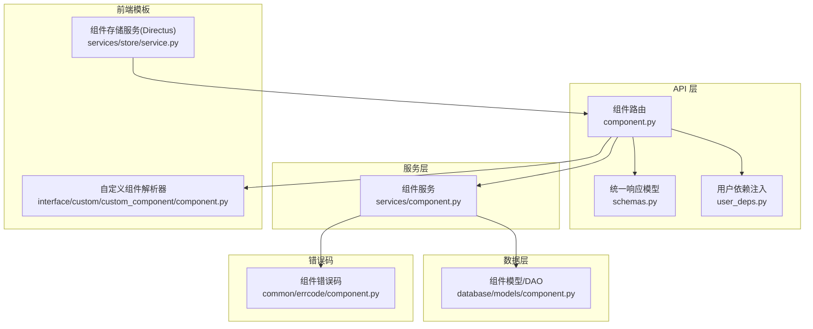
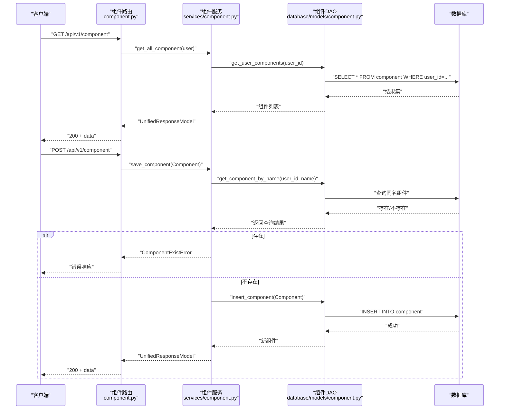
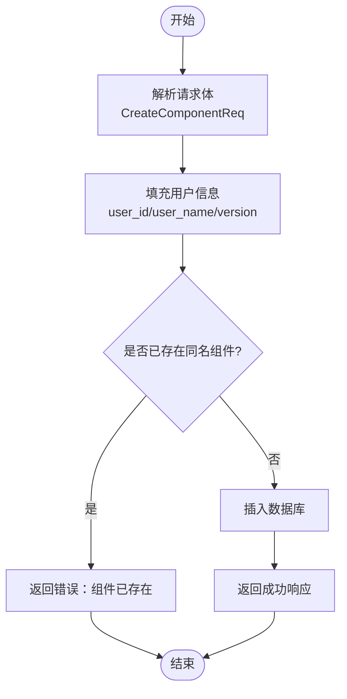
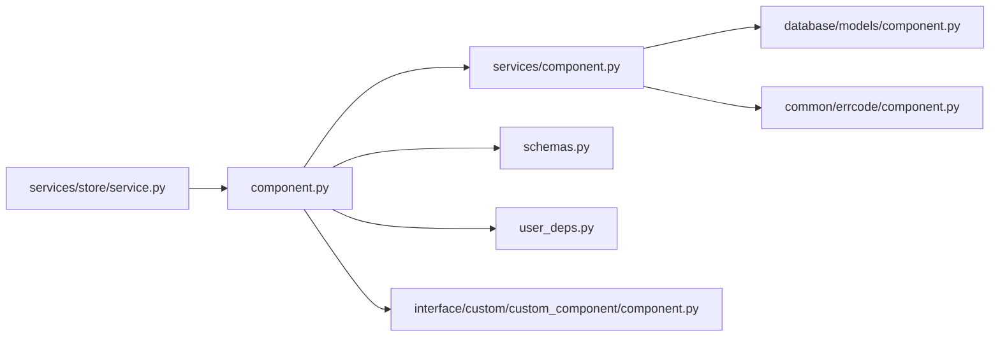

# 组件管理 API

<cite>
**本文引用的文件列表**
- [组件路由与控制器](file://src/backend/bisheng/api/v1/component.py)
- [组件服务层](file://src/backend/bisheng/api/services/component.py)
- [组件数据模型与DAO](file://src/backend/bisheng/database/models/component.py)
- [组件错误码定义](file://src/backend/bisheng/common/errcode/component.py)
- [统一响应模型与请求体定义](file://src/backend/bisheng/api/v1/schemas.py)
- [用户依赖注入](file://src/backend/bisheng/common/dependencies/user_deps.py)
- [自定义组件解析器与校验](file://src/backend/bisheng/interface/custom/custom_component/component.py)
- [组件存储服务（Directus集成）](file://src/backend/bisheng/services/store/service.py)
</cite>

## 目录
1. [简介](#简介)
2. [项目结构](#项目结构)
3. [核心组件](#核心组件)
4. [架构总览](#架构总览)
5. [详细组件分析](#详细组件分析)
6. [依赖关系分析](#依赖关系分析)
7. [性能考量](#性能考量)
8. [故障排查指南](#故障排查指南)
9. [结论](#结论)
10. [附录](#附录)

## 简介
本文件面向 Bisheng 组件管理系统，提供组件的增删改查（CRUD）API 完整规范，涵盖：
- 获取所有组件
- 保存组件
- 更新组件
- 删除组件
- 自定义组件模板构建与更新
- 组件版本管理、用户关联与权限控制机制
- 字段验证规则与错误处理最佳实践
- 实际请求/响应示例与常见问题解决方案

## 项目结构
组件管理相关模块分布于后端 API 层、服务层、数据模型层以及前端模板生成工具链中，形成清晰分层：
- API 路由层：负责 HTTP 接口暴露与用户鉴权依赖注入
- 服务层：封装业务逻辑（查询、插入、更新、删除）
- 数据模型层：定义组件实体、序列化与数据库访问
- 错误码层：统一返回错误码与消息
- 前端模板层：支持自定义组件的前端节点模板构建与校验

图表来源
- [组件路由与控制器](file://src/backend/bisheng/api/v1/component.py#L1-L89)
- [组件服务层](file://src/backend/bisheng/api/services/component.py#L1-L41)
- [组件数据模型与DAO](file://src/backend/bisheng/database/models/component.py#L1-L67)
- [组件错误码定义](file://src/backend/bisheng/common/errcode/component.py#L1-L13)
- [统一响应模型与请求体定义](file://src/backend/bisheng/api/v1/schemas.py#L69-L97)
- [用户依赖注入](file://src/backend/bisheng/common/dependencies/user_deps.py#L1-L6)
- [自定义组件解析器与校验](file://src/backend/bisheng/interface/custom/custom_component/component.py#L1-L109)
- [组件存储服务（Directus集成）](file://src/backend/bisheng/services/store/service.py#L277-L388)

章节来源
- [组件路由与控制器](file://src/backend/bisheng/api/v1/component.py#L1-L89)
- [组件服务层](file://src/backend/bisheng/api/services/component.py#L1-L41)
- [组件数据模型与DAO](file://src/backend/bisheng/database/models/component.py#L1-L67)
- [组件错误码定义](file://src/backend/bisheng/common/errcode/component.py#L1-L13)
- [统一响应模型与请求体定义](file://src/backend/bisheng/api/v1/schemas.py#L69-L97)
- [用户依赖注入](file://src/backend/bisheng/common/dependencies/user_deps.py#L1-L6)
- [自定义组件解析器与校验](file://src/backend/bisheng/interface/custom/custom_component/component.py#L1-L109)
- [组件存储服务（Directus集成）](file://src/backend/bisheng/services/store/service.py#L277-L388)

## 核心组件
- 组件路由与控制器：提供 GET/POST/PATCH/DELETE 组件接口，并支持自定义组件模板构建与更新。
- 组件服务层：封装用户维度的组件查询、保存、更新、删除逻辑，包含重复名检查与不存在错误返回。
- 组件数据模型与DAO：定义 Component 实体（含名称、描述、数据、版本、创建者信息、时间戳等），提供按用户查询、按名称查询、插入、更新、删除等 DAO 方法。
- 统一响应模型：定义统一的响应结构，便于前后端一致化处理。
- 用户依赖注入：通过 UserPayload 注入登录用户上下文，确保接口具备用户身份。
- 自定义组件解析器：对自定义组件代码进行解析与校验，支持入口函数名、图标等字段校验。
- 组件存储服务：对接外部组件商店（Directus），实现组件上传、更新、下载与授权校验。

章节来源
- [组件路由与控制器](file://src/backend/bisheng/api/v1/component.py#L1-L89)
- [组件服务层](file://src/backend/bisheng/api/services/component.py#L1-L41)
- [组件数据模型与DAO](file://src/backend/bisheng/database/models/component.py#L11-L67)
- [统一响应模型与请求体定义](file://src/backend/bisheng/api/v1/schemas.py#L69-L97)
- [用户依赖注入](file://src/backend/bisheng/common/dependencies/user_deps.py#L1-L6)
- [自定义组件解析器与校验](file://src/backend/bisheng/interface/custom/custom_component/component.py#L1-L109)
- [组件存储服务（Directus集成）](file://src/backend/bisheng/services/store/service.py#L277-L388)

## 架构总览
组件管理 API 的调用链路如下：
- 客户端发起 HTTP 请求到组件路由
- 路由使用用户依赖注入获取当前登录用户
- 路由将请求体转换为组件模型并交由服务层处理
- 服务层调用 DAO 执行数据库操作
- DAO 使用 SQLModel 进行数据库访问
- 返回统一响应模型给客户端

图表来源
- [组件路由与控制器](file://src/backend/bisheng/api/v1/component.py#L15-L47)
- [组件服务层](file://src/backend/bisheng/api/services/component.py#L9-L40)
- [组件数据模型与DAO](file://src/backend/bisheng/database/models/component.py#L29-L66)

章节来源
- [组件路由与控制器](file://src/backend/bisheng/api/v1/component.py#L1-L89)
- [组件服务层](file://src/backend/bisheng/api/services/component.py#L1-L41)
- [组件数据模型与DAO](file://src/backend/bisheng/database/models/component.py#L1-L67)

## 详细组件分析

### API 规范总览
- 基础路径：/api/v1/component
- 认证方式：依赖用户登录态（UserPayload）
- 统一响应：status_code、status_message、data

章节来源
- [组件路由与控制器](file://src/backend/bisheng/api/v1/component.py#L12-L18)
- [统一响应模型与请求体定义](file://src/backend/bisheng/api/v1/schemas.py#L69-L97)

### 获取所有组件
- 方法：GET
- 路径：/api/v1/component
- 请求头：携带认证信息（由依赖注入自动处理）
- 响应：返回当前用户的所有组件列表

章节来源
- [组件路由与控制器](file://src/backend/bisheng/api/v1/component.py#L15-L18)
- [组件服务层](file://src/backend/bisheng/api/services/component.py#L11-L13)

### 保存组件
- 方法：POST
- 路径：/api/v1/component
- 请求体：CreateComponentReq
- 业务逻辑：
  - 将请求体映射为 Component 模型
  - 自动填充 user_id、user_name、version
  - 检查是否存在同名组件，若存在则返回“组件已存在”错误
  - 插入数据库并返回新组件

请求体定义（CreateComponentReq）
- name: 字符串，最大长度 50，必填
- data: 任意类型，组件数据
- description: 可选字符串

响应格式
- 成功：UnifiedResponseModel，data 为 Component
- 失败：统一错误响应（组件已存在）

章节来源
- [组件路由与控制器](file://src/backend/bisheng/api/v1/component.py#L21-L29)
- [组件服务层](file://src/backend/bisheng/api/services/component.py#L15-L21)
- [统一响应模型与请求体定义](file://src/backend/bisheng/api/v1/schemas.py#L234-L238)
- [组件错误码定义](file://src/backend/bisheng/common/errcode/component.py#L5-L7)

### 更新组件
- 方法：PATCH
- 路径：/api/v1/component
- 请求体：CreateComponentReq
- 业务逻辑：
  - 将请求体映射为 Component 模型
  - 自动填充 user_id、user_name、version
  - 检查是否存在同名组件，若不存在则返回“组件不存在”错误
  - 更新 data、description、version 并提交

响应格式
- 成功：UnifiedResponseModel，data 为更新后的 Component
- 失败：统一错误响应（组件不存在）

章节来源
- [组件路由与控制器](file://src/backend/bisheng/api/v1/component.py#L32-L40)
- [组件服务层](file://src/backend/bisheng/api/services/component.py#L23-L32)
- [组件错误码定义](file://src/backend/bisheng/common/errcode/component.py#L10-L12)

### 删除组件
- 方法：DELETE
- 路径：/api/v1/component
- 查询参数：name（组件名称）
- 业务逻辑：
  - 按 user_id 与 name 查询组件
  - 若不存在则返回“组件不存在”错误
  - 删除并返回被删除组件

响应格式
- 成功：UnifiedResponseModel，data 为被删除组件
- 失败：统一错误响应（组件不存在）

章节来源
- [组件路由与控制器](file://src/backend/bisheng/api/v1/component.py#L43-L47)
- [组件服务层](file://src/backend/bisheng/api/services/component.py#L34-L40)
- [组件错误码定义](file://src/backend/bisheng/common/errcode/component.py#L10-L12)

### 自定义组件模板构建与更新
- 构建模板：POST /api/v1/component/custom_component
  - 请求体：CustomComponentCode（包含 code、field、frontend_node）
  - 返回：前端节点模板（含字段值）
- 重载模板：POST /api/v1/component/custom_component/reload
  - 请求体：path（文件路径）
  - 返回：重新解析后的前端节点模板
- 更新字段：POST /api/v1/component/custom_component/update
  - 请求体：CustomComponentCode（包含 code、field、frontend_node）
  - 返回：更新后的前端节点模板

请求体定义（CustomComponentCode）
- code: 字符串，必填
- field: 可选字符串
- frontend_node: 可选字典

章节来源
- [组件路由与控制器](file://src/backend/bisheng/api/v1/component.py#L50-L89)
- [自定义组件解析器与校验](file://src/backend/bisheng/interface/custom/custom_component/component.py#L21-L68)

### 组件模型字段定义
Component 模型字段
- id: 字符串，主键（UUID）
- name: 字符串，最大长度 50，索引
- description: 可选字符串
- data: 任意类型（JSON 列）
- version: 字符串，版本号，索引
- user_id: 整数，创建者ID，索引
- user_name: 字符串，创建者名称
- create_time: 时间戳，默认当前时间
- update_time: 时间戳，默认当前时间（更新时自动）

章节来源
- [组件数据模型与DAO](file://src/backend/bisheng/database/models/component.py#L11-L26)

### 组件版本管理
- 保存/更新时会写入当前系统版本号（来自 bisheng 版本）
- version 字段用于标识组件修订版本，便于后续对比与回滚

章节来源
- [组件路由与控制器](file://src/backend/bisheng/api/v1/component.py#L23-L39)
- [组件数据模型与DAO](file://src/backend/bisheng/database/models/component.py#L15-L15)

### 用户关联与权限控制
- 用户关联：每个组件绑定 user_id 与 user_name，查询与保存均基于当前登录用户
- 权限控制：路由依赖 UserPayload.get_login_user，未登录无法访问
- 存储服务（Directus）：组件上传/更新/下载时需要 API Key，且会进行授权校验

章节来源
- [组件路由与控制器](file://src/backend/bisheng/api/v1/component.py#L12-L12)
- [用户依赖注入](file://src/backend/bisheng/common/dependencies/user_deps.py#L4-L5)
- [组件存储服务（Directus集成）](file://src/backend/bisheng/services/store/service.py#L277-L388)

### 字段验证规则与错误处理
- CreateComponentReq 验证
  - name：必填，最大长度 50
  - data：可为空字符串，但建议提供有效组件数据
  - description：可空
- 自定义组件校验
  - code 必须非空
  - 入口函数名必须非空
  - 图标需符合 emoji 语法或进行警告提示
- 错误处理
  - 组件已存在：返回统一错误码 10300
  - 组件不存在：返回统一错误码 10301
  - Directus 上传/更新异常：捕获 HTTP 异常并转换为可读错误消息

章节来源
- [统一响应模型与请求体定义](file://src/backend/bisheng/api/v1/schemas.py#L234-L238)
- [自定义组件解析器与校验](file://src/backend/bisheng/interface/custom/custom_component/component.py#L13-L68)
- [组件错误码定义](file://src/backend/bisheng/common/errcode/component.py#L5-L12)
- [组件存储服务（Directus集成）](file://src/backend/bisheng/services/store/service.py#L334-L346)

### 组件注册流程（概念流程图）

图表来源
- [组件路由与控制器](file://src/backend/bisheng/api/v1/component.py#L21-L29)
- [组件服务层](file://src/backend/bisheng/api/services/component.py#L15-L21)

## 依赖关系分析
- 组件路由依赖用户依赖注入与统一响应模型
- 服务层依赖 DAO 与错误码
- DAO 依赖数据库会话与 SQLModel
- 自定义组件解析器依赖代码解析与校验工具
- 组件存储服务依赖外部 Directus API

图表来源
- [组件路由与控制器](file://src/backend/bisheng/api/v1/component.py#L1-L11)
- [组件服务层](file://src/backend/bisheng/api/services/component.py#L1-L6)
- [组件数据模型与DAO](file://src/backend/bisheng/database/models/component.py#L1-L8)
- [组件错误码定义](file://src/backend/bisheng/common/errcode/component.py#L1-L13)
- [统一响应模型与请求体定义](file://src/backend/bisheng/api/v1/schemas.py#L69-L97)
- [用户依赖注入](file://src/backend/bisheng/common/dependencies/user_deps.py#L1-L6)
- [自定义组件解析器与校验](file://src/backend/bisheng/interface/custom/custom_component/component.py#L1-L10)
- [组件存储服务（Directus集成）](file://src/backend/bisheng/services/store/service.py#L277-L294)

章节来源
- [组件路由与控制器](file://src/backend/bisheng/api/v1/component.py#L1-L89)
- [组件服务层](file://src/backend/bisheng/api/services/component.py#L1-L41)
- [组件数据模型与DAO](file://src/backend/bisheng/database/models/component.py#L1-L67)
- [组件错误码定义](file://src/backend/bisheng/common/errcode/component.py#L1-L13)
- [统一响应模型与请求体定义](file://src/backend/bisheng/api/v1/schemas.py#L69-L97)
- [用户依赖注入](file://src/backend/bisheng/common/dependencies/user_deps.py#L1-L6)
- [自定义组件解析器与校验](file://src/backend/bisheng/interface/custom/custom_component/component.py#L1-L109)
- [组件存储服务（Directus集成）](file://src/backend/bisheng/services/store/service.py#L277-L388)

## 性能考量
- 数据库索引：name、version、user_id、create_time 均建立索引，有利于按用户查询与排序
- 事务与会话：DAO 使用同步会话执行单条操作，避免长事务
- 缓存：自定义组件解析器内部使用 TTL 缓存，减少重复解析开销
- 建议：
  - 批量操作时考虑分页与并发限制
  - 对频繁查询的组件名称建立唯一约束以加速去重

章节来源
- [组件数据模型与DAO](file://src/backend/bisheng/database/models/component.py#L12-L21)
- [自定义组件解析器与校验](file://src/backend/bisheng/interface/custom/custom_component/component.py#L30-L36)

## 故障排查指南
- “组件已存在”
  - 现象：保存组件时报错
  - 原因：同名组件已存在
  - 处理：修改组件名称或使用更新接口
- “组件不存在”
  - 现象：更新/删除组件时报错
  - 原因：目标组件不存在
  - 处理：确认组件名称与用户身份
- Directus 上传失败
  - 现象：上传/更新组件时报错
  - 原因：API Key 无效或网络异常
  - 处理：检查 API Key、网络连通性与服务端日志
- 自定义组件解析失败
  - 现象：构建/更新模板时报错
  - 原因：code 为空、入口函数名为空、图标格式不合法
  - 处理：完善代码与字段配置

章节来源
- [组件错误码定义](file://src/backend/bisheng/common/errcode/component.py#L5-L12)
- [组件存储服务（Directus集成）](file://src/backend/bisheng/services/store/service.py#L334-L346)
- [自定义组件解析器与校验](file://src/backend/bisheng/interface/custom/custom_component/component.py#L13-L68)

## 结论
组件管理 API 提供了完整的 CRUD 能力与自定义组件模板构建能力，结合用户维度的数据隔离与统一响应模型，满足多用户场景下的组件管理需求。通过明确的字段验证与错误处理策略，能够有效提升系统的稳定性与可维护性。

## 附录

### API 请求/响应示例（示意）
- 获取所有组件
  - 请求：GET /api/v1/component
  - 响应：200 + data: [Component...]
- 保存组件
  - 请求：POST /api/v1/component
  - 请求体：{ name, data, description }
  - 响应：200 + data: Component 或错误码
- 更新组件
  - 请求：PATCH /api/v1/component
  - 请求体：{ name, data, description }
  - 响应：200 + data: Component 或错误码
- 删除组件
  - 请求：DELETE /api/v1/component?name=xxx
  - 响应：200 + data: Component 或错误码
- 自定义组件模板
  - 请求：POST /api/v1/component/custom_component
  - 请求体：{ code, field?, frontend_node? }
  - 响应：200 + data: 前端节点模板

章节来源
- [组件路由与控制器](file://src/backend/bisheng/api/v1/component.py#L15-L89)
- [统一响应模型与请求体定义](file://src/backend/bisheng/api/v1/schemas.py#L69-L97)