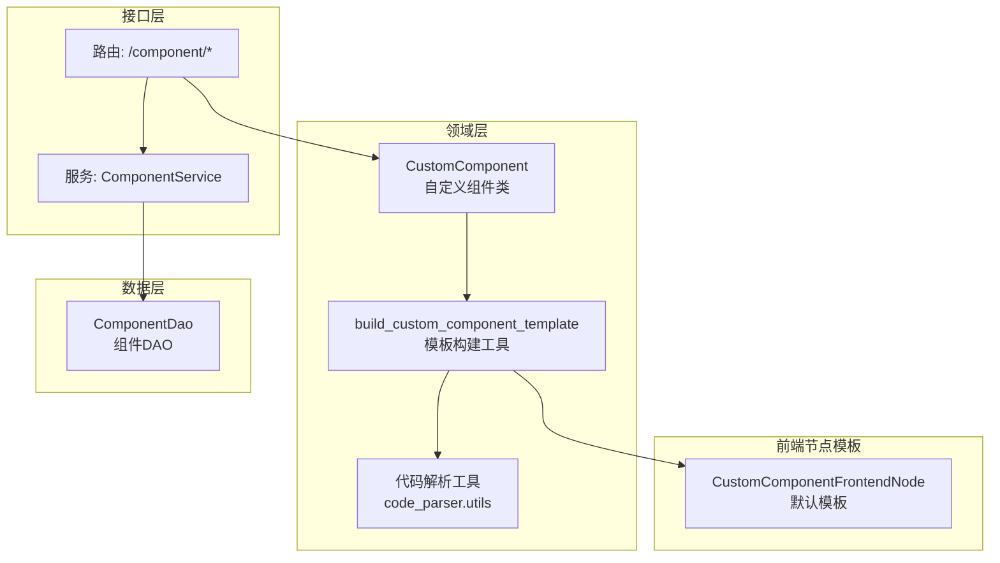
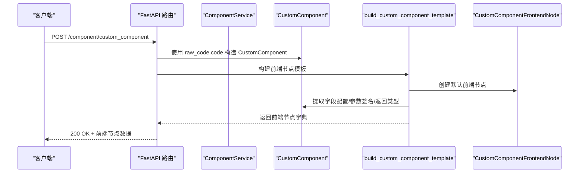
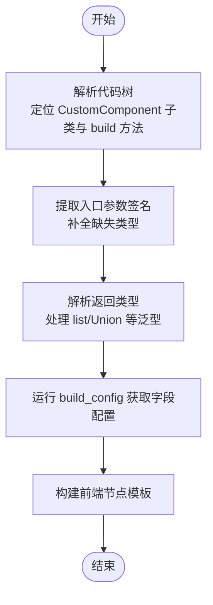
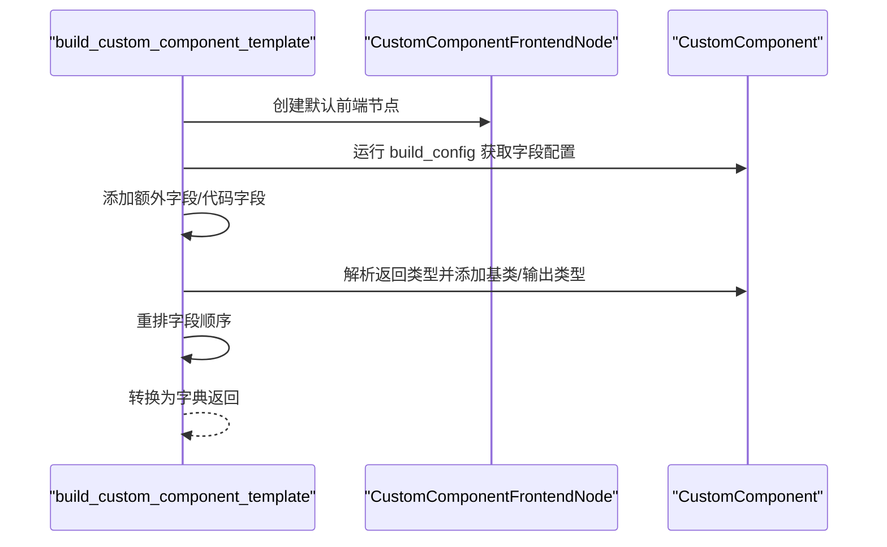
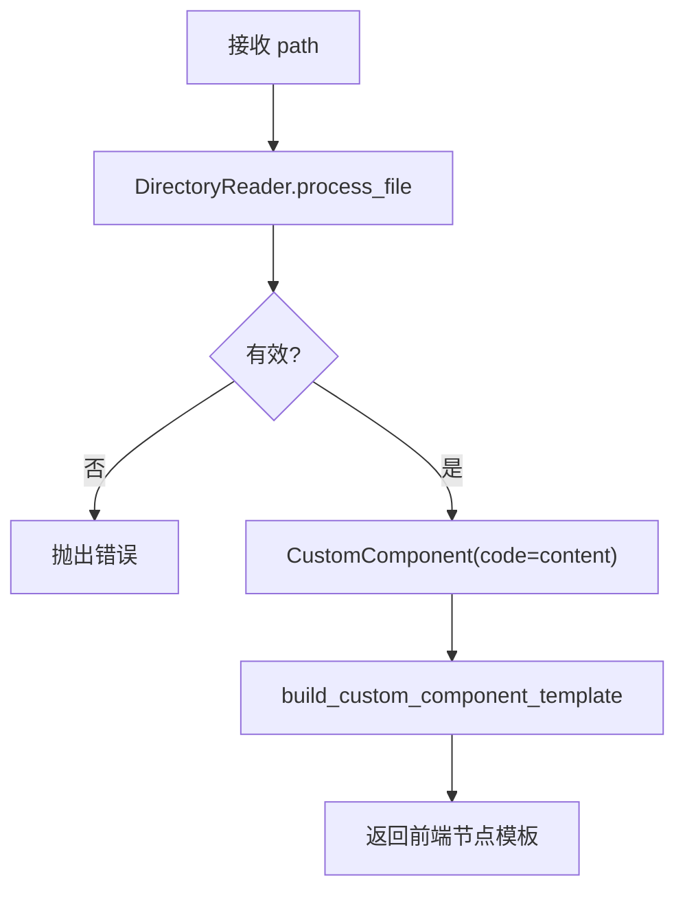
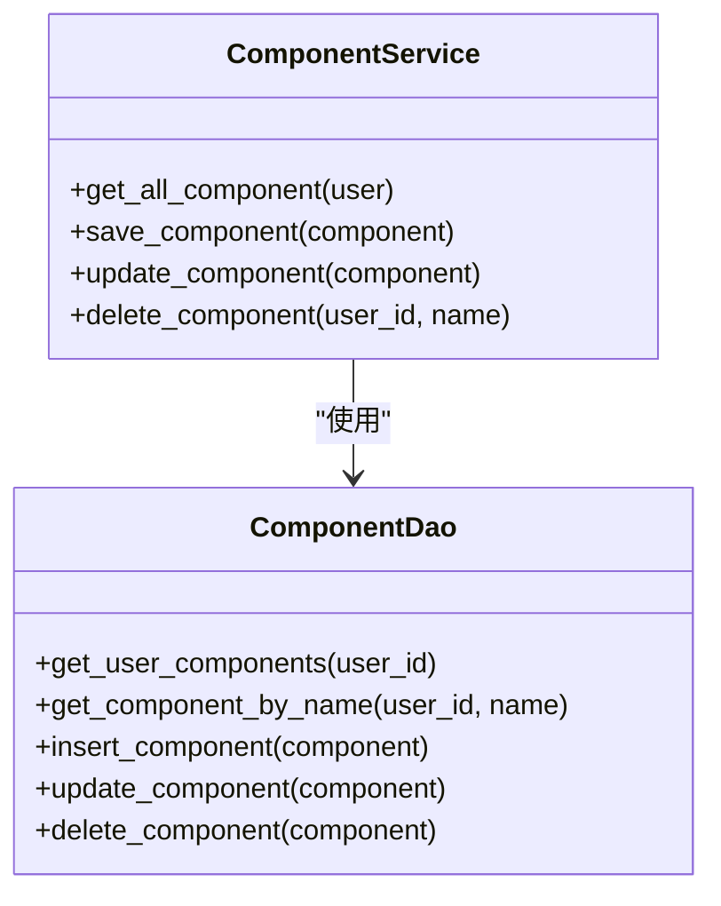
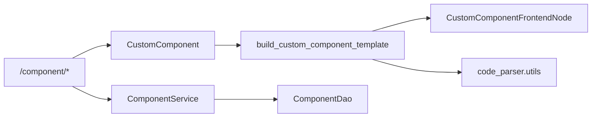

# 自定义组件 API

<cite>
**本文引用的文件**
- [src/backend/bisheng/api/v1/component.py](file://src/backend/bisheng/api/v1/component.py)
- [src/backend/bisheng/api/v1/schemas.py](file://src/backend/bisheng/api/v1/schemas.py)
- [src/backend/bisheng/interface/custom/custom_component/custom_component.py](file://src/backend/bisheng/interface/custom/custom_component/custom_component.py)
- [src/backend/bisheng/interface/custom/utils.py](file://src/backend/bisheng/interface/custom/utils.py)
- [src/backend/bisheng/interface/custom/code_parser/utils.py](file://src/backend/bisheng/interface/custom/code_parser/utils.py)
- [src/backend/bisheng/template/frontend_node/custom_components.py](file://src/backend/bisheng/template/frontend_node/custom_components.py)
- [src/backend/bisheng/api/services/component.py](file://src/backend/bisheng/api/services/component.py)
- [src/backend/bisheng/database/models/component.py](file://src/backend/bisheng/database/models/component.py)
- [src/backend/bisheng/interface/custom/base.py](file://src/backend/bisheng/interface/custom/base.py)
</cite>

## 目录
1. [简介](#简介)
2. [项目结构](#项目结构)
3. [核心组件](#核心组件)
4. [架构总览](#架构总览)
5. [详细组件分析](#详细组件分析)
6. [依赖关系分析](#依赖关系分析)
7. [性能考虑](#性能考虑)
8. [故障排查指南](#故障排查指南)
9. [结论](#结论)
10. [附录](#附录)

## 简介
本文件面向 Bisheng 自定义组件系统的开发者与使用者，系统性梳理“自定义组件”的创建、加载与更新接口，重点覆盖以下端点与能力：
- 自定义组件代码校验与前端节点模板生成：POST /component/custom_component
- 自定义组件从文件热加载与校验：POST /component/custom_component/reload
- 自定义组件字段级更新：POST /component/custom_component/update
- 后端组件持久化（保存/更新/删除）：GET/POST/PATCH/DELETE /component

文档同时解释 CustomComponentCode 请求体格式、代码解析与字段提取机制、前端节点模板构建流程，并提供开发规范、调试技巧、常见错误与性能优化建议。

## 项目结构
围绕自定义组件 API 的关键模块分布如下：
- 接口层：FastAPI 路由与服务调用
- 业务层：组件持久化服务
- 领域层：自定义组件解析与模板构建
- 前端节点模板：默认模板与字段定义
- 数据模型：组件数据库访问对象

图表来源
- [src/backend/bisheng/api/v1/component.py](file://src/backend/bisheng/api/v1/component.py#L1-L88)
- [src/backend/bisheng/api/services/component.py](file://src/backend/bisheng/api/services/component.py#L1-L40)
- [src/backend/bisheng/interface/custom/custom_component/custom_component.py](file://src/backend/bisheng/interface/custom/custom_component/custom_component.py#L1-L205)
- [src/backend/bisheng/interface/custom/utils.py](file://src/backend/bisheng/interface/custom/utils.py#L286-L324)
- [src/backend/bisheng/interface/custom/code_parser/utils.py](file://src/backend/bisheng/interface/custom/code_parser/utils.py#L1-L40)
- [src/backend/bisheng/template/frontend_node/custom_components.py](file://src/backend/bisheng/template/frontend_node/custom_components.py#L1-L70)
- [src/backend/bisheng/database/models/component.py](file://src/backend/bisheng/database/models/component.py#L29-L66)

章节来源
- [src/backend/bisheng/api/v1/component.py](file://src/backend/bisheng/api/v1/component.py#L1-L88)
- [src/backend/bisheng/api/services/component.py](file://src/backend/bisheng/api/services/component.py#L1-L40)
- [src/backend/bisheng/database/models/component.py](file://src/backend/bisheng/database/models/component.py#L29-L66)

## 核心组件
- 自定义组件类 CustomComponent：负责解析用户代码、提取入口方法签名、返回类型、字段配置等，并驱动前端节点模板构建。
- 模板构建工具 build_custom_component_template：将 CustomComponent 的元信息与字段配置转化为前端可用的节点模板。
- 默认前端节点模板 CustomComponentFrontendNode：提供默认代码模板与基础字段定义。
- 组件持久化服务 ComponentService：封装组件的保存、更新、删除与查询。
- 代码解析工具：处理泛型别名、联合类型、可选类型等复杂类型提示的提取。

章节来源
- [src/backend/bisheng/interface/custom/custom_component/custom_component.py](file://src/backend/bisheng/interface/custom/custom_component/custom_component.py#L1-L205)
- [src/backend/bisheng/interface/custom/utils.py](file://src/backend/bisheng/interface/custom/utils.py#L286-L324)
- [src/backend/bisheng/template/frontend_node/custom_components.py](file://src/backend/bisheng/template/frontend_node/custom_components.py#L1-L70)
- [src/backend/bisheng/api/services/component.py](file://src/backend/bisheng/api/services/component.py#L1-L40)
- [src/backend/bisheng/interface/custom/code_parser/utils.py](file://src/backend/bisheng/interface/custom/code_parser/utils.py#L1-L40)

## 架构总览
下图展示自定义组件 API 的端到端调用链路与关键处理步骤。

图表来源
- [src/backend/bisheng/api/v1/component.py](file://src/backend/bisheng/api/v1/component.py#L50-L61)
- [src/backend/bisheng/interface/custom/custom_component/custom_component.py](file://src/backend/bisheng/interface/custom/custom_component/custom_component.py#L1-L205)
- [src/backend/bisheng/interface/custom/utils.py](file://src/backend/bisheng/interface/custom/utils.py#L286-L324)
- [src/backend/bisheng/template/frontend_node/custom_components.py](file://src/backend/bisheng/template/frontend_node/custom_components.py#L1-L70)

## 详细组件分析

### 接口与请求体定义
- POST /component/custom_component
  - 请求体：CustomComponentCode
  - 响应：前端节点模板字典
- POST /component/custom_component/reload
  - 参数：path（文件路径）
  - 行为：读取文件内容，校验后构建前端节点模板
- POST /component/custom_component/update
  - 请求体：CustomComponentCode（含 field 与 frontend_node）
  - 行为：按字段维度更新前端节点模板
- GET/POST/PATCH/DELETE /component
  - 对用户自定义组件进行持久化管理

章节来源
- [src/backend/bisheng/api/v1/component.py](file://src/backend/bisheng/api/v1/component.py#L1-L88)
- [src/backend/bisheng/api/v1/schemas.py](file://src/backend/bisheng/api/v1/schemas.py#L233-L244)
- [src/backend/bisheng/api/services/component.py](file://src/backend/bisheng/api/services/component.py#L1-L40)

### CustomComponentCode 请求体格式
- 字段说明
  - code: 必填，字符串，表示自定义组件的 Python 源码
  - field: 可选，字符串，用于指定需要更新的字段名称
  - frontend_node: 可选，字典，用于在模板构建后对前端节点进行二次更新
- 用途
  - /custom_component：一次性提交完整代码，生成完整前端节点模板
  - /custom_component/update：仅更新指定字段，保留其他字段不变

章节来源
- [src/backend/bisheng/api/v1/schemas.py](file://src/backend/bisheng/api/v1/schemas.py#L240-L244)

### 代码解析与字段提取机制
- 解析入口
  - CustomComponent.get_build_method：定位类继承 CustomComponent 且包含函数入口（默认 build）的方法定义
  - get_function_entrypoint_args：提取入口方法参数列表，自动补全缺失类型为 Data
  - get_function_entrypoint_return_type：解析返回类型，支持 list、List、Union 等泛型别名与联合类型
- 字段配置
  - build_config：返回字段配置字典，模板构建时将其映射为前端字段
  - run_build_config：运行用户自定义组件实例的 build_config，产出最终字段字典
- 类属性与模板配置
  - display_name、description、documentation、icon 等通过类属性或模板配置注入前端节点

图表来源
- [src/backend/bisheng/interface/custom/custom_component/custom_component.py](file://src/backend/bisheng/interface/custom/custom_component/custom_component.py#L84-L116)
- [src/backend/bisheng/interface/custom/code_parser/utils.py](file://src/backend/bisheng/interface/custom/code_parser/utils.py#L1-L40)
- [src/backend/bisheng/interface/custom/utils.py](file://src/backend/bisheng/interface/custom/utils.py#L212-L255)

章节来源
- [src/backend/bisheng/interface/custom/custom_component/custom_component.py](file://src/backend/bisheng/interface/custom/custom_component/custom_component.py#L83-L116)
- [src/backend/bisheng/interface/custom/code_parser/utils.py](file://src/backend/bisheng/interface/custom/code_parser/utils.py#L1-L40)
- [src/backend/bisheng/interface/custom/utils.py](file://src/backend/bisheng/interface/custom/utils.py#L212-L255)

### 前端节点模板生成过程
- 默认模板
  - CustomComponentFrontendNode 定义了默认的模板与字段（如 code 字段），并设置基础属性（如 beta、base_classes）
  - DEFAULT_CUSTOM_COMPONENT_CODE 提供初始代码模板
- 模板构建流程
  - build_custom_component_template：基于 CustomComponent 的模板配置创建前端节点
  - add_extra_fields：根据入口参数动态添加字段
  - add_code_field：将原始代码写入 code 字段
  - add_base_classes/add_output_types：根据返回类型添加基类与输出类型
  - reorder_fields：按字段顺序重排
- 前端节点更新
  - update_frontend_node_with_template_values：在模板构建完成后，应用前端传入的 frontend_node 覆盖值

图表来源
- [src/backend/bisheng/interface/custom/utils.py](file://src/backend/bisheng/interface/custom/utils.py#L286-L324)
- [src/backend/bisheng/template/frontend_node/custom_components.py](file://src/backend/bisheng/template/frontend_node/custom_components.py#L1-L70)

章节来源
- [src/backend/bisheng/interface/custom/utils.py](file://src/backend/bisheng/interface/custom/utils.py#L286-L324)
- [src/backend/bisheng/template/frontend_node/custom_components.py](file://src/backend/bisheng/template/frontend_node/custom_components.py#L1-L70)

### 文件热加载与校验（/custom_component/reload）
- 流程
  - 读取目标路径文件内容
  - 校验有效性（失败抛出异常）
  - 使用 CustomComponent(code=content) 实例化
  - 调用 build_custom_component_template 生成前端节点模板
- 典型用途
  - 在编辑器中保存文件后触发热加载，快速预览组件效果

图表来源
- [src/backend/bisheng/api/v1/component.py](file://src/backend/bisheng/api/v1/component.py#L64-L76)

章节来源
- [src/backend/bisheng/api/v1/component.py](file://src/backend/bisheng/api/v1/component.py#L64-L76)

### 组件持久化（保存/更新/删除）
- GET /component：查询当前登录用户的全部自定义组件
- POST /component：保存新组件（名称唯一性校验）
- PATCH /component：更新现有组件
- DELETE /component：按名称删除组件
- 错误码
  - 已存在：10300
  - 不存在：10301

图表来源
- [src/backend/bisheng/api/services/component.py](file://src/backend/bisheng/api/services/component.py#L1-L40)
- [src/backend/bisheng/database/models/component.py](file://src/backend/bisheng/database/models/component.py#L29-L66)

章节来源
- [src/backend/bisheng/api/services/component.py](file://src/backend/bisheng/api/services/component.py#L1-L40)
- [src/backend/bisheng/database/models/component.py](file://src/backend/bisheng/database/models/component.py#L29-L66)
- [src/backend/bisheng/common/errcode/component.py](file://src/backend/bisheng/common/errcode/component.py#L1-L12)

### 自定义组件开发指南
- 组件类规范
  - 继承 CustomComponent
  - 实现 build_config：返回字段配置字典
  - 实现 build：入口函数，参数类型与返回类型需遵循 field_typing 约束
- 字段类型与返回类型
  - 支持 Union、List 等泛型；不支持 prompt 类型作为参数
  - 返回类型决定前端节点的基类与输出类型
- 默认模板与字段
  - 可参考 DEFAULT_CUSTOM_COMPONENT_CODE 与 CustomComponentFrontendNode 的字段定义
- 前端节点更新
  - 使用 /custom_component/update 时，仅更新指定 field，避免全量重建

章节来源
- [src/backend/bisheng/template/frontend_node/custom_components.py](file://src/backend/bisheng/template/frontend_node/custom_components.py#L1-L70)
- [src/backend/bisheng/interface/custom/custom_component/custom_component.py](file://src/backend/bisheng/interface/custom/custom_component/custom_component.py#L61-L116)

### 调试技巧
- 关键日志位置
  - build_custom_component_template 中的调试日志（构建阶段）
  - run_build_config 中的字段配置构建日志
- 常见问题定位
  - 类型转换错误：检查返回类型是否为受支持的泛型组合
  - 参数类型缺失：确保入口方法参数具备明确类型提示
  - 无效返回类型：确认返回类型能映射到前端基类集合
- 建议
  - 使用 /custom_component/reload 快速验证文件级修改
  - 使用 /custom_component/update 仅更新字段，减少模板重建开销

章节来源
- [src/backend/bisheng/interface/custom/utils.py](file://src/backend/bisheng/interface/custom/utils.py#L296-L324)
- [src/backend/bisheng/interface/custom/custom_component/custom_component.py](file://src/backend/bisheng/interface/custom/custom_component/custom_component.py#L61-L116)

## 依赖关系分析
- 路由依赖
  - /component/* 依赖 ComponentService 与 CustomComponent
- 领域层依赖
  - CustomComponent 依赖代码解析工具与模板构建工具
  - 模板构建工具依赖前端节点模板与字段工具
- 数据层依赖
  - ComponentService 依赖 ComponentDao 访问数据库

图表来源
- [src/backend/bisheng/api/v1/component.py](file://src/backend/bisheng/api/v1/component.py#L1-L88)
- [src/backend/bisheng/api/services/component.py](file://src/backend/bisheng/api/services/component.py#L1-L40)
- [src/backend/bisheng/interface/custom/custom_component/custom_component.py](file://src/backend/bisheng/interface/custom/custom_component/custom_component.py#L1-L205)
- [src/backend/bisheng/interface/custom/utils.py](file://src/backend/bisheng/interface/custom/utils.py#L286-L324)
- [src/backend/bisheng/interface/custom/code_parser/utils.py](file://src/backend/bisheng/interface/custom/code_parser/utils.py#L1-L40)
- [src/backend/bisheng/template/frontend_node/custom_components.py](file://src/backend/bisheng/template/frontend_node/custom_components.py#L1-L70)
- [src/backend/bisheng/database/models/component.py](file://src/backend/bisheng/database/models/component.py#L29-L66)

章节来源
- [src/backend/bisheng/api/v1/component.py](file://src/backend/bisheng/api/v1/component.py#L1-L88)
- [src/backend/bisheng/api/services/component.py](file://src/backend/bisheng/api/services/component.py#L1-L40)
- [src/backend/bisheng/database/models/component.py](file://src/backend/bisheng/database/models/component.py#L29-L66)

## 性能考虑
- 缓存策略
  - CustomComponent 内置 TTL 缓存，降低重复解析成本
- 模板构建
  - 仅在必要时重建前端节点模板；使用 /custom_component/update 仅更新字段
- 类型解析
  - 复杂泛型与联合类型的解析会带来一定开销，建议保持返回类型简洁明确

章节来源
- [src/backend/bisheng/interface/custom/custom_component/custom_component.py](file://src/backend/bisheng/interface/custom/custom_component/custom_component.py#L37-L39)
- [src/backend/bisheng/interface/custom/utils.py](file://src/backend/bisheng/interface/custom/utils.py#L286-L324)

## 故障排查指南
- 常见错误与定位
  - 类型转换错误：返回类型无法识别或不合法
  - 参数类型缺失：入口方法缺少类型提示
  - 不支持的参数类型：使用了不被允许的类型（如 prompt）
  - 组件已存在/不存在：保存/更新/删除时的业务错误
- 定位建议
  - 查看模板构建日志与字段配置日志
  - 使用 /custom_component/reload 快速验证文件级修改
  - 使用 /custom_component/update 精准定位字段问题

章节来源
- [src/backend/bisheng/interface/custom/utils.py](file://src/backend/bisheng/interface/custom/utils.py#L59-L75)
- [src/backend/bisheng/interface/custom/utils.py](file://src/backend/bisheng/interface/custom/utils.py#L314-L323)
- [src/backend/bisheng/common/errcode/component.py](file://src/backend/bisheng/common/errcode/component.py#L1-L12)

## 结论
Bisheng 自定义组件 API 通过清晰的请求体设计、严谨的代码解析与模板构建流程，实现了从源码到前端节点的自动化装配。结合持久化服务与热加载能力，开发者可以高效地创建、迭代与维护自定义组件。建议在开发中遵循字段与返回类型约束，善用字段级更新与热加载接口，以获得更佳的开发体验与性能表现。

## 附录
- 开发示例
  - 参考 DEFAULT_CUSTOM_COMPONENT_CODE 与 CustomComponentFrontendNode 的字段定义，编写最小可运行组件
- 规范清单
  - 继承 CustomComponent 并实现 build/build_config
  - 明确入口方法参数与返回类型
  - 使用统一的字段配置字典
- 最佳实践
  - 将复杂逻辑拆分为多个字段，提升可维护性
  - 使用 /custom_component/reload 与 /custom_component/update 快速迭代