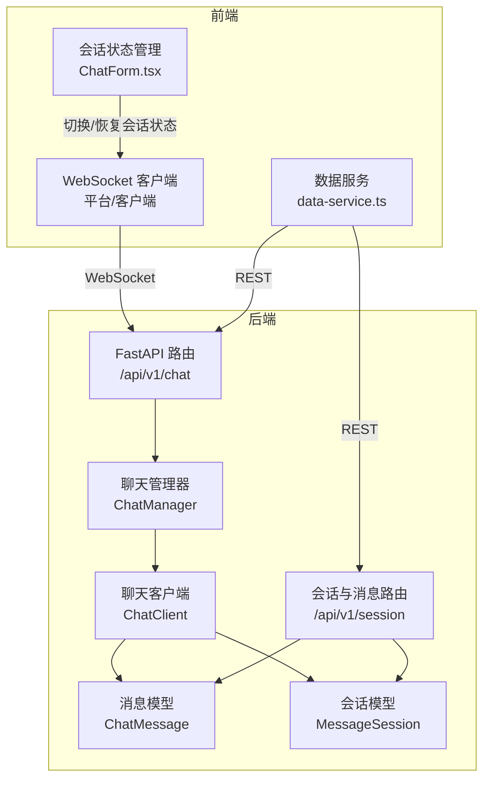
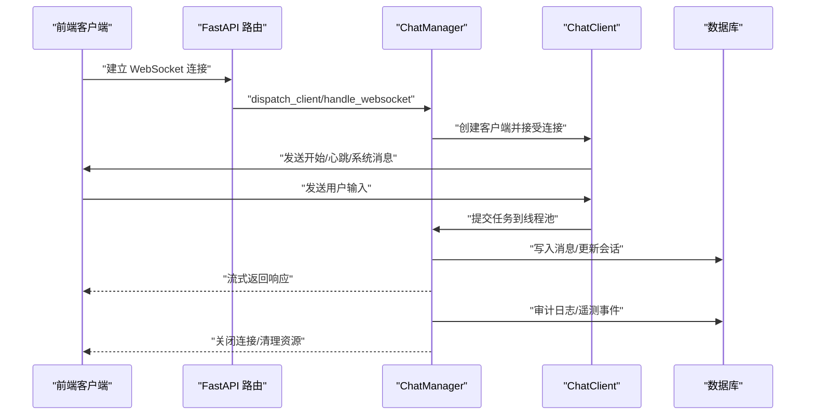
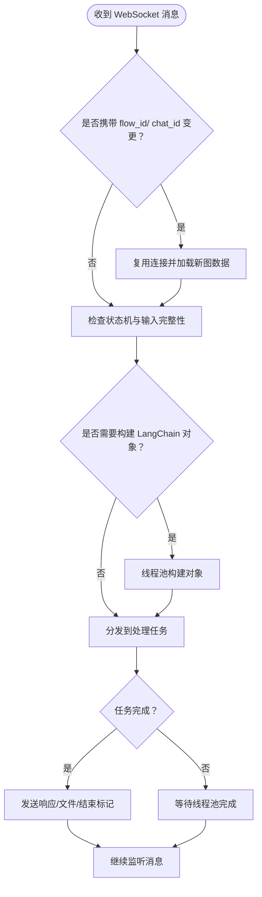
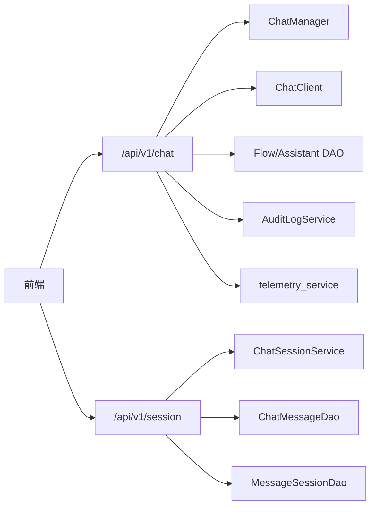

# 聊天与会话 API

<cite>
**本文引用的文件**
- [src/backend/bisheng/api/v1/chat.py](file://src/backend/bisheng/api/v1/chat.py)
- [src/backend/bisheng/api/v1/assistant.py](file://src/backend/bisheng/api/v1/assistant.py)
- [src/backend/bisheng/chat_session/api/router.py](file://src/backend/bisheng/chat_session/api/router.py)
- [src/backend/bisheng/chat_session/domain/chat.py](file://src/backend/bisheng/chat_session/domain/chat.py)
- [src/backend/bisheng/chat/manager.py](file://src/backend/bisheng/chat/manager.py)
- [src/backend/bisheng/chat/client.py](file://src/backend/bisheng/chat/client.py)
- [src/backend/bisheng/chat/types.py](file://src/backend/bisheng/chat/types.py)
- [src/backend/bisheng/api/v1/schemas.py](file://src/backend/bisheng/api/v1/schemas.py)
- [src/backend/bisheng/api/v1/schema/chat_schema.py](file://src/backend/bisheng/api/v1/schema/chat_schema.py)
- [src/backend/bisheng/database/models/message.py](file://src/backend/bisheng/database/models/message.py)
- [src/backend/bisheng/database/models/session.py](file://src/backend/bisheng/database/models/session.py)
- [src/backend/bisheng/api/v1/callback.py](file://src/backend/bisheng/api/v1/callback.py)
- [src/frontend/client/src/data-provider/data-provider/src/data-service.ts](file://src/frontend/client/src/data-provider/data-provider/src/data-service.ts)
- [src/frontend/client/src/components/Chat/Input/ChatForm.tsx](file://src/frontend/client/src/components/Chat/Input/ChatForm.tsx)
- [src/frontend/client/src/hooks/Config/useClearStates.ts](file://src/frontend/client/src/hooks/Config/useClearStates.ts)
- [src/frontend/client/src/utils/convos.ts](file://src/frontend/client/src/utils/convos.ts)
- [src/frontend/platform/src/modals/formModal/index.tsx](file://src/frontend/platform/src/modals/formModal/index.tsx)
</cite>

## 目录
1. [简介](#简介)
2. [项目结构](#项目结构)
3. [核心组件](#核心组件)
4. [架构总览](#架构总览)
5. [详细组件分析](#详细组件分析)
6. [依赖关系分析](#依赖关系分析)
7. [性能考量](#性能考量)
8. [故障排查指南](#故障排查指南)
9. [结论](#结论)
10. [附录](#附录)

## 简介
本文件为 Bisheng 聊天与会话系统的详细 API 文档，覆盖实时聊天（WebSocket）、历史会话与消息管理、多轮对话与上下文管理、消息路由与持久化、消息检索与统计等能力。文档同时提供实时通信最佳实践、错误恢复与性能优化建议，帮助开发者与运维人员快速理解并正确使用系统。

## 项目结构
后端采用 FastAPI 构建 REST API 与 WebSocket 聊天服务，前端通过 WebSocket 与后端进行实时交互，并通过 REST API 获取历史会话与消息。核心模块包括：
- 聊天与会话 API：REST 端点与 WebSocket 路由
- 会话与消息域服务：历史查询、消息统计与反馈
- 聊天管理器：WebSocket 连接、消息分发、任务调度
- 数据模型：消息与会话的数据库表结构与 DAO 方法
- 前端集成：WebSocket URL 组装、消息收发与会话状态管理

图表来源
- [src/backend/bisheng/api/v1/chat.py](file://src/backend/bisheng/api/v1/chat.py#L510-L565)
- [src/backend/bisheng/chat_session/api/router.py](file://src/backend/bisheng/chat_session/api/router.py#L20-L65)
- [src/backend/bisheng/chat/manager.py](file://src/backend/bisheng/chat/manager.py#L86-L120)
- [src/backend/bisheng/chat/client.py](file://src/backend/bisheng/chat/client.py#L33-L70)
- [src/backend/bisheng/database/models/message.py](file://src/backend/bisheng/database/models/message.py#L49-L70)
- [src/backend/bisheng/database/models/session.py](file://src/backend/bisheng/database/models/session.py#L41-L71)
- [src/frontend/client/src/data-provider/data-provider/src/data-service.ts](file://src/frontend/client/src/data-provider/data-provider/src/data-service.ts#L928-L970)
- [src/frontend/client/src/components/Chat/Input/ChatForm.tsx](file://src/frontend/client/src/components/Chat/Input/ChatForm.tsx#L275-L318)

章节来源
- [src/backend/bisheng/api/v1/chat.py](file://src/backend/bisheng/api/v1/chat.py#L1-L120)
- [src/backend/bisheng/chat_session/api/router.py](file://src/backend/bisheng/chat_session/api/router.py#L1-L66)

## 核心组件
- REST API 路由
  - 会话列表、历史查询、在线技能/助手查询、消息增删改查、点赞/复制/评论、会话重命名/复制/删除等
- WebSocket 路由
  - 技能（flow）与助手（assistant）两类 WebSocket 对话入口
- 聊天管理器
  - 维护 WebSocket 连接、消息分发、任务线程池、会话缓存与历史持久化
- 会话与消息域服务
  - 历史消息查询、消息统计与反馈上报
- 数据模型
  - ChatMessage 与 MessageSession 的字段定义、DAO 查询与更新方法

章节来源
- [src/backend/bisheng/api/v1/chat.py](file://src/backend/bisheng/api/v1/chat.py#L156-L267)
- [src/backend/bisheng/api/v1/chat.py](file://src/backend/bisheng/api/v1/chat.py#L510-L565)
- [src/backend/bisheng/chat/manager.py](file://src/backend/bisheng/chat/manager.py#L86-L120)
- [src/backend/bisheng/chat_session/domain/chat.py](file://src/backend/bisheng/chat_session/domain/chat.py#L10-L29)
- [src/backend/bisheng/database/models/message.py](file://src/backend/bisheng/database/models/message.py#L49-L70)
- [src/backend/bisheng/database/models/session.py](file://src/backend/bisheng/database/models/session.py#L41-L71)

## 架构总览
下图展示从前端发起 WebSocket 连接到后端聊天管理器处理、消息持久化与审计日志记录的整体流程。

图表来源
- [src/backend/bisheng/api/v1/chat.py](file://src/backend/bisheng/api/v1/chat.py#L510-L565)
- [src/backend/bisheng/chat/manager.py](file://src/backend/bisheng/chat/manager.py#L204-L288)
- [src/backend/bisheng/chat/client.py](file://src/backend/bisheng/chat/client.py#L68-L107)
- [src/backend/bisheng/database/models/message.py](file://src/backend/bisheng/database/models/message.py#L291-L326)
- [src/backend/bisheng/database/models/session.py](file://src/backend/bisheng/database/models/session.py#L41-L71)

## 详细组件分析

### REST API：会话与消息管理
- 会话列表与最新消息
  - GET /api/v1/chat/chat/list：按用户过滤会话，返回最新消息摘要
  - GET /api/v1/chat/chat/history：按会话与技能/助手维度查询历史消息
  - GET /api/v1/chat/chat/info：获取会话详情（含应用图标）
- 在线能力
  - GET /api/v1/chat/chat/online：获取在线技能/助手列表
- 消息管理
  - POST /api/v1/chat/chat/message：批量插入问答对（人工标注场景）
  - PUT /api/v1/chat/chat/message/{message_id}：更新消息内容
  - DELETE /api/v1/chat/chat/message/{message_id}：删除消息
  - POST /api/v1/chat/liked：点赞/取消点赞
  - POST /api/v1/chat/copied：复制统计
  - POST /api/v1/chat/comment：评论
- 会话操作
  - POST /api/v1/chat/chat/conversation/rename：重命名会话
  - POST /api/v1/chat/chat/conversation/copy：复制会话（含消息）
  - DELETE /api/v1/chat/{chat_id}：删除会话（软删除+清理向量库）

章节来源
- [src/backend/bisheng/api/v1/chat.py](file://src/backend/bisheng/api/v1/chat.py#L463-L495)
- [src/backend/bisheng/api/v1/chat.py](file://src/backend/bisheng/api/v1/chat.py#L156-L178)
- [src/backend/bisheng/api/v1/chat.py](file://src/backend/bisheng/api/v1/chat.py#L270-L369)
- [src/backend/bisheng/api/v1/chat.py](file://src/backend/bisheng/api/v1/chat.py#L372-L405)
- [src/backend/bisheng/api/v1/chat.py](file://src/backend/bisheng/api/v1/chat.py#L408-L461)
- [src/backend/bisheng/api/v1/chat.py](file://src/backend/bisheng/api/v1/chat.py#L181-L226)
- [src/backend/bisheng/api/v1/chat.py](file://src/backend/bisheng/api/v1/chat.py#L227-L267)

### WebSocket：实时聊天与消息路由
- 技能（flow）WebSocket
  - GET /api/v1/chat/chat/{flow_id}
  - 校验技能存在性与上线状态；从 Redis 或数据库加载图数据；建立连接并进入消息循环
- 助手（assistant）WebSocket
  - GET /api/v1/assistant/chat/{assistant_id}
  - 与技能路径类似，但走助手业务链路
- 消息类型与状态
  - type 字段支持 start、stream、end、error、info、file、begin、close、end_cover 等
  - category 用于区分系统/工具/处理等类别
- 上下文与多轮
  - ChatManager 维护每个 flow_id+chat_id 的上下文状态机，支持复用连接与多会话并发
  - 支持 clear_history 清空历史、action=stop 中断生成、自动文件/变量节点处理

图表来源
- [src/backend/bisheng/chat/manager.py](file://src/backend/bisheng/chat/manager.py#L448-L566)
- [src/backend/bisheng/api/v1/schemas.py](file://src/backend/bisheng/api/v1/schemas.py#L159-L177)

章节来源
- [src/backend/bisheng/api/v1/chat.py](file://src/backend/bisheng/api/v1/chat.py#L510-L565)
- [src/backend/bisheng/api/v1/assistant.py](file://src/backend/bisheng/api/v1/assistant.py#L157-L176)
- [src/backend/bisheng/api/v1/schemas.py](file://src/backend/bisheng/api/v1/schemas.py#L139-L194)
- [src/backend/bisheng/chat/manager.py](file://src/backend/bisheng/chat/manager.py#L448-L566)

### 会话与消息域服务：历史查询与统计
- 历史查询
  - GET /api/v1/session/chat/history：按会话与技能/助手查询历史，支持分页与条件过滤
- 按会话获取消息
  - GET /api/v1/session/chat/messages/{conversationId}：按会话 ID 获取消息列表
- 用户反馈与遥测
  - POST /api/v1/session/chat/message/telemetry：上报点赞/取消/复制等行为

章节来源
- [src/backend/bisheng/chat_session/api/router.py](file://src/backend/bisheng/chat_session/api/router.py#L20-L65)
- [src/backend/bisheng/chat_session/domain/chat.py](file://src/backend/bisheng/chat_session/domain/chat.py#L10-L29)

### 数据模型与持久化
- 消息模型 ChatMessage
  - 字段：is_bot、message、type、category、intermediate_steps、files、user_id、flow_id、chat_id、extra、liked、copied、敏感度等
  - DAO 提供最新消息、分页查询、批量插入、更新等
- 会话模型 MessageSession
  - 字段：chat_id、flow_id、flow_type、flow_name、user_id、like/dislike/copied 统计、敏感度等
  - DAO 提供过滤查询、分页、软删除、统计聚合等

章节来源
- [src/backend/bisheng/database/models/message.py](file://src/backend/bisheng/database/models/message.py#L20-L47)
- [src/backend/bisheng/database/models/message.py](file://src/backend/bisheng/database/models/message.py#L143-L200)
- [src/backend/bisheng/database/models/session.py](file://src/backend/bisheng/database/models/session.py#L18-L39)
- [src/backend/bisheng/database/models/session.py](file://src/backend/bisheng/database/models/session.py#L134-L200)

### 前端集成与最佳实践
- WebSocket 连接
  - 前端根据当前环境选择 ws/wss 协议，拼接 /api/v1/chat/{flow_id} 或 /api/v1/assistant/{assistant_id}，并附加令牌参数
  - 断开时进行错误提示与重连策略
- 会话状态管理
  - 切换会话时保存/恢复搜索配置、组织知识库开关等状态
  - 清理会话状态时支持跳过首个根会话
- 数据服务
  - 提供标签与会话关联、重建标签、健康检查等 REST 能力

章节来源
- [src/frontend/platform/src/modals/formModal/index.tsx](file://src/frontend/platform/src/modals/formModal/index.tsx#L194-L212)
- [src/frontend/client/src/components/Chat/Input/ChatForm.tsx](file://src/frontend/client/src/components/Chat/Input/ChatForm.tsx#L275-L318)
- [src/frontend/client/src/hooks/Config/useClearStates.ts](file://src/frontend/client/src/hooks/Config/useClearStates.ts#L1-L22)
- [src/frontend/client/src/data-provider/data-provider/src/data-service.ts](file://src/frontend/client/src/data-provider/data-provider/src/data-service.ts#L928-L970)

## 依赖关系分析
- 路由层依赖
  - /api/v1/chat 依赖 ChatManager、ChatClient、WorkFlowService、AuditLogService、telemetry_service
  - /api/v1/session 依赖 ChatSessionService、ChatMessageDao、MessageSessionDao
- 模型层依赖
  - ChatMessageDao/MessageSessionDao 依赖数据库会话管理
- 前端依赖
  - data-service.ts 依赖 endpoints（如 conversationTags、health、terms 等），并与 WebSocket URL 集成

图表来源
- [src/backend/bisheng/api/v1/chat.py](file://src/backend/bisheng/api/v1/chat.py#L1-L70)
- [src/backend/bisheng/chat_session/api/router.py](file://src/backend/bisheng/chat_session/api/router.py#L1-L17)
- [src/backend/bisheng/chat/manager.py](file://src/backend/bisheng/chat/manager.py#L1-L42)
- [src/backend/bisheng/chat/client.py](file://src/backend/bisheng/chat/client.py#L1-L31)
- [src/frontend/client/src/data-provider/data-provider/src/data-service.ts](file://src/frontend/client/src/data-provider/data-provider/src/data-service.ts#L928-L970)

章节来源
- [src/backend/bisheng/api/v1/chat.py](file://src/backend/bisheng/api/v1/chat.py#L1-L70)
- [src/backend/bisheng/chat_session/api/router.py](file://src/backend/bisheng/chat_session/api/router.py#L1-L17)

## 性能考量
- 连接与并发
  - ChatManager 使用线程池与队列处理任务，避免阻塞 WebSocket 循环
  - 支持多会话复用连接，减少重复初始化成本
- 缓存与构建
  - 通过 Redis 存储图数据与构建状态，避免重复构建
  - LangChain 对象按 flow_id+chat_id 缓存，调试模式可禁用缓存
- I/O 与数据库
  - 批量插入消息，异步写入数据库，降低延迟
  - 分页查询历史与统计聚合，避免一次性加载过多数据
- 流式输出
  - 使用 SSE/流式响应与队列机制，前端可逐步渲染输出

[本节为通用指导，无需列出具体文件来源]

## 故障排查指南
- WebSocket 异常码
  - 未授权：WS_1008_POLICY_VIOLATION
  - 内部错误：WS_1011_INTERNAL_ERROR
  - 技能不存在或未上线：在 WebSocket 建立阶段主动关闭并提示
- 常见问题定位
  - 检查 flow_id/assistant_id 是否存在且处于上线状态
  - 确认 Redis 中图数据键是否存在且状态为成功
  - 查看 ChatManager 日志中的状态机流转与异常堆栈
  - 核对前端 WebSocket URL 参数（chat_id、版本号、令牌）
- 前端断线与重连
  - 断开时记录原因并延迟重连，避免频繁抖动
  - 切换会话时保存/恢复关键状态，确保上下文一致

章节来源
- [src/backend/bisheng/api/v1/chat.py](file://src/backend/bisheng/api/v1/chat.py#L510-L565)
- [src/backend/bisheng/api/v1/assistant.py](file://src/backend/bisheng/api/v1/assistant.py#L157-L176)
- [src/backend/bisheng/chat/manager.py](file://src/backend/bisheng/chat/manager.py#L406-L424)
- [src/frontend/platform/src/modals/formModal/index.tsx](file://src/frontend/platform/src/modals/formModal/index.tsx#L182-L190)

## 结论
Bisheng 聊天与会话系统通过 REST API 与 WebSocket 实现了完整的实时对话能力，结合会话与消息域服务、完善的审计与遥测、以及前后端协同的状态管理，能够满足多轮对话、上下文管理与消息路由等复杂场景。建议在生产环境中配合缓存、线程池与流式输出策略，持续监控 WebSocket 连接质量与数据库负载，确保高并发下的稳定性与性能。

[本节为总结性内容，无需列出具体文件来源]

## 附录

### API 规范速查
- 会话与消息
  - GET /api/v1/chat/chat/list
  - GET /api/v1/chat/chat/history
  - GET /api/v1/chat/chat/info
  - POST /api/v1/chat/chat/message
  - PUT /api/v1/chat/chat/message/{message_id}
  - DELETE /api/v1/chat/chat/message/{message_id}
  - POST /api/v1/chat/liked
  - POST /api/v1/chat/copied
  - POST /api/v1/chat/comment
  - POST /api/v1/chat/chat/conversation/rename
  - POST /api/v1/chat/chat/conversation/copy
  - DELETE /api/v1/chat/{chat_id}
- 会话与消息（会话域）
  - GET /api/v1/session/chat/history
  - GET /api/v1/session/chat/messages/{conversationId}
  - POST /api/v1/session/chat/message/telemetry
- WebSocket
  - GET /api/v1/chat/chat/{flow_id}
  - GET /api/v1/assistant/chat/{assistant_id}

章节来源
- [src/backend/bisheng/api/v1/chat.py](file://src/backend/bisheng/api/v1/chat.py#L463-L495)
- [src/backend/bisheng/api/v1/chat.py](file://src/backend/bisheng/api/v1/chat.py#L156-L267)
- [src/backend/bisheng/chat_session/api/router.py](file://src/backend/bisheng/chat_session/api/router.py#L20-L65)