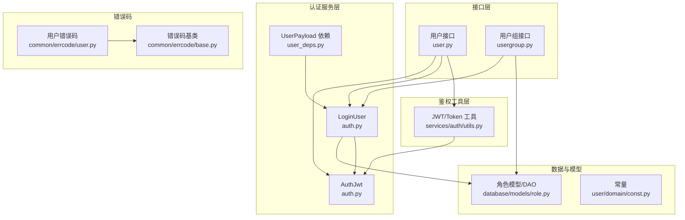
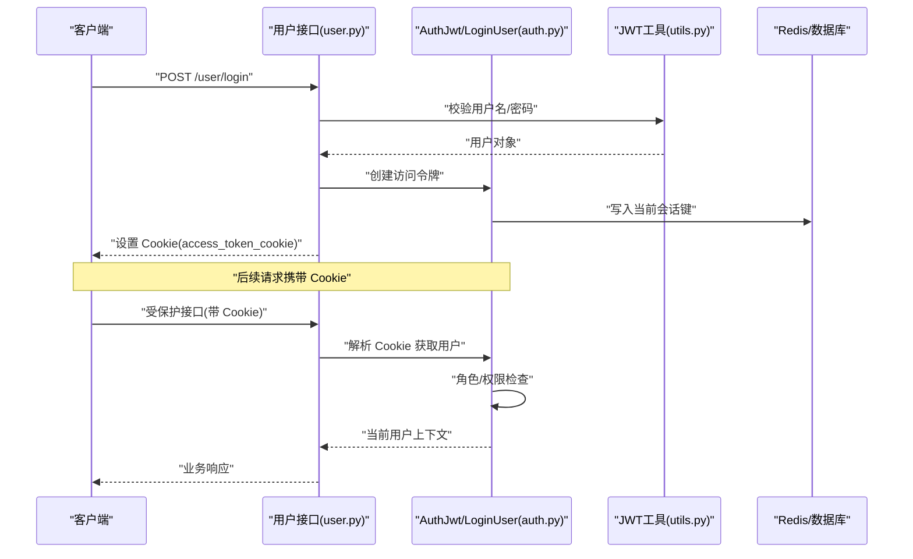
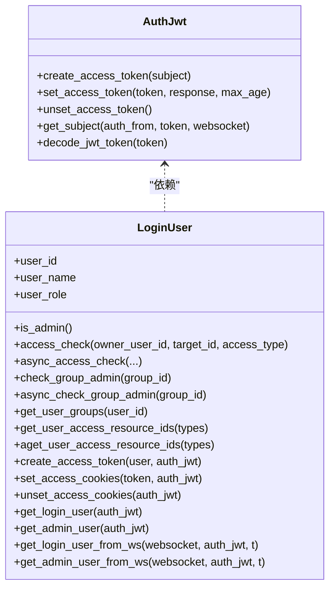
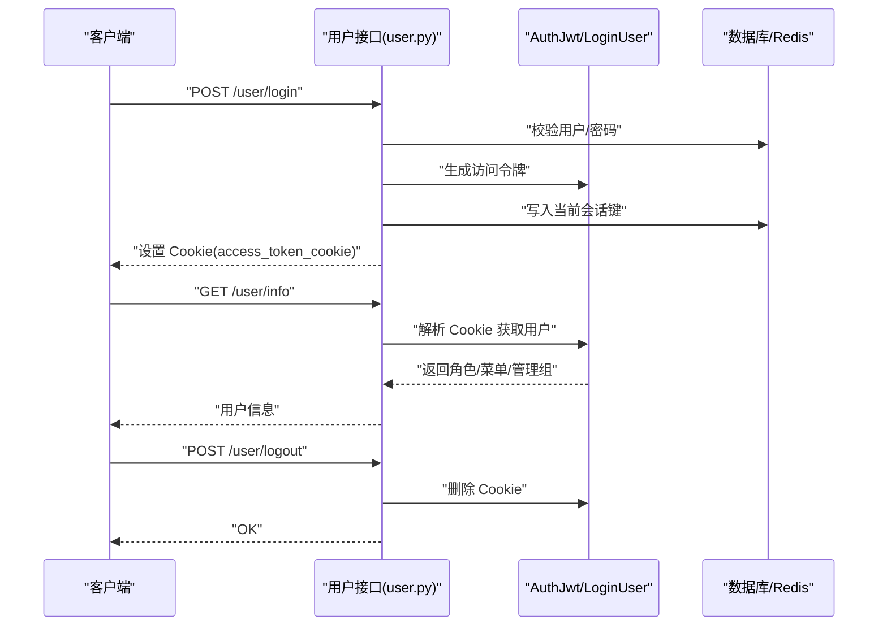
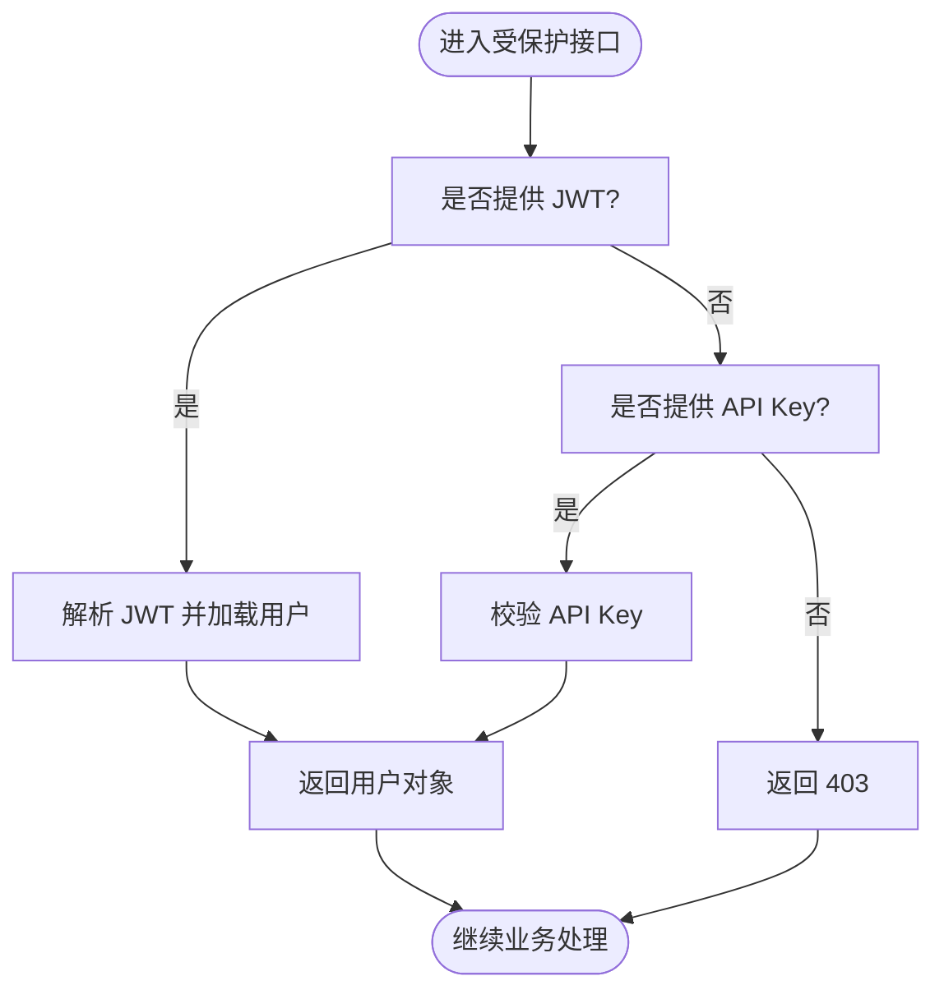
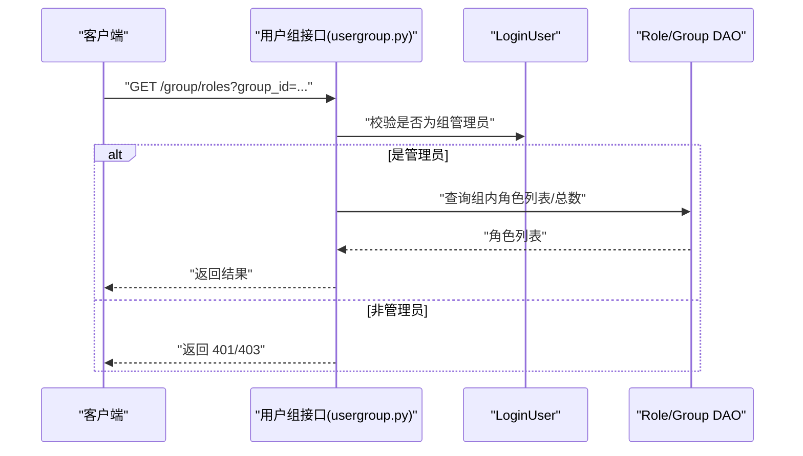
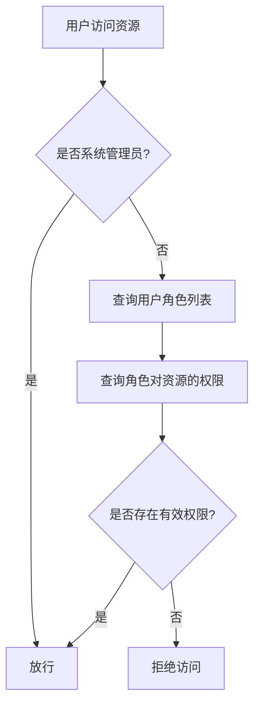
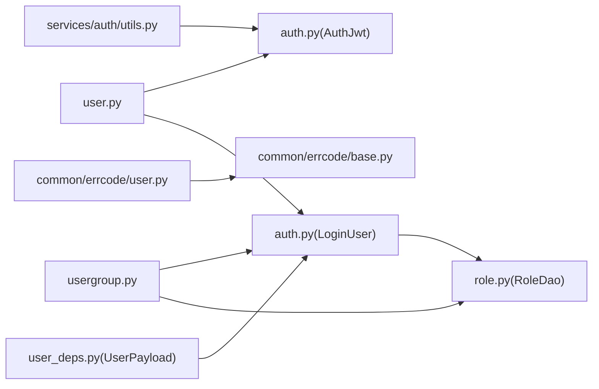

# 认证与授权 API

<cite>
**本文引用的文件**
- [src/backend/bisheng/user/api/user.py](file://src/backend/bisheng/user/api/user.py)
- [src/backend/bisheng/user/domain/services/auth.py](file://src/backend/bisheng/user/domain/services/auth.py)
- [src/backend/bisheng/services/auth/utils.py](file://src/backend/bisheng/services/auth/utils.py)
- [src/backend/bisheng/api/v1/usergroup.py](file://src/backend/bisheng/api/v1/usergroup.py)
- [src/backend/bisheng/common/dependencies/user_deps.py](file://src/backend/bisheng/common/dependencies/user_deps.py)
- [src/backend/bisheng/user/domain/const.py](file://src/backend/bisheng/user/domain/const.py)
- [src/backend/bisheng/common/errcode/user.py](file://src/backend/bisheng/common/errcode/user.py)
- [src/backend/bisheng/common/errcode/base.py](file://src/backend/bisheng/common/errcode/base.py)
- [src/backend/bisheng/database/models/role.py](file://src/backend/bisheng/database/models/role.py)
- [src/backend/bisheng/api/v1/endpoints.py](file://src/backend/bisheng/api/v1/endpoints.py)
</cite>

## 目录
1. [简介](#简介)
2. [项目结构](#项目结构)
3. [核心组件](#核心组件)
4. [架构总览](#架构总览)
5. [详细组件分析](#详细组件分析)
6. [依赖关系分析](#依赖关系分析)
7. [性能考量](#性能考量)
8. [故障排查指南](#故障排查指南)
9. [结论](#结论)
10. [附录：端点清单与示例](#附录端点清单与示例)

## 简介
本文件为 Bisheng 认证与授权系统的权威 API 文档，覆盖用户登录、注册、登出、密码变更与重置、权限验证、角色与用户组管理、资源访问控制等能力。文档同时阐述 JWT 令牌机制、Cookie 会话策略、API Key 鉴权、以及基于角色的访问控制（RBAC）模型，并提供常见集成场景与安全最佳实践。

## 项目结构
围绕认证与授权的关键模块分布如下：
- 用户接口层：用户登录、注册、信息查询、登出、密码相关操作
- 认证服务层：JWT 工具、当前用户解析、管理员校验、权限检查
- 鉴权工具层：OAuth2 密码流、API Key 校验、用户解析、刷新令牌
- 用户组与角色：用户组 CRUD、成员与管理员设置、角色列表与权限映射
- 错误码体系：统一错误码基类与用户模块错误码
- 数据模型：角色基础模型与 DAO 查询方法

图表来源
- [src/backend/bisheng/user/api/user.py](file://src/backend/bisheng/user/api/user.py#L1-L712)
- [src/backend/bisheng/user/domain/services/auth.py](file://src/backend/bisheng/user/domain/services/auth.py#L1-L338)
- [src/backend/bisheng/services/auth/utils.py](file://src/backend/bisheng/services/auth/utils.py#L1-L332)
- [src/backend/bisheng/api/v1/usergroup.py](file://src/backend/bisheng/api/v1/usergroup.py#L1-L186)
- [src/backend/bisheng/common/dependencies/user_deps.py](file://src/backend/bisheng/common/dependencies/user_deps.py#L1-L6)
- [src/backend/bisheng/user/domain/const.py](file://src/backend/bisheng/user/domain/const.py#L1-L5)
- [src/backend/bisheng/common/errcode/base.py](file://src/backend/bisheng/common/errcode/base.py#L1-L97)
- [src/backend/bisheng/common/errcode/user.py](file://src/backend/bisheng/common/errcode/user.py#L1-L73)
- [src/backend/bisheng/database/models/role.py](file://src/backend/bisheng/database/models/role.py#L1-L125)

章节来源
- [src/backend/bisheng/user/api/user.py](file://src/backend/bisheng/user/api/user.py#L1-L712)
- [src/backend/bisheng/user/domain/services/auth.py](file://src/backend/bisheng/user/domain/services/auth.py#L1-L338)
- [src/backend/bisheng/services/auth/utils.py](file://src/backend/bisheng/services/auth/utils.py#L1-L332)
- [src/backend/bisheng/api/v1/usergroup.py](file://src/backend/bisheng/api/v1/usergroup.py#L1-L186)
- [src/backend/bisheng/common/dependencies/user_deps.py](file://src/backend/bisheng/common/dependencies/user_deps.py#L1-L6)
- [src/backend/bisheng/user/domain/const.py](file://src/backend/bisheng/user/domain/const.py#L1-L5)
- [src/backend/bisheng/common/errcode/base.py](file://src/backend/bisheng/common/errcode/base.py#L1-L97)
- [src/backend/bisheng/common/errcode/user.py](file://src/backend/bisheng/common/errcode/user.py#L1-L73)
- [src/backend/bisheng/database/models/role.py](file://src/backend/bisheng/database/models/role.py#L1-L125)

## 核心组件
- AuthJwt：负责 JWT 的生成、设置 Cookie、解码与校验；支持从请求 Cookie、WebSocket 或 Authorization 头部提取令牌。
- LoginUser：封装当前登录用户上下文，提供角色缓存、管理员判定、用户组查询、资源访问权限判断、异步权限检查、WebSocket 登录解析等。
- UserPayload：接口层依赖注入使用的用户载荷类型，继承 LoginUser。
- JWT/Token 工具：提供 OAuth2 密码流、API Key 校验、JWT 解析、刷新令牌、用户解析、密码哈希与校验等。
- 用户组与角色：用户组 CRUD、成员与管理员设置、角色列表与分页查询、角色权限映射刷新与查询。
- 错误码体系：统一错误码返回格式与 HTTP 异常转换，便于前端一致处理。

章节来源
- [src/backend/bisheng/user/domain/services/auth.py](file://src/backend/bisheng/user/domain/services/auth.py#L24-L93)
- [src/backend/bisheng/user/domain/services/auth.py](file://src/backend/bisheng/user/domain/services/auth.py#L95-L338)
- [src/backend/bisheng/common/dependencies/user_deps.py](file://src/backend/bisheng/common/dependencies/user_deps.py#L4-L6)
- [src/backend/bisheng/services/auth/utils.py](file://src/backend/bisheng/services/auth/utils.py#L17-L136)
- [src/backend/bisheng/api/v1/usergroup.py](file://src/backend/bisheng/api/v1/usergroup.py#L1-L186)
- [src/backend/bisheng/common/errcode/base.py](file://src/backend/bisheng/common/errcode/base.py#L24-L37)

## 架构总览
下图展示认证与授权的整体交互：客户端通过登录接口获取 JWT 并写入 Cookie；后续请求由 AuthJwt 解析 Cookie 中的令牌；LoginUser 提供权限与角色检查；API 层使用 UserPayload 依赖注入获取当前用户并进行权限控制。

图表来源
- [src/backend/bisheng/user/api/user.py](file://src/backend/bisheng/user/api/user.py#L107-L147)
- [src/backend/bisheng/user/domain/services/auth.py](file://src/backend/bisheng/user/domain/services/auth.py#L24-L93)
- [src/backend/bisheng/services/auth/utils.py](file://src/backend/bisheng/services/auth/utils.py#L66-L136)
- [src/backend/bisheng/user/domain/const.py](file://src/backend/bisheng/user/domain/const.py#L3-L4)

## 详细组件分析

### JWT 与会话管理
- 令牌生成：AuthJwt 使用对称算法生成 JWT，包含用户标识、签发时间与过期时间。
- Cookie 写入：AuthJwt 将令牌写入名为 access_token_cookie 的 Cookie，支持路径、域、HttpOnly、SameSite 等配置。
- 令牌解析：AuthJwt 支持从请求 Cookie、WebSocket 或 Authorization 头部解析令牌；LoginUser 通过 AuthJwt 获取当前用户主体。
- 当前会话持久化：登录成功后将当前令牌写入 Redis，键名包含用户 ID，用于强制下线或会话校验。

图表来源
- [src/backend/bisheng/user/domain/services/auth.py](file://src/backend/bisheng/user/domain/services/auth.py#L24-L93)
- [src/backend/bisheng/user/domain/services/auth.py](file://src/backend/bisheng/user/domain/services/auth.py#L257-L338)

章节来源
- [src/backend/bisheng/user/domain/services/auth.py](file://src/backend/bisheng/user/domain/services/auth.py#L24-L93)
- [src/backend/bisheng/user/domain/services/auth.py](file://src/backend/bisheng/user/domain/services/auth.py#L257-L338)
- [src/backend/bisheng/user/domain/const.py](file://src/backend/bisheng/user/domain/const.py#L3-L4)

### 用户认证与会话
- 登录：支持用户名/密码登录与单点登录（SSO），登录成功后写入 Cookie 并记录审计日志与遥测事件。
- 注册：提供验证码与注册流程入口。
- 登出：清除 Cookie 中的访问令牌。
- 密码相关：支持修改密码、未登录用户重置密码、管理员重置密码等。

图表来源
- [src/backend/bisheng/user/api/user.py](file://src/backend/bisheng/user/api/user.py#L107-L147)
- [src/backend/bisheng/user/api/user.py](file://src/backend/bisheng/user/api/user.py#L131-L141)
- [src/backend/bisheng/user/api/user.py](file://src/backend/bisheng/user/api/user.py#L144-L147)

章节来源
- [src/backend/bisheng/user/api/user.py](file://src/backend/bisheng/user/api/user.py#L46-L147)

### API Key 与 OAuth2 集成
- OAuth2 密码流：通过 OAuth2PasswordBearer 指定 tokenUrl，支持从 Header 或查询参数传递令牌。
- API Key：支持通过查询参数或请求头传递 API Key，自动登录或作为替代认证方式。
- 统一用户解析：优先使用 JWT，否则回退到 API Key；两者均无效则抛出 403。

图表来源
- [src/backend/bisheng/services/auth/utils.py](file://src/backend/bisheng/services/auth/utils.py#L17-L87)

章节来源
- [src/backend/bisheng/services/auth/utils.py](file://src/backend/bisheng/services/auth/utils.py#L17-L136)

### 角色与用户组管理
- 用户组：创建、更新、删除、批量设置用户组、获取用户组成员、获取组内资源、获取组内角色列表、获取可管理资源。
- 角色：创建、更新、删除、刷新角色权限、查询角色权限列表。
- 权限检查：支持同步与异步的资源访问检查，支持复制权限检查与用户组管理员判定。

图表来源
- [src/backend/bisheng/api/v1/usergroup.py](file://src/backend/bisheng/api/v1/usergroup.py#L152-L172)
- [src/backend/bisheng/user/domain/services/auth.py](file://src/backend/bisheng/user/domain/services/auth.py#L184-L221)
- [src/backend/bisheng/database/models/role.py](file://src/backend/bisheng/database/models/role.py#L44-L76)

章节来源
- [src/backend/bisheng/api/v1/usergroup.py](file://src/backend/bisheng/api/v1/usergroup.py#L1-L186)
- [src/backend/bisheng/user/domain/services/auth.py](file://src/backend/bisheng/user/domain/services/auth.py#L184-L221)
- [src/backend/bisheng/database/models/role.py](file://src/backend/bisheng/database/models/role.py#L44-L125)

### 权限验证与 RBAC
- 资源访问控制：LoginUser 提供 access_check 与 async_access_check，结合角色权限表 RoleAccessDao 判断用户对目标资源的访问权限。
- 管理员优先：若用户为系统管理员，则跳过具体权限检查直接放行。
- 菜单与角色：根据用户角色与用户组管理员身份计算前端可用菜单。

图表来源
- [src/backend/bisheng/user/domain/services/auth.py](file://src/backend/bisheng/user/domain/services/auth.py#L154-L172)
- [src/backend/bisheng/user/domain/services/auth.py](file://src/backend/bisheng/user/domain/services/auth.py#L314-L337)

章节来源
- [src/backend/bisheng/user/domain/services/auth.py](file://src/backend/bisheng/user/domain/services/auth.py#L154-L172)
- [src/backend/bisheng/user/domain/services/auth.py](file://src/backend/bisheng/user/domain/services/auth.py#L314-L337)

## 依赖关系分析
- 接口层依赖认证服务层：用户接口通过 AuthJwt 生成/解析令牌，通过 LoginUser 进行权限检查。
- 依赖注入：UserPayload 继承 LoginUser，接口层以 Depends(UserPayload.get_login_user) 获取当前用户。
- 错误码：统一由 BaseErrorCode 返回，用户模块错误码继承该基类。
- 数据模型：角色 DAO 提供角色列表、计数、删除等操作，配合权限检查使用。

图表来源
- [src/backend/bisheng/user/api/user.py](file://src/backend/bisheng/user/api/user.py#L1-L712)
- [src/backend/bisheng/user/domain/services/auth.py](file://src/backend/bisheng/user/domain/services/auth.py#L1-L338)
- [src/backend/bisheng/api/v1/usergroup.py](file://src/backend/bisheng/api/v1/usergroup.py#L1-L186)
- [src/backend/bisheng/database/models/role.py](file://src/backend/bisheng/database/models/role.py#L1-L125)
- [src/backend/bisheng/common/dependencies/user_deps.py](file://src/backend/bisheng/common/dependencies/user_deps.py#L1-L6)
- [src/backend/bisheng/common/errcode/base.py](file://src/backend/bisheng/common/errcode/base.py#L1-L97)
- [src/backend/bisheng/common/errcode/user.py](file://src/backend/bisheng/common/errcode/user.py#L1-L73)

章节来源
- [src/backend/bisheng/user/api/user.py](file://src/backend/bisheng/user/api/user.py#L1-L712)
- [src/backend/bisheng/user/domain/services/auth.py](file://src/backend/bisheng/user/domain/services/auth.py#L1-L338)
- [src/backend/bisheng/api/v1/usergroup.py](file://src/backend/bisheng/api/v1/usergroup.py#L1-L186)
- [src/backend/bisheng/database/models/role.py](file://src/backend/bisheng/database/models/role.py#L1-L125)
- [src/backend/bisheng/common/dependencies/user_deps.py](file://src/backend/bisheng/common/dependencies/user_deps.py#L1-L6)
- [src/backend/bisheng/common/errcode/base.py](file://src/backend/bisheng/common/errcode/base.py#L1-L97)
- [src/backend/bisheng/common/errcode/user.py](file://src/backend/bisheng/common/errcode/user.py#L1-L73)

## 性能考量
- 令牌过期与刷新：建议在前端实现令牌过期检测与静默刷新逻辑，避免频繁重新登录。
- 缓存与角色查询：LoginUser 对用户组与角色采用缓存策略，减少重复查询；在高并发场景建议结合 Redis 缓存优化。
- 权限检查：尽量批量查询角色与权限，减少多次数据库往返。
- 会话持久化：当前会话键写入 Redis，建议设置合理的过期时间与清理策略，防止内存膨胀。

## 故障排查指南
- 常见错误码
  - 用户模块错误码：如账户或密码错误、密码过期、未设置密码、验证码错误、用户被禁用、密码尝试次数过多、用户组为空、管理员信息不可修改等。
  - 统一错误码基类：提供统一的错误响应结构与 HTTP 异常转换。
- 登录失败定位
  - 检查 Cookie 是否正确设置与携带；确认 AuthJwt 的签名密钥与签发者配置一致。
  - 若使用 API Key，请确认 API Key 是否有效且未过期。
  - 关注 Redis 中当前会话键是否存在与过期时间。
- 权限不足
  - 确认当前用户是否为系统管理员；非管理员需满足角色权限与用户组管理员条件。
  - 检查角色权限映射是否正确刷新。

章节来源
- [src/backend/bisheng/common/errcode/user.py](file://src/backend/bisheng/common/errcode/user.py#L1-L73)
- [src/backend/bisheng/common/errcode/base.py](file://src/backend/bisheng/common/errcode/base.py#L24-L37)
- [src/backend/bisheng/user/domain/const.py](file://src/backend/bisheng/user/domain/const.py#L1-L5)

## 结论
Bisheng 的认证与授权体系以 JWT 为核心，结合 Cookie 会话、API Key 与 RBAC 模型，提供了完整的用户生命周期与权限控制能力。通过 LoginUser 与 AuthJwt 的清晰职责划分，接口层可以便捷地进行权限校验与用户上下文获取。建议在生产环境中强化令牌安全配置、完善会话与权限缓存策略，并持续监控与优化权限检查路径。

## 附录：端点清单与示例

### 用户认证与会话
- 登录
  - 方法与路径：POST /user/login
  - 请求体：用户名与密码
  - 响应：设置 Cookie(access_token_cookie)，返回访问令牌
  - 安全要点：启用 HttpOnly、Secure、SameSite；合理设置过期时间
- 单点登录（SSO）
  - 方法与路径：POST /user/sso
  - 请求体：用户名
  - 响应：设置 Cookie，返回访问令牌
- 注册
  - 方法与路径：POST /user/regist
  - 请求体：用户注册信息
  - 响应：注册成功
- 登出
  - 方法与路径：POST /user/logout
  - 响应：清除 Cookie
- 获取用户信息
  - 方法与路径：GET /user/info
  - 响应：用户基本信息、角色、菜单、管理组
- 修改密码
  - 方法与路径：POST /user/change_password
  - 请求体：旧密码、新密码
  - 响应：成功
- 未登录用户重置密码
  - 方法与路径：POST /user/change_password_public
  - 请求体：用户名、原密码、新密码
  - 响应：成功
- 管理员重置用户密码
  - 方法与路径：POST /user/reset_password
  - 请求体：用户ID、新密码
  - 响应：成功

章节来源
- [src/backend/bisheng/user/api/user.py](file://src/backend/bisheng/user/api/user.py#L46-L147)
- [src/backend/bisheng/user/api/user.py](file://src/backend/bisheng/user/api/user.py#L131-L147)
- [src/backend/bisheng/user/api/user.py](file://src/backend/bisheng/user/api/user.py#L628-L675)
- [src/backend/bisheng/user/api/user.py](file://src/backend/bisheng/user/api/user.py#L589-L625)

### 用户组与角色管理
- 获取所有用户组
  - 方法与路径：GET /group/list
  - 响应：用户组列表
- 创建用户组
  - 方法与路径：POST /group/create
  - 请求体：用户组创建信息
  - 响应：创建结果
- 更新用户组
  - 方法与路径：PUT /group/create
  - 请求体：用户组更新信息
  - 响应：更新结果
- 删除用户组
  - 方法与路径：DELETE /group/create
  - 查询参数：group_id
  - 响应：删除结果
- 批量设置用户所属用户组
  - 方法与路径：POST /group/set_user_group
  - 请求体：user_id、group_id[]
  - 响应：设置结果
- 获取用户所属用户组
  - 方法与路径：GET /group/get_user_group
  - 查询参数：user_id
  - 响应：用户组列表
- 获取用户组成员
  - 方法与路径：GET /group/get_group_user
  - 查询参数：group_id、page_size、page_num
  - 响应：成员列表
- 设置用户组管理员
  - 方法与路径：POST /group/set_group_admin
  - 请求体：user_ids[]、group_id
  - 响应：设置结果
- 刷新用户组最后更新人
  - 方法与路径：POST /group/set_update_user
  - 请求体：group_id
  - 响应：更新结果
- 获取用户组资源
  - 方法与路径：GET /group/get_group_resources
  - 查询参数：group_id、resource_type、name、page_size、page_num
  - 响应：资源列表与总数
- 获取用户组内角色
  - 方法与路径：GET /group/roles
  - 查询参数：group_id[]、keyword、page、limit
  - 响应：角色列表与总数
- 获取可管理资源
  - 方法与路径：GET /group/manage/resources
  - 查询参数：keyword、page、page_size
  - 响应：资源列表与总数

章节来源
- [src/backend/bisheng/api/v1/usergroup.py](file://src/backend/bisheng/api/v1/usergroup.py#L1-L186)

### 角色与权限
- 创建角色
  - 方法与路径：POST /role/add
  - 请求体：角色创建信息
  - 响应：创建结果
- 更新角色
  - 方法与路径：PATCH /role/{role_id}
  - 请求体：角色更新信息
  - 响应：更新结果
- 删除角色
  - 方法与路径：DELETE /role/{role_id}
  - 响应：删除结果
- 刷新角色权限
  - 方法与路径：POST /role_access/refresh
  - 请求体：role_id、type、access_id
  - 响应：刷新结果
- 查询角色权限
  - 方法与路径：GET /role_access/list
  - 查询参数：role_id、type
  - 响应：权限列表与总数
- 查询角色列表
  - 方法与路径：GET /role/list
  - 查询参数：role_name、page、limit
  - 响应：角色列表与总数

章节来源
- [src/backend/bisheng/user/api/user.py](file://src/backend/bisheng/user/api/user.py#L312-L428)
- [src/backend/bisheng/user/api/user.py](file://src/backend/bisheng/user/api/user.py#L503-L541)
- [src/backend/bisheng/database/models/role.py](file://src/backend/bisheng/database/models/role.py#L44-L125)

### 公共与配置
- 获取环境配置
  - 方法与路径：GET /env
  - 响应：环境变量与功能开关
- 获取前端配置
  - 方法与路径：GET /config
  - 响应：系统配置
- 更新前端配置
  - 方法与路径：POST /web/config
  - 请求体：value
  - 响应：更新后的配置

章节来源
- [src/backend/bisheng/api/v1/endpoints.py](file://src/backend/bisheng/api/v1/endpoints.py#L71-L154)