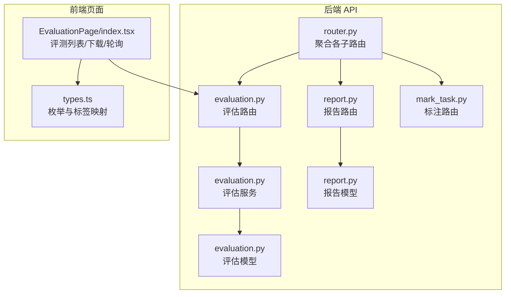
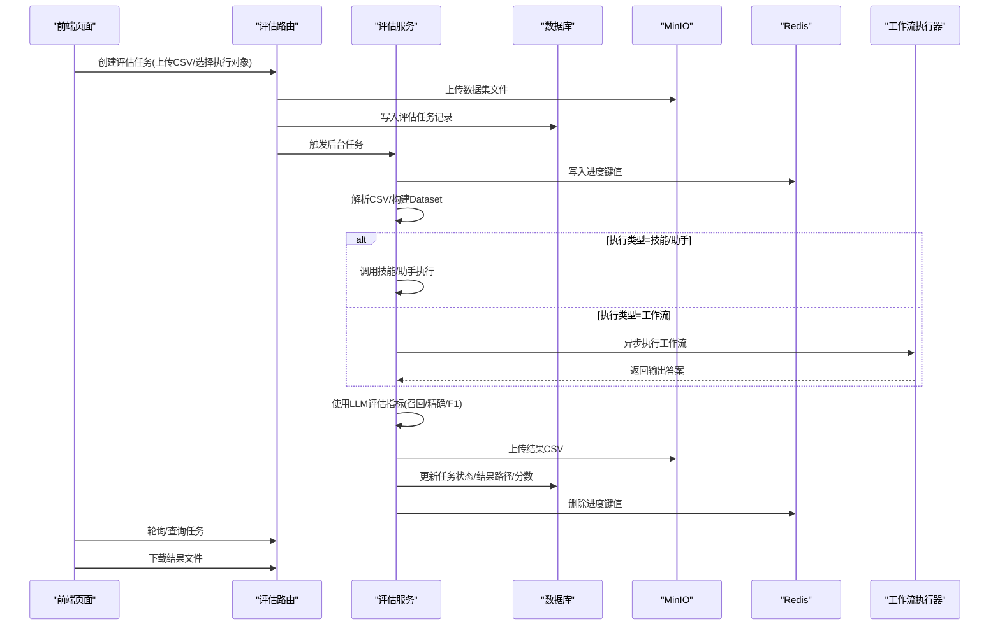
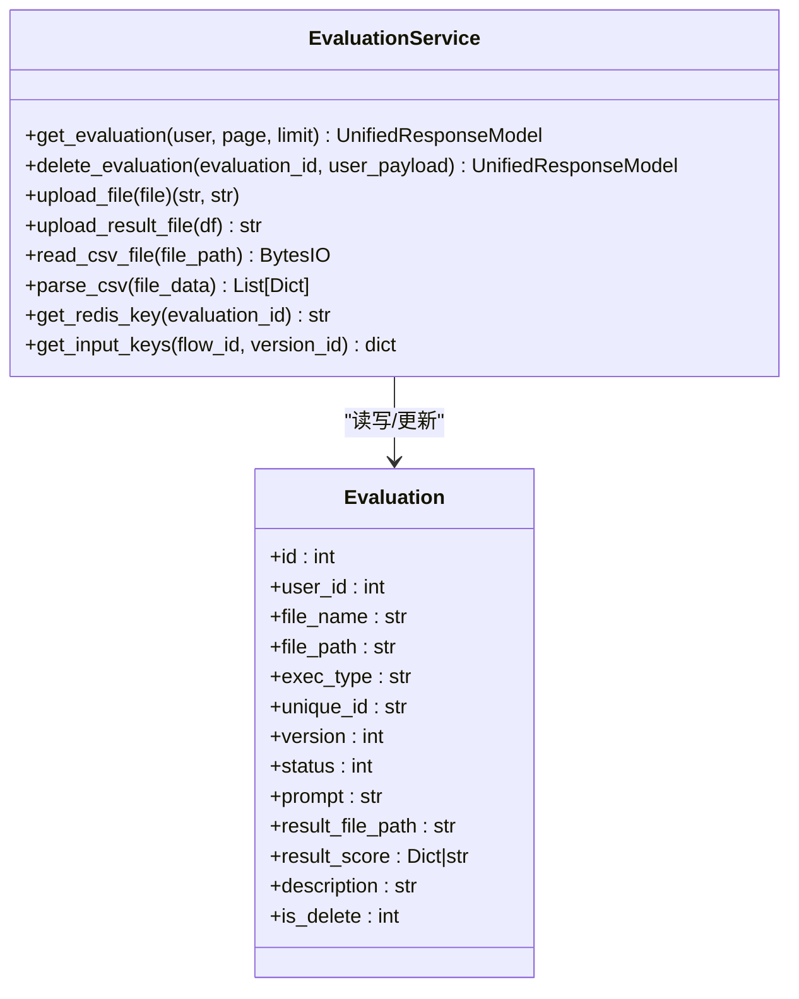
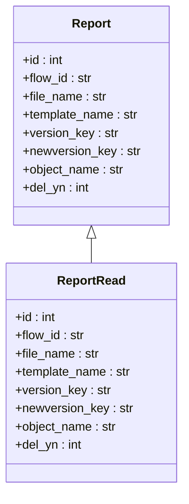
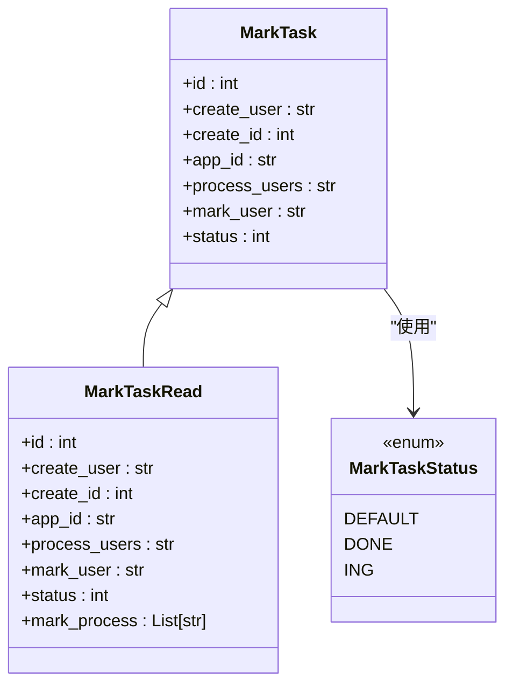
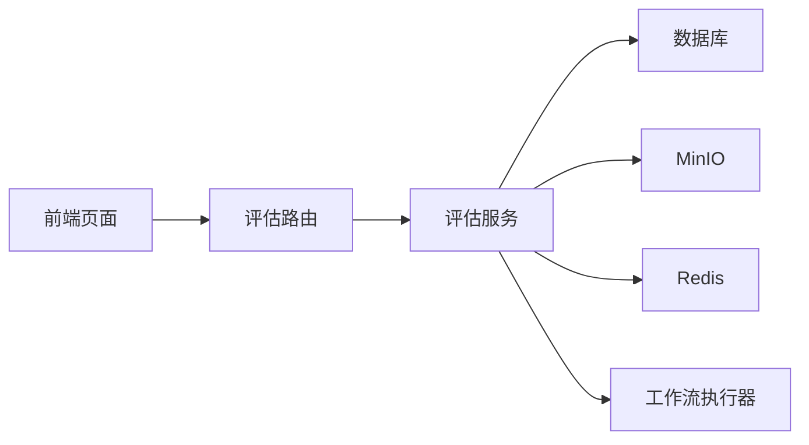

# 评估与报告 API

<cite>
**本文引用的文件**
- [evaluation.py](file://src/backend/bisheng/api/v1/evaluation.py)
- [report.py](file://src/backend/bisheng/api/v1/report.py)
- [mark_task.py](file://src/backend/bisheng/api/v1/mark_task.py)
- [evaluation.py](file://src/backend/bisheng/api/services/evaluation.py)
- [evaluation.py](file://src/backend/bisheng/database/models/evaluation.py)
- [report.py](file://src/backend/bisheng/database/models/report.py)
- [schemas.py](file://src/backend/bisheng/api/v1/schemas.py)
- [router.py](file://src/backend/bisheng/api/router.py)
- [workflow.py](file://src/backend/bisheng/workflow/common/workflow.py)
- [tasks.py](file://src/backend/bisheng/worker/workflow/tasks.py)
- [redis_callback.py](file://src/backend/bisheng/worker/workflow/redis_callback.py)
- [index.tsx](file://src/frontend/platform/src/pages/EvaluationPage/index.tsx)
- [types.ts](file://src/frontend/platform/src/pages/EvaluationPage/types.ts)
</cite>

## 目录
1. [简介](#简介)
2. [项目结构](#项目结构)
3. [核心组件](#核心组件)
4. [架构总览](#架构总览)
5. [详细组件分析](#详细组件分析)
6. [依赖关系分析](#依赖关系分析)
7. [性能考量](#性能考量)
8. [故障排查指南](#故障排查指南)
9. [结论](#结论)
10. [附录](#附录)

## 简介
本文件面向 Bisheng 的“评估与报告系统”，系统性梳理并文档化以下能力：
- 评估任务创建与管理：支持上传评测数据集、选择执行对象（技能/助手/工作流）、触发评估任务、查看进度与结果下载。
- 指标计算与报告生成：基于评测数据集对回答进行质量评估，输出包含召回率、精确率、F1 等指标的明细与汇总，并生成 CSV 结果文件。
- 报告模板与导出：提供报告模板版本控制与回调机制，支持模板预览与最终报告落盘。
- 数据标注与质量评估：提供标注任务的创建、分配、状态标记与流转，辅助人工校验与质量评估。
- 统计与趋势：前端轮询展示任务进度与结果，便于趋势观察与对比分析。
- 自动化流程：通过后台任务异步执行评估，结合 Redis 进度缓存与 MinIO 存储，实现高并发与可扩展的评测流水线。

## 项目结构
后端采用 FastAPI 路由聚合方式，评估与报告相关模块集中在 v1 路由下，通过统一响应模型返回数据。

图表来源
- [router.py](file://src/backend/bisheng/api/router.py#L23-L61)
- [evaluation.py](file://src/backend/bisheng/api/v1/evaluation.py#L1-L104)
- [evaluation.py](file://src/backend/bisheng/api/services/evaluation.py#L44-L116)
- [evaluation.py](file://src/backend/bisheng/database/models/evaluation.py#L12-L46)
- [report.py](file://src/backend/bisheng/api/v1/report.py#L1-L80)
- [report.py](file://src/backend/bisheng/database/models/report.py#L10-L29)
- [mark_task.py](file://src/backend/bisheng/api/v1/mark_task.py#L1-L261)
- [index.tsx](file://src/frontend/platform/src/pages/EvaluationPage/index.tsx#L1-L212)
- [types.ts](file://src/frontend/platform/src/pages/EvaluationPage/types.ts#L1-L57)

章节来源
- [router.py](file://src/backend/bisheng/api/router.py#L23-L61)

## 核心组件
- 评估路由与服务
  - 评估路由：提供查询、创建、删除、手动触发、结果下载等端点。
  - 评估服务：负责 CSV 解析、MinIO 文件上传、评测执行、指标计算、结果落盘与进度缓存。
  - 评估模型：定义执行类型、任务状态、数据库字段与 DAO 查询方法。
- 报告路由与模型
  - 报告路由：提供模板版本控制、回调写入与下载地址生成。
  - 报告模型：记录模板与报告的版本键、对象名与删除状态。
- 标注路由与模型
  - 标注路由：提供任务列表、状态查询、任务创建、用户查询、打标、记录查询、前后条目跳转、删除等端点。
  - 标注模型：定义任务状态、任务与记录表结构及 DAO 方法。
- 前端集成
  - 评测页面：轮询任务状态与结果，支持下载 CSV 结果文件。

章节来源
- [evaluation.py](file://src/backend/bisheng/api/v1/evaluation.py#L1-L104)
- [evaluation.py](file://src/backend/bisheng/api/services/evaluation.py#L44-L116)
- [evaluation.py](file://src/backend/bisheng/database/models/evaluation.py#L12-L46)
- [report.py](file://src/backend/bisheng/api/v1/report.py#L1-L80)
- [report.py](file://src/backend/bisheng/database/models/report.py#L10-L29)
- [mark_task.py](file://src/backend/bisheng/api/v1/mark_task.py#L1-L261)
- [index.tsx](file://src/frontend/platform/src/pages/EvaluationPage/index.tsx#L41-L212)

## 架构总览
评估与报告系统围绕“数据集上传—评测执行—指标计算—结果落盘—前端展示”的闭环展开，关键链路如下：

图表来源
- [evaluation.py](file://src/backend/bisheng/api/v1/evaluation.py#L28-L78)
- [evaluation.py](file://src/backend/bisheng/api/services/evaluation.py#L303-L426)
- [workflow.py](file://src/backend/bisheng/workflow/common/workflow.py#L4-L10)
- [tasks.py](file://src/backend/bisheng/worker/workflow/tasks.py#L85-L157)
- [redis_callback.py](file://src/backend/bisheng/worker/workflow/redis_callback.py#L203-L268)

## 详细组件分析

### 评估 API
- 端点概览
  - GET /evaluation：分页查询评估任务列表，返回任务基本信息、名称、版本、进度、结果分数与错误描述。
  - POST /evaluation：创建评估任务，支持上传 CSV 数据集、指定执行对象类型与唯一标识、版本号、评估提示词，后台异步执行。
  - DELETE /evaluation/{evaluation_id}：逻辑删除评估任务。
  - GET /evaluation/result/file/download：根据文件 URL 获取 MinIO 分享链接。
  - POST /evaluation/{evaluation_id}/process：手动触发某任务的评测执行。
- 关键参数
  - 文件：CSV，要求至少两列且首列为 question、第二列为 ground_truth。
  - exec_type：执行对象类型，支持 flow/assistant/workflow。
  - unique_id：执行对象唯一标识。
  - version：版本 ID（可选）。
  - prompt：评估指令文本。
- 处理流程
  - 文件解析与校验，构建 Dataset。
  - 根据 exec_type 选择执行路径：技能/助手或工作流。
  - 使用 LLM 评估指标（召回、精确、F1），汇总生成 CSV 并上传至 MinIO。
  - 更新任务状态、结果路径与总分。
- 前端交互
  - 页面每 6 秒轮询刷新，展示任务进度与结果，支持下载 CSV。

章节来源
- [evaluation.py](file://src/backend/bisheng/api/v1/evaluation.py#L19-L104)
- [evaluation.py](file://src/backend/bisheng/api/services/evaluation.py#L178-L187)
- [evaluation.py](file://src/backend/bisheng/api/services/evaluation.py#L303-L426)
- [index.tsx](file://src/frontend/platform/src/pages/EvaluationPage/index.tsx#L58-L64)

#### 评估服务类图

图表来源
- [evaluation.py](file://src/backend/bisheng/api/services/evaluation.py#L44-L116)
- [evaluation.py](file://src/backend/bisheng/database/models/evaluation.py#L24-L46)

### 报告 API
- 端点概览
  - POST /report/callback：接收外部 Office 导出回调，保存报告到 MinIO 并更新数据库记录。
  - GET /report/report_temp：获取模板版本信息，若无则生成新版本键；若已有对象名则返回分享链接。
- 关键参数
  - flow_id：技能/应用标识。
  - status/url/key：回调参数，用于定位与保存报告对象。
- 处理流程
  - 回调中根据 key 查找对应报告记录，下载远程文件并上传至 MinIO，更新对象名与版本键。
  - 模板接口返回当前模板的分享链接与版本键，支持前端预览与二次编辑。

章节来源
- [report.py](file://src/backend/bisheng/api/v1/report.py#L18-L80)
- [report.py](file://src/backend/bisheng/database/models/report.py#L10-L29)

#### 报告模型类图

图表来源
- [report.py](file://src/backend/bisheng/database/models/report.py#L27-L34)

### 标注 API
- 端点概览
  - GET /mark/list：分页列出标注任务，支持按状态过滤；管理员可见全部，普通用户仅见自己创建或参与的任务。
  - GET /mark/get_status：查询某会话在任务中的打标状态。
  - POST /mark/create_task：创建标注任务，关联应用与处理用户。
  - GET /mark/get_user：查询任务下的所有用户。
  - POST /mark/mark：对某会话进行打标或取消打标；当打标完成时自动更新任务状态。
  - GET /mark/get_record：查询某会话的打标记录。
  - GET /mark/next：根据当前会话获取上一条或下一条未打标会话。
  - DELETE /mark/del：删除标注任务及其记录。
- 关键参数
  - task_id：任务 ID。
  - session_id：会话 ID。
  - status：打标状态（默认/进行中/完成）。
  - app_list/user_list：应用与用户的关联列表。
- 处理流程
  - 标注记录写入或更新，比较已打标会话集合与全部会话集合，决定任务状态变更。

章节来源
- [mark_task.py](file://src/backend/bisheng/api/v1/mark_task.py#L22-L261)
- [mark_task.py](file://src/backend/bisheng/database/models/mark_task.py#L13-L39)

#### 标注模型类图

图表来源
- [mark_task.py](file://src/backend/bisheng/database/models/mark_task.py#L32-L39)
- [mark_task.py](file://src/backend/bisheng/database/models/mark_task.py#L13-L17)

### 工作流执行与回调
- 工作流状态
  - WAITING/RUNNING/SUCCESS/FAILED/INPUT/INPUT_OVER：工作流运行状态机。
- 任务执行
  - execute_workflow/continue_workflow：Celery 任务封装，记录 Telemetry 事件。
- Redis 回调
  - RedisCallback：监听工作流事件，超时与异常处理，失败时设置状态并停止。

章节来源
- [workflow.py](file://src/backend/bisheng/workflow/common/workflow.py#L4-L10)
- [tasks.py](file://src/backend/bisheng/worker/workflow/tasks.py#L85-L157)
- [redis_callback.py](file://src/backend/bisheng/worker/workflow/redis_callback.py#L203-L268)

## 依赖关系分析
- 路由聚合
  - 主路由将评估、报告、标注等子路由纳入统一前缀，便于前端统一调用。
- 服务层耦合
  - 评估服务依赖 MinIO、Redis、数据库、工作流执行器与 LLM 评估工具，形成评测执行闭环。
- 前后端交互
  - 前端页面通过轮询与按钮操作驱动后端评估任务生命周期。

图表来源
- [router.py](file://src/backend/bisheng/api/router.py#L23-L61)
- [evaluation.py](file://src/backend/bisheng/api/v1/evaluation.py#L16-L104)
- [evaluation.py](file://src/backend/bisheng/api/services/evaluation.py#L303-L426)

## 性能考量
- 异步执行与队列
  - 评测任务通过后台任务异步执行，避免阻塞请求线程。
- 进度缓存
  - 使用 Redis 缓存任务进度百分比，前端轮询开销低。
- 文件存储
  - 数据集与结果文件统一存储于 MinIO，支持高并发访问与分享链接生成。
- 指标计算
  - 使用批处理与向量化计算（Dataset/Pandas），减少单条样本处理开销。
- 工作流执行
  - 工作流执行器采用 Celery 异步调度，配合回调监听与超时保护，提升稳定性。

## 故障排查指南
- 评估任务失败
  - 检查 CSV 格式是否满足要求（至少两列且首列为 question、第二列为 ground_truth）。
  - 查看任务描述字段，定位具体异常原因。
  - 确认执行对象是否存在且版本正确。
- 工作流执行异常
  - 关注工作流状态机与回调日志，确认是否因资源繁忙或长时间无状态更新导致失败。
- 报告回调未生效
  - 核对回调参数 key 是否与数据库记录匹配，检查 MinIO 对象名是否成功写入。
- 前端无法下载结果
  - 确认结果文件路径有效，MinIO 分享链接生成正常。

章节来源
- [evaluation.py](file://src/backend/bisheng/api/services/evaluation.py#L420-L426)
- [redis_callback.py](file://src/backend/bisheng/worker/workflow/redis_callback.py#L203-L268)
- [report.py](file://src/backend/bisheng/api/v1/report.py#L24-L47)

## 结论
该评估与报告系统以“数据集—评测—指标—报告—前端展示”为主线，通过异步任务、进度缓存与对象存储实现了高可用与可扩展的评测流水线。评估 API 支持多执行对象与多种指标，报告 API 提供模板版本控制与回调落盘，标注 API 则为人工质量把关提供了完整工具链。建议在生产环境中结合监控与告警，持续优化评测性能与稳定性。

## 附录

### API 定义与示例（路径）
- 评估
  - GET /api/v1/evaluation
    - 查询参数：page、limit
    - 返回：任务列表与总数
  - POST /api/v1/evaluation
    - 表单参数：file、prompt、exec_type、unique_id、version、background_tasks
    - 返回：新建任务详情
  - DELETE /api/v1/evaluation/{evaluation_id}
    - 返回：成功
  - GET /api/v1/evaluation/result/file/download
    - 查询参数：file_url
    - 返回：下载链接
  - POST /api/v1/evaluation/{evaluation_id}/process
    - 返回：成功
- 报告
  - POST /api/v1/report/callback
    - 请求体：status、url、key
    - 返回：成功
  - GET /api/v1/report/report_temp
    - 查询参数：flow_id
    - 返回：模板链接与版本键
- 标注
  - GET /api/v1/mark/list
    - 查询参数：status、page_size、page_num
    - 返回：任务列表与总数
  - GET /api/v1/mark/get_status
    - 查询参数：task_id、chat_id
    - 返回：状态与是否本人
  - POST /api/v1/mark/create_task
    - 请求体：app_list、user_list
    - 返回：ok
  - GET /api/v1/mark/get_user
    - 查询参数：task_id
    - 返回：用户列表
  - POST /api/v1/mark/mark
    - 请求体：task_id、session_id、status、flow_type
    - 返回：ok
  - GET /api/v1/mark/get_record
    - 查询参数：chat_id、task_id
    - 返回：记录详情
  - GET /api/v1/mark/next
    - 查询参数：chat_id、action、task_id
    - 返回：下一跳会话信息
  - DELETE /api/v1/mark/del
    - 查询参数：task_id
    - 返回：ok

章节来源
- [evaluation.py](file://src/backend/bisheng/api/v1/evaluation.py#L19-L104)
- [report.py](file://src/backend/bisheng/api/v1/report.py#L18-L80)
- [mark_task.py](file://src/backend/bisheng/api/v1/mark_task.py#L22-L261)

### 数据模型与字段说明
- 评估模型
  - 字段：user_id、file_name、file_path、exec_type、unique_id、version、status、prompt、result_file_path、result_score、description、is_delete、create_time、update_time
  - 枚举：ExecType（flow/assistant/workflow）、EvaluationTaskStatus（running/failed/success）
- 报告模型
  - 字段：flow_id、file_name、template_name、version_key、newversion_key、object_name、del_yn、create_time、update_time
- 标注模型
  - 字段：create_user、create_id、app_id、process_users、mark_user、status
  - 枚举：MarkTaskStatus（DEFAULT/DONE/ING）

章节来源
- [evaluation.py](file://src/backend/bisheng/database/models/evaluation.py#L12-L46)
- [report.py](file://src/backend/bisheng/database/models/report.py#L10-L29)
- [mark_task.py](file://src/backend/bisheng/database/models/mark_task.py#L13-L39)

### 前端集成要点
- 轮询策略：每 6 秒刷新一次，避免频繁请求。
- 结果下载：点击下载按钮时调用结果文件下载接口，拼接分享链接并触发浏览器下载。
- 标签映射：使用前端类型与分数标签映射，提升国际化与可读性。

章节来源
- [index.tsx](file://src/frontend/platform/src/pages/EvaluationPage/index.tsx#L58-L64)
- [types.ts](file://src/frontend/platform/src/pages/EvaluationPage/types.ts#L1-L57)