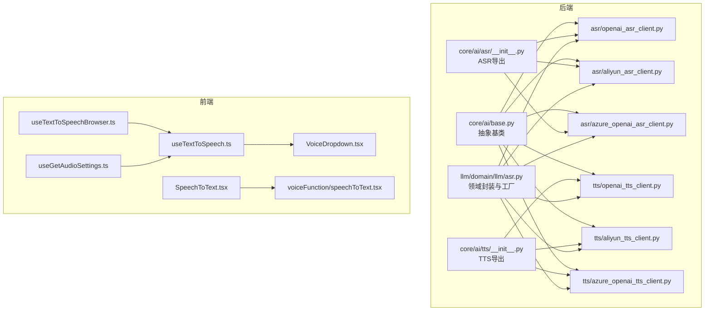
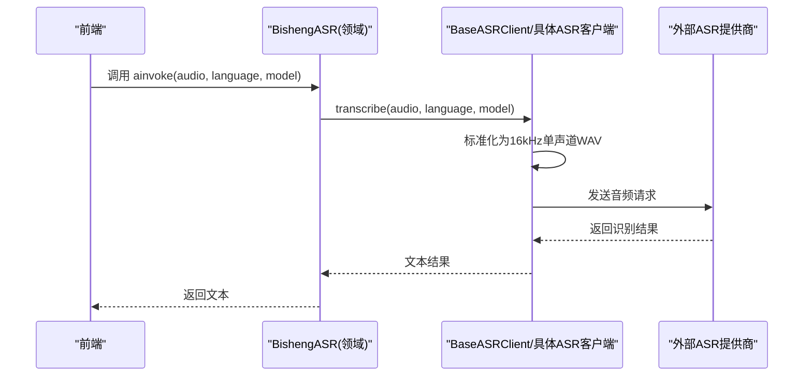
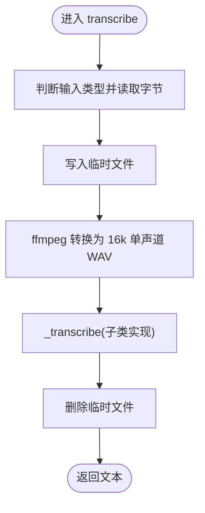
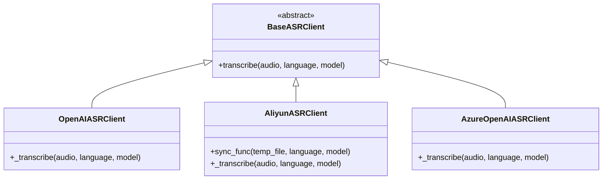
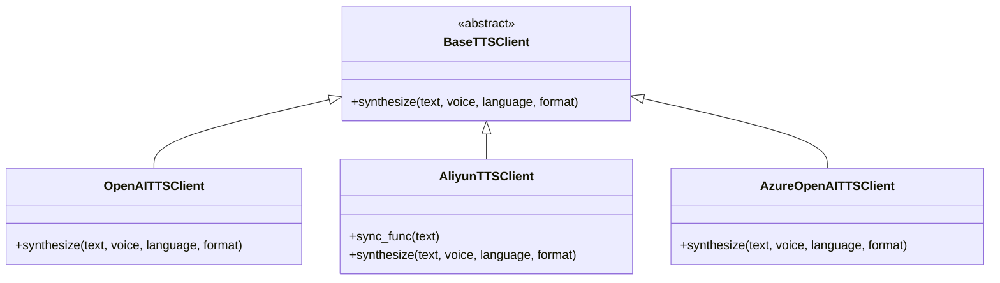
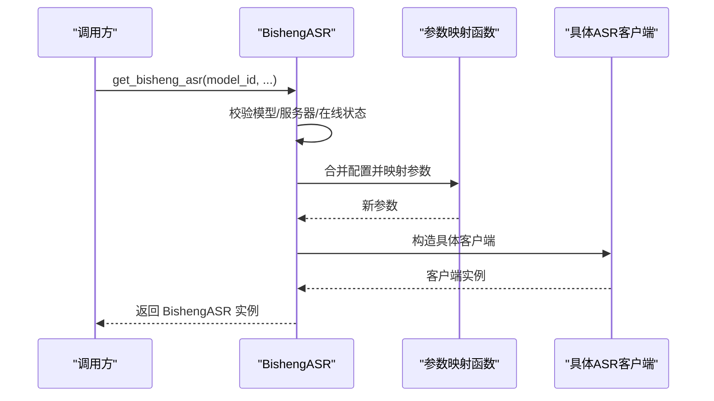
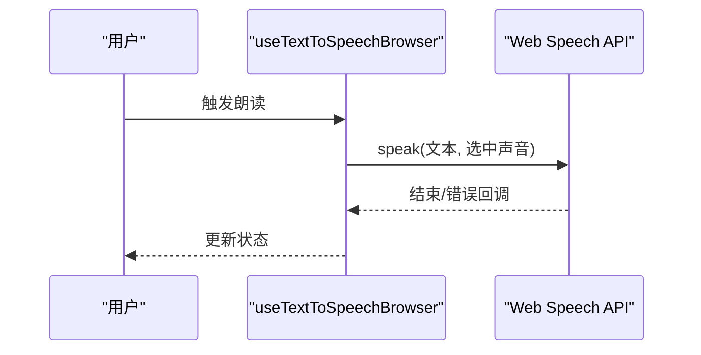
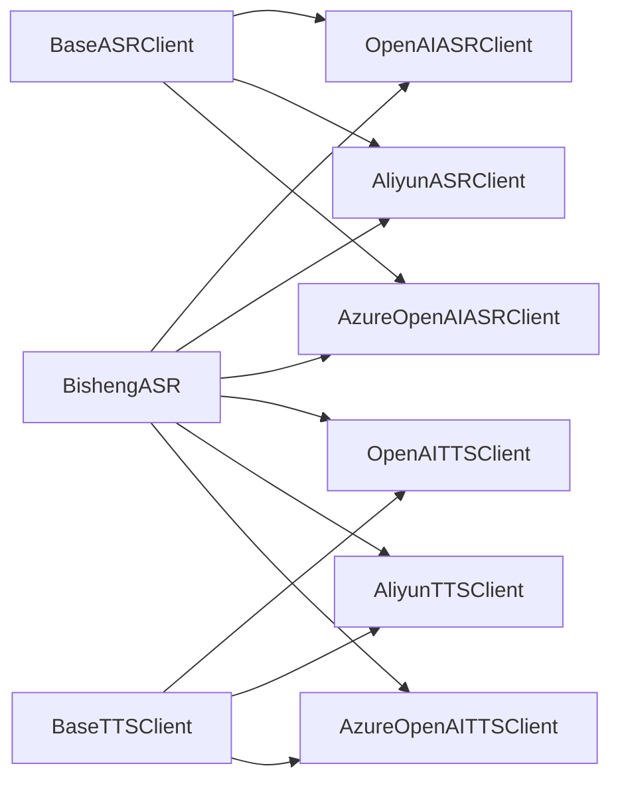

# ASR/TTS 语音服务

<cite>
**本文引用的文件**
- [src/backend/bisheng/core/ai/base.py](file://src/backend/bisheng/core/ai/base.py)
- [src/backend/bisheng/core/ai/asr/__init__.py](file://src/backend/bisheng/core/ai/asr/__init__.py)
- [src/backend/bisheng/core/ai/asr/openai_asr_client.py](file://src/backend/bisheng/core/ai/asr/openai_asr_client.py)
- [src/backend/bisheng/core/ai/asr/aliyun_asr_client.py](file://src/backend/bisheng/core/ai/asr/aliyun_asr_client.py)
- [src/backend/bisheng/core/ai/asr/azure_openai_asr_client.py](file://src/backend/bisheng/core/ai/asr/azure_openai_asr_client.py)
- [src/backend/bisheng/core/ai/tts/__init__.py](file://src/backend/bisheng/core/ai/tts/__init__.py)
- [src/backend/bisheng/core/ai/tts/openai_tts_client.py](file://src/backend/bisheng/core/ai/tts/openai_tts_client.py)
- [src/backend/bisheng/core/ai/tts/aliyun_tts_client.py](file://src/backend/bisheng/core/ai/tts/aliyun_tts_client.py)
- [src/backend/bisheng/core/ai/tts/azure_openai_tts_client.py](file://src/backend/bisheng/core/ai/tts/azure_openai_tts_client.py)
- [src/backend/bisheng/llm/domain/llm/asr.py](file://src/backend/bisheng/llm/domain/llm/asr.py)
- [src/frontend/client/src/hooks/Input/useTextToSpeechBrowser.ts](file://src/frontend/client/src/hooks/Input/useTextToSpeechBrowser.ts)
- [src/frontend/client/src/hooks/Input/useTextToSpeech.ts](file://src/frontend/client/src/hooks/Input/useTextToSpeech.ts)
- [src/frontend/client/src/components/Nav/SettingsTabs/Speech/TTS/VoiceDropdown.tsx](file://src/frontend/client/src/components/Nav/SettingsTabs/Speech/TTS/VoiceDropdown.tsx)
- [src/frontend/client/src/hooks/Input/useGetAudioSettings.ts](file://src/frontend/client/src/hooks/Input/useGetAudioSettings.ts)
- [src/frontend/client/src/components/Voice/SpeechToText.tsx](file://src/frontend/client/src/components/Voice/SpeechToText.tsx)
- [src/frontend/platform/src/components/voiceFunction/speechToText.tsx](file://src/frontend/platform/src/components/voiceFunction/speechToText.tsx)
</cite>

## 目录
1. [简介](#简介)
2. [项目结构](#项目结构)
3. [核心组件](#核心组件)
4. [架构总览](#架构总览)
5. [组件详解](#组件详解)
6. [依赖关系分析](#依赖关系分析)
7. [性能与优化](#性能与优化)
8. [故障排查指南](#故障排查指南)
9. [结论](#结论)
10. [附录](#附录)

## 简介
本技术文档面向 LLM ASR/TTS 语音服务模块，系统性阐述语音识别（ASR）与语音合成（TTS）的架构设计、音频预处理、特征提取与模型推理流程；详述多提供商适配（OpenAI、阿里云、Azure OpenAI）；覆盖音频格式支持、采样率转换与编码解码机制；并给出延迟控制、带宽管理、配置项、性能调优与故障排查建议。同时提供实时流式处理、批量处理与混合模式的实现思路。

## 项目结构
后端语音能力位于 core/ai 下，按 ASR/TTS 分层，提供统一抽象基类与多提供商客户端；业务侧通过领域模型封装选择具体提供商与参数映射；前端提供浏览器本地 TTS 与录音转写等能力。

**图表来源**
- [src/backend/bisheng/core/ai/base.py](file://src/backend/bisheng/core/ai/base.py#L14-L113)
- [src/backend/bisheng/core/ai/asr/__init__.py](file://src/backend/bisheng/core/ai/asr/__init__.py#L1-L9)
- [src/backend/bisheng/core/ai/tts/__init__.py](file://src/backend/bisheng/core/ai/tts/__init__.py#L1-L9)
- [src/backend/bisheng/llm/domain/llm/asr.py](file://src/backend/bisheng/llm/domain/llm/asr.py#L47-L102)
- [src/frontend/client/src/hooks/Input/useTextToSpeechBrowser.ts](file://src/frontend/client/src/hooks/Input/useTextToSpeechBrowser.ts#L45-L118)
- [src/frontend/client/src/hooks/Input/useTextToSpeech.ts](file://src/frontend/client/src/hooks/Input/useTextToSpeech.ts#L81-L112)
- [src/frontend/client/src/components/Nav/SettingsTabs/Speech/TTS/VoiceDropdown.tsx](file://src/frontend/client/src/components/Nav/SettingsTabs/Speech/TTS/VoiceDropdown.tsx#L1-L21)
- [src/frontend/client/src/hooks/Input/useGetAudioSettings.ts](file://src/frontend/client/src/hooks/Input/useGetAudioSettings.ts#L1-L18)
- [src/frontend/client/src/components/Voice/SpeechToText.tsx](file://src/frontend/client/src/components/Voice/SpeechToText.tsx#L38-L76)
- [src/frontend/platform/src/components/voiceFunction/speechToText.tsx](file://src/frontend/platform/src/components/voiceFunction/speechToText.tsx#L40-L95)

**章节来源**
- [src/backend/bisheng/core/ai/base.py](file://src/backend/bisheng/core/ai/base.py#L14-L113)
- [src/backend/bisheng/core/ai/asr/__init__.py](file://src/backend/bisheng/core/ai/asr/__init__.py#L1-L9)
- [src/backend/bisheng/core/ai/tts/__init__.py](file://src/backend/bisheng/core/ai/tts/__init__.py#L1-L9)
- [src/backend/bisheng/llm/domain/llm/asr.py](file://src/backend/bisheng/llm/domain/llm/asr.py#L47-L102)
- [src/frontend/client/src/hooks/Input/useTextToSpeechBrowser.ts](file://src/frontend/client/src/hooks/Input/useTextToSpeechBrowser.ts#L45-L118)
- [src/frontend/client/src/hooks/Input/useTextToSpeech.ts](file://src/frontend/client/src/hooks/Input/useTextToSpeech.ts#L81-L112)
- [src/frontend/client/src/components/Nav/SettingsTabs/Speech/TTS/VoiceDropdown.tsx](file://src/frontend/client/src/components/Nav/SettingsTabs/Speech/TTS/VoiceDropdown.tsx#L1-L21)
- [src/frontend/client/src/hooks/Input/useGetAudioSettings.ts](file://src/frontend/client/src/hooks/Input/useGetAudioSettings.ts#L1-L18)
- [src/frontend/client/src/components/Voice/SpeechToText.tsx](file://src/frontend/client/src/components/Voice/SpeechToText.tsx#L38-L76)
- [src/frontend/platform/src/components/voiceFunction/speechToText.tsx](file://src/frontend/platform/src/components/voiceFunction/speechToText.tsx#L40-L95)

## 核心组件
- 抽象基类
  - BaseASRClient：定义统一的 transcribe 接口，负责将任意音频输入标准化为 16kHz 单声道 WAV，并调用子类 _transcribe 实现。
  - BaseTTSClient：定义统一的 synthesize 接口，接收文本与参数，返回音频二进制。
- 多提供商客户端
  - ASR：OpenAIASRClient、AliyunASRClient、AzureOpenAIASRClient
  - TTS：OpenAITTSClient、AliyunTTSClient、AzureOpenAITTSClient
- 领域封装与工厂
  - BishengASR：根据模型与服务器配置动态选择具体客户端，完成参数映射与实例化。

**章节来源**
- [src/backend/bisheng/core/ai/base.py](file://src/backend/bisheng/core/ai/base.py#L14-L113)
- [src/backend/bisheng/core/ai/asr/openai_asr_client.py](file://src/backend/bisheng/core/ai/asr/openai_asr_client.py#L8-L42)
- [src/backend/bisheng/core/ai/asr/aliyun_asr_client.py](file://src/backend/bisheng/core/ai/asr/aliyun_asr_client.py#L9-L48)
- [src/backend/bisheng/core/ai/asr/azure_openai_asr_client.py](file://src/backend/bisheng/core/ai/asr/azure_openai_asr_client.py#L8-L36)
- [src/backend/bisheng/core/ai/tts/openai_tts_client.py](file://src/backend/bisheng/core/ai/tts/openai_tts_client.py#L8-L48)
- [src/backend/bisheng/core/ai/tts/aliyun_tts_client.py](file://src/backend/bisheng/core/ai/tts/aliyun_tts_client.py#L9-L47)
- [src/backend/bisheng/core/ai/tts/azure_openai_tts_client.py](file://src/backend/bisheng/core/ai/tts/azure_openai_tts_client.py#L6-L46)
- [src/backend/bisheng/llm/domain/llm/asr.py](file://src/backend/bisheng/llm/domain/llm/asr.py#L63-L106)

## 架构总览
整体采用“抽象基类 + 多提供商客户端 + 领域工厂”的分层设计。前端通过设置与钩子选择引擎与声音，后端根据模型配置动态路由到对应提供商的客户端，完成音频预处理与推理。

**图表来源**
- [src/backend/bisheng/core/ai/base.py](file://src/backend/bisheng/core/ai/base.py#L17-L71)
- [src/backend/bisheng/llm/domain/llm/asr.py](file://src/backend/bisheng/llm/domain/llm/asr.py#L104-L106)
- [src/backend/bisheng/core/ai/asr/openai_asr_client.py](file://src/backend/bisheng/core/ai/asr/openai_asr_client.py#L15-L42)
- [src/backend/bisheng/core/ai/asr/aliyun_asr_client.py](file://src/backend/bisheng/core/ai/asr/aliyun_asr_client.py#L32-L48)
- [src/backend/bisheng/core/ai/asr/azure_openai_asr_client.py](file://src/backend/bisheng/core/ai/asr/azure_openai_asr_client.py#L15-L36)

## 组件详解

### 抽象与预处理
- 输入类型适配：支持路径字符串、字节、文件对象，统一读取为字节。
- 临时文件与 ffmpeg 转换：写入临时文件后执行 ffmpeg 将音频重采样至 16kHz、单声道、WAV 格式，确保下游模型兼容性。
- 异步清理：无论成功与否，均删除临时文件，避免磁盘占用。

**图表来源**
- [src/backend/bisheng/core/ai/base.py](file://src/backend/bisheng/core/ai/base.py#L17-L71)

**章节来源**
- [src/backend/bisheng/core/ai/base.py](file://src/backend/bisheng/core/ai/base.py#L17-L87)

### ASR 客户端
- OpenAIASRClient：使用 OpenAI AsyncOpenAI，调用 audio.transcriptions 接口。
- AliyunASRClient：使用 DashScope Recognition，同步调用包装在异步线程池中，输出首句文本。
- AzureOpenAIASRClient：使用 AsyncAzureOpenAI，调用 audio.transcriptions 接口，语言参数自动处理“auto”。

**图表来源**
- [src/backend/bisheng/core/ai/base.py](file://src/backend/bisheng/core/ai/base.py#L14-L87)
- [src/backend/bisheng/core/ai/asr/openai_asr_client.py](file://src/backend/bisheng/core/ai/asr/openai_asr_client.py#L8-L42)
- [src/backend/bisheng/core/ai/asr/aliyun_asr_client.py](file://src/backend/bisheng/core/ai/asr/aliyun_asr_client.py#L9-L48)
- [src/backend/bisheng/core/ai/asr/azure_openai_asr_client.py](file://src/backend/bisheng/core/ai/asr/azure_openai_asr_client.py#L8-L36)

**章节来源**
- [src/backend/bisheng/core/ai/asr/openai_asr_client.py](file://src/backend/bisheng/core/ai/asr/openai_asr_client.py#L8-L42)
- [src/backend/bisheng/core/ai/asr/aliyun_asr_client.py](file://src/backend/bisheng/core/ai/asr/aliyun_asr_client.py#L9-L48)
- [src/backend/bisheng/core/ai/asr/azure_openai_asr_client.py](file://src/backend/bisheng/core/ai/asr/azure_openai_asr_client.py#L8-L36)

### TTS 客户端
- OpenAITTSClient：使用 OpenAI AsyncOpenAI，调用 audio.speech 接口，支持多种输出格式。
- AliyunTTSClient：使用 DashScope SpeechSynthesizer，同步调用包装在异步线程池中，返回音频二进制。
- AzureOpenAITTSClient：使用 AsyncAzureOpenAI，调用 audio.speech 接口，支持多种输出格式。

**图表来源**
- [src/backend/bisheng/core/ai/base.py](file://src/backend/bisheng/core/ai/base.py#L90-L113)
- [src/backend/bisheng/core/ai/tts/openai_tts_client.py](file://src/backend/bisheng/core/ai/tts/openai_tts_client.py#L8-L48)
- [src/backend/bisheng/core/ai/tts/aliyun_tts_client.py](file://src/backend/bisheng/core/ai/tts/aliyun_tts_client.py#L9-L47)
- [src/backend/bisheng/core/ai/tts/azure_openai_tts_client.py](file://src/backend/bisheng/core/ai/tts/azure_openai_tts_client.py#L6-L46)

**章节来源**
- [src/backend/bisheng/core/ai/tts/openai_tts_client.py](file://src/backend/bisheng/core/ai/tts/openai_tts_client.py#L8-L48)
- [src/backend/bisheng/core/ai/tts/aliyun_tts_client.py](file://src/backend/bisheng/core/ai/tts/aliyun_tts_client.py#L9-L47)
- [src/backend/bisheng/core/ai/tts/azure_openai_tts_client.py](file://src/backend/bisheng/core/ai/tts/azure_openai_tts_client.py#L6-L46)

### 领域工厂与参数映射
- BishengASR：根据模型与服务器配置，选择对应提供商客户端；对 OpenAI/Azure OpenAI/Qwen（阿里云）进行参数映射，支持代理、版本、端点等差异化配置。
- 初始化流程：校验模型类型、在线状态、提供商存在性；合并服务器与模型配置；调用参数处理器生成客户端构造参数；实例化具体客户端。

**图表来源**
- [src/backend/bisheng/llm/domain/llm/asr.py](file://src/backend/bisheng/llm/domain/llm/asr.py#L66-L102)

**章节来源**
- [src/backend/bisheng/llm/domain/llm/asr.py](file://src/backend/bisheng/llm/domain/llm/asr.py#L17-L44)
- [src/backend/bisheng/llm/domain/llm/asr.py](file://src/backend/bisheng/llm/domain/llm/asr.py#L47-L60)
- [src/backend/bisheng/llm/domain/llm/asr.py](file://src/backend/bisheng/llm/domain/llm/asr.py#L66-L102)

### 前端语音能力
- 浏览器本地 TTS：通过 Web Speech API 播放文本，支持获取可用声音列表、错误处理与取消播放。
- 引擎选择与声音下拉：根据当前 TTS 引擎（edge/browser/external）切换对应声音下拉组件。
- 录音转写：前端将 PCM 数据封装为 WAV（RIFF/WAVE），设置采样率、通道数、位深等参数，再上传后端处理。

**图表来源**
- [src/frontend/client/src/hooks/Input/useTextToSpeechBrowser.ts](file://src/frontend/client/src/hooks/Input/useTextToSpeechBrowser.ts#L70-L100)

**章节来源**
- [src/frontend/client/src/hooks/Input/useTextToSpeechBrowser.ts](file://src/frontend/client/src/hooks/Input/useTextToSpeechBrowser.ts#L45-L118)
- [src/frontend/client/src/hooks/Input/useTextToSpeech.ts](file://src/frontend/client/src/hooks/Input/useTextToSpeech.ts#L81-L112)
- [src/frontend/client/src/components/Nav/SettingsTabs/Speech/TTS/VoiceDropdown.tsx](file://src/frontend/client/src/components/Nav/SettingsTabs/Speech/TTS/VoiceDropdown.tsx#L1-L21)
- [src/frontend/client/src/hooks/Input/useGetAudioSettings.ts](file://src/frontend/client/src/hooks/Input/useGetAudioSettings.ts#L1-L18)
- [src/frontend/client/src/components/Voice/SpeechToText.tsx](file://src/frontend/client/src/components/Voice/SpeechToText.tsx#L38-L76)
- [src/frontend/platform/src/components/voiceFunction/speechToText.tsx](file://src/frontend/platform/src/components/voiceFunction/speechToText.tsx#L40-L95)

## 依赖关系分析
- 抽象与实现解耦：BaseASRClient/BaseTTSClient 提供统一接口，具体提供商客户端仅关注自身 SDK 的调用细节。
- 参数映射集中：_asr_client_type 与参数映射函数将“服务器类型”与“客户端构造参数”解耦，便于扩展新提供商。
- 前后端边界清晰：前端负责采集与本地 TTS，后端负责云端 ASR/TTS 与模型选择。

**图表来源**
- [src/backend/bisheng/core/ai/base.py](file://src/backend/bisheng/core/ai/base.py#L14-L113)
- [src/backend/bisheng/core/ai/asr/__init__.py](file://src/backend/bisheng/core/ai/asr/__init__.py#L1-L9)
- [src/backend/bisheng/core/ai/tts/__init__.py](file://src/backend/bisheng/core/ai/tts/__init__.py#L1-L9)
- [src/backend/bisheng/llm/domain/llm/asr.py](file://src/backend/bisheng/llm/domain/llm/asr.py#L47-L102)

**章节来源**
- [src/backend/bisheng/core/ai/asr/__init__.py](file://src/backend/bisheng/core/ai/asr/__init__.py#L1-L9)
- [src/backend/bisheng/core/ai/tts/__init__.py](file://src/backend/bisheng/core/ai/tts/__init__.py#L1-L9)
- [src/backend/bisheng/llm/domain/llm/asr.py](file://src/backend/bisheng/llm/domain/llm/asr.py#L47-L102)

## 性能与优化
- 预处理优化
  - ffmpeg 转换在临时目录进行，完成后立即清理，避免磁盘膨胀。
  - 16kHz 单声道可降低后续模型计算量与网络传输开销。
- 并发与阻塞
  - 阿里云 ASR/TTS 使用线程池包装同步调用，避免阻塞事件循环。
- 延迟控制
  - 前端录音转写：直接生成 WAV 头部，减少额外编解码步骤。
  - 可考虑分片上传与流式识别（若提供商支持），以缩短首包时延。
- 带宽管理
  - 输出格式选择：优先 mp3/opus 以减小体积；需要高质量或二次处理时选用 wav/pcm。
  - 代理与直连：通过参数映射启用代理，平衡稳定性与速度。
- 批量与混合模式
  - 批量：后端聚合多个音频任务，复用连接与会话上下文。
  - 混合：根据模型能力与成本策略，动态选择 OpenAI/Azure/OpenAI 兼容服务。

[本节为通用性能建议，不直接分析具体文件]

## 故障排查指南
- 常见错误定位
  - 模型/提供商配置缺失：检查模型类型是否为 ASR，服务器是否存在，是否在线。
  - 参数映射异常：确认服务器配置与模型配置合并后的键值正确（如 openai_api_key、azure_endpoint、api_version 等）。
  - ffmpeg 未安装或权限不足：确保系统具备 ffmpeg 并可执行。
  - 阿里云调用失败：检查 API Key、模型名称与采样率格式是否匹配。
- 日志与回调
  - 前端 Web Speech API 错误回调可用于定位浏览器兼容性问题。
- 快速验证
  - 使用最小输入（短文本/短音频）验证链路；逐步增加复杂度定位瓶颈。

**章节来源**
- [src/backend/bisheng/llm/domain/llm/asr.py](file://src/backend/bisheng/llm/domain/llm/asr.py#L75-L82)
- [src/backend/bisheng/core/ai/asr/aliyun_asr_client.py](file://src/backend/bisheng/core/ai/asr/aliyun_asr_client.py#L40-L43)
- [src/frontend/client/src/hooks/Input/useTextToSpeechBrowser.ts](file://src/frontend/client/src/hooks/Input/useTextToSpeechBrowser.ts#L91-L94)

## 结论
该语音服务模块通过抽象基类与多提供商客户端实现了良好的可扩展性与一致性；结合领域工厂与参数映射，能够灵活适配 OpenAI、阿里云、Azure OpenAI 等多家提供商。前端提供浏览器本地 TTS 与录音转写能力，后端完成云端 ASR/TTS 与模型选择。配合 ffmpeg 预处理与线程池并发，可在保证质量的同时兼顾性能与稳定性。

[本节为总结性内容，不直接分析具体文件]

## 附录

### 音频格式与采样率
- 输入适配：任意音频输入经统一预处理转换为 16kHz 单声道 WAV。
- 输出格式：TTS 支持多种格式（如 mp3、opus、aac、flac、wav、pcm），可根据场景选择。
- 前端编码：将 PCM 数据封装为 RIFF/WAVE，设置采样率、通道数与位深，满足后端模型要求。

**章节来源**
- [src/backend/bisheng/core/ai/base.py](file://src/backend/bisheng/core/ai/base.py#L47-L71)
- [src/backend/bisheng/core/ai/tts/openai_tts_client.py](file://src/backend/bisheng/core/ai/tts/openai_tts_client.py#L26-L27)
- [src/frontend/client/src/components/Voice/SpeechToText.tsx](file://src/frontend/client/src/components/Voice/SpeechToText.tsx#L38-L76)

### 配置选项与参数映射
- OpenAI：支持 api_key、model、base_url、proxy（httpx.AsyncClient）。
- Azure OpenAI：支持 api_key、api_version、azure_endpoint、model。
- 阿里云（Qwen）：支持 api_key 或 openai_api_key、model。

**章节来源**
- [src/backend/bisheng/llm/domain/llm/asr.py](file://src/backend/bisheng/llm/domain/llm/asr.py#L17-L36)
- [src/backend/bisheng/llm/domain/llm/asr.py](file://src/backend/bisheng/llm/domain/llm/asr.py#L56-L59)