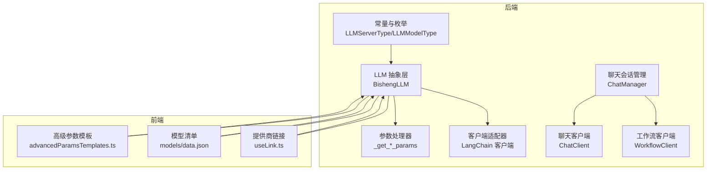
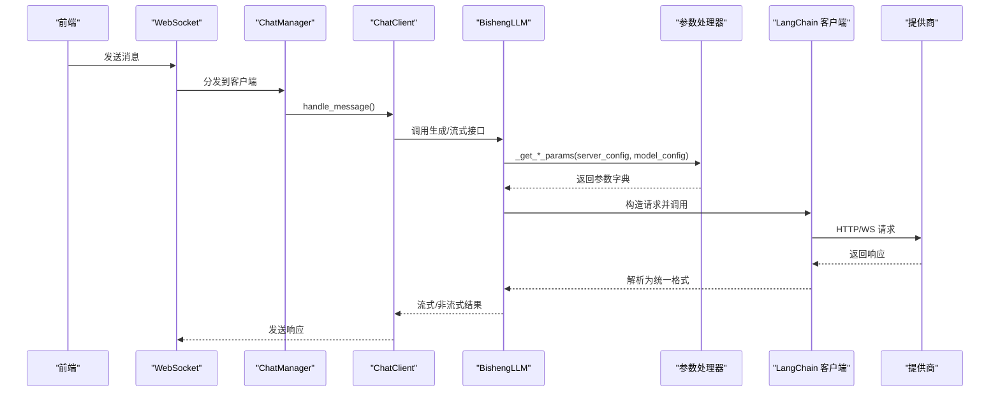
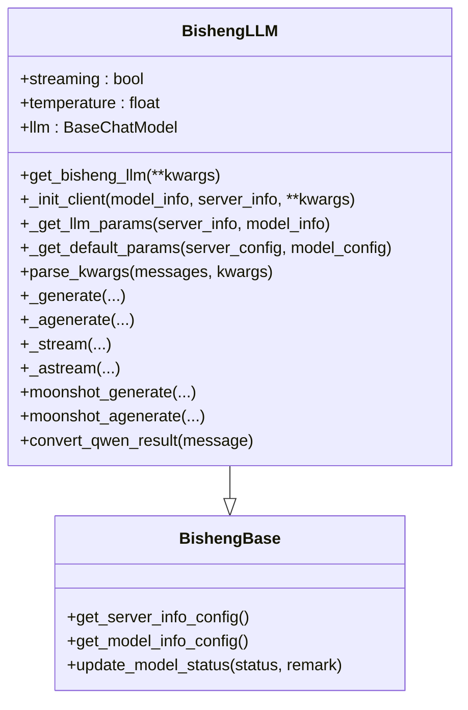
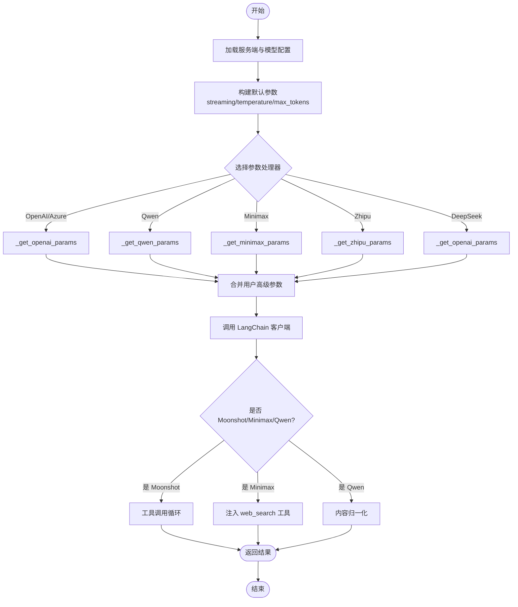
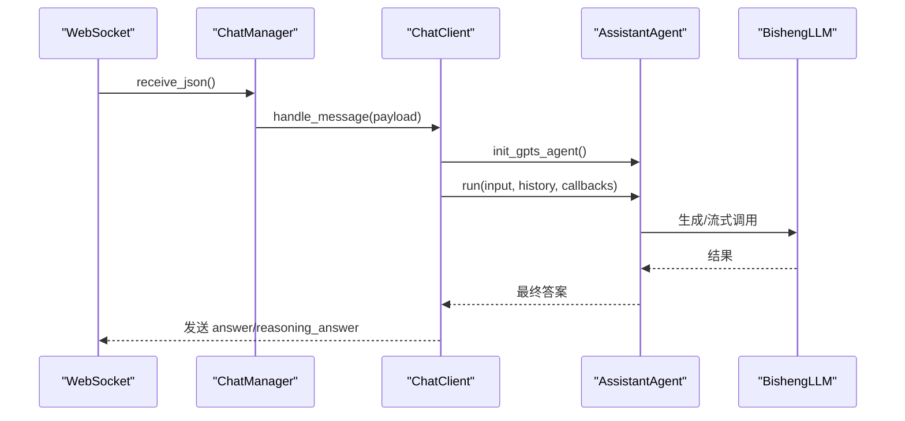
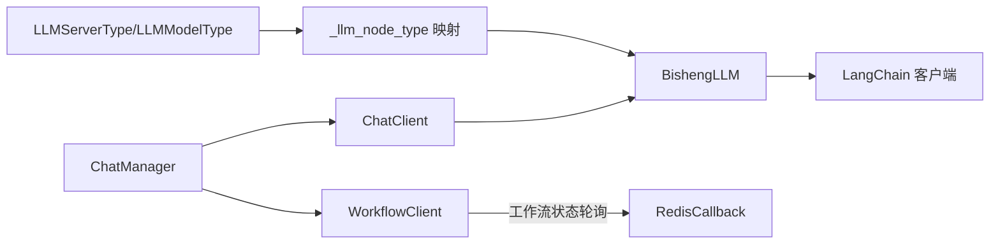

# LLM 提供商集成

<cite>
**本文引用的文件**
- [src/backend/bisheng/llm/domain/llm/llm.py](file://src/backend/bisheng/llm/domain/llm/llm.py)
- [src/backend/bisheng/llm/domain/const.py](file://src/backend/bisheng/llm/domain/const.py)
- [src/backend/bisheng/llm/domain/llm/base.py](file://src/backend/bisheng/llm/domain/llm/base.py)
- [src/backend/bisheng/chat/manager.py](file://src/backend/bisheng/chat/manager.py)
- [src/backend/bisheng/chat/client.py](file://src/backend/bisheng/chat/client.py)
- [src/backend/bisheng/chat/clients/base.py](file://src/backend/bisheng/chat/clients/base.py)
- [src/backend/bisheng/chat/clients/workflow_client.py](file://src/backend/bisheng/chat/clients/workflow_client.py)
- [src/backend/bisheng/chat/types.py](file://src/backend/bisheng/chat/types.py)
- [src/backend/bisheng/core/ai/llm/custom_chat_deepseek.py](file://src/backend/bisheng/core/ai/llm/custom_chat_deepseek.py)
- [src/frontend/platform/src/util/advancedParamsTemplates.ts](file://src/frontend/platform/src/util/advancedParamsTemplates.ts)
- [src/frontend/platform/src/pages/ModelPage/manage/useLink.ts](file://src/frontend/platform/src/pages/ModelPage/manage/useLink.ts)
- [src/frontend/platform/public/models/data.json](file://src/frontend/platform/public/models/data.json)
- [src/frontend/client/src/components/Messages/Content/Error.tsx](file://src/frontend/client/src/components/Messages/Content/Error.tsx)
- [src/frontend/client/src/hooks/useTimeout.tsx](file://src/frontend/client/src/hooks/useTimeout.tsx)
</cite>

## 目录
1. [引言](#引言)
2. [项目结构](#项目结构)
3. [核心组件](#核心组件)
4. [架构总览](#架构总览)
5. [组件详解](#组件详解)
6. [依赖关系分析](#依赖关系分析)
7. [性能考量](#性能考量)
8. [故障排查指南](#故障排查指南)
9. [结论](#结论)
10. [附录](#附录)

## 引言
本技术文档面向 LLM 提供商集成模块，系统性阐述多提供商 LLM 服务架构与统一抽象层设计，覆盖 OpenAI 兼容接口、DeepSeek、通义千问（Qwen）、智谱清言（Zhipu）、百度千帆（Qianfan）、讯飞星火（Spark）、腾讯云（Tencent）、月之暗面（Moonshot）、火山引擎（Volcengine）、硅基流动（Silicon）、Minimax 等多家模型提供商的接入方式。文档重点包括：
- 统一模型抽象层：接口标准化、参数映射与响应格式转换
- 各提供商特性差异、性能特点与使用限制
- 模型切换机制、负载均衡策略与故障转移处理
- 配置示例、认证方法与最佳实践
- 错误处理、超时管理与重试机制

## 项目结构
后端通过“领域模型 + 适配器”的方式实现多提供商统一接入；前端提供模型与提供商配置模板、链接与参数映射。

图表来源
- [src/backend/bisheng/llm/domain/llm/llm.py](file://src/backend/bisheng/llm/domain/llm/llm.py#L156-L178)
- [src/backend/bisheng/llm/domain/const.py](file://src/backend/bisheng/llm/domain/const.py#L6-L26)
- [src/backend/bisheng/chat/manager.py](file://src/backend/bisheng/chat/manager.py#L204-L260)
- [src/frontend/platform/src/util/advancedParamsTemplates.ts](file://src/frontend/platform/src/util/advancedParamsTemplates.ts#L225-L247)
- [src/frontend/platform/public/models/data.json](file://src/frontend/platform/public/models/data.json#L1-L57)

章节来源
- [src/backend/bisheng/llm/domain/llm/llm.py](file://src/backend/bisheng/llm/domain/llm/llm.py#L156-L178)
- [src/backend/bisheng/llm/domain/const.py](file://src/backend/bisheng/llm/domain/const.py#L6-L26)
- [src/backend/bisheng/chat/manager.py](file://src/backend/bisheng/chat/manager.py#L204-L260)
- [src/frontend/platform/src/util/advancedParamsTemplates.ts](file://src/frontend/platform/src/util/advancedParamsTemplates.ts#L225-L247)
- [src/frontend/platform/public/models/data.json](file://src/frontend/platform/public/models/data.json#L1-L57)

## 核心组件
- 统一抽象层：BishengLLM 将不同提供商的客户端封装为统一的 LangChain BaseChatModel 接口，负责参数映射、默认参数注入、流式输出转换与工具调用增强。
- 参数映射：针对各提供商差异，提供 _get_*_params 函数，统一注入 api_key、base_url、streaming、max_tokens、temperature 等参数，并处理特殊字段（如 Qwen 的 enable_search、model_kwargs）。
- 客户端适配器：内置多种 LangChain 客户端（OpenAI 兼容、Azure、CustomChatTongYi、CustomChatDeepSeek、ChatZhipuAI、MiniMaxChat、ChatAnthropic、MoonshotChat），并按提供商类型选择。
- 会话与工作流：ChatClient 处理 GPTS 场景消息流转与回调；WorkflowClient 处理工作流状态与输入节点；BaseClient 提供通用消息发送、持久化与任务取消能力。
- 前端模板与模型清单：advancedParamsTemplates.ts 提供各提供商的高级参数模板；models/data.json 提供模型清单；useLink.ts 提供各提供商的 API 文档与密钥页链接。

章节来源
- [src/backend/bisheng/llm/domain/llm/llm.py](file://src/backend/bisheng/llm/domain/llm/llm.py#L181-L272)
- [src/backend/bisheng/llm/domain/llm/llm.py](file://src/backend/bisheng/llm/domain/llm/llm.py#L277-L331)
- [src/backend/bisheng/chat/client.py](file://src/backend/bisheng/chat/client.py#L68-L107)
- [src/backend/bisheng/chat/clients/workflow_client.py](file://src/backend/bisheng/chat/clients/workflow_client.py#L55-L128)
- [src/backend/bisheng/chat/clients/base.py](file://src/backend/bisheng/chat/clients/base.py#L47-L124)
- [src/frontend/platform/src/util/advancedParamsTemplates.ts](file://src/frontend/platform/src/util/advancedParamsTemplates.ts#L139-L166)
- [src/frontend/platform/public/models/data.json](file://src/frontend/platform/public/models/data.json#L1-L57)
- [src/frontend/platform/src/pages/ModelPage/manage/useLink.ts](file://src/frontend/platform/src/pages/ModelPage/manage/useLink.ts#L36-L50)

## 架构总览
统一抽象层在运行时根据模型与服务端配置动态选择客户端与参数处理器，完成请求构建与响应转换；聊天与工作流通过客户端适配器与后端 LLM 抽象层交互。

图表来源
- [src/backend/bisheng/chat/manager.py](file://src/backend/bisheng/chat/manager.py#L204-L260)
- [src/backend/bisheng/chat/client.py](file://src/backend/bisheng/chat/client.py#L68-L107)
- [src/backend/bisheng/llm/domain/llm/llm.py](file://src/backend/bisheng/llm/domain/llm/llm.py#L242-L249)
- [src/backend/bisheng/llm/domain/llm/llm.py](file://src/backend/bisheng/llm/domain/llm/llm.py#L332-L348)

## 组件详解

### 统一模型抽象层（BishengLLM）
- 角色与职责
  - 依据模型与服务端类型选择对应 LangChain 客户端类与参数处理器
  - 注入默认参数（streaming、temperature、max_tokens），合并用户高级参数
  - 处理 Moonshot 工具调用循环与 Qwen 多模态内容转换
  - 包装限流与异步生成器，支持同步/异步生成与流式输出
- 关键流程
  - 初始化：校验模型在线状态、类型一致性，选择客户端类与参数处理器
  - 参数映射：优先级（实例传参 > 高级参数 > 默认值）
  - 特殊处理：Minimax/WebSearch 工具注入、Moonshot 工具调用循环、Qwen 内容归一化
  - 输出转换：流式/非流式统一为 LangChain 格式

图表来源
- [src/backend/bisheng/llm/domain/llm/llm.py](file://src/backend/bisheng/llm/domain/llm/llm.py#L181-L272)
- [src/backend/bisheng/llm/domain/llm/llm.py](file://src/backend/bisheng/llm/domain/llm/llm.py#L332-L459)
- [src/backend/bisheng/llm/domain/llm/base.py](file://src/backend/bisheng/llm/domain/llm/base.py#L73-L81)

章节来源
- [src/backend/bisheng/llm/domain/llm/llm.py](file://src/backend/bisheng/llm/domain/llm/llm.py#L181-L272)
- [src/backend/bisheng/llm/domain/llm/llm.py](file://src/backend/bisheng/llm/domain/llm/llm.py#L277-L331)
- [src/backend/bisheng/llm/domain/llm/llm.py](file://src/backend/bisheng/llm/domain/llm/llm.py#L332-L459)
- [src/backend/bisheng/llm/domain/llm/base.py](file://src/backend/bisheng/llm/domain/llm/base.py#L73-L81)

### 参数映射与响应转换
- OpenAI/Azure/Qwen/Zhipu/Minimax/Anthropic/DeepSeek/Spark/Tencent/Moonshot/Volcengine/Silicon
  - 统一注入 api_key/base_url/openai_proxy/openai_api_version 等
  - 处理 streaming、max_tokens、temperature、model_kwargs 等差异化字段
  - Qwen：启用增量输出、温度与最大 token 映射、enable_web_search 注入 model_kwargs
  - Minimax：自动注入 web_search 工具
  - Moonshot：工具调用循环（$web_search），直至 finish_reason 非 tool_calls
  - DeepSeek：扩展 payload 字段以支持推理内容
- 响应转换
  - Qwen 多模态返回内容归一化为字符串
  - 流式输出逐块转换并透传

图表来源
- [src/backend/bisheng/llm/domain/llm/llm.py](file://src/backend/bisheng/llm/domain/llm/llm.py#L59-L110)
- [src/backend/bisheng/llm/domain/llm/llm.py](file://src/backend/bisheng/llm/domain/llm/llm.py#L113-L142)
- [src/backend/bisheng/llm/domain/llm/llm.py](file://src/backend/bisheng/llm/domain/llm/llm.py#L277-L331)
- [src/backend/bisheng/core/ai/llm/custom_chat_deepseek.py](file://src/backend/bisheng/core/ai/llm/custom_chat_deepseek.py#L10-L24)

章节来源
- [src/backend/bisheng/llm/domain/llm/llm.py](file://src/backend/bisheng/llm/domain/llm/llm.py#L59-L142)
- [src/backend/bisheng/llm/domain/llm/llm.py](file://src/backend/bisheng/llm/domain/llm/llm.py#L277-L331)
- [src/backend/bisheng/core/ai/llm/custom_chat_deepseek.py](file://src/backend/bisheng/core/ai/llm/custom_chat_deepseek.py#L10-L24)

### 客户端与会话管理
- ChatManager：接收 WebSocket 消息，建立 ChatClient/WorkflowClient，处理超时与异常
- ChatClient：GPTS 场景的消息处理、历史加载、回调注入、流式队列与停止逻辑
- WorkflowClient：工作流初始化、状态轮询、输入节点处理、强制停止与清理
- BaseClient：通用消息发送、持久化、任务取消包装

图表来源
- [src/backend/bisheng/chat/manager.py](file://src/backend/bisheng/chat/manager.py#L204-L260)
- [src/backend/bisheng/chat/client.py](file://src/backend/bisheng/chat/client.py#L294-L372)
- [src/backend/bisheng/chat/clients/base.py](file://src/backend/bisheng/chat/clients/base.py#L47-L124)

章节来源
- [src/backend/bisheng/chat/manager.py](file://src/backend/bisheng/chat/manager.py#L204-L260)
- [src/backend/bisheng/chat/client.py](file://src/backend/bisheng/chat/client.py#L68-L107)
- [src/backend/bisheng/chat/client.py](file://src/backend/bisheng/chat/client.py#L294-L372)
- [src/backend/bisheng/chat/clients/base.py](file://src/backend/bisheng/chat/clients/base.py#L47-L124)
- [src/backend/bisheng/chat/clients/workflow_client.py](file://src/backend/bisheng/chat/clients/workflow_client.py#L55-L128)

### 前端配置与模板
- advancedParamsTemplates.ts：为各提供商提供高级参数模板（如 streaming、temperature、max_retries、chunk_size 等），并建立模型类型到模板键的映射
- models/data.json：提供 openai、azure_openai、qwen、deepseek、qianfan 等提供商的模型清单
- useLink.ts：提供各提供商的 API 密钥与模型文档链接

章节来源
- [src/frontend/platform/src/util/advancedParamsTemplates.ts](file://src/frontend/platform/src/util/advancedParamsTemplates.ts#L139-L166)
- [src/frontend/platform/src/util/advancedParamsTemplates.ts](file://src/frontend/platform/src/util/advancedParamsTemplates.ts#L225-L247)
- [src/frontend/platform/public/models/data.json](file://src/frontend/platform/public/models/data.json#L1-L57)
- [src/frontend/platform/src/pages/ModelPage/manage/useLink.ts](file://src/frontend/platform/src/pages/ModelPage/manage/useLink.ts#L36-L50)

## 依赖关系分析
- 类型与枚举：LLMServerType 定义所有支持的提供商；LLMModelType 定义模型类型；LLMModelStatus 定义模型状态
- 抽象层与客户端：BishengLLM 通过 _llm_node_type 映射提供商类型到具体客户端类与参数处理器
- 会话与工作流：ChatManager 根据 WorkType 创建 ChatClient 或 WorkflowClient，分别处理 GPTS 与工作流场景

图表来源
- [src/backend/bisheng/llm/domain/const.py](file://src/backend/bisheng/llm/domain/const.py#L6-L26)
- [src/backend/bisheng/llm/domain/llm/llm.py](file://src/backend/bisheng/llm/domain/llm/llm.py#L156-L178)
- [src/backend/bisheng/chat/manager.py](file://src/backend/bisheng/chat/manager.py#L204-L260)

章节来源
- [src/backend/bisheng/llm/domain/const.py](file://src/backend/bisheng/llm/domain/const.py#L6-L26)
- [src/backend/bisheng/llm/domain/llm/llm.py](file://src/backend/bisheng/llm/domain/llm/llm.py#L156-L178)
- [src/backend/bisheng/chat/manager.py](file://src/backend/bisheng/chat/manager.py#L204-L260)

## 性能考量
- 流式输出：默认开启 streaming（若未显式设置），减少首字节延迟，提升用户体验
- 并发与线程池：消息处理通过线程池提交，避免阻塞 WebSocket 主循环
- 限流与生成器包装：对生成与流式生成进行装饰器包装，控制并发与速率
- 超时与心跳：WebSocket 接收存在超时等待，防止长时间空闲占用资源

章节来源
- [src/backend/bisheng/llm/domain/llm/llm.py](file://src/backend/bisheng/llm/domain/llm/llm.py#L257-L271)
- [src/backend/bisheng/chat/clients/base.py](file://src/backend/bisheng/chat/clients/base.py#L55-L60)
- [src/backend/bisheng/chat/manager.py](file://src/backend/bisheng/chat/manager.py#L240-L244)

## 故障排查指南
- 错误处理
  - 前端 Error 组件解析后端返回的 JSON 错误，优先匹配 code/type 对应本地化文案
  - 建议后端在异常时返回结构化错误体，便于前端统一展示
- 超时与重试
  - 前端 useTimeout 用于防抖与延迟触发，避免频繁请求
  - 部分提供商模板提供 max_retries 等重试参数，可在高级参数中配置
- 常见问题定位
  - 模型离线：检查模型在线状态与提供商可用性
  - 参数不生效：确认参数优先级（实例传参 > 高级参数 > 默认值）
  - 流式输出异常：检查 streaming 开关与客户端兼容性

章节来源
- [src/frontend/client/src/components/Messages/Content/Error.tsx](file://src/frontend/client/src/components/Messages/Content/Error.tsx#L102-L127)
- [src/frontend/client/src/hooks/useTimeout.tsx](file://src/frontend/client/src/hooks/useTimeout.tsx#L1-L39)
- [src/frontend/platform/src/util/advancedParamsTemplates.ts](file://src/frontend/platform/src/util/advancedParamsTemplates.ts#L157-L163)

## 结论
该集成方案通过统一抽象层与参数映射，实现了多提供商 LLM 的一致接入与灵活扩展。结合前端模板与模型清单，开发者可快速配置与切换提供商；后端通过客户端适配器与会话管理，保障了高并发下的稳定性与可观测性。建议在生产环境中配合完善的监控、限流与重试策略，确保服务质量与用户体验。

## 附录

### 支持的提供商与关键特性
- OpenAI/Azure OpenAI：OpenAI 兼容接口，支持 streaming、代理、版本控制
- Qwen：DashScope API，支持 enable_web_search、增量输出、多模态内容归一化
- Zhipu：自研模型，支持 base_url 与 chat/completions 路径拼接
- Minimax：支持 web_search 工具自动注入
- Moonshot：内置工具调用循环（$web_search），需特殊处理 finish_reason
- DeepSeek：扩展 payload 字段以支持推理内容
- 其他：Spark、Tencent、Volcengine、Silicon、Minimax、Anthropic 等均通过 OpenAI 兼容或专用适配器接入

章节来源
- [src/backend/bisheng/llm/domain/llm/llm.py](file://src/backend/bisheng/llm/domain/llm/llm.py#L163-L178)
- [src/backend/bisheng/core/ai/llm/custom_chat_deepseek.py](file://src/backend/bisheng/core/ai/llm/custom_chat_deepseek.py#L10-L24)
- [src/frontend/platform/public/models/data.json](file://src/frontend/platform/public/models/data.json#L1-L57)