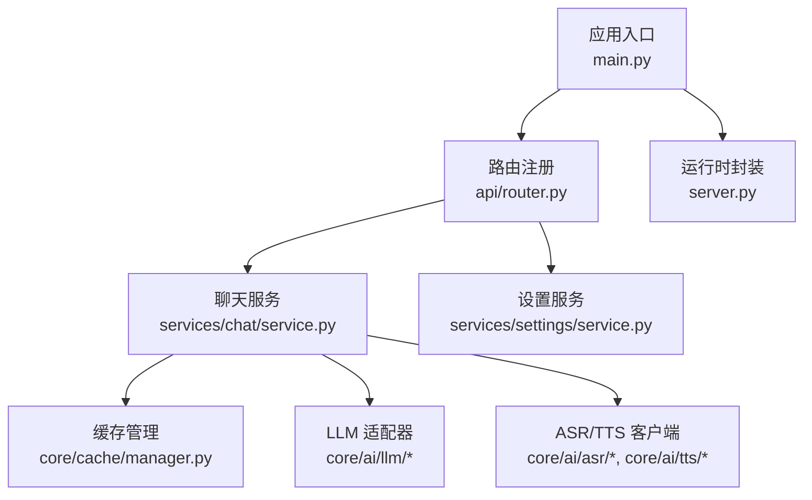
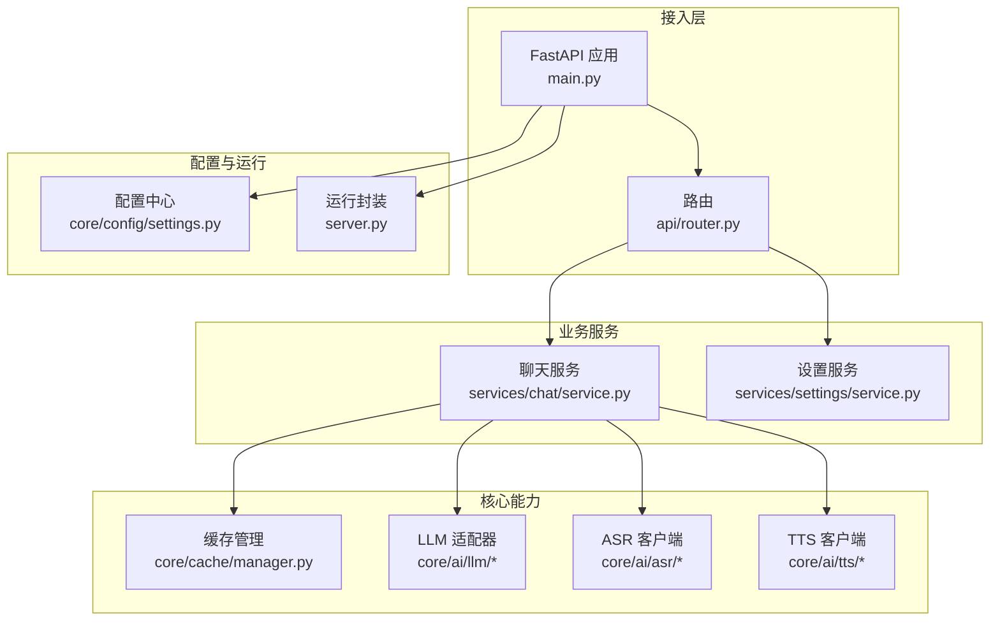
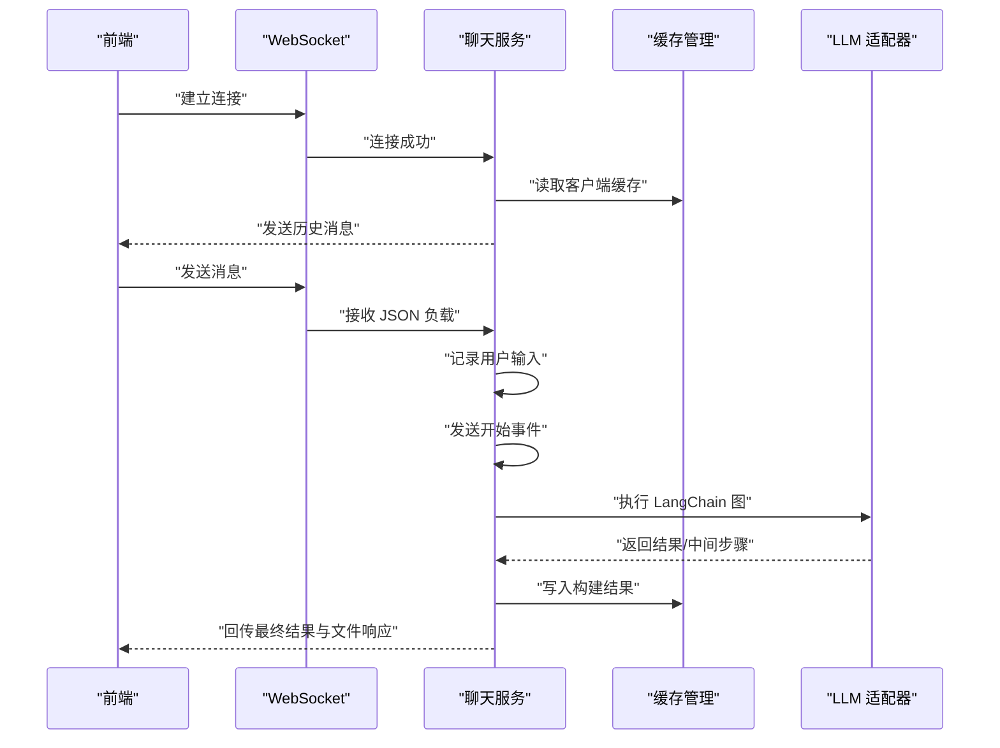
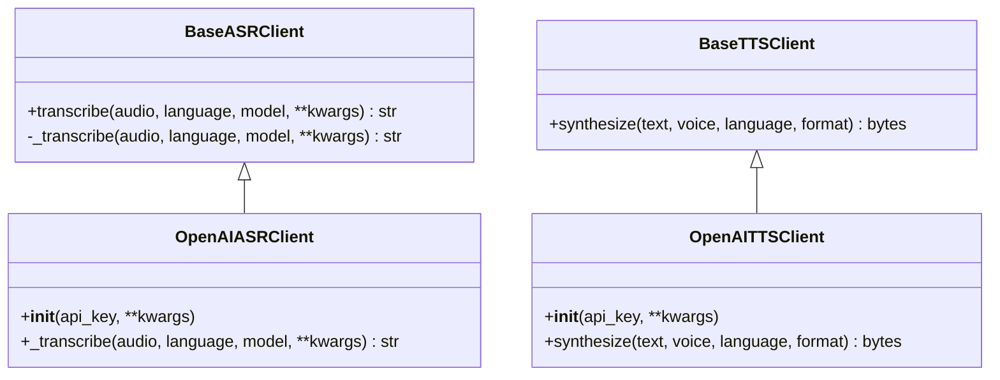
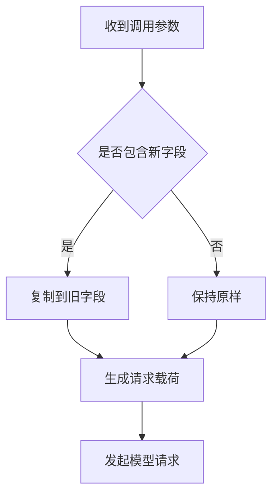
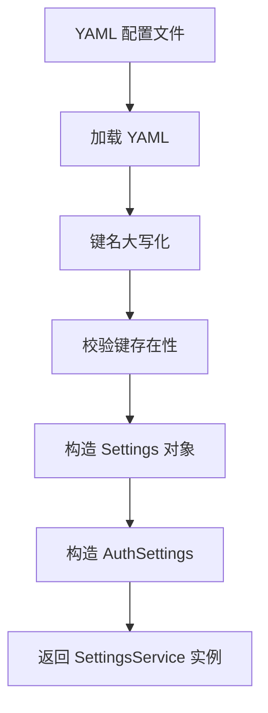
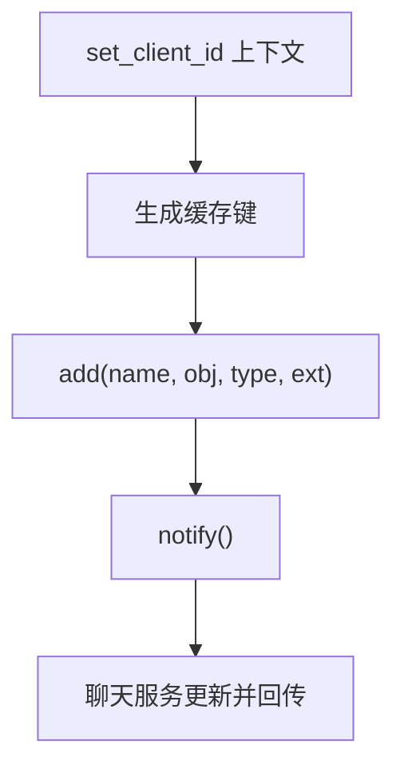
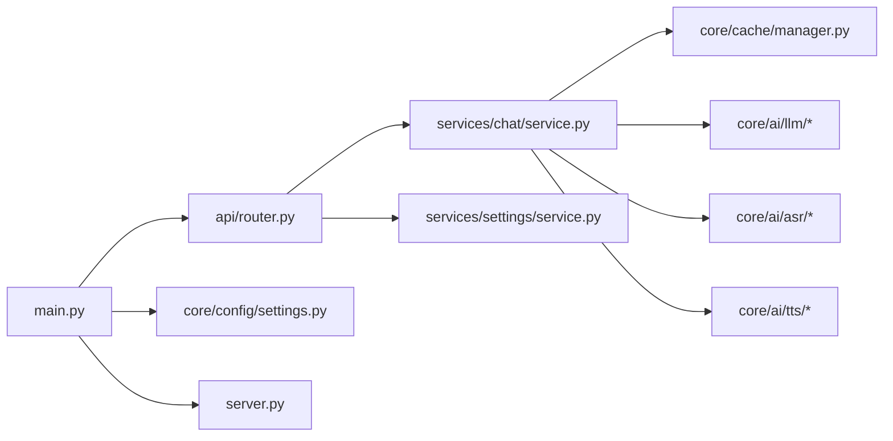

# LLM 服务管理

<cite>
**本文引用的文件**
- [README.md](file://README.md)
- [src/backend/bisheng/main.py](file://src/backend/bisheng/main.py)
- [src/backend/bisheng/server.py](file://src/backend/bisheng/server.py)
- [src/backend/bisheng/api/router.py](file://src/backend/bisheng/api/router.py)
- [src/backend/bisheng/core/ai/base.py](file://src/backend/bisheng/core/ai/base.py)
- [src/backend/bisheng/core/ai/asr/openai_asr_client.py](file://src/backend/bisheng/core/ai/asr/openai_asr_client.py)
- [src/backend/bisheng/core/ai/tts/openai_tts_client.py](file://src/backend/bisheng/core/ai/tts/openai_tts_client.py)
- [src/backend/bisheng/core/ai/llm/chat_openai_compatible.py](file://src/backend/bisheng/core/ai/llm/chat_openai_compatible.py)
- [src/backend/bisheng/core/ai/llm/custom_chat_tongyi.py](file://src/backend/bisheng/core/ai/llm/custom_chat_tongyi.py)
- [src/backend/bisheng/core/cache/manager.py](file://src/backend/bisheng/core/cache/manager.py)
- [src/backend/bisheng/services/settings/service.py](file://src/backend/bisheng/services/settings/service.py)
- [src/backend/bisheng/services/chat/service.py](file://src/backend/bisheng/services/chat/service.py)
- [src/backend/bisheng/core/config/settings.py](file://src/backend/bisheng/core/config/settings.py)
</cite>

## 目录
1. [简介](#简介)
2. [项目结构](#项目结构)
3. [核心组件](#核心组件)
4. [架构总览](#架构总览)
5. [组件详解](#组件详解)
6. [依赖关系分析](#依赖关系分析)
7. [性能与优化](#性能与优化)
8. [故障排查指南](#故障排查指南)
9. [结论](#结论)
10. [附录](#附录)

## 简介
本技术文档面向 Bisheng LLM 服务管理系统，系统基于 FastAPI 提供统一的推理、会话、缓存与配置管理能力，并通过抽象层适配多家模型提供商（如 OpenAI、Azure OpenAI、通义千问等），同时集成 ASR（语音识别）与 TTS（语音合成）能力，形成端到端的企业级 LLM 应用支撑平台。本文从系统架构、组件职责、数据流与处理逻辑、错误处理与性能优化等方面进行深入解析，帮助开发者与运维人员快速理解与扩展系统。

## 项目结构
后端采用模块化分层设计：
- 应用入口与中间件：FastAPI 应用、CORS、日志与异常处理、生命周期钩子
- API 路由：统一挂载 v1/v2 两套路由，覆盖聊天、工作流、知识库、LLM 推理等
- 核心能力：
  - AI 能力：ASR/TTS/重排（rerank）与 LLM 适配器
  - 缓存：客户端维度的内存缓存与观察者通知
  - 配置：集中式设置模型、向量库、对象存储、Celery 等
  - 服务：聊天服务、设置服务、工厂与管理器等
- 运行与部署：Gunicorn 应用封装、健康检查接口

图表来源
- [src/backend/bisheng/main.py](file://src/backend/bisheng/main.py#L64-L102)
- [src/backend/bisheng/api/router.py](file://src/backend/bisheng/api/router.py#L1-L61)
- [src/backend/bisheng/services/chat/service.py](file://src/backend/bisheng/services/chat/service.py#L47-L57)
- [src/backend/bisheng/core/cache/manager.py](file://src/backend/bisheng/core/cache/manager.py#L53-L82)
- [src/backend/bisheng/core/ai/llm/chat_openai_compatible.py](file://src/backend/bisheng/core/ai/llm/chat_openai_compatible.py#L7-L25)
- [src/backend/bisheng/core/ai/asr/openai_asr_client.py](file://src/backend/bisheng/core/ai/asr/openai_asr_client.py#L8-L42)
- [src/backend/bisheng/core/ai/tts/openai_tts_client.py](file://src/backend/bisheng/core/ai/tts/openai_tts_client.py#L8-L48)
- [src/backend/bisheng/server.py](file://src/backend/bisheng/server.py#L4-L20)

章节来源
- [src/backend/bisheng/main.py](file://src/backend/bisheng/main.py#L1-L113)
- [src/backend/bisheng/api/router.py](file://src/backend/bisheng/api/router.py#L1-L61)

## 核心组件
- 应用与中间件
  - 异常处理与响应格式：统一返回结构、状态码与错误详情
  - 生命周期：启动初始化上下文、默认数据、服务；关闭时清理线程池与上下文
  - 中间件：CORS、自定义 HTTP 与 WebSocket 日志中间件
- 路由体系
  - v1：通用业务路由集合
  - v2：RPC/开放端点路由集合
- 缓存管理
  - 基于客户端维度的缓存容器，支持添加/读取、类型扩展与观察者通知
- 设置服务
  - 从 YAML 加载配置，校验键名并构造强类型 Settings 对象
- 聊天服务
  - WebSocket 会话管理、消息历史、文件响应处理、LangChain 图执行与结果回传
- AI 能力
  - ASR/TTS 抽象基类与 OpenAI 兼容实现
  - LLM 适配器：兼容旧版参数命名、通义千问多模态输入转换
- 配置中心
  - 统一模型、向量库、对象存储、Celery、日志、Cookie 等配置模型

章节来源
- [src/backend/bisheng/main.py](file://src/backend/bisheng/main.py#L21-L49)
- [src/backend/bisheng/api/router.py](file://src/backend/bisheng/api/router.py#L23-L61)
- [src/backend/bisheng/core/cache/manager.py](file://src/backend/bisheng/core/cache/manager.py#L53-L155)
- [src/backend/bisheng/services/settings/service.py](file://src/backend/bisheng/services/settings/service.py#L18-L43)
- [src/backend/bisheng/services/chat/service.py](file://src/backend/bisheng/services/chat/service.py#L47-L236)
- [src/backend/bisheng/core/ai/base.py](file://src/backend/bisheng/core/ai/base.py#L14-L150)
- [src/backend/bisheng/core/ai/llm/chat_openai_compatible.py](file://src/backend/bisheng/core/ai/llm/chat_openai_compatible.py#L7-L25)
- [src/backend/bisheng/core/ai/llm/custom_chat_tongyi.py](file://src/backend/bisheng/core/ai/llm/custom_chat_tongyi.py#L6-L48)
- [src/backend/bisheng/core/config/settings.py](file://src/backend/bisheng/core/config/settings.py#L210-L346)

## 架构总览
系统以 FastAPI 为核心，通过路由将业务请求分发至各服务模块；聊天服务负责与前端 WebSocket 交互，执行 LangChain 图并回传结果；缓存管理器在客户端维度维护临时对象，便于文件/图像等非文本输出；AI 能力通过抽象基类与具体实现解耦多家提供商；配置中心提供统一的模型与基础设施参数。

图表来源
- [src/backend/bisheng/main.py](file://src/backend/bisheng/main.py#L64-L102)
- [src/backend/bisheng/api/router.py](file://src/backend/bisheng/api/router.py#L1-L61)
- [src/backend/bisheng/services/chat/service.py](file://src/backend/bisheng/services/chat/service.py#L47-L57)
- [src/backend/bisheng/core/cache/manager.py](file://src/backend/bisheng/core/cache/manager.py#L53-L82)
- [src/backend/bisheng/core/ai/llm/chat_openai_compatible.py](file://src/backend/bisheng/core/ai/llm/chat_openai_compatible.py#L7-L25)
- [src/backend/bisheng/core/ai/asr/openai_asr_client.py](file://src/backend/bisheng/core/ai/asr/openai_asr_client.py#L8-L42)
- [src/backend/bisheng/core/ai/tts/openai_tts_client.py](file://src/backend/bisheng/core/ai/tts/openai_tts_client.py#L8-L48)
- [src/backend/bisheng/core/config/settings.py](file://src/backend/bisheng/core/config/settings.py#L210-L346)
- [src/backend/bisheng/server.py](file://src/backend/bisheng/server.py#L4-L20)

## 组件详解

### 聊天服务与推理流程
- WebSocket 会话管理：建立连接、记录连接标识、发送历史消息
- 消息处理：记录用户输入、发送“开始”事件、执行 LangChain 图、回传中间步骤与最终结果
- 文件/图像响应：对文件响应进行类型转换（pandas 转 CSV、图像转 Base64），并回传给前端
- 缓存联动：将构建好的 LangChain 对象写入缓存，后续请求可直接复用

图表来源
- [src/backend/bisheng/services/chat/service.py](file://src/backend/bisheng/services/chat/service.py#L119-L171)
- [src/backend/bisheng/core/cache/manager.py](file://src/backend/bisheng/core/cache/manager.py#L83-L105)
- [src/backend/bisheng/core/ai/llm/chat_openai_compatible.py](file://src/backend/bisheng/core/ai/llm/chat_openai_compatible.py#L7-L25)

章节来源
- [src/backend/bisheng/services/chat/service.py](file://src/backend/bisheng/services/chat/service.py#L47-L236)

### ASR 与 TTS 集成
- ASR 抽象基类：统一音频预处理（临时文件、采样率与声道转换）、异步转录
- TTS 抽象基类：统一文本转语音合成接口
- OpenAI 实现：分别对接 Whisper 与 TTS API，支持模型、音色、格式等参数

图表来源
- [src/backend/bisheng/core/ai/base.py](file://src/backend/bisheng/core/ai/base.py#L14-L114)
- [src/backend/bisheng/core/ai/asr/openai_asr_client.py](file://src/backend/bisheng/core/ai/asr/openai_asr_client.py#L8-L42)
- [src/backend/bisheng/core/ai/tts/openai_tts_client.py](file://src/backend/bisheng/core/ai/tts/openai_tts_client.py#L8-L48)

章节来源
- [src/backend/bisheng/core/ai/base.py](file://src/backend/bisheng/core/ai/base.py#L14-L114)
- [src/backend/bisheng/core/ai/asr/openai_asr_client.py](file://src/backend/bisheng/core/ai/asr/openai_asr_client.py#L8-L42)
- [src/backend/bisheng/core/ai/tts/openai_tts_client.py](file://src/backend/bisheng/core/ai/tts/openai_tts_client.py#L8-L48)

### LLM 适配与参数标准化
- 参数兼容：针对 ChatOpenAI 的参数命名变更，自动将新字段映射到旧字段，确保兼容性
- 多模态适配：通义千问模型的消息内容中，将 OpenAI 风格的图片字段转换为模型期望的内部格式

图表来源
- [src/backend/bisheng/core/ai/llm/chat_openai_compatible.py](file://src/backend/bisheng/core/ai/llm/chat_openai_compatible.py#L13-L25)
- [src/backend/bisheng/core/ai/llm/custom_chat_tongyi.py](file://src/backend/bisheng/core/ai/llm/custom_chat_tongyi.py#L11-L48)

章节来源
- [src/backend/bisheng/core/ai/llm/chat_openai_compatible.py](file://src/backend/bisheng/core/ai/llm/chat_openai_compatible.py#L7-L25)
- [src/backend/bisheng/core/ai/llm/custom_chat_tongyi.py](file://src/backend/bisheng/core/ai/llm/custom_chat_tongyi.py#L6-L48)

### 配置管理与加载
- 设置服务：从 YAML 文件加载配置，键名统一大写，校验键是否存在于 Settings 模型中
- Settings 模型：涵盖数据库、Redis、Celery、日志、Cookie、向量库、对象存储、工作流、遥测等配置项
- 环境变量与加密：数据库密码、Redis/Celery 密码支持加密字符串与环境变量注入

图表来源
- [src/backend/bisheng/services/settings/service.py](file://src/backend/bisheng/services/settings/service.py#L18-L43)
- [src/backend/bisheng/core/config/settings.py](file://src/backend/bisheng/core/config/settings.py#L210-L346)

章节来源
- [src/backend/bisheng/services/settings/service.py](file://src/backend/bisheng/services/settings/service.py#L10-L43)
- [src/backend/bisheng/core/config/settings.py](file://src/backend/bisheng/core/config/settings.py#L210-L346)

### 缓存策略与客户端隔离
- 客户端维度缓存：通过上下文管理器设置当前 client_id 与 chat_id，隔离缓存作用域
- 观察者模式：缓存变更触发通知，聊天服务可监听并推送文件/图像等响应
- 类型扩展：对 pandas 与图像类型提供便捷的序列化/编码方法

图表来源
- [src/backend/bisheng/core/cache/manager.py](file://src/backend/bisheng/core/cache/manager.py#L63-L105)
- [src/backend/bisheng/services/chat/service.py](file://src/backend/bisheng/services/chat/service.py#L78-L90)

章节来源
- [src/backend/bisheng/core/cache/manager.py](file://src/backend/bisheng/core/cache/manager.py#L53-L155)
- [src/backend/bisheng/services/chat/service.py](file://src/backend/bisheng/services/chat/service.py#L47-L90)

## 依赖关系分析
- 应用层依赖路由层，路由层再依赖各业务服务
- 聊天服务依赖缓存管理、LLM 适配器、ASR/TTS 客户端
- 配置服务与设置模型相互协作，为其他模块提供统一参数
- 运行封装依赖应用入口，提供生产级运行时配置

图表来源
- [src/backend/bisheng/main.py](file://src/backend/bisheng/main.py#L64-L102)
- [src/backend/bisheng/api/router.py](file://src/backend/bisheng/api/router.py#L1-L61)
- [src/backend/bisheng/services/chat/service.py](file://src/backend/bisheng/services/chat/service.py#L47-L57)
- [src/backend/bisheng/core/cache/manager.py](file://src/backend/bisheng/core/cache/manager.py#L53-L82)
- [src/backend/bisheng/core/config/settings.py](file://src/backend/bisheng/core/config/settings.py#L210-L346)
- [src/backend/bisheng/server.py](file://src/backend/bisheng/server.py#L4-L20)

章节来源
- [src/backend/bisheng/main.py](file://src/backend/bisheng/main.py#L64-L102)
- [src/backend/bisheng/api/router.py](file://src/backend/bisheng/api/router.py#L1-L61)

## 性能与优化
- 并发与异步
  - ASR/TTS 使用异步客户端，避免阻塞主线程
  - WebSocket 事件循环与线程安全：通过事件循环调度器回传消息
- 缓存与复用
  - 客户端维度缓存减少重复构建成本；文件/图像自动编码降低传输体积
- 参数兼容与稳定性
  - LLM 参数命名兼容，避免上游变更导致的调用失败
- 配置与资源
  - Redis/Celery/数据库等敏感信息支持加密与环境变量注入，便于在不同环境切换
- 建议
  - 对高频推理任务引入本地缓存与热点数据预热
  - 对长会话使用分页或游标式历史存储，避免内存膨胀
  - 在生产环境启用 Gunicorn 多进程与合理的并发数

[本节为通用建议，无需列出章节来源]

## 故障排查指南
- 异常处理
  - HTTP 异常、请求验证异常、业务错误码均被统一捕获并返回标准结构
  - 未捕获异常记录堆栈并返回 500
- WebSocket 连接
  - 连接断开与异常关闭有明确的状态码与原因，便于前端重连与诊断
- 缓存问题
  - 若出现找不到构建结果，检查缓存键与客户端维度是否一致
- ASR/TTS
  - 确认音频格式与采样率转换链路是否正常；检查第三方 API 返回状态
- 配置问题
  - YAML 键名需与 Settings 字段匹配；数据库/Redis 密码若为加密串需正确解密

章节来源
- [src/backend/bisheng/main.py](file://src/backend/bisheng/main.py#L21-L49)
- [src/backend/bisheng/services/chat/service.py](file://src/backend/bisheng/services/chat/service.py#L212-L235)
- [src/backend/bisheng/core/cache/manager.py](file://src/backend/bisheng/core/cache/manager.py#L63-L82)
- [src/backend/bisheng/core/ai/base.py](file://src/backend/bisheng/core/ai/base.py#L53-L71)
- [src/backend/bisheng/services/settings/service.py](file://src/backend/bisheng/services/settings/service.py#L31-L34)

## 结论
Bisheng LLM 服务管理系统通过清晰的分层与抽象，实现了多提供商 LLM 的统一接入、稳定的参数兼容、完善的 ASR/TTS 能力以及可扩展的缓存与配置体系。结合 WebSocket 会话与 LangChain 图执行，系统能够满足企业级复杂场景下的推理与应用编排需求。建议在生产环境中配合缓存预热、资源隔离与监控告警，持续优化吞吐与稳定性。

[本节为总结，无需列出章节来源]

## 附录
- 快速启动与部署参考：README 中提供了安装与启动指引
- 运行时封装：通过 Gunicorn 应用类提供生产级运行时配置

章节来源
- [README.md](file://README.md#L58-L86)
- [src/backend/bisheng/server.py](file://src/backend/bisheng/server.py#L4-L20)