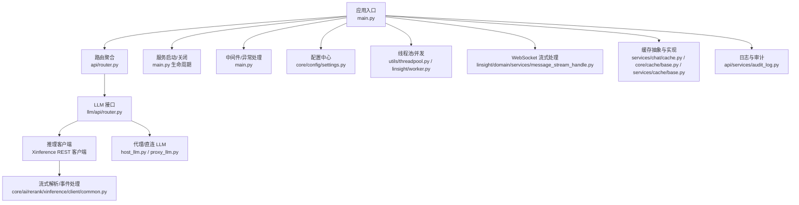
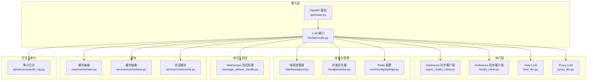
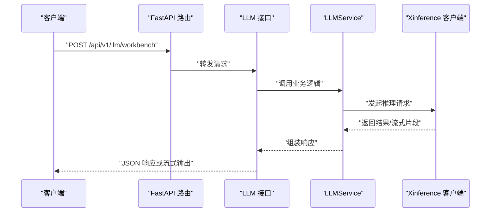
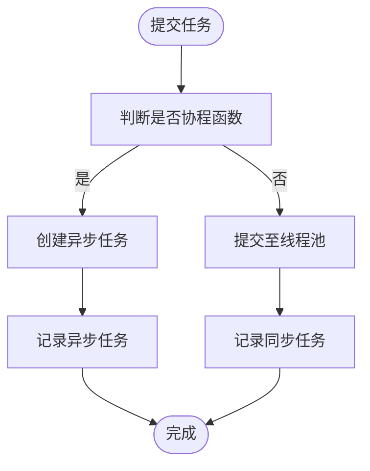
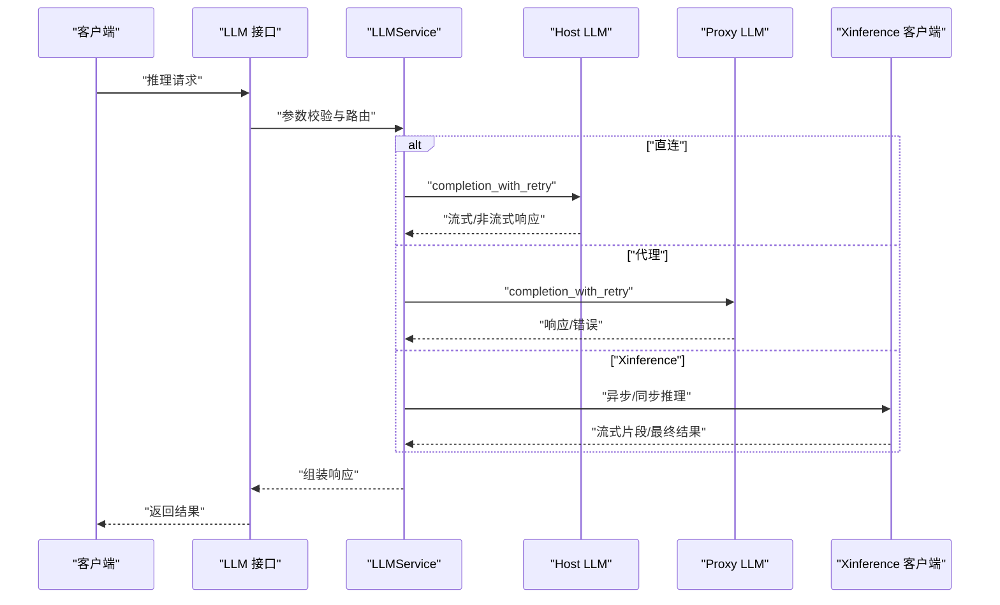
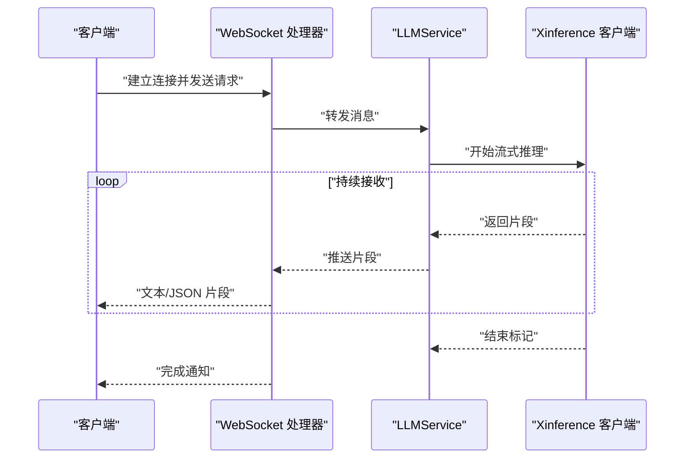
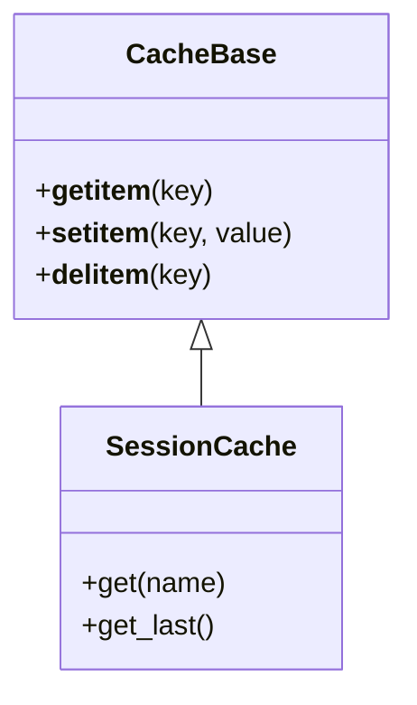
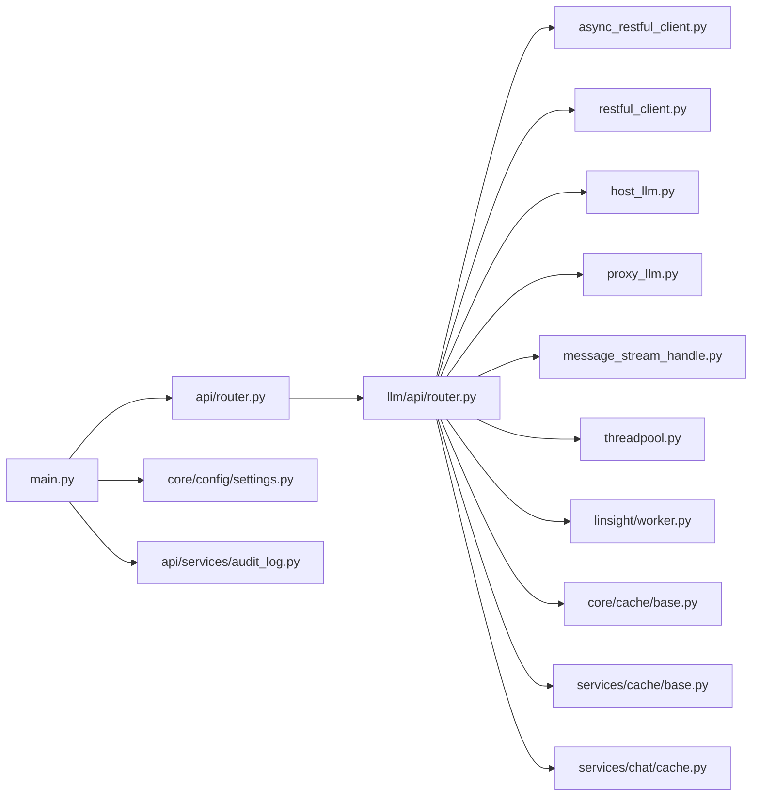

# 推理服务实现

<cite>
**本文引用的文件**   
- [src/backend/bisheng/main.py](file://src/backend/bisheng/main.py)
- [src/backend/bisheng/server.py](file://src/backend/bisheng/server.py)
- [src/backend/bisheng/api/router.py](file://src/backend/bisheng/api/router.py)
- [src/backend/bisheng/llm/api/router.py](file://src/backend/bisheng/llm/api/router.py)
- [src/backend/bisheng/core/config/settings.py](file://src/backend/bisheng/core/config/settings.py)
- [src/backend/bisheng/utils/threadpool.py](file://src/backend/bisheng/utils/threadpool.py)
- [src/backend/bisheng/linsight/worker.py](file://src/backend/bisheng/linsight/worker.py)
- [src/backend/bisheng/core/ai/rerank/xinference/client/restful/async_restful_client.py](file://src/backend/bisheng/core/ai/rerank/xinference/client/restful/async_restful_client.py)
- [src/backend/bisheng/core/ai/rerank/xinference/client/restful/restful_client.py](file://src/backend/bisheng/core/ai/rerank/xinference/client/restful/restful_client.py)
- [src/backend/bisheng/core/ai/rerank/xinference/client/common.py](file://src/backend/bisheng/core/ai/rerank/xinference/client/common.py)
- [src/backend/bisheng_langchain/chat_models/host_llm.py](file://src/backend/bisheng_langchain/chat_models/host_llm.py)
- [src/backend/bisheng_langchain/chat_models/proxy_llm.py](file://src/backend/bisheng_langchain/chat_models/proxy_llm.py)
- [src/backend/bisheng/services/cache/base.py](file://src/backend/bisheng/services/cache/base.py)
- [src/backend/bisheng/core/cache/base.py](file://src/backend/bisheng/core/cache/base.py)
- [src/backend/bisheng/services/chat/cache.py](file://src/backend/bisheng/services/chat/cache.py)
- [src/backend/bisheng/linsight/domain/services/message_stream_handle.py](file://src/backend/bisheng/linsight/domain/services/message_stream_handle.py)
- [docker/redis/redis.conf](file://docker/redis/redis.conf)
- [src/backend/bisheng/api/services/audit_log.py](file://src/backend/bisheng/api/services/audit_log.py)
</cite>

## 目录
1. [引言](#引言)
2. [项目结构](#项目结构)
3. [核心组件](#核心组件)
4. [架构总览](#架构总览)
5. [详细组件分析](#详细组件分析)
6. [依赖关系分析](#依赖关系分析)
7. [性能考量](#性能考量)
8. [故障排查指南](#故障排查指南)
9. [结论](#结论)
10. [附录](#附录)

## 引言
本文件面向 LLM 推理服务实现模块，系统性阐述推理服务的架构设计、请求路由、并发控制与资源管理、推理流程（输入预处理、模型调用、输出后处理、错误恢复）、流式响应与异步推理、缓存与预取策略、性能优化、监控与日志、以及负载均衡、熔断与降级等工程实践。目标是帮助读者快速理解并高效扩展推理服务能力。

## 项目结构
推理服务主要由以下层次构成：
- 应用入口与生命周期：FastAPI 应用、中间件、异常处理、上下文初始化与服务启动/关闭。
- 路由与接口层：统一 API 路由聚合，LLM 管理接口，RPC 接口等。
- 配置与运行时：全局配置、日志、Redis、Celery 等基础设施。
- 并发与线程池：线程池管理器与信号量并发控制。
- 推理执行层：外部模型客户端（如 Xinference 异步/同步 REST 客户端）、代理与直连 LLM 实现。
- 流式与会话：WebSocket 消息流处理、会话状态管理。
- 缓存与预取：本地/分布式缓存抽象与实现。
- 日志与审计：统一异常处理与审计日志记录。

**图表来源**
- [src/backend/bisheng/main.py](file://src/backend/bisheng/main.py#L1-L113)
- [src/backend/bisheng/api/router.py](file://src/backend/bisheng/api/router.py#L1-L61)
- [src/backend/bisheng/llm/api/router.py](file://src/backend/bisheng/llm/api/router.py#L1-L151)
- [src/backend/bisheng/core/config/settings.py](file://src/backend/bisheng/core/config/settings.py#L210-L346)
- [src/backend/bisheng/utils/threadpool.py](file://src/backend/bisheng/utils/threadpool.py#L1-L133)
- [src/backend/bisheng/linsight/worker.py](file://src/backend/bisheng/linsight/worker.py#L173-L206)
- [src/backend/bisheng/core/ai/rerank/xinference/client/restful/async_restful_client.py](file://src/backend/bisheng/core/ai/rerank/xinference/client/restful/async_restful_client.py#L1095-L1134)
- [src/backend/bisheng/core/ai/rerank/xinference/client/common.py](file://src/backend/bisheng/core/ai/rerank/xinference/client/common.py#L82-L99)
- [src/backend/bisheng_langchain/chat_models/host_llm.py](file://src/backend/bisheng_langchain/chat_models/host_llm.py#L277-L292)
- [src/backend/bisheng_langchain/chat_models/proxy_llm.py](file://src/backend/bisheng_langchain/chat_models/proxy_llm.py#L176-L213)
- [src/backend/bisheng/linsight/domain/services/message_stream_handle.py](file://src/backend/bisheng/linsight/domain/services/message_stream_handle.py#L1-L43)
- [src/backend/bisheng/services/chat/cache.py](file://src/backend/bisheng/services/chat/cache.py#L131-L153)
- [src/backend/bisheng/core/cache/base.py](file://src/backend/bisheng/core/cache/base.py#L63-L98)
- [src/backend/bisheng/services/cache/base.py](file://src/backend/bisheng/services/cache/base.py#L68-L98)
- [src/backend/bisheng/api/services/audit_log.py](file://src/backend/bisheng/api/services/audit_log.py#L500-L520)

**章节来源**
- [src/backend/bisheng/main.py](file://src/backend/bisheng/main.py#L1-L113)
- [src/backend/bisheng/api/router.py](file://src/backend/bisheng/api/router.py#L1-L61)
- [src/backend/bisheng/llm/api/router.py](file://src/backend/bisheng/llm/api/router.py#L1-L151)

## 核心组件
- 应用与生命周期：FastAPI 应用创建、CORS、中间件、健康检查、异常处理器、上下文初始化与服务生命周期钩子。
- 路由与接口：统一 v1/v2 路由聚合，LLM 管理接口（增删改查、在线状态、工作台配置等）。
- 配置中心：日志、Redis、Celery、向量库、对象存储、工作流等配置项。
- 并发与线程池：ThreadPoolManager 提交同步/异步任务；Linsight Worker 使用信号量限制并发。
- 推理客户端：Xinference 异步/同步 REST 客户端，支持流式返回、灵活推理、请求中止。
- 代理与直连 LLM：host_llm 与 proxy_llm 支持流式数据分片与错误处理。
- 流式处理：WebSocket 消息收发与状态管理。
- 缓存：抽象基类与具体实现（本地/会话缓存）。
- 日志与审计：统一异常处理与登录/工具操作审计日志。

**章节来源**
- [src/backend/bisheng/main.py](file://src/backend/bisheng/main.py#L64-L102)
- [src/backend/bisheng/api/router.py](file://src/backend/bisheng/api/router.py#L23-L61)
- [src/backend/bisheng/llm/api/router.py](file://src/backend/bisheng/llm/api/router.py#L12-L151)
- [src/backend/bisheng/core/config/settings.py](file://src/backend/bisheng/core/config/settings.py#L210-L346)
- [src/backend/bisheng/utils/threadpool.py](file://src/backend/bisheng/utils/threadpool.py#L12-L113)
- [src/backend/bisheng/linsight/worker.py](file://src/backend/bisheng/linsight/worker.py#L173-L206)
- [src/backend/bisheng/core/ai/rerank/xinference/client/restful/async_restful_client.py](file://src/backend/bisheng/core/ai/rerank/xinference/client/restful/async_restful_client.py#L1095-L1134)
- [src/backend/bisheng_langchain/chat_models/host_llm.py](file://src/backend/bisheng_langchain/chat_models/host_llm.py#L277-L292)
- [src/backend/bisheng_langchain/chat_models/proxy_llm.py](file://src/backend/bisheng_langchain/chat_models/proxy_llm.py#L176-L213)
- [src/backend/bisheng/linsight/domain/services/message_stream_handle.py](file://src/backend/bisheng/linsight/domain/services/message_stream_handle.py#L1-L43)
- [src/backend/bisheng/services/chat/cache.py](file://src/backend/bisheng/services/chat/cache.py#L131-L153)
- [src/backend/bisheng/api/services/audit_log.py](file://src/backend/bisheng/api/services/audit_log.py#L500-L520)

## 架构总览
推理服务采用“路由聚合 + 多客户端适配 + 流式/异步执行 + 缓存与并发控制”的架构。请求从 FastAPI 入口进入，经路由分发到 LLM 接口，再由 LLMService 调用 Xinference 或代理/直连 LLM 客户端完成推理，并通过 WebSocket 或常规响应返回结果。并发通过线程池与信号量控制，缓存提供键空间复用，配置中心统一管理运行参数。

**图表来源**
- [src/backend/bisheng/api/router.py](file://src/backend/bisheng/api/router.py#L23-L61)
- [src/backend/bisheng/llm/api/router.py](file://src/backend/bisheng/llm/api/router.py#L12-L151)
- [src/backend/bisheng/core/ai/rerank/xinference/client/restful/async_restful_client.py](file://src/backend/bisheng/core/ai/rerank/xinference/client/restful/async_restful_client.py#L1095-L1134)
- [src/backend/bisheng/core/ai/rerank/xinference/client/restful/restful_client.py](file://src/backend/bisheng/core/ai/rerank/xinference/client/restful/restful_client.py#L1228-L1263)
- [src/backend/bisheng_langchain/chat_models/host_llm.py](file://src/backend/bisheng_langchain/chat_models/host_llm.py#L277-L292)
- [src/backend/bisheng_langchain/chat_models/proxy_llm.py](file://src/backend/bisheng_langchain/chat_models/proxy_llm.py#L176-L213)
- [src/backend/bisheng/utils/threadpool.py](file://src/backend/bisheng/utils/threadpool.py#L12-L113)
- [src/backend/bisheng/linsight/worker.py](file://src/backend/bisheng/linsight/worker.py#L173-L206)
- [src/backend/bisheng/core/config/settings.py](file://src/backend/bisheng/core/config/settings.py#L237-L240)
- [src/backend/bisheng/linsight/domain/services/message_stream_handle.py](file://src/backend/bisheng/linsight/domain/services/message_stream_handle.py#L1-L43)
- [src/backend/bisheng/core/cache/base.py](file://src/backend/bisheng/core/cache/base.py#L63-L98)
- [src/backend/bisheng/services/cache/base.py](file://src/backend/bisheng/services/cache/base.py#L68-L98)
- [src/backend/bisheng/services/chat/cache.py](file://src/backend/bisheng/services/chat/cache.py#L131-L153)
- [src/backend/bisheng/api/services/audit_log.py](file://src/backend/bisheng/api/services/audit_log.py#L500-L520)

## 详细组件分析

### 请求路由与接口
- 统一路由：v1 聚合多模块路由，v2 提供 RPC 接口集合。
- LLM 接口：提供模型列表、新增/删除/更新、在线状态切换、工作台/知识库/助手/评估/工作流默认模型配置等。

**图表来源**
- [src/backend/bisheng/api/router.py](file://src/backend/bisheng/api/router.py#L23-L61)
- [src/backend/bisheng/llm/api/router.py](file://src/backend/bisheng/llm/api/router.py#L62-L68)
- [src/backend/bisheng/core/ai/rerank/xinference/client/restful/async_restful_client.py](file://src/backend/bisheng/core/ai/rerank/xinference/client/restful/async_restful_client.py#L1095-L1134)

**章节来源**
- [src/backend/bisheng/api/router.py](file://src/backend/bisheng/api/router.py#L23-L61)
- [src/backend/bisheng/llm/api/router.py](file://src/backend/bisheng/llm/api/router.py#L12-L151)

### 并发控制与资源管理
- 线程池：ThreadPoolManager 统一提交同步/异步任务，维护 Future 列表，支持按 key 分组与优雅关闭。
- 并发信号量：Linsight Worker 在进程内初始化信号量，限制最大并发数，异常时释放信号量以避免饥饿。
- 限流与背压：结合业务队列与 Redis，控制请求积压与资源占用。

**图表来源**
- [src/backend/bisheng/utils/threadpool.py](file://src/backend/bisheng/utils/threadpool.py#L23-L34)
- [src/backend/bisheng/linsight/worker.py](file://src/backend/bisheng/linsight/worker.py#L195-L196)

**章节来源**
- [src/backend/bisheng/utils/threadpool.py](file://src/backend/bisheng/utils/threadpool.py#L12-L113)
- [src/backend/bisheng/linsight/worker.py](file://src/backend/bisheng/linsight/worker.py#L173-L206)

### 推理流程与错误恢复
- 输入预处理：参数校验、消息格式标准化、可选函数调用/停止词等增强参数注入。
- 模型调用：Xinference 异步/同步客户端发起请求，支持流式返回；host_llm/proxy_llm 提供直连/代理路径。
- 输出后处理：流式数据逐行解析，错误字段透传并抛出；非流式场景直接返回 JSON。
- 错误恢复：重试装饰器、超时处理、异常捕获与统一错误码映射。

**图表来源**
- [src/backend/bisheng/llm/api/router.py](file://src/backend/bisheng/llm/api/router.py#L62-L68)
- [src/backend/bisheng_langchain/chat_models/host_llm.py](file://src/backend/bisheng_langchain/chat_models/host_llm.py#L277-L292)
- [src/backend/bisheng_langchain/chat_models/proxy_llm.py](file://src/backend/bisheng_langchain/chat_models/proxy_llm.py#L176-L213)
- [src/backend/bisheng/core/ai/rerank/xinference/client/restful/async_restful_client.py](file://src/backend/bisheng/core/ai/rerank/xinference/client/restful/async_restful_client.py#L1095-L1134)

**章节来源**
- [src/backend/bisheng_langchain/chat_models/host_llm.py](file://src/backend/bisheng_langchain/chat_models/host_llm.py#L277-L292)
- [src/backend/bisheng_langchain/chat_models/proxy_llm.py](file://src/backend/bisheng_langchain/chat_models/proxy_llm.py#L176-L213)
- [src/backend/bisheng/core/ai/rerank/xinference/client/common.py](file://src/backend/bisheng/core/ai/rerank/xinference/client/common.py#L82-L99)

### 流式响应与异步推理
- 流式返回：Xinference 客户端在流模式下按块读取响应内容；host_llm 逐字节迭代输出。
- WebSocket：消息流处理器封装发送/接收文本/JSON，便于前端实时展示。
- 异步：线程池与信号量配合，避免阻塞；异步任务通过 asyncio 创建与管理。

**图表来源**
- [src/backend/bisheng/linsight/domain/services/message_stream_handle.py](file://src/backend/bisheng/linsight/domain/services/message_stream_handle.py#L17-L36)
- [src/backend/bisheng/core/ai/rerank/xinference/client/restful/async_restful_client.py](file://src/backend/bisheng/core/ai/rerank/xinference/client/restful/async_restful_client.py#L1095-L1099)
- [src/backend/bisheng_langchain/chat_models/host_llm.py](file://src/backend/bisheng_langchain/chat_models/host_llm.py#L283-L288)

**章节来源**
- [src/backend/bisheng/linsight/domain/services/message_stream_handle.py](file://src/backend/bisheng/linsight/domain/services/message_stream_handle.py#L1-L43)
- [src/backend/bisheng/core/ai/rerank/xinference/client/restful/async_restful_client.py](file://src/backend/bisheng/core/ai/rerank/xinference/client/restful/async_restful_client.py#L1095-L1134)
- [src/backend/bisheng_langchain/chat_models/host_llm.py](file://src/backend/bisheng_langchain/chat_models/host_llm.py#L277-L292)

### 缓存策略与预取机制
- 抽象层：缓存基类定义通用接口（获取/设置/删除），确保实现一致性。
- 会话缓存：基于当前客户端上下文的缓存容器，支持按名称取值与取最后一条记录。
- 预取建议：对热点模型/提示词进行预热加载，结合键空间复用减少重复计算。

**图表来源**
- [src/backend/bisheng/core/cache/base.py](file://src/backend/bisheng/core/cache/base.py#L63-L98)
- [src/backend/bisheng/services/cache/base.py](file://src/backend/bisheng/services/cache/base.py#L68-L98)
- [src/backend/bisheng/services/chat/cache.py](file://src/backend/bisheng/services/chat/cache.py#L131-L153)

**章节来源**
- [src/backend/bisheng/core/cache/base.py](file://src/backend/bisheng/core/cache/base.py#L63-L98)
- [src/backend/bisheng/services/cache/base.py](file://src/backend/bisheng/services/cache/base.py#L68-L98)
- [src/backend/bisheng/services/chat/cache.py](file://src/backend/bisheng/services/chat/cache.py#L131-L153)

### 性能优化技术
- 线程池与信号量：合理设置最大并发，避免 CPU/IO 抖动。
- Redis 参数：LFU 日志因子与衰减时间、主动碎片整理等，降低内存碎片与提升命中率。
- 流式传输：减少大包等待时间，提升首字节速度与交互体验。
- 配置中心：集中管理 Redis/Celery/日志等参数，便于灰度与调优。

**章节来源**
- [src/backend/bisheng/utils/threadpool.py](file://src/backend/bisheng/utils/threadpool.py#L12-L113)
- [src/backend/bisheng/linsight/worker.py](file://src/backend/bisheng/linsight/worker.py#L195-L196)
- [docker/redis/redis.conf](file://docker/redis/redis.conf#L2127-L2177)
- [src/backend/bisheng/core/config/settings.py](file://src/backend/bisheng/core/config/settings.py#L237-L240)

### 监控指标、日志记录与调试
- 统一异常处理：HTTP 异常、请求验证异常、自定义错误码映射，保证错误信息结构化输出。
- 审计日志：用户登录、工具增删改等关键动作记录，便于追踪与合规。
- 日志配置：支持动态 sink 解析、格式化输出，包含 trace_id 以便链路追踪。

**章节来源**
- [src/backend/bisheng/main.py](file://src/backend/bisheng/main.py#L21-L41)
- [src/backend/bisheng/api/services/audit_log.py](file://src/backend/bisheng/api/services/audit_log.py#L500-L520)
- [src/backend/bisheng/core/config/settings.py](file://src/backend/bisheng/core/config/settings.py#L23-L48)

### 负载均衡、熔断保护与降级策略
- 负载均衡：通过多实例部署与反向代理（Nginx）实现请求分发；结合健康检查与权重调度。
- 熔断保护：在上游模型服务不稳定时，触发短路策略（如拒绝新请求、快速失败）并统计失败率。
- 降级策略：当模型服务不可用时，回退至本地轻量模型或缓存结果；对高延迟请求启用快速响应与兜底文案。

[本节为通用工程实践建议，不直接分析具体代码文件]

## 依赖关系分析
- 应用入口依赖路由与服务生命周期；路由依赖各模块接口；LLM 接口依赖推理客户端与并发/缓存组件。
- 配置中心贯穿全局，影响日志、Redis、Celery 等运行参数。
- 流式处理依赖 WebSocket 与消息处理器；缓存抽象与实现解耦不同存储介质。

**图表来源**
- [src/backend/bisheng/main.py](file://src/backend/bisheng/main.py#L64-L102)
- [src/backend/bisheng/api/router.py](file://src/backend/bisheng/api/router.py#L23-L61)
- [src/backend/bisheng/llm/api/router.py](file://src/backend/bisheng/llm/api/router.py#L12-L151)
- [src/backend/bisheng/core/ai/rerank/xinference/client/restful/async_restful_client.py](file://src/backend/bisheng/core/ai/rerank/xinference/client/restful/async_restful_client.py#L1095-L1134)
- [src/backend/bisheng/core/ai/rerank/xinference/client/restful/restful_client.py](file://src/backend/bisheng/core/ai/rerank/xinference/client/restful/restful_client.py#L1228-L1263)
- [src/backend/bisheng_langchain/chat_models/host_llm.py](file://src/backend/bisheng_langchain/chat_models/host_llm.py#L277-L292)
- [src/backend/bisheng_langchain/chat_models/proxy_llm.py](file://src/backend/bisheng_langchain/chat_models/proxy_llm.py#L176-L213)
- [src/backend/bisheng/linsight/domain/services/message_stream_handle.py](file://src/backend/bisheng/linsight/domain/services/message_stream_handle.py#L1-L43)
- [src/backend/bisheng/utils/threadpool.py](file://src/backend/bisheng/utils/threadpool.py#L12-L113)
- [src/backend/bisheng/linsight/worker.py](file://src/backend/bisheng/linsight/worker.py#L173-L206)
- [src/backend/bisheng/core/cache/base.py](file://src/backend/bisheng/core/cache/base.py#L63-L98)
- [src/backend/bisheng/services/cache/base.py](file://src/backend/bisheng/services/cache/base.py#L68-L98)
- [src/backend/bisheng/services/chat/cache.py](file://src/backend/bisheng/services/chat/cache.py#L131-L153)
- [src/backend/bisheng/core/config/settings.py](file://src/backend/bisheng/core/config/settings.py#L210-L346)
- [src/backend/bisheng/api/services/audit_log.py](file://src/backend/bisheng/api/services/audit_log.py#L500-L520)

**章节来源**
- [src/backend/bisheng/main.py](file://src/backend/bisheng/main.py#L64-L102)
- [src/backend/bisheng/api/router.py](file://src/backend/bisheng/api/router.py#L23-L61)
- [src/backend/bisheng/llm/api/router.py](file://src/backend/bisheng/llm/api/router.py#L12-L151)

## 性能考量
- 并发上限：根据 CPU/内存与 GPU 资源设定线程池大小与信号量阈值，避免过载。
- I/O 密集：优先使用异步客户端与流式传输，降低阻塞与内存峰值。
- 缓存命中：热点数据预热与键空间复用，减少重复推理。
- Redis 调优：开启主动碎片整理、合理设置 LFU 参数，平衡内存与命中率。
- 日志与审计：结构化输出与采样，避免 IO 抖动。

[本节提供通用指导，不直接分析具体文件]

## 故障排查指南
- 统一异常处理：确认错误码映射与结构化输出，定位请求参数与业务异常。
- 审计日志：核对用户行为与权限变更，辅助问题回溯。
- 推理客户端：检查流式解析与错误字段，确认上游服务可用性与超时配置。
- 并发问题：观察线程池与信号量使用情况，排查死锁与饥饿。

**章节来源**
- [src/backend/bisheng/main.py](file://src/backend/bisheng/main.py#L21-L41)
- [src/backend/bisheng/api/services/audit_log.py](file://src/backend/bisheng/api/services/audit_log.py#L500-L520)
- [src/backend/bisheng/core/ai/rerank/xinference/client/common.py](file://src/backend/bisheng/core/ai/rerank/xinference/client/common.py#L82-L99)

## 结论
本推理服务实现以 FastAPI 为入口，围绕路由聚合、并发控制、流式与异步执行、缓存与预取、日志与审计构建了完整的工程体系。通过 Xinference 客户端与代理/直连 LLM 的组合，满足多样化部署与性能需求；借助线程池、信号量与 Redis 参数调优，保障高并发下的稳定性与吞吐。建议在生产环境中结合负载均衡、熔断与降级策略，进一步提升系统的弹性与可靠性。

## 附录
- 部署与运行：应用通过 Gunicorn 包装运行，支持健康检查与中间件配置。
- 配置示例：日志、Redis、Celery、向量库等配置项可通过环境变量与配置文件统一管理。

**章节来源**
- [src/backend/bisheng/server.py](file://src/backend/bisheng/server.py#L4-L21)
- [src/backend/bisheng/core/config/settings.py](file://src/backend/bisheng/core/config/settings.py#L23-L48)