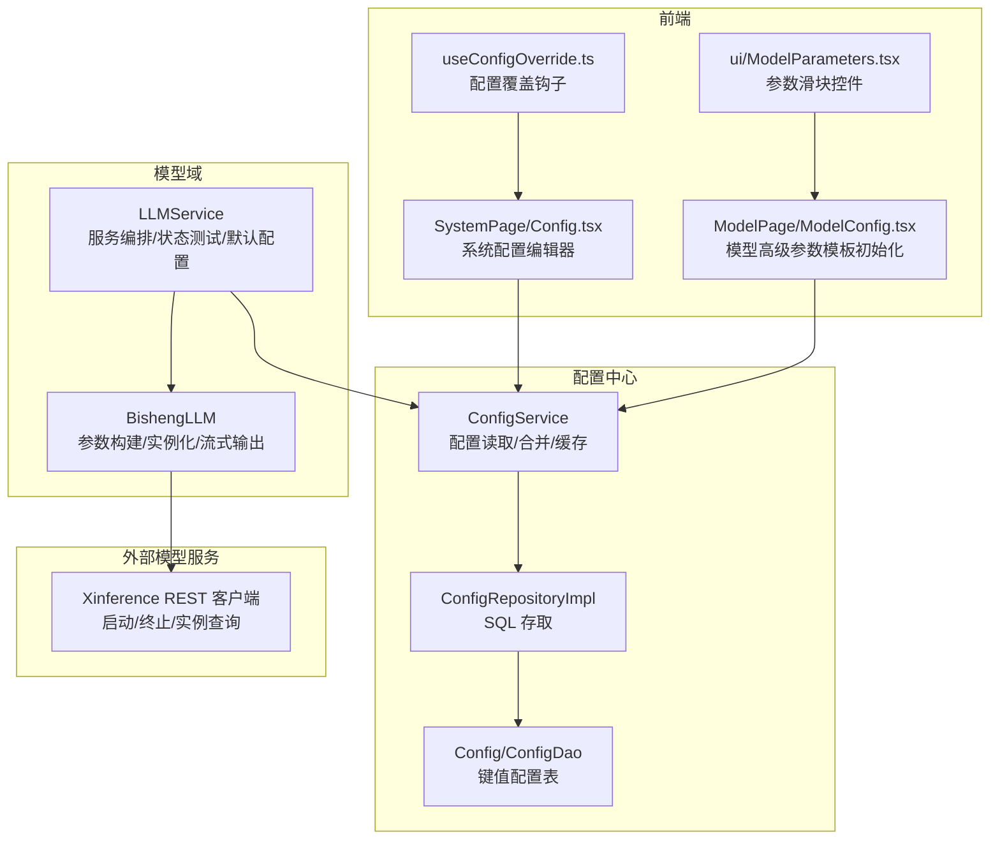
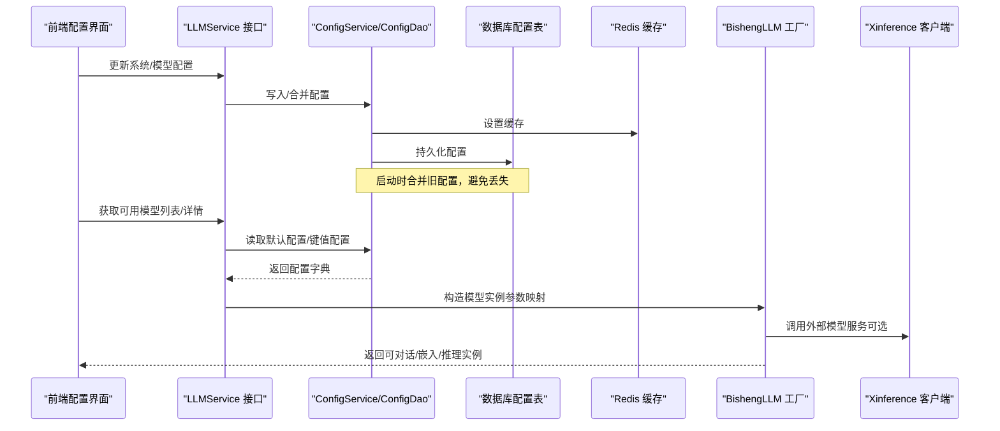
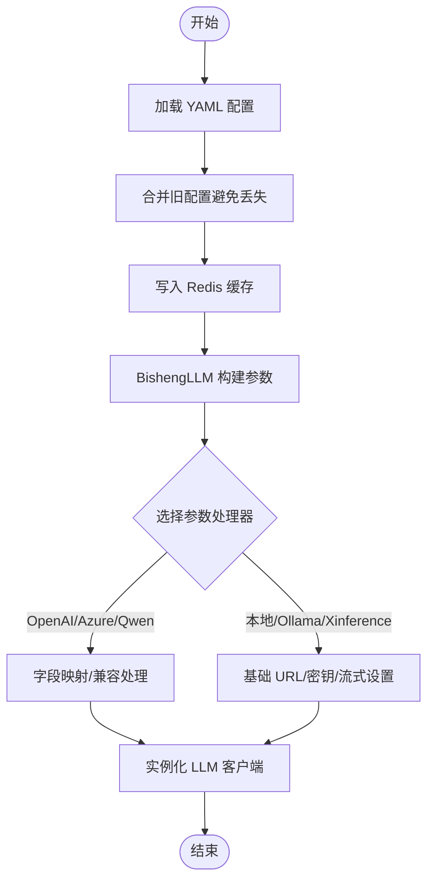
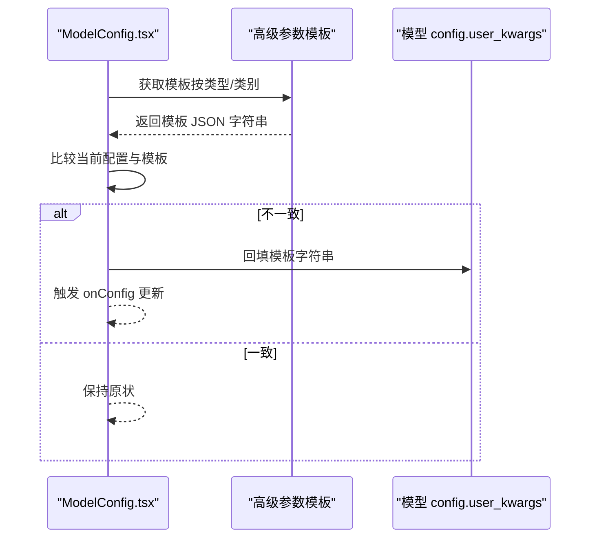
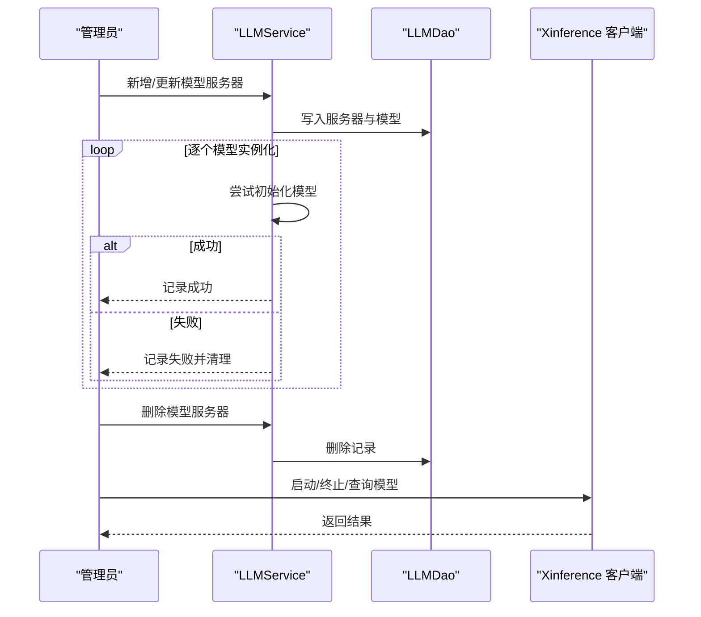
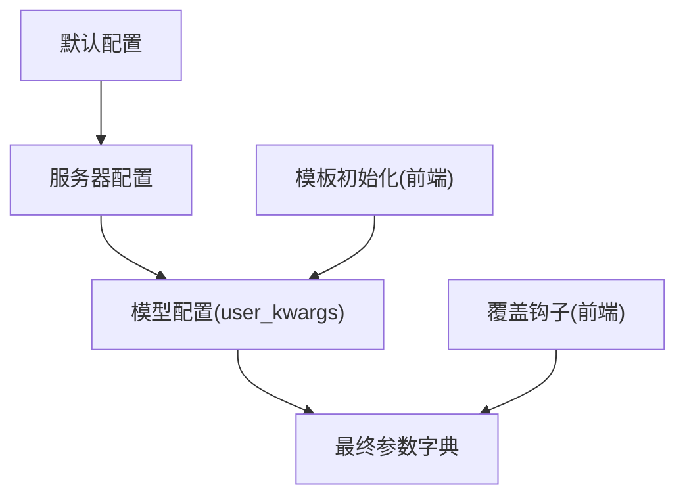
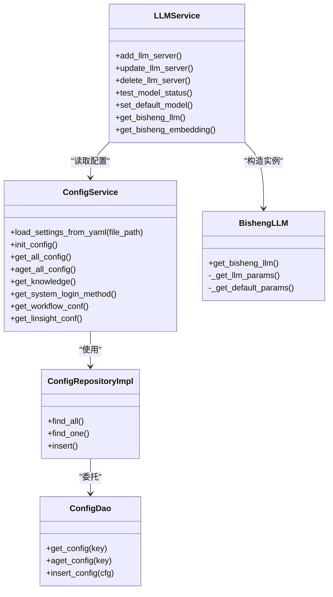

# 模型配置管理

<cite>
**本文引用的文件**
- [src/backend/bisheng/common/services/config_service.py](file://src/backend/bisheng/common/services/config_service.py)
- [src/backend/bisheng/common/repositories/interfaces/config_repository.py](file://src/backend/bisheng/common/repositories/interfaces/config_repository.py)
- [src/backend/bisheng/common/repositories/implementations/config_repository_impl.py](file://src/backend/bisheng/common/repositories/implementations/config_repository_impl.py)
- [src/backend/bisheng/common/models/config.py](file://src/backend/bisheng/common/models/config.py)
- [src/backend/bisheng/llm/domain/llm/llm.py](file://src/backend/bisheng/llm/domain/llm/llm.py)
- [src/backend/bisheng/llm/domain/services/llm.py](file://src/backend/bisheng/llm/domain/services/llm.py)
- [src/backend/bisheng/core/ai/rerank/xinference/client/restful/restful_client.py](file://src/backend/bisheng/core/ai/rerank/xinference/client/restful/restful_client.py)
- [src/backend/bisheng/core/ai/rerank/xinference/client/restful/async_restful_client.py](file://src/backend/bisheng/core/ai/rerank/xinference/client/restful/async_restful_client.py)
- [src/backend/bisheng/database/models/template.py](file://src/backend/bisheng/database/models/template.py)
- [src/backend/bisheng/workflow/nodes/prompt_template.py](file://src/backend/bisheng/workflow/nodes/prompt_template.py)
- [src/frontend/platform/src/pages/SystemPage/components/Config.tsx](file://src/frontend/platform/src/pages/SystemPage/components/Config.tsx)
- [src/frontend/client/src/hooks/Config/useConfigOverride.ts](file://src/frontend/client/src/hooks/Config/useConfigOverride.ts)
- [src/frontend/platform/src/pages/ModelPage/manage/ModelConfig.tsx](file://src/frontend/platform/src/pages/ModelPage/manage/ModelConfig.tsx)
- [src/frontend/client/src/components/ui/ModelParameters.tsx](file://src/frontend/client/src/components/ui/ModelParameters.tsx)
- [src/backend/bisheng/common/errcode/llm.py](file://src/backend/bisheng/common/errcode/llm.py)
</cite>

## 目录
1. [简介](#简介)
2. [项目结构](#项目结构)
3. [核心组件](#核心组件)
4. [架构总览](#架构总览)
5. [详细组件分析](#详细组件分析)
6. [依赖关系分析](#依赖关系分析)
7. [性能考量](#性能考量)
8. [故障排查指南](#故障排查指南)
9. [结论](#结论)
10. [附录](#附录)

## 简介
本技术文档围绕 LLM 模型配置管理模块，系统阐述统一的模型配置体系：包括模型参数标准化、配置模板与高级参数管理、动态加载与生命周期管理（启动、停止、重启、健康检查）、版本控制与配置继承/覆盖、参数校验与类型转换、以及性能优化、资源限制与并发控制策略。同时给出配置热更新、A/B 测试与灰度发布的实现建议。

## 项目结构
该模块横跨后端服务层、领域模型层、数据库模型与前端配置界面，形成“配置中心—模型工厂—运行时客户端”的闭环。

图表来源
- [src/backend/bisheng/common/services/config_service.py](file://src/backend/bisheng/common/services/config_service.py#L58-L236)
- [src/backend/bisheng/common/repositories/implementations/config_repository_impl.py](file://src/backend/bisheng/common/repositories/implementations/config_repository_impl.py#L8-L13)
- [src/backend/bisheng/common/models/config.py](file://src/backend/bisheng/common/models/config.py#L12-L89)
- [src/backend/bisheng/llm/domain/services/llm.py](file://src/backend/bisheng/llm/domain/services/llm.py#L32-L710)
- [src/backend/bisheng/llm/domain/llm/llm.py](file://src/backend/bisheng/llm/domain/llm/llm.py#L181-L459)
- [src/backend/bisheng/core/ai/rerank/xinference/client/restful/restful_client.py](file://src/backend/bisheng/core/ai/rerank/xinference/client/restful/restful_client.py#L1265-L1385)
- [src/frontend/platform/src/pages/SystemPage/components/Config.tsx](file://src/frontend/platform/src/pages/SystemPage/components/Config.tsx#L1-L40)
- [src/frontend/platform/src/pages/ModelPage/manage/ModelConfig.tsx](file://src/frontend/platform/src/pages/ModelPage/manage/ModelConfig.tsx#L58-L91)
- [src/frontend/client/src/hooks/Config/useConfigOverride.ts](file://src/frontend/client/src/hooks/Config/useConfigOverride.ts#L16-L45)

章节来源
- [src/backend/bisheng/common/services/config_service.py](file://src/backend/bisheng/common/services/config_service.py#L58-L236)
- [src/backend/bisheng/llm/domain/services/llm.py](file://src/backend/bisheng/llm/domain/services/llm.py#L32-L710)

## 核心组件
- 配置中心（ConfigService）：负责从 YAML 初始化配置、合并旧配置、缓存到 Redis、按需读取到内存；提供知识库、登录方式、工作流等多类配置的访问接口。
- 配置仓储（ConfigRepositoryImpl/ConfigDao）：基于 SQLModel 的持久化接口，支持异步/同步读写。
- 模型服务（LLMService）：负责模型服务器的增删改查、模型状态测试、默认模型配置设置、不同应用上下文下的模型获取。
- 模型工厂（BishengLLM）：根据服务器类型与模型配置，构造参数映射函数，生成具体 LLM 客户端实例，并处理流式输出与特殊平台适配。
- 外部模型服务客户端（Xinference REST 客户端）：提供模型启动、终止、实例信息查询等能力，支撑模型服务器生命周期管理。
- 前端配置界面：系统级配置编辑器、模型高级参数模板初始化、参数滑块控件、配置覆盖钩子，用于热更新与灰度发布。

章节来源
- [src/backend/bisheng/common/services/config_service.py](file://src/backend/bisheng/common/services/config_service.py#L58-L236)
- [src/backend/bisheng/common/repositories/implementations/config_repository_impl.py](file://src/backend/bisheng/common/repositories/implementations/config_repository_impl.py#L8-L13)
- [src/backend/bisheng/llm/domain/services/llm.py](file://src/backend/bisheng/llm/domain/services/llm.py#L32-L710)
- [src/backend/bisheng/llm/domain/llm/llm.py](file://src/backend/bisheng/llm/domain/llm/llm.py#L181-L459)
- [src/backend/bisheng/core/ai/rerank/xinference/client/restful/restful_client.py](file://src/backend/bisheng/core/ai/rerank/xinference/client/restful/restful_client.py#L1265-L1385)

## 架构总览
统一配置系统以“键值配置表 + 缓存 + 动态加载”为核心，结合模型域的服务编排与工厂模式，实现参数标准化、模板化与动态实例化。

图表来源
- [src/backend/bisheng/common/services/config_service.py](file://src/backend/bisheng/common/services/config_service.py#L98-L174)
- [src/backend/bisheng/llm/domain/services/llm.py](file://src/backend/bisheng/llm/domain/services/llm.py#L32-L152)
- [src/backend/bisheng/llm/domain/llm/llm.py](file://src/backend/bisheng/llm/domain/llm/llm.py#L242-L271)
- [src/backend/bisheng/core/ai/rerank/xinference/client/restful/restful_client.py](file://src/backend/bisheng/core/ai/rerank/xinference/client/restful/restful_client.py#L1265-L1385)

## 详细组件分析

### 统一配置系统与参数标准化
- 配置来源与合并
  - 通过 YAML 加载系统默认配置与节点默认模板，支持自定义环境变量占位符解析。
  - 启动时合并旧配置，避免迁移丢失，优先保留数据库中已存在的键值。
- 键值配置模型
  - 使用枚举定义关键配置键（如知识库默认模型、工作台模型、评估模型等），确保键名一致性与可维护性。
- 参数标准化与优先级
  - 工厂方法按“实例化传参 > 高级参数 > 默认值”顺序构建参数字典，保证上层调用可控。
  - 不同模型类型（如 OpenAI、Azure、Qwen、Minimax 等）通过参数处理器进行字段映射与兼容。

图表来源
- [src/backend/bisheng/common/services/config_service.py](file://src/backend/bisheng/common/services/config_service.py#L74-L138)
- [src/backend/bisheng/llm/domain/llm/llm.py](file://src/backend/bisheng/llm/domain/llm/llm.py#L35-L178)
- [src/backend/bisheng/llm/domain/llm/llm.py](file://src/backend/bisheng/llm/domain/llm/llm.py#L242-L271)

章节来源
- [src/backend/bisheng/common/services/config_service.py](file://src/backend/bisheng/common/services/config_service.py#L74-L138)
- [src/backend/bisheng/common/models/config.py](file://src/backend/bisheng/common/models/config.py#L12-L89)
- [src/backend/bisheng/llm/domain/llm/llm.py](file://src/backend/bisheng/llm/domain/llm/llm.py#L35-L178)
- [src/backend/bisheng/llm/domain/llm/llm.py](file://src/backend/bisheng/llm/domain/llm/llm.py#L242-L271)

### 配置模板管理与高级参数
- 模板初始化与回填
  - 前端在打开模型配置对话框时，根据模型类型与类别（LLM/Embedding）加载高级参数模板，将模板 JSON 字符串写入用户自定义参数字段。
  - 若当前配置与模板不一致，自动回填模板内容并触发配置变更回调。
- 模板数据模型
  - 模板实体包含名称、描述、数据体、排序号、流程类型等字段，便于分类管理与版本化。
- 提示词模板解析（扩展）
  - 提示词节点支持特定占位符语法与变量提取，保障模板渲染与变量替换的稳定性。

图表来源
- [src/frontend/platform/src/pages/ModelPage/manage/ModelConfig.tsx](file://src/frontend/platform/src/pages/ModelPage/manage/ModelConfig.tsx#L58-L91)
- [src/backend/bisheng/database/models/template.py](file://src/backend/bisheng/database/models/template.py#L11-L54)
- [src/backend/bisheng/workflow/nodes/prompt_template.py](file://src/backend/bisheng/workflow/nodes/prompt_template.py#L8-L49)

章节来源
- [src/frontend/platform/src/pages/ModelPage/manage/ModelConfig.tsx](file://src/frontend/platform/src/pages/ModelPage/manage/ModelConfig.tsx#L58-L91)
- [src/backend/bisheng/database/models/template.py](file://src/backend/bisheng/database/models/template.py#L11-L54)
- [src/backend/bisheng/workflow/nodes/prompt_template.py](file://src/backend/bisheng/workflow/nodes/prompt_template.py#L8-L49)

### 动态加载与模型服务器生命周期
- 生命周期管理
  - 添加/更新模型服务器：先入库，再逐个尝试实例化模型，失败则回滚或清理失败项。
  - 删除模型服务器：直接删除关联记录。
  - 模型状态测试：对新增/变更模型执行最小化调用，检测可用性并更新状态。
- 外部模型服务（Xinference）
  - 支持启动模型（可选择等待就绪）、终止模型、取消启动、查询实例信息、获取内部地址等。
  - 通过 RESTful API 与外部服务交互，实现模型的动态启停与可观测。

图表来源
- [src/backend/bisheng/llm/domain/services/llm.py](file://src/backend/bisheng/llm/domain/services/llm.py#L67-L129)
- [src/backend/bisheng/llm/domain/services/llm.py](file://src/backend/bisheng/llm/domain/services/llm.py#L131-L135)
- [src/backend/bisheng/llm/domain/services/llm.py](file://src/backend/bisheng/llm/domain/services/llm.py#L154-L184)
- [src/backend/bisheng/core/ai/rerank/xinference/client/restful/restful_client.py](file://src/backend/bisheng/core/ai/rerank/xinference/client/restful/restful_client.py#L1265-L1385)

章节来源
- [src/backend/bisheng/llm/domain/services/llm.py](file://src/backend/bisheng/llm/domain/services/llm.py#L67-L129)
- [src/backend/bisheng/llm/domain/services/llm.py](file://src/backend/bisheng/llm/domain/services/llm.py#L131-L135)
- [src/backend/bisheng/llm/domain/services/llm.py](file://src/backend/bisheng/llm/domain/services/llm.py#L154-L184)
- [src/backend/bisheng/core/ai/rerank/xinference/client/restful/restful_client.py](file://src/backend/bisheng/core/ai/rerank/xinference/client/restful/restful_client.py#L1265-L1385)

### 版本控制、继承与覆盖机制
- 配置版本化
  - 通过键值配置表区分不同场景（知识库、助手、评估、工作台、Ideas 等），每个键对应一套 JSON 配置，便于版本化管理与回滚。
- 继承与覆盖
  - 服务器配置与模型配置采用“默认值 + 用户高级参数”的叠加策略；若用户未显式设置，则使用默认流式/温度/最大 token 等。
  - 更新服务器时，使用掩码合并策略更新敏感字段，避免覆盖非目标配置。
- 前端覆盖
  - 通过配置覆盖钩子在客户端临时覆盖端点与模型配置，支持灰度与 A/B 场景。

图表来源
- [src/backend/bisheng/llm/domain/llm/llm.py](file://src/backend/bisheng/llm/domain/llm/llm.py#L251-L271)
- [src/backend/bisheng/llm/domain/services/llm.py](file://src/backend/bisheng/llm/domain/services/llm.py#L276-L277)
- [src/frontend/client/src/hooks/Config/useConfigOverride.ts](file://src/frontend/client/src/hooks/Config/useConfigOverride.ts#L16-L45)
- [src/frontend/platform/src/pages/ModelPage/manage/ModelConfig.tsx](file://src/frontend/platform/src/pages/ModelPage/manage/ModelConfig.tsx#L70-L91)

章节来源
- [src/backend/bisheng/llm/domain/llm/llm.py](file://src/backend/bisheng/llm/domain/llm/llm.py#L251-L271)
- [src/backend/bisheng/llm/domain/services/llm.py](file://src/backend/bisheng/llm/domain/services/llm.py#L276-L277)
- [src/frontend/client/src/hooks/Config/useConfigOverride.ts](file://src/frontend/client/src/hooks/Config/useConfigOverride.ts#L16-L45)
- [src/frontend/platform/src/pages/ModelPage/manage/ModelConfig.tsx](file://src/frontend/platform/src/pages/ModelPage/manage/ModelConfig.tsx#L70-L91)

### 参数验证、默认值与类型转换
- 参数优先级与默认值
  - 实例化参数最高优先；其次为高级参数中的 streaming/temperature/max_tokens；最后为模型配置中的默认值。
- 类型转换与容错
  - 前端参数控件根据步长与范围计算小数位数，后端在参数映射阶段对整型/浮点型进行安全转换，避免异常。
- 模板参数校验
  - 模型配置对话框在初始化模板时，若模板与当前配置不一致，会自动回填并触发配置变更，减少无效配置。

章节来源
- [src/backend/bisheng/llm/domain/llm/llm.py](file://src/backend/bisheng/llm/domain/llm/llm.py#L257-L271)
- [src/backend/bisheng/graph/vertex/base.py](file://src/backend/bisheng/graph/vertex/base.py#L217-L243)
- [src/frontend/client/src/components/ui/ModelParameters.tsx](file://src/frontend/client/src/components/ui/ModelParameters.tsx#L1-L185)
- [src/frontend/platform/src/pages/ModelPage/manage/ModelConfig.tsx](file://src/frontend/platform/src/pages/ModelPage/manage/ModelConfig.tsx#L70-L91)

### 性能调优、资源限制与并发控制
- 并发与限流
  - 服务器配置支持开启/关闭限流标志与限流阈值，便于在高并发场景下保护下游模型服务。
- 缓存与预热
  - 配置读取使用 Redis 缓存，减少数据库压力；TTS 语音合成结果缓存至 Redis，对象存储上传后返回分享链接。
- 流式输出
  - 默认启用流式输出，提升用户体验；针对特定模型（如 Qwen）进行结果格式转换，保证输出一致性。

章节来源
- [src/backend/bisheng/llm/domain/services/llm.py](file://src/backend/bisheng/llm/domain/services/llm.py#L274-L277)
- [src/backend/bisheng/llm/domain/llm/llm.py](file://src/backend/bisheng/llm/domain/llm/llm.py#L434-L458)
- [src/backend/bisheng/llm/domain/llm/llm.py](file://src/backend/bisheng/llm/domain/llm/llm.py#L34-L46)
- [src/backend/bisheng/llm/domain/llm/llm.py](file://src/backend/bisheng/llm/domain/llm/llm.py#L257-L265)
- [src/backend/bisheng/llm/domain/services/llm.py](file://src/backend/bisheng/llm/domain/services/llm.py#L689-L708)

### 配置热更新、A/B 测试与灰度发布
- 系统配置热更新
  - 系统配置编辑器支持在线保存 YAML，前端校验格式后提交，后端写入配置并刷新缓存。
- 前端配置覆盖
  - 通过覆盖钩子在客户端临时覆盖端点与模型配置，适用于灰度与 A/B 场景；支持取消覆盖恢复默认。
- 模型参数模板
  - 通过模板初始化与回填，快速在不同模型间切换参数风格，辅助灰度验证。

章节来源
- [src/frontend/platform/src/pages/SystemPage/components/Config.tsx](file://src/frontend/platform/src/pages/SystemPage/components/Config.tsx#L1-L40)
- [src/frontend/client/src/hooks/Config/useConfigOverride.ts](file://src/frontend/client/src/hooks/Config/useConfigOverride.ts#L16-L45)
- [src/frontend/platform/src/pages/ModelPage/manage/ModelConfig.tsx](file://src/frontend/platform/src/pages/ModelPage/manage/ModelConfig.tsx#L70-L91)

## 依赖关系分析

图表来源
- [src/backend/bisheng/common/services/config_service.py](file://src/backend/bisheng/common/services/config_service.py#L58-L236)
- [src/backend/bisheng/common/repositories/implementations/config_repository_impl.py](file://src/backend/bisheng/common/repositories/implementations/config_repository_impl.py#L8-L13)
- [src/backend/bisheng/common/models/config.py](file://src/backend/bisheng/common/models/config.py#L57-L89)
- [src/backend/bisheng/llm/domain/services/llm.py](file://src/backend/bisheng/llm/domain/services/llm.py#L32-L710)
- [src/backend/bisheng/llm/domain/llm/llm.py](file://src/backend/bisheng/llm/domain/llm/llm.py#L181-L459)

章节来源
- [src/backend/bisheng/common/services/config_service.py](file://src/backend/bisheng/common/services/config_service.py#L58-L236)
- [src/backend/bisheng/llm/domain/services/llm.py](file://src/backend/bisheng/llm/domain/services/llm.py#L32-L710)
- [src/backend/bisheng/llm/domain/llm/llm.py](file://src/backend/bisheng/llm/domain/llm/llm.py#L181-L459)

## 性能考量
- 配置读取性能
  - 使用 Redis 缓存配置，减少数据库访问频率；缓存键包含配置键，过期时间合理设置。
- 模型实例化性能
  - 在添加/更新服务器时，先做最小化调用（如 hello 文本）验证可用性，避免无效实例占用资源。
- 输出性能
  - 默认启用流式输出，降低首字节延迟；针对多模态模型进行结果格式转换，避免额外序列化开销。
- 缓存策略
  - TTS 结果缓存与对象存储分享链接，减少重复生成与网络传输。

章节来源
- [src/backend/bisheng/common/services/config_service.py](file://src/backend/bisheng/common/services/config_service.py#L140-L174)
- [src/backend/bisheng/llm/domain/services/llm.py](file://src/backend/bisheng/llm/domain/services/llm.py#L154-L184)
- [src/backend/bisheng/llm/domain/llm/llm.py](file://src/backend/bisheng/llm/domain/llm/llm.py#L434-L458)
- [src/backend/bisheng/llm/domain/services/llm.py](file://src/backend/bisheng/llm/domain/services/llm.py#L689-L708)

## 故障排查指南
- 服务器名称重复
  - 当修改服务器名称时若已存在同名服务器，将抛出重复错误；请更换唯一名称后重试。
- 模型名称重复
  - 在同一服务器内模型名称不可重复；请调整模型名称后重试。
- 全量添加失败
  - 若所有模型初始化均失败，将删除刚创建的服务器并提示全量添加失败。
- 部分添加失败
  - 若部分模型初始化失败，仅保留成功模型并清理失败项，同时返回混合错误信息。
- 模型离线/类型不符
  - 实例化前会校验模型是否在线及类型是否匹配；若不满足条件将抛出相应错误。

章节来源
- [src/backend/bisheng/common/errcode/llm.py](file://src/backend/bisheng/common/errcode/llm.py#L1-L22)
- [src/backend/bisheng/llm/domain/services/llm.py](file://src/backend/bisheng/llm/domain/services/llm.py#L67-L129)
- [src/backend/bisheng/llm/domain/llm/llm.py](file://src/backend/bisheng/llm/domain/llm/llm.py#L208-L221)

## 结论
本配置管理模块通过“统一配置中心 + 参数标准化 + 模板化高级参数 + 动态实例化 + 生命周期管理 + 前端覆盖”的完整链路，实现了 LLM 模型的可运维、可灰度、可扩展的配置体系。配合缓存与流式输出等性能优化手段，可在复杂场景下稳定运行并支持持续演进。

## 附录
- 关键配置键枚举
  - 知识库默认模型、助手默认模型、评估默认模型、工作流默认模型、工作台模型、Ideas 默认模型等。
- 建议最佳实践
  - 使用模板初始化高级参数，避免手写错误；
  - 在灰度发布中结合前端覆盖钩子与系统配置编辑器；
  - 对高并发场景启用限流与缓存，关注流式输出与结果格式一致性。

章节来源
- [src/backend/bisheng/common/models/config.py](file://src/backend/bisheng/common/models/config.py#L12-L22)