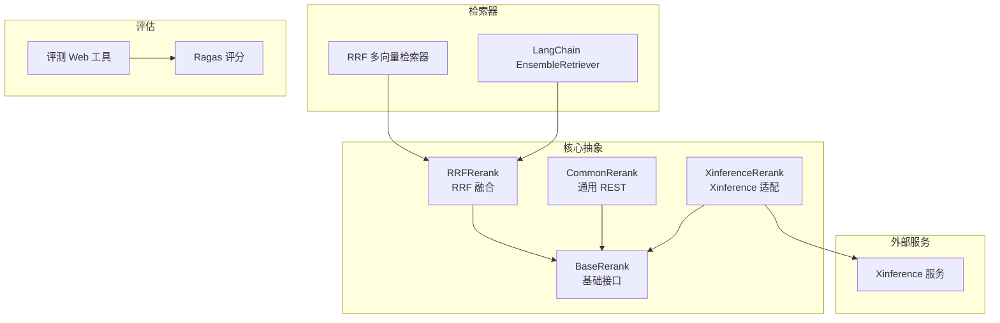
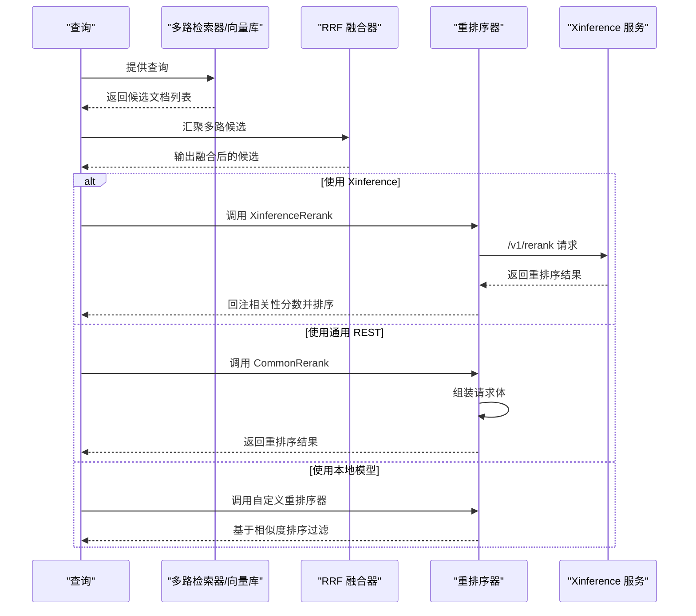
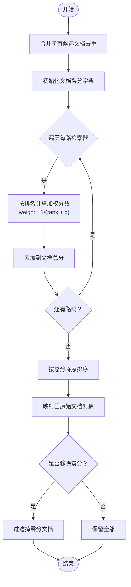
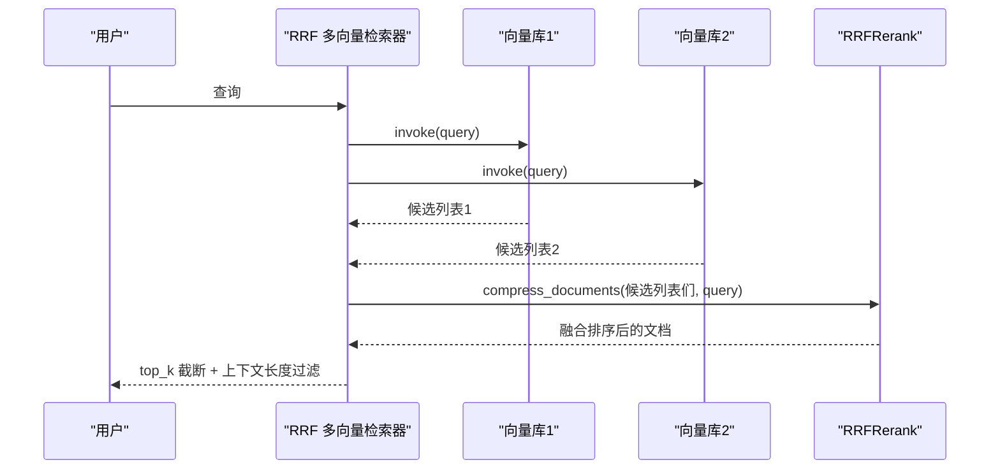
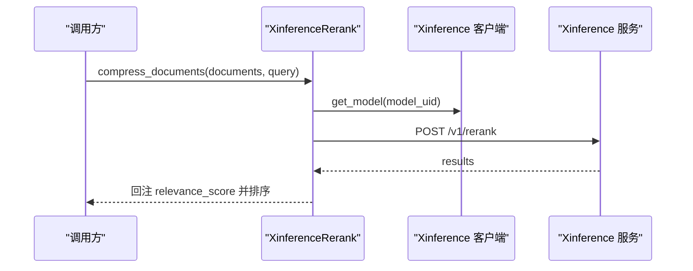
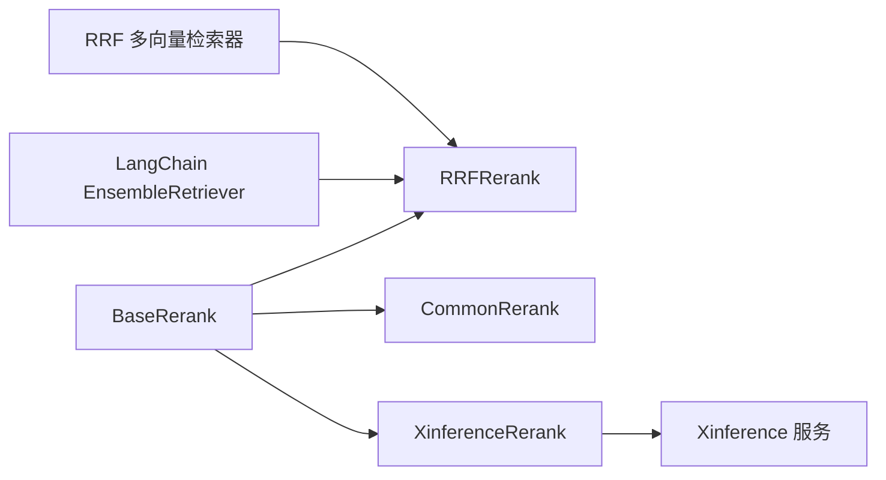

# 重排序服务

<cite>
**本文引用的文件**
- [src/backend/bisheng/core/ai/base.py](file://src/backend/bisheng/core/ai/base.py)
- [src/backend/bisheng/core/ai/rerank/rrf_rerank.py](file://src/backend/bisheng/core/ai/rerank/rrf_rerank.py)
- [src/backend/bisheng/core/ai/rerank/common_rerank.py](file://src/backend/bisheng/core/ai/rerank/common_rerank.py)
- [src/backend/bisheng/core/ai/rerank/xinference_rerank.py](file://src/backend/bisheng/core/ai/rerank/xinference_rerank.py)
- [src/backend/bisheng/core/ai/rerank/xinference/client/restful/restful_client.py](file://src/backend/bisheng/core/ai/rerank/xinference/client/restful/restful_client.py)
- [src/backend/bisheng/core/vectorstore/ensemble_retriever.py](file://src/backend/bisheng/core/vectorstore/ensemble_retriever.py)
- [src/backend/bisheng_langchain/retrievers/ensemble.py](file://src/backend/bisheng_langchain/retrievers/ensemble.py)
- [src/backend/bisheng_langchain/rag/rerank/rerank.py](file://src/backend/bisheng_langchain/rag/rerank/rerank.py)
- [src/backend/bisheng/llm/domain/llm/rerank.py](file://src/backend/bisheng/llm/domain/llm/rerank.py)
- [src/backend/bisheng_langchain/rag/scoring/ragas_score.py](file://src/backend/bisheng_langchain/rag/scoring/ragas_score.py)
- [src/backend/bisheng_langchain/rag/run_rag_evaluate_web.py](file://src/backend/bisheng_langchain/rag/run_rag_evaluate_web.py)
</cite>

## 目录
1. [引言](#引言)
2. [项目结构](#项目结构)
3. [核心组件](#核心组件)
4. [架构总览](#架构总览)
5. [详细组件分析](#详细组件分析)
6. [依赖关系分析](#依赖关系分析)
7. [性能考量](#性能考量)
8. [故障排查指南](#故障排查指南)
9. [结论](#结论)
10. [附录](#附录)

## 引言
本技术文档聚焦于 LLM 重排序服务模块，系统阐述重排序在 RAG 管道中的关键作用：从多路检索结果中融合与排序，提升最终上下文质量与下游问答效果。文档覆盖以下重点：
- 重排序算法实现原理：交叉熵重排序、RRF（Reciprocal Rank Fusion）等策略
- 重排序服务在 RAG 管道中的位置与职责：查询-文档匹配、相关性评分与结果排序
- Xinference 重排序器的集成方式与配置要点
- 性能优化、批量处理与缓存策略
- 不同重排序算法的适用场景、参数调优与效果评估方法
- 自定义重排序器的开发指南与集成最佳实践

## 项目结构
围绕重排序能力，代码主要分布在如下区域：
- 核心抽象与通用实现：重排序基类、RRF 实现、通用 REST 接口封装
- 向量库与检索器：多向量库 RRF 融合检索器、LangChain EnsembleRetriever
- Xinference 集成：Xinference 客户端与重排序适配器
- 自定义重排序器：基于 Transformers 的本地模型
- 评估体系：Ragas 评分与 Web 评测工具

图表来源
- [src/backend/bisheng/core/ai/base.py](file://src/backend/bisheng/core/ai/base.py#L116-L150)
- [src/backend/bisheng/core/ai/rerank/rrf_rerank.py](file://src/backend/bisheng/core/ai/rerank/rrf_rerank.py#L10-L84)
- [src/backend/bisheng/core/ai/rerank/common_rerank.py](file://src/backend/bisheng/core/ai/rerank/common_rerank.py#L12-L112)
- [src/backend/bisheng/core/ai/rerank/xinference_rerank.py](file://src/backend/bisheng/core/ai/rerank/xinference_rerank.py#L12-L45)
- [src/backend/bisheng/core/vectorstore/ensemble_retriever.py](file://src/backend/bisheng/core/vectorstore/ensemble_retriever.py#L26-L139)
- [src/backend/bisheng_langchain/retrievers/ensemble.py](file://src/backend/bisheng_langchain/retrievers/ensemble.py#L18-L191)
- [src/backend/bisheng_langchain/rag/scoring/ragas_score.py](file://src/backend/bisheng_langchain/rag/scoring/ragas_score.py#L1-L144)
- [src/backend/bisheng_langchain/rag/run_rag_evaluate_web.py](file://src/backend/bisheng_langchain/rag/run_rag_evaluate_web.py#L1-L55)

章节来源
- [src/backend/bisheng/core/ai/base.py](file://src/backend/bisheng/core/ai/base.py#L116-L150)
- [src/backend/bisheng/core/vectorstore/ensemble_retriever.py](file://src/backend/bisheng/core/vectorstore/ensemble_retriever.py#L26-L139)
- [src/backend/bisheng_langchain/retrievers/ensemble.py](file://src/backend/bisheng_langchain/retrievers/ensemble.py#L18-L191)

## 核心组件
- 重排序基类 BaseRerank：统一 compress_documents 接口，提供 sort_rerank_result 将重排序结果回注到原始文档并写入相关性分数元数据。
- RRFRerank：基于加权 Reciprocal Rank Fusion 的多路检索结果融合器，支持权重与常数 c 的配置，并可选择移除零分文档。
- CommonRerank：通用 RESTful 重排序客户端，对接 /v1/rerank 接口，支持同步与异步请求。
- XinferenceRerank：Xinference 重排序器适配器，通过 Xinference 客户端调用 /v1/rerank，自动规范化 base_url 并回注相关性分数。
- RRF 多向量检索器：将多个向量库检索结果收集后交由 RRFRerank 融合，并支持 top_k 截断与上下文长度过滤。
- LangChain EnsembleRetriever：对多个检索器执行并行或串行检索，再以 RRF 融合输出。
- 自定义重排序器：基于 Transformers 的本地模型，计算 query-chunk 相似度并排序过滤。
- 评估工具：Ragas 评分与 Web 评测界面，用于量化评估重排序效果。

章节来源
- [src/backend/bisheng/core/ai/base.py](file://src/backend/bisheng/core/ai/base.py#L116-L150)
- [src/backend/bisheng/core/ai/rerank/rrf_rerank.py](file://src/backend/bisheng/core/ai/rerank/rrf_rerank.py#L10-L84)
- [src/backend/bisheng/core/ai/rerank/common_rerank.py](file://src/backend/bisheng/core/ai/rerank/common_rerank.py#L12-L112)
- [src/backend/bisheng/core/ai/rerank/xinference_rerank.py](file://src/backend/bisheng/core/ai/rerank/xinference_rerank.py#L12-L45)
- [src/backend/bisheng/core/vectorstore/ensemble_retriever.py](file://src/backend/bisheng/core/vectorstore/ensemble_retriever.py#L26-L139)
- [src/backend/bisheng_langchain/retrievers/ensemble.py](file://src/backend/bisheng_langchain/retrievers/ensemble.py#L18-L191)
- [src/backend/bisheng_langchain/rag/rerank/rerank.py](file://src/backend/bisheng_langchain/rag/rerank/rerank.py#L5-L48)
- [src/backend/bisheng_langchain/rag/scoring/ragas_score.py](file://src/backend/bisheng_langchain/rag/scoring/ragas_score.py#L1-L144)
- [src/backend/bisheng_langchain/rag/run_rag_evaluate_web.py](file://src/backend/bisheng_langchain/rag/run_rag_evaluate_web.py#L1-L55)

## 架构总览
下图展示 RAG 管道中重排序服务的关键交互：检索器返回候选文档，重排序器对候选进行相关性重排，最终输出高质量上下文。

图表来源
- [src/backend/bisheng/core/vectorstore/ensemble_retriever.py](file://src/backend/bisheng/core/vectorstore/ensemble_retriever.py#L64-L112)
- [src/backend/bisheng/core/ai/rerank/rrf_rerank.py](file://src/backend/bisheng/core/ai/rerank/rrf_rerank.py#L39-L84)
- [src/backend/bisheng/core/ai/rerank/common_rerank.py](file://src/backend/bisheng/core/ai/rerank/common_rerank.py#L62-L112)
- [src/backend/bisheng/core/ai/rerank/xinference_rerank.py](file://src/backend/bisheng/core/ai/rerank/xinference_rerank.py#L29-L44)
- [src/backend/bisheng/core/ai/rerank/xinference/client/restful/restful_client.py](file://src/backend/bisheng/core/ai/rerank/xinference/client/restful/restful_client.py#L147-L203)

## 详细组件分析

### RRF（Reciprocal Rank Fusion）重排序
- 设计思想：对来自多路检索器的候选列表进行加权融合，使用公式对每个文档在各路中的排名赋予权重，最终按总分降序排列。
- 关键参数：
  - weights：每路检索器的权重，未显式设置时默认均分
  - c：平滑常数，平衡高排名与低排名的重要性
  - remove_zero_score：是否移除融合后得分为 0 的文档
- 数据流与复杂度：
  - 输入：多路候选文档列表
  - 过程：合并去重、按排名计算加权分数、排序映射回原始文档对象
  - 时间复杂度：O(N 文档 + Σ(路数 × 每路文档数))；空间复杂度：O(N 文档)

图表来源
- [src/backend/bisheng/core/ai/rerank/rrf_rerank.py](file://src/backend/bisheng/core/ai/rerank/rrf_rerank.py#L55-L84)
- [src/backend/bisheng/core/vectorstore/ensemble_retriever.py](file://src/backend/bisheng/core/vectorstore/ensemble_retriever.py#L114-L139)
- [src/backend/bisheng_langchain/retrievers/ensemble.py](file://src/backend/bisheng_langchain/retrievers/ensemble.py#L152-L191)

章节来源
- [src/backend/bisheng/core/ai/rerank/rrf_rerank.py](file://src/backend/bisheng/core/ai/rerank/rrf_rerank.py#L10-L84)
- [src/backend/bisheng/core/vectorstore/ensemble_retriever.py](file://src/backend/bisheng/core/vectorstore/ensemble_retriever.py#L26-L139)
- [src/backend/bisheng_langchain/retrievers/ensemble.py](file://src/backend/bisheng_langchain/retrievers/ensemble.py#L18-L191)

### 多向量库 RRF 检索器
- 功能：将多个向量库实例转换为检索器，收集检索结果后交由 RRFRerank 融合；支持 top_k 截断与最大上下文长度过滤。
- 异步并发：异步模式下并发触发各检索器，使用 gather 收集结果并统一处理异常。
- 错误健壮性：单路检索失败不影响其他路，记录日志并继续执行。

图表来源
- [src/backend/bisheng/core/vectorstore/ensemble_retriever.py](file://src/backend/bisheng/core/vectorstore/ensemble_retriever.py#L64-L112)

章节来源
- [src/backend/bisheng/core/vectorstore/ensemble_retriever.py](file://src/backend/bisheng/core/vectorstore/ensemble_retriever.py#L26-L139)

### LangChain EnsembleRetriever
- 功能：对多个检索器执行并行/串行检索，再以 RRF 融合输出。
- 异步支持：提供同步与异步两种 rank_fusion/arank_fusion 流程。
- 权重与常数：支持 weights 与 c 参数，未设置时按均分权重初始化。

章节来源
- [src/backend/bisheng_langchain/retrievers/ensemble.py](file://src/backend/bisheng_langchain/retrievers/ensemble.py#L18-L191)

### Xinference 重排序器集成
- 客户端：RESTfulRerankModelHandle 提供 /v1/rerank 接口调用，支持 top_n、max_chunks_per_doc、return_documents 等参数。
- 适配器：XinferenceRerank 在 compress_documents 中调用模型 rerank，解析 results 并回注相关性分数。
- 配置要点：
  - base_url：去除末尾 /v1 或 /v1/，确保正确路由
  - api_key：可选认证头
  - model_uid：目标重排序模型标识
- 错误处理：HTTP 非 200 时抛出异常，提示失败详情。

图表来源
- [src/backend/bisheng/core/ai/rerank/xinference_rerank.py](file://src/backend/bisheng/core/ai/rerank/xinference_rerank.py#L29-L44)
- [src/backend/bisheng/core/ai/rerank/xinference/client/restful/restful_client.py](file://src/backend/bisheng/core/ai/rerank/xinference/client/restful/restful_client.py#L147-L203)

章节来源
- [src/backend/bisheng/core/ai/rerank/xinference_rerank.py](file://src/backend/bisheng/core/ai/rerank/xinference_rerank.py#L12-L45)
- [src/backend/bisheng/core/ai/rerank/xinference/client/restful/restful_client.py](file://src/backend/bisheng/core/ai/rerank/xinference/client/restful/restful_client.py#L147-L203)

### 通用 REST 重排序器
- 适用场景：兼容 /v1/rerank 接口的第三方服务，如 vLLM 等。
- 特点：支持同步与异步请求，自动拼装请求体与默认参数，统一解析 results 并回注分数。
- 配置要点：base_url、rerank_endpoint、api_key、model。

章节来源
- [src/backend/bisheng/core/ai/rerank/common_rerank.py](file://src/backend/bisheng/core/ai/rerank/common_rerank.py#L12-L112)

### 自定义重排序器（本地 Transformers）
- 适用场景：无外部服务依赖、对隐私与延迟敏感的场景。
- 实现要点：加载本地模型与分词器，对 query-chunk 对计算相似度，使用阈值过滤与排序。
- 注意事项：需保证设备可用（如 CUDA），合理设置阈值避免空结果。

章节来源
- [src/backend/bisheng_langchain/rag/rerank/rerank.py](file://src/backend/bisheng_langchain/rag/rerank/rerank.py#L5-L48)

### RAG 管道中的角色与流程
- 查询-文档匹配：检索器返回候选，重排序器根据相关性重新打分与排序。
- 相关性评分：Xinference/通用 REST/本地模型分别提供相关性分数；RRF 则基于排名融合。
- 结果排序：统一通过 sort_rerank_result 写入 relevance_score 元数据，便于后续评估与可视化。

章节来源
- [src/backend/bisheng/core/ai/base.py](file://src/backend/bisheng/core/ai/base.py#L139-L150)
- [src/backend/bisheng/core/vectorstore/ensemble_retriever.py](file://src/backend/bisheng/core/vectorstore/ensemble_retriever.py#L114-L139)

## 依赖关系分析
- 组件耦合：
  - RRFRerank 依赖 BaseRerank 接口，同时被 RRF 多向量检索器与 LangChain EnsembleRetriever 使用
  - XinferenceRerank 依赖 Xinference 客户端，提供统一 compress_documents 行为
  - CommonRerank 作为通用适配器，独立于具体检索器实现
- 外部依赖：
  - Xinference 服务：/v1/rerank 接口
  - LangChain：BaseRetriever、Document、BaseDocumentCompressor
  - Transformers：自定义重排序器

图表来源
- [src/backend/bisheng/core/ai/base.py](file://src/backend/bisheng/core/ai/base.py#L116-L150)
- [src/backend/bisheng/core/ai/rerank/rrf_rerank.py](file://src/backend/bisheng/core/ai/rerank/rrf_rerank.py#L10-L84)
- [src/backend/bisheng/core/ai/rerank/common_rerank.py](file://src/backend/bisheng/core/ai/rerank/common_rerank.py#L12-L112)
- [src/backend/bisheng/core/ai/rerank/xinference_rerank.py](file://src/backend/bisheng/core/ai/rerank/xinference_rerank.py#L12-L45)
- [src/backend/bisheng/core/vectorstore/ensemble_retriever.py](file://src/backend/bisheng/core/vectorstore/ensemble_retriever.py#L26-L139)
- [src/backend/bisheng_langchain/retrievers/ensemble.py](file://src/backend/bisheng_langchain/retrievers/ensemble.py#L18-L191)

## 性能考量
- 批量处理与并发
  - 多向量库检索器支持异步并发检索，使用 asyncio.gather 并发等待，减少整体延迟
  - XinferenceRerank 与 CommonRerank 均提供异步版本，适合高吞吐场景
- 上下文长度控制
  - RRF 多向量检索器支持 max_context_length，按字符长度截断，避免超长上下文
- 缓存策略
  - 可结合会话级缓存与检索结果缓存，降低重复查询开销（具体缓存实现位于会话与聊天服务模块）
- 参数调优
  - RRF c 值：增大 c 更重视低排名文档；减小 c 更强调高排名一致性
  - weights：根据各检索器质量动态调整
  - Xinference/通用 REST：合理设置 top_n 与 max_chunks_per_doc 控制输出规模
- 评估与监控
  - 使用 Ragas 评分与评测 Web 工具，对比不同重排序策略的指标变化，指导参数迭代

章节来源
- [src/backend/bisheng/core/vectorstore/ensemble_retriever.py](file://src/backend/bisheng/core/vectorstore/ensemble_retriever.py#L85-L112)
- [src/backend/bisheng/core/ai/rerank/common_rerank.py](file://src/backend/bisheng/core/ai/rerank/common_rerank.py#L88-L112)
- [src/backend/bisheng_langchain/rag/scoring/ragas_score.py](file://src/backend/bisheng_langchain/rag/scoring/ragas_score.py#L1-L144)
- [src/backend/bisheng_langchain/rag/run_rag_evaluate_web.py](file://src/backend/bisheng_langchain/rag/run_rag_evaluate_web.py#L1-L55)

## 故障排查指南
- Xinference 重排序失败
  - 现象：HTTP 非 200，抛出异常
  - 排查：确认 base_url 正确、model_uid 存在、api_key 有效；检查服务端日志
- 重排序结果为空
  - 现象：返回空列表或仅部分文档
  - 排查：确认 documents 非空；检查阈值/权重设置；验证检索器返回是否为空
- RRF 融合异常
  - 现象：权重与路数不一致导致校验失败
  - 排查：确保 weights 与 retrievers 数量一致；未设置时使用默认均分权重
- 评估指标异常
  - 现象：指标波动大或不收敛
  - 排查：检查评测数据质量、批大小、阈值与权重；对比不同策略的 results 结构

章节来源
- [src/backend/bisheng/core/ai/rerank/xinference/client/restful/restful_client.py](file://src/backend/bisheng/core/ai/rerank/xinference/client/restful/restful_client.py#L198-L203)
- [src/backend/bisheng/core/ai/rerank/rrf_rerank.py](file://src/backend/bisheng/core/ai/rerank/rrf_rerank.py#L55-L56)
- [src/backend/bisheng/llm/domain/llm/rerank.py](file://src/backend/bisheng/llm/domain/llm/rerank.py#L69-L86)

## 结论
重排序服务在 RAG 管道中扮演“提纯”角色：通过 RRF 融合与外部/本地重排序器，显著提升候选文档的相关性与上下文质量。Xinference 适配器提供了标准化的外部重排序能力，而 RRF 多向量检索器与 LangChain EnsembleRetriever 则实现了高效的多路融合与并发执行。配合 Ragas 评估体系与 Web 评测工具，可形成从实现到验证的闭环。

## 附录

### 不同重排序算法的适用场景与建议
- RRF 融合
  - 场景：多路检索器互补、需要综合排名信息
  - 建议：先用均权初始化，再依据各检索器质量微调 weights；c 值根据数据分布试调
- Xinference 重排序
  - 场景：需要更强语义相关性、可扩展的分布式推理
  - 建议：合理设置 top_n 与 max_chunks_per_doc；启用异步接口提高吞吐
- 通用 REST 重排序
  - 场景：对接 vLLM 等服务，统一接口
  - 建议：配置 api_key 与 endpoint；关注响应格式一致性
- 本地 Transformers 重排序
  - 场景：隐私敏感、低延迟要求
  - 建议：选择轻量模型；设置合理阈值避免空结果

### 参数调优与效果评估方法
- 参数调优
  - RRF：c 与 weights；多轮实验对比指标
  - Xinference/通用 REST：top_n、max_chunks_per_doc、阈值
  - 本地模型：阈值、设备与批大小
- 效果评估
  - 使用 Ragas 评分与评测 Web 工具，对比不同策略的指标变化，持续迭代

章节来源
- [src/backend/bisheng/core/ai/rerank/rrf_rerank.py](file://src/backend/bisheng/core/ai/rerank/rrf_rerank.py#L18-L29)
- [src/backend/bisheng/core/ai/rerank/common_rerank.py](file://src/backend/bisheng/core/ai/rerank/common_rerank.py#L15-L23)
- [src/backend/bisheng/core/ai/rerank/xinference_rerank.py](file://src/backend/bisheng/core/ai/rerank/xinference_rerank.py#L14-L16)
- [src/backend/bisheng_langchain/rag/scoring/ragas_score.py](file://src/backend/bisheng_langchain/rag/scoring/ragas_score.py#L1-L144)
- [src/backend/bisheng_langchain/rag/run_rag_evaluate_web.py](file://src/backend/bisheng_langchain/rag/run_rag_evaluate_web.py#L1-L55)

### 自定义重排序器开发指南与集成最佳实践
- 开发步骤
  - 选择模型：加载本地 Transformers 模型与分词器
  - 计算相似度：对 query-chunk 对生成分数
  - 排序过滤：按分数排序并设置阈值
- 集成最佳实践
  - 保持与 BaseRerank 接口一致，复用 sort_rerank_result 写入元数据
  - 提供阈值与设备配置，确保鲁棒性
  - 在 RAG 管道中与检索器组合使用，结合 RRF 融合提升稳定性

章节来源
- [src/backend/bisheng/core/ai/base.py](file://src/backend/bisheng/core/ai/base.py#L116-L150)
- [src/backend/bisheng_langchain/rag/rerank/rerank.py](file://src/backend/bisheng_langchain/rag/rerank/rerank.py#L5-L48)