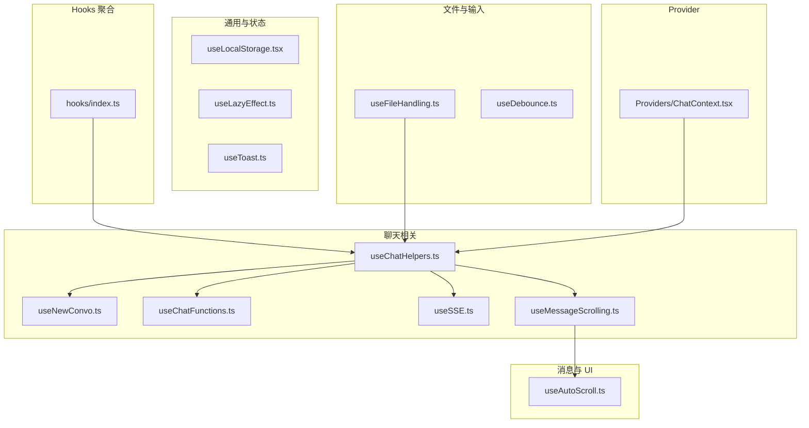
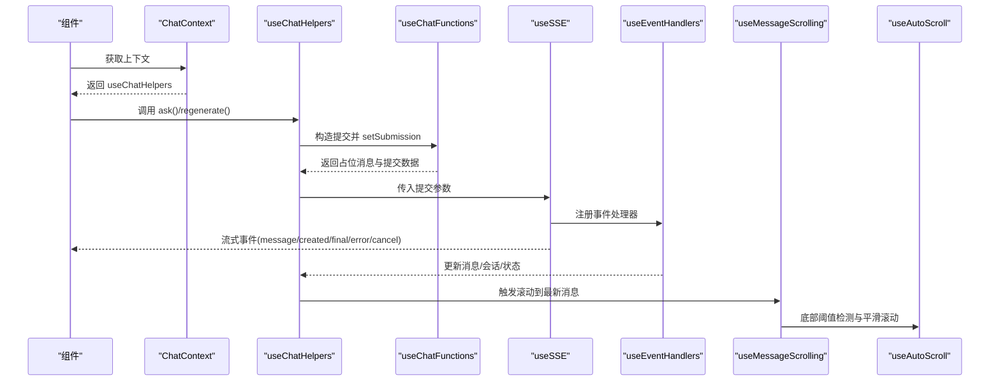
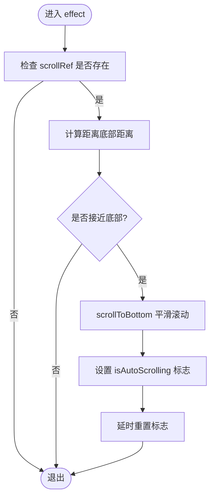
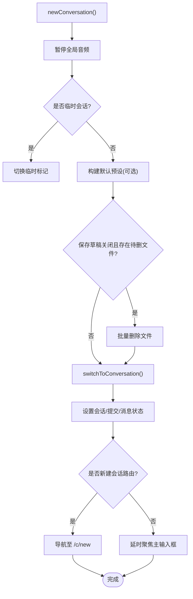
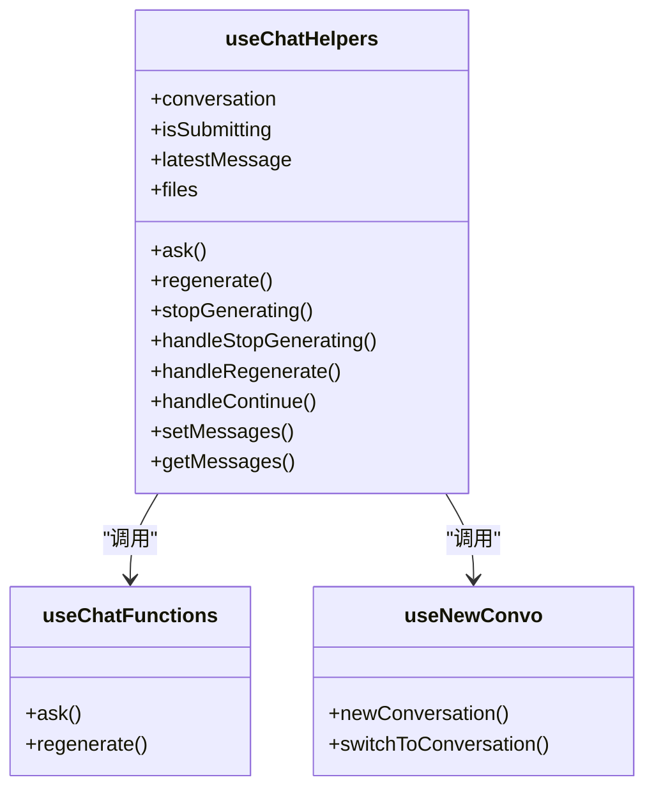
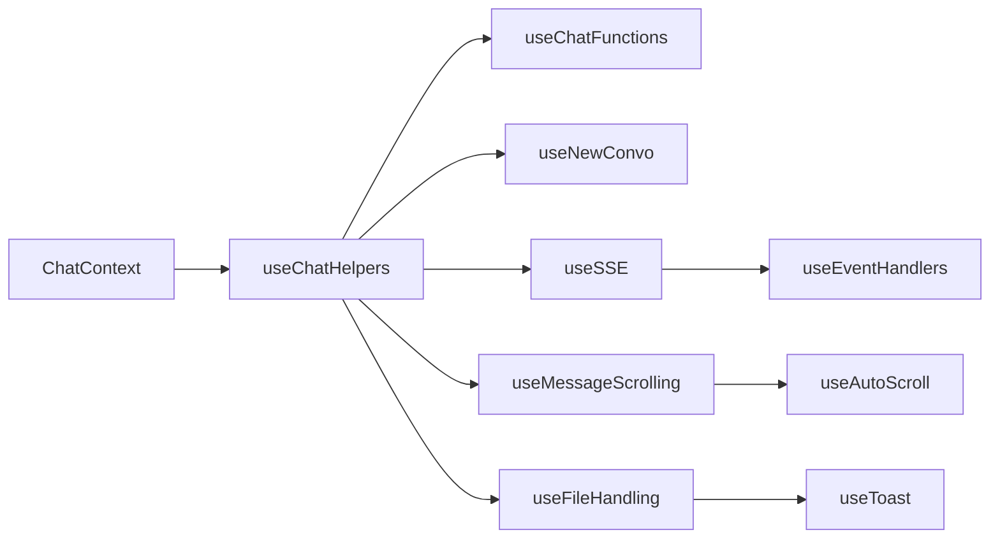

# Hooks 系统

<cite>
**本文引用的文件**
- [src/frontend/client/src/hooks/index.ts](file://src/frontend/client/src/hooks/index.ts)
- [src/frontend/client/src/hooks/useAutoScroll.ts](file://src/frontend/client/src/hooks/useAutoScroll.ts)
- [src/frontend/client/src/hooks/useNewConvo.ts](file://src/frontend/client/src/hooks/useNewConvo.ts)
- [src/frontend/client/src/hooks/Chat/useChatHelpers.ts](file://src/frontend/client/src/hooks/Chat/useChatHelpers.ts)
- [src/frontend/client/src/hooks/Chat/useChatFunctions.ts](file://src/frontend/client/src/hooks/Chat/useChatFunctions.ts)
- [src/frontend/client/src/hooks/Messages/useMessageScrolling.ts](file://src/frontend/client/src/hooks/Messages/useMessageScrolling.ts)
- [src/frontend/client/src/hooks/Files/useFileHandling.ts](file://src/frontend/client/src/hooks/Files/useFileHandling.ts)
- [src/frontend/client/src/hooks/Input/useDebounce.ts](file://src/frontend/client/src/hooks/Input/useDebounce.ts)
- [src/frontend/client/src/hooks/SSE/useSSE.ts](file://src/frontend/client/src/hooks/SSE/useSSE.ts)
- [src/frontend/client/src/hooks/useLocalStorage.tsx](file://src/frontend/client/src/hooks/useLocalStorage.tsx)
- [src/frontend/client/src/hooks/Generic/useLazyEffect.ts](file://src/frontend/client/src/hooks/Generic/useLazyEffect.ts)
- [src/frontend/client/src/hooks/useToast.ts](file://src/frontend/client/src/hooks/useToast.ts)
- [src/frontend/client/src/Providers/ChatContext.tsx](file://src/frontend/client/src/Providers/ChatContext.tsx)
</cite>

## 目录
1. [引言](#引言)
2. [项目结构](#项目结构)
3. [核心组件](#核心组件)
4. [架构总览](#架构总览)
5. [详细组件分析](#详细组件分析)
6. [依赖分析](#依赖分析)
7. [性能考虑](#性能考虑)
8. [故障排查指南](#故障排查指南)
9. [结论](#结论)
10. [附录](#附录)

## 引言
本文件系统性梳理 Bisheng 前端 Hooks 系统的设计与实现，覆盖数据获取、表单处理、UI 交互、生命周期、聊天与消息、文件操作等模块的抽象与封装。重点解析 useAutoScroll、useNewConvo、useChatHelpers、useChatFunctions、useMessageScrolling、useFileHandling、useSSE 等关键 Hooks 的职责边界、组合模式、副作用处理与性能优化策略，并给出在组件中正确使用的参考路径。

## 项目结构
- Hooks 按功能域分层组织于 src/frontend/client/src/hooks 下，例如 Chat、Messages、Files、Input、SSE 等子目录，便于按业务域检索与复用。
- 根导出文件统一聚合导出，便于上层组件按需引入。
- Provider 层通过上下文暴露 useChatHelpers 返回的能力，降低组件耦合度。

图表来源
- [src/frontend/client/src/hooks/index.ts](file://src/frontend/client/src/hooks/index.ts#L1-L35)
- [src/frontend/client/src/Providers/ChatContext.tsx](file://src/frontend/client/src/Providers/ChatContext.tsx#L1-L7)

章节来源
- [src/frontend/client/src/hooks/index.ts](file://src/frontend/client/src/hooks/index.ts#L1-L35)
- [src/frontend/client/src/Providers/ChatContext.tsx](file://src/frontend/client/src/Providers/ChatContext.tsx#L1-L7)

## 核心组件
- 数据获取 Hooks
  - useGetModelsQuery、useGetEndpointsQuery、useGetStartupConfig、useGetUserBalance 等来自数据提供层，配合 React Query 使用，统一管理远端数据与缓存。
- 表单处理 Hooks
  - useDebounce：对输入进行去抖处理，减少无效请求与渲染。
  - useFileHandling：统一处理文件校验、上传、进度、错误提示与取消。
- UI 交互 Hooks
  - useAutoScroll：基于阈值判断与平滑滚动，避免滚动事件干扰。
  - useMessageScrolling：结合 IntersectionObserver 与自动滚动策略，控制“回到底部”按钮显示与滚动行为。
  - useToast：全局通知展示与定时控制。
- 生命周期 Hooks
  - useLocalStorage：本地存储读写与跨标签页同步。
  - useLazyEffect：延迟执行副作用，降低频繁变更带来的开销。
- 聊天与消息 Hooks
  - useNewConvo：构建默认会话、切换会话、清理状态、路由跳转与焦点管理。
  - useChatHelpers：聚合会话、消息、提交状态、文件、预设等能力，对外暴露统一接口。
  - useChatFunctions：构造提交数据、占位响应、文件复用与消息树更新。
  - useSSE：封装 SSE 事件流，解耦消息增量、最终态、错误与停止逻辑。
- 文件操作 Hooks
  - useFileHandling：上传、进度、错误、取消、图片尺寸探测、多端点适配。

章节来源
- [src/frontend/client/src/hooks/Input/useDebounce.ts](file://src/frontend/client/src/hooks/Input/useDebounce.ts#L1-L20)
- [src/frontend/client/src/hooks/Files/useFileHandling.ts](file://src/frontend/client/src/hooks/Files/useFileHandling.ts#L1-L349)
- [src/frontend/client/src/hooks/useAutoScroll.ts](file://src/frontend/client/src/hooks/useAutoScroll.ts#L1-L72)
- [src/frontend/client/src/hooks/Messages/useMessageScrolling.ts](file://src/frontend/client/src/hooks/Messages/useMessageScrolling.ts#L1-L114)
- [src/frontend/client/src/hooks/useLocalStorage.tsx](file://src/frontend/client/src/hooks/useLocalStorage.tsx#L1-L54)
- [src/frontend/client/src/hooks/Generic/useLazyEffect.ts](file://src/frontend/client/src/hooks/Generic/useLazyEffect.ts#L1-L19)
- [src/frontend/client/src/hooks/useNewConvo.ts](file://src/frontend/client/src/hooks/useNewConvo.ts#L1-L292)
- [src/frontend/client/src/hooks/Chat/useChatHelpers.ts](file://src/frontend/client/src/hooks/Chat/useChatHelpers.ts#L1-L253)
- [src/frontend/client/src/hooks/Chat/useChatFunctions.ts](file://src/frontend/client/src/hooks/Chat/useChatFunctions.ts#L1-L366)
- [src/frontend/client/src/hooks/SSE/useSSE.ts](file://src/frontend/client/src/hooks/SSE/useSSE.ts#L1-L249)
- [src/frontend/client/src/hooks/useToast.ts](file://src/frontend/client/src/hooks/useToast.ts#L1-L64)

## 架构总览
下图展示了 Hooks 在聊天流程中的协作关系：组件通过 ChatContext 获取 useChatHelpers，进而调用 useChatFunctions 构造提交，再由 useSSE 订阅服务端事件，期间 useMessageScrolling 与 useAutoScroll 协助 UI 滚动与交互，useFileHandling 处理文件上传与进度，useToast 提供全局提示。

图表来源
- [src/frontend/client/src/Providers/ChatContext.tsx](file://src/frontend/client/src/Providers/ChatContext.tsx#L1-L7)
- [src/frontend/client/src/hooks/Chat/useChatHelpers.ts](file://src/frontend/client/src/hooks/Chat/useChatHelpers.ts#L1-L253)
- [src/frontend/client/src/hooks/Chat/useChatFunctions.ts](file://src/frontend/client/src/hooks/Chat/useChatFunctions.ts#L1-L366)
- [src/frontend/client/src/hooks/SSE/useSSE.ts](file://src/frontend/client/src/hooks/SSE/useSSE.ts#L1-L249)
- [src/frontend/client/src/hooks/Messages/useMessageScrolling.ts](file://src/frontend/client/src/hooks/Messages/useMessageScrolling.ts#L1-L114)
- [src/frontend/client/src/hooks/useAutoScroll.ts](file://src/frontend/client/src/hooks/useAutoScroll.ts#L1-L72)

## 详细组件分析

### useAutoScroll：自动滚动 Hook
- 设计要点
  - 基于 ref 与 DOM 尺寸计算“距离底部”的距离，当小于阈值时触发滚动到底部。
  - 使用标志位 isAutoScrolling 防止滚动事件回调再次触发自动滚动，造成抖动。
  - 支持平滑滚动与阈值配置，避免频繁滚动影响体验。
- 关键行为
  - isNearBottom：判断是否接近底部。
  - scrollToBottom：平滑滚动到底部，并在短暂延迟后重置标志位。
  - 依赖 effect 参数变化时，仅在接近底部时滚动，保证用户手动滚动不被覆盖。

图表来源
- [src/frontend/client/src/hooks/useAutoScroll.ts](file://src/frontend/client/src/hooks/useAutoScroll.ts#L1-L72)

章节来源
- [src/frontend/client/src/hooks/useAutoScroll.ts](file://src/frontend/client/src/hooks/useAutoScroll.ts#L1-L72)

### useNewConvo：会话初始化与切换
- 设计要点
  - 负责构建默认会话、选择端点与模型、维护助手与预设、清理状态、路由跳转与焦点管理。
  - 通过 Recoil 状态原子与回调，确保会话切换过程中的状态一致性。
  - 支持模板会话、预设注入、临时会话标记、文件清理与删除。
- 关键行为
  - switchToConversation：根据传入会话或模板构建默认会话，清理历史会话或保留指定内容，设置当前会话与提交状态。
  - newConversation：创建新会话，合并启动配置中的模型规范，处理文件删除与路由跳转。

图表来源
- [src/frontend/client/src/hooks/useNewConvo.ts](file://src/frontend/client/src/hooks/useNewConvo.ts#L1-L292)

章节来源
- [src/frontend/client/src/hooks/useNewConvo.ts](file://src/frontend/client/src/hooks/useNewConvo.ts#L1-L292)

### useChatHelpers：聊天上下文聚合
- 设计要点
  - 以索引为维度管理会话、消息、提交状态、文件、预设、选项设置等。
  - 通过 React Query 客户端直接读写消息缓存，保证 UI 与服务端一致。
  - 对外暴露 ask/regenerate/stop 等操作与状态访问器，简化组件调用。
- 关键行为
  - getMessages/setMessages：基于 QueryKey 读写消息缓存。
  - ask/regenerate/continue：委托 useChatFunctions 构造提交与占位消息。
  - 文件与 Linsight 文件状态管理：区分普通文件与解析中文件，定时轮询解析状态。

图表来源
- [src/frontend/client/src/hooks/Chat/useChatHelpers.ts](file://src/frontend/client/src/hooks/Chat/useChatHelpers.ts#L1-L253)
- [src/frontend/client/src/hooks/Chat/useChatFunctions.ts](file://src/frontend/client/src/hooks/Chat/useChatFunctions.ts#L1-L366)
- [src/frontend/client/src/hooks/useNewConvo.ts](file://src/frontend/client/src/hooks/useNewConvo.ts#L1-L292)

章节来源
- [src/frontend/client/src/hooks/Chat/useChatHelpers.ts](file://src/frontend/client/src/hooks/Chat/useChatHelpers.ts#L1-L253)
- [src/frontend/client/src/hooks/Chat/useChatFunctions.ts](file://src/frontend/client/src/hooks/Chat/useChatFunctions.ts#L1-L366)

### useChatFunctions：消息提交与占位响应
- 设计要点
  - 构造用户消息与初始响应消息，支持编辑、续写、重试等场景。
  - 处理文件复用与清空、线程 ID 继承、占位响应的动态更新。
  - 通过 setSubmission 将提交数据传递给 SSE 流。
- 关键行为
  - ask：生成中间 ID、确定父消息、构造用户消息与初始响应，写入消息缓存并设置提交状态。
  - regenerate：基于父消息重新发起请求。

章节来源
- [src/frontend/client/src/hooks/Chat/useChatFunctions.ts](file://src/frontend/client/src/hooks/Chat/useChatFunctions.ts#L1-L366)

### useMessageScrolling：消息滚动与“回到底部”按钮
- 设计要点
  - 使用 IntersectionObserver 监测消息尾部与容器阈值，动态控制“回到底部”按钮显示。
  - 结合 useScrollToRef 实现平滑滚动与回调，支持自动滚动与中止滚动。
  - 在提交中或非新会话时触发滚动到底部，提升交互连续性。

章节来源
- [src/frontend/client/src/hooks/Messages/useMessageScrolling.ts](file://src/frontend/client/src/hooks/Messages/useMessageScrolling.ts#L1-L114)

### useFileHandling：文件处理与上传
- 设计要点
  - 统一文件校验、预览、尺寸探测、上传、进度更新与错误处理。
  - 支持多端点适配（代理、助手等），并注入附加元数据。
  - 通过 AbortController 支持取消上传；通过 Toast 与本地化提示错误。
- 关键行为
  - handleFiles：遍历文件列表，生成扩展文件对象，处理图片与非图片分支。
  - startUpload：构造 FormData，注入端点、模型、助手等参数，调用上传 Mutation。
  - 错误处理：根据错误类型删除临时文件并弹出提示。

章节来源
- [src/frontend/client/src/hooks/Files/useFileHandling.ts](file://src/frontend/client/src/hooks/Files/useFileHandling.ts#L1-L349)

### useSSE：服务端事件流
- 设计要点
  - 基于 SSE 库订阅多类事件：attachment/message/created/sync/type/final/error/cancel。
  - 通过 useEventHandlers 解耦事件处理逻辑，集中处理消息追加、标题生成、附件、错误与停止。
  - 支持令牌过期重试、余额查询刷新、运行 ID 管理与中止滚动。
- 关键行为
  - stream 打开后设置提交状态；收到 final 后刷新余额；error 时本地化错误并上报；cancel 时中止会话。

章节来源
- [src/frontend/client/src/hooks/SSE/useSSE.ts](file://src/frontend/client/src/hooks/SSE/useSSE.ts#L1-L249)

### 输入与通用 Hooks
- useDebounce：对字符串输入进行去抖，降低高频输入造成的渲染压力。
- useLocalStorage：持久化状态，监听 storage 事件实现跨标签页同步。
- useLazyEffect：延迟执行副作用，避免频繁变更导致的重复开销。
- useToast：全局通知展示，支持定时显示与隐藏，提供快捷全局方法。

章节来源
- [src/frontend/client/src/hooks/Input/useDebounce.ts](file://src/frontend/client/src/hooks/Input/useDebounce.ts#L1-L20)
- [src/frontend/client/src/hooks/useLocalStorage.tsx](file://src/frontend/client/src/hooks/useLocalStorage.tsx#L1-L54)
- [src/frontend/client/src/hooks/Generic/useLazyEffect.ts](file://src/frontend/client/src/hooks/Generic/useLazyEffect.ts#L1-L19)
- [src/frontend/client/src/hooks/useToast.ts](file://src/frontend/client/src/hooks/useToast.ts#L1-L64)

## 依赖分析
- 组件通过 ChatContext 获取 useChatHelpers，形成稳定的上下文依赖。
- useChatHelpers 依赖 useChatFunctions、useNewConvo、React Query、Recoil 状态。
- useSSE 依赖 useEventHandlers 与 useAuthContext，解耦事件处理与鉴权。
- UI 交互依赖 useAutoScroll 与 useMessageScrolling，保障滚动体验。
- 文件处理依赖 useFileHandling 与 useToast，统一错误与进度反馈。

图表来源
- [src/frontend/client/src/Providers/ChatContext.tsx](file://src/frontend/client/src/Providers/ChatContext.tsx#L1-L7)
- [src/frontend/client/src/hooks/Chat/useChatHelpers.ts](file://src/frontend/client/src/hooks/Chat/useChatHelpers.ts#L1-L253)
- [src/frontend/client/src/hooks/Chat/useChatFunctions.ts](file://src/frontend/client/src/hooks/Chat/useChatFunctions.ts#L1-L366)
- [src/frontend/client/src/hooks/useNewConvo.ts](file://src/frontend/client/src/hooks/useNewConvo.ts#L1-L292)
- [src/frontend/client/src/hooks/SSE/useSSE.ts](file://src/frontend/client/src/hooks/SSE/useSSE.ts#L1-L249)
- [src/frontend/client/src/hooks/Messages/useMessageScrolling.ts](file://src/frontend/client/src/hooks/Messages/useMessageScrolling.ts#L1-L114)
- [src/frontend/client/src/hooks/useAutoScroll.ts](file://src/frontend/client/src/hooks/useAutoScroll.ts#L1-L72)
- [src/frontend/client/src/hooks/Files/useFileHandling.ts](file://src/frontend/client/src/hooks/Files/useFileHandling.ts#L1-L349)
- [src/frontend/client/src/hooks/useToast.ts](file://src/frontend/client/src/hooks/useToast.ts#L1-L64)

章节来源
- [src/frontend/client/src/Providers/ChatContext.tsx](file://src/frontend/client/src/Providers/ChatContext.tsx#L1-L7)
- [src/frontend/client/src/hooks/Chat/useChatHelpers.ts](file://src/frontend/client/src/hooks/Chat/useChatHelpers.ts#L1-L253)
- [src/frontend/client/src/hooks/SSE/useSSE.ts](file://src/frontend/client/src/hooks/SSE/useSSE.ts#L1-L249)

## 性能考虑
- 去抖与节流
  - 使用 useDebounce 降低输入与搜索频率。
  - 使用 useLazyEffect 延迟副作用执行，避免频繁变更引发的重复计算。
- 滚动优化
  - useAutoScroll 通过阈值与标志位避免滚动事件回环；useMessageScrolling 使用 IntersectionObserver 与防抖显示“回到底部”按钮。
- 缓存与状态
  - React Query 缓存消息与端点配置，useChatHelpers 直接读写缓存，减少重复请求。
  - useLocalStorage 仅在必要时写入，避免频繁序列化。
- 上传与错误处理
  - useFileHandling 使用 AbortController 取消上传，减少无效资源占用；错误统一收集并去重展示，降低 Toast 抖动。

[本节为通用指导，无需列出具体文件来源]

## 故障排查指南
- 上传失败
  - 现象：文件上传报错或解析失败。
  - 排查：检查 useFileHandling 的错误收集与 Toast 提示；确认端点类型与附加元数据是否正确；查看网络面板与后端返回。
- 滚动异常
  - 现象：消息滚动不生效或反复抖动。
  - 排查：确认 useAutoScroll 的阈值与 scrollRef 是否正确；检查 isAutoScrolling 标志是否被意外重置；验证 useMessageScrolling 的 IntersectionObserver 配置。
- SSE 连接问题
  - 现象：无法接收消息或连接中断。
  - 排查：检查 useSSE 的事件注册与 cancel/error 分支；确认 useEventHandlers 的消息追加与 final 处理；核对鉴权头与服务器地址。
- 会话切换异常
  - 现象：切换会话后状态未更新或路由未跳转。
  - 排查：确认 useNewConvo 的 switchToConversation 与 newConversation 的参数；检查路由与焦点管理逻辑。

章节来源
- [src/frontend/client/src/hooks/Files/useFileHandling.ts](file://src/frontend/client/src/hooks/Files/useFileHandling.ts#L1-L349)
- [src/frontend/client/src/hooks/useAutoScroll.ts](file://src/frontend/client/src/hooks/useAutoScroll.ts#L1-L72)
- [src/frontend/client/src/hooks/Messages/useMessageScrolling.ts](file://src/frontend/client/src/hooks/Messages/useMessageScrolling.ts#L1-L114)
- [src/frontend/client/src/hooks/SSE/useSSE.ts](file://src/frontend/client/src/hooks/SSE/useSSE.ts#L1-L249)
- [src/frontend/client/src/hooks/useNewConvo.ts](file://src/frontend/client/src/hooks/useNewConvo.ts#L1-L292)

## 结论
Bisheng 前端 Hooks 系统以“上下文 + 聚合 Hook + 专用 Hook”的分层模式组织，围绕聊天与消息场景实现了高内聚、低耦合的可复用能力。通过 React Query、Recoil、SSE 与浏览器原生 API 的协同，既保证了性能与体验，也提升了可维护性。建议在组件中优先通过 ChatContext 获取 useChatHelpers，再按需组合 useSSE、useFileHandling、useMessageScrolling 等，以获得一致的交互与状态管理体验。

[本节为总结性内容，无需列出具体文件来源]

## 附录
- 在组件中使用 ChatContext 获取 useChatHelpers 的参考路径
  - [src/frontend/client/src/Providers/ChatContext.tsx](file://src/frontend/client/src/Providers/ChatContext.tsx#L1-L7)
- Hooks 导出入口
  - [src/frontend/client/src/hooks/index.ts](file://src/frontend/client/src/hooks/index.ts#L1-L35)