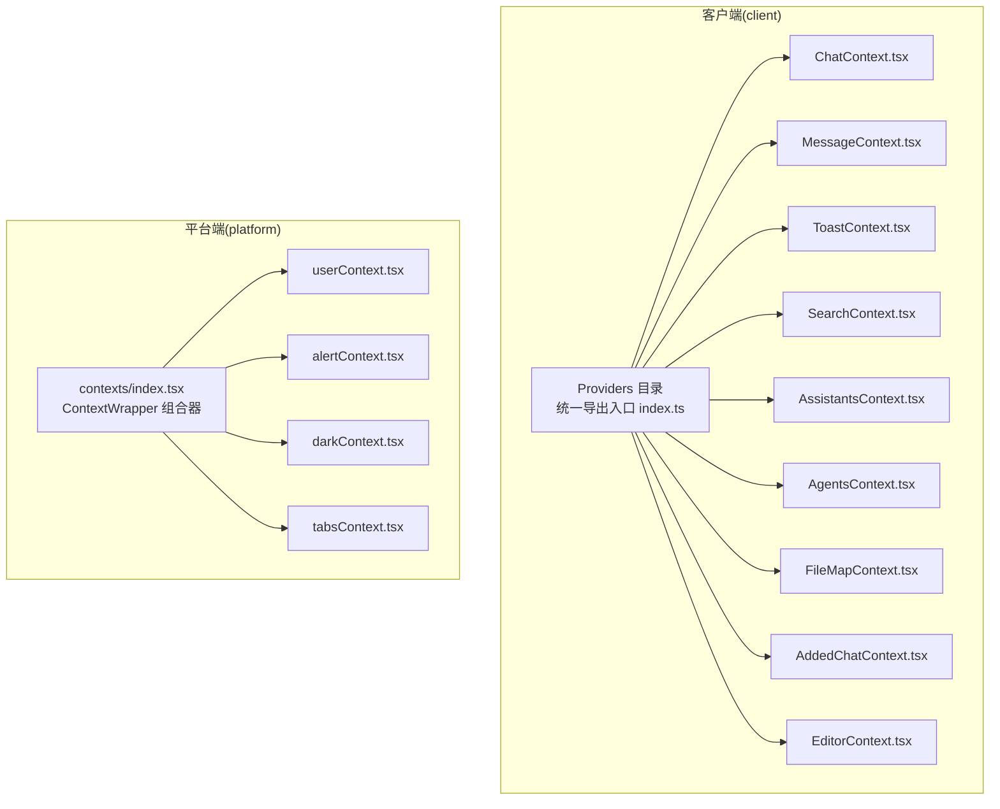
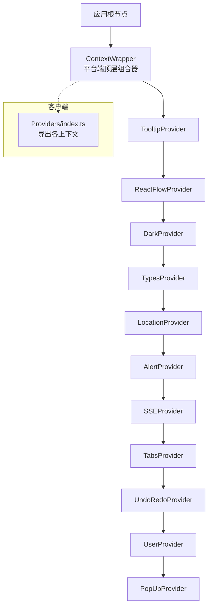
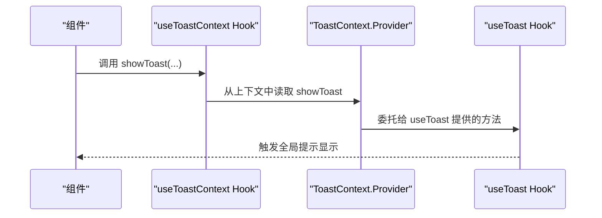
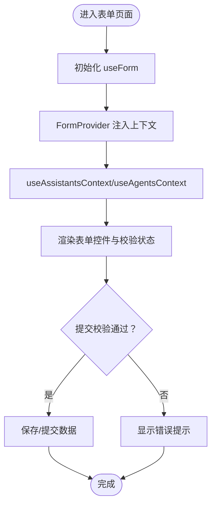

# 上下文提供者

<cite>
**本文引用的文件**
- [src/frontend/client/src/Providers/index.ts](file://src/frontend/client/src/Providers/index.ts)
- [src/frontend/client/src/Providers/ChatContext.tsx](file://src/frontend/client/src/Providers/ChatContext.tsx)
- [src/frontend/client/src/Providers/MessageContext.tsx](file://src/frontend/client/src/Providers/MessageContext.tsx)
- [src/frontend/client/src/Providers/ToastContext.tsx](file://src/frontend/client/src/Providers/ToastContext.tsx)
- [src/frontend/client/src/Providers/SearchContext.tsx](file://src/frontend/client/src/Providers/SearchContext.tsx)
- [src/frontend/client/src/Providers/AssistantsContext.tsx](file://src/frontend/client/src/Providers/AssistantsContext.tsx)
- [src/frontend/client/src/Providers/AgentsContext.tsx](file://src/frontend/client/src/Providers/AgentsContext.tsx)
- [src/frontend/client/src/Providers/FileMapContext.tsx](file://src/frontend/client/src/Providers/FileMapContext.tsx)
- [src/frontend/client/src/Providers/AddedChatContext.tsx](file://src/frontend/client/src/Providers/AddedChatContext.tsx)
- [src/frontend/client/src/Providers/EditorContext.tsx](file://src/frontend/client/src/Providers/EditorContext.tsx)
- [src/frontend/platform/src/contexts/index.tsx](file://src/frontend/platform/src/contexts/index.tsx)
- [src/frontend/platform/src/contexts/userContext.tsx](file://src/frontend/platform/src/contexts/userContext.tsx)
- [src/frontend/platform/src/contexts/alertContext.tsx](file://src/frontend/platform/src/contexts/alertContext.tsx)
- [src/frontend/platform/src/contexts/darkContext.tsx](file://src/frontend/platform/src/contexts/darkContext.tsx)
- [src/frontend/platform/src/contexts/tabsContext.tsx](file://src/frontend/platform/src/contexts/tabsContext.tsx)
</cite>

## 目录
1. [引言](#引言)
2. [项目结构](#项目结构)
3. [核心组件](#核心组件)
4. [架构总览](#架构总览)
5. [详细组件分析](#详细组件分析)
6. [依赖关系分析](#依赖关系分析)
7. [性能考量](#性能考量)
8. [故障排查指南](#故障排查指南)
9. [结论](#结论)
10. [附录](#附录)

## 引言
本文件面向 Bisheng 前端上下文提供者体系，系统性阐述 React Context 模式在客户端与平台端的实现与最佳实践。内容覆盖上下文设计原则、Provider 组合策略、性能优化方法、职责划分与状态传递机制，并给出组合使用、嵌套 Provider 管理与状态隔离策略的实操建议。同时，结合仓库中已有的上下文实现，对聊天上下文、消息上下文、通知上下文、搜索上下文、表单上下文、编辑器上下文等进行深入解析。

## 项目结构
Bisheng 前端由“客户端(client)”与“平台端(platform)”两部分组成，上下文提供者分别位于各自目录：
- 客户端上下文集中于 src/frontend/client/src/Providers，导出统一入口 index.ts，便于按需引入与复用。
- 平台端上下文集中于 src/frontend/platform/src/contexts，提供 ContextWrapper 作为顶层 Provider 组合器，按功能域分层嵌套。

图表来源
- [src/frontend/client/src/Providers/index.ts](file://src/frontend/client/src/Providers/index.ts#L1-L24)
- [src/frontend/platform/src/contexts/index.tsx](file://src/frontend/platform/src/contexts/index.tsx#L14-L41)

章节来源
- [src/frontend/client/src/Providers/index.ts](file://src/frontend/client/src/Providers/index.ts#L1-L24)
- [src/frontend/platform/src/contexts/index.tsx](file://src/frontend/platform/src/contexts/index.tsx#L14-L41)

## 核心组件
本节聚焦客户端与平台端的关键上下文及其职责：
- 客户端上下文
  - ChatContext：封装聊天相关辅助逻辑，通过自定义 hook useChatHelpers 提供能力。
  - MessageContext：描述单条消息的状态片段（如展开、类型、索引等），用于细粒度控制。
  - ToastContext：统一的提示弹窗能力，通过 useToast 提供 showToast 方法。
  - SearchContext：封装会话检索相关逻辑，通过 useSearch 提供能力。
  - AssistantsContext / AgentsContext：基于 react-hook-form 的表单上下文，提供默认值与表单状态管理。
  - FileMapContext：封装文件映射相关逻辑，通过 useFileMap 提供能力。
  - AddedChatContext：封装追加响应相关逻辑，通过 useAddedResponse 提供能力。
  - EditorContext：编辑器状态（是否正在变更、当前代码等）的本地上下文。
- 平台端上下文
  - ContextWrapper：顶层 Provider 组合器，按 UI/交互/业务维度嵌套 Provider。
  - userContext：用户态与组件保存能力，含鉴权、权限跳转、组件增删改查等。
  - alertContext：全局告警与通知中心，支持错误、公告、成功三类提示及列表管理。
  - darkContext：主题深色模式开关与持久化。
  - tabsContext：流程图工作区上下文，负责流程保存、上传下载、节点粘贴、版本管理等。

章节来源
- [src/frontend/client/src/Providers/ChatContext.tsx](file://src/frontend/client/src/Providers/ChatContext.tsx#L1-L7)
- [src/frontend/client/src/Providers/MessageContext.tsx](file://src/frontend/client/src/Providers/MessageContext.tsx#L1-L12)
- [src/frontend/client/src/Providers/ToastContext.tsx](file://src/frontend/client/src/Providers/ToastContext.tsx#L1-L22)
- [src/frontend/client/src/Providers/SearchContext.tsx](file://src/frontend/client/src/Providers/SearchContext.tsx#L1-L7)
- [src/frontend/client/src/Providers/AssistantsContext.tsx](file://src/frontend/client/src/Providers/AssistantsContext.tsx#L1-L28)
- [src/frontend/client/src/Providers/AgentsContext.tsx](file://src/frontend/client/src/Providers/AgentsContext.tsx#L1-L28)
- [src/frontend/client/src/Providers/FileMapContext.tsx](file://src/frontend/client/src/Providers/FileMapContext.tsx#L1-L7)
- [src/frontend/client/src/Providers/AddedChatContext.tsx](file://src/frontend/client/src/Providers/AddedChatContext.tsx#L1-L7)
- [src/frontend/client/src/Providers/EditorContext.tsx](file://src/frontend/client/src/Providers/EditorContext.tsx#L1-L30)
- [src/frontend/platform/src/contexts/userContext.tsx](file://src/frontend/platform/src/contexts/userContext.tsx#L1-L184)
- [src/frontend/platform/src/contexts/alertContext.tsx](file://src/frontend/platform/src/contexts/alertContext.tsx#L1-L163)
- [src/frontend/platform/src/contexts/darkContext.tsx](file://src/frontend/platform/src/contexts/darkContext.tsx#L1-L38)
- [src/frontend/platform/src/contexts/tabsContext.tsx](file://src/frontend/platform/src/contexts/tabsContext.tsx#L1-L335)

## 架构总览
客户端与平台端的上下文采用“分层 Provider 组合 + 功能域隔离”的架构：
- 客户端：以 Providers/index.ts 为统一出口，按需导出各上下文 Provider 与 Hook，便于页面按需装配。
- 平台端：以 ContextWrapper 为根容器，将 UI 提示、主题、流程图、用户态、告警等上下文按层级组合，确保依赖关系清晰、可维护性强。

图表来源
- [src/frontend/platform/src/contexts/index.tsx](file://src/frontend/platform/src/contexts/index.tsx#L14-L41)
- [src/frontend/client/src/Providers/index.ts](file://src/frontend/client/src/Providers/index.ts#L1-L24)

章节来源
- [src/frontend/platform/src/contexts/index.tsx](file://src/frontend/platform/src/contexts/index.tsx#L14-L41)
- [src/frontend/client/src/Providers/index.ts](file://src/frontend/client/src/Providers/index.ts#L1-L24)

## 详细组件分析

### 聊天上下文（ChatContext）
- 设计要点
  - 使用 createContext 包裹 useChatHelpers 返回的能力集合，使组件可通过 useChatContext 访问聊天相关方法。
  - 将“状态”与“行为”分离：状态由外部 hook 管理，上下文仅暴露方法签名与类型约束。
- 使用建议
  - 在需要发起对话、发送消息、中断生成等场景注入该上下文。
  - 与 MessageContext 协作，实现消息级别的展开/折叠与类型切换。
- 性能注意
  - 避免在 ChatContext.Provider 外层频繁重渲染，尽量将子树按功能拆分，减少无关订阅。

章节来源
- [src/frontend/client/src/Providers/ChatContext.tsx](file://src/frontend/client/src/Providers/ChatContext.tsx#L1-L7)

### 消息上下文（MessageContext）
- 设计要点
  - 描述单条消息的局部状态：消息 ID、类型、段落索引、是否展开、所属会话 ID 等。
  - 适合在消息卡片或消息列表项中使用，避免将所有消息状态上移到父级 Provider。
- 使用建议
  - 在消息渲染组件内使用 useMessageContext 控制展开/收起与高亮。
  - 与 ChatContext 结合，实现“点击某条消息后聚焦到该消息”的交互。

章节来源
- [src/frontend/client/src/Providers/MessageContext.tsx](file://src/frontend/client/src/Providers/MessageContext.tsx#L1-L12)

### 通知上下文（ToastContext）
- 设计要点
  - 通过 useToast 提供统一的 showToast 方法，上下文仅承载该方法并以 Provider 形式注入。
  - 默认值提供空函数，保证在未包裹 Provider 时不会抛错。
- 使用建议
  - 在页面任意位置调用 useToastContext().showToast(...) 即可触发全局提示。
  - 与平台端 alertContext 协同，区分“轻量提示”与“全局告警/通知中心”。

图表来源
- [src/frontend/client/src/Providers/ToastContext.tsx](file://src/frontend/client/src/Providers/ToastContext.tsx#L13-L21)

章节来源
- [src/frontend/client/src/Providers/ToastContext.tsx](file://src/frontend/client/src/Providers/ToastContext.tsx#L1-L22)

### 搜索上下文（SearchContext）
- 设计要点
  - 通过 useSearch 封装会话检索能力，上下文暴露检索方法与状态。
- 使用建议
  - 在会话列表页或侧边栏搜索框中使用，避免将搜索状态提升至更高层级。

章节来源
- [src/frontend/client/src/Providers/SearchContext.tsx](file://src/frontend/client/src/Providers/SearchContext.tsx#L1-L7)

### 表单上下文（AssistantsContext / AgentsContext）
- 设计要点
  - 基于 react-hook-form 的 FormProvider，提供表单默认值与校验状态。
  - 自定义 Hook 对 useContext 进行二次封装，若未包裹 Provider 则抛出明确错误。
- 使用建议
  - 在助理/代理配置表单中使用，避免重复初始化默认值。
  - 与 ChatContext/MessageContext 解耦，仅在表单层使用。

图表来源
- [src/frontend/client/src/Providers/AssistantsContext.tsx](file://src/frontend/client/src/Providers/AssistantsContext.tsx#L21-L27)
- [src/frontend/client/src/Providers/AgentsContext.tsx](file://src/frontend/client/src/Providers/AgentsContext.tsx#L21-L27)

章节来源
- [src/frontend/client/src/Providers/AssistantsContext.tsx](file://src/frontend/client/src/Providers/AssistantsContext.tsx#L1-L28)
- [src/frontend/client/src/Providers/AgentsContext.tsx](file://src/frontend/client/src/Providers/AgentsContext.tsx#L1-L28)

### 文件映射上下文（FileMapContext）
- 设计要点
  - 通过 useFileMap 封装文件映射相关逻辑，上下文暴露方法与状态。
- 使用建议
  - 在文件选择、上传、预览等场景使用，避免将文件状态散落在多处。

章节来源
- [src/frontend/client/src/Providers/FileMapContext.tsx](file://src/frontend/client/src/Providers/FileMapContext.tsx#L1-L7)

### 追加响应上下文（AddedChatContext）
- 设计要点
  - 通过 useAddedResponse 封装追加响应相关逻辑，上下文暴露方法与状态。
- 使用建议
  - 在流式输出追加阶段使用，避免将追加逻辑上移至父级。

章节来源
- [src/frontend/client/src/Providers/AddedChatContext.tsx](file://src/frontend/client/src/Providers/AddedChatContext.tsx#L1-L7)

### 编辑器上下文（EditorContext）
- 设计要点
  - 本地状态上下文，包含“是否正在变更”和“当前代码”，并提供 setter。
  - 自定义 Hook 对 useContext 进行二次封装，未包裹 Provider 时抛错。
- 使用建议
  - 在代码编辑器组件中使用，避免跨组件共享复杂编辑状态。

章节来源
- [src/frontend/client/src/Providers/EditorContext.tsx](file://src/frontend/client/src/Providers/EditorContext.tsx#L1-L30)

### 平台端用户上下文（userContext）
- 设计要点
  - 用户信息、登录态、组件保存列表、组件增删改查等。
  - 内置拦截器与异地登录处理，权限路由跳转。
- 使用建议
  - 在需要用户态与组件保存能力的页面使用，避免在非必要区域重复请求。

章节来源
- [src/frontend/platform/src/contexts/userContext.tsx](file://src/frontend/platform/src/contexts/userContext.tsx#L1-L184)

### 平台端告警上下文（alertContext）
- 设计要点
  - 错误、公告、成功三类提示状态与通知中心列表管理。
  - 支持打开/关闭、推送、清空、移除等操作。
- 使用建议
  - 与 ToastContext 协同，区分“轻量提示”与“全局告警/通知中心”。

章节来源
- [src/frontend/platform/src/contexts/alertContext.tsx](file://src/frontend/platform/src/contexts/alertContext.tsx#L1-L163)

### 平台端深色模式上下文（darkContext）
- 设计要点
  - 主题开关与本地存储持久化，自动为 body 添加/移除 dark 类名。
- 使用建议
  - 在全局布局中使用，避免在每个组件中重复处理 DOM 类名。

章节来源
- [src/frontend/platform/src/contexts/darkContext.tsx](file://src/frontend/platform/src/contexts/darkContext.tsx#L1-L38)

### 平台端标签页/流程上下文（tabsContext）
- 设计要点
  - 流程图工作区上下文：流程保存、上传/下载、节点粘贴、版本管理、待修改标记等。
  - 依赖 alertContext 与 typesContext，实现错误提示与模板/类型信息。
- 使用建议
  - 在流程构建与编辑页面使用，避免将复杂状态散落至多个组件。

章节来源
- [src/frontend/platform/src/contexts/tabsContext.tsx](file://src/frontend/platform/src/contexts/tabsContext.tsx#L1-L335)

## 依赖关系分析
- 客户端 Provider 之间无直接依赖，通过统一导出 index.ts 组合使用。
- 平台端 ContextWrapper 采用嵌套 Provider 的方式，形成稳定的依赖链：
  - TooltipProvider -> ReactFlowProvider -> DarkProvider -> TypesProvider -> LocationProvider -> AlertProvider -> SSEProvider -> TabsProvider -> UndoRedoProvider -> UserProvider -> PopUpProvider
- tabsContext 依赖 alertContext 与 typesContext，体现“上下文间协作”的设计。

```mermaid
graph LR
TP["TooltipProvider"] --> RF["ReactFlowProvider"]
RF --> DK["DarkProvider"]
DK --> TY["TypesProvider"]
TY --> LC["LocationProvider"]
LC --> AL["AlertProvider"]
AL --> SSE["SSEProvider"]
SSE --> TB["TabsProvider"]
TB --> UR["UndoRedoProvider"]
UR --> US["UserProvider"]
US --> PP["PopUpProvider"]
```

图表来源
- [src/frontend/platform/src/contexts/index.tsx](file://src/frontend/platform/src/contexts/index.tsx#L14-L41)

章节来源
- [src/frontend/platform/src/contexts/index.tsx](file://src/frontend/platform/src/contexts/index.tsx#L14-L41)
- [src/frontend/platform/src/contexts/tabsContext.tsx](file://src/frontend/platform/src/contexts/tabsContext.tsx#L47-L48)

## 性能考量
- 避免不必要的重渲染
  - 将高频更新的状态下沉至局部上下文（如 EditorContext），避免影响全局 Provider。
  - 合理拆分 Provider 层级，仅在需要的子树中使用对应上下文。
- 状态提升与解耦
  - 将“行为”与“状态”分离：如 ChatContext 仅暴露方法，不承载复杂状态。
  - 使用局部上下文（如 MessageContext）管理细粒度状态，减少父级压力。
- Provider 组合策略
  - 平台端通过 ContextWrapper 统一组合，避免在多处重复嵌套。
  - 客户端通过 Providers/index.ts 按需导出，减少无用上下文的注入成本。
- 订阅模式
  - 使用自定义 Hook 对 useContext 进行二次封装，未包裹 Provider 时抛错，有助于早期发现配置问题。

## 故障排查指南
- “未包裹 Provider”错误
  - 症状：调用 useAssistantsContext 或 useAgentsContext 抛出错误。
  - 处理：确认已在页面根部包裹对应 Provider（AssistantsProvider/AgentsProvider）。
- 深色模式不生效
  - 症状：切换主题后页面未变色。
  - 处理：检查 darkContext 的 DOM 类名添加/移除逻辑与本地存储键值。
- 通知中心不显示
  - 症状：调用 setErrorData/setNoticeData/setSuccessData 后无弹窗。
  - 处理：确认 alertContext 已被 ContextWrapper 正确包裹，且标题非空。
- 流程保存失败
  - 症状：saveFlow 无响应或报错。
  - 处理：检查 updateFlowApi 的返回值与捕获异常的 HOC，确认 tabsState 中 isPending 标记正确更新。

章节来源
- [src/frontend/client/src/Providers/AssistantsContext.tsx](file://src/frontend/client/src/Providers/AssistantsContext.tsx#L14-L16)
- [src/frontend/client/src/Providers/AgentsContext.tsx](file://src/frontend/client/src/Providers/AgentsContext.tsx#L14-L16)
- [src/frontend/platform/src/contexts/darkContext.tsx](file://src/frontend/platform/src/contexts/darkContext.tsx#L19-L26)
- [src/frontend/platform/src/contexts/alertContext.tsx](file://src/frontend/platform/src/contexts/alertContext.tsx#L80-L90)
- [src/frontend/platform/src/contexts/tabsContext.tsx](file://src/frontend/platform/src/contexts/tabsContext.tsx#L50-L66)

## 结论
Bisheng 前端上下文提供者体系遵循“分层 Provider 组合 + 功能域隔离”的设计原则，既保证了模块间的低耦合，又提供了清晰的状态访问路径。通过将“行为”与“状态”分离、在局部上下文中管理细粒度状态、以及在顶层统一组合 Provider，系统在可维护性与性能之间取得了良好平衡。建议在后续扩展中继续坚持上述原则，并在新增上下文时明确其职责边界与依赖关系。

## 附录
- 最佳实践清单
  - 明确上下文职责：仅承载必要的状态与方法，避免“上帝对象”。
  - 自定义 Hook 封装 useContext：在未包裹 Provider 时抛错，便于调试。
  - 合理拆分 Provider：高频更新状态下沉，避免全局重渲染。
  - 统一组合顶层 Provider：平台端使用 ContextWrapper，客户端通过 Providers/index.ts 按需导出。
  - 与 hooks 协作：优先使用自定义 hook 封装上下文能力，保持上下文薄而清晰。