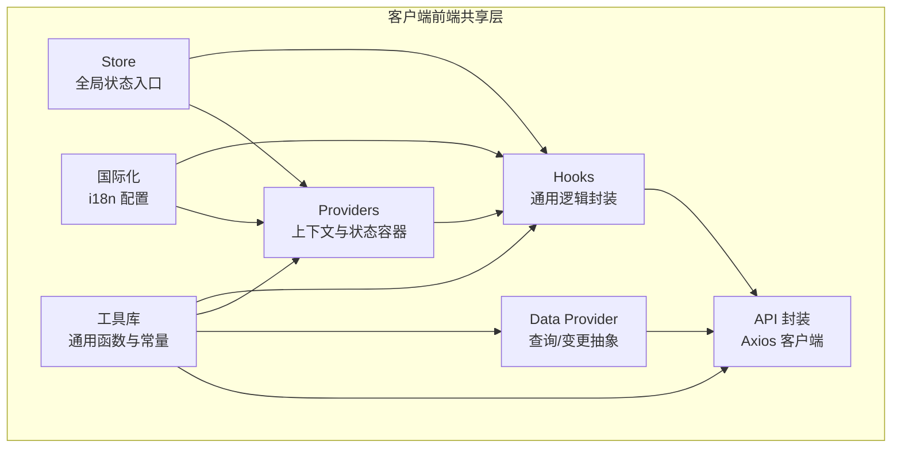
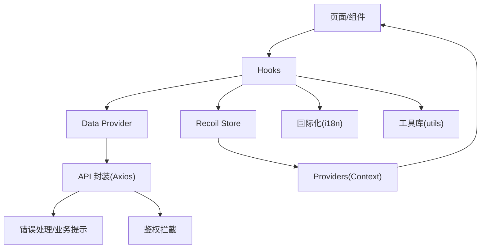
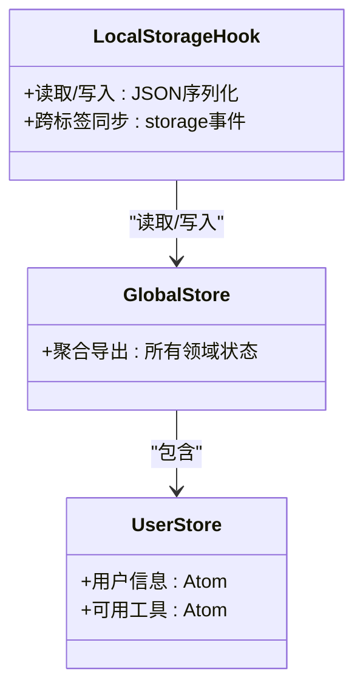
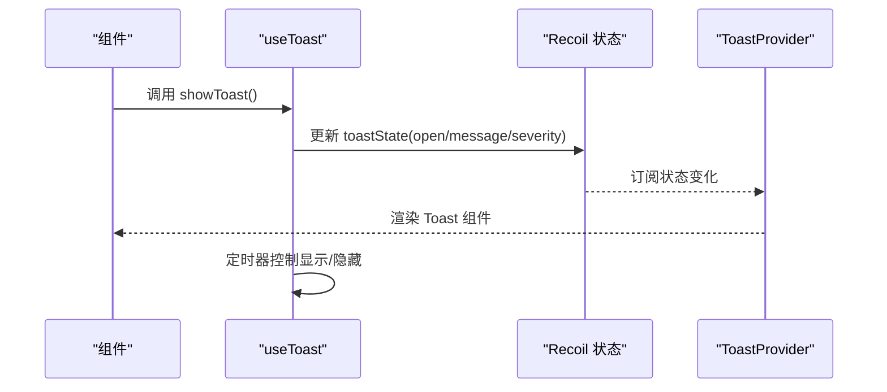
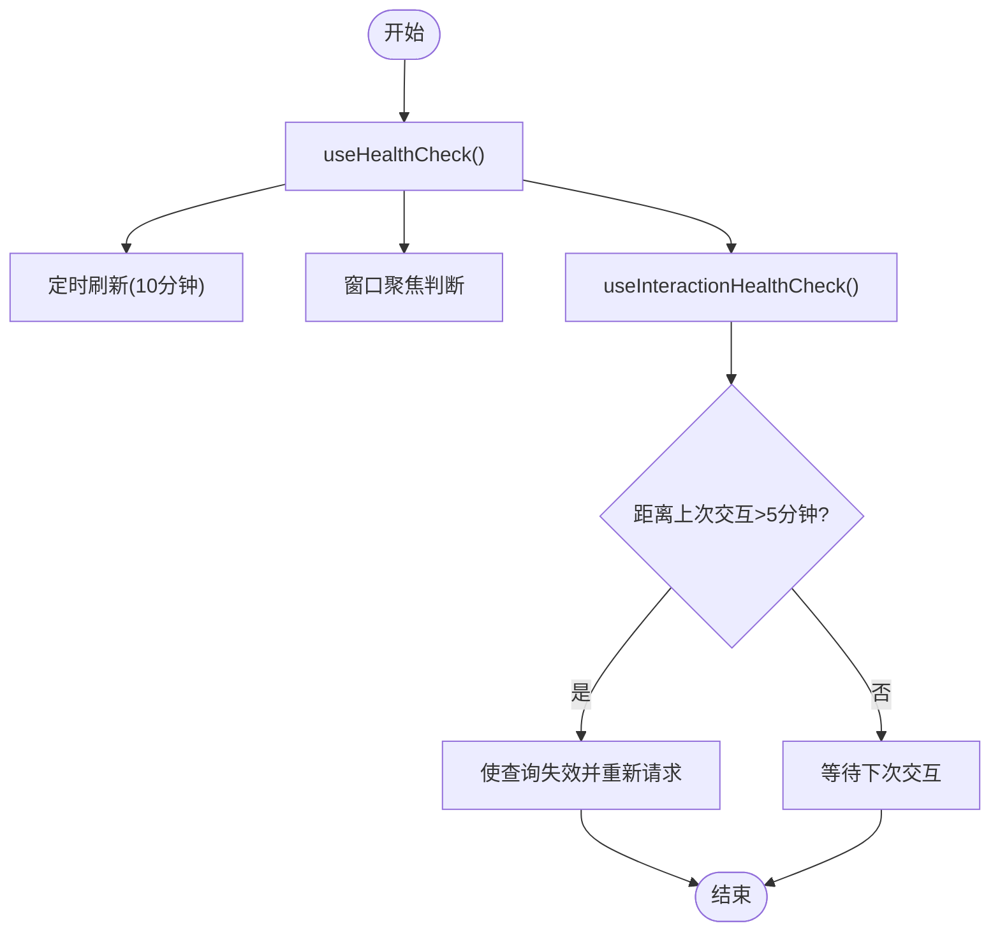
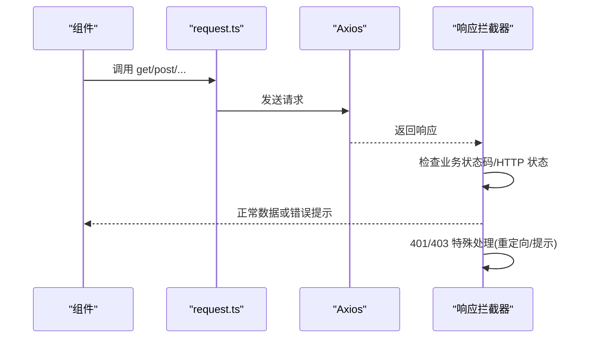
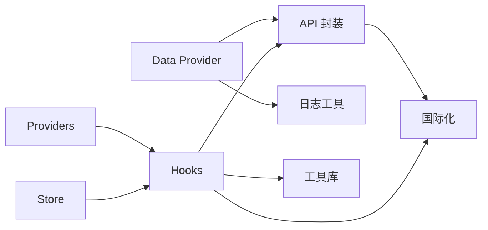

# 共享架构组件

<cite>
**本文引用的文件**
- [src/frontend/client/src/store/index.ts](file://src/frontend/client/src/store/index.ts)
- [src/frontend/client/src/store/user.ts](file://src/frontend/client/src/store/user.ts)
- [src/frontend/client/src/hooks/index.ts](file://src/frontend/client/src/hooks/index.ts)
- [src/frontend/client/src/hooks/useLocalStorage.tsx](file://src/frontend/client/src/hooks/useLocalStorage.tsx)
- [src/frontend/client/src/hooks/useToast.ts](file://src/frontend/client/src/hooks/useToast.ts)
- [src/frontend/client/src/Providers/index.ts](file://src/frontend/client/src/Providers/index.ts)
- [src/frontend/client/src/Providers/ToastContext.tsx](file://src/frontend/client/src/Providers/ToastContext.tsx)
- [src/frontend/client/src/data-provider/index.ts](file://src/frontend/client/src/data-provider/index.ts)
- [src/frontend/client/src/data-provider/connection.ts](file://src/frontend/client/src/data-provider/connection.ts)
- [src/frontend/client/src/api/request.ts](file://src/frontend/client/src/api/request.ts)
- [src/frontend/client/src/utils/index.ts](file://src/frontend/client/src/utils/index.ts)
- [src/frontend/client/src/locales/i18n.ts](file://src/frontend/client/src/locales/i18n.ts)
</cite>

## 目录
1. [简介](#简介)
2. [项目结构](#项目结构)
3. [核心组件](#核心组件)
4. [架构总览](#架构总览)
5. [组件详解](#组件详解)
6. [依赖关系分析](#依赖关系分析)
7. [性能考量](#性能考量)
8. [故障排查指南](#故障排查指南)
9. [结论](#结论)
10. [附录](#附录)

## 简介
本文件面向 Bisheng 前端“客户端”与“平台”两端共享的架构与组件，系统性阐述以下主题：
- 客户端与平台前端共享的设计原则与组件复用策略
- 状态管理架构：Recoil 状态管理、全局状态设计、状态持久化
- 自定义 Hooks 系统：数据获取 Hook、表单处理 Hook、UI 交互 Hook 等通用逻辑封装
- 数据提供者模式：API 客户端封装、错误边界处理、加载状态管理
- 通用工具函数库、类型定义、国际化支持等共享基础设施
- 组件开发最佳实践：代码组织结构、命名规范、性能优化策略

## 项目结构
共享架构主要集中在“客户端”前端工程中，围绕 Store、Hooks、Providers、Data Provider、API 封装与国际化等模块构建，形成可被“平台”前端复用的基础设施层。

图表来源
- [src/frontend/client/src/store/index.ts](file://src/frontend/client/src/store/index.ts#L1-L33)
- [src/frontend/client/src/hooks/index.ts](file://src/frontend/client/src/hooks/index.ts#L1-L35)
- [src/frontend/client/src/Providers/index.ts](file://src/frontend/client/src/Providers/index.ts#L1-L24)
- [src/frontend/client/src/data-provider/index.ts](file://src/frontend/client/src/data-provider/index.ts#L1-L14)
- [src/frontend/client/src/api/request.ts](file://src/frontend/client/src/api/request.ts#L1-L197)
- [src/frontend/client/src/locales/i18n.ts](file://src/frontend/client/src/locales/i18n.ts#L1-L88)
- [src/frontend/client/src/utils/index.ts](file://src/frontend/client/src/utils/index.ts#L1-L276)

章节来源
- [src/frontend/client/src/store/index.ts](file://src/frontend/client/src/store/index.ts#L1-L33)
- [src/frontend/client/src/hooks/index.ts](file://src/frontend/client/src/hooks/index.ts#L1-L35)
- [src/frontend/client/src/Providers/index.ts](file://src/frontend/client/src/Providers/index.ts#L1-L24)
- [src/frontend/client/src/data-provider/index.ts](file://src/frontend/client/src/data-provider/index.ts#L1-L14)
- [src/frontend/client/src/api/request.ts](file://src/frontend/client/src/api/request.ts#L1-L197)
- [src/frontend/client/src/locales/i18n.ts](file://src/frontend/client/src/locales/i18n.ts#L1-L88)
- [src/frontend/client/src/utils/index.ts](file://src/frontend/client/src/utils/index.ts#L1-L276)

## 核心组件
- 全局状态入口：聚合各领域原子与派生状态，统一导出供应用使用
- 自定义 Hooks：覆盖数据获取、本地存储、消息提示、媒体与输入处理等
- 上下文 Providers：以 Context 包裹状态与能力，便于跨组件传递
- Data Provider：基于 TanStack Query 的查询/变更抽象，统一健康检查与交互刷新
- API 封装：Axios 客户端与拦截器，集中处理鉴权、错误与业务提示
- 国际化：多语言资源与语言探测配置
- 工具库：通用函数、样式常量、时间格式化、复制与下载等

章节来源
- [src/frontend/client/src/store/index.ts](file://src/frontend/client/src/store/index.ts#L1-L33)
- [src/frontend/client/src/hooks/index.ts](file://src/frontend/client/src/hooks/index.ts#L1-L35)
- [src/frontend/client/src/Providers/index.ts](file://src/frontend/client/src/Providers/index.ts#L1-L24)
- [src/frontend/client/src/data-provider/index.ts](file://src/frontend/client/src/data-provider/index.ts#L1-L14)
- [src/frontend/client/src/api/request.ts](file://src/frontend/client/src/api/request.ts#L1-L197)
- [src/frontend/client/src/locales/i18n.ts](file://src/frontend/client/src/locales/i18n.ts#L1-L88)
- [src/frontend/client/src/utils/index.ts](file://src/frontend/client/src/utils/index.ts#L1-L276)

## 架构总览
共享架构采用“状态中心 + Hooks 抽象 + 上下文容器 + 数据提供者 + API 封装 + 国际化 + 工具库”的组合，确保客户端与平台前端在功能与体验上的一致性与可维护性。

图表来源
- [src/frontend/client/src/hooks/index.ts](file://src/frontend/client/src/hooks/index.ts#L1-L35)
- [src/frontend/client/src/data-provider/index.ts](file://src/frontend/client/src/data-provider/index.ts#L1-L14)
- [src/frontend/client/src/api/request.ts](file://src/frontend/client/src/api/request.ts#L1-L197)
- [src/frontend/client/src/store/index.ts](file://src/frontend/client/src/store/index.ts#L1-L33)
- [src/frontend/client/src/Providers/index.ts](file://src/frontend/client/src/Providers/index.ts#L1-L24)
- [src/frontend/client/src/locales/i18n.ts](file://src/frontend/client/src/locales/i18n.ts#L1-L88)
- [src/frontend/client/src/utils/index.ts](file://src/frontend/client/src/utils/index.ts#L1-L276)

## 组件详解

### 状态管理架构（Recoil）
- 设计原则
  - 使用原子（atom）与选择器（selector）划分领域状态，避免全局耦合
  - 通过全局入口聚合导出，简化导入与使用
- 全局状态设计
  - 用户信息、可用工具、文本、提示、提交、搜索、预设、语言、设置、杂项、临时状态、模型类型等
- 状态持久化
  - 本地持久化通过自定义 Hook 实现，支持 JSON 序列化与跨标签页同步
- 关键实现位置
  - 全局状态入口聚合：[src/frontend/client/src/store/index.ts](file://src/frontend/client/src/store/index.ts#L1-L33)
  - 用户状态示例：[src/frontend/client/src/store/user.ts](file://src/frontend/client/src/store/user.ts#L1-L18)
  - 本地存储 Hook：[src/frontend/client/src/hooks/useLocalStorage.tsx](file://src/frontend/client/src/hooks/useLocalStorage.tsx#L1-L54)

图表来源
- [src/frontend/client/src/store/index.ts](file://src/frontend/client/src/store/index.ts#L1-L33)
- [src/frontend/client/src/store/user.ts](file://src/frontend/client/src/store/user.ts#L1-L18)
- [src/frontend/client/src/hooks/useLocalStorage.tsx](file://src/frontend/client/src/hooks/useLocalStorage.tsx#L1-L54)

章节来源
- [src/frontend/client/src/store/index.ts](file://src/frontend/client/src/store/index.ts#L1-L33)
- [src/frontend/client/src/store/user.ts](file://src/frontend/client/src/store/user.ts#L1-L18)
- [src/frontend/client/src/hooks/useLocalStorage.tsx](file://src/frontend/client/src/hooks/useLocalStorage.tsx#L1-L54)

### 自定义 Hooks 系统
- 能力范围
  - 数据获取：基于 TanStack Query 的查询与缓存
  - 表单处理：输入、语音识别/合成等
  - UI 交互：消息提示、延迟渲染、滚动定位、本地存储、媒体与设备
- 统一导出
  - 通过索引导出，便于按需引入与 IDE 提示
- 关键实现位置
  - Hooks 索引导出：[src/frontend/client/src/hooks/index.ts](file://src/frontend/client/src/hooks/index.ts#L1-L35)
  - 本地存储 Hook：[src/frontend/client/src/hooks/useLocalStorage.tsx](file://src/frontend/client/src/hooks/useLocalStorage.tsx#L1-L54)
  - 消息提示 Hook：[src/frontend/client/src/hooks/useToast.ts](file://src/frontend/client/src/hooks/useToast.ts#L1-L64)

图表来源
- [src/frontend/client/src/hooks/useToast.ts](file://src/frontend/client/src/hooks/useToast.ts#L1-L64)
- [src/frontend/client/src/Providers/ToastContext.tsx](file://src/frontend/client/src/Providers/ToastContext.tsx#L1-L22)

章节来源
- [src/frontend/client/src/hooks/index.ts](file://src/frontend/client/src/hooks/index.ts#L1-L35)
- [src/frontend/client/src/hooks/useLocalStorage.tsx](file://src/frontend/client/src/hooks/useLocalStorage.tsx#L1-L54)
- [src/frontend/client/src/hooks/useToast.ts](file://src/frontend/client/src/hooks/useToast.ts#L1-L64)
- [src/frontend/client/src/Providers/ToastContext.tsx](file://src/frontend/client/src/Providers/ToastContext.tsx#L1-L22)

### 数据提供者模式（Data Provider）
- 查询抽象
  - 基于 TanStack Query 的 useQuery/useMutation，统一查询键、缓存与失效策略
- 健康检查
  - 定期健康检查与交互触发刷新，保证服务可用性感知
- 关键实现位置
  - Data Provider 导出：[src/frontend/client/src/data-provider/index.ts](file://src/frontend/client/src/data-provider/index.ts#L1-L14)
  - 健康检查与交互刷新：[src/frontend/client/src/data-provider/connection.ts](file://src/frontend/client/src/data-provider/connection.ts#L1-L49)

图表来源
- [src/frontend/client/src/data-provider/connection.ts](file://src/frontend/client/src/data-provider/connection.ts#L1-L49)

章节来源
- [src/frontend/client/src/data-provider/index.ts](file://src/frontend/client/src/data-provider/index.ts#L1-L14)
- [src/frontend/client/src/data-provider/connection.ts](file://src/frontend/client/src/data-provider/connection.ts#L1-L49)

### API 客户端封装与错误边界
- 客户端封装
  - Axios 实例化、常用 CRUD 方法、多部分上传、TTS 流响应等
- 错误边界与业务提示
  - 统一拦截 401/403 等错误，结合业务状态码进行提示
- 关键实现位置
  - API 封装：[src/frontend/client/src/api/request.ts](file://src/frontend/client/src/api/request.ts#L1-L197)

图表来源
- [src/frontend/client/src/api/request.ts](file://src/frontend/client/src/api/request.ts#L1-L197)

章节来源
- [src/frontend/client/src/api/request.ts](file://src/frontend/client/src/api/request.ts#L1-L197)

### 国际化支持
- 多语言资源与语言探测
  - 支持多种语言资源文件，自动探测浏览器语言并回退
- 插值变量
  - 品牌名称等动态变量注入
- 关键实现位置
  - 国际化配置：[src/frontend/client/src/locales/i18n.ts](file://src/frontend/client/src/locales/i18n.ts#L1-L88)

章节来源
- [src/frontend/client/src/locales/i18n.ts](file://src/frontend/client/src/locales/i18n.ts#L1-L88)

### 通用工具函数库
- 职责
  - 样式常量、主题、双击选择、内容提取、布局归一化、时间格式化、复制/下载、UUID、文件扩展名等
- 关键实现位置
  - 工具库导出：[src/frontend/client/src/utils/index.ts](file://src/frontend/client/src/utils/index.ts#L1-L276)

章节来源
- [src/frontend/client/src/utils/index.ts](file://src/frontend/client/src/utils/index.ts#L1-L276)

## 依赖关系分析
- Store 与 Hooks：Hooks 通过 Recoil 读写 Store；部分 Hook 依赖工具库与国际化
- Providers：以 Context 包裹状态与能力，向上层组件提供
- Data Provider：依赖 API 封装与日志工具
- API 封装：依赖国际化与环境变量
- 国际化与工具库：被广泛复用

图表来源
- [src/frontend/client/src/store/index.ts](file://src/frontend/client/src/store/index.ts#L1-L33)
- [src/frontend/client/src/hooks/index.ts](file://src/frontend/client/src/hooks/index.ts#L1-L35)
- [src/frontend/client/src/Providers/index.ts](file://src/frontend/client/src/Providers/index.ts#L1-L24)
- [src/frontend/client/src/data-provider/index.ts](file://src/frontend/client/src/data-provider/index.ts#L1-L14)
- [src/frontend/client/src/api/request.ts](file://src/frontend/client/src/api/request.ts#L1-L197)
- [src/frontend/client/src/locales/i18n.ts](file://src/frontend/client/src/locales/i18n.ts#L1-L88)
- [src/frontend/client/src/utils/index.ts](file://src/frontend/client/src/utils/index.ts#L1-L276)

章节来源
- [src/frontend/client/src/store/index.ts](file://src/frontend/client/src/store/index.ts#L1-L33)
- [src/frontend/client/src/hooks/index.ts](file://src/frontend/client/src/hooks/index.ts#L1-L35)
- [src/frontend/client/src/Providers/index.ts](file://src/frontend/client/src/Providers/index.ts#L1-L24)
- [src/frontend/client/src/data-provider/index.ts](file://src/frontend/client/src/data-provider/index.ts#L1-L14)
- [src/frontend/client/src/api/request.ts](file://src/frontend/client/src/api/request.ts#L1-L197)
- [src/frontend/client/src/locales/i18n.ts](file://src/frontend/client/src/locales/i18n.ts#L1-L88)
- [src/frontend/client/src/utils/index.ts](file://src/frontend/client/src/utils/index.ts#L1-L276)

## 性能考量
- 状态粒度与更新范围
  - 将状态拆分为细粒度原子，减少无关更新
- 缓存与失效
  - 合理设置 staleTime/cacheTime，避免过度请求
- 本地持久化
  - 使用 JSON 序列化与跨标签同步，注意大对象对内存的影响
- 国际化与工具函数
  - 资源按需加载，避免一次性加载过多语言包
- 请求拦截与错误处理
  - 对 401/403 进行快速处理，避免重复请求与死循环

## 故障排查指南
- 401/403 处理
  - 检查响应拦截器中的错误分支与重定向逻辑
- 业务错误提示
  - 确认业务状态码映射与 i18n 键是否存在
- 健康检查不刷新
  - 检查定时器与交互刷新条件，确认查询键一致
- 消息提示不生效
  - 确认 Provider 注入与状态更新流程
- 本地存储不同步
  - 检查 storage 事件监听与 JSON 解析

章节来源
- [src/frontend/client/src/api/request.ts](file://src/frontend/client/src/api/request.ts#L97-L184)
- [src/frontend/client/src/hooks/useToast.ts](file://src/frontend/client/src/hooks/useToast.ts#L1-L64)
- [src/frontend/client/src/data-provider/connection.ts](file://src/frontend/client/src/data-provider/connection.ts#L1-L49)
- [src/frontend/client/src/hooks/useLocalStorage.tsx](file://src/frontend/client/src/hooks/useLocalStorage.tsx#L1-L54)

## 结论
通过将状态、Hooks、Providers、Data Provider、API 封装与国际化等模块标准化与集中化，Bisheng 前端共享架构实现了客户端与平台前端的高复用与一致性。遵循本文档的最佳实践与扩展指南，可在保证性能与可维护性的前提下，持续迭代与扩展共享能力。

## 附录
- 开发建议
  - 新增状态优先考虑细粒度原子与选择器
  - 新增 Hooks 时明确职责边界，尽量无副作用
  - Data Provider 层统一处理查询与变更，避免在组件内直接调用 API
  - 国际化文案集中管理，避免硬编码
- 命名规范
  - Store 原子以领域命名，如 user、availableTools
  - Hooks 以 use 前缀，语义清晰，如 useLocalStorage、useToast
  - Providers 以 Provider 结尾，如 ToastProvider
  - Data Provider 函数以 use 前缀，如 useHealthCheck