# 工具函数库

<cite>
**本文引用的文件**
- [src/frontend/client/src/utils/index.ts](file://src/frontend/client/src/utils/index.ts)
- [src/frontend/client/src/utils/artifacts.ts](file://src/frontend/client/src/utils/artifacts.ts)
- [src/frontend/client/src/utils/messages.ts](file://src/frontend/client/src/utils/messages.ts)
- [src/frontend/client/src/utils/localStorage.ts](file://src/frontend/client/src/utils/localStorage.ts)
- [src/frontend/client/src/utils/theme.ts](file://src/frontend/client/src/utils/theme.ts)
- [src/frontend/client/src/utils/collection.ts](file://src/frontend/client/src/utils/collection.ts)
- [src/frontend/client/src/utils/json.ts](file://src/frontend/client/src/utils/json.ts)
- [src/frontend/client/src/utils/map.ts](file://src/frontend/client/src/utils/map.ts)
- [src/frontend/client/src/utils/files.ts](file://src/frontend/client/src/utils/files.ts)
- [src/frontend/client/src/utils/logger.ts](file://src/frontend/client/src/utils/logger.ts)
- [src/frontend/client/src/utils/convos.ts](file://src/frontend/client/src/utils/convos.ts)
- [src/frontend/client/src/utils/endpoints.ts](file://src/frontend/client/src/utils/endpoints.ts)
- [src/frontend/client/src/utils/cn.ts](file://src/frontend/client/src/utils/cn.ts)
- [src/frontend/client/src/utils/textarea.ts](file://src/frontend/client/src/utils/textarea.ts)
- [src/frontend/client/src/utils/languages.ts](file://src/frontend/client/src/utils/languages.ts)
</cite>

## 目录
1. [简介](#简介)
2. [项目结构](#项目结构)
3. [核心组件](#核心组件)
4. [架构总览](#架构总览)
5. [详细组件分析](#详细组件分析)
6. [依赖关系分析](#依赖关系分析)
7. [性能考量](#性能考量)
8. [故障排查指南](#故障排查指南)
9. [结论](#结论)
10. [附录](#附录)

## 简介
本文件系统化梳理 Bisheng 前端工具函数库，覆盖数据处理、字符串处理、数组与对象操作、消息与对话管理、文件与附件映射、主题与本地存储、日志与端点配置等模块。文档重点说明设计原则、分类组织、命名与参数约定、返回值格式，并提供性能优化策略、测试与错误处理建议以及典型使用场景。

## 项目结构
工具函数集中于客户端前端目录下的 utils 子目录，采用按功能域分组的组织方式：通用工具（字符串、日期、复制、下载、UUID、文件扩展名等）、领域工具（消息、对话、端点、本地存储、主题、文件类型、映射、集合缓存、JSON 辅助、语言归一化、文本域操作、日志）。

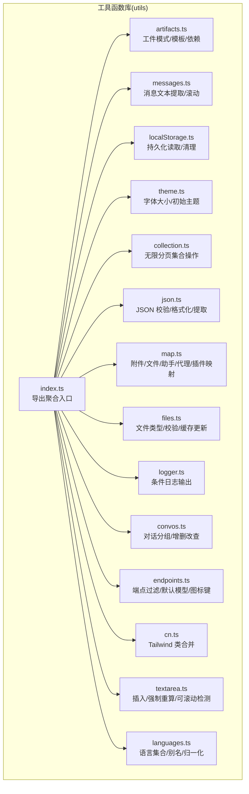

图表来源
- [src/frontend/client/src/utils/index.ts](file://src/frontend/client/src/utils/index.ts#L1-L276)
- [src/frontend/client/src/utils/artifacts.ts](file://src/frontend/client/src/utils/artifacts.ts#L1-L237)
- [src/frontend/client/src/utils/messages.ts](file://src/frontend/client/src/utils/messages.ts#L1-L84)
- [src/frontend/client/src/utils/localStorage.ts](file://src/frontend/client/src/utils/localStorage.ts#L1-L46)
- [src/frontend/client/src/utils/theme.ts](file://src/frontend/client/src/utils/theme.ts#L1-L40)
- [src/frontend/client/src/utils/collection.ts](file://src/frontend/client/src/utils/collection.ts#L1-L221)
- [src/frontend/client/src/utils/json.ts](file://src/frontend/client/src/utils/json.ts#L1-L38)
- [src/frontend/client/src/utils/map.ts](file://src/frontend/client/src/utils/map.ts#L1-L115)
- [src/frontend/client/src/utils/files.ts](file://src/frontend/client/src/utils/files.ts#L1-L304)
- [src/frontend/client/src/utils/logger.ts](file://src/frontend/client/src/utils/logger.ts#L1-L50)
- [src/frontend/client/src/utils/convos.ts](file://src/frontend/client/src/utils/convos.ts#L1-L274)
- [src/frontend/client/src/utils/endpoints.ts](file://src/frontend/client/src/utils/endpoints.ts#L1-L263)
- [src/frontend/client/src/utils/cn.ts](file://src/frontend/client/src/utils/cn.ts#L1-L12)
- [src/frontend/client/src/utils/textarea.ts](file://src/frontend/client/src/utils/textarea.ts#L1-L88)
- [src/frontend/client/src/utils/languages.ts](file://src/frontend/client/src/utils/languages.ts#L1-L428)

章节来源
- [src/frontend/client/src/utils/index.ts](file://src/frontend/client/src/utils/index.ts#L1-L276)

## 核心组件
- 导出聚合入口：统一导出各模块，便于上层按需引入或整体导入。
- 数据处理：字符串长度与末尾字符拼接、最新文本提取、全文拼接、滚动至底部。
- 对象与集合：附件/文件/助手/代理/插件映射；无限分页集合增删改查与去重规整。
- 文件与工件：文件类型判定、格式化、上传校验；工件模式/模板/依赖/预处理。
- 端点与主题：端点可用性过滤、默认模型规格、图标键；主题初始值与字体大小。
- 本地存储：读取最近模型/工具/会话设置；清理指定键空间。
- JSON 辅助：JSON 合法性判断、格式化、从文本中提取 JSON 片段。
- 文本域操作：光标处插入文本、强制高度重算、撤销后修剪、可滚动检测。
- 日志：基于环境变量与标签过滤的日志输出。
- 语言与样式：语言集合与别名归一化、Tailwind 类合并。

章节来源
- [src/frontend/client/src/utils/messages.ts](file://src/frontend/client/src/utils/messages.ts#L1-L84)
- [src/frontend/client/src/utils/map.ts](file://src/frontend/client/src/utils/map.ts#L1-L115)
- [src/frontend/client/src/utils/collection.ts](file://src/frontend/client/src/utils/collection.ts#L1-L221)
- [src/frontend/client/src/utils/files.ts](file://src/frontend/client/src/utils/files.ts#L1-L304)
- [src/frontend/client/src/utils/artifacts.ts](file://src/frontend/client/src/utils/artifacts.ts#L1-L237)
- [src/frontend/client/src/utils/endpoints.ts](file://src/frontend/client/src/utils/endpoints.ts#L1-L263)
- [src/frontend/client/src/utils/theme.ts](file://src/frontend/client/src/utils/theme.ts#L1-L40)
- [src/frontend/client/src/utils/localStorage.ts](file://src/frontend/client/src/utils/localStorage.ts#L1-L46)
- [src/frontend/client/src/utils/json.ts](file://src/frontend/client/src/utils/json.ts#L1-L38)
- [src/frontend/client/src/utils/textarea.ts](file://src/frontend/client/src/utils/textarea.ts#L1-L88)
- [src/frontend/client/src/utils/logger.ts](file://src/frontend/client/src/utils/logger.ts#L1-L50)
- [src/frontend/client/src/utils/languages.ts](file://src/frontend/client/src/utils/languages.ts#L1-L428)
- [src/frontend/client/src/utils/cn.ts](file://src/frontend/client/src/utils/cn.ts#L1-L12)

## 架构总览
工具函数库以“按功能域分组 + 聚合导出”的方式组织，避免跨域耦合，提升内聚性与可维护性。核心交互链路如下：

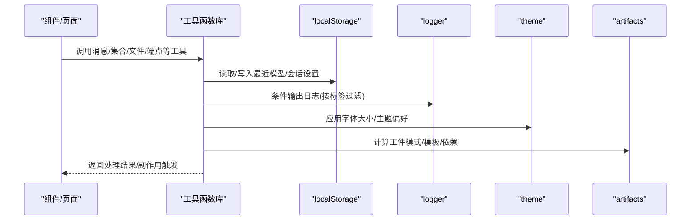

图表来源
- [src/frontend/client/src/utils/index.ts](file://src/frontend/client/src/utils/index.ts#L1-L276)
- [src/frontend/client/src/utils/localStorage.ts](file://src/frontend/client/src/utils/localStorage.ts#L1-L46)
- [src/frontend/client/src/utils/logger.ts](file://src/frontend/client/src/utils/logger.ts#L1-L50)
- [src/frontend/client/src/utils/theme.ts](file://src/frontend/client/src/utils/theme.ts#L1-L40)
- [src/frontend/client/src/utils/artifacts.ts](file://src/frontend/client/src/utils/artifacts.ts#L1-L237)

## 详细组件分析

### 工件处理（artifacts）
职责：根据内容类型与参数选择工件模式、模板与依赖，生成沙盒运行所需文件与资源，支持代码工件的预处理与清理。

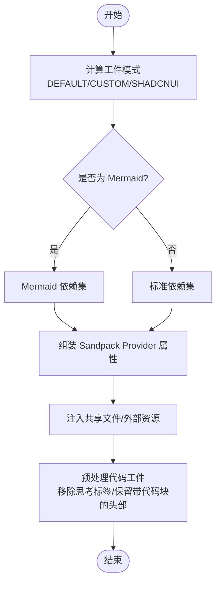

图表来源
- [src/frontend/client/src/utils/artifacts.ts](file://src/frontend/client/src/utils/artifacts.ts#L8-L237)

章节来源
- [src/frontend/client/src/utils/artifacts.ts](file://src/frontend/client/src/utils/artifacts.ts#L1-L237)

### 消息处理（messages）
职责：从消息对象中提取最新文本、拼接全部文本、生成文本键用于缓存/定位，提供滚动到底部能力。

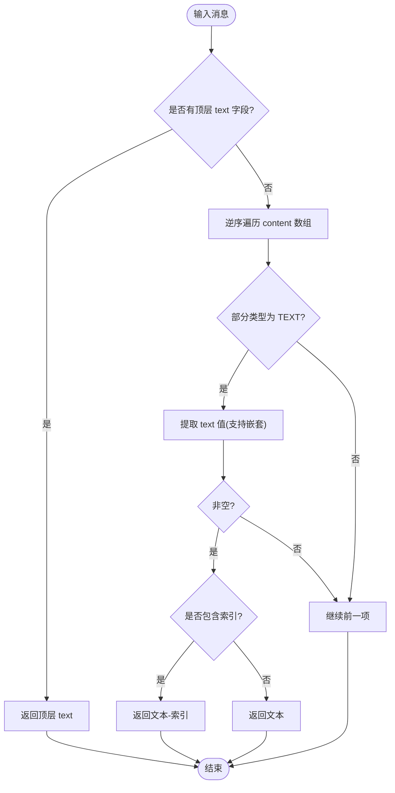

图表来源
- [src/frontend/client/src/utils/messages.ts](file://src/frontend/client/src/utils/messages.ts#L14-L73)

章节来源
- [src/frontend/client/src/utils/messages.ts](file://src/frontend/client/src/utils/messages.ts#L1-L84)

### 本地存储（localStorage）
职责：读取最近模型/工具/会话设置；按规则清理指定键空间，保留必要项。

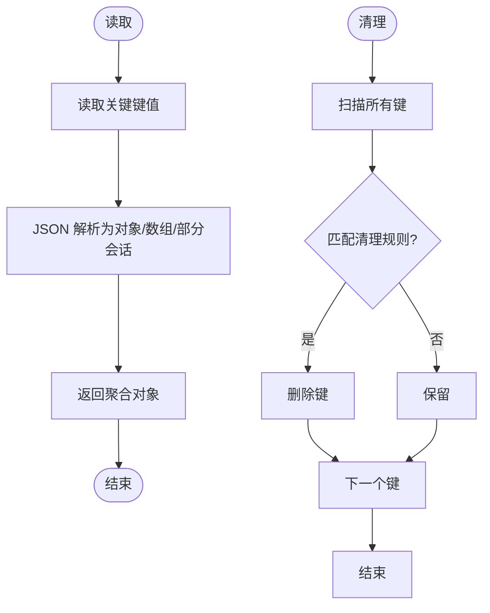

图表来源
- [src/frontend/client/src/utils/localStorage.ts](file://src/frontend/client/src/utils/localStorage.ts#L3-L45)

章节来源
- [src/frontend/client/src/utils/localStorage.ts](file://src/frontend/client/src/utils/localStorage.ts#L1-L46)

### 主题切换（theme）
职责：应用字体大小到 CSS 变量；获取初始主题偏好（默认浅色）。

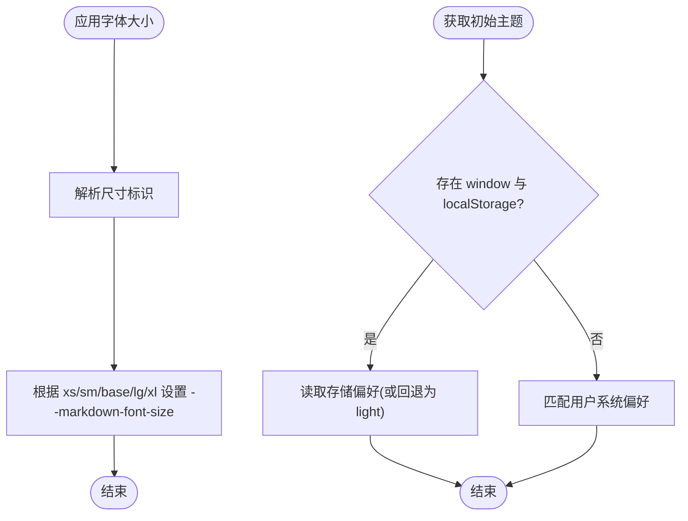

图表来源
- [src/frontend/client/src/utils/theme.ts](file://src/frontend/client/src/utils/theme.ts#L1-L40)

章节来源
- [src/frontend/client/src/utils/theme.ts](file://src/frontend/client/src/utils/theme.ts#L1-L40)

### 集合与缓存（collection）
职责：对 TanStack React Query 的 InfiniteData 进行增删改查、查找页码索引、去重规整、批量字段更新与 QueryClient 缓存同步。

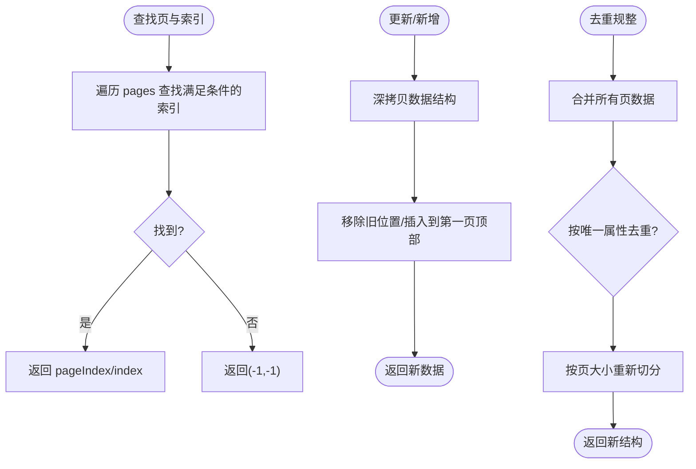

图表来源
- [src/frontend/client/src/utils/collection.ts](file://src/frontend/client/src/utils/collection.ts#L42-L136)

章节来源
- [src/frontend/client/src/utils/collection.ts](file://src/frontend/client/src/utils/collection.ts#L1-L221)

### JSON 辅助（json）
职责：判断字符串是否为合法 JSON；格式化 JSON；从文本中提取首个 JSON 片段。

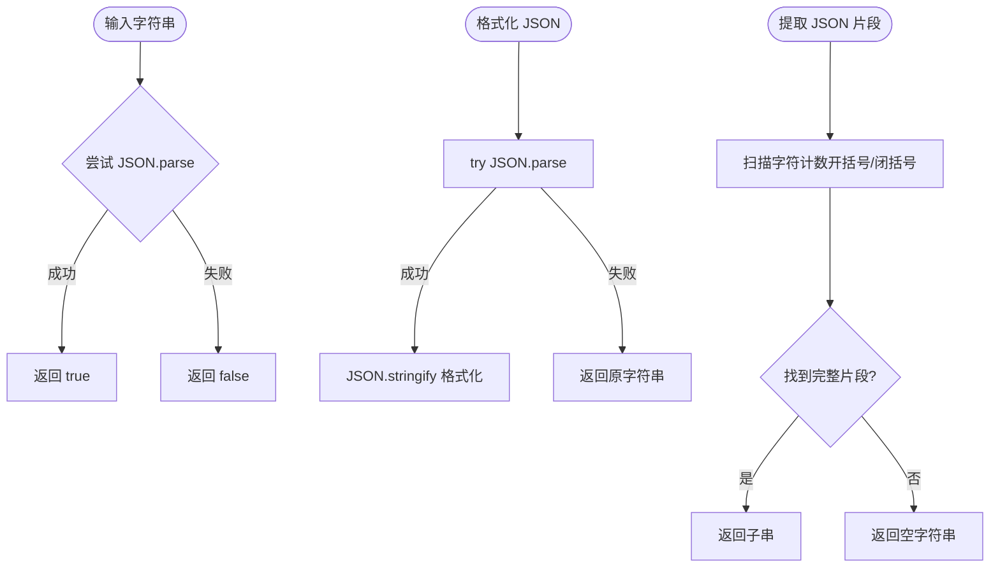

图表来源
- [src/frontend/client/src/utils/json.ts](file://src/frontend/client/src/utils/json.ts#L1-L38)

章节来源
- [src/frontend/client/src/utils/json.ts](file://src/frontend/client/src/utils/json.ts#L1-L38)

### 映射与查询（map）
职责：将附件、文件、助手、代理、插件、工具调用结果映射为字典或列表，便于 O(1) 快速查找与转换。

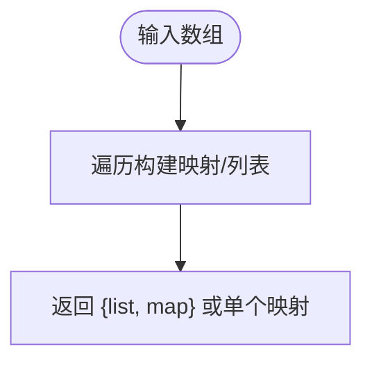

图表来源
- [src/frontend/client/src/utils/map.ts](file://src/frontend/client/src/utils/map.ts#L4-L115)

章节来源
- [src/frontend/client/src/utils/map.ts](file://src/frontend/client/src/utils/map.ts#L1-L115)

### 文件与类型（files）
职责：根据 MIME/扩展名推断文件类型图标与类别；格式化日期；校验上传文件；向 QueryCache 添加文件。

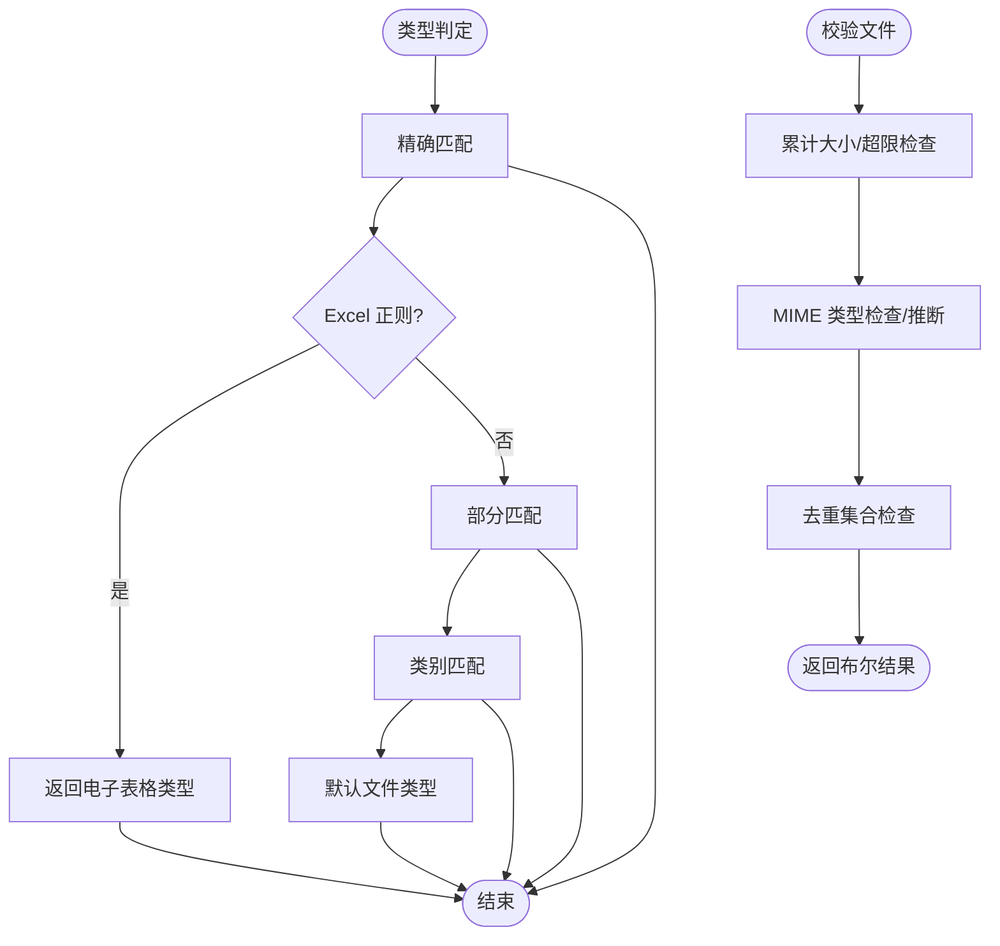

图表来源
- [src/frontend/client/src/utils/files.ts](file://src/frontend/client/src/utils/files.ts#L88-L303)

章节来源
- [src/frontend/client/src/utils/files.ts](file://src/frontend/client/src/utils/files.ts#L1-L304)

### 日志（logger）
职责：基于环境变量与标签过滤控制日志输出，支持多种级别。

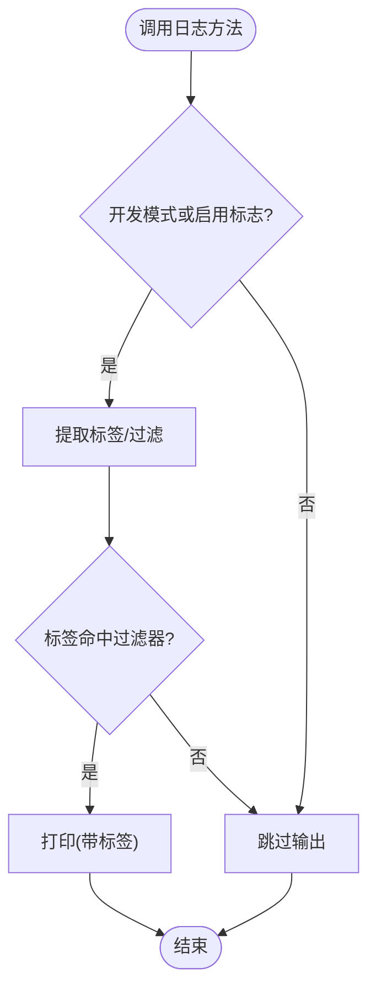

图表来源
- [src/frontend/client/src/utils/logger.ts](file://src/frontend/client/src/utils/logger.ts#L7-L47)

章节来源
- [src/frontend/client/src/utils/logger.ts](file://src/frontend/client/src/utils/logger.ts#L1-L50)

### 对话管理（convos）
职责：按日期分组对话、添加/更新/删除对话、按 ID 获取、持久化端点设置。

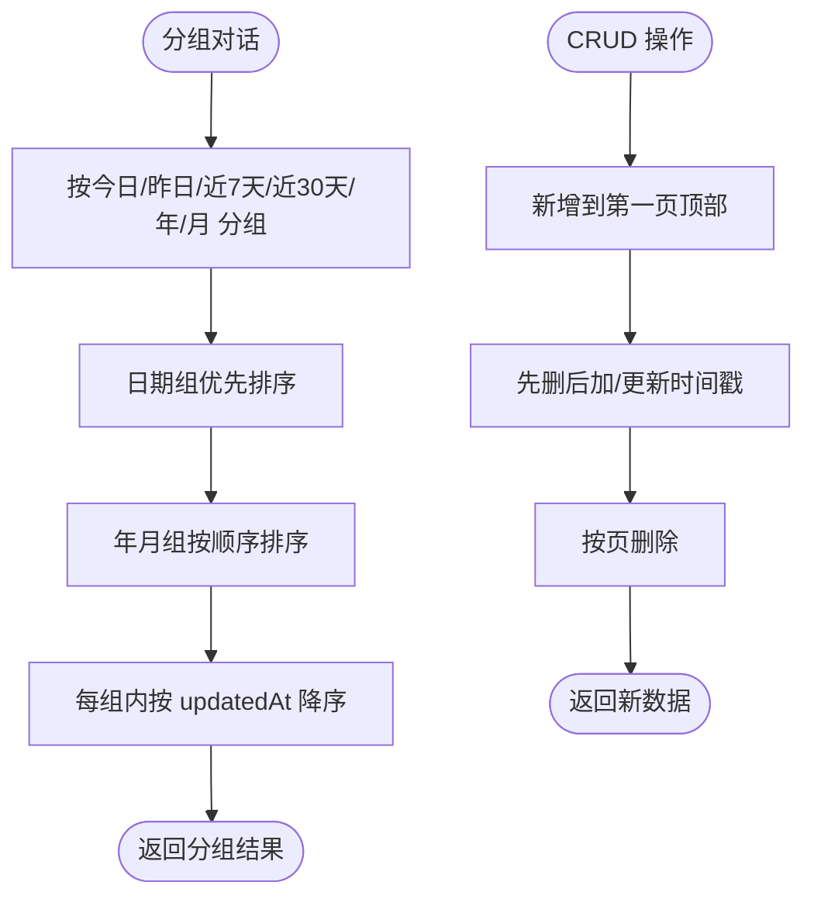

图表来源
- [src/frontend/client/src/utils/convos.ts](file://src/frontend/client/src/utils/convos.ts#L88-L274)

章节来源
- [src/frontend/client/src/utils/convos.ts](file://src/frontend/client/src/utils/convos.ts#L1-L274)

### 端点与图标（endpoints）
职责：端点可用性过滤、默认模型规格选择、图标键推断、实体（助手/代理）解析。

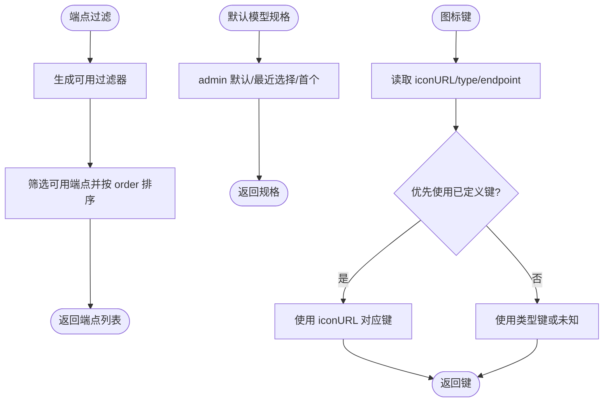

图表来源
- [src/frontend/client/src/utils/endpoints.ts](file://src/frontend/client/src/utils/endpoints.ts#L28-L262)

章节来源
- [src/frontend/client/src/utils/endpoints.ts](file://src/frontend/client/src/utils/endpoints.ts#L1-L263)

### Tailwind 类合并（cn）
职责：合并 Tailwind 类并进行冲突修复，支持条件类传入。

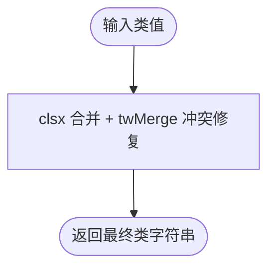

图表来源
- [src/frontend/client/src/utils/cn.ts](file://src/frontend/client/src/utils/cn.ts#L9-L11)

章节来源
- [src/frontend/client/src/utils/cn.ts](file://src/frontend/client/src/utils/cn.ts#L1-L12)

### 文本域操作（textarea）
职责：光标处插入文本、强制高度重算、撤销后修剪、检测可滚动。

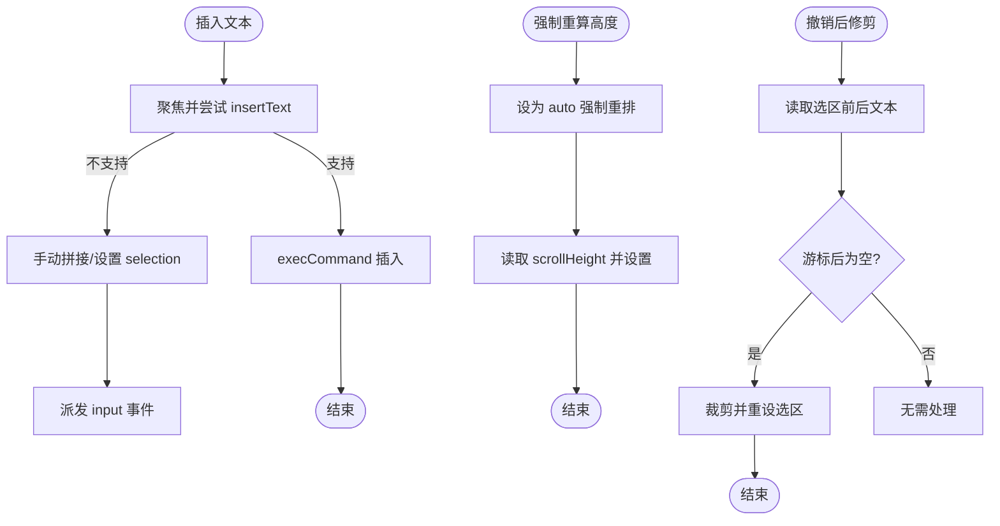

图表来源
- [src/frontend/client/src/utils/textarea.ts](file://src/frontend/client/src/utils/textarea.ts#L4-L87)

章节来源
- [src/frontend/client/src/utils/textarea.ts](file://src/frontend/client/src/utils/textarea.ts#L1-L88)

### 语言与别名（languages）
职责：提供语言集合、常用子集、别名映射与归一化函数。

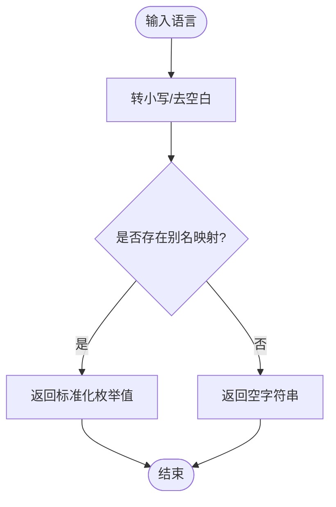

图表来源
- [src/frontend/client/src/utils/languages.ts](file://src/frontend/client/src/utils/languages.ts#L418-L427)

章节来源
- [src/frontend/client/src/utils/languages.ts](file://src/frontend/client/src/utils/languages.ts#L1-L428)

## 依赖关系分析
- 模块内聚：每个文件聚焦单一职责，减少跨文件耦合。
- 外部依赖：Axios（下载）、date-fns（日期）、Tailwind 工具（类合并）、TanStack Query（缓存）。
- 导出聚合：index.ts 统一导出，便于上层按需引入，避免重复导入。

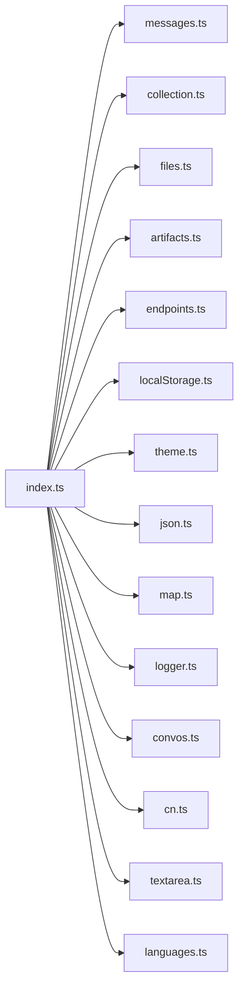

图表来源
- [src/frontend/client/src/utils/index.ts](file://src/frontend/client/src/utils/index.ts#L4-L25)

章节来源
- [src/frontend/client/src/utils/index.ts](file://src/frontend/client/src/utils/index.ts#L1-L276)

## 性能考量
- 函数组合与纯函数：尽量保持无副作用，输入输出可预测，便于缓存与测试。
- 防抖与节流：对高频 UI 事件（如窗口大小变化、滚动、输入）建议在组件层使用防抖/节流包装工具函数。
- memoization：对昂贵计算（如复杂正则/字符串处理）可在组件层结合 useMemo/useCallback 使用。
- 批量更新：集合操作优先使用“先删后加”策略并置顶，减少多次渲染。
- 查询缓存：利用 QueryClient 的 setQueryData 批量更新，避免全量刷新。
- 字符串与正则：避免在热路径重复编译正则，可复用常量。
- DOM 操作：文本域强制重算仅在必要时触发，避免频繁回流。

## 故障排查指南
- 日志过滤无效：确认环境变量 VITE_ENABLE_LOGGER 与 VITE_LOGGER_FILTER 设置正确。
- 字体大小未生效：检查 CSS 变量 --markdown-font-size 是否被覆盖。
- 工件依赖缺失：确认 getDependencies 返回的依赖映射包含所需包。
- 上传校验失败：检查 supportedMimeTypes、fileSizeLimit、totalSizeLimit 配置与文件类型推断逻辑。
- 会话缓存不同步：确认 QueryClient 的 queryKey 与集合操作一致。
- 文本插入异常：在不支持 insertText 的浏览器中，确保回退逻辑正确派发 input 事件。
- 语言归一化失败：确认别名映射表是否包含目标语言变体。

章节来源
- [src/frontend/client/src/utils/logger.ts](file://src/frontend/client/src/utils/logger.ts#L1-L50)
- [src/frontend/client/src/utils/theme.ts](file://src/frontend/client/src/utils/theme.ts#L1-L40)
- [src/frontend/client/src/utils/artifacts.ts](file://src/frontend/client/src/utils/artifacts.ts#L147-L149)
- [src/frontend/client/src/utils/files.ts](file://src/frontend/client/src/utils/files.ts#L222-L303)
- [src/frontend/client/src/utils/collection.ts](file://src/frontend/client/src/utils/collection.ts#L177-L220)
- [src/frontend/client/src/utils/textarea.ts](file://src/frontend/client/src/utils/textarea.ts#L8-L21)

## 结论
该工具函数库以清晰的功能域划分与统一导出聚合，提供了覆盖消息、对话、端点、文件、主题、本地存储、JSON、映射、集合缓存、日志、语言与文本域操作的完整工具集。遵循纯函数与最小副作用原则，配合 QueryCache 与环境变量控制，既保证了可维护性，也为性能优化提供了良好基础。建议在组件层结合防抖节流与 memoization 进一步提升交互流畅度。

## 附录
- 命名规范：动词短语（如 getXXX、formatXXX、validateXXX），布尔返回函数以 is/has 开头。
- 参数约定：必填参数置于前，可选参数使用默认值或可选链；复杂对象参数建议解构并提供默认值。
- 返回值格式：明确标注字符串/数字/布尔/对象/数组；对可能为空的值提供兜底空对象/空数组。
- 兼容性：对浏览器 API（Clipboard、execCommand、matchMedia）做能力检测与回退。
- 测试策略：针对边界条件（空输入、非法 JSON、空集合、无匹配映射）编写单元测试；对 UI 交互（文本域、滚动）编写集成测试。