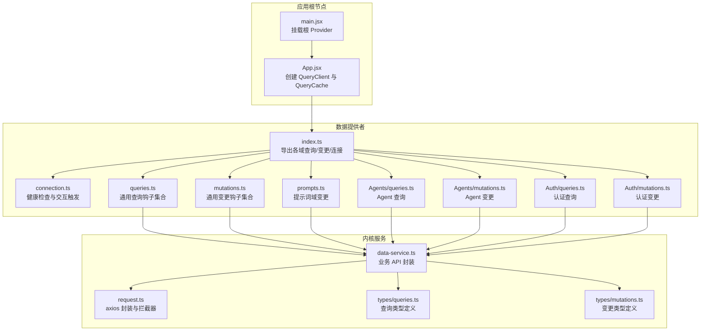
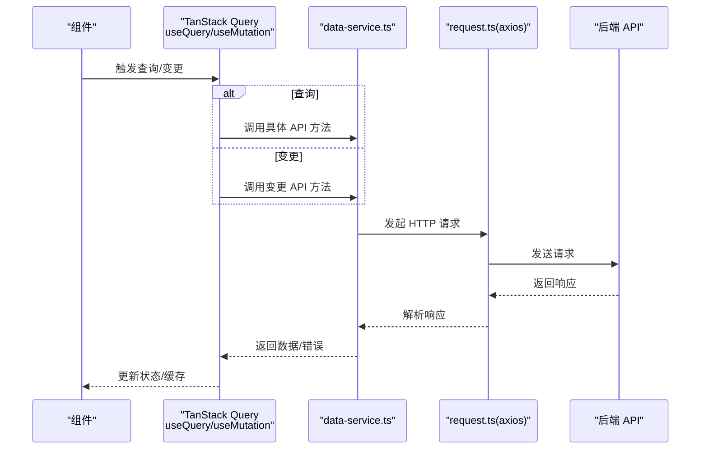
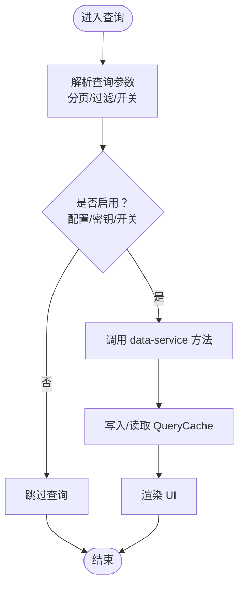
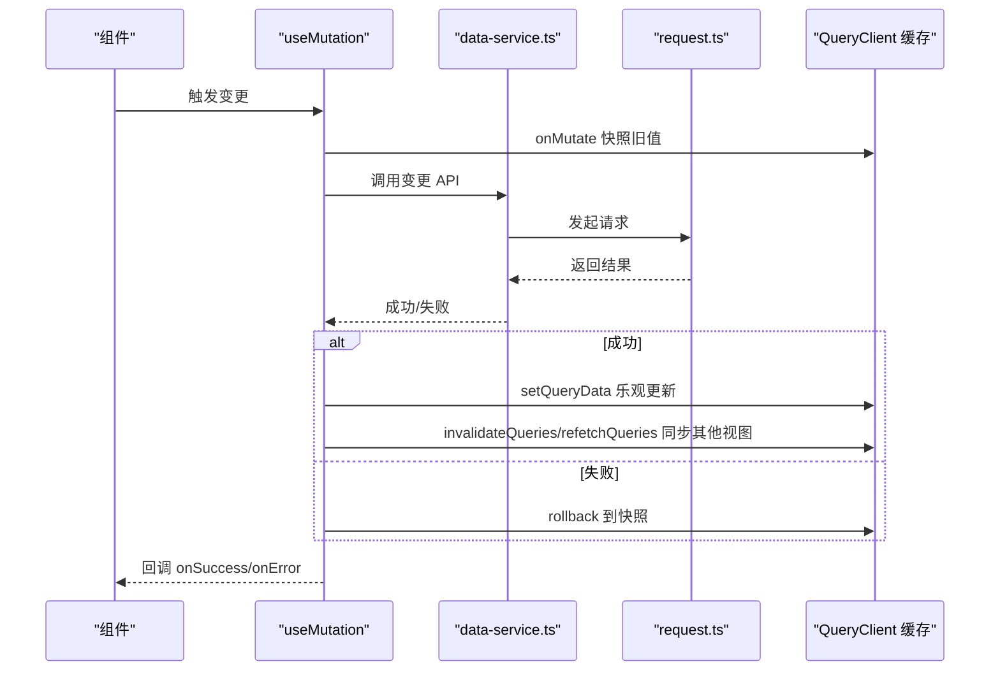
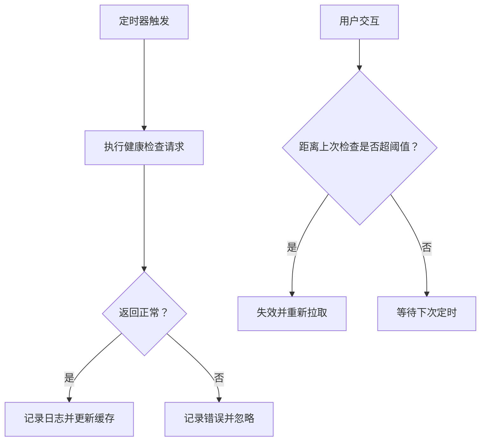
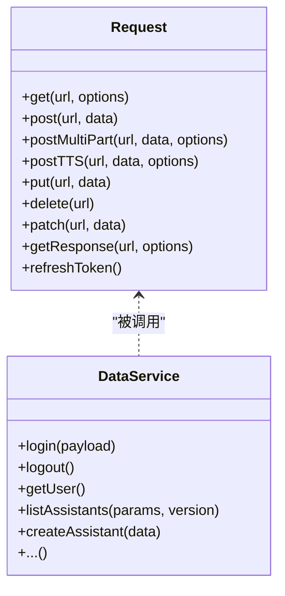
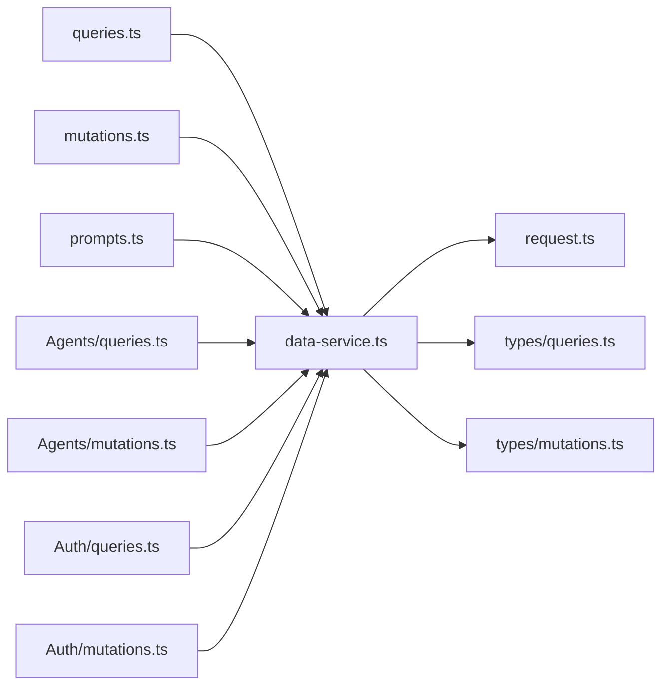

# 数据提供者

<cite>
**本文引用的文件**
- [src/frontend/client/src/App.jsx](file://src/frontend/client/src/App.jsx)
- [src/frontend/client/src/main.jsx](file://src/frontend/client/src/main.jsx)
- [src/frontend/client/src/data-provider/index.ts](file://src/frontend/client/src/data-provider/index.ts)
- [src/frontend/client/src/data-provider/connection.ts](file://src/frontend/client/src/data-provider/connection.ts)
- [src/frontend/client/src/data-provider/queries.ts](file://src/frontend/client/src/data-provider/queries.ts)
- [src/frontend/client/src/data-provider/mutations.ts](file://src/frontend/client/src/data-provider/mutations.ts)
- [src/frontend/client/src/data-provider/prompts.ts](file://src/frontend/client/src/data-provider/prompts.ts)
- [src/frontend/client/src/data-provider/Agents/queries.ts](file://src/frontend/client/src/data-provider/Agents/queries.ts)
- [src/frontend/client/src/data-provider/Agents/mutations.ts](file://src/frontend/client/src/data-provider/Agents/mutations.ts)
- [src/frontend/client/src/data-provider/Auth/queries.ts](file://src/frontend/client/src/data-provider/Auth/queries.ts)
- [src/frontend/client/src/data-provider/Auth/mutations.ts](file://src/frontend/client/src/data-provider/Auth/mutations.ts)
- [src/frontend/client/src/data-provider/data-provider/src/index.ts](file://src/frontend/client/src/data-provider/data-provider/src/index.ts)
- [src/frontend/client/src/data-provider/data-provider/src/types/queries.ts](file://src/frontend/client/src/data-provider/data-provider/src/types/queries.ts)
- [src/frontend/client/src/data-provider/data-provider/src/types/mutations.ts](file://src/frontend/client/src/data-provider/data-provider/src/types/mutations.ts)
- [src/frontend/client/src/data-provider/data-provider/src/data-service.ts](file://src/frontend/client/src/data-provider/data-provider/src/data-service.ts)
- [src/frontend/client/src/data-provider/data-provider/src/request.ts](file://src/frontend/client/src/data-provider/data-provider/src/request.ts)
</cite>

## 目录
1. [引言](#引言)
2. [项目结构](#项目结构)
3. [核心组件](#核心组件)
4. [架构总览](#架构总览)
5. [详细组件分析](#详细组件分析)
6. [依赖关系分析](#依赖关系分析)
7. [性能考量](#性能考量)
8. [故障排查指南](#故障排查指南)
9. [结论](#结论)
10. [附录：API 调用与最佳实践](#附录api-调用与最佳实践)

## 引言
本文件系统性梳理 Bisheng 前端“数据提供者”体系，围绕查询（Queries）、变更（Mutations）、连接管理与缓存策略展开，详解 TanStack Query 的集成与配置、API 客户端封装、请求/响应拦截器、数据预取与乐观更新、离线处理、数据一致性与并发控制、内存管理等主题，并给出可复用的最佳实践与扩展建议。

## 项目结构
数据提供者位于前端客户端工程中，采用按功能域分层组织：
- 根入口与 Provider 层：应用根节点注入 QueryClientProvider，统一承载缓存与失效策略。
- 功能域模块：按资源域划分（如 Auth、Agents、Prompts 等），每个域内包含 queries.ts、mutations.ts、index.ts 等文件，形成“查询+变更”的双轨接口。
- 内核服务层：data-service.ts 封装具体 API 调用；request.ts 提供 axios 封装与拦截器；types 下定义查询/变更参数与返回类型。

图表来源
- [src/frontend/client/src/App.jsx](file://src/frontend/client/src/App.jsx#L1-L53)
- [src/frontend/client/src/main.jsx](file://src/frontend/client/src/main.jsx#L1-L18)
- [src/frontend/client/src/data-provider/index.ts](file://src/frontend/client/src/data-provider/index.ts#L1-L14)
- [src/frontend/client/src/data-provider/connection.ts](file://src/frontend/client/src/data-provider/connection.ts#L1-L49)
- [src/frontend/client/src/data-provider/queries.ts](file://src/frontend/client/src/data-provider/queries.ts#L1-L570)
- [src/frontend/client/src/data-provider/mutations.ts](file://src/frontend/client/src/data-provider/mutations.ts#L1-L1099)
- [src/frontend/client/src/data-provider/prompts.ts](file://src/frontend/client/src/data-provider/prompts.ts#L1-L330)
- [src/frontend/client/src/data-provider/Agents/queries.ts](file://src/frontend/client/src/data-provider/Agents/queries.ts#L1-L77)
- [src/frontend/client/src/data-provider/Agents/mutations.ts](file://src/frontend/client/src/data-provider/Agents/mutations.ts#L1-L303)
- [src/frontend/client/src/data-provider/Auth/queries.ts](file://src/frontend/client/src/data-provider/Auth/queries.ts#L1-L21)
- [src/frontend/client/src/data-provider/Auth/mutations.ts](file://src/frontend/client/src/data-provider/Auth/mutations.ts#L1-L175)
- [src/frontend/client/src/data-provider/data-provider/src/data-service.ts](file://src/frontend/client/src/data-provider/data-provider/src/data-service.ts#L1-L1019)
- [src/frontend/client/src/data-provider/data-provider/src/request.ts](file://src/frontend/client/src/data-provider/data-provider/src/request.ts#L1-L187)

章节来源
- [src/frontend/client/src/App.jsx](file://src/frontend/client/src/App.jsx#L1-L53)
- [src/frontend/client/src/main.jsx](file://src/frontend/client/src/main.jsx#L1-L18)
- [src/frontend/client/src/data-provider/index.ts](file://src/frontend/client/src/data-provider/index.ts#L1-L14)

## 核心组件
- 应用级 QueryClient 与 QueryCache
  - 在应用根节点创建 QueryClient，并注入 QueryCache.onError 处理 401 场景，确保未授权时进入错误边界。
  - 关闭窗口焦点/网络重连/挂载自动刷新，避免无谓请求与抖动。
- 连接管理
  - 健康检查：定时轮询后端健康状态，支持交互触发即时检查。
  - 缓存与新鲜度：通过 cacheTime/staleTime 与 refetchOnWindowFocus 控制缓存生命周期。
- 查询（Queries）
  - 会话列表、共享链接、标签、助手、动作、提示词等均以 useQuery/useInfiniteQuery 包装，统一启用/禁用逻辑与分页参数。
  - 支持基于 Recoil 的开关控制（如 queriesEnabled）。
- 变更（Mutations）
  - 乐观更新：在 onSuccess 中先写入本地缓存，再等待服务端确认；失败时回滚。
  - 并发安全：使用 onMutate 捕获上下文，必要时取消相关查询并保存旧值用于回滚。
  - 一致性维护：变更后主动更新多处缓存键（如单个会话、分页列表、归档列表）。
- API 客户端与拦截器
  - request.ts 基于 axios，统一封装 GET/POST/PUT/DELETE/PATCH 与 multipart 请求。
  - 响应拦截器处理 403/401 等错误，生产环境跳转登录或刷新流程预留。
- 类型与键
  - types/queries.ts 与 types/mutations.ts 定义查询/变更参数与返回类型。
  - data-service.ts 汇聚所有业务 API 方法，作为查询/变更的唯一调用入口。

章节来源
- [src/frontend/client/src/App.jsx](file://src/frontend/client/src/App.jsx#L16-L24)
- [src/frontend/client/src/data-provider/connection.ts](file://src/frontend/client/src/data-provider/connection.ts#L1-L49)
- [src/frontend/client/src/data-provider/queries.ts](file://src/frontend/client/src/data-provider/queries.ts#L1-L570)
- [src/frontend/client/src/data-provider/mutations.ts](file://src/frontend/client/src/data-provider/mutations.ts#L1-L1099)
- [src/frontend/client/src/data-provider/data-provider/src/request.ts](file://src/frontend/client/src/data-provider/data-provider/src/request.ts#L1-L187)
- [src/frontend/client/src/data-provider/data-provider/src/types/queries.ts](file://src/frontend/client/src/data-provider/data-provider/src/types/queries.ts#L1-L93)
- [src/frontend/client/src/data-provider/data-provider/src/types/mutations.ts](file://src/frontend/client/src/data-provider/data-provider/src/types/mutations.ts#L1-L339)
- [src/frontend/client/src/data-provider/data-provider/src/data-service.ts](file://src/frontend/client/src/data-provider/data-provider/src/data-service.ts#L1-L1019)

## 架构总览
数据提供者遵循“查询/变更分离 + 服务层聚合 + 拦截器统一处理”的分层架构。查询侧通过 useQuery/useInfiniteQuery 维护缓存与分页；变更侧通过 useMutation 实现乐观更新与一致性维护；服务层对 axios 进行统一封装，提供拦截器与错误处理；类型层约束参数与返回，确保强类型安全。

图表来源
- [src/frontend/client/src/data-provider/queries.ts](file://src/frontend/client/src/data-provider/queries.ts#L1-L570)
- [src/frontend/client/src/data-provider/mutations.ts](file://src/frontend/client/src/data-provider/mutations.ts#L1-L1099)
- [src/frontend/client/src/data-provider/data-provider/src/data-service.ts](file://src/frontend/client/src/data-provider/data-provider/src/data-service.ts#L1-L1019)
- [src/frontend/client/src/data-provider/data-provider/src/request.ts](file://src/frontend/client/src/data-provider/data-provider/src/request.ts#L1-L187)

## 详细组件分析

### 查询（Queries）组件分析
- 会话与分页
  - useConversationsInfiniteQuery/useSearchInfiniteQuery：支持分页参数与 keepPreviousData，设置合理的 staleTime/cacheTime，避免频繁拉取。
  - useGetConvoIdQuery：优先从分页缓存中命中，否则回退到单条查询，提升交互体验。
- 共享链接
  - useSharedLinksQuery：基于游标分页，nextCursor 作为下一页依据，保持 keepPreviousData。
- 助手与工具
  - useListAssistantsQuery/useAvailableToolsQuery：根据 endpoints 配置与密钥状态动态启用，避免无效请求。
- 提示词
  - usePromptGroupsInfiniteQuery/useGetPrompts：支持名称/分类过滤与分页。
- 用户与配置
  - useGetUserQuery：结合 Recoil 开关控制是否启用查询。
- 健康检查
  - useHealthCheck/useInteractionHealthCheck：定时轮询与交互触发，确保连接可用性。

图表来源
- [src/frontend/client/src/data-provider/queries.ts](file://src/frontend/client/src/data-provider/queries.ts#L119-L147)
- [src/frontend/client/src/data-provider/queries.ts](file://src/frontend/client/src/data-provider/queries.ts#L149-L172)
- [src/frontend/client/src/data-provider/queries.ts](file://src/frontend/client/src/data-provider/queries.ts#L222-L250)
- [src/frontend/client/src/data-provider/queries.ts](file://src/frontend/client/src/data-provider/queries.ts#L196-L217)
- [src/frontend/client/src/data-provider/Auth/queries.ts](file://src/frontend/client/src/data-provider/Auth/queries.ts#L1-L21)

章节来源
- [src/frontend/client/src/data-provider/queries.ts](file://src/frontend/client/src/data-provider/queries.ts#L1-L570)
- [src/frontend/client/src/data-provider/Auth/queries.ts](file://src/frontend/client/src/data-provider/Auth/queries.ts#L1-L21)

### 变更（Mutations）组件分析
- 会话标题生成
  - useGenTitleMutation：乐观更新单个会话标题，并同步更新分页列表对应项。
- 会话归档/删除/复制/派生
  - useArchiveConversationMutation/useDeleteConversationMutation/useDuplicateConversationMutation/useForkConvoMutation：变更后同时更新单个会话缓存与分页列表缓存，必要时触发分页 refetch。
- 标签管理
  - useTagConversationMutation/useConversationTagMutation/useDeleteConversationTagMutation：支持标签增删改查，变更后统一更新全局标签列表与各会话标签。
- 共享链接
  - useCreateSharedLinkMutation/useUpdateSharedLinkMutation/useDeleteSharedLinkMutation：删除时先快照当前查询集，失败时回滚；成功后失效并重新拉取。
- 提示词
  - useUpdatePromptGroup/useCreatePrompt/useDeletePrompt/useDeletePromptGroup/useMakePromptProduction：变更后同步更新分页列表与全局缓存，确保一致性。
- Agent/助手
  - Agent 与 Assistant 的创建/更新/删除/复制/头像上传等均采用乐观更新与缓存同步策略。

图表来源
- [src/frontend/client/src/data-provider/mutations.ts](file://src/frontend/client/src/data-provider/mutations.ts#L1-L1099)
- [src/frontend/client/src/data-provider/prompts.ts](file://src/frontend/client/src/data-provider/prompts.ts#L1-L330)
- [src/frontend/client/src/data-provider/Agents/mutations.ts](file://src/frontend/client/src/data-provider/Agents/mutations.ts#L1-L303)
- [src/frontend/client/src/data-provider/data-provider/src/data-service.ts](file://src/frontend/client/src/data-provider/data-provider/src/data-service.ts#L1-L1019)
- [src/frontend/client/src/data-provider/data-provider/src/request.ts](file://src/frontend/client/src/data-provider/data-provider/src/request.ts#L1-L187)

章节来源
- [src/frontend/client/src/data-provider/mutations.ts](file://src/frontend/client/src/data-provider/mutations.ts#L1-L1099)
- [src/frontend/client/src/data-provider/prompts.ts](file://src/frontend/client/src/data-provider/prompts.ts#L1-L330)
- [src/frontend/client/src/data-provider/Agents/mutations.ts](file://src/frontend/client/src/data-provider/Agents/mutations.ts#L1-L303)

### 连接管理与健康检查
- 周期性健康检查：定时轮询后端健康状态，避免缓存陈旧导致误判。
- 交互触发检查：用户操作后若超过阈值时间未检查，则主动失效并重新拉取。
- 错误处理：健康检查失败记录日志，不阻断主流程。

图表来源
- [src/frontend/client/src/data-provider/connection.ts](file://src/frontend/client/src/data-provider/connection.ts#L1-L49)

章节来源
- [src/frontend/client/src/data-provider/connection.ts](file://src/frontend/client/src/data-provider/connection.ts#L1-L49)

### API 客户端封装与拦截器
- 统一请求封装：提供 get/post/put/delete/patch/postMultiPart/postTTS/getResponse 等方法，屏蔽 axios 细节。
- 拦截器策略：
  - 响应拦截：处理 403/401 等错误，生产环境进行登录跳转或令牌刷新预留。
  - 请求拦截：统一设置 Token 头部，事件通知令牌更新。
- 服务层聚合：data-service.ts 将所有业务 API 方法集中暴露，查询/变更仅依赖该层，便于替换与测试。

图表来源
- [src/frontend/client/src/data-provider/data-provider/src/request.ts](file://src/frontend/client/src/data-provider/data-provider/src/request.ts#L1-L187)
- [src/frontend/client/src/data-provider/data-provider/src/data-service.ts](file://src/frontend/client/src/data-provider/data-provider/src/data-service.ts#L1-L1019)

章节来源
- [src/frontend/client/src/data-provider/data-provider/src/request.ts](file://src/frontend/client/src/data-provider/data-provider/src/request.ts#L1-L187)
- [src/frontend/client/src/data-provider/data-provider/src/data-service.ts](file://src/frontend/client/src/data-provider/data-provider/src/data-service.ts#L1-L1019)

## 依赖关系分析
- 组件耦合
  - 查询/变更钩子依赖 data-service.ts，后者依赖 request.ts 与后端接口。
  - 查询钩子通过 QueryClient 访问/更新缓存，变更钩子通过 setQueryData/invalidates/refetch 实现一致性。
- 外部依赖
  - TanStack Query：提供缓存、失效、分页、选择器等能力。
  - Axios：提供 HTTP 请求能力与拦截器。
  - Recoil：提供全局开关（如 queriesEnabled）与状态管理。
- 循环依赖
  - 通过“服务层聚合”避免查询/变更直接互相依赖，降低循环风险。

图表来源
- [src/frontend/client/src/data-provider/queries.ts](file://src/frontend/client/src/data-provider/queries.ts#L1-L570)
- [src/frontend/client/src/data-provider/mutations.ts](file://src/frontend/client/src/data-provider/mutations.ts#L1-L1099)
- [src/frontend/client/src/data-provider/prompts.ts](file://src/frontend/client/src/data-provider/prompts.ts#L1-L330)
- [src/frontend/client/src/data-provider/Agents/queries.ts](file://src/frontend/client/src/data-provider/Agents/queries.ts#L1-L77)
- [src/frontend/client/src/data-provider/Agents/mutations.ts](file://src/frontend/client/src/data-provider/Agents/mutations.ts#L1-L303)
- [src/frontend/client/src/data-provider/Auth/queries.ts](file://src/frontend/client/src/data-provider/Auth/queries.ts#L1-L21)
- [src/frontend/client/src/data-provider/Auth/mutations.ts](file://src/frontend/client/src/data-provider/Auth/mutations.ts#L1-L175)
- [src/frontend/client/src/data-provider/data-provider/src/data-service.ts](file://src/frontend/client/src/data-provider/data-provider/src/data-service.ts#L1-L1019)
- [src/frontend/client/src/data-provider/data-provider/src/request.ts](file://src/frontend/client/src/data-provider/data-provider/src/request.ts#L1-L187)
- [src/frontend/client/src/data-provider/data-provider/src/types/queries.ts](file://src/frontend/client/src/data-provider/data-provider/src/types/queries.ts#L1-L93)
- [src/frontend/client/src/data-provider/data-provider/src/types/mutations.ts](file://src/frontend/client/src/data-provider/data-provider/src/types/mutations.ts#L1-L339)

章节来源
- [src/frontend/client/src/data-provider/data-provider/src/index.ts](file://src/frontend/client/src/data-provider/data-provider/src/index.ts#L1-L37)

## 性能考量
- 缓存策略
  - 合理设置 staleTime/cacheTime，避免频繁拉取；对高频访问的数据（如会话列表）使用较长 cacheTime。
  - 分页场景使用 keepPreviousData，减少闪烁。
- 并发与回滚
  - onMutate 快照旧值，失败时回滚；必要时 cancelQueries 防止竞态。
- 网络与离线
  - 响应拦截器处理 401/403，生产环境可接入令牌刷新与重试策略。
  - 健康检查与交互触发结合，保障连接可用性。
- 内存管理
  - 登出/切换用户时 removeQueries 清空缓存，防止内存泄漏。
  - 对大对象（如分页列表）使用 normalizeData 保持结构稳定。

[本节为通用指导，无需特定文件引用]

## 故障排查指南
- 401 未授权
  - QueryCache.onError 捕获 401，进入错误边界；检查鉴权头与登录状态。
- 403 禁止访问
  - 响应拦截器处理 403，记录请求路径并跳转新建页面；检查权限与角色。
- 查询未生效
  - 检查 enabled 条件（配置/密钥/开关）与 queryKey 是否正确。
  - 确认 staleTime/cacheTime 设置是否过短导致频繁拉取。
- 变更后不一致
  - 确认是否调用了 setQueryData/invalidateQueries/refetchQueries。
  - 检查 onMutate 快照是否完整，onError 是否正确回滚。
- 健康检查异常
  - 查看日志输出与 lastUpdated 时间，确认定时器与交互触发逻辑。

章节来源
- [src/frontend/client/src/App.jsx](file://src/frontend/client/src/App.jsx#L16-L24)
- [src/frontend/client/src/data-provider/data-provider/src/request.ts](file://src/frontend/client/src/data-provider/data-provider/src/request.ts#L92-L172)
- [src/frontend/client/src/data-provider/connection.ts](file://src/frontend/client/src/data-provider/connection.ts#L1-L49)

## 结论
数据提供者通过清晰的分层与强类型约束，实现了查询/变更的解耦与可维护性；借助 TanStack Query 的缓存与失效机制，配合 request.ts 的拦截器与 data-service.ts 的聚合，提供了稳定可靠的前端数据流。建议在后续扩展中继续坚持“服务层聚合 + 类型约束 + 乐观更新 + 一致性维护”的设计原则，并持续完善错误处理与性能优化策略。

[本节为总结，无需特定文件引用]

## 附录：API 调用与最佳实践
- API 调用示例（路径）
  - 查询会话列表：[useConversationsInfiniteQuery](file://src/frontend/client/src/data-provider/queries.ts#L119-L147)
  - 创建共享链接：[useCreateSharedLinkMutation](file://src/frontend/client/src/data-provider/mutations.ts#L266-L289)
  - 删除标签：[useDeleteConversationTagMutation](file://src/frontend/client/src/data-provider/mutations.ts#L529-L551)
  - 更新 Agent 动作：[useUpdateAgentAction](file://src/frontend/client/src/data-provider/Agents/mutations.ts#L183-L239)
  - 登录：[useLoginUserMutation](file://src/frontend/client/src/data-provider/Auth/mutations.ts#L31-L52)
- 错误处理模式
  - 401：QueryCache.onError 捕获并进入错误边界。
  - 403：响应拦截器处理并记录请求路径。
  - 变更回滚：onMutate 快照 + onError 回滚。
- 性能优化技巧
  - 合理设置 staleTime/cacheTime，分页使用 keepPreviousData。
  - 登出/切换用户时 removeQueries 清理缓存。
  - 使用 enabled 条件与开关（如 queriesEnabled）控制查询。
- 扩展与自定义
  - 新增资源域：在 data-provider 下新增目录，按 queries.ts/mutations.ts 分别实现查询与变更钩子。
  - 服务层扩展：在 data-service.ts 中新增 API 方法，并在 request.ts 中完善拦截器。
  - 类型约束：在 types/queries.ts 与 types/mutations.ts 中补充参数与返回类型。

章节来源
- [src/frontend/client/src/data-provider/queries.ts](file://src/frontend/client/src/data-provider/queries.ts#L1-L570)
- [src/frontend/client/src/data-provider/mutations.ts](file://src/frontend/client/src/data-provider/mutations.ts#L1-L1099)
- [src/frontend/client/src/data-provider/Agents/mutations.ts](file://src/frontend/client/src/data-provider/Agents/mutations.ts#L1-L303)
- [src/frontend/client/src/data-provider/Auth/mutations.ts](file://src/frontend/client/src/data-provider/Auth/mutations.ts#L1-L175)
- [src/frontend/client/src/data-provider/data-provider/src/data-service.ts](file://src/frontend/client/src/data-provider/data-provider/src/data-service.ts#L1-L1019)
- [src/frontend/client/src/data-provider/data-provider/src/request.ts](file://src/frontend/client/src/data-provider/data-provider/src/request.ts#L1-L187)