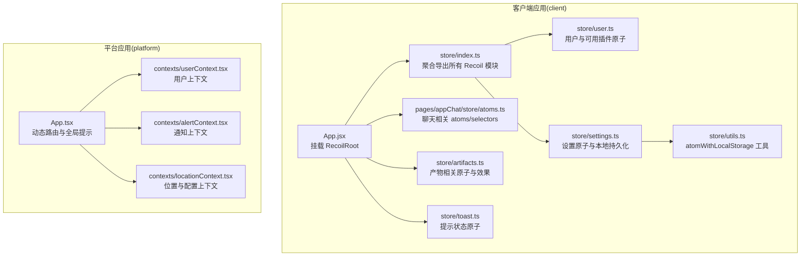
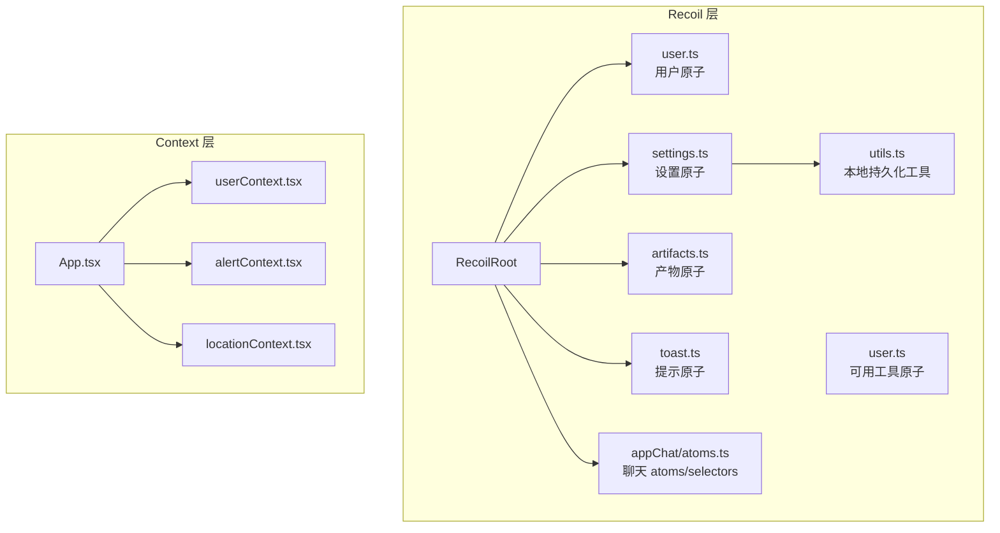
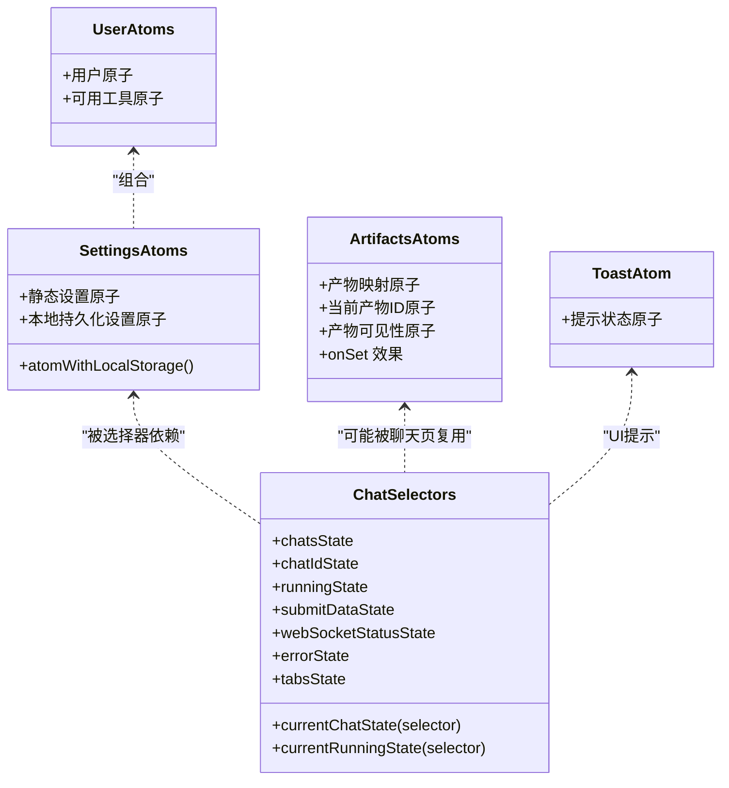
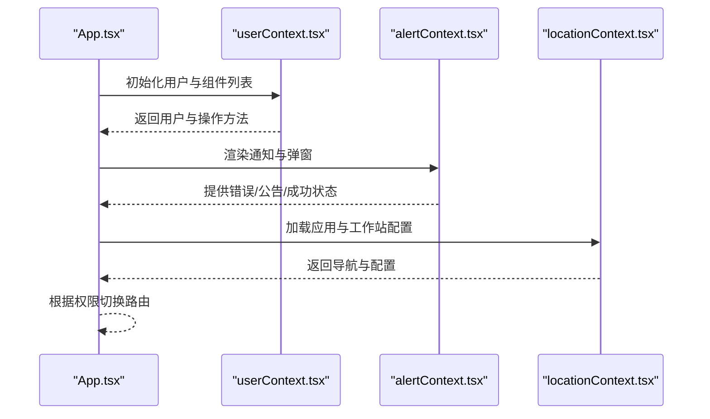
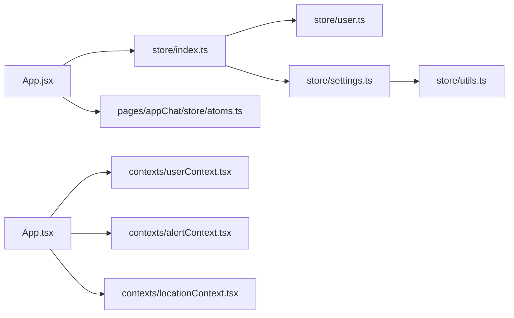

# 状态管理系统

<cite>
**本文引用的文件**
- [src/frontend/client/src/App.jsx](file://src/frontend/client/src/App.jsx)
- [src/frontend/client/src/store/index.ts](file://src/frontend/client/src/store/index.ts)
- [src/frontend/client/src/store/user.ts](file://src/frontend/client/src/store/user.ts)
- [src/frontend/client/src/store/settings.ts](file://src/frontend/client/src/store/settings.ts)
- [src/frontend/client/src/store/utils.ts](file://src/frontend/client/src/store/utils.ts)
- [src/frontend/client/src/store/artifacts.ts](file://src/frontend/client/src/store/artifacts.ts)
- [src/frontend/client/src/store/toast.ts](file://src/frontend/client/src/store/toast.ts)
- [src/frontend/client/src/pages/appChat/store/atoms.ts](file://src/frontend/client/src/pages/appChat/store/atoms.ts)
- [src/frontend/platform/src/App.tsx](file://src/frontend/platform/src/App.tsx)
- [src/frontend/platform/src/contexts/userContext.tsx](file://src/frontend/platform/src/contexts/userContext.tsx)
- [src/frontend/platform/src/contexts/alertContext.tsx](file://src/frontend/platform/src/contexts/alertContext.tsx)
- [src/frontend/platform/src/contexts/locationContext.tsx](file://src/frontend/platform/src/contexts/locationContext.tsx)
</cite>

## 目录
1. [简介](#简介)
2. [项目结构](#项目结构)
3. [核心组件](#核心组件)
4. [架构总览](#架构总览)
5. [详细组件分析](#详细组件分析)
6. [依赖关系分析](#依赖关系分析)
7. [性能考量](#性能考量)
8. [故障排查指南](#故障排查指南)
9. [结论](#结论)
10. [附录](#附录)

## 简介
本文件系统性梳理 Bisheng 前端状态管理方案，覆盖两类并行的状态体系：
- 基于 Recoil 的原子与选择器（atoms/selectors）：用于细粒度、可组合的全局状态建模，支持本地持久化与调试效果。
- 基于 React Context 的上下文状态：用于页面级或模块级共享状态，如用户、通知、导航等。

文档重点阐述：
- 原子与选择器的设计模式与最佳实践
- 全局状态分层与模块化组织
- 状态持久化策略（本地存储）
- 各类上下文（用户、通知、位置）的状态管理模式
- 状态同步、订阅与异步更新处理
- 调试工具使用、性能优化与内存泄漏防护
- 实际用法示例路径与常见陷阱规避

## 项目结构
前端状态相关代码主要分布在两个入口应用中：
- 客户端应用（client）：以 Recoil 为核心，构建细粒度状态模块，统一导出聚合。
- 平台应用（platform）：以 React Context 为主，承载用户态、通知、导航等业务上下文。

图表来源
- [src/frontend/client/src/App.jsx](file://src/frontend/client/src/App.jsx#L28-L44)
- [src/frontend/client/src/store/index.ts](file://src/frontend/client/src/store/index.ts#L16-L32)
- [src/frontend/client/src/store/user.ts](file://src/frontend/client/src/store/user.ts#L4-L17)
- [src/frontend/client/src/store/settings.ts](file://src/frontend/client/src/store/settings.ts#L21-L79)
- [src/frontend/client/src/store/utils.ts](file://src/frontend/client/src/store/utils.ts#L4-L31)
- [src/frontend/client/src/store/artifacts.ts](file://src/frontend/client/src/store/artifacts.ts#L5-L48)
- [src/frontend/client/src/store/toast.ts](file://src/frontend/client/src/store/toast.ts#L4-L14)
- [src/frontend/client/src/pages/appChat/store/atoms.ts](file://src/frontend/client/src/pages/appChat/store/atoms.ts#L8-L107)
- [src/frontend/platform/src/App.tsx](file://src/frontend/platform/src/App.tsx#L189-L244)
- [src/frontend/platform/src/contexts/userContext.tsx](file://src/frontend/platform/src/contexts/userContext.tsx#L29-L183)
- [src/frontend/platform/src/contexts/alertContext.tsx](file://src/frontend/platform/src/contexts/alertContext.tsx#L52-L161)
- [src/frontend/platform/src/contexts/locationContext.tsx](file://src/frontend/platform/src/contexts/locationContext.tsx#L58-L147)

章节来源
- [src/frontend/client/src/App.jsx](file://src/frontend/client/src/App.jsx#L26-L45)
- [src/frontend/client/src/store/index.ts](file://src/frontend/client/src/store/index.ts#L1-L33)
- [src/frontend/platform/src/App.tsx](file://src/frontend/platform/src/App.tsx#L1-L246)

## 核心组件
- Recoil 核心
  - 原子（atoms）：最小状态单元，如用户、可用工具、设置项、产物可见性等。
  - 选择器（selectors）：从原子派生的计算值，如当前聊天、当前运行状态等。
  - 效果（effects）：在原子值变化时执行副作用，如日志记录、本地持久化。
- Context 上下文
  - 用户上下文：用户信息、组件保存、登录拦截与权限跳转。
  - 通知上下文：错误/公告/成功提示的数据与弹窗控制。
  - 位置上下文：当前路由片段、侧边栏状态、额外导航与应用配置加载。

章节来源
- [src/frontend/client/src/store/user.ts](file://src/frontend/client/src/store/user.ts#L4-L17)
- [src/frontend/client/src/store/settings.ts](file://src/frontend/client/src/store/settings.ts#L7-L79)
- [src/frontend/client/src/store/utils.ts](file://src/frontend/client/src/store/utils.ts#L4-L31)
- [src/frontend/client/src/store/artifacts.ts](file://src/frontend/client/src/store/artifacts.ts#L5-L48)
- [src/frontend/client/src/pages/appChat/store/atoms.ts](file://src/frontend/client/src/pages/appChat/store/atoms.ts#L19-L53)
- [src/frontend/platform/src/contexts/userContext.tsx](file://src/frontend/platform/src/contexts/userContext.tsx#L8-L27)
- [src/frontend/platform/src/contexts/alertContext.tsx](file://src/frontend/platform/src/contexts/alertContext.tsx#L7-L26)
- [src/frontend/platform/src/contexts/locationContext.tsx](file://src/frontend/platform/src/contexts/locationContext.tsx#L5-L34)

## 架构总览
Bisheng 前端采用“双轨制”状态架构：
- 客户端应用通过 RecoilRoot 统一挂载，将各模块状态以原子与选择器形式组织，支持本地持久化与调试效果。
- 平台应用通过多个 Context Provider 组合，实现用户态、通知与导航等跨组件共享状态。

图表来源
- [src/frontend/client/src/App.jsx](file://src/frontend/client/src/App.jsx#L28-L44)
- [src/frontend/client/src/store/user.ts](file://src/frontend/client/src/store/user.ts#L4-L17)
- [src/frontend/client/src/store/settings.ts](file://src/frontend/client/src/store/settings.ts#L21-L79)
- [src/frontend/client/src/store/utils.ts](file://src/frontend/client/src/store/utils.ts#L4-L31)
- [src/frontend/client/src/store/artifacts.ts](file://src/frontend/client/src/store/artifacts.ts#L5-L48)
- [src/frontend/client/src/store/toast.ts](file://src/frontend/client/src/store/toast.ts#L4-L14)
- [src/frontend/client/src/pages/appChat/store/atoms.ts](file://src/frontend/client/src/pages/appChat/store/atoms.ts#L8-L107)
- [src/frontend/platform/src/App.tsx](file://src/frontend/platform/src/App.tsx#L189-L244)
- [src/frontend/platform/src/contexts/userContext.tsx](file://src/frontend/platform/src/contexts/userContext.tsx#L29-L183)
- [src/frontend/platform/src/contexts/alertContext.tsx](file://src/frontend/platform/src/contexts/alertContext.tsx#L52-L161)
- [src/frontend/platform/src/contexts/locationContext.tsx](file://src/frontend/platform/src/contexts/locationContext.tsx#L58-L147)

## 详细组件分析

### Recoil：原子与选择器模式
- 设计要点
  - 将状态拆分为细粒度原子，便于按需订阅与更新。
  - 使用选择器从原子派生只读或可变的计算值，降低重复计算与耦合。
  - 对需要持久化的原子，使用本地持久化工具函数，确保刷新后状态不丢失。
  - 通过效果（effects）对关键状态变更进行日志记录或副作用处理。
- 关键实现路径
  - 用户与可用工具原子：[src/frontend/client/src/store/user.ts](file://src/frontend/client/src/store/user.ts#L4-L17)
  - 设置原子与本地持久化：[src/frontend/client/src/store/settings.ts](file://src/frontend/client/src/store/settings.ts#L21-L79)、[src/frontend/client/src/store/utils.ts](file://src/frontend/client/src/store/utils.ts#L4-L31)
  - 产物相关原子与效果：[src/frontend/client/src/store/artifacts.ts](file://src/frontend/client/src/store/artifacts.ts#L5-L48)
  - 提示状态原子：[src/frontend/client/src/store/toast.ts](file://src/frontend/client/src/store/toast.ts#L4-L14)
  - 聊天相关 atoms/selectors：[src/frontend/client/src/pages/appChat/store/atoms.ts](file://src/frontend/client/src/pages/appChat/store/atoms.ts#L8-L107)

图表来源
- [src/frontend/client/src/store/user.ts](file://src/frontend/client/src/store/user.ts#L4-L17)
- [src/frontend/client/src/store/settings.ts](file://src/frontend/client/src/store/settings.ts#L7-L79)
- [src/frontend/client/src/store/utils.ts](file://src/frontend/client/src/store/utils.ts#L4-L31)
- [src/frontend/client/src/store/artifacts.ts](file://src/frontend/client/src/store/artifacts.ts#L5-L48)
- [src/frontend/client/src/store/toast.ts](file://src/frontend/client/src/store/toast.ts#L4-L14)
- [src/frontend/client/src/pages/appChat/store/atoms.ts](file://src/frontend/client/src/pages/appChat/store/atoms.ts#L8-L107)

章节来源
- [src/frontend/client/src/store/user.ts](file://src/frontend/client/src/store/user.ts#L4-L17)
- [src/frontend/client/src/store/settings.ts](file://src/frontend/client/src/store/settings.ts#L7-L79)
- [src/frontend/client/src/store/utils.ts](file://src/frontend/client/src/store/utils.ts#L4-L31)
- [src/frontend/client/src/store/artifacts.ts](file://src/frontend/client/src/store/artifacts.ts#L5-L48)
- [src/frontend/client/src/store/toast.ts](file://src/frontend/client/src/store/toast.ts#L4-L14)
- [src/frontend/client/src/pages/appChat/store/atoms.ts](file://src/frontend/client/src/pages/appChat/store/atoms.ts#L8-L107)

### 全局状态设计原则
- 分层与模块化
  - 将状态按功能域拆分到独立模块（如 user、settings、artifacts、toast），并在入口统一聚合导出，便于按需引入与测试。
  - 聊天域状态集中于 appChat 子目录，避免与通用状态交叉污染。
- 状态持久化策略
  - 对用户可感知且需要跨会话保持的设置，使用本地持久化工具函数创建原子，保证刷新后恢复。
  - 对临时 UI 状态（如提示框）不建议持久化，避免污染本地存储。
- 选择器优先
  - 优先使用选择器从原子派生计算值，减少直接订阅大对象导致的过度渲染。
- 效果与调试
  - 在关键原子上注册 onSet 效果，记录状态变更日志，辅助定位问题。
- 订阅与同步
  - 组件通过 hooks 订阅原子/选择器，异步更新通过原子 setter 触发，Recoil 自动调度依赖更新。

章节来源
- [src/frontend/client/src/store/index.ts](file://src/frontend/client/src/store/index.ts#L16-L32)
- [src/frontend/client/src/store/settings.ts](file://src/frontend/client/src/store/settings.ts#L21-L79)
- [src/frontend/client/src/store/utils.ts](file://src/frontend/client/src/store/utils.ts#L4-L31)
- [src/frontend/client/src/store/artifacts.ts](file://src/frontend/client/src/store/artifacts.ts#L5-L48)
- [src/frontend/client/src/pages/appChat/store/atoms.ts](file://src/frontend/client/src/pages/appChat/store/atoms.ts#L19-L53)

### 上下文（Context）实现与状态模式
- 用户上下文（userContext）
  - 职责：维护用户登录态、组件保存/覆盖/删除、权限校验与跳转。
  - 模式：Provider 内部使用 useState 管理用户与已保存组件列表；通过请求拦截器处理异地登录等场景。
  - 示例路径：[src/frontend/platform/src/contexts/userContext.tsx](file://src/frontend/platform/src/contexts/userContext.tsx#L29-L183)
- 通知上下文（alertContext）
  - 职责：集中管理错误/公告/成功三类提示的数据与弹窗开关，以及通知中心列表。
  - 模式：Provider 内部以多组状态变量与 setter 组织，提供入队与清理能力。
  - 示例路径：[src/frontend/platform/src/contexts/alertContext.tsx](file://src/frontend/platform/src/contexts/alertContext.tsx#L52-L161)
- 位置上下文（locationContext）
  - 职责：维护当前路由片段、侧边栏状态、额外导航与应用配置（含工作站配置）。
  - 模式：Provider 内部加载配置并合并到 appConfig，供页面消费。
  - 示例路径：[src/frontend/platform/src/contexts/locationContext.tsx](file://src/frontend/platform/src/contexts/locationContext.tsx#L58-L147)
- 平台应用（App.tsx）
  - 职责：根据用户态与权限动态渲染路由，集成全局提示与弹窗组件。
  - 示例路径：[src/frontend/platform/src/App.tsx](file://src/frontend/platform/src/App.tsx#L189-L244)

图表来源
- [src/frontend/platform/src/App.tsx](file://src/frontend/platform/src/App.tsx#L189-L244)
- [src/frontend/platform/src/contexts/userContext.tsx](file://src/frontend/platform/src/contexts/userContext.tsx#L29-L183)
- [src/frontend/platform/src/contexts/alertContext.tsx](file://src/frontend/platform/src/contexts/alertContext.tsx#L52-L161)
- [src/frontend/platform/src/contexts/locationContext.tsx](file://src/frontend/platform/src/contexts/locationContext.tsx#L58-L147)

章节来源
- [src/frontend/platform/src/contexts/userContext.tsx](file://src/frontend/platform/src/contexts/userContext.tsx#L8-L27)
- [src/frontend/platform/src/contexts/alertContext.tsx](file://src/frontend/platform/src/contexts/alertContext.tsx#L7-L26)
- [src/frontend/platform/src/contexts/locationContext.tsx](file://src/frontend/platform/src/contexts/locationContext.tsx#L5-L34)
- [src/frontend/platform/src/App.tsx](file://src/frontend/platform/src/App.tsx#L189-L244)

### 状态同步机制、订阅模式与异步更新
- 同步机制
  - Recoil 通过原子与选择器的依赖图自动同步，组件订阅后在依赖变化时批量更新。
  - Context 通过 Provider 向子树广播状态，子组件通过 useContext 订阅。
- 订阅模式
  - Recoil：使用 hooks 订阅原子/选择器，避免手动订阅与解绑。
  - Context：useContext 获取上下文值与 setter，直接更新状态。
- 异步更新
  - Recoil：通过原子 setter 触发异步副作用（如网络请求），在 effects 中处理结果。
  - Context：在 Provider 内部发起异步请求（如获取用户信息、加载配置），完成后更新状态。

章节来源
- [src/frontend/client/src/store/artifacts.ts](file://src/frontend/client/src/store/artifacts.ts#L9-L16)
- [src/frontend/client/src/store/settings.ts](file://src/frontend/client/src/store/settings.ts#L21-L79)
- [src/frontend/platform/src/contexts/userContext.tsx](file://src/frontend/platform/src/contexts/userContext.tsx#L93-L173)
- [src/frontend/platform/src/contexts/locationContext.tsx](file://src/frontend/platform/src/contexts/locationContext.tsx#L71-L121)

### 状态调试工具使用指南
- Recoil
  - 使用 effects 记录关键状态变更，便于定位问题。
  - 可结合浏览器扩展（如 React DevTools）观察组件订阅与渲染次数。
- Context
  - 在 Provider 内部打印状态变化，或在组件中打印上下文值，确认同步是否生效。
- 平台应用
  - App.tsx 中对路由切换、权限判断与弹窗展示进行日志输出，有助于排查导航问题。

章节来源
- [src/frontend/client/src/store/artifacts.ts](file://src/frontend/client/src/store/artifacts.ts#L9-L16)
- [src/frontend/platform/src/App.tsx](file://src/frontend/platform/src/App.tsx#L123-L133)

### 性能优化策略
- 减少订阅范围
  - 将大对象拆分为多个原子，仅订阅必要字段，避免不必要的重渲染。
- 合理使用选择器
  - 将昂贵计算放入 selector，利用 ReuseStrategy 与缓存提升性能。
- 控制持久化范围
  - 仅对真正需要跨会话保留的设置启用本地持久化，避免存储膨胀。
- 合并状态更新
  - 在 Context 中尽量合并多次 setState 调用，减少渲染抖动。
- 懒加载与按需初始化
  - 应用配置与用户信息在首次需要时加载，避免首屏阻塞。

章节来源
- [src/frontend/client/src/store/settings.ts](file://src/frontend/client/src/store/settings.ts#L21-L79)
- [src/frontend/platform/src/contexts/locationContext.tsx](file://src/frontend/platform/src/contexts/locationContext.tsx#L71-L121)

### 内存泄漏防护措施
- 解绑事件监听
  - 在 Context 的 useEffect 中返回清理函数，移除事件监听器与定时器。
- 避免循环引用
  - 在 effects 或回调中不要持有对组件实例的强引用，防止闭包捕获造成泄漏。
- 控制全局状态规模
  - 对临时状态（如提示框）不持久化，避免长期占用内存。
- 及时释放资源
  - 在组件卸载时调用清理逻辑，确保异步任务取消或资源释放。

章节来源
- [src/frontend/platform/src/contexts/userContext.tsx](file://src/frontend/platform/src/contexts/userContext.tsx#L153-L156)
- [src/frontend/client/src/store/toast.ts](file://src/frontend/client/src/store/toast.ts#L4-L14)

### 实际用法示例与常见陷阱
- 正确用法示例（路径）
  - 创建本地持久化设置原子：[src/frontend/client/src/store/settings.ts](file://src/frontend/client/src/store/settings.ts#L21-L79)、[src/frontend/client/src/store/utils.ts](file://src/frontend/client/src/store/utils.ts#L4-L31)
  - 订阅当前聊天与运行状态：[src/frontend/client/src/pages/appChat/store/atoms.ts](file://src/frontend/client/src/pages/appChat/store/atoms.ts#L19-L53)
  - 更新用户信息与组件列表：[src/frontend/platform/src/contexts/userContext.tsx](file://src/frontend/platform/src/contexts/userContext.tsx#L29-L183)
  - 显示通知与弹窗：[src/frontend/platform/src/contexts/alertContext.tsx](file://src/frontend/platform/src/contexts/alertContext.tsx#L52-L161)
- 常见陷阱
  - 过度持久化：将临时 UI 状态持久化，导致本地存储膨胀与状态错乱。
  - 大对象订阅：直接订阅大型对象导致频繁重渲染，应拆分为多个原子。
  - 忽视清理：Context 中未清理事件监听或定时器，造成内存泄漏。
  - 选择器无缓存：未合理设计 selector 导致重复计算，影响性能。

章节来源
- [src/frontend/client/src/store/settings.ts](file://src/frontend/client/src/store/settings.ts#L21-L79)
- [src/frontend/client/src/pages/appChat/store/atoms.ts](file://src/frontend/client/src/pages/appChat/store/atoms.ts#L19-L53)
- [src/frontend/platform/src/contexts/userContext.tsx](file://src/frontend/platform/src/contexts/userContext.tsx#L153-L156)
- [src/frontend/platform/src/contexts/alertContext.tsx](file://src/frontend/platform/src/contexts/alertContext.tsx#L52-L161)

## 依赖关系分析
- 客户端应用内部依赖
  - App.jsx 作为根组件挂载 RecoilRoot，统一管理全局状态。
  - store/index.ts 聚合导出所有状态模块，便于按需引入。
  - settings.ts 依赖 utils.ts 提供的本地持久化工具。
  - appChat/atoms.ts 依赖聊天相关类型定义，同时被组件订阅。
- 平台应用内部依赖
  - App.tsx 依赖多个 Context Provider，动态路由根据用户态与权限切换。
  - userContext.tsx 依赖 API 控制器与请求拦截器，负责登录态与权限处理。
  - alertContext.tsx 与 locationContext.tsx 为 UI 与导航提供状态支撑。

图表来源
- [src/frontend/client/src/App.jsx](file://src/frontend/client/src/App.jsx#L28-L44)
- [src/frontend/client/src/store/index.ts](file://src/frontend/client/src/store/index.ts#L16-L32)
- [src/frontend/client/src/store/user.ts](file://src/frontend/client/src/store/user.ts#L4-L17)
- [src/frontend/client/src/store/settings.ts](file://src/frontend/client/src/store/settings.ts#L21-L79)
- [src/frontend/client/src/store/utils.ts](file://src/frontend/client/src/store/utils.ts#L4-L31)
- [src/frontend/client/src/pages/appChat/store/atoms.ts](file://src/frontend/client/src/pages/appChat/store/atoms.ts#L8-L107)
- [src/frontend/platform/src/App.tsx](file://src/frontend/platform/src/App.tsx#L189-L244)
- [src/frontend/platform/src/contexts/userContext.tsx](file://src/frontend/platform/src/contexts/userContext.tsx#L29-L183)
- [src/frontend/platform/src/contexts/alertContext.tsx](file://src/frontend/platform/src/contexts/alertContext.tsx#L52-L161)
- [src/frontend/platform/src/contexts/locationContext.tsx](file://src/frontend/platform/src/contexts/locationContext.tsx#L58-L147)

章节来源
- [src/frontend/client/src/store/index.ts](file://src/frontend/client/src/store/index.ts#L16-L32)
- [src/frontend/client/src/store/settings.ts](file://src/frontend/client/src/store/settings.ts#L21-L79)
- [src/frontend/platform/src/contexts/userContext.tsx](file://src/frontend/platform/src/contexts/userContext.tsx#L29-L183)

## 性能考量
- 将大对象拆分为多个原子，仅订阅必要字段，减少渲染范围。
- 使用选择器缓存昂贵计算，避免重复执行。
- 仅对必要的设置启用本地持久化，避免存储膨胀。
- 在 Context 中合并多次状态更新，减少渲染抖动。
- 按需懒加载配置与用户信息，避免首屏阻塞。

## 故障排查指南
- 症状：状态未持久化
  - 检查是否使用了本地持久化工具函数创建原子。
  - 章节来源：[src/frontend/client/src/store/utils.ts](file://src/frontend/client/src/store/utils.ts#L4-L31)
- 症状：组件频繁重渲染
  - 拆分大对象为多个原子，避免订阅整个对象。
  - 使用选择器缓存计算值。
  - 章节来源：[src/frontend/client/src/pages/appChat/store/atoms.ts](file://src/frontend/client/src/pages/appChat/store/atoms.ts#L19-L53)
- 症状：内存泄漏或事件未清理
  - 在 Context 的 useEffect 中返回清理函数，移除事件监听器。
  - 章节来源：[src/frontend/platform/src/contexts/userContext.tsx](file://src/frontend/platform/src/contexts/userContext.tsx#L153-L156)
- 症状：通知或弹窗不显示
  - 检查通知上下文的状态与弹窗组件是否正确渲染。
  - 章节来源：[src/frontend/platform/src/contexts/alertContext.tsx](file://src/frontend/platform/src/contexts/alertContext.tsx#L52-L161)

## 结论
Bisheng 前端状态管理采用 Recoil 与 Context 双轨并行的架构：
- Recoil 适合细粒度、可组合、可持久化的全局状态建模，配合选择器与效果实现高性能与可观测性。
- Context 适合页面级与业务级共享状态，承担用户态、通知与导航等职责。
通过合理的模块化组织、持久化策略与调试手段，系统在复杂交互场景下仍能保持清晰与稳定。

## 附录
- 关键实现路径清单
  - 客户端应用根组件挂载 RecoilRoot：[src/frontend/client/src/App.jsx](file://src/frontend/client/src/App.jsx#L28-L44)
  - 状态模块聚合导出：[src/frontend/client/src/store/index.ts](file://src/frontend/client/src/store/index.ts#L16-L32)
  - 用户与工具原子：[src/frontend/client/src/store/user.ts](file://src/frontend/client/src/store/user.ts#L4-L17)
  - 设置与本地持久化：[src/frontend/client/src/store/settings.ts](file://src/frontend/client/src/store/settings.ts#L21-L79)、[src/frontend/client/src/store/utils.ts](file://src/frontend/client/src/store/utils.ts#L4-L31)
  - 产物与提示原子：[src/frontend/client/src/store/artifacts.ts](file://src/frontend/client/src/store/artifacts.ts#L5-L48)、[src/frontend/client/src/store/toast.ts](file://src/frontend/client/src/store/toast.ts#L4-L14)
  - 聊天状态 atoms/selectors：[src/frontend/client/src/pages/appChat/store/atoms.ts](file://src/frontend/client/src/pages/appChat/store/atoms.ts#L8-L107)
  - 平台应用动态路由与全局提示：[src/frontend/platform/src/App.tsx](file://src/frontend/platform/src/App.tsx#L189-L244)
  - 用户上下文 Provider：[src/frontend/platform/src/contexts/userContext.tsx](file://src/frontend/platform/src/contexts/userContext.tsx#L29-L183)
  - 通知上下文 Provider：[src/frontend/platform/src/contexts/alertContext.tsx](file://src/frontend/platform/src/contexts/alertContext.tsx#L52-L161)
  - 位置上下文 Provider：[src/frontend/platform/src/contexts/locationContext.tsx](file://src/frontend/platform/src/contexts/locationContext.tsx#L58-L147)