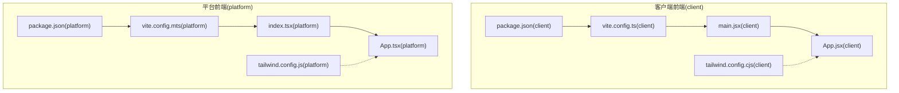
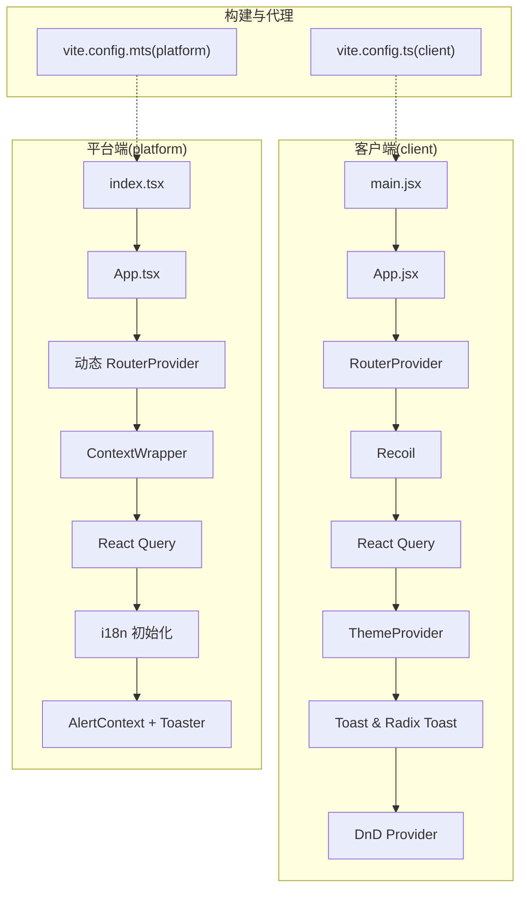
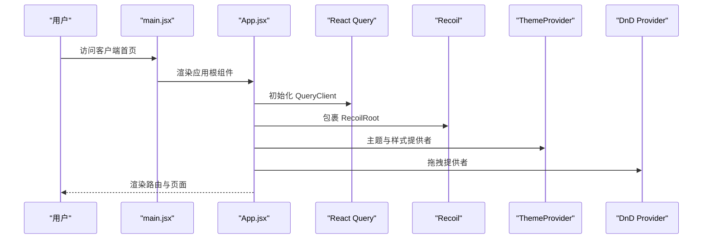
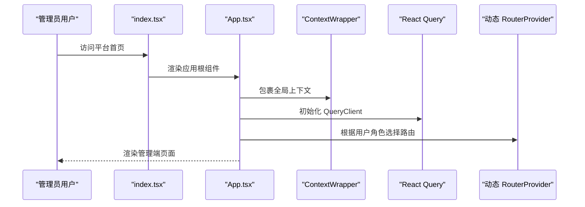
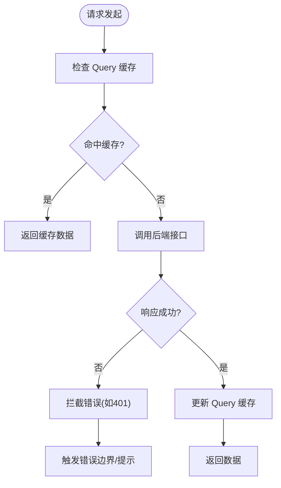
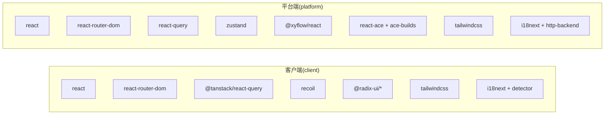

# 前端系统

<cite>
**本文引用的文件**
- [package.json（客户端）](file://src/frontend/client/package.json)
- [package.json（平台端）](file://src/frontend/platform/package.json)
- [vite.config.ts（客户端）](file://src/frontend/client/vite.config.ts)
- [vite.config.mts（平台端）](file://src/frontend/platform/vite.config.mts)
- [main.jsx（客户端入口）](file://src/frontend/client/src/main.jsx)
- [index.tsx（平台端入口）](file://src/frontend/platform/src/index.tsx)
- [App.jsx（客户端应用根）](file://src/frontend/client/src/App.jsx)
- [App.tsx（平台端应用根）](file://src/frontend/platform/src/App.tsx)
- [tailwind.config.cjs（客户端样式）](file://src/frontend/client/tailwind.config.cjs)
- [tailwind.config.js（平台端样式）](file://src/frontend/platform/tailwind.config.js)
</cite>

## 目录
1. [简介](#简介)
2. [项目结构](#项目结构)
3. [核心组件](#核心组件)
4. [架构总览](#架构总览)
5. [详细组件分析](#详细组件分析)
6. [依赖关系分析](#依赖关系分析)
7. [性能考量](#性能考量)
8. [故障排查指南](#故障排查指南)
9. [结论](#结论)
10. [附录](#附录)

## 简介
本文件为 Bisheng 前端系统的全面技术文档，聚焦于双前端架构：客户端前端（面向普通用户）与平台前端（面向管理员）。文档围绕 React 18 技术栈展开，涵盖组件架构、状态管理（Recoil 与 React Query）、路由体系、构建配置、样式系统（Tailwind CSS）、国际化支持、前后端 API 集成、错误处理与用户体验优化，并提供组件开发指南与最佳实践。

## 项目结构
Bisheng 前端采用“双前端”分层组织：
- 客户端前端（client）：面向普通用户，强调对话交互、内容展示与可访问性增强。
- 平台前端（platform）：面向管理员与高级用户，强调工作流编排、可视化节点编辑、权限控制与多语言支持。

两套前端共享仓库中的公共依赖与工具链，但各自拥有独立的构建配置、代理规则与运行时上下文。

图表来源
- [package.json（客户端）](file://src/frontend/client/package.json#L1-L157)
- [vite.config.ts（客户端）](file://src/frontend/client/vite.config.ts#L1-L330)
- [main.jsx（客户端入口）](file://src/frontend/client/src/main.jsx#L1-L18)
- [App.jsx（客户端应用根）](file://src/frontend/client/src/App.jsx#L1-L53)
- [tailwind.config.cjs（客户端样式）](file://src/frontend/client/tailwind.config.cjs#L1-L141)
- [package.json（平台端）](file://src/frontend/platform/package.json#L1-L126)
- [vite.config.mts（平台端）](file://src/frontend/platform/vite.config.mts#L1-L147)
- [index.tsx（平台端入口）](file://src/frontend/platform/src/index.tsx#L1-L36)
- [App.tsx（平台端应用根）](file://src/frontend/platform/src/App.tsx#L1-L246)
- [tailwind.config.js（平台端样式）](file://src/frontend/platform/tailwind.config.js#L1-L237)

章节来源
- [package.json（客户端）](file://src/frontend/client/package.json#L1-L157)
- [package.json（平台端）](file://src/frontend/platform/package.json#L1-L126)

## 核心组件
- 应用根组件与 Provider 层
  - 客户端：在应用根部组合 React Query、Recoil、Radix UI Toast、DnD、主题与无障碍播报等 Provider，统一注入路由与全局 UI 能力。
  - 平台端：在应用根部注入 React Query、全局上下文包装器与多语言初始化，动态路由根据用户角色切换。
- 国际化（i18n）
  - 客户端：通过 i18next 与浏览器探测器初始化，结合本地存储语言偏好。
  - 平台端：基于 i18next 与 HTTP 后端适配器，支持按用户会话动态切换语言。
- 错误边界与全局提示
  - 客户端：基于 React Error Boundary 与自定义 ApiErrorBoundaryProvider，拦截 401 等错误并引导登录或提示。
  - 平台端：集中式 alert 上下文与 Toaster 组件，统一展示错误、通知与成功信息。
- 状态管理
  - 客户端：以 Recoil 为核心进行细粒度状态管理，结合 React Query 缓存与持久化。
  - 平台端：以 React Context 与 Zustand（部分场景）为主的状态管理模式，配合全局上下文。
- 路由系统
  - 客户端：基于 React Router DOM 的 RouterProvider，结合布局与权限控制。
  - 平台端：根据用户角色动态选择公开、私有或管理端路由集合，支持 Suspense 加载态。
- 构建与代理
  - 客户端：Vite + PWA 插件、压缩、静态资源复制、手动分包策略；开发服务器代理至后端服务。
  - 平台端：Vite + SVGR、静态资源复制、手动分包策略；开发服务器代理 API 与文件服务。
- 样式系统
  - 客户端：Tailwind CSS + 自定义变量与动画插件，支持暗色模式类名开关。
  - 平台端：Tailwind CSS + forms 插件与自定义工具类，强调可访问性与复杂 UI 场景。

章节来源
- [App.jsx（客户端应用根）](file://src/frontend/client/src/App.jsx#L1-L53)
- [App.tsx（平台端应用根）](file://src/frontend/platform/src/App.tsx#L1-L246)
- [main.jsx（客户端入口）](file://src/frontend/client/src/main.jsx#L1-L18)
- [index.tsx（平台端入口）](file://src/frontend/platform/src/index.tsx#L1-L36)

## 架构总览
双前端架构通过“入口 -> Provider 层 -> 路由 -> 页面/组件”的分层设计，实现用户与管理员两类不同体验的隔离与协同。客户端更关注对话与内容消费，平台端更关注工作流与可视化编排。

图表来源
- [main.jsx（客户端入口）](file://src/frontend/client/src/main.jsx#L1-L18)
- [App.jsx（客户端应用根）](file://src/frontend/client/src/App.jsx#L1-L53)
- [index.tsx（平台端入口）](file://src/frontend/platform/src/index.tsx#L1-L36)
- [App.tsx（平台端应用根）](file://src/frontend/platform/src/App.tsx#L1-L246)
- [vite.config.ts（客户端）](file://src/frontend/client/vite.config.ts#L1-L330)
- [vite.config.mts（平台端）](file://src/frontend/platform/vite.config.mts#L1-L147)

## 详细组件分析

### 客户端前端（面向普通用户）
- Provider 层与全局能力
  - QueryClientProvider + QueryCache：统一处理查询错误（如 401），触发错误边界。
  - RecoilRoot：细粒度状态管理，适合对话、工作区等局部状态。
  - ThemeProvider：主题切换与暗色模式支持。
  - Radix Toast Provider + 自定义 Toast：全局提示与可访问性播报。
  - DndProvider：拖拽交互（如节点排序、拖放上传）。
- 路由与布局
  - RouterProvider 注入路由表，结合 Dashboard、Login、Startup 等布局组件。
  - 支持分享页与搜索页等专用路由。
- 国际化与可访问性
  - i18n 初始化与浏览器语言探测，结合本地存储偏好。
  - LiveAnnouncer 提供屏幕阅读器支持。
- 构建与代理
  - PWA、压缩、静态资源复制、手动分包策略，提升加载性能与缓存命中。
  - 代理规则将 /workspace/api 与 /workspace/bisheng 等路径转发至后端服务。

图表来源
- [main.jsx（客户端入口）](file://src/frontend/client/src/main.jsx#L1-L18)
- [App.jsx（客户端应用根）](file://src/frontend/client/src/App.jsx#L1-L53)

章节来源
- [App.jsx（客户端应用根）](file://src/frontend/client/src/App.jsx#L1-L53)
- [main.jsx（客户端入口）](file://src/frontend/client/src/main.jsx#L1-L18)
- [vite.config.ts（客户端）](file://src/frontend/client/vite.config.ts#L1-L330)
- [tailwind.config.cjs（客户端样式）](file://src/frontend/client/tailwind.config.cjs#L1-L141)

### 平台前端（面向管理员）
- 动态路由与权限
  - 根据用户角色（admin/group_admin）切换管理端路由；已登录用户使用私有路由；未登录走公开路由。
  - 使用 Suspense 提供加载态，避免白屏。
- 全局上下文与提示
  - ContextWrapper 提供全局上下文；AlertContext 统一管理错误/通知/成功弹窗队列。
  - Toaster 组件提供现代化提示。
- 国际化与快捷键
  - i18n 初始化与用户语言偏好联动；支持 Ctrl+Q 快捷键一键登出。
- 构建与代理
  - SVGR、静态资源复制、手动分包策略；代理 API 与文件服务，支持 WebSocket。

图表来源
- [index.tsx（平台端入口）](file://src/frontend/platform/src/index.tsx#L1-L36)
- [App.tsx（平台端应用根）](file://src/frontend/platform/src/App.tsx#L1-L246)

章节来源
- [App.tsx（平台端应用根）](file://src/frontend/platform/src/App.tsx#L1-L246)
- [index.tsx（平台端入口）](file://src/frontend/platform/src/index.tsx#L1-L36)
- [vite.config.mts（平台端）](file://src/frontend/platform/vite.config.mts#L1-L147)
- [tailwind.config.js（平台端样式）](file://src/frontend/platform/tailwind.config.js#L1-L237)

### 状态管理与数据流（客户端）
- React Query
  - 统一查询缓存、重试策略与错误处理；拦截 401 触发错误边界。
- Recoil
  - 用于对话、工作区、UI 状态等细粒度状态；与 Query 结合实现“网络 + 本地”双态。
- 数据流示意

图表来源
- [App.jsx（客户端应用根）](file://src/frontend/client/src/App.jsx#L16-L24)

章节来源
- [App.jsx（客户端应用根）](file://src/frontend/client/src/App.jsx#L1-L53)

### 样式系统与主题（Tailwind CSS）
- 客户端
  - 自定义颜色变量、动画与圆角变量，支持暗色模式类名开关；集成 Tailwind Animate 与 Radix 插件。
- 平台端
  - 引入 @tailwindcss/forms 与自定义工具类（滚动条隐藏、多行省略、密码输入等）；强调复杂 UI 的一致性与可访问性。

章节来源
- [tailwind.config.cjs（客户端样式）](file://src/frontend/client/tailwind.config.cjs#L1-L141)
- [tailwind.config.js（平台端样式）](file://src/frontend/platform/tailwind.config.js#L1-L237)

### 国际化（i18n）
- 客户端
  - i18next + 浏览器语言探测器；结合本地存储语言偏好，确保切换语言后一致生效。
- 平台端
  - i18next + HTTP 后端适配器；根据用户会话动态切换语言；支持标题国际化。

章节来源
- [main.jsx（客户端入口）](file://src/frontend/client/src/main.jsx#L1-L18)
- [index.tsx（平台端入口）](file://src/frontend/platform/src/index.tsx#L1-L36)
- [App.tsx（平台端应用根）](file://src/frontend/platform/src/App.tsx#L158-L167)

### 构建配置与性能优化
- 客户端
  - PWA、压缩、SourceMap 控制、静态资源复制（PDF Worker、Vditor 资源）；手动分包策略将大库拆分为独立 chunk，降低首屏体积。
- 平台端
  - SVGR、静态资源复制（ACE、PDF Worker）；手动分包策略针对 Ace、React Flow、PDFJS 等模块进行拆分。
- 代理规则
  - 客户端：/workspace/api、/workspace/bisheng、/workspace/tmp-dir 代理至后端服务，支持 WebSocket。
  - 平台端：/api、/health、/bisheng、/tmp-dir 代理至后端与文件服务，支持跨域与凭证传递。

章节来源
- [vite.config.ts（客户端）](file://src/frontend/client/vite.config.ts#L1-L330)
- [vite.config.mts（平台端）](file://src/frontend/platform/vite.config.mts#L1-L147)

## 依赖关系分析
- 共享依赖
  - React 18、React Router、Axios、Tailwind CSS、i18n 生态等。
- 客户端特有
  - Recoil、TanStack React Query、Radix UI、Framer Motion、Vditor、ECharts、QRCode 等。
- 平台端特有
  - @xyflow/react、Zustand、CMDK、React Ace、Recharts、XLSX 等。
- 分包与体积
  - 两套前端均采用手动分包策略，将大体量第三方库拆分为独立 chunk，减少重复打包与缓存碎片。

图表来源
- [package.json（客户端）](file://src/frontend/client/package.json#L22-L114)
- [package.json（平台端）](file://src/frontend/platform/package.json#L5-L74)

章节来源
- [package.json（客户端）](file://src/frontend/client/package.json#L1-L157)
- [package.json（平台端）](file://src/frontend/platform/package.json#L1-L126)

## 性能考量
- 分包与懒加载
  - 通过手动分包策略将大库拆分，结合路由级懒加载，显著降低首屏体积与白屏时间。
- 缓存与预取
  - React Query 默认禁用窗口焦点与挂载时重取，减少无效请求；错误拦截与缓存命中优先。
- 资源优化
  - 压缩与 PWA 缓存策略；静态资源复制避免运行时下载延迟。
- 可访问性
  - LiveAnnouncer 与语义化标签，提升屏幕阅读器体验。

## 故障排查指南
- 登录态失效（401）
  - 客户端：QueryCache 拦截 401，触发 ApiErrorBoundary 与 Toast 提示，引导重新登录。
  - 平台端：统一错误弹窗与 URL 错误提示，结合用户上下文清理本地状态。
- 路由跳转异常
  - 客户端：检查 RouterProvider 注入与布局组件；确认路由表与权限校验逻辑。
  - 平台端：确认用户角色与动态路由选择逻辑；检查 Suspense 加载态。
- 国际化显示异常
  - 客户端：检查浏览器语言探测与本地存储偏好；确认 i18n 初始化顺序。
  - 平台端：确认用户语言偏好与 i18n 切换逻辑。
- 构建/代理问题
  - 客户端：确认 /workspace 前缀与代理 rewrite；检查 PDF Worker 与静态资源复制。
  - 平台端：确认 /custom 前缀与代理目标；检查 ACE 与 PDF Worker 复制路径。

章节来源
- [App.jsx（客户端应用根）](file://src/frontend/client/src/App.jsx#L16-L24)
- [App.tsx（平台端应用根）](file://src/frontend/platform/src/App.tsx#L180-L187)
- [vite.config.ts（客户端）](file://src/frontend/client/vite.config.ts#L26-L62)
- [vite.config.mts（平台端）](file://src/frontend/platform/vite.config.mts#L14-L59)

## 结论
Bisheng 前端系统通过双前端架构清晰划分用户与管理员两类体验，借助 React 18、Recoil、React Query、Tailwind CSS 与 i18n 生态，实现了高可维护性与良好用户体验。客户端专注对话与内容消费，平台端专注工作流与可视化编排。构建层面的分包策略与代理配置进一步提升了性能与开发效率。建议在后续迭代中持续优化分包策略、完善错误边界与国际化覆盖，并加强组件复用与测试体系。

## 附录
- 组件开发指南与最佳实践
  - 状态管理：优先使用 React Query 管理网络状态，Recoil 管理本地 UI 状态；避免过度拆分状态导致复杂度上升。
  - 路由设计：采用布局组件抽象通用结构，路由按功能域划分；对敏感页面进行权限校验。
  - 样式规范：统一使用 Tailwind 工具类，避免内联样式的滥用；为暗色模式提供一致的变量映射。
  - 国际化：所有文案统一收敛至 i18n；标题与描述需具备上下文标识，便于翻译与维护。
  - 错误处理：统一拦截 401 等错误，提供明确提示与回退路径；对不可恢复错误提供重试与反馈。
  - 性能优化：继续细化手动分包策略；对大组件采用懒加载；利用 SourceMap 与可视化工具监控体积变化。
- API 集成与代理
  - 客户端：/workspace 前缀代理至后端服务，支持 WebSocket；注意凭证与安全策略。
  - 平台端：/api 与 /bisheng 前缀分别代理至 API 与文件服务；确保 withCredentials 与 ws 支持。
- 用户体验优化
  - 加载态：为关键路由与异步操作提供 Suspense 或骨架屏。
  - 可访问性：保持语义化标签与键盘导航；为动态内容提供 LiveAnnouncer。
  - 主题与暗色模式：统一变量命名与切换逻辑，确保视觉一致性。