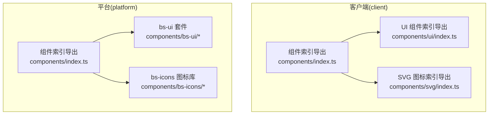
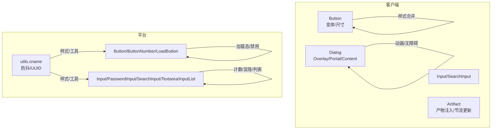
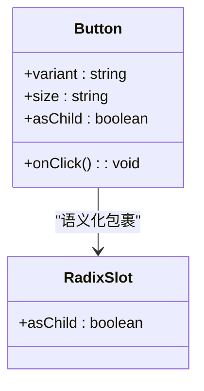
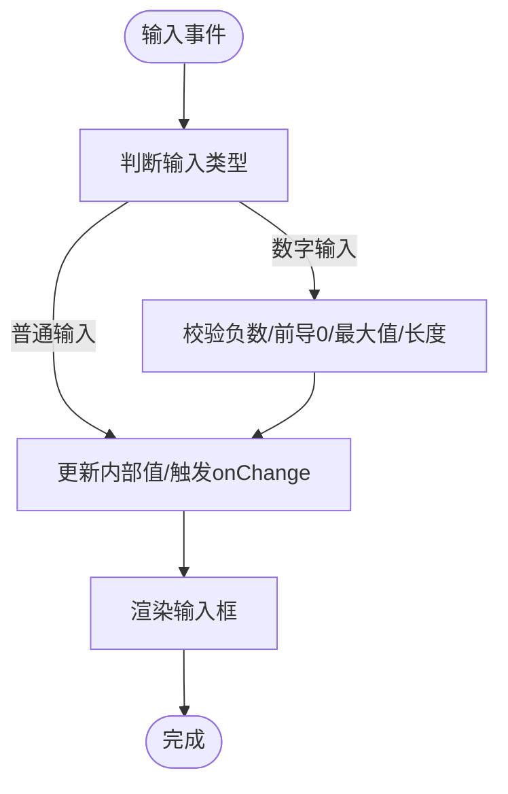
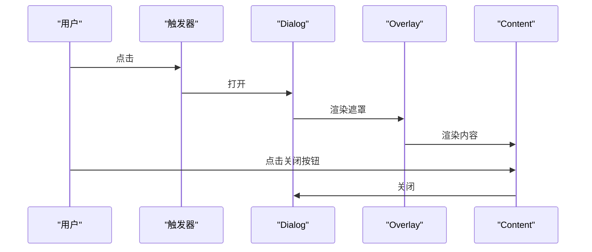
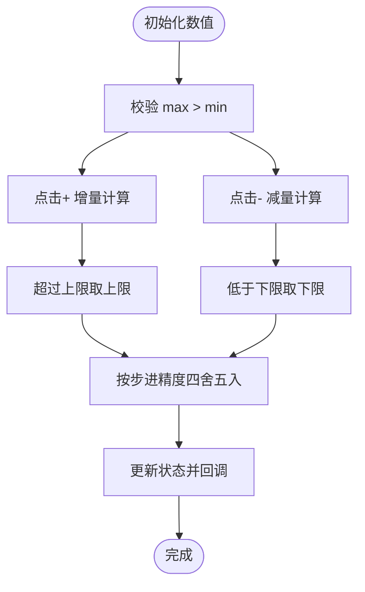
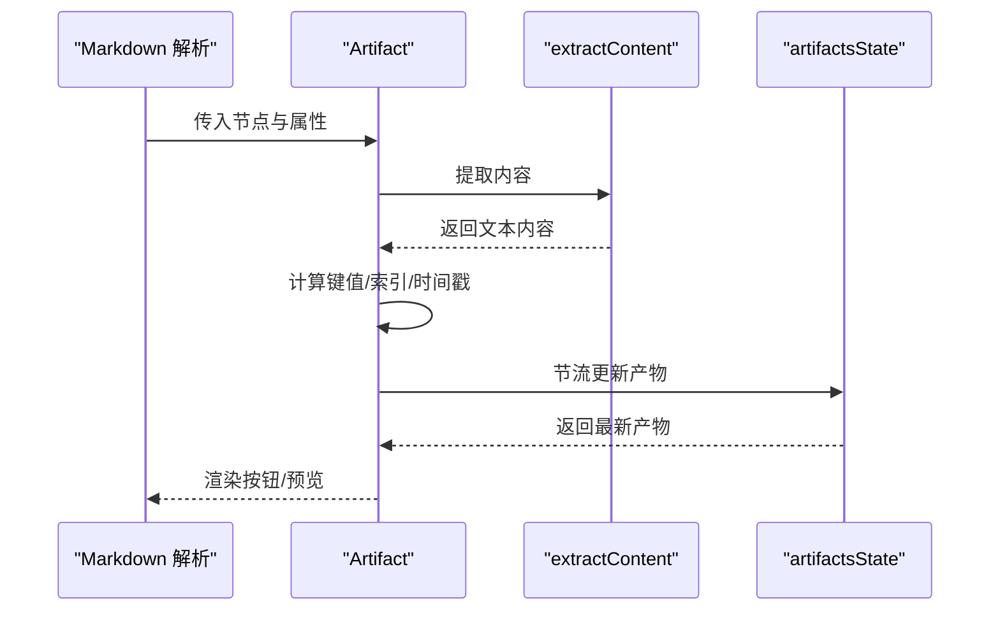
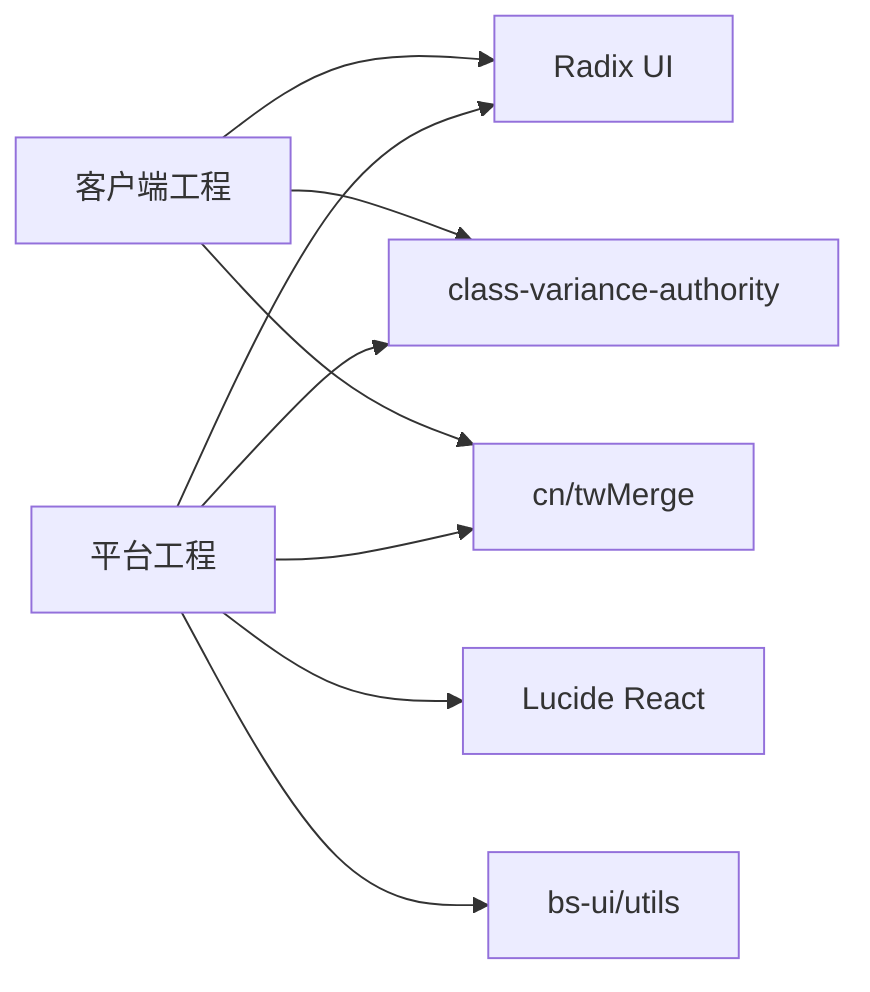

# UI 组件库

<cite>
**本文引用的文件**
- [package.json](file://src/frontend/client/package.json)
- [package.json](file://src/frontend/platform/package.json)
- [组件索引导出（client）](file://src/frontend/client/src/components/index.ts)
- [UI 组件索引导出（client）](file://src/frontend/client/src/components/ui/index.ts)
- [SVG 图标索引导出（client）](file://src/frontend/client/src/components/svg/index.ts)
- [SVG 图标：归档](file://src/frontend/client/src/components/svg/ArchiveIcon.tsx)
- [SVG 图标：平台流程图标集合](file://src/frontend/platform/src/components/bs-icons/flow/index.tsx)
- [UI 组件：按钮（client）](file://src/frontend/client/src/components/ui/Button.tsx)
- [UI 组件：输入框（client）](file://src/frontend/client/src/components/ui/Input.tsx)
- [UI 组件：对话框（client）](file://src/frontend/client/src/components/ui/Dialog.tsx)
- [UI 组件：按钮（platform）](file://src/frontend/platform/src/components/bs-ui/button/index.tsx)
- [UI 组件：输入框（platform）](file://src/frontend/platform/src/components/bs-ui/input/index.tsx)
- [工具：样式合并与通用工具（platform）](file://src/frontend/platform/src/components/bs-ui/utils.tsx)
- [工具：样式合并（client）](file://src/frontend/client/src/utils/index.ts)
- [组件：产物容器（client）](file://src/frontend/client/src/components/Artifacts/Artifact.tsx)
</cite>

## 目录
1. [简介](#简介)
2. [项目结构](#项目结构)
3. [核心组件](#核心组件)
4. [架构总览](#架构总览)
5. [详细组件分析](#详细组件分析)
6. [依赖关系分析](#依赖关系分析)
7. [性能考量](#性能考量)
8. [故障排查指南](#故障排查指南)
9. [结论](#结论)
10. [附录](#附录)

## 简介
本文件面向 Bisheng 客户端前端 UI 组件库，系统化梳理基础 UI 组件、业务组件与复合组件的分类与实现，覆盖属性接口、事件处理、样式定制与主题适配、SVG 图标系统、动画与交互行为，并提供使用示例、最佳实践与性能优化建议，同时说明可访问性设计与跨浏览器兼容策略。

## 项目结构
- 客户端（client）与平台（platform）分别维护独立的前端工程与组件体系：
  - 客户端组件位于 src/frontend/client/src/components，提供基础 UI 组件与业务组件。
  - 平台组件位于 src/frontend/platform/src/components，提供更丰富的业务组件与统一的 UI 套件。
- 组件导出采用集中索引，便于按需引入与统一管理。

图表来源
- [组件索引导出（client）](file://src/frontend/client/src/components/index.ts#L1-L4)
- [UI 组件索引导出（client）](file://src/frontend/client/src/components/ui/index.ts#L1-L43)
- [SVG 图标索引导出（client）](file://src/frontend/client/src/components/svg/index.ts#L1-L59)

章节来源
- [组件索引导出（client）](file://src/frontend/client/src/components/index.ts#L1-L4)
- [UI 组件索引导出（client）](file://src/frontend/client/src/components/ui/index.ts#L1-L43)
- [SVG 图标索引导出（client）](file://src/frontend/client/src/components/svg/index.ts#L1-L59)

## 核心组件
- 基础 UI 组件（客户端）
  - 按钮 Button：支持多种变体与尺寸，基于 class-variance-authority 实现变体，Radix Slot 支持语义化包裹。
  - 输入 Input/SearchInput：基础输入与带搜索图标的输入封装，支持禁用、占位符、聚焦态等。
  - 对话框 Dialog：基于 Radix Dialog 的封装，包含 Overlay、Portal、Content、Header/Footer、Title/Description 等子组件。
- 基础 UI 组件（平台）
  - 按钮 Button/ButtonNumber/LoadButton：扩展数字增减按钮与加载态按钮，支持禁用与 loading 状态。
  - 输入 Input/PasswordInput/SearchInput/Textarea/InputList：增强输入体验，包含密码显隐、计数、列表输入、规则校验等。
- 业务组件（客户端）
  - 产物容器 Artifact：将指令式产物注入消息上下文，配合节流与 Recoil 状态管理进行增量更新。
- 图标系统
  - 客户端：自绘 SVG 图标（如归档），Lucide React 图标（如 SearchIcon）。
  - 平台：基于 React-SVGR 的 SVG 组件集合（如 flow、assistant、skill 等）。

章节来源
- [UI 组件：按钮（client）](file://src/frontend/client/src/components/ui/Button.tsx#L1-L53)
- [UI 组件：输入框（client）](file://src/frontend/client/src/components/ui/Input.tsx#L1-L50)
- [UI 组件：对话框（client）](file://src/frontend/client/src/components/ui/Dialog.tsx#L1-L114)
- [UI 组件：按钮（platform）](file://src/frontend/platform/src/components/bs-ui/button/index.tsx#L1-L110)
- [UI 组件：输入框（platform）](file://src/frontend/platform/src/components/bs-ui/input/index.tsx#L1-L510)
- [组件：产物容器（client）](file://src/frontend/client/src/components/Artifacts/Artifact.tsx#L1-L107)
- [SVG 图标：归档](file://src/frontend/client/src/components/svg/ArchiveIcon.tsx#L1-L20)
- [SVG 图标：平台流程图标集合](file://src/frontend/platform/src/components/bs-icons/flow/index.tsx#L1-L43)

## 架构总览
- 设计原则
  - 组件最小职责：基础 UI 组件负责外观与交互；业务组件负责领域逻辑与状态管理。
  - 变体与尺寸：通过 class-variance-authority 与 Tailwind 组合，实现一致的视觉与交互规范。
  - 主题适配：通过 CSS 变量与暗色模式类名，结合 cn/twMerge 合并样式，保证在不同主题下的一致表现。
- 动画与交互
  - 对话框使用 Radix 动画类实现淡入/缩放/滑入等过渡。
  - 平台按钮支持加载态图标与禁用态控制。
  - 客户端输入框支持搜索图标与计数提示。
- 可访问性
  - 对话框包含关闭按钮的无障碍标签（sr-only）。
  - 输入组件保留原生表单语义，支持禁用与只读。
- 跨浏览器兼容
  - 平台工程配置 browserslist，明确生产与开发目标浏览器范围。
  - 工具函数对 Clipboard API 进行降级处理，保障复制功能可用。

图表来源
- [UI 组件：按钮（client）](file://src/frontend/client/src/components/ui/Button.tsx#L1-L53)
- [UI 组件：输入框（client）](file://src/frontend/client/src/components/ui/Input.tsx#L1-L50)
- [UI 组件：对话框（client）](file://src/frontend/client/src/components/ui/Dialog.tsx#L1-L114)
- [UI 组件：按钮（platform）](file://src/frontend/platform/src/components/bs-ui/button/index.tsx#L1-L110)
- [UI 组件：输入框（platform）](file://src/frontend/platform/src/components/bs-ui/input/index.tsx#L1-L510)
- [工具：样式合并与通用工具（platform）](file://src/frontend/platform/src/components/bs-ui/utils.tsx#L1-L52)

## 详细组件分析

### 基础 UI 组件：按钮 Button
- 属性与变体
  - 支持 variant（default/destructive/outline/secondary/ghost/link/submit）与 size（default/sm/lg/icon）。
  - 支持 asChild 通过 Radix Slot 包裹任意元素。
- 事件与交互
  - 基于原生 button 行为，支持禁用、聚焦可见轮廓等。
- 样式与主题
  - 使用 class-variance-authority 生成变体类，cn 合并默认类与用户类，适配明暗主题。
- 最佳实践
  - 优先使用 submit 变体作为主操作按钮，避免硬编码颜色。
  - 使用 icon 尺寸仅承载纯图标，确保可点击区域满足无障碍要求。

图表来源
- [UI 组件：按钮（client）](file://src/frontend/client/src/components/ui/Button.tsx#L36-L50)

章节来源
- [UI 组件：按钮（client）](file://src/frontend/client/src/components/ui/Button.tsx#L1-L53)

### 基础 UI 组件：输入 Input/SearchInput
- 功能特性
  - 基础 Input：支持禁用、聚焦态、占位符等。
  - SearchInput：内置搜索图标，左侧留白以容纳图标。
- 事件与数据流
  - 透传原生 input 事件，支持受控/非受控两种模式。
- 样式与主题
  - 统一边框、背景、阴影与聚焦态，适配暗色模式。
- 最佳实践
  - 搜索场景优先使用 SearchInput，减少重复布局代码。
  - 需要计数时，结合外部提示组件展示剩余字符数。

图表来源
- [UI 组件：输入框（client）](file://src/frontend/client/src/components/ui/Input.tsx#L8-L21)

章节来源
- [UI 组件：输入框（client）](file://src/frontend/client/src/components/ui/Input.tsx#L1-L50)

### 基础 UI 组件：对话框 Dialog
- 结构组成
  - Root/Trigger/Portal/Overlay/Content/Header/Footer/Title/Description/Close。
- 动画与交互
  - 基于 Radix 动画类实现淡入淡出、缩放与滑入滑出。
  - 关闭按钮包含 sr-only 文本，提升可访问性。
- 最佳实践
  - 在 Content 中合理组织 Header/Footer，避免过度嵌套。
  - 通过 Portal 确保遮罩层级正确，避免被其他定位元素遮挡。

图表来源
- [UI 组件：对话框（client）](file://src/frontend/client/src/components/ui/Dialog.tsx#L7-L51)

章节来源
- [UI 组件：对话框（client）](file://src/frontend/client/src/components/ui/Dialog.tsx#L1-L114)

### 平台 UI 组件：按钮 Button/ButtonNumber/LoadButton
- 扩展能力
  - ButtonNumber：支持数值增减，具备步进、上限/下限与小数精度处理。
  - LoadButton：在 loading 时禁用并前置加载图标。
- 最佳实践
  - 数值输入场景优先使用 ButtonNumber，避免重复实现边界处理。
  - 异步提交场景使用 LoadButton，统一加载态视觉反馈。

图表来源
- [UI 组件：按钮（platform）](file://src/frontend/platform/src/components/bs-ui/button/index.tsx#L58-L100)

章节来源
- [UI 组件：按钮（platform）](file://src/frontend/platform/src/components/bs-ui/button/index.tsx#L1-L110)

### 平台 UI 组件：输入 Input/PasswordInput/SearchInput/Textarea/InputList
- 功能特性
  - PasswordInput：密码显隐切换，支持点击切换图标。
  - SearchInput：内置搜索图标，右侧留白。
  - Textarea：支持最大长度与底部计数。
  - InputList：动态输入列表，支持新增/删除条目，可选字典结构。
- 最佳实践
  - 密码场景使用 PasswordInput，避免明文泄露风险。
  - 列表输入场景使用 InputList，统一交互与校验提示。

章节来源
- [UI 组件：输入框（platform）](file://src/frontend/platform/src/components/bs-ui/input/index.tsx#L1-L510)

### 业务组件：产物容器 Artifact
- 功能概述
  - 将指令式产物注入消息上下文，生成稳定键值，节流更新以降低渲染压力。
  - 通过 Recoil artifactsState 管理全局产物，支持去重与增量更新。
- 事件与数据流
  - 提取子树内容，计算标题/类型/标识，生成 artifactKey。
  - 使用 lodash throttle 控制更新频率，避免频繁写入。
- 最佳实践
  - 产物标题与类型应具备区分度，避免键冲突。
  - 配合消息上下文与索引计数器，确保顺序与去重。

图表来源
- [组件：产物容器（client）](file://src/frontend/client/src/components/Artifacts/Artifact.tsx#L28-L106)

章节来源
- [组件：产物容器（client）](file://src/frontend/client/src/components/Artifacts/Artifact.tsx#L1-L107)

### 图标系统：SVG 与图标库
- 客户端
  - 自绘 SVG 组件（如 ArchiveIcon），通过 className 控制尺寸与颜色。
  - Lucide React 图标（如 SearchIcon）用于通用语义图标。
- 平台
  - 基于 React-SVGR 的 SVG 组件集合（如 flow/assistant/skill），通过 forwardRef 透传 className。
- 最佳实践
  - 语义图标优先使用 Lucide 或平台图标库，确保风格一致。
  - 自绘图标需遵循 24x24 基准尺寸与可访问性色彩对比。

章节来源
- [SVG 图标：归档](file://src/frontend/client/src/components/svg/ArchiveIcon.tsx#L1-L20)
- [SVG 图标：平台流程图标集合](file://src/frontend/platform/src/components/bs-icons/flow/index.tsx#L1-L43)

## 依赖关系分析
- 客户端依赖
  - Radix UI 组件库（Dialog、Button 等）提供无障碍与动画基元。
  - class-variance-authority 与 cn 用于变体与样式合并。
  - Tailwind 与 twMerge 保证样式一致性与覆盖优先级。
- 平台依赖
  - Radix UI、Tailwind、class-variance-authority、Lucide React。
  - 工具函数提供 cname、防抖、UUID 等通用能力。
- 浏览器兼容
  - 平台 package.json 明确 browserslist，限定目标浏览器版本。

图表来源
- [package.json](file://src/frontend/client/package.json#L22-L114)
- [package.json](file://src/frontend/platform/package.json#L5-L74)
- [工具：样式合并与通用工具（platform）](file://src/frontend/platform/src/components/bs-ui/utils.tsx#L1-L10)

章节来源
- [package.json](file://src/frontend/client/package.json#L1-L157)
- [package.json](file://src/frontend/platform/package.json#L1-L126)

## 性能考量
- 渲染节流
  - 产物容器使用 lodash throttle 控制更新频率，避免高频写入导致的卡顿。
- 样式合并
  - 使用 twMerge 合并 Tailwind 类，避免重复类导致的样式冲突与重排。
- 受控组件
  - 输入组件支持受控/非受控模式，减少不必要的状态同步成本。
- 动画与过渡
  - 对话框使用 Radix 动画类，避免复杂 JS 动画带来的性能损耗。
- 最佳实践
  - 大列表场景优先使用虚拟化方案（如 react-window）。
  - 图标与静态资源尽量使用 SVG，减少图片体积与解码开销。

## 故障排查指南
- 对话框无法关闭或遮罩层级异常
  - 检查 Portal 是否正确挂载，Overlay 是否处于正确 z-index。
  - 确认关闭按钮存在 sr-only 文本，提升可访问性。
- 输入框计数不生效或数字校验异常
  - 校验逻辑需同时处理键盘输入与粘贴事件，确保正则与边界条件一致。
  - 数字输入需处理前导 0、负数与最大值限制。
- 按钮加载态无效
  - LoadButton 需同时处理 loading 与 disabled 状态，避免视觉与交互不一致。
- 复制功能在非 HTTPS 环境失效
  - 降级使用 textarea 方案，确保在受限环境下仍可工作。

章节来源
- [UI 组件：对话框（client）](file://src/frontend/client/src/components/ui/Dialog.tsx#L15-L51)
- [UI 组件：输入框（platform）](file://src/frontend/platform/src/components/bs-ui/input/index.tsx#L14-L96)
- [UI 组件：按钮（platform）](file://src/frontend/platform/src/components/bs-ui/button/index.tsx#L104-L108)
- [工具：样式合并（client）](file://src/frontend/client/src/utils/index.ts#L222-L240)

## 结论
Bisheng UI 组件库在客户端与平台两端形成互补：客户端侧重基础 UI 与业务组件的统一抽象，平台侧重业务组件与工具链的完善。通过变体系统、样式合并与动画基元，组件在一致性、可访问性与跨浏览器兼容方面具备良好基础。建议在实际使用中遵循变体与尺寸规范、合理使用节流与虚拟化技术，并持续完善图标与主题体系。

## 附录
- 使用示例与最佳实践
  - 按钮：优先使用 submit 变体作为主操作，icon 尺寸仅承载纯图标。
  - 输入：搜索场景使用 SearchInput，密码场景使用 PasswordInput，列表场景使用 InputList。
  - 对话框：在 Content 中组织 Header/Footer，确保关闭按钮可访问。
  - 产物：为标题与类型设置稳定且可区分的值，避免键冲突。
- 可访问性与兼容性
  - 对话框包含 sr-only 文本，输入组件保留原生语义。
  - 平台工程配置 browserslist，确保目标浏览器覆盖。