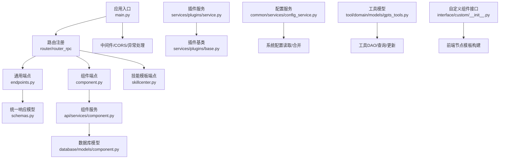
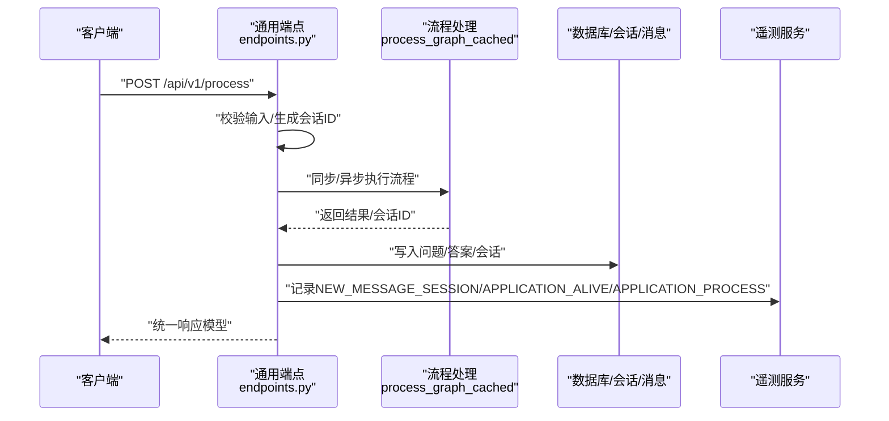
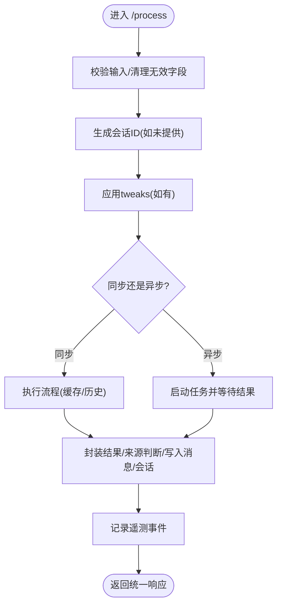
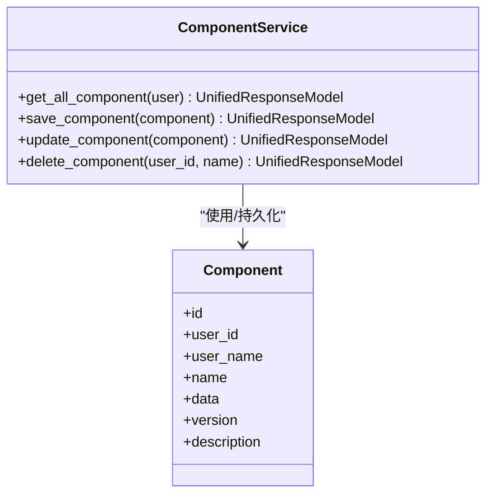
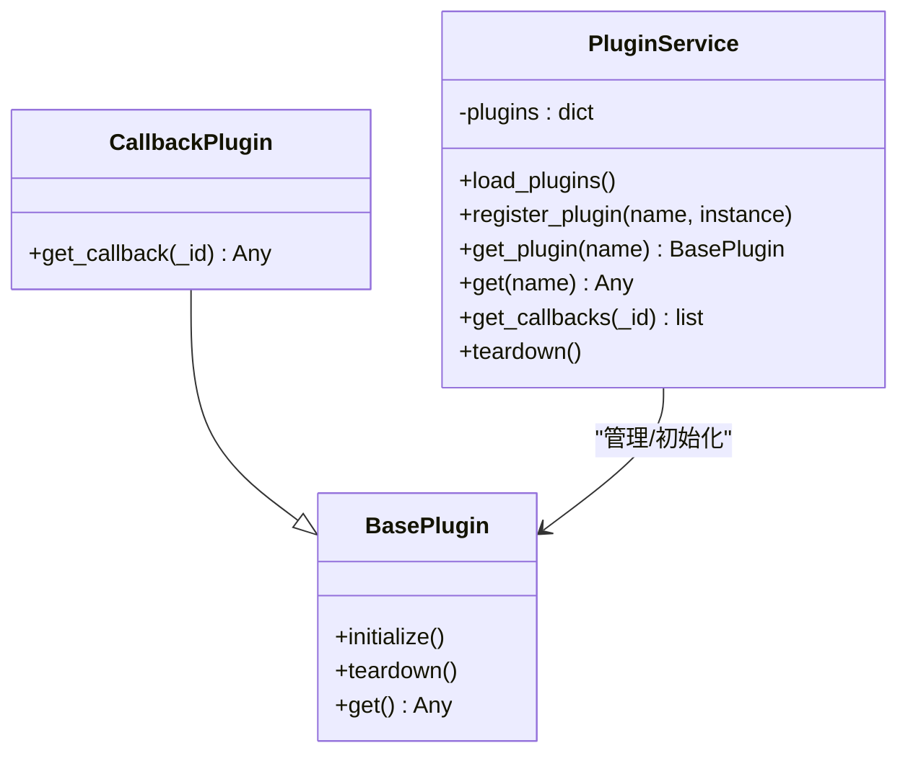
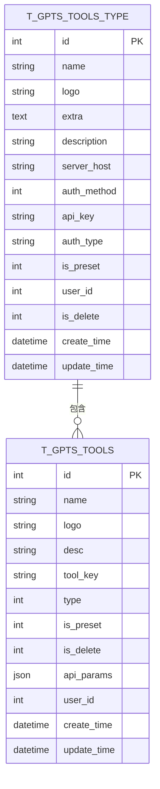
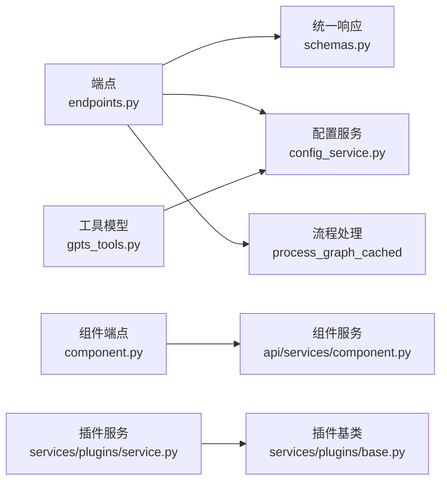

# 业务特定组件

<cite>
**本文引用的文件**
- [src/backend/bisheng/main.py](file://src/backend/bisheng/main.py)
- [src/backend/bisheng/server.py](file://src/backend/bisheng/server.py)
- [src/backend/bisheng/api/v1/endpoints.py](file://src/backend/bisheng/api/v1/endpoints.py)
- [src/backend/bisheng/api/v1/component.py](file://src/backend/bisheng/api/v1/component.py)
- [src/backend/bisheng/api/v1/skillcenter.py](file://src/backend/bisheng/api/v1/skillcenter.py)
- [src/backend/bisheng/api/v1/schemas.py](file://src/backend/bisheng/api/v1/schemas.py)
- [src/backend/bisheng/api/services/component.py](file://src/backend/bisheng/api/services/component.py)
- [src/backend/bisheng/common/services/config_service.py](file://src/backend/bisheng/common/services/config_service.py)
- [src/backend/bisheng/services/plugins/service.py](file://src/backend/bisheng/services/plugins/service.py)
- [src/backend/bisheng/services/plugins/base.py](file://src/backend/bisheng/services/plugins/base.py)
- [src/backend/bisheng/tool/domain/models/gpts_tools.py](file://src/backend/bisheng/tool/domain/models/gpts_tools.py)
- [src/backend/bisheng/interface/custom/__init__.py](file://src/backend/bisheng/interface/custom/__init__.py)
- [src/backend/bisheng/workflow/graph/workflow.py](file://src/backend/bisheng/workflow/graph/workflow.py)
- [src/backend/bisheng/api/services/workflow.py](file://src/backend/bisheng/api/services/workflow.py)
</cite>

## 目录
1. [引言](#引言)
2. [项目结构](#项目结构)
3. [核心组件](#核心组件)
4. [架构总览](#架构总览)
5. [详细组件分析](#详细组件分析)
6. [依赖关系分析](#依赖关系分析)
7. [性能考量](#性能考量)
8. [故障排查指南](#故障排查指南)
9. [结论](#结论)
10. [附录](#附录)

## 引言
本文件面向 Bisheng 的“业务特定组件”，系统化梳理端点设置、插件管理、工具集成、配置管理与扩展机制，并给出可配置性、兼容性与性能方面的建议及最佳实践。目标读者包括后端工程师、平台开发者与运维人员。

## 项目结构
后端采用 FastAPI 应用入口与模块化路由组织方式，业务组件主要分布在以下子系统：
- 应用生命周期与中间件：应用启动、关闭、CORS、自定义中间件、异常处理
- 路由层：通用端点、组件端点、技能模板端点、Schema 统一响应模型
- 服务层：组件服务、插件服务、配置服务、工作流服务
- 数据模型与工具：工具与工具分类的数据模型
- 扩展与自定义：自定义组件构建与前端节点模板更新

图表来源
- [src/backend/bisheng/main.py](file://src/backend/bisheng/main.py#L64-L102)
- [src/backend/bisheng/api/v1/endpoints.py](file://src/backend/bisheng/api/v1/endpoints.py#L46-L46)
- [src/backend/bisheng/api/v1/component.py](file://src/backend/bisheng/api/v1/component.py#L12-L12)
- [src/backend/bisheng/api/v1/skillcenter.py](file://src/backend/bisheng/api/v1/skillcenter.py#L16-L16)
- [src/backend/bisheng/api/v1/schemas.py](file://src/backend/bisheng/api/v1/schemas.py#L69-L87)
- [src/backend/bisheng/api/services/component.py](file://src/backend/bisheng/api/services/component.py#L9-L41)
- [src/backend/bisheng/services/plugins/service.py](file://src/backend/bisheng/services/plugins/service.py#L14-L67)
- [src/backend/bisheng/services/plugins/base.py](file://src/backend/bisheng/services/plugins/base.py#L4-L18)
- [src/backend/bisheng/common/services/config_service.py](file://src/backend/bisheng/common/services/config_service.py#L58-L236)
- [src/backend/bisheng/tool/domain/models/gpts_tools.py](file://src/backend/bisheng/tool/domain/models/gpts_tools.py#L53-L463)
- [src/backend/bisheng/interface/custom/__init__.py](file://src/backend/bisheng/interface/custom/__init__.py#L1-L5)

章节来源
- [src/backend/bisheng/main.py](file://src/backend/bisheng/main.py#L1-L113)
- [src/backend/bisheng/server.py](file://src/backend/bisheng/server.py#L1-L21)

## 核心组件
- 应用入口与生命周期
  - 创建 FastAPI 应用、注册中间件与异常处理器、挂载路由、上下文初始化与服务初始化
  - 提供健康检查端点
- 通用端点
  - 获取环境变量、系统配置、前端 Web 配置、流程处理、文件上传、版本信息等
- 组件端点
  - 用户自定义组件的增删改查、前端节点模板生成与更新
- 技能模板端点
  - 技能模板的创建、分页查询、更新、删除
- 插件服务
  - 动态加载插件、回调收集、插件生命周期管理
- 配置服务
  - YAML 加载、环境变量注入、数据库配置合并与缓存、按域读取
- 工具模型
  - 工具与工具类型的持久化模型、DAO 查询与更新、敏感数据脱敏
- 自定义组件接口
  - 自定义组件解析与前端节点模板构建

章节来源
- [src/backend/bisheng/api/v1/endpoints.py](file://src/backend/bisheng/api/v1/endpoints.py#L64-L428)
- [src/backend/bisheng/api/v1/component.py](file://src/backend/bisheng/api/v1/component.py#L15-L89)
- [src/backend/bisheng/api/v1/skillcenter.py](file://src/backend/bisheng/api/v1/skillcenter.py#L20-L110)
- [src/backend/bisheng/services/plugins/service.py](file://src/backend/bisheng/services/plugins/service.py#L14-L67)
- [src/backend/bisheng/common/services/config_service.py](file://src/backend/bisheng/common/services/config_service.py#L58-L236)
- [src/backend/bisheng/tool/domain/models/gpts_tools.py](file://src/backend/bisheng/tool/domain/models/gpts_tools.py#L53-L463)
- [src/backend/bisheng/interface/custom/__init__.py](file://src/backend/bisheng/interface/custom/__init__.py#L1-L5)

## 架构总览
下图展示从客户端到后端服务的关键交互路径，涵盖端点调用、流程处理、消息记录与遥测上报。

图表来源
- [src/backend/bisheng/api/v1/endpoints.py](file://src/backend/bisheng/api/v1/endpoints.py#L172-L350)

章节来源
- [src/backend/bisheng/api/v1/endpoints.py](file://src/backend/bisheng/api/v1/endpoints.py#L157-L350)

## 详细组件分析

### 端点设置与通用能力
- 环境与配置
  - 环境参数聚合：版本、UNS 支持类型、Office URL、对话提示、环境字典、Pro 标志等
  - 系统配置：管理员读取/保存初始化配置，支持 YAML 校验与布尔值约束
  - 前端 Web 配置：读取/更新前端所需配置项
- 流程处理
  - 同步/异步执行流程，支持 tweaks 注入、历史条数控制、会话 ID 生成
  - 结果封装与来源判断，记录消息与会话，上报遥测事件
- 文件上传
  - 图标上传、工作流图标上传、流程文件上传，支持 MinIO 存储与相对路径返回

图表来源
- [src/backend/bisheng/api/v1/endpoints.py](file://src/backend/bisheng/api/v1/endpoints.py#L172-L350)

章节来源
- [src/backend/bisheng/api/v1/endpoints.py](file://src/backend/bisheng/api/v1/endpoints.py#L71-L155)
- [src/backend/bisheng/api/v1/endpoints.py](file://src/backend/bisheng/api/v1/endpoints.py#L157-L428)

### 组件管理（自定义组件）
- 能力概览
  - 列表获取、保存、更新、删除用户自定义组件
  - 自定义组件代码解析，生成前端节点模板，支持字段级更新与前端节点值覆盖
- 数据模型与服务
  - 组件 DAO 持久化，存在性校验，统一响应模型

图表来源
- [src/backend/bisheng/api/services/component.py](file://src/backend/bisheng/api/services/component.py#L9-L41)
- [src/backend/bisheng/api/v1/component.py](file://src/backend/bisheng/api/v1/component.py#L15-L89)

章节来源
- [src/backend/bisheng/api/v1/component.py](file://src/backend/bisheng/api/v1/component.py#L15-L89)
- [src/backend/bisheng/api/services/component.py](file://src/backend/bisheng/api/services/component.py#L9-L41)

### 技能模板中心
- 能力概览
  - 模板创建：自动补全顺序号、去重校验
  - 模板查询：支持分页、名称/类型过滤
  - 模板更新：按需更新字段，支持敏感信息移除
  - 模板删除：软删除
- 关键点
  - 使用固定间隔填充 order_num，保证排序稳定性
  - 敏感信息开关控制，避免泄露

章节来源
- [src/backend/bisheng/api/v1/skillcenter.py](file://src/backend/bisheng/api/v1/skillcenter.py#L20-L110)

### 插件管理与扩展机制
- 能力概览
  - 动态发现与加载插件模块，实例化并初始化
  - 回调插件统一收集，支持按 ID 过滤
  - 插件生命周期：初始化、销毁
- 接口约定
  - 插件基类提供 initialize/teardown/get
  - 回调插件扩展 get_callback

图表来源
- [src/backend/bisheng/services/plugins/base.py](file://src/backend/bisheng/services/plugins/base.py#L4-L18)
- [src/backend/bisheng/services/plugins/service.py](file://src/backend/bisheng/services/plugins/service.py#L14-L67)

章节来源
- [src/backend/bisheng/services/plugins/service.py](file://src/backend/bisheng/services/plugins/service.py#L14-L67)
- [src/backend/bisheng/services/plugins/base.py](file://src/backend/bisheng/services/plugins/base.py#L4-L18)

### 工具集成与配置管理
- 工具模型
  - 工具与工具类型模型，支持预设/自定义、OpenAPI Schema、额外配置、敏感数据脱敏
  - DAO 提供查询、更新、批量操作、按用户/类型过滤、按关键字搜索等
- 配置服务
  - YAML 加载、环境变量注入、默认节点配置合并、Redis 缓存、按域读取（知识库、默认 LLM、登录方式、工作流、Ideas）

图表来源
- [src/backend/bisheng/tool/domain/models/gpts_tools.py](file://src/backend/bisheng/tool/domain/models/gpts_tools.py#L53-L90)

章节来源
- [src/backend/bisheng/tool/domain/models/gpts_tools.py](file://src/backend/bisheng/tool/domain/models/gpts_tools.py#L53-L463)
- [src/backend/bisheng/common/services/config_service.py](file://src/backend/bisheng/common/services/config_service.py#L58-L236)

### 自定义组件与前端节点模板
- 能力概览
  - 解析自定义组件代码，生成前端节点模板
  - 支持前端节点值覆盖与字段级更新
- 入口
  - 自定义组件解析器与模板构建工具在接口层暴露

章节来源
- [src/backend/bisheng/api/v1/component.py](file://src/backend/bisheng/api/v1/component.py#L50-L89)
- [src/backend/bisheng/interface/custom/__init__.py](file://src/backend/bisheng/interface/custom/__init__.py#L1-L5)

### 工作流与节点执行（概念性）
- 能力概览
  - 工作流封装图引擎，支持异步模式、超时、回调
  - 节点工厂根据节点类型构造节点，处理输入与状态
- 关系
  - 工作流持有图引擎，节点工厂负责具体节点行为

章节来源
- [src/backend/bisheng/workflow/graph/workflow.py](file://src/backend/bisheng/workflow/graph/workflow.py#L10-L36)
- [src/backend/bisheng/api/services/workflow.py](file://src/backend/bisheng/api/services/workflow.py#L120-L150)

## 依赖关系分析
- 组件耦合
  - 路由层依赖服务层；服务层依赖 DAO/模型；DAO 依赖数据库会话
  - 插件服务通过动态导入发现插件，降低硬编码耦合
  - 配置服务集中管理系统配置，提供多域访问
- 外部依赖
  - Redis 缓存配置内容
  - MinIO 对象存储用于文件上传
  - Celery 任务队列用于异步流程执行

图表来源
- [src/backend/bisheng/api/v1/endpoints.py](file://src/backend/bisheng/api/v1/endpoints.py#L46-L46)
- [src/backend/bisheng/api/v1/component.py](file://src/backend/bisheng/api/v1/component.py#L12-L12)
- [src/backend/bisheng/api/v1/schemas.py](file://src/backend/bisheng/api/v1/schemas.py#L69-L87)
- [src/backend/bisheng/common/services/config_service.py](file://src/backend/bisheng/common/services/config_service.py#L140-L174)
- [src/backend/bisheng/services/plugins/service.py](file://src/backend/bisheng/services/plugins/service.py#L14-L67)
- [src/backend/bisheng/services/plugins/base.py](file://src/backend/bisheng/services/plugins/base.py#L4-L18)
- [src/backend/bisheng/tool/domain/models/gpts_tools.py](file://src/backend/bisheng/tool/domain/models/gpts_tools.py#L53-L90)

章节来源
- [src/backend/bisheng/api/v1/endpoints.py](file://src/backend/bisheng/api/v1/endpoints.py#L46-L46)
- [src/backend/bisheng/api/v1/component.py](file://src/backend/bisheng/api/v1/component.py#L12-L12)
- [src/backend/bisheng/common/services/config_service.py](file://src/backend/bisheng/common/services/config_service.py#L140-L174)

## 性能考量
- 缓存与并发
  - 配置内容缓存于 Redis，减少数据库访问
  - 线程池与异步任务（Celery）用于长耗时流程处理
- I/O 优化
  - 文件上传直连对象存储，返回相对路径便于后续访问
  - 流式处理与 SSE 参数用于异步场景
- 可观测性
  - 遥测事件记录应用存活与处理时延，辅助性能分析
- 建议
  - 对高频查询增加索引与分页
  - 控制 tweaks 注入规模，避免过度渲染
  - 异步任务失败重试与告警策略完善

[本节为通用指导，无需列出章节来源]

## 故障排查指南
- 常见错误与定位
  - 系统配置为空或格式不合法：保存配置时进行 YAML 解析与布尔值校验
  - 上传文件为空或扩展名不被支持：统一抛出对应错误码
  - 组件已存在/不存在：保存/更新前进行存在性校验
  - 插件加载异常：捕获异常日志，定位模块与类继承关系
- 日志与追踪
  - 中间件与异常处理器统一输出请求方法、URL 与错误摘要
  - 遥测事件记录请求开始/结束时间，便于定位慢请求
- 建议
  - 开启调试模式时导出内存快照以分析内存泄漏
  - 对外部依赖（MinIO、Redis、数据库）增加健康检查与降级策略

章节来源
- [src/backend/bisheng/api/v1/endpoints.py](file://src/backend/bisheng/api/v1/endpoints.py#L108-L129)
- [src/backend/bisheng/api/v1/endpoints.py](file://src/backend/bisheng/api/v1/endpoints.py#L352-L420)
- [src/backend/bisheng/api/services/component.py](file://src/backend/bisheng/api/services/component.py#L16-L40)
- [src/backend/bisheng/services/plugins/service.py](file://src/backend/bisheng/services/plugins/service.py#L40-L42)

## 结论
本文档从架构、组件、数据模型与扩展机制四个维度梳理了 Bisheng 的业务特定组件，明确了端点设置、插件管理、工具集成与配置管理的实现要点与最佳实践。通过统一响应模型、集中配置服务与动态插件机制，系统在可扩展性与可维护性方面具备良好基础。建议在生产环境中进一步完善异步任务治理、缓存策略与可观测性体系，持续提升稳定性与性能。

[本节为总结性内容，无需列出章节来源]

## 附录
- 统一响应模型
  - 成功/失败统一包装，便于前端一致处理
- 关键流程图
  - 端点到流程处理到消息落库与遥测上报的完整链路

章节来源
- [src/backend/bisheng/api/v1/schemas.py](file://src/backend/bisheng/api/v1/schemas.py#L69-L97)
- [src/backend/bisheng/api/v1/endpoints.py](file://src/backend/bisheng/api/v1/endpoints.py#L172-L350)