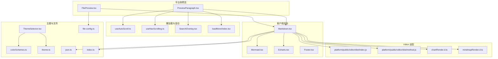
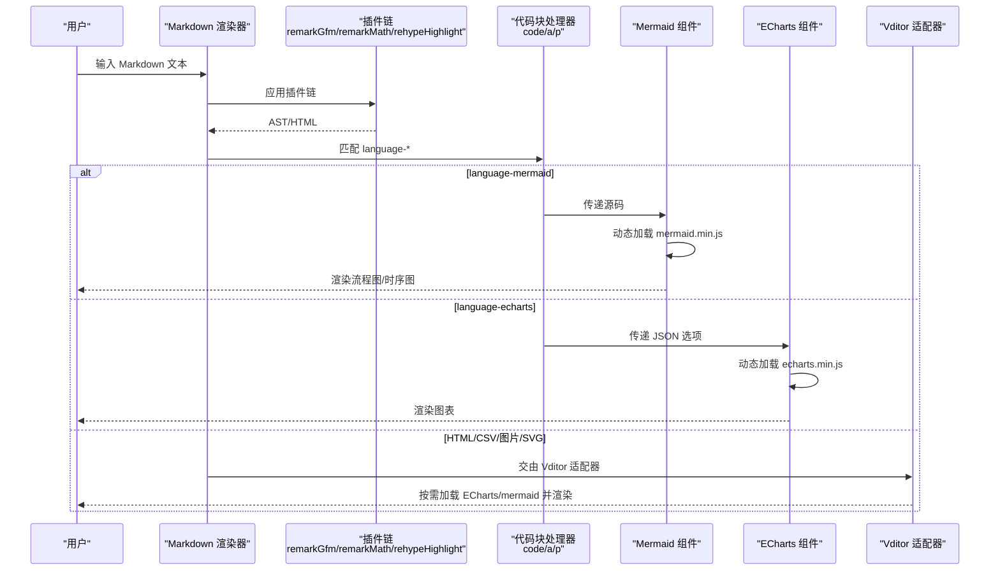
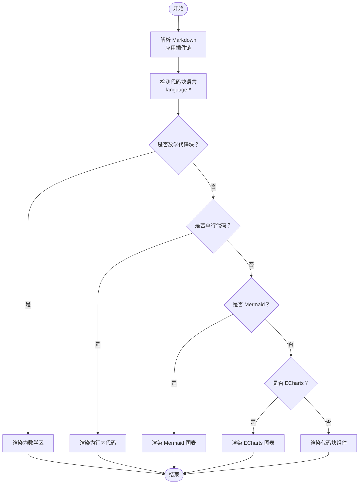
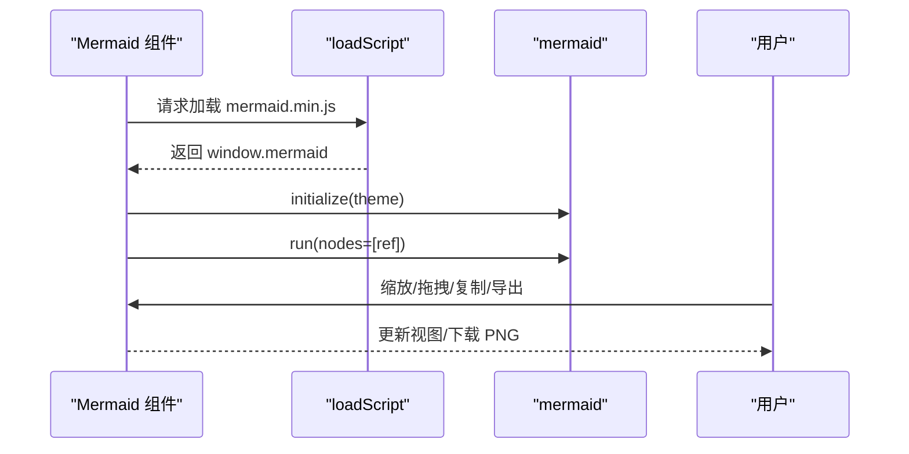
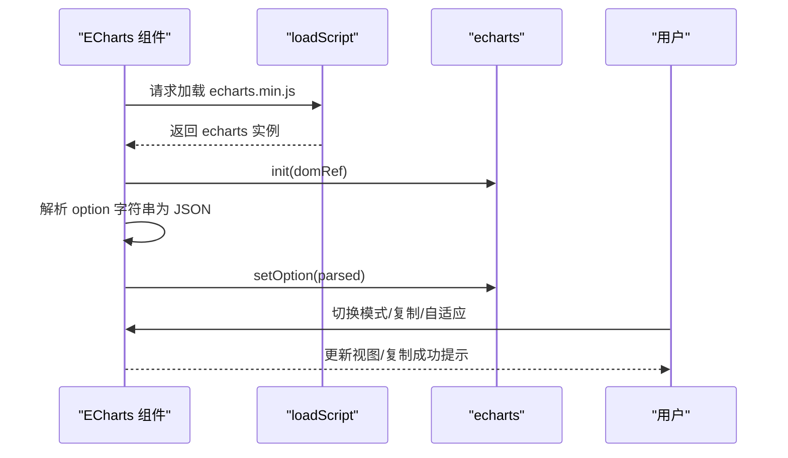
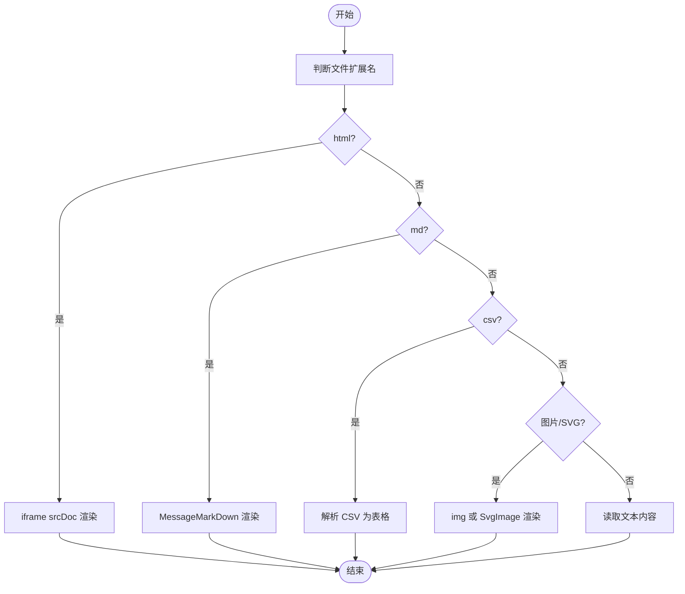
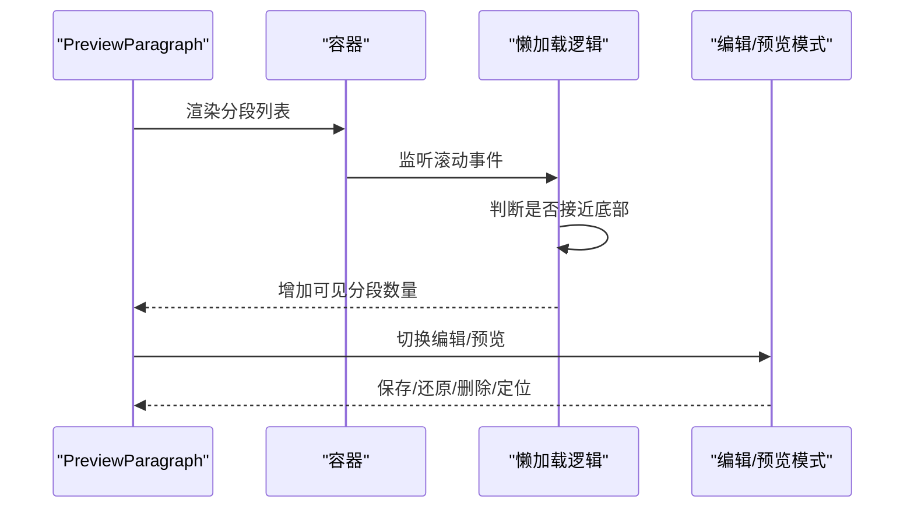
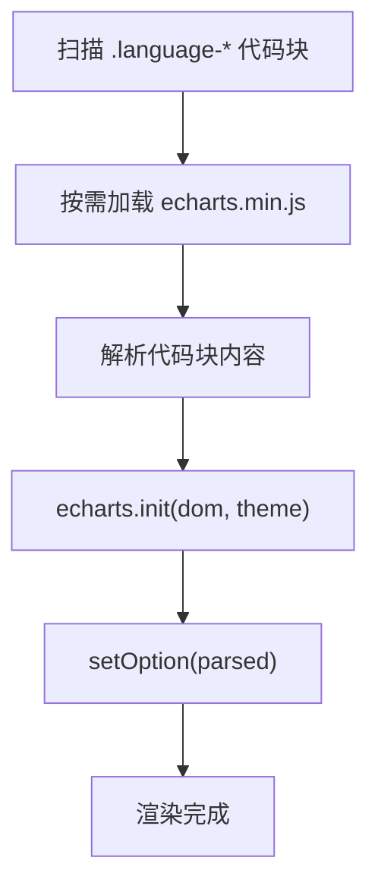
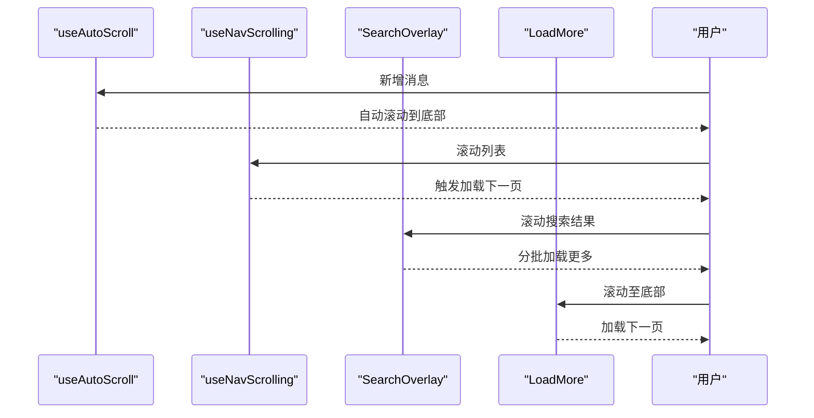
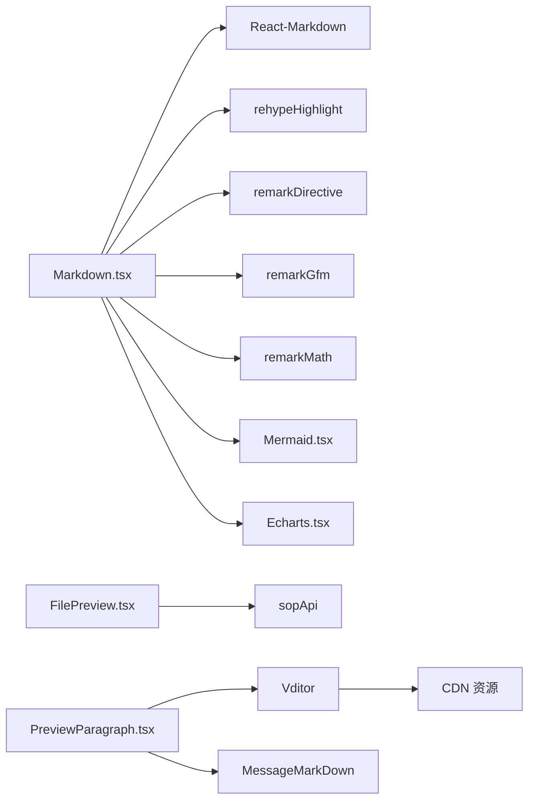

# 内容展示组件

<cite>
**本文档引用的文件**
- [Markdown.tsx](file://src/frontend/client/src/components/Chat/Messages/Content/Markdown.tsx)
- [Mermaid.tsx](file://src/frontend/client/src/components/Chat/Messages/Content/Mermaid.tsx)
- [Echarts.tsx](file://src/frontend/client/src/components/Chat/Messages/Content/Echarts.tsx)
- [FilePreview.tsx](file://src/frontend/platform/src/workspace/FilePreview.tsx)
- [PreviewParagraph.tsx](file://src/frontend/platform/src/pages/KnowledgePage/components/PreviewParagraph.tsx)
- [index.js](file://src/frontend/platform/public/vditor/dist/index.js)
- [method.js](file://src/frontend/platform/public/vditor/dist/method.js)
- [chartRender.d.ts](file://src/frontend/platform/public/vditor/dist/ts/markdown/chartRender.d.ts)
- [mindmapRender.d.ts](file://src/frontend/platform/public/vditor/dist/ts/markdown/mindmapRender.d.ts)
- [loadMore/index.tsx](file://src/frontend/platform/src/components/bs-comp/loadMore/index.tsx)
- [useAutoScroll.ts](file://src/frontend/client/src/hooks/useAutoScroll.ts)
- [useNavScrolling.ts](file://src/frontend/client/src/hooks/Nav/useNavScrolling.ts)
- [SearchOverlay.tsx](file://src/frontend/client/src/pages/apps/components/SearchOverlay.tsx)
- [index.ts](file://src/frontend/client/src/utils/index.ts)
- [json.ts](file://src/frontend/client/src/utils/json.ts)
- [file-config.ts](file://src/frontend/client/src/data-provider/data-provider/src/file-config.ts)
- [filetypes.spec.ts](file://src/frontend/client/src/data-provider/data-provider/specs/filetypes.spec.ts)
- [Footer.tsx](file://src/frontend/client/src/components/Chat/Footer.tsx)
- [ThemeSelector.tsx](file://src/frontend/client/src/components/ui/ThemeSelector.tsx)
- [colorSchemes.ts](file://src/frontend/platform/src/pages/Dashboard/colorSchemes.ts)
- [theme.ts](file://src/frontend/client/src/utils/theme.ts)
</cite>

## 目录
1. [简介](#简介)
2. [项目结构](#项目结构)
3. [核心组件](#核心组件)
4. [架构总览](#架构总览)
5. [详细组件分析](#详细组件分析)
6. [依赖关系分析](#依赖关系分析)
7. [性能考量](#性能考量)
8. [故障排查指南](#故障排查指南)
9. [结论](#结论)
10. [附录](#附录)

## 简介
本技术文档聚焦 Bisheng 的内容展示组件体系，覆盖文件预览、代码展示、图表渲染（ECharts、Mermaid）、思维导图（MindMap）等能力。文档从架构、数据流、处理逻辑、集成点、错误处理与性能优化等维度进行系统化梳理，并给出可扩展性、主题适配与交互体验的最佳实践。

## 项目结构
前端内容展示相关代码主要分布在以下模块：
- 客户端聊天消息渲染：Markdown、Mermaid、ECharts 组件
- 平台侧文件预览与知识分段预览：FilePreview、PreviewParagraph
- Vditor 渲染适配器：chartRender、mindmapRender 等
- 懒加载与滚动优化：useAutoScroll、useNavScrolling、SearchOverlay、LoadMore
- 主题与颜色方案：ThemeSelector、colorSchemes、theme 工具
- 文件类型与 MIME 配置：file-config、filetypes.spec
- 工具函数：复制、格式化、时间格式化、JSON 辅助



**图表来源**
- [Markdown.tsx](file://src/frontend/client/src/components/Chat/Messages/Content/Markdown.tsx#L1-L333)
- [Mermaid.tsx](file://src/frontend/client/src/components/Chat/Messages/Content/Mermaid.tsx#L1-L267)
- [Echarts.tsx](file://src/frontend/client/src/components/Chat/Messages/Content/Echarts.tsx#L1-L160)
- [FilePreview.tsx](file://src/frontend/platform/src/workspace/FilePreview.tsx#L1-L261)
- [PreviewParagraph.tsx](file://src/frontend/platform/src/pages/KnowledgePage/components/PreviewParagraph.tsx#L1-L328)
- [index.js](file://src/frontend/platform/public/vditor/dist/index.js#L2743-L3572)
- [method.js](file://src/frontend/platform/public/vditor/dist/method.js#L161-L979)
- [chartRender.d.ts](file://src/frontend/platform/public/vditor/dist/ts/markdown/chartRender.d.ts#L1-L1)
- [mindmapRender.d.ts](file://src/frontend/platform/public/vditor/dist/ts/markdown/mindmapRender.d.ts#L1-L1)
- [useAutoScroll.ts](file://src/frontend/client/src/hooks/useAutoScroll.ts#L46-L71)
- [useNavScrolling.ts](file://src/frontend/client/src/hooks/Nav/useNavScrolling.ts#L1-L41)
- [SearchOverlay.tsx](file://src/frontend/client/src/pages/apps/components/SearchOverlay.tsx#L46-L105)
- [loadMore/index.tsx](file://src/frontend/platform/src/components/bs-comp/loadMore/index.tsx#L1-L24)
- [ThemeSelector.tsx](file://src/frontend/client/src/components/ui/ThemeSelector.tsx#L53-L103)
- [colorSchemes.ts](file://src/frontend/platform/src/pages/Dashboard/colorSchemes.ts#L1-L69)
- [theme.ts](file://src/frontend/client/src/utils/theme.ts#L1-L39)
- [file-config.ts](file://src/frontend/client/src/data-provider/data-provider/src/file-config.ts#L30-L128)
- [json.ts](file://src/frontend/client/src/utils/json.ts#L1-L37)
- [index.ts](file://src/frontend/client/src/utils/index.ts#L1-L276)

**章节来源**
- [Markdown.tsx](file://src/frontend/client/src/components/Chat/Messages/Content/Markdown.tsx#L1-L333)
- [FilePreview.tsx](file://src/frontend/platform/src/workspace/FilePreview.tsx#L1-L261)
- [PreviewParagraph.tsx](file://src/frontend/platform/src/pages/KnowledgePage/components/PreviewParagraph.tsx#L1-L328)

## 核心组件
- Markdown 渲染与插件链：基于 React-Markdown，启用 GFM、数学公式、高亮、指令、引用等插件；自定义 code/a/p 渲染器，支持代码块执行权限、下载链接、引用标注。
- Mermaid 图表：动态加载 mermaid.min.js，支持缩放、拖拽、复制源码、导出 PNG。
- ECharts 图表：动态加载 echarts.min.js，支持图表/代码双模式切换、自适应容器尺寸、复制选项。
- 文件预览：根据扩展名选择渲染策略（HTML、MD、CSV、图片、SVG），统一通过下载接口获取内容，iframe 安全沙箱渲染 HTML。
- 知识分段预览：分页懒加载、滚动触底加载、编辑模式（Vditor/ACE）、定位原始文件、删除分段。
- Vditor 适配器：chartRender、mindmapRender、mermaidRender 等适配器扫描 .language-* 代码块并按需加载 ECharts/mermaid，注入主题与数据。
- 懒加载与滚动：useAutoScroll、useNavScrolling、SearchOverlay、LoadMore 提供多种滚动触底与无限加载策略。
- 主题与颜色：ThemeSelector 支持浅色/深色/系统主题切换；colorSchemes 定义多套配色方案；theme 工具提供字体大小与根变量注入。

**章节来源**
- [Markdown.tsx](file://src/frontend/client/src/components/Chat/Messages/Content/Markdown.tsx#L212-L333)
- [Mermaid.tsx](file://src/frontend/client/src/components/Chat/Messages/Content/Mermaid.tsx#L36-L267)
- [Echarts.tsx](file://src/frontend/client/src/components/Chat/Messages/Content/Echarts.tsx#L10-L160)
- [FilePreview.tsx](file://src/frontend/platform/src/workspace/FilePreview.tsx#L123-L193)
- [PreviewParagraph.tsx](file://src/frontend/platform/src/pages/KnowledgePage/components/PreviewParagraph.tsx#L252-L328)
- [index.js](file://src/frontend/platform/public/vditor/dist/index.js#L2743-L3572)
- [method.js](file://src/frontend/platform/public/vditor/dist/method.js#L161-L979)
- [ThemeSelector.tsx](file://src/frontend/client/src/components/ui/ThemeSelector.tsx#L53-L103)
- [colorSchemes.ts](file://src/frontend/platform/src/pages/Dashboard/colorSchemes.ts#L1-L69)
- [theme.ts](file://src/frontend/client/src/utils/theme.ts#L1-L39)

## 架构总览
内容展示由“解析—转换—渲染—交互”四层构成：
- 解析层：Markdown 解析器与插件链，识别代码块语言、数学公式、引用标注。
- 转换层：将代码块转换为具体组件（Mermaid、ECharts、CodeBlock），或对 HTML/CSV/图片/SVG 进行适配。
- 渲染层：动态加载第三方库（mermaid、echarts），在受控容器内初始化实例，注入主题与数据。
- 交互层：提供复制、缩放、拖拽、导出、懒加载、滚动优化等交互能力。



**图表来源**
- [Markdown.tsx](file://src/frontend/client/src/components/Chat/Messages/Content/Markdown.tsx#L291-L326)
- [index.js](file://src/frontend/platform/public/vditor/dist/index.js#L2810-L2840)
- [method.js](file://src/frontend/platform/public/vditor/dist/method.js#L226-L256)

## 详细组件分析

### Markdown 渲染与内容解析
- 插件链：remarkGfm、remarkMath、rehypeHighlight、remarkDirective、artifactPlugin、remarkCitationPlugin。
- 自定义渲染器：
  - code：区分单行代码、数学代码、Mermaid/ECharts 代码块，分别渲染为行内代码、KaTeX 数学区、Mermaid/ECharts 组件或 CodeBlock。
  - a：识别文件链接，支持下载与预览。
  - p：段落样式控制。
- 数学公式：通过 preprocessLaTeX 与 KaTeX 输出。
- 引用标注：将引用索引替换为 TooltipAnchor，点击打开网页内容。



**图表来源**
- [Markdown.tsx](file://src/frontend/client/src/components/Chat/Messages/Content/Markdown.tsx#L47-L82)
- [Markdown.tsx](file://src/frontend/client/src/components/Chat/Messages/Content/Markdown.tsx#L291-L326)

**章节来源**
- [Markdown.tsx](file://src/frontend/client/src/components/Chat/Messages/Content/Markdown.tsx#L250-L333)

### Mermaid 图表组件
- 动态加载：通过 loadScript 注入 mermaid.min.js，等待 window.mermaid 就绪。
- 交互能力：缩放、拖拽、复制源码、导出 PNG（SVG 转 Canvas）。
- 容器适配：根据父容器宽度动态调整图表宽度。



**图表来源**
- [Mermaid.tsx](file://src/frontend/client/src/components/Chat/Messages/Content/Mermaid.tsx#L12-L59)
- [Mermaid.tsx](file://src/frontend/client/src/components/Chat/Messages/Content/Mermaid.tsx#L183-L266)

**章节来源**
- [Mermaid.tsx](file://src/frontend/client/src/components/Chat/Messages/Content/Mermaid.tsx#L36-L267)

### ECharts 图表组件
- 动态加载：通过 loadScript 注入 echarts.min.js。
- 双模式：图表模式与代码模式，支持复制 JSON 选项。
- 自适应：ResizeObserver 与窗口 resize 事件驱动图表重绘。
- 选项解析：将字符串形式的 JSON 选项解析为图表配置。



**图表来源**
- [Echarts.tsx](file://src/frontend/client/src/components/Chat/Messages/Content/Echarts.tsx#L19-L62)
- [Echarts.tsx](file://src/frontend/client/src/components/Chat/Messages/Content/Echarts.tsx#L113-L158)

**章节来源**
- [Echarts.tsx](file://src/frontend/client/src/components/Chat/Messages/Content/Echarts.tsx#L10-L160)

### 文件预览组件
- 支持扩展名：md、csv、txt、html、svg、png/jpg/jpeg/bmp 等。
- 渲染策略：
  - HTML：iframe srcDoc 渲染，sandbox 限制脚本执行。
  - MD：MessageMarkDown 渲染。
  - CSV：解析为表格，URL 自动链接。
  - 图片/SVG：直接渲染。
- 下载：通过 sopApi.getLinsightFileDownloadApi 获取文件路径，再 fetch 文本或二进制内容。



**图表来源**
- [FilePreview.tsx](file://src/frontend/platform/src/workspace/FilePreview.tsx#L123-L193)

**章节来源**
- [FilePreview.tsx](file://src/frontend/platform/src/workspace/FilePreview.tsx#L123-L193)

### 知识分段预览与懒加载
- 懒加载策略：滚动触底时每次增加固定数量，带节流/防抖控制。
- 编辑模式：Vditor 即时渲染与 ACE 编辑器双模式，支持保存/还原。
- 交互：定位原始文件、删除分段、选中分段高亮。
- 加载状态：容器遮罩与 LoadingIcon 提示。



**图表来源**
- [PreviewParagraph.tsx](file://src/frontend/platform/src/pages/KnowledgePage/components/PreviewParagraph.tsx#L277-L295)
- [PreviewParagraph.tsx](file://src/frontend/platform/src/pages/KnowledgePage/components/PreviewParagraph.tsx#L155-L249)

**章节来源**
- [PreviewParagraph.tsx](file://src/frontend/platform/src/pages/KnowledgePage/components/PreviewParagraph.tsx#L252-L328)

### Vditor 适配器与思维导图
- 适配器：chartRender、mindmapRender、mermaidRender 等扫描 .language-* 代码块。
- 思维导图：mindmapRender 通过 ECharts 渲染 JSON 数据树，支持暗色主题。
- 适配器职责：按需加载 echarts.min.js，解析代码块内容，注入主题与数据。



**图表来源**
- [index.js](file://src/frontend/platform/public/vditor/dist/index.js#L2810-L2840)
- [method.js](file://src/frontend/platform/public/vditor/dist/method.js#L226-L256)
- [mindmapRender.d.ts](file://src/frontend/platform/public/vditor/dist/ts/markdown/mindmapRender.d.ts#L1-L1)

**章节来源**
- [index.js](file://src/frontend/platform/public/vditor/dist/index.js#L2743-L3572)
- [method.js](file://src/frontend/platform/public/vditor/dist/method.js#L161-L979)

### 主题适配与颜色方案
- ThemeSelector：支持 light/dark/system 主题切换，节流防止频繁切换。
- colorSchemes：内置多套配色方案，包含明暗两套色阶与文本/背景/边框。
- theme 工具：提供字体大小映射与根 CSS 变量注入。

```mermaid
classDiagram
class ThemeSelector {
+changeTheme(value)
+useEffect(system theme)
}
class ColorScheme {
+id : string
+name : string
+colors : {light[], dark[]}
+background : {light, dark}
+text : {light, dark}
+border : {light, dark}
}
ThemeSelector --> ColorScheme : "应用配色"
```

**图表来源**
- [ThemeSelector.tsx](file://src/frontend/client/src/components/ui/ThemeSelector.tsx#L53-L103)
- [colorSchemes.ts](file://src/frontend/platform/src/pages/Dashboard/colorSchemes.ts#L1-L69)
- [theme.ts](file://src/frontend/client/src/utils/theme.ts#L1-L39)

**章节来源**
- [ThemeSelector.tsx](file://src/frontend/client/src/components/ui/ThemeSelector.tsx#L53-L103)
- [colorSchemes.ts](file://src/frontend/platform/src/pages/Dashboard/colorSchemes.ts#L1-L69)
- [theme.ts](file://src/frontend/client/src/utils/theme.ts#L1-L39)

### 交互与用户体验优化
- 自动滚动：useAutoScroll 在消息新增时自动滚动到底部，避免频繁触发滚动事件。
- 滚动加载：useNavScrolling、SearchOverlay、LoadMore 提供多种滚动触底策略，结合节流/防抖提升性能。
- 复制与导出：统一的 copyText 工具与 Mermaid/ECharts 导出能力，提升可操作性。
- 文件类型与 MIME：file-config 定义全面的 MIME 类型支持，配合测试用例保障兼容性。



**图表来源**
- [useAutoScroll.ts](file://src/frontend/client/src/hooks/useAutoScroll.ts#L46-L71)
- [useNavScrolling.ts](file://src/frontend/client/src/hooks/Nav/useNavScrolling.ts#L1-L41)
- [SearchOverlay.tsx](file://src/frontend/client/src/pages/apps/components/SearchOverlay.tsx#L46-L105)
- [loadMore/index.tsx](file://src/frontend/platform/src/components/bs-comp/loadMore/index.tsx#L1-L24)

**章节来源**
- [useAutoScroll.ts](file://src/frontend/client/src/hooks/useAutoScroll.ts#L46-L71)
- [useNavScrolling.ts](file://src/frontend/client/src/hooks/Nav/useNavScrolling.ts#L1-L41)
- [SearchOverlay.tsx](file://src/frontend/client/src/pages/apps/components/SearchOverlay.tsx#L46-L105)
- [loadMore/index.tsx](file://src/frontend/platform/src/components/bs-comp/loadMore/index.tsx#L1-L24)

## 依赖关系分析
- 组件耦合：
  - Markdown.tsx 依赖 React-Markdown 与各类插件，内部组合 Mermaid/ECharts/CodeBlock。
  - FilePreview.tsx 依赖 sopApi 与下载接口，按扩展名路由到不同渲染器。
  - PreviewParagraph.tsx 依赖 Vditor 与 MessageMarkDown，结合懒加载与编辑器。
- 外部依赖：
  - mermaid.min.js、echarts.min.js 通过动态加载注入。
  - Vditor 适配器在平台静态资源目录中提供，按 CDN 路径加载。
- 潜在循环依赖：
  - 组件间通过 props 传递数据，未发现直接循环导入。
- 接口契约：
  - ECharts 组件期望接收字符串形式的 JSON 选项；Mermaid 组件期望接收 Mermaid DSL 源码。



**图表来源**
- [Markdown.tsx](file://src/frontend/client/src/components/Chat/Messages/Content/Markdown.tsx#L1-L30)
- [FilePreview.tsx](file://src/frontend/platform/src/workspace/FilePreview.tsx#L8-L14)
- [PreviewParagraph.tsx](file://src/frontend/platform/src/pages/KnowledgePage/components/PreviewParagraph.tsx#L6-L14)

**章节来源**
- [Markdown.tsx](file://src/frontend/client/src/components/Chat/Messages/Content/Markdown.tsx#L1-L30)
- [FilePreview.tsx](file://src/frontend/platform/src/workspace/FilePreview.tsx#L8-L14)
- [PreviewParagraph.tsx](file://src/frontend/platform/src/pages/KnowledgePage/components/PreviewParagraph.tsx#L6-L14)

## 性能考量
- 懒加载与滚动优化：使用 IntersectionObserver、节流/防抖与阈值控制，减少不必要的渲染与请求。
- 动态脚本加载：仅在需要时加载 mermaid/echarts，避免首屏体积过大。
- ResizeObserver：ECharts 组件使用 ResizeObserver 与窗口 resize 事件，避免轮询带来的性能损耗。
- 滚动容器：PreviewParagraph 与 SearchOverlay 通过容器滚动事件监听，降低全局监听开销。
- 复制与导出：Mermaid 导出采用 Canvas 转换，注意大图导出的内存占用与性能影响。

[本节为通用指导，无需特定文件分析]

## 故障排查指南
- Mermaid 渲染失败：
  - 检查动态加载是否成功（window.mermaid 是否可用）。
  - 确认代码块未被闭合，或被过滤逻辑移除。
- ECharts 渲染失败：
  - 检查 option 字符串是否为合法 JSON。
  - 确认 echarts.min.js 已成功加载。
- 文件预览失败：
  - 检查 sopApi 返回的 file_path 是否正确。
  - HTML 预览需确认 sandbox 限制与同源策略。
- 懒加载不生效：
  - 确认容器滚动事件是否绑定成功。
  - 检查 loadingRef 与阈值设置，避免重复触发。

**章节来源**
- [Mermaid.tsx](file://src/frontend/client/src/components/Chat/Messages/Content/Mermaid.tsx#L12-L59)
- [Echarts.tsx](file://src/frontend/client/src/components/Chat/Messages/Content/Echarts.tsx#L19-L62)
- [FilePreview.tsx](file://src/frontend/platform/src/workspace/FilePreview.tsx#L137-L158)
- [PreviewParagraph.tsx](file://src/frontend/platform/src/pages/KnowledgePage/components/PreviewParagraph.tsx#L277-L295)

## 结论
Bisheng 的内容展示组件通过“解析—转换—渲染—交互”的清晰分层，实现了对 Markdown、Mermaid、ECharts、思维导图、文件预览与知识分段的完整覆盖。借助动态脚本加载、懒加载与滚动优化、主题与颜色方案，组件在可扩展性、可维护性与用户体验方面均具备良好基础。建议在后续迭代中进一步完善错误边界与日志上报、增强导出与复制的可访问性，并持续优化大图与大数据量场景下的性能表现。

[本节为总结性内容，无需特定文件分析]

## 附录
- 最佳实践清单
  - 代码块语言识别：优先使用标准语言标识（mermaid、echarts、math），避免自定义语法。
  - 动态加载：确保脚本加载成功后再初始化实例，避免空指针。
  - 懒加载：合理设置阈值与节流间隔，避免频繁触发。
  - 主题适配：统一注入 CSS 变量，确保第三方库主题一致性。
  - 文件预览：HTML 预览开启 sandbox，CSV 解析注意列分隔规则。
  - 用户体验：提供加载状态、错误提示与一键复制/导出能力。

[本节为通用指导，无需特定文件分析]