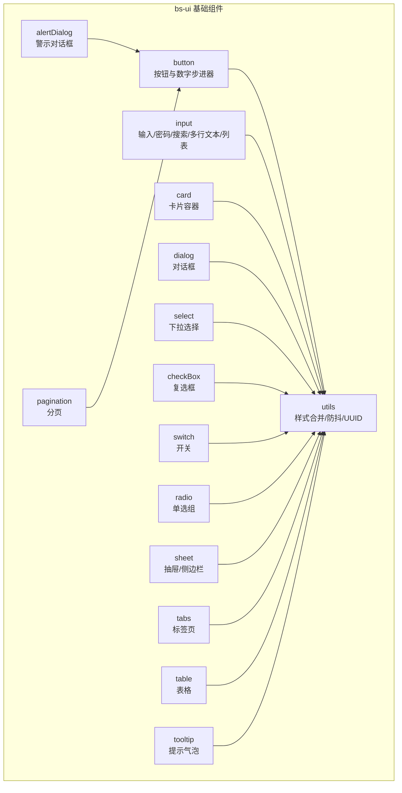
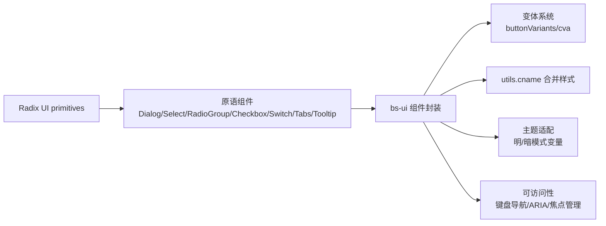
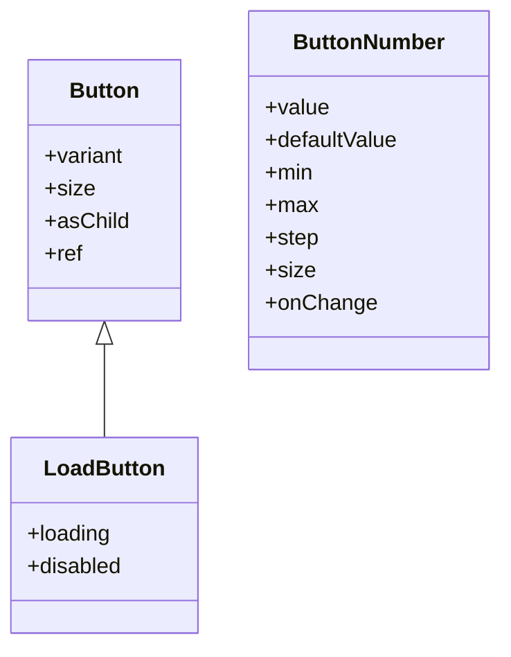
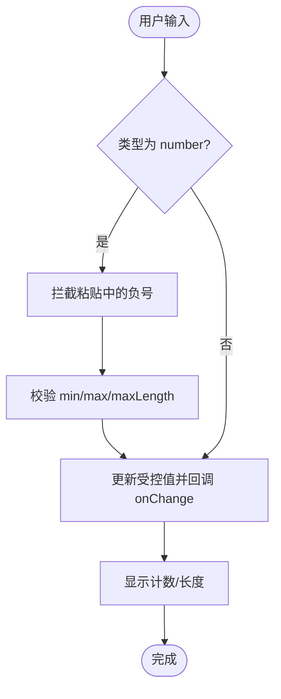
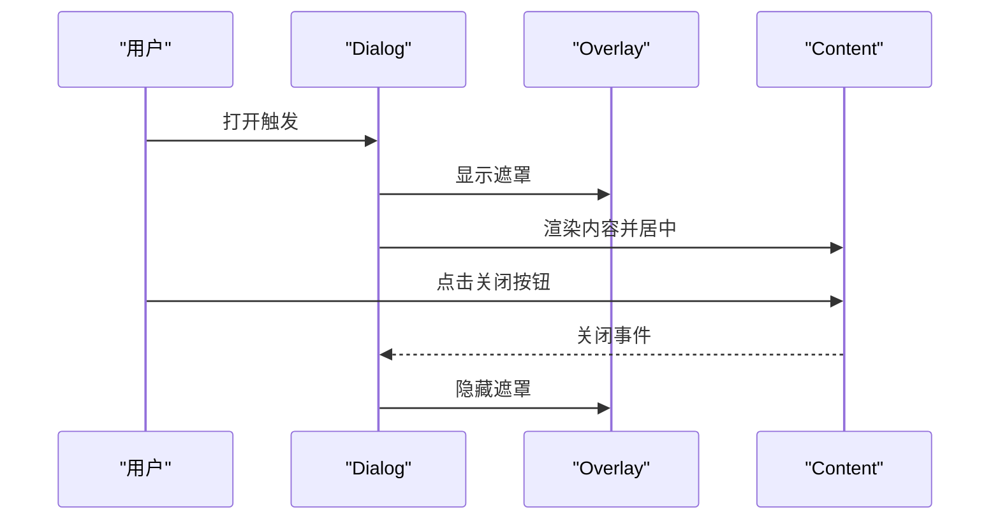
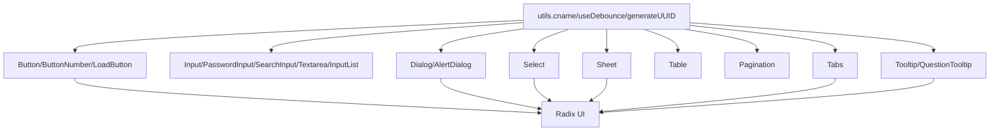

# 基础 UI 组件

<cite>
**本文引用的文件**   
- [src/frontend/platform/src/components/bs-ui/button/index.tsx](file://src/frontend/platform/src/components/bs-ui/button/index.tsx)
- [src/frontend/platform/src/components/bs-ui/input/index.tsx](file://src/frontend/platform/src/components/bs-ui/input/index.tsx)
- [src/frontend/platform/src/components/bs-ui/card/index.tsx](file://src/frontend/platform/src/components/bs-ui/card/index.tsx)
- [src/frontend/platform/src/components/bs-ui/dialog/index.tsx](file://src/frontend/platform/src/components/bs-ui/dialog/index.tsx)
- [src/frontend/platform/src/components/bs-ui/select/index.tsx](file://src/frontend/platform/src/components/bs-ui/select/index.tsx)
- [src/frontend/platform/src/components/bs-ui/checkBox/index.tsx](file://src/frontend/platform/src/components/bs-ui/checkBox/index.tsx)
- [src/frontend/platform/src/components/bs-ui/switch/index.tsx](file://src/frontend/platform/src/components/bs-ui/switch/index.tsx)
- [src/frontend/platform/src/components/bs-ui/radio/index.tsx](file://src/frontend/platform/src/components/bs-ui/radio/index.tsx)
- [src/frontend/platform/src/components/bs-ui/alertDialog/index.tsx](file://src/frontend/platform/src/components/bs-ui/alertDialog/index.tsx)
- [src/frontend/platform/src/components/bs-ui/sheet/index.tsx](file://src/frontend/platform/src/components/bs-ui/sheet/index.tsx)
- [src/frontend/platform/src/components/bs-ui/table/index.tsx](file://src/frontend/platform/src/components/bs-ui/table/index.tsx)
- [src/frontend/platform/src/components/bs-ui/pagination/index.tsx](file://src/frontend/platform/src/components/bs-ui/pagination/index.tsx)
- [src/frontend/platform/src/components/bs-ui/tabs/index.tsx](file://src/frontend/platform/src/components/bs-ui/tabs/index.tsx)
- [src/frontend/platform/src/components/bs-ui/tooltip/index.tsx](file://src/frontend/platform/src/components/bs-ui/tooltip/index.tsx)
- [src/frontend/platform/src/components/bs-ui/utils.tsx](file://src/frontend/platform/src/components/bs-ui/utils.tsx)
</cite>

## 目录
1. [简介](#简介)
2. [项目结构](#项目结构)
3. [核心组件](#核心组件)
4. [架构总览](#架构总览)
5. [组件详解](#组件详解)
6. [依赖关系分析](#依赖关系分析)
7. [性能考量](#性能考量)
8. [故障排查指南](#故障排查指南)
9. [结论](#结论)
10. [附录](#附录)

## 简介
本文件系统化梳理 Bisheng 平台前端基础 UI 组件库，覆盖按钮、输入框、表单控件（复选框、单选组、开关）、卡片、对话框、选择器、表格、分页、标签页、提示气泡等通用组件。文档从架构、数据流、处理逻辑、可访问性与主题适配等方面进行深入解析，并提供使用示例路径、最佳实践与性能优化建议，帮助开发者高效复用与扩展。

## 项目结构
基础 UI 组件集中于平台前端 bs-ui 目录，采用按功能域拆分的组织方式，每个组件独立导出，统一通过工具函数进行样式合并与通用能力封装。

图表来源
- [src/frontend/platform/src/components/bs-ui/button/index.tsx](file://src/frontend/platform/src/components/bs-ui/button/index.tsx#L1-L110)
- [src/frontend/platform/src/components/bs-ui/input/index.tsx](file://src/frontend/platform/src/components/bs-ui/input/index.tsx#L1-L510)
- [src/frontend/platform/src/components/bs-ui/card/index.tsx](file://src/frontend/platform/src/components/bs-ui/card/index.tsx#L1-L76)
- [src/frontend/platform/src/components/bs-ui/dialog/index.tsx](file://src/frontend/platform/src/components/bs-ui/dialog/index.tsx#L1-L114)
- [src/frontend/platform/src/components/bs-ui/select/index.tsx](file://src/frontend/platform/src/components/bs-ui/select/index.tsx#L1-L163)
- [src/frontend/platform/src/components/bs-ui/checkBox/index.tsx](file://src/frontend/platform/src/components/bs-ui/checkBox/index.tsx#L1-L30)
- [src/frontend/platform/src/components/bs-ui/switch/index.tsx](file://src/frontend/platform/src/components/bs-ui/switch/index.tsx#L1-L31)
- [src/frontend/platform/src/components/bs-ui/radio/index.tsx](file://src/frontend/platform/src/components/bs-ui/radio/index.tsx#L1-L44)
- [src/frontend/platform/src/components/bs-ui/alertDialog/index.tsx](file://src/frontend/platform/src/components/bs-ui/alertDialog/index.tsx#L1-L141)
- [src/frontend/platform/src/components/bs-ui/sheet/index.tsx](file://src/frontend/platform/src/components/bs-ui/sheet/index.tsx#L1-L133)
- [src/frontend/platform/src/components/bs-ui/tabs/index.tsx](file://src/frontend/platform/src/components/bs-ui/tabs/index.tsx#L1-L55)
- [src/frontend/platform/src/components/bs-ui/table/index.tsx](file://src/frontend/platform/src/components/bs-ui/table/index.tsx#L1-L120)
- [src/frontend/platform/src/components/bs-ui/pagination/index.tsx](file://src/frontend/platform/src/components/bs-ui/pagination/index.tsx#L1-L116)
- [src/frontend/platform/src/components/bs-ui/tooltip/index.tsx](file://src/frontend/platform/src/components/bs-ui/tooltip/index.tsx#L1-L53)
- [src/frontend/platform/src/components/bs-ui/utils.tsx](file://src/frontend/platform/src/components/bs-ui/utils.tsx#L1-L52)

章节来源
- [src/frontend/platform/src/components/bs-ui/button/index.tsx](file://src/frontend/platform/src/components/bs-ui/button/index.tsx#L1-L110)
- [src/frontend/platform/src/components/bs-ui/input/index.tsx](file://src/frontend/platform/src/components/bs-ui/input/index.tsx#L1-L510)
- [src/frontend/platform/src/components/bs-ui/utils.tsx](file://src/frontend/platform/src/components/bs-ui/utils.tsx#L1-L52)

## 核心组件
- 按钮 Button：支持多种语义与尺寸，支持包裹子节点；提供加载态按钮与数值步进器。
- 输入 Input/Textarea/PasswordInput/SearchInput：统一输入体验，含计数、粘贴校验、密码显隐、星号掩码等。
- 表单控件：复选框、单选组、开关，均基于 Radix UI，具备无障碍与暗色主题适配。
- 卡片 Card：容器型组件，提供头部、标题、描述、内容、底部区域。
- 对话框 Dialog/AlertDialog：遮罩层、动画、关闭按钮、可选无遮罩抽屉。
- 选择器 Select：触发器、内容区、滚动按钮、可自定义项内容。
- 表格 Table/Pagination/Tabs：表格骨架与单元格样式、分页链接复用按钮样式、标签页切换。
- 提示 Tooltip：提供问题提示与错误高亮提示。
- 工具 utils：样式合并、防抖 Hook、UUID 生成。

章节来源
- [src/frontend/platform/src/components/bs-ui/button/index.tsx](file://src/frontend/platform/src/components/bs-ui/button/index.tsx#L37-L55)
- [src/frontend/platform/src/components/bs-ui/input/index.tsx](file://src/frontend/platform/src/components/bs-ui/input/index.tsx#L8-L97)
- [src/frontend/platform/src/components/bs-ui/checkBox/index.tsx](file://src/frontend/platform/src/components/bs-ui/checkBox/index.tsx#L8-L26)
- [src/frontend/platform/src/components/bs-ui/radio/index.tsx](file://src/frontend/platform/src/components/bs-ui/radio/index.tsx#L8-L40)
- [src/frontend/platform/src/components/bs-ui/switch/index.tsx](file://src/frontend/platform/src/components/bs-ui/switch/index.tsx#L5-L26)
- [src/frontend/platform/src/components/bs-ui/card/index.tsx](file://src/frontend/platform/src/components/bs-ui/card/index.tsx#L4-L73)
- [src/frontend/platform/src/components/bs-ui/dialog/index.tsx](file://src/frontend/platform/src/components/bs-ui/dialog/index.tsx#L7-L51)
- [src/frontend/platform/src/components/bs-ui/alertDialog/index.tsx](file://src/frontend/platform/src/components/bs-ui/alertDialog/index.tsx#L8-L44)
- [src/frontend/platform/src/components/bs-ui/select/index.tsx](file://src/frontend/platform/src/components/bs-ui/select/index.tsx#L8-L102)
- [src/frontend/platform/src/components/bs-ui/table/index.tsx](file://src/frontend/platform/src/components/bs-ui/table/index.tsx#L4-L96)
- [src/frontend/platform/src/components/bs-ui/pagination/index.tsx](file://src/frontend/platform/src/components/bs-ui/pagination/index.tsx#L6-L61)
- [src/frontend/platform/src/components/bs-ui/tabs/index.tsx](file://src/frontend/platform/src/components/bs-ui/tabs/index.tsx#L7-L52)
- [src/frontend/platform/src/components/bs-ui/tooltip/index.tsx](file://src/frontend/platform/src/components/bs-ui/tooltip/index.tsx#L8-L26)
- [src/frontend/platform/src/components/bs-ui/utils.tsx](file://src/frontend/platform/src/components/bs-ui/utils.tsx#L8-L50)

## 架构总览
组件遵循“原子化 + 组合”的设计原则，通过 Radix UI 提供可访问性与状态管理，使用 Tailwind 与 class-variance-authority 实现主题与尺寸变体，统一的 cname 合并工具保证样式一致性与覆盖优先级。

图表来源
- [src/frontend/platform/src/components/bs-ui/dialog/index.tsx](file://src/frontend/platform/src/components/bs-ui/dialog/index.tsx#L15-L51)
- [src/frontend/platform/src/components/bs-ui/select/index.tsx](file://src/frontend/platform/src/components/bs-ui/select/index.tsx#L14-L33)
- [src/frontend/platform/src/components/bs-ui/button/index.tsx](file://src/frontend/platform/src/components/bs-ui/button/index.tsx#L6-L35)
- [src/frontend/platform/src/components/bs-ui/utils.tsx](file://src/frontend/platform/src/components/bs-ui/utils.tsx#L8-L10)

## 组件详解

### 按钮 Button 与数字步进器 ButtonNumber、加载按钮 LoadButton
- 属性与变体
  - Button：继承原生 button 属性，支持 variant（default/destructive/outline/secondary/ghost/link/black）与 size（default/sm/lg/icon），支持 asChild 包裹子元素。
  - ButtonNumber：带 + / - 的数值步进器，支持 min/max/step/defaultValue/value 受控/非受控，内部对小数精度进行取整处理。
  - LoadButton：在 loading 或 disabled 时禁用，内置加载图标。
- 样式与主题
  - 使用 cva 定义变体，结合 cname 合并类名，支持明/暗模式下的前景/背景色。
- 可访问性
  - 通过原生 button 语义与禁用状态传达交互可用性。
- 使用示例路径
  - [按钮基础用法](file://src/frontend/platform/src/components/bs-ui/button/index.tsx#L43-L55)
  - [数值步进器](file://src/frontend/platform/src/components/bs-ui/button/index.tsx#L58-L101)
  - [加载按钮](file://src/frontend/platform/src/components/bs-ui/button/index.tsx#L104-L108)

图表来源
- [src/frontend/platform/src/components/bs-ui/button/index.tsx](file://src/frontend/platform/src/components/bs-ui/button/index.tsx#L37-L108)

章节来源
- [src/frontend/platform/src/components/bs-ui/button/index.tsx](file://src/frontend/platform/src/components/bs-ui/button/index.tsx#L37-L108)

### 输入 Input、密码 PasswordInput、搜索 SearchInput、多行文本 Textarea、输入列表 InputList
- 输入 Input
  - 支持 number 类型的粘贴与前置校验（禁止负数、最小值限制、最大值限制、最大长度），统一计数展示。
  - 受控/非受控兼容，自动同步外部 value。
- 密码 PasswordInput
  - 内置显隐切换图标，点击切换 type。
- 搜索 SearchInput
  - 左侧内置搜索图标，右侧内边距适配。
- 多行文本 Textarea
  - 计数展示，受控/非受控兼容。
- 输入列表 InputList
  - 动态增删，支持字典模式与数组模式，onChange 返回动作与变更项信息。
- 可访问性与样式
  - 统一使用 cname 合并样式，暗色模式下文本颜色与占位符颜色适配。
- 使用示例路径
  - [输入基础与计数](file://src/frontend/platform/src/components/bs-ui/input/index.tsx#L14-L97)
  - [搜索输入](file://src/frontend/platform/src/components/bs-ui/input/index.tsx#L100-L109)
  - [密码输入与显隐](file://src/frontend/platform/src/components/bs-ui/input/index.tsx#L329-L344)
  - [多行文本计数](file://src/frontend/platform/src/components/bs-ui/input/index.tsx#L355-L401)
  - [输入列表](file://src/frontend/platform/src/components/bs-ui/input/index.tsx#L408-L507)

图表来源
- [src/frontend/platform/src/components/bs-ui/input/index.tsx](file://src/frontend/platform/src/components/bs-ui/input/index.tsx#L18-L37)

章节来源
- [src/frontend/platform/src/components/bs-ui/input/index.tsx](file://src/frontend/platform/src/components/bs-ui/input/index.tsx#L8-L507)

### 卡片 Card
- 结构化容器，包含 CardHeader/CardTitle/CardDescription/CardContent/CardFooter。
- 悬停阴影与边框变化，暗色模式下边框与阴影适配。
- 使用示例路径
  - [卡片容器](file://src/frontend/platform/src/components/bs-ui/card/index.tsx#L4-L73)

章节来源
- [src/frontend/platform/src/components/bs-ui/card/index.tsx](file://src/frontend/platform/src/components/bs-ui/card/index.tsx#L4-L73)

### 对话框 Dialog 与警示对话框 AlertDialog
- Dialog
  - Root/Portal/Overlay/Content/Trigger/Close，支持居中动画、关闭按钮、可选无关闭按钮。
- AlertDialog
  - 基于 AlertDialog 原语，Action/Cance 继承按钮变体，强调破坏性操作。
- 可访问性
  - 聚焦管理、Esc 关闭、遮罩点击关闭。
- 使用示例路径
  - [对话框](file://src/frontend/platform/src/components/bs-ui/dialog/index.tsx#L7-L51)
  - [警示对话框](file://src/frontend/platform/src/components/bs-ui/alertDialog/index.tsx#L8-L44)

图表来源
- [src/frontend/platform/src/components/bs-ui/dialog/index.tsx](file://src/frontend/platform/src/components/bs-ui/dialog/index.tsx#L30-L51)

章节来源
- [src/frontend/platform/src/components/bs-ui/dialog/index.tsx](file://src/frontend/platform/src/components/bs-ui/dialog/index.tsx#L7-L114)
- [src/frontend/platform/src/components/bs-ui/alertDialog/index.tsx](file://src/frontend/platform/src/components/bs-ui/alertDialog/index.tsx#L8-L141)

### 选择器 Select
- 触发器 SelectTrigger（可隐藏右侧图标）、内容 SelectContent（支持头尾节点与定位）、滚动按钮、标签与项。
- SelectItem 支持默认勾选指示与自定义内容模式。
- 使用示例路径
  - [选择器](file://src/frontend/platform/src/components/bs-ui/select/index.tsx#L8-L102)
  - [选择项](file://src/frontend/platform/src/components/bs-ui/select/index.tsx#L117-L144)

章节来源
- [src/frontend/platform/src/components/bs-ui/select/index.tsx](file://src/frontend/platform/src/components/bs-ui/select/index.tsx#L1-L163)

### 表单控件：复选框 Checkbox、单选组 RadioGroup、开关 Switch
- Checkbox：基于 Radix UI，支持禁用、选中态样式。
- RadioGroup：网格布局容器，RadioGroupItem 支持指示器。
- Switch：支持文字标签（开/关），暗色主题下拇指颜色适配。
- 使用示例路径
  - [复选框](file://src/frontend/platform/src/components/bs-ui/checkBox/index.tsx#L8-L26)
  - [单选组](file://src/frontend/platform/src/components/bs-ui/radio/index.tsx#L8-L40)
  - [开关](file://src/frontend/platform/src/components/bs-ui/switch/index.tsx#L5-L26)

章节来源
- [src/frontend/platform/src/components/bs-ui/checkBox/index.tsx](file://src/frontend/platform/src/components/bs-ui/checkBox/index.tsx#L1-L30)
- [src/frontend/platform/src/components/bs-ui/radio/index.tsx](file://src/frontend/platform/src/components/bs-ui/radio/index.tsx#L1-L44)
- [src/frontend/platform/src/components/bs-ui/switch/index.tsx](file://src/frontend/platform/src/components/bs-ui/switch/index.tsx#L1-L31)

### 抽屉/侧边栏 Sheet
- 支持四个方向（上/下/左/右）滑入动画，可配置是否显示遮罩与关闭按钮。
- 使用示例路径
  - [抽屉](file://src/frontend/platform/src/components/bs-ui/sheet/index.tsx#L55-L73)

章节来源
- [src/frontend/platform/src/components/bs-ui/sheet/index.tsx](file://src/frontend/platform/src/components/bs-ui/sheet/index.tsx#L1-L133)

### 表格 Table、分页 Pagination、标签页 Tabs
- Table：容器 + 头/体/脚/行/单元格/标题/说明，支持滚动与暗色模式背景交替。
- Pagination：导航容器 + 内容列表 + 链接（复用按钮变体）+ 上一页/下一页/省略号。
- Tabs：列表 + 触发器 + 内容区，激活态样式与暗色主题适配。
- 使用示例路径
  - [表格](file://src/frontend/platform/src/components/bs-ui/table/index.tsx#L4-L96)
  - [分页](file://src/frontend/platform/src/components/bs-ui/pagination/index.tsx#L6-L61)
  - [标签页](file://src/frontend/platform/src/components/bs-ui/tabs/index.tsx#L7-L52)

章节来源
- [src/frontend/platform/src/components/bs-ui/table/index.tsx](file://src/frontend/platform/src/components/bs-ui/table/index.tsx#L1-L120)
- [src/frontend/platform/src/components/bs-ui/pagination/index.tsx](file://src/frontend/platform/src/components/bs-ui/pagination/index.tsx#L1-L116)
- [src/frontend/platform/src/components/bs-ui/tabs/index.tsx](file://src/frontend/platform/src/components/bs-ui/tabs/index.tsx#L1-L55)

### 提示 Tooltip 与问题提示 QuestionTooltip
- TooltipProvider/Root/Trigger/Content，支持侧偏移与动画。
- QuestionTooltip：内置问号图标，支持错误态高亮与自定义触发元素。
- 使用示例路径
  - [提示气泡](file://src/frontend/platform/src/components/bs-ui/tooltip/index.tsx#L8-L26)
  - [问题提示](file://src/frontend/platform/src/components/bs-ui/tooltip/index.tsx#L32-L52)

章节来源
- [src/frontend/platform/src/components/bs-ui/tooltip/index.tsx](file://src/frontend/platform/src/components/bs-ui/tooltip/index.tsx#L1-L53)

### 工具函数 utils
- cname：基于 clsx 与 tailwind-merge 合并类名，避免冲突与重复。
- generateUUID：短 UUID 生成，用于动态列表项标识。
- useDebounce：防抖 Hook，支持立即执行与取消。
- 使用示例路径
  - [样式合并](file://src/frontend/platform/src/components/bs-ui/utils.tsx#L8-L10)
  - [UUID](file://src/frontend/platform/src/components/bs-ui/utils.tsx#L13-L21)
  - [防抖](file://src/frontend/platform/src/components/bs-ui/utils.tsx#L25-L50)

章节来源
- [src/frontend/platform/src/components/bs-ui/utils.tsx](file://src/frontend/platform/src/components/bs-ui/utils.tsx#L1-L52)

## 依赖关系分析
- 组件间耦合
  - Button 与 Pagination 共享按钮变体；AlertDialog 复用按钮变体；Select/Dialog/Sheet/Tooltip 均依赖 Radix UI 原语。
- 外部依赖
  - Radix UI：可访问性与状态管理。
  - class-variance-authority：变体系统。
  - lucide-react：图标。
  - tailwind-merge/clsx：样式合并。
- 潜在循环依赖
  - 组件均为纯 UI 封装，未见循环导入。

图表来源
- [src/frontend/platform/src/components/bs-ui/button/index.tsx](file://src/frontend/platform/src/components/bs-ui/button/index.tsx#L1-L10)
- [src/frontend/platform/src/components/bs-ui/dialog/index.tsx](file://src/frontend/platform/src/components/bs-ui/dialog/index.tsx#L2-L5)
- [src/frontend/platform/src/components/bs-ui/select/index.tsx](file://src/frontend/platform/src/components/bs-ui/select/index.tsx#L3-L6)
- [src/frontend/platform/src/components/bs-ui/sheet/index.tsx](file://src/frontend/platform/src/components/bs-ui/sheet/index.tsx#L2-L6)
- [src/frontend/platform/src/components/bs-ui/table/index.tsx](file://src/frontend/platform/src/components/bs-ui/table/index.tsx#L2)
- [src/frontend/platform/src/components/bs-ui/pagination/index.tsx](file://src/frontend/platform/src/components/bs-ui/pagination/index.tsx#L3)
- [src/frontend/platform/src/components/bs-ui/tabs/index.tsx](file://src/frontend/platform/src/components/bs-ui/tabs/index.tsx#L3)
- [src/frontend/platform/src/components/bs-ui/tooltip/index.tsx](file://src/frontend/platform/src/components/bs-ui/tooltip/index.tsx#L3-L6)
- [src/frontend/platform/src/components/bs-ui/utils.tsx](file://src/frontend/platform/src/components/bs-ui/utils.tsx#L1-L10)

章节来源
- [src/frontend/platform/src/components/bs-ui/button/index.tsx](file://src/frontend/platform/src/components/bs-ui/button/index.tsx#L1-L110)
- [src/frontend/platform/src/components/bs-ui/dialog/index.tsx](file://src/frontend/platform/src/components/bs-ui/dialog/index.tsx#L1-L114)
- [src/frontend/platform/src/components/bs-ui/select/index.tsx](file://src/frontend/platform/src/components/bs-ui/select/index.tsx#L1-L163)
- [src/frontend/platform/src/components/bs-ui/sheet/index.tsx](file://src/frontend/platform/src/components/bs-ui/sheet/index.tsx#L1-L133)
- [src/frontend/platform/src/components/bs-ui/table/index.tsx](file://src/frontend/platform/src/components/bs-ui/table/index.tsx#L1-L120)
- [src/frontend/platform/src/components/bs-ui/pagination/index.tsx](file://src/frontend/platform/src/components/bs-ui/pagination/index.tsx#L1-L116)
- [src/frontend/platform/src/components/bs-ui/tabs/index.tsx](file://src/frontend/platform/src/components/bs-ui/tabs/index.tsx#L1-L55)
- [src/frontend/platform/src/components/bs-ui/tooltip/index.tsx](file://src/frontend/platform/src/components/bs-ui/tooltip/index.tsx#L1-L53)
- [src/frontend/platform/src/components/bs-ui/utils.tsx](file://src/frontend/platform/src/components/bs-ui/utils.tsx#L1-L52)

## 性能考量
- 样式合并
  - 使用 cname 合并类名，减少无效样式叠加，提升渲染效率。
- 受控输入
  - Input/Textarea/PasswordInput 在受控场景仅在必要时更新状态，避免不必要的重渲染。
- 防抖与异步
  - useDebounce 适用于高频输入/搜索场景，降低回调频率与计算压力。
- 动画与遮罩
  - Dialog/Sheet/AlertDialog 使用 CSS 动画与 Portal 渲染，避免阻塞主内容树。
- 图标与体积
  - lucide-react 按需引入，避免打包冗余图标。

## 故障排查指南
- 输入异常
  - 数字输入出现负号或前导 0：检查 number 类型的粘贴与前置校验逻辑。
  - 受控值不生效：确认外部 value 是否正确传递，组件内部会根据 value 同步当前值。
- 选择器滚动
  - 选项过多导致不可见：确认 SelectContent 的 viewport 高度与 position 设置。
- 对话框焦点
  - 无法聚焦或 Esc 不生效：确认 Dialog/AlertDialog 的 Root/Portal/Overlay 配置完整。
- 分页样式
  - 激活页样式异常：确认 PaginationLink 的 isActive 与按钮变体映射。
- 提示气泡
  - 内容不显示：检查 TooltipProvider 是否包裹，以及 Portal 渲染目标是否存在。

章节来源
- [src/frontend/platform/src/components/bs-ui/input/index.tsx](file://src/frontend/platform/src/components/bs-ui/input/index.tsx#L18-L37)
- [src/frontend/platform/src/components/bs-ui/select/index.tsx](file://src/frontend/platform/src/components/bs-ui/select/index.tsx#L74-L102)
- [src/frontend/platform/src/components/bs-ui/dialog/index.tsx](file://src/frontend/platform/src/components/bs-ui/dialog/index.tsx#L30-L51)
- [src/frontend/platform/src/components/bs-ui/pagination/index.tsx](file://src/frontend/platform/src/components/bs-ui/pagination/index.tsx#L41-L61)
- [src/frontend/platform/src/components/bs-ui/tooltip/index.tsx](file://src/frontend/platform/src/components/bs-ui/tooltip/index.tsx#L8-L26)

## 结论
Bisheng 基础 UI 组件以 Radix UI 为核心，结合 cva 与 Tailwind 实现一致的视觉与交互体验，辅以 utils 工具统一样式与交互细节。组件覆盖常见业务场景，具备良好的可访问性与主题适配能力。建议在实际项目中遵循“最小可用”原则，按需引入组件，利用变体与 className 扩展样式，配合防抖与受控输入提升性能与稳定性。

## 附录
- 最佳实践
  - 使用 asChild 包裹原生元素，保持可访问性语义。
  - 受控输入统一通过 onChange 同步外部状态，避免直接修改 DOM。
  - 分页与表格配合 useDebounce 优化搜索与筛选性能。
  - 暗色模式下优先使用组件提供的暗色变量，避免硬编码颜色。
- 组合模式与复用策略
  - 将 Button/Select/Checkbox 等基础组件组合为表单控件，统一校验与错误提示。
  - 使用 Card/Dialog/Sheet 组合复杂交互页面，保持结构清晰。
  - 通过 cname 与变体系统实现主题化与品牌化定制。