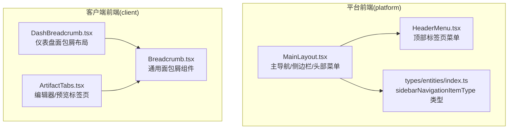
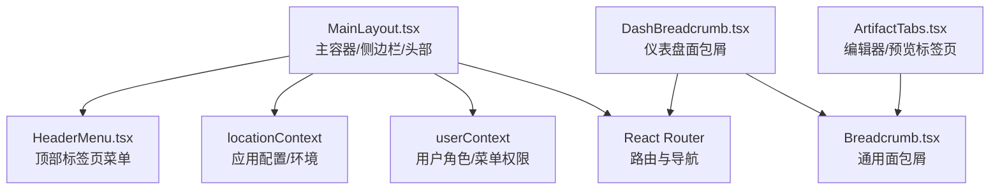
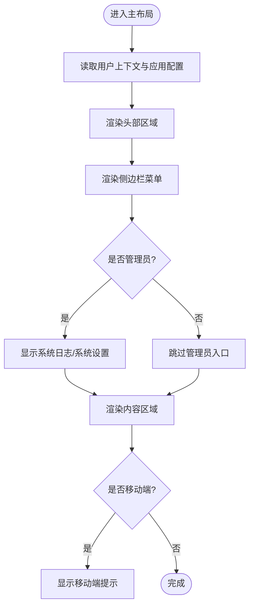
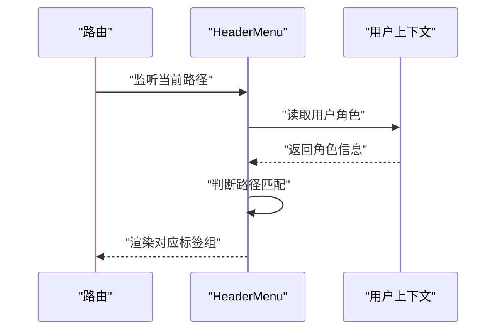
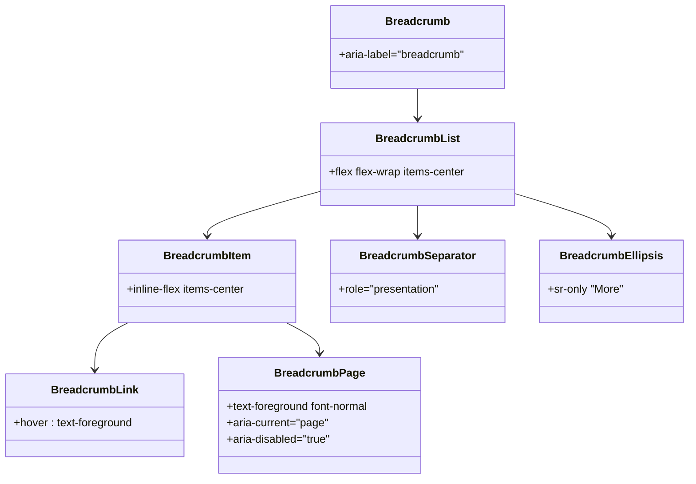
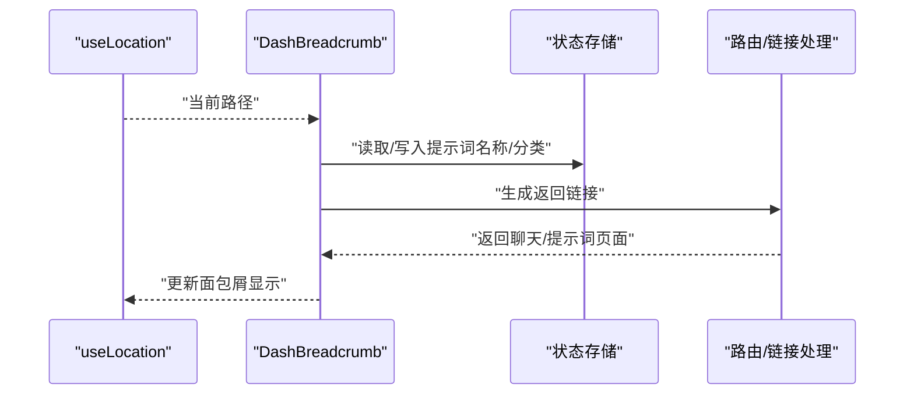
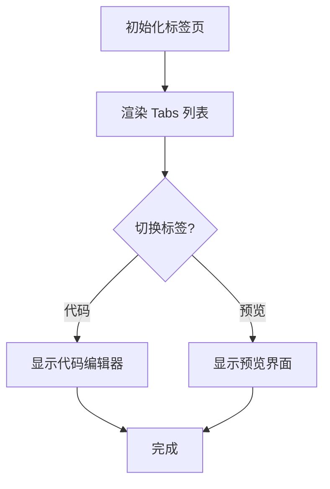
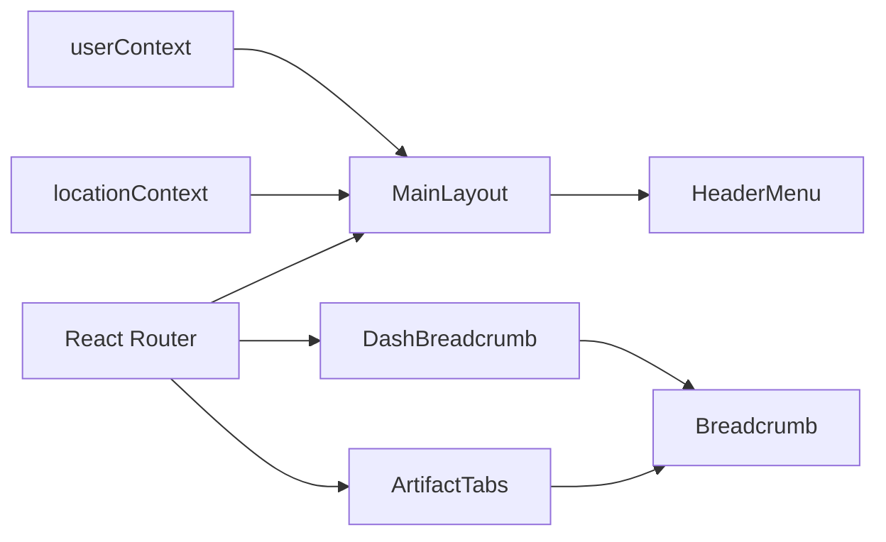

# 导航组件

<cite>
**本文引用的文件**
- [MainLayout.tsx](file://src/frontend/platform/src/layout/MainLayout.tsx)
- [HeaderMenu.tsx](file://src/frontend/platform/src/layout/HeaderMenu.tsx)
- [Breadcrumb.tsx](file://src/frontend/client/src/components/ui/Breadcrumb.tsx)
- [DashBreadcrumb.tsx](file://src/frontend/client/src/routes/Layouts/DashBreadcrumb.tsx)
- [ArtifactTabs.tsx](file://src/frontend/client/src/components/Artifacts/ArtifactTabs.tsx)
- [index.ts（类型定义）](file://src/frontend/platform/src/types/entities/index.ts)
</cite>

## 目录
1. [简介](#简介)
2. [项目结构](#项目结构)
3. [核心组件](#核心组件)
4. [架构总览](#架构总览)
5. [详细组件分析](#详细组件分析)
6. [依赖关系分析](#依赖关系分析)
7. [性能考量](#性能考量)
8. [故障排查指南](#故障排查指南)
9. [结论](#结论)
10. [附录](#附录)

## 简介
本文件系统化梳理 Bisheng 前端导航体系，覆盖主导航、侧边栏、面包屑、标签页等导航元素的实现与集成方式；阐明导航状态管理、路由集成、响应式设计与用户权限控制；并给出可定制性、主题适配与无障碍访问支持的实践建议及最佳实践。

## 项目结构
导航相关代码主要分布在两个前端子项目中：
- 平台版前端（platform）：主导航与侧边栏由统一布局组件承载，顶部包含用户信息、语言切换、主题切换等入口。
- 客户端前端（client）：提供通用面包屑组件与基于路由的面包屑布局，以及用于编辑器/预览的标签页组件。

图表来源
- [MainLayout.tsx](file://src/frontend/platform/src/layout/MainLayout.tsx#L1-L278)
- [HeaderMenu.tsx](file://src/frontend/platform/src/layout/HeaderMenu.tsx#L1-L65)
- [Breadcrumb.tsx](file://src/frontend/client/src/components/ui/Breadcrumb.tsx#L1-L102)
- [DashBreadcrumb.tsx](file://src/frontend/client/src/routes/Layouts/DashBreadcrumb.tsx#L1-L114)
- [ArtifactTabs.tsx](file://src/frontend/client/src/components/Artifacts/ArtifactTabs.tsx#L1-L61)
- [index.ts（类型定义）](file://src/frontend/platform/src/types/entities/index.ts#L1-L6)

章节来源
- [MainLayout.tsx](file://src/frontend/platform/src/layout/MainLayout.tsx#L1-L278)
- [HeaderMenu.tsx](file://src/frontend/platform/src/layout/HeaderMenu.tsx#L1-L65)
- [Breadcrumb.tsx](file://src/frontend/client/src/components/ui/Breadcrumb.tsx#L1-L102)
- [DashBreadcrumb.tsx](file://src/frontend/client/src/routes/Layouts/DashBreadcrumb.tsx#L1-L114)
- [ArtifactTabs.tsx](file://src/frontend/client/src/components/Artifacts/ArtifactTabs.tsx#L1-L61)
- [index.ts（类型定义）](file://src/frontend/platform/src/types/entities/index.ts#L1-L6)

## 核心组件
- 主布局与侧边栏导航：在统一布局中渲染主导航与侧边栏菜单项，结合用户角色与配置动态显示。
- 顶部标签页菜单：根据当前路由路径展示“应用/工具/工作台”或“模型管理/微调”等分组标签。
- 面包屑：提供通用面包屑组件与基于路由的仪表盘面包屑布局，支持返回上一页面与跳转到指定页面。
- 标签页：用于编辑器与预览之间的切换，提升内容编辑体验。

章节来源
- [MainLayout.tsx](file://src/frontend/platform/src/layout/MainLayout.tsx#L134-L231)
- [HeaderMenu.tsx](file://src/frontend/platform/src/layout/HeaderMenu.tsx#L7-L64)
- [Breadcrumb.tsx](file://src/frontend/client/src/components/ui/Breadcrumb.tsx#L7-L101)
- [DashBreadcrumb.tsx](file://src/frontend/client/src/routes/Layouts/DashBreadcrumb.tsx#L36-L113)
- [ArtifactTabs.tsx](file://src/frontend/client/src/components/Artifacts/ArtifactTabs.tsx#L11-L60)

## 架构总览
导航体系围绕“布局容器 + 菜单/标签 + 面包屑 + 标签页”的组合展开，通过 React Router 进行路由集成，并以用户上下文与配置上下文驱动权限与主题行为。

图表来源
- [MainLayout.tsx](file://src/frontend/platform/src/layout/MainLayout.tsx#L34-L70)
- [HeaderMenu.tsx](file://src/frontend/platform/src/layout/HeaderMenu.tsx#L7-L15)
- [Breadcrumb.tsx](file://src/frontend/client/src/components/ui/Breadcrumb.tsx#L7-L101)
- [DashBreadcrumb.tsx](file://src/frontend/client/src/routes/Layouts/DashBreadcrumb.tsx#L36-L58)
- [ArtifactTabs.tsx](file://src/frontend/client/src/components/Artifacts/ArtifactTabs.tsx#L11-L23)

## 详细组件分析

### 主布局与侧边栏导航
- 功能要点
  - 头部区域：品牌 Logo、主题切换、语言选择、用户下拉菜单（含登出、重置密码、工作区跳转等）。
  - 侧边栏：按用户 web_menu 与角色动态渲染菜单项，支持管理员可见的系统日志与系统设置入口。
  - 移动端提示：在小屏设备上提示最佳体验。
- 权限控制
  - 使用用户角色与菜单白名单进行显隐控制，管理员拥有额外入口。
- 响应式设计
  - 固定侧边栏宽度与内容区域自适应，移动端遮罩层提示。
- 可定制性
  - 菜单项图标、文案与链接均可通过类型定义扩展，便于业务定制。

图表来源
- [MainLayout.tsx](file://src/frontend/platform/src/layout/MainLayout.tsx#L34-L251)

章节来源
- [MainLayout.tsx](file://src/frontend/platform/src/layout/MainLayout.tsx#L34-L251)
- [index.ts（类型定义）](file://src/frontend/platform/src/types/entities/index.ts#L1-L6)

### 顶部标签页菜单
- 功能要点
  - 根据当前路由判断是否渲染“应用/工具/工作台”或“模型管理/微调”等分组标签。
  - 通过 NavLink 实现同级标签切换，保持页面内导航的一致性。
- 权限控制
  - 工作台标签仅管理员可见。
- 可定制性
  - 新增标签时，只需在对应路由分支中添加 NavLink 即可。

图表来源
- [HeaderMenu.tsx](file://src/frontend/platform/src/layout/HeaderMenu.tsx#L7-L64)

章节来源
- [HeaderMenu.tsx](file://src/frontend/platform/src/layout/HeaderMenu.tsx#L7-L64)

### 面包屑（通用组件）
- 组件构成
  - 容器、列表、条目、链接、当前页、分隔符、省略号等原子组件。
- 无障碍支持
  - 使用语义化 nav 与 aria-label 标注，当前页使用 aria-current 与 aria-disabled。
- 可定制性
  - 支持自定义分隔符与样式类名，便于主题适配。

图表来源
- [Breadcrumb.tsx](file://src/frontend/client/src/components/ui/Breadcrumb.tsx#L7-L101)

章节来源
- [Breadcrumb.tsx](file://src/frontend/client/src/components/ui/Breadcrumb.tsx#L7-L101)

### 仪表盘面包屑布局
- 功能要点
  - 基于通用面包屑组件，提供“返回聊天”“跳转到提示词”等快捷入口。
  - 结合历史位置与对话 ID，生成返回链接。
  - 支持管理员设置与高级开关等扩展控件。
- 路由集成
  - 通过 useLocation 与自定义链接处理函数实现无刷新跳转。

图表来源
- [DashBreadcrumb.tsx](file://src/frontend/client/src/routes/Layouts/DashBreadcrumb.tsx#L36-L113)

章节来源
- [DashBreadcrumb.tsx](file://src/frontend/client/src/routes/Layouts/DashBreadcrumb.tsx#L36-L113)

### 编辑器/预览标签页
- 功能要点
  - 使用 Radix UI Tabs 在“代码”和“预览”之间切换。
  - 预览模式支持主题适配（如深色背景）。
- 可定制性
  - 可扩展更多标签页内容（如“图表”“导出”等），通过 Tabs.Content 扩展。

图表来源
- [ArtifactTabs.tsx](file://src/frontend/client/src/components/Artifacts/ArtifactTabs.tsx#L11-L60)

章节来源
- [ArtifactTabs.tsx](file://src/frontend/client/src/components/Artifacts/ArtifactTabs.tsx#L11-L60)

## 依赖关系分析
- 组件耦合
  - 主布局依赖用户上下文与应用配置上下文，确保菜单与主题逻辑集中管理。
  - 顶部标签页菜单依赖当前路由路径，避免硬编码。
  - 面包屑组件与布局解耦，通过通用组件复用。
- 外部依赖
  - React Router：路由与导航。
  - Radix UI：标签页与可访问性基础组件。
  - Lucide：图标库。
  - i18n：国际化文案。

图表来源
- [MainLayout.tsx](file://src/frontend/platform/src/layout/MainLayout.tsx#L34-L70)
- [HeaderMenu.tsx](file://src/frontend/platform/src/layout/HeaderMenu.tsx#L7-L15)
- [DashBreadcrumb.tsx](file://src/frontend/client/src/routes/Layouts/DashBreadcrumb.tsx#L36-L58)
- [ArtifactTabs.tsx](file://src/frontend/client/src/components/Artifacts/ArtifactTabs.tsx#L11-L23)

章节来源
- [MainLayout.tsx](file://src/frontend/platform/src/layout/MainLayout.tsx#L34-L70)
- [HeaderMenu.tsx](file://src/frontend/platform/src/layout/HeaderMenu.tsx#L7-L15)
- [DashBreadcrumb.tsx](file://src/frontend/client/src/routes/Layouts/DashBreadcrumb.tsx#L36-L58)
- [ArtifactTabs.tsx](file://src/frontend/client/src/components/Artifacts/ArtifactTabs.tsx#L11-L23)

## 性能考量
- 渲染优化
  - 使用 useMemo 缓存权限判断结果，减少不必要的重渲染。
  - 侧边栏菜单按条件渲染，避免冗余节点。
- 懒加载与骨架
  - 内容区域使用 Suspense 与加载图标，改善首屏与异步切换体验。
- 路由与标签页
  - 标签页切换采用客户端路由，避免整页刷新。

章节来源
- [MainLayout.tsx](file://src/frontend/platform/src/layout/MainLayout.tsx#L64-L70)
- [MainLayout.tsx](file://src/frontend/platform/src/layout/MainLayout.tsx#L227-L229)

## 故障排查指南
- 侧边栏菜单不显示
  - 检查用户上下文中 web_menu 是否包含对应菜单标识；确认角色是否满足管理员条件。
- 顶部标签页不出现
  - 确认当前路由路径是否命中标签页菜单的分支判断。
- 面包屑不跳转
  - 检查 DashBreadcrumb 中链接生成逻辑与状态存储是否正确。
- 移动端显示异常
  - 确认移动端遮罩层逻辑与断点设置是否符合预期。

章节来源
- [MainLayout.tsx](file://src/frontend/platform/src/layout/MainLayout.tsx#L134-L251)
- [HeaderMenu.tsx](file://src/frontend/platform/src/layout/HeaderMenu.tsx#L17-L61)
- [DashBreadcrumb.tsx](file://src/frontend/client/src/routes/Layouts/DashBreadcrumb.tsx#L47-L58)

## 结论
Bisheng 的导航体系以统一布局为核心，结合用户上下文与路由能力，实现了灵活的菜单渲染、顶部标签页与面包屑导航，并通过标签页提升编辑体验。整体设计具备良好的可扩展性与可维护性，建议在新增导航功能时遵循现有模式，确保权限、主题与无障碍一致落地。

## 附录
- 最佳实践
  - 权限控制：所有菜单入口均应基于用户角色与菜单白名单进行判定。
  - 主题适配：统一使用上下文切换主题，确保图标与文字在深浅色模式下清晰可辨。
  - 无障碍：为导航元素提供语义化标签与键盘可达性，面包屑使用 aria-current 标记当前页。
  - 可定制：通过类型定义与配置上下文扩展菜单项，避免硬编码。