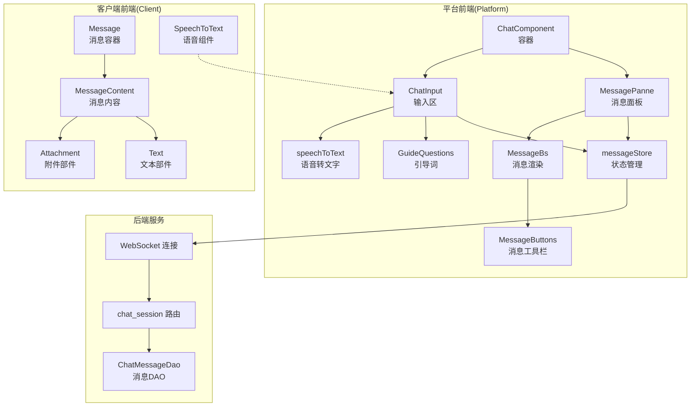
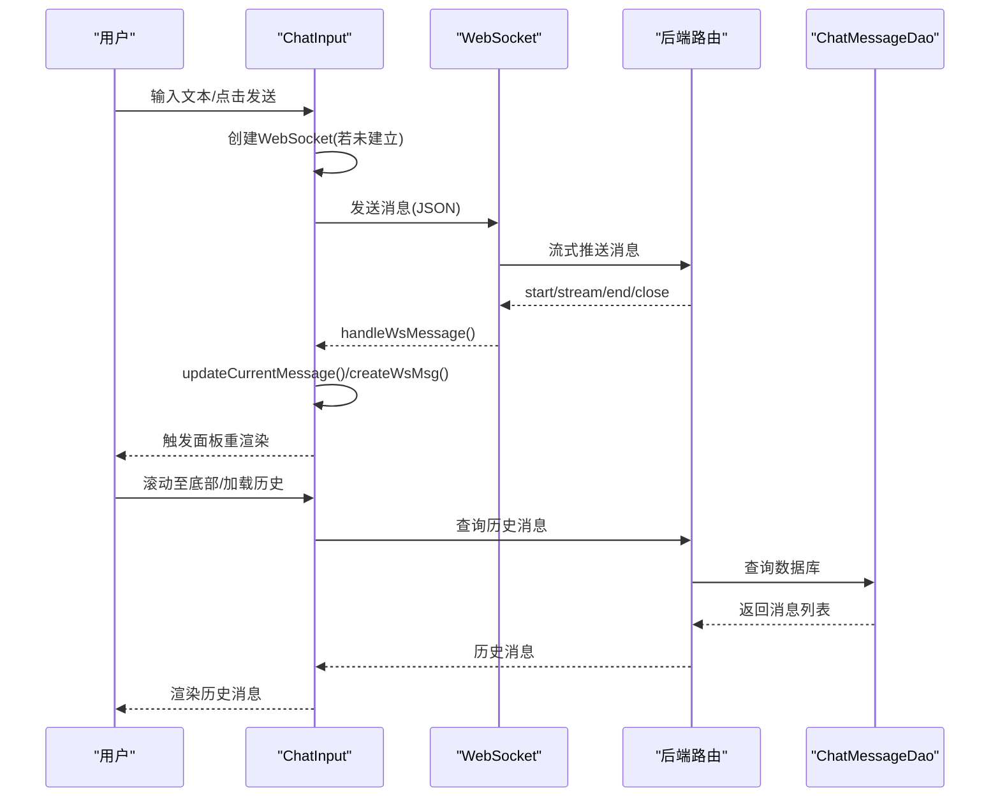
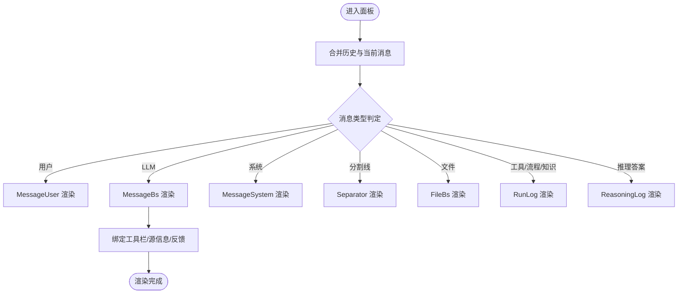
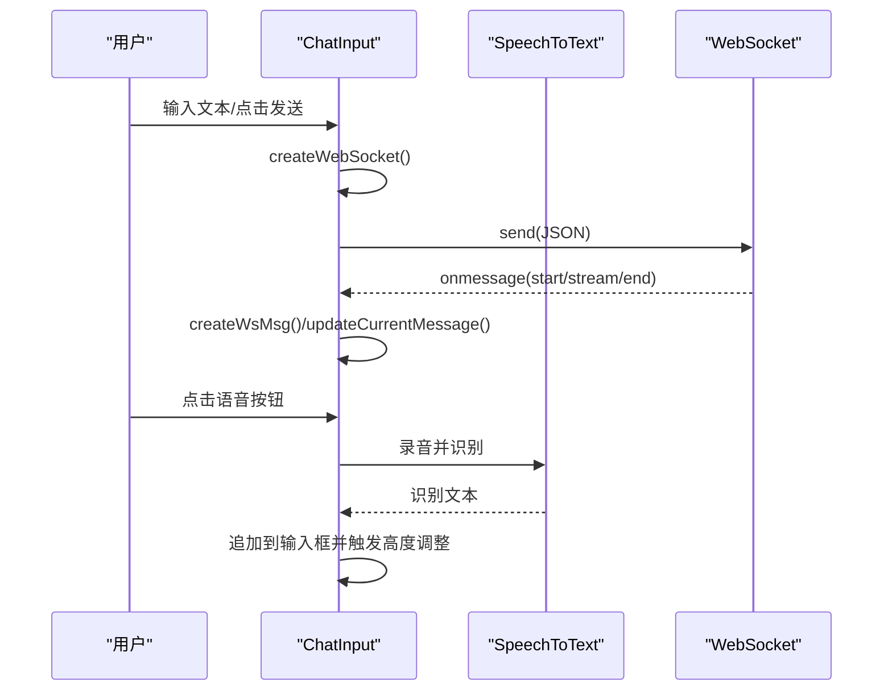
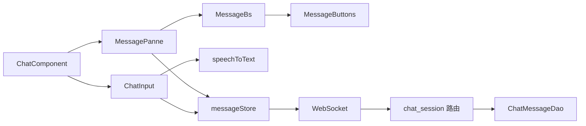

# 聊天界面组件

<cite>
**本文档引用的文件**
- [ChatComponent/index.tsx](file://src/frontend/platform/src/components/bs-comp/chatComponent/index.tsx)
- [MessagePanne.tsx](file://src/frontend/platform/src/components/bs-comp/chatComponent/MessagePanne.tsx)
- [ChatInput.tsx](file://src/frontend/platform/src/components/bs-comp/chatComponent/ChatInput.tsx)
- [messageStore.ts](file://src/frontend/platform/src/components/bs-comp/chatComponent/messageStore.ts)
- [MessageBs.tsx](file://src/frontend/platform/src/components/bs-comp/chatComponent/MessageBs.tsx)
- [MessageButtons.tsx](file://src/frontend/platform/src/components/bs-comp/chatComponent/MessageButtons.tsx)
- [GuideQuestions.tsx](file://src/frontend/platform/src/components/bs-comp/chatComponent/GuideQuestions.tsx)
- [speechToText.tsx](file://src/frontend/platform/src/components/voiceFunction/speechToText.tsx)
- [useWebsocket.ts](file://src/frontend/client/src/pages/appChat/useWebsocket.ts)
- [Message.tsx](file://src/frontend/client/src/components/Chat/Messages/Message.tsx)
- [MessageContent.tsx](file://src/frontend/client/src/components/Chat/Messages/Content/MessageContent.tsx)
- [Text.tsx](file://src/frontend/client/src/components/Chat/Messages/Content/Parts/Text.tsx)
- [Attachment.tsx](file://src/frontend/client/src/components/Chat/Messages/Content/Parts/Attachment.tsx)
- [SpeechToText.tsx](file://src/frontend/client/src/components/Voice/SpeechToText.tsx)
- [useAttachmentHandler.ts](file://src/frontend/client/src/hooks/SSE/useAttachmentHandler.ts)
- [router.py](file://src/backend/bisheng/chat_session/api/router.py)
- [workstation.py](file://src/backend/bisheng/api/v1/workstation.py)
- [message.py](file://src/backend/bisheng/database/models/message.py)
</cite>

## 目录
1. [简介](#简介)
2. [项目结构](#项目结构)
3. [核心组件](#核心组件)
4. [架构总览](#架构总览)
5. [详细组件分析](#详细组件分析)
6. [依赖关系分析](#依赖关系分析)
7. [性能考量](#性能考量)
8. [故障排查指南](#故障排查指南)
9. [结论](#结论)
10. [附录](#附录)

## 简介
本文件面向 Bisheng 聊天界面组件，系统性梳理聊天视图、消息显示、输入区域、工具栏等模块的实现与交互。重点覆盖消息渲染、实时更新、文件上传、语音输入等能力的组件化设计，以及状态管理、事件处理与用户交互模式。同时提供聊天体验优化与性能调优的实践建议。

## 项目结构
前端采用分层组件组织：页面容器负责布局与生命周期，消息面板负责消息渲染与滚动控制，输入区负责文本/语音/表单交互，消息存储负责状态与数据流，工具栏与按钮负责交互增强。

图表来源
- [ChatComponent/index.tsx](file://src/frontend/platform/src/components/bs-comp/chatComponent/index.tsx#L1-L26)
- [MessagePanne.tsx](file://src/frontend/platform/src/components/bs-comp/chatComponent/MessagePanne.tsx#L1-L165)
- [ChatInput.tsx](file://src/frontend/platform/src/components/bs-comp/chatComponent/ChatInput.tsx#L1-L394)
- [messageStore.ts](file://src/frontend/platform/src/components/bs-comp/chatComponent/messageStore.ts#L1-L343)
- [GuideQuestions.tsx](file://src/frontend/platform/src/components/bs-comp/chatComponent/GuideQuestions.tsx#L1-L50)
- [MessageBs.tsx](file://src/frontend/platform/src/components/bs-comp/chatComponent/MessageBs.tsx#L1-L158)
- [MessageButtons.tsx](file://src/frontend/platform/src/components/bs-comp/chatComponent/MessageButtons.tsx#L1-L78)
- [speechToText.tsx](file://src/frontend/platform/src/components/voiceFunction/speechToText.tsx#L1-L38)
- [Message.tsx](file://src/frontend/client/src/components/Chat/Messages/Message.tsx#L1-L49)
- [MessageContent.tsx](file://src/frontend/client/src/components/Chat/Messages/Content/MessageContent.tsx#L73-L113)
- [Text.tsx](file://src/frontend/client/src/components/Chat/Messages/Content/Parts/Text.tsx#L1-L57)
- [Attachment.tsx](file://src/frontend/client/src/components/Chat/Messages/Content/Parts/Attachment.tsx#L1-L19)
- [SpeechToText.tsx](file://src/frontend/client/src/components/Voice/SpeechToText.tsx#L1-L185)
- [useWebsocket.ts](file://src/frontend/client/src/pages/appChat/useWebsocket.ts#L33-L50)
- [router.py](file://src/backend/bisheng/chat_session/api/router.py#L32-L40)
- [workstation.py](file://src/backend/bisheng/api/v1/workstation.py#L267-L282)
- [message.py](file://src/backend/bisheng/database/models/message.py#L143-L166)

章节来源
- [ChatComponent/index.tsx](file://src/frontend/platform/src/components/bs-comp/chatComponent/index.tsx#L1-L26)
- [MessagePanne.tsx](file://src/frontend/platform/src/components/bs-comp/chatComponent/MessagePanne.tsx#L1-L165)
- [ChatInput.tsx](file://src/frontend/platform/src/components/bs-comp/chatComponent/ChatInput.tsx#L1-L394)
- [messageStore.ts](file://src/frontend/platform/src/components/bs-comp/chatComponent/messageStore.ts#L1-L343)

## 核心组件
- 容器组件 ChatComponent：组合消息面板与输入区，承载全局属性与回调。
- 消息面板 MessagePanne：负责消息列表渲染、自动滚动、历史加载、消息类型分发。
- 输入区 ChatInput：负责文本输入、快捷键、引导词、表单弹出、停止生成、WebSocket 发送与接收。
- 状态管理 messageStore：统一管理会话、消息、历史、滚动与引导词显示。
- 消息渲染 MessageBs：负责 LLM 回复渲染、思考日志折叠、源信息入口、消息工具栏。
- 工具栏 MessageButtons：点赞/踩、复制、语音播放、标记问答等。
- 引导词 GuideQuestions：根据配置随机展示推荐问题。
- 语音组件 speechToText：录音转 WAV 并提交识别，将结果注入输入框。
- 客户端消息渲染链路：Message → MessageContent → Text/Attachment，支持 Markdown 渲染与图片附件。

章节来源
- [MessagePanne.tsx](file://src/frontend/platform/src/components/bs-comp/chatComponent/MessagePanne.tsx#L102-L165)
- [ChatInput.tsx](file://src/frontend/platform/src/components/bs-comp/chatComponent/ChatInput.tsx#L73-L119)
- [messageStore.ts](file://src/frontend/platform/src/components/bs-comp/chatComponent/messageStore.ts#L92-L343)
- [MessageBs.tsx](file://src/frontend/platform/src/components/bs-comp/chatComponent/MessageBs.tsx#L61-L158)
- [MessageButtons.tsx](file://src/frontend/platform/src/components/bs-comp/chatComponent/MessageButtons.tsx#L16-L78)
- [GuideQuestions.tsx](file://src/frontend/platform/src/components/bs-comp/chatComponent/GuideQuestions.tsx#L6-L49)
- [speechToText.tsx](file://src/frontend/platform/src/components/voiceFunction/speechToText.tsx#L1-L38)
- [Message.tsx](file://src/frontend/client/src/components/Chat/Messages/Message.tsx#L32-L49)
- [MessageContent.tsx](file://src/frontend/client/src/components/Chat/Messages/Content/MessageContent.tsx#L73-L113)
- [Text.tsx](file://src/frontend/client/src/components/Chat/Messages/Content/Parts/Text.tsx#L20-L57)
- [Attachment.tsx](file://src/frontend/client/src/components/Chat/Messages/Content/Parts/Attachment.tsx#L5-L19)

## 架构总览
聊天界面采用“容器-面板-输入-状态-渲染”的分层架构，通过 WebSocket 实现实时流式输出，通过 Zustand 管理前端状态，后端提供消息查询接口与 WebSocket 通道。

图表来源
- [ChatInput.tsx](file://src/frontend/platform/src/components/bs-comp/chatComponent/ChatInput.tsx#L121-L220)
- [useWebsocket.ts](file://src/frontend/client/src/pages/appChat/useWebsocket.ts#L33-L50)
- [router.py](file://src/backend/bisheng/chat_session/api/router.py#L32-L40)
- [workstation.py](file://src/backend/bisheng/api/v1/workstation.py#L267-L282)
- [message.py](file://src/backend/bisheng/database/models/message.py#L143-L166)

## 详细组件分析

### 消息面板 MessagePanne
职责
- 统一渲染各类消息类型（用户、LLM、系统、分割线、文件、运行日志、推理日志）。
- 自动滚动至底部，节流控制滚动频率。
- 滚动到顶部触发“加载更多”历史。
- 提供“反馈”“溯源”弹窗入口。

关键点
- 通过 chatKey 选择 message 的渲染字段，兼容多模态输入。
- 对工具类/流程类消息使用 run logs 类型，避免错误闭合。
- 通过 findQa 成对查找 QA，用于标记问答。

图表来源
- [MessagePanne.tsx](file://src/frontend/platform/src/components/bs-comp/chatComponent/MessagePanne.tsx#L109-L158)
- [MessageBs.tsx](file://src/frontend/platform/src/components/bs-comp/chatComponent/MessageBs.tsx#L61-L158)

章节来源
- [MessagePanne.tsx](file://src/frontend/platform/src/components/bs-comp/chatComponent/MessagePanne.tsx#L13-L165)

### 输入区 ChatInput
职责
- 文本输入与高度自适应。
- 引导词推荐与一键发送。
- 表单弹窗（受锁状态控制）。
- 语音转文字集成。
- WebSocket 连接与消息发送、停止生成。
- 接收流式消息并更新当前消息。

交互要点
- Enter 发送（Shift+Enter 换行）。
- 锁定状态下禁用发送，支持强制弹窗发送。
- 自动滚动至底部，保证最新消息可见。
- 支持“继续”生成与“停止”生成。

图表来源
- [ChatInput.tsx](file://src/frontend/platform/src/components/bs-comp/chatComponent/ChatInput.tsx#L73-L119)
- [ChatInput.tsx](file://src/frontend/platform/src/components/bs-comp/chatComponent/ChatInput.tsx#L290-L303)
- [speechToText.tsx](file://src/frontend/platform/src/components/voiceFunction/speechToText.tsx#L1-L38)

章节来源
- [ChatInput.tsx](file://src/frontend/platform/src/components/bs-comp/chatComponent/ChatInput.tsx#L18-L394)

### 状态管理 messageStore
职责
- 维护当前会话 chatId、消息列表 messages、历史消息 hisMessages。
- 提供创建发送消息、创建 WebSocket 消息、更新当前消息、加载历史、加载更多历史、清空消息、销毁会话等动作。
- 处理 run logs 类型消息的 extra 匹配与覆盖策略。
- 历史消息过滤与去重、消息 id 补全。

复杂度与优化
- 消息更新采用深拷贝与索引定位，避免全量替换。
- 历史加载带运行中保护与 chatId 校验，防止跨会话污染。
- 通过节流控制面板滚动，减少频繁重排。

章节来源
- [messageStore.ts](file://src/frontend/platform/src/components/bs-comp/chatComponent/messageStore.ts#L92-L343)

### 消息渲染 MessageBs 与工具栏 MessageButtons
职责
- MessageBs：渲染 LLM 回复、思考日志折叠、源信息入口、消息时间、语音播放按钮。
- MessageButtons：点赞/踩、复制、语音播放、标记问答。

设计细节
- 思考日志可折叠展开，提升长推理内容可读性。
- 按需显示语音播放按钮（依据配置版本与模型）。
- 标记问答仅在特定模式下启用。

章节来源
- [MessageBs.tsx](file://src/frontend/platform/src/components/bs-comp/chatComponent/MessageBs.tsx#L61-L158)
- [MessageButtons.tsx](file://src/frontend/platform/src/components/bs-comp/chatComponent/MessageButtons.tsx#L16-L78)

### 引导词 GuideQuestions
职责
- 根据配置展示推荐问题，随机取 3 条。
- 锁定时隐藏，首次进入会话时根据 questions 是否存在决定是否显示。

章节来源
- [GuideQuestions.tsx](file://src/frontend/platform/src/components/bs-comp/chatComponent/GuideQuestions.tsx#L6-L49)

### 客户端消息渲染链路
职责
- Message：消息容器与滚动处理。
- MessageContent：根据消息来源选择 Markdown 或纯文本渲染。
- Text：文本部件，支持用户消息 Markdown 开关。
- Attachment：图片附件渲染。

章节来源
- [Message.tsx](file://src/frontend/client/src/components/Chat/Messages/Message.tsx#L32-L49)
- [MessageContent.tsx](file://src/frontend/client/src/components/Chat/Messages/Content/MessageContent.tsx#L73-L113)
- [Text.tsx](file://src/frontend/client/src/components/Chat/Messages/Content/Parts/Text.tsx#L20-L57)
- [Attachment.tsx](file://src/frontend/client/src/components/Chat/Messages/Content/Parts/Attachment.tsx#L5-L19)

### 语音输入组件
职责
- 录音转 WAV 并提交识别，将识别结果注入输入框。
- 支持多声道转单声道降噪。
- 与输入区联动，受输入锁定状态控制。

章节来源
- [speechToText.tsx](file://src/frontend/platform/src/components/voiceFunction/speechToText.tsx#L1-L38)
- [SpeechToText.tsx](file://src/frontend/client/src/components/Voice/SpeechToText.tsx#L1-L185)

## 依赖关系分析
- 组件耦合
  - ChatComponent 作为容器，依赖 MessagePanne 与 ChatInput。
  - ChatInput 依赖 messageStore 与 WebSocket，间接依赖后端路由。
  - MessagePanne 依赖 messageStore 与多种消息子组件。
  - 客户端渲染链路与后端消息格式解耦，通过统一的数据结构驱动。
- 外部依赖
  - WebSocket 用于实时消息流。
  - 后端接口提供历史消息查询与 WebSocket 地址。
  - 数据库 DAO 提供消息查询能力。

图表来源
- [ChatComponent/index.tsx](file://src/frontend/platform/src/components/bs-comp/chatComponent/index.tsx#L1-L26)
- [ChatInput.tsx](file://src/frontend/platform/src/components/bs-comp/chatComponent/ChatInput.tsx#L121-L220)
- [messageStore.ts](file://src/frontend/platform/src/components/bs-comp/chatComponent/messageStore.ts#L92-L139)
- [router.py](file://src/backend/bisheng/chat_session/api/router.py#L32-L40)
- [message.py](file://src/backend/bisheng/database/models/message.py#L143-L166)

章节来源
- [ChatComponent/index.tsx](file://src/frontend/platform/src/components/bs-comp/chatComponent/index.tsx#L1-L26)
- [ChatInput.tsx](file://src/frontend/platform/src/components/bs-comp/chatComponent/ChatInput.tsx#L121-L220)
- [messageStore.ts](file://src/frontend/platform/src/components/bs-comp/chatComponent/messageStore.ts#L92-L139)
- [router.py](file://src/backend/bisheng/chat_session/api/router.py#L32-L40)

## 性能考量
- 滚动节流：面板滚动采用节流控制，避免高频重绘。
- 消息更新：使用索引定位与深拷贝，减少不必要的重渲染。
- 历史加载：运行中禁止加载更多，避免并发冲突；chatId 校验防止跨会话污染。
- WebSocket：单例连接，失败时避免重复创建；错误与关闭事件统一处理。
- 图片渲染：附件渲染前进行尺寸与类型校验，避免无效渲染。
- 语音识别：录音转 WAV 降噪，减少识别失败带来的交互成本。

## 故障排查指南
常见问题与定位
- WebSocket 连接失败
  - 检查协议与 host 生成逻辑，确认 https/ws 映射正确。
  - 查看 onerror/onclose 回调中的错误码与原因。
- 消息重复或错位
  - 检查 run logs 的 extra 匹配与覆盖策略。
  - 确认 end/end_cover 类型的消息闭合逻辑。
- 历史消息缺失
  - 确认历史加载接口返回的 chat_id 与当前会话一致。
  - 检查历史结束标志与加载锁状态。
- 语音识别无响应
  - 确认录音权限与浏览器兼容性。
  - 检查识别接口返回与错误提示。

章节来源
- [ChatInput.tsx](file://src/frontend/platform/src/components/bs-comp/chatComponent/ChatInput.tsx#L121-L220)
- [messageStore.ts](file://src/frontend/platform/src/components/bs-comp/chatComponent/messageStore.ts#L186-L291)
- [router.py](file://src/backend/bisheng/chat_session/api/router.py#L32-L40)

## 结论
该聊天界面组件通过清晰的分层与职责划分，实现了稳定的消息渲染、实时更新与丰富的交互能力。状态管理与 WebSocket 流水线确保了高并发下的可靠性，客户端渲染链路提供了良好的可扩展性。后续可在消息去重、滚动性能与语音识别稳定性方面持续优化。

## 附录
- 后端消息查询接口
  - 获取会话消息：GET /api/v1/chat_session/chat/messages/{conversationId}
  - 获取工作站消息：GET /api/v1/workstation/messages/{conversationId}
- 数据模型
  - ChatMessageDao 提供异步/同步查询最新消息与按会话查询消息的能力。

章节来源
- [router.py](file://src/backend/bisheng/chat_session/api/router.py#L32-L40)
- [workstation.py](file://src/backend/bisheng/api/v1/workstation.py#L267-L282)
- [message.py](file://src/backend/bisheng/database/models/message.py#L143-L166)