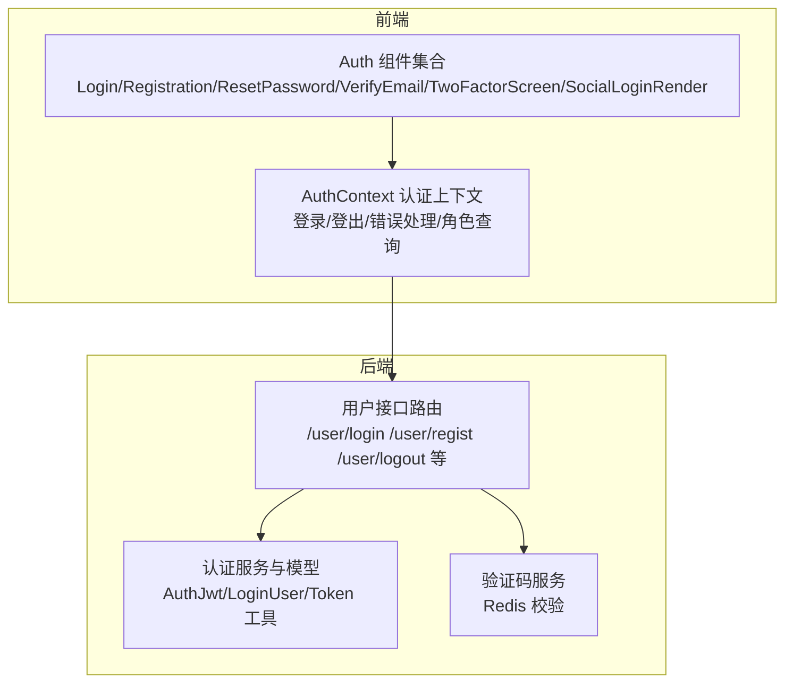
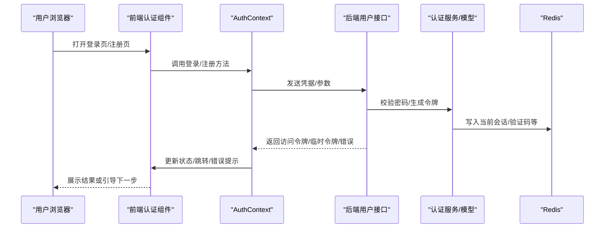
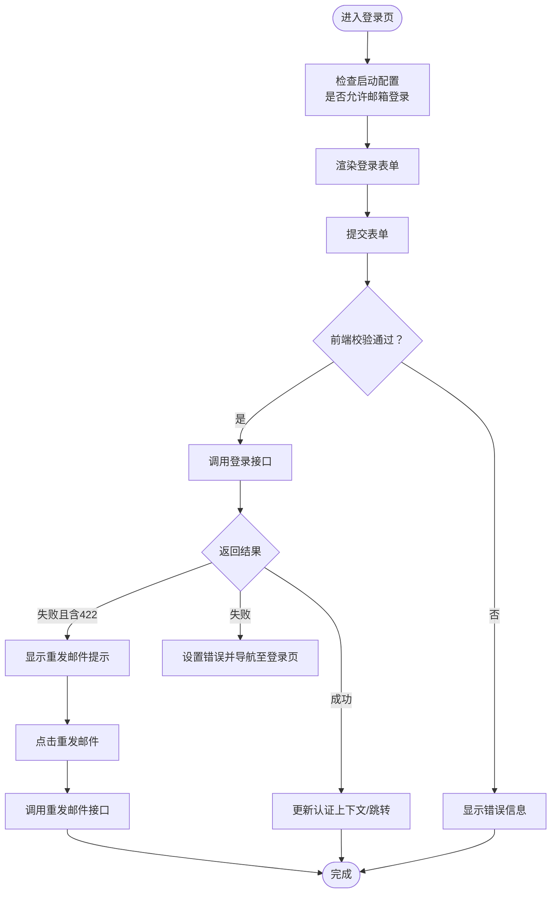
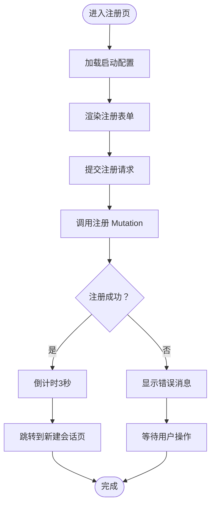
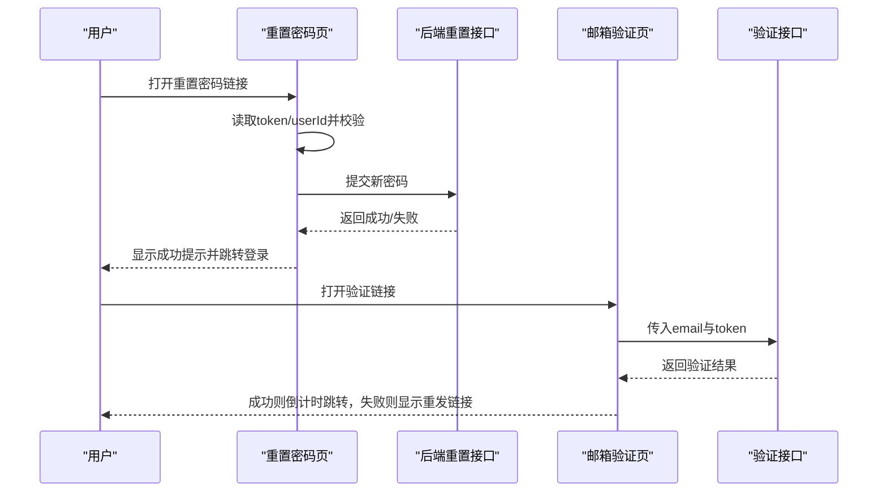
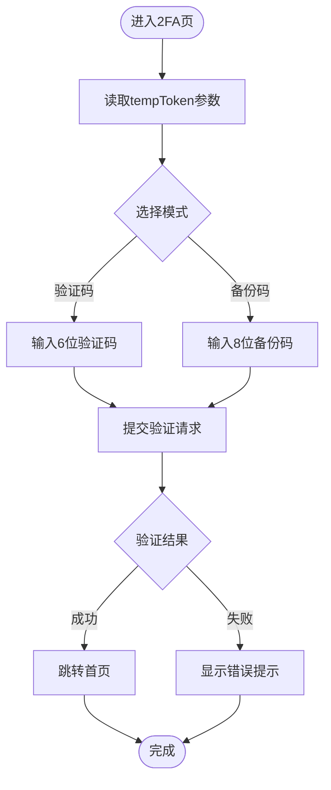
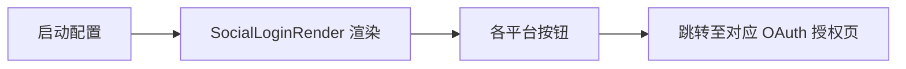
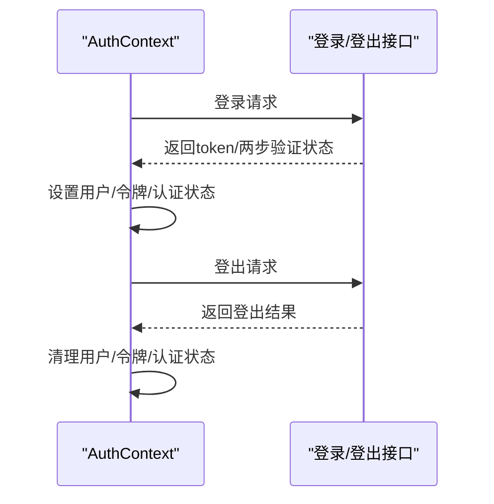
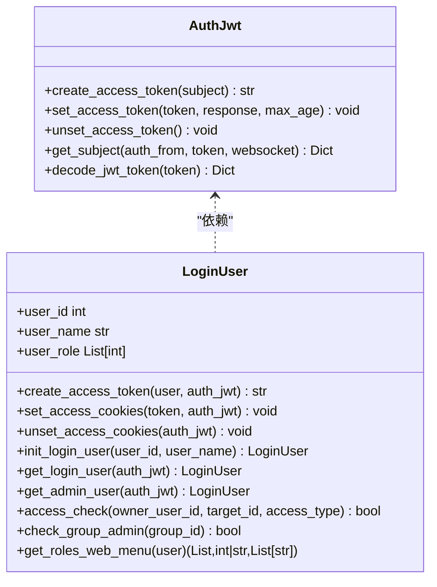
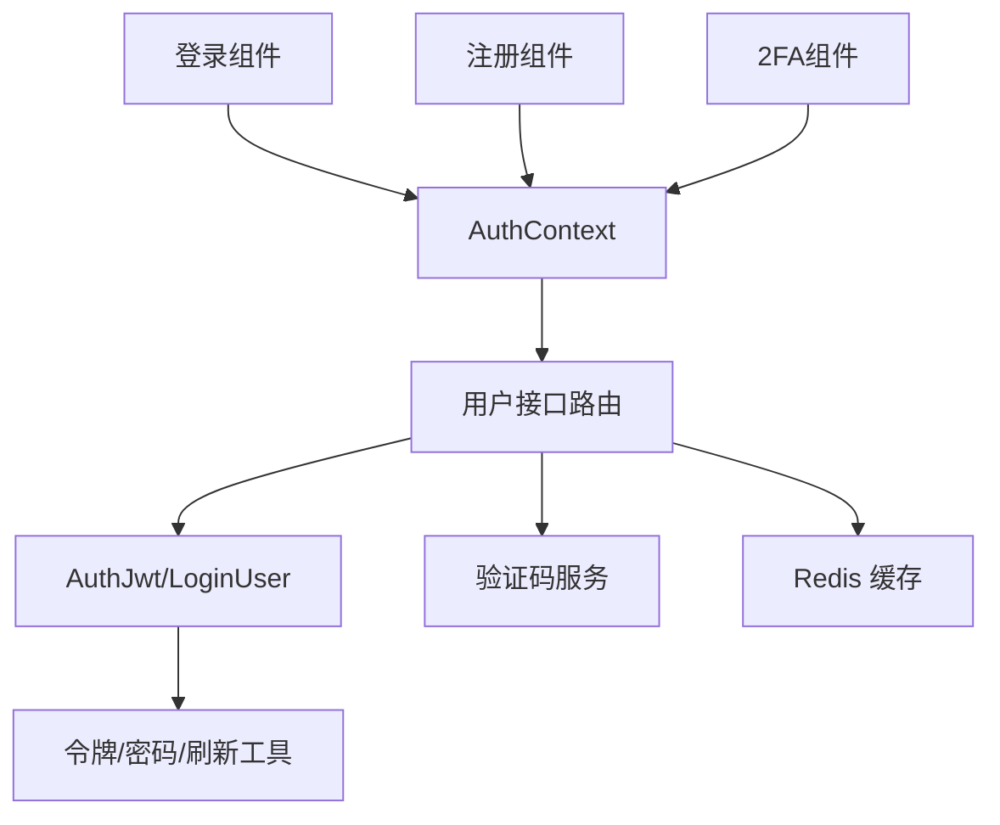

# 认证组件

<cite>
**本文引用的文件**
- [src/frontend/client/src/components/Auth/index.ts](file://src/frontend/client/src/components/Auth/index.ts)
- [src/frontend/client/src/components/Auth/Login.tsx](file://src/frontend/client/src/components/Auth/Login.tsx)
- [src/frontend/client/src/components/Auth/LoginForm.tsx](file://src/frontend/client/src/components/Auth/LoginForm.tsx)
- [src/frontend/client/src/components/Auth/Registration.tsx](file://src/frontend/client/src/components/Auth/Registration.tsx)
- [src/frontend/client/src/components/Auth/ResetPassword.tsx](file://src/frontend/client/src/components/Auth/ResetPassword.tsx)
- [src/frontend/client/src/components/Auth/VerifyEmail.tsx](file://src/frontend/client/src/components/Auth/VerifyEmail.tsx)
- [src/frontend/client/src/components/Auth/TwoFactorScreen.tsx](file://src/frontend/client/src/components/Auth/TwoFactorScreen.tsx)
- [src/frontend/client/src/components/Auth/SocialLoginRender.tsx](file://src/frontend/client/src/components/Auth/SocialLoginRender.tsx)
- [src/frontend/client/src/hooks/AuthContext.tsx](file://src/frontend/client/src/hooks/AuthContext.tsx)
- [src/backend/bisheng/user/api/user.py](file://src/backend/bisheng/user/api/user.py)
- [src/backend/bisheng/user/domain/services/auth.py](file://src/backend/bisheng/user/domain/services/auth.py)
- [src/backend/bisheng/services/auth/utils.py](file://src/backend/bisheng/services/auth/utils.py)
- [src/backend/bisheng/user/domain/services/captcha.py](file://src/backend/bisheng/user/domain/services/captcha.py)
</cite>

## 目录
1. [简介](#简介)
2. [项目结构](#项目结构)
3. [核心组件](#核心组件)
4. [架构总览](#架构总览)
5. [详细组件分析](#详细组件分析)
6. [依赖关系分析](#依赖关系分析)
7. [性能考量](#性能考量)
8. [故障排查指南](#故障排查指南)
9. [结论](#结论)
10. [附录](#附录)

## 简介
本文件系统性梳理 Bisheng 的认证组件，覆盖登录表单、注册页面、密码重置、邮箱验证、社交登录与两步验证（2FA）等全流程。文档从前端组件到后端服务与安全策略进行分层解析，并提供流程图、类图与序列图帮助理解实现细节；同时给出优化建议与安全加固实践，便于开发者快速上手与持续演进。

## 项目结构
认证相关代码主要分布在前端组件与后端服务两大侧：
- 前端：认证页面组件、表单校验、错误提示、社交登录渲染、两步验证界面、认证上下文与状态管理。
- 后端：用户接口路由、登录/注册/密码变更/登出、JWT 签发与校验、Cookie 配置、验证码校验、刷新令牌等。

图表来源
- [src/frontend/client/src/components/Auth/index.ts](file://src/frontend/client/src/components/Auth/index.ts#L1-L7)
- [src/frontend/client/src/hooks/AuthContext.tsx](file://src/frontend/client/src/hooks/AuthContext.tsx#L1-L227)
- [src/backend/bisheng/user/api/user.py](file://src/backend/bisheng/user/api/user.py#L1-L712)
- [src/backend/bisheng/user/domain/services/auth.py](file://src/backend/bisheng/user/domain/services/auth.py#L1-L338)
- [src/backend/bisheng/services/auth/utils.py](file://src/backend/bisheng/services/auth/utils.py#L1-L332)
- [src/backend/bisheng/user/domain/services/captcha.py](file://src/backend/bisheng/user/domain/services/captcha.py#L1-L12)

章节来源
- [src/frontend/client/src/components/Auth/index.ts](file://src/frontend/client/src/components/Auth/index.ts#L1-L7)
- [src/frontend/client/src/hooks/AuthContext.tsx](file://src/frontend/client/src/hooks/AuthContext.tsx#L1-L227)
- [src/backend/bisheng/user/api/user.py](file://src/backend/bisheng/user/api/user.py#L1-L712)

## 核心组件
- 登录页与登录表单：负责邮箱/用户名与密码输入、表单校验、重试与重发邮件提示。
- 注册页：表单字段校验、提交、成功倒计时跳转、错误消息展示。
- 密码重置：接收 token 与 userId 参数，校验并更新密码。
- 邮箱验证：自动触发验证、失败时显示重发链接、成功后倒计时跳转。
- 两步验证：支持 6 位数字验证码与 8 位备份码切换。
- 社交登录：按配置启用 Google/Facebook/GitHub/Discord/OpenID 等。
- 认证上下文：统一处理登录/登出、错误设置、静默刷新、用户信息与角色查询。

章节来源
- [src/frontend/client/src/components/Auth/Login.tsx](file://src/frontend/client/src/components/Auth/Login.tsx#L1-L42)
- [src/frontend/client/src/components/Auth/LoginForm.tsx](file://src/frontend/client/src/components/Auth/LoginForm.tsx#L1-L181)
- [src/frontend/client/src/components/Auth/Registration.tsx](file://src/frontend/client/src/components/Auth/Registration.tsx#L1-L215)
- [src/frontend/client/src/components/Auth/ResetPassword.tsx](file://src/frontend/client/src/components/Auth/ResetPassword.tsx#L1-L181)
- [src/frontend/client/src/components/Auth/VerifyEmail.tsx](file://src/frontend/client/src/components/Auth/VerifyEmail.tsx#L1-L127)
- [src/frontend/client/src/components/Auth/TwoFactorScreen.tsx](file://src/frontend/client/src/components/Auth/TwoFactorScreen.tsx#L1-L177)
- [src/frontend/client/src/components/Auth/SocialLoginRender.tsx](file://src/frontend/client/src/components/Auth/SocialLoginRender.tsx#L1-L117)
- [src/frontend/client/src/hooks/AuthContext.tsx](file://src/frontend/client/src/hooks/AuthContext.tsx#L1-L227)

## 架构总览
前后端认证交互遵循“前端表单 → 后端接口 → 会话/令牌 → 前端上下文”的闭环，配合 Cookie/JWT、Redis 缓存与可选验证码增强安全性。

图表来源
- [src/frontend/client/src/hooks/AuthContext.tsx](file://src/frontend/client/src/hooks/AuthContext.tsx#L76-L120)
- [src/backend/bisheng/user/api/user.py](file://src/backend/bisheng/user/api/user.py#L107-L109)
- [src/backend/bisheng/user/domain/services/auth.py](file://src/backend/bisheng/user/domain/services/auth.py#L24-L93)
- [src/backend/bisheng/services/auth/utils.py](file://src/backend/bisheng/services/auth/utils.py#L238-L261)

## 详细组件分析

### 登录组件与表单校验
- 登录页根据启动配置决定是否显示邮箱登录入口与注册入口。
- 登录表单使用受控组件与表单库进行实时校验，包含邮箱/用户名、密码长度与格式约束。
- 当出现未验证邮箱错误时，提供“重发验证邮件”按钮，调用后端接口重新发送。

图表来源
- [src/frontend/client/src/components/Auth/Login.tsx](file://src/frontend/client/src/components/Auth/Login.tsx#L9-L39)
- [src/frontend/client/src/components/Auth/LoginForm.tsx](file://src/frontend/client/src/components/Auth/LoginForm.tsx#L15-L181)
- [src/frontend/client/src/hooks/AuthContext.tsx](file://src/frontend/client/src/hooks/AuthContext.tsx#L76-L92)

章节来源
- [src/frontend/client/src/components/Auth/Login.tsx](file://src/frontend/client/src/components/Auth/Login.tsx#L1-L42)
- [src/frontend/client/src/components/Auth/LoginForm.tsx](file://src/frontend/client/src/components/Auth/LoginForm.tsx#L1-L181)
- [src/frontend/client/src/hooks/AuthContext.tsx](file://src/frontend/client/src/hooks/AuthContext.tsx#L76-L120)

### 注册组件与邮箱验证
- 注册表单包含姓名、用户名、邮箱、密码与确认密码，采用实时校验与提交时二次校验。
- 提交成功后进入倒计时页面，随后自动跳转新建会话页。
- 若开启邮箱验证，注册后会提示邮箱验证并提供倒计时跳转；失败时可重发邮件。

图表来源
- [src/frontend/client/src/components/Auth/Registration.tsx](file://src/frontend/client/src/components/Auth/Registration.tsx#L11-L215)
- [src/frontend/client/src/components/Auth/VerifyEmail.tsx](file://src/frontend/client/src/components/Auth/VerifyEmail.tsx#L34-L78)

章节来源
- [src/frontend/client/src/components/Auth/Registration.tsx](file://src/frontend/client/src/components/Auth/Registration.tsx#L1-L215)
- [src/frontend/client/src/components/Auth/VerifyEmail.tsx](file://src/frontend/client/src/components/Auth/VerifyEmail.tsx#L1-L127)

### 密码重置与邮箱验证
- 密码重置页从 URL 查询参数读取 token 与 userId，进行表单校验后提交。
- 成功后提示用户使用新密码登录，并提供跳转按钮。
- 邮箱验证页根据 token 与 email 自动触发验证，失败时显示重发链接，成功后倒计时跳转。

图表来源
- [src/frontend/client/src/components/Auth/ResetPassword.tsx](file://src/frontend/client/src/components/Auth/ResetPassword.tsx#L9-L52)
- [src/frontend/client/src/components/Auth/VerifyEmail.tsx](file://src/frontend/client/src/components/Auth/VerifyEmail.tsx#L34-L78)
- [src/backend/bisheng/user/api/user.py](file://src/backend/bisheng/user/api/user.py#L589-L626)

章节来源
- [src/frontend/client/src/components/Auth/ResetPassword.tsx](file://src/frontend/client/src/components/Auth/ResetPassword.tsx#L1-L181)
- [src/frontend/client/src/components/Auth/VerifyEmail.tsx](file://src/frontend/client/src/components/Auth/VerifyEmail.tsx#L1-L127)
- [src/backend/bisheng/user/api/user.py](file://src/backend/bisheng/user/api/user.py#L589-L626)

### 两步验证（2FA）
- 两步验证页支持两种模式：6 位数字验证码与 8 位备份码互切。
- 支持提交后根据结果决定是否跳转首页或显示错误提示。
- 备份码可在账户设置中生成、下载与禁用。

图表来源
- [src/frontend/client/src/components/Auth/TwoFactorScreen.tsx](file://src/frontend/client/src/components/Auth/TwoFactorScreen.tsx#L21-L75)
- [src/frontend/client/src/components/Auth/TwoFactorScreen.tsx](file://src/frontend/client/src/components/Auth/TwoFactorScreen.tsx#L144-L176)

章节来源
- [src/frontend/client/src/components/Auth/TwoFactorScreen.tsx](file://src/frontend/client/src/components/Auth/TwoFactorScreen.tsx#L1-L177)

### 社交登录与配置
- 按启动配置动态渲染社交登录按钮，支持 Google、Facebook、GitHub、Discord、Apple、OpenID 等。
- 渲染逻辑根据启用开关与自定义参数（如图标、标签、OAuth 路径）组装。

图表来源
- [src/frontend/client/src/components/Auth/SocialLoginRender.tsx](file://src/frontend/client/src/components/Auth/SocialLoginRender.tsx#L9-L117)

章节来源
- [src/frontend/client/src/components/Auth/SocialLoginRender.tsx](file://src/frontend/client/src/components/Auth/SocialLoginRender.tsx#L1-L117)

### 认证上下文与状态管理
- AuthContext 统一管理用户、令牌、认证状态与错误。
- 登录成功后根据返回数据决定是否进入 2FA 流程或直接设置上下文。
- 错误发生时设置错误消息并导航回登录页；登出时清理上下文并重定向。

图表来源
- [src/frontend/client/src/hooks/AuthContext.tsx](file://src/frontend/client/src/hooks/AuthContext.tsx#L76-L120)
- [src/frontend/client/src/hooks/AuthContext.tsx](file://src/frontend/client/src/hooks/AuthContext.tsx#L93-L111)

章节来源
- [src/frontend/client/src/hooks/AuthContext.tsx](file://src/frontend/client/src/hooks/AuthContext.tsx#L1-L227)

### 后端认证服务与安全策略
- 用户接口：提供登录、注册、登出、信息查询、密码修改/重置等。
- 认证模型：AuthJwt 负责 JWT 签发与 Cookie 设置；LoginUser 负责权限检查与资源访问。
- 安全工具：令牌签发/解码、API Key 校验、密码哈希/校验、刷新令牌、RSA 公钥获取、验证码校验等。
- 会话与审计：登录时写入当前会话键、记录审计日志与遥测事件。

图表来源
- [src/backend/bisheng/user/domain/services/auth.py](file://src/backend/bisheng/user/domain/services/auth.py#L24-L338)

章节来源
- [src/backend/bisheng/user/api/user.py](file://src/backend/bisheng/user/api/user.py#L107-L109)
- [src/backend/bisheng/user/domain/services/auth.py](file://src/backend/bisheng/user/domain/services/auth.py#L1-L338)
- [src/backend/bisheng/services/auth/utils.py](file://src/backend/bisheng/services/auth/utils.py#L238-L286)

## 依赖关系分析
- 前端组件依赖认证上下文与数据提供器的 React Query 封装，以统一发起登录、注册、验证与 2FA 请求。
- 后端接口依赖认证服务与模型，结合 Redis 实现验证码与会话缓存，确保登录态与安全策略落地。
- 权限控制通过 LoginUser 的角色与资源访问检查贯穿接口层。

图表来源
- [src/frontend/client/src/components/Auth/Login.tsx](file://src/frontend/client/src/components/Auth/Login.tsx#L1-L42)
- [src/frontend/client/src/components/Auth/Registration.tsx](file://src/frontend/client/src/components/Auth/Registration.tsx#L1-L215)
- [src/frontend/client/src/components/Auth/TwoFactorScreen.tsx](file://src/frontend/client/src/components/Auth/TwoFactorScreen.tsx#L1-L177)
- [src/frontend/client/src/hooks/AuthContext.tsx](file://src/frontend/client/src/hooks/AuthContext.tsx#L1-L227)
- [src/backend/bisheng/user/api/user.py](file://src/backend/bisheng/user/api/user.py#L1-L712)
- [src/backend/bisheng/user/domain/services/captcha.py](file://src/backend/bisheng/user/domain/services/captcha.py#L1-L12)
- [src/backend/bisheng/services/auth/utils.py](file://src/backend/bisheng/services/auth/utils.py#L1-L332)

章节来源
- [src/frontend/client/src/components/Auth/index.ts](file://src/frontend/client/src/components/Auth/index.ts#L1-L7)
- [src/backend/bisheng/user/api/user.py](file://src/backend/bisheng/user/api/user.py#L1-L712)

## 性能考量
- 表单校验：前端采用受控组件与按需校验，减少不必要的重渲染；注册页在提交前进行字段长度与格式校验，降低无效请求。
- 令牌与会话：后端使用 JWT 并通过 Cookie 存储，结合 Redis 缓存当前会话键，避免频繁数据库查询。
- 验证码：验证码值仅在有效期内存储于 Redis，过期即删除，防止重复使用与缓存膨胀。
- 刷新令牌：后端提供刷新令牌机制，前端可按需调用以延长会话，减少频繁登录。

## 故障排查指南
- 登录失败且提示邮箱未验证：检查登录表单中的“重发验证邮件”按钮是否可用，确认邮箱是否正确，必要时调用重发接口。
- 2FA 验证失败：确认输入的是 6 位验证码或 8 位备份码；若使用备份码，确保未混淆数字与字母。
- 密码重置链接无效：核对 URL 中 token 与 userId 是否存在且未过期；若过期需重新发起重置流程。
- 邮箱验证失败：确认链接中 token 与 email 是否完整；若缺失，页面会提示缺少 token 或无效链接，可尝试重发邮件。
- 令牌过期或无效：检查前端是否正确设置请求头或 Cookie；后端 JWT 解码异常会抛出 422 错误，需重新登录。

章节来源
- [src/frontend/client/src/components/Auth/LoginForm.tsx](file://src/frontend/client/src/components/Auth/LoginForm.tsx#L28-L32)
- [src/frontend/client/src/components/Auth/TwoFactorScreen.tsx](file://src/frontend/client/src/components/Auth/TwoFactorScreen.tsx#L44-L53)
- [src/frontend/client/src/components/Auth/ResetPassword.tsx](file://src/frontend/client/src/components/Auth/ResetPassword.tsx#L23-L32)
- [src/frontend/client/src/components/Auth/VerifyEmail.tsx](file://src/frontend/client/src/components/Auth/VerifyEmail.tsx#L62-L78)
- [src/backend/bisheng/user/domain/services/auth.py](file://src/backend/bisheng/user/domain/services/auth.py#L85-L93)

## 结论
Bisheng 的认证体系从前端表单与上下文管理到后端接口与安全模型形成完整闭环。通过 JWT/Cookie、Redis 缓存与可选验证码、2FA 等手段，既保证了用户体验也强化了安全性。建议在生产环境中进一步完善令牌轮换、速率限制、审计日志与异常监控，持续提升系统的健壮性与可维护性。

## 附录
- 最佳实践
  - 强制 HTTPS 传输与安全 Cookie 属性，防止令牌泄露。
  - 对登录失败与敏感操作增加速率限制与验证码保护。
  - 使用刷新令牌延长会话，避免频繁登录带来的体验问题。
  - 在账户设置中提供 2FA 开关与备份码管理，提升账户安全。
  - 定期轮换密钥与算法，确保 JWT 安全策略符合最新标准。