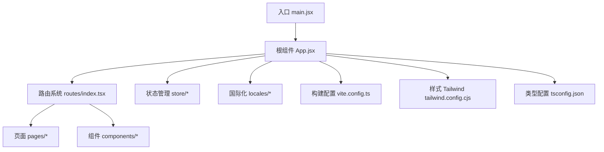
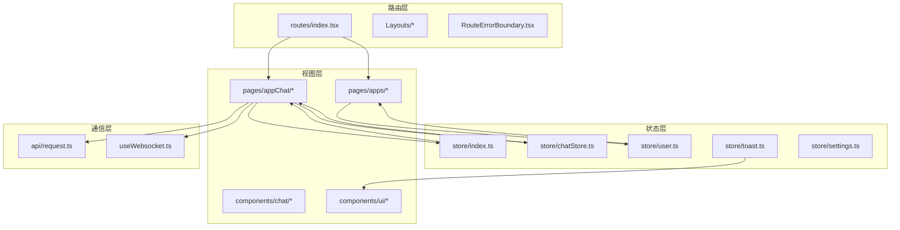
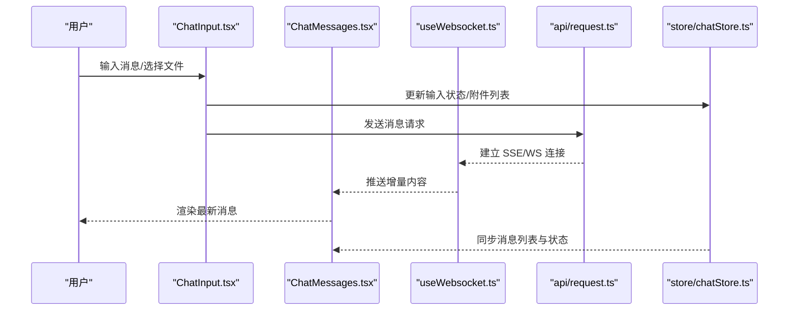
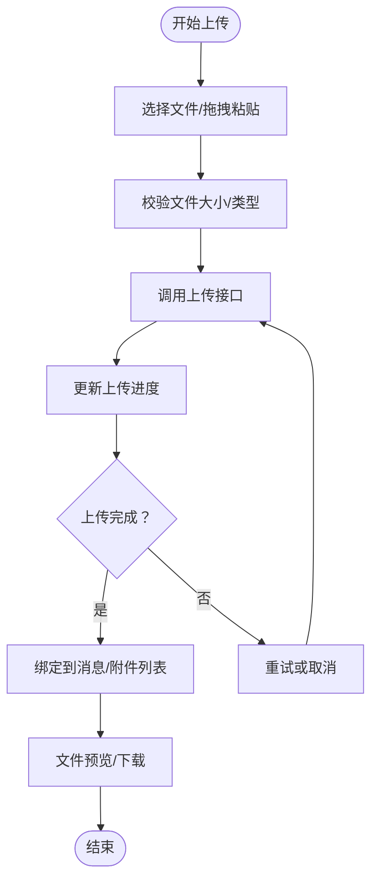
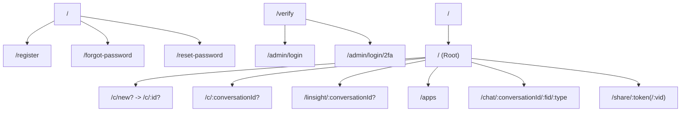
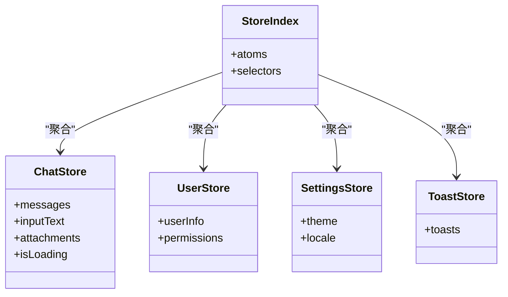
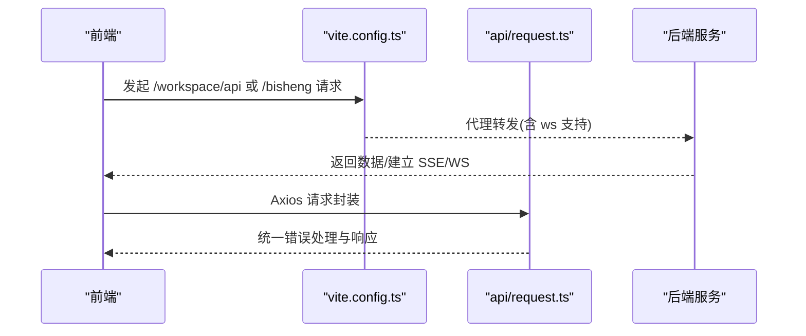
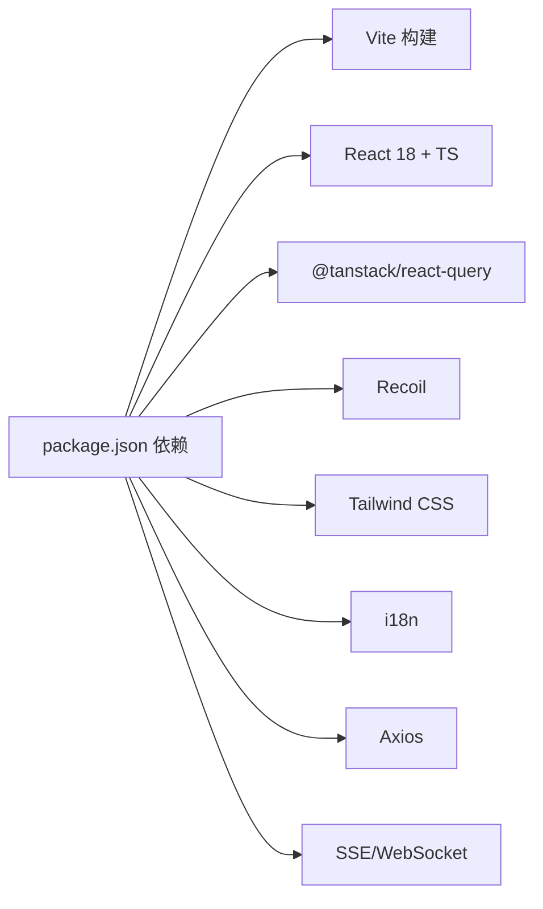

# 客户端前端应用

<cite>
**本文引用的文件**
- [package.json](file://src/frontend/client/package.json)
- [vite.config.ts](file://src/frontend/client/vite.config.ts)
- [main.jsx](file://src/frontend/client/src/main.jsx)
- [App.jsx](file://src/frontend/client/src/App.jsx)
- [routes/index.tsx](file://src/frontend/client/src/routes/index.tsx)
- [tailwind.config.cjs](file://src/frontend/client/tailwind.config.cjs)
- [tsconfig.json](file://src/frontend/client/tsconfig.json)
- [store/index.ts](file://src/frontend/client/src/store/index.ts)
- [store/chatStore.ts](file://src/frontend/client/src/store/chatStore.ts)
- [store/user.ts](file://src/frontend/client/src/store/user.ts)
- [store/toast.ts](file://src/frontend/client/src/store/toast.ts)
- [store/settings.ts](file://src/frontend/client/src/store/settings.ts)
- [store/misc.ts](file://src/frontend/client/src/store/misc.ts)
- [store/artifacts.ts](file://src/frontend/client/src/store/artifacts.ts)
- [store/linsight.ts](file://src/frontend/client/src/store/linsight.ts)
- [store/preset.ts](file://src/frontend/client/src/store/preset.ts)
- [store/prompts.ts](file://src/frontend/client/src/store/prompts.ts)
- [store/search.ts](file://src/frontend/client/src/store/search.ts)
- [store/submission.ts](file://src/frontend/client/src/store/submission.ts)
- [store/temporary.ts](file://src/frontend/client/src/store/temporary.ts)
- [store/text.ts](file://src/frontend/client/src/store/text.ts)
- [store/modeltype.ts](file://src/frontend/client/src/store/modeltype.ts)
- [store/families.ts](file://src/frontend/client/src/store/families.ts)
- [store/endpoints.ts](file://src/frontend/client/src/store/endpoints.ts)
- [store/language.ts](file://src/frontend/client/src/store/language.ts)
- [store/utils.ts](file://src/frontend/client/src/store/utils.ts)
- [pages/appChat/index.tsx](file://src/frontend/client/src/pages/appChat/index.tsx)
- [pages/appChat/ChatView.tsx](file://src/frontend/client/src/pages/appChat/ChatView.tsx)
- [pages/appChat/ChatMessages.tsx](file://src/frontend/client/src/pages/appChat/ChatMessages.tsx)
- [pages/appChat/ChatInput.tsx](file://src/frontend/client/src/pages/appChat/ChatInput.tsx)
- [pages/appChat/useChatHelpers.ts](file://src/frontend/client/src/pages/appChat/useChatHelpers.ts)
- [pages/appChat/useWebsocket.ts](file://src/frontend/client/src/pages/appChat/useWebsocket.ts)
- [pages/appChat/useFileDropAndPaste.ts](file://src/frontend/client/src/pages/appChat/useFileDropAndPaste.ts)
- [pages/appChat/useMessages.ts](file://src/frontend/client/src/pages/appChat/useMessages.ts)
- [pages/apps/index.tsx](file://src/frontend/client/src/pages/apps/index.tsx)
- [pages/Page404.tsx](file://src/frontend/client/src/pages/Page404.tsx)
- [pages/share.tsx](file://src/frontend/client/src/pages/share.tsx)
- [components/chat/MessageUser.tsx](file://src/frontend/client/src/components/chat/MessageUser.tsx)
- [components/chat/MessageBs.tsx](file://src/frontend/client/src/components/chat/MessageBs.tsx)
- [components/chat/MessageFile.tsx](file://src/frontend/client/src/components/chat/MessageFile.tsx)
- [components/chat/ChatFile.tsx](file://src/frontend/client/src/components/chat/ChatFile.tsx)
- [components/chat/InputComponent.tsx](file://src/frontend/client/src/components/chat/InputComponent.tsx)
- [components/chat/InputFileComponent.tsx](file://src/frontend/client/src/components/chat/InputFileComponent.tsx)
- [components/chat/InputFiles.tsx](file://src/frontend/client/src/components/chat/InputFiles.tsx)
- [components/chat/InputForm.tsx](file://src/frontend/client/src/components/chat/InputForm.tsx)
- [components/chat/InputFormSkill.tsx](file://src/frontend/client/src/components/chat/InputFormSkill.tsx)
- [components/chat/MessageButtons.tsx](file://src/frontend/client/src/components/chat/MessageButtons.tsx)
- [components/chat/MessageFeedbackForm.tsx](file://src/frontend/client/src/components/chat/MessageFeedbackForm.tsx)
- [components/chat/MessageNodeRun.tsx](file://src/frontend/client/src/components/chat/MessageNodeRun.tsx)
- [components/chat/MessageRunlog.tsx](file://src/frontend/client/src/components/chat/MessageRunlog.tsx)
- [components/chat/MessageSource.tsx](file://src/frontend/client/src/components/chat/MessageSource.tsx)
- [components/chat/MessageSystem.tsx](file://src/frontend/client/src/components/chat/MessageSystem.tsx)
- [components/chat/ResouceModal.tsx](file://src/frontend/client/src/components/chat/ResouceModal.tsx)
- [components/ui/Toast.tsx](file://src/frontend/client/src/components/ui/Toast.tsx)
- [hooks/ApiErrorBoundaryContext.tsx](file://src/frontend/client/src/hooks/ApiErrorBoundaryContext.tsx)
- [hooks/AuthContext.tsx](file://src/frontend/client/src/hooks/AuthContext.tsx)
- [routes/Layouts/Login.tsx](file://src/frontend/client/src/routes/Layouts/Login.tsx)
- [routes/Layouts/Startup.tsx](file://src/frontend/client/src/routes/Layouts/Startup.tsx)
- [routes/Root.tsx](file://src/frontend/client/src/routes/Root.tsx)
- [routes/RouteErrorBoundary.tsx](file://src/frontend/client/src/routes/RouteErrorBoundary.tsx)
- [routes/ChatRoute.tsx](file://src/frontend/client/src/routes/ChatRoute.tsx)
- [routes/ShareRoute.tsx](file://src/frontend/client/src/routes/ShareRoute.tsx)
- [api/request.ts](file://src/frontend/client/src/api/request.ts)
- [locales/i18n.js](file://src/frontend/client/src/locales/i18n.js)
- [locales/en.ts](file://src/frontend/client/src/locales/en.ts)
- [locales/zh.ts](file://src/frontend/client/src/locales/zh.ts)
- [locales/ja.ts](file://src/frontend/client/src/locales/ja.ts)
</cite>

## 目录
1. [简介](#简介)
2. [项目结构](#项目结构)
3. [核心组件](#核心组件)
4. [架构总览](#架构总览)
5. [详细组件分析](#详细组件分析)
6. [依赖关系分析](#依赖关系分析)
7. [性能考量](#性能考量)
8. [故障排查指南](#故障排查指南)
9. [结论](#结论)
10. [附录](#附录)

## 简介
本文件为 Bisheng 客户端前端应用的技术文档，聚焦于面向最终用户的聊天与工作流交互界面。系统采用 React 18 + TypeScript 技术栈，结合 Vite 构建工具、Tailwind CSS 样式体系、国际化（i18n）与状态管理方案，提供可扩展的组件化架构与现代化开发体验。文档将从设计目标与用户群体出发，系统阐述页面路由、组件架构、状态管理、聊天界面与对话管理、文件上传下载、与后端 API 及 WebSocket 集成、错误处理机制，并给出组件开发指南与最佳实践。

## 项目结构
客户端前端位于 src/frontend/client，采用按功能域划分的目录组织方式：
- 入口与根组件：main.jsx、App.jsx
- 路由系统：routes 目录下的路由定义与布局组件
- 页面与组件：pages 与 components 目录，分别承载页面级与通用 UI 组件
- 状态管理：store 目录下以原子化模块划分的状态管理
- 国际化：locales 目录提供多语言资源
- 工具与类型：utils、@types、hooks 等
- 构建与样式：vite.config.ts、tailwind.config.cjs、tsconfig.json 等

图表来源
- [main.jsx](file://src/frontend/client/src/main.jsx#L1-L18)
- [App.jsx](file://src/frontend/client/src/App.jsx#L1-L53)
- [routes/index.tsx](file://src/frontend/client/src/routes/index.tsx#L1-L138)
- [vite.config.ts](file://src/frontend/client/vite.config.ts#L1-L330)
- [tailwind.config.cjs](file://src/frontend/client/tailwind.config.cjs#L1-L141)
- [tsconfig.json](file://src/frontend/client/tsconfig.json#L1-L40)

章节来源
- [main.jsx](file://src/frontend/client/src/main.jsx#L1-L18)
- [App.jsx](file://src/frontend/client/src/App.jsx#L1-L53)
- [routes/index.tsx](file://src/frontend/client/src/routes/index.tsx#L1-L138)
- [vite.config.ts](file://src/frontend/client/vite.config.ts#L1-L330)
- [tailwind.config.cjs](file://src/frontend/client/tailwind.config.cjs#L1-L141)
- [tsconfig.json](file://src/frontend/client/tsconfig.json#L1-L40)

## 核心组件
- 应用根组件：在 App.jsx 中装配 React Query、Recoil、DnD、主题与无障碍播报等全局能力，并通过 RouterProvider 注入路由。
- 路由系统：routes/index.tsx 使用 createBrowserRouter 定义登录、启动页、聊天、应用中心、分享等路由，并通过 Layouts 与 RouteErrorBoundary 提供统一布局与错误兜底。
- 状态管理：store 目录下包含 chatStore、user、toast、settings、misc、artifacts、linsight、preset、prompts、search、submission、temporary、text、modeltype、families、endpoints、language、utils 等模块，采用 Recoil 与 React Query 协同管理。
- 国际化：locales/i18n.js 初始化 i18n，en.ts、zh.ts、ja.ts 提供翻译键值。
- 构建与样式：vite.config.ts 配置代理、PWA、压缩、静态资源复制、分包策略；tailwind.config.cjs 定义暗色模式、字体、动画与颜色变量；tsconfig.json 指定路径别名与编译选项。

章节来源
- [App.jsx](file://src/frontend/client/src/App.jsx#L1-L53)
- [routes/index.tsx](file://src/frontend/client/src/routes/index.tsx#L1-L138)
- [store/index.ts](file://src/frontend/client/src/store/index.ts)
- [locales/i18n.js](file://src/frontend/client/src/locales/i18n.js)
- [locales/en.ts](file://src/frontend/client/src/locales/en.ts)
- [locales/zh.ts](file://src/frontend/client/src/locales/zh.ts)
- [locales/ja.ts](file://src/frontend/client/src/locales/ja.ts)
- [vite.config.ts](file://src/frontend/client/vite.config.ts#L1-L330)
- [tailwind.config.cjs](file://src/frontend/client/tailwind.config.cjs#L1-L141)
- [tsconfig.json](file://src/frontend/client/tsconfig.json#L1-L40)

## 架构总览
应用采用“路由驱动 + 原子化状态 + 组件化 UI”的架构模式：
- 路由层：负责页面导航与权限控制，提供统一布局与错误边界。
- 状态层：Recoil 原子与选择器管理用户、设置、消息、提示词等；React Query 管理服务端数据缓存与错误处理。
- 视图层：页面与组件按功能域拆分，复用 UI 组件库与 Tailwind 样式。
- 通信层：Axios 封装请求；SSE/WebSocket 处理实时消息；PWA 支持离线与安装。
- 工具层：i18n、日期工具、Markdown 渲染、虚拟化列表等。

图表来源
- [routes/index.tsx](file://src/frontend/client/src/routes/index.tsx#L1-L138)
- [store/index.ts](file://src/frontend/client/src/store/index.ts)
- [store/chatStore.ts](file://src/frontend/client/src/store/chatStore.ts)
- [store/user.ts](file://src/frontend/client/src/store/user.ts)
- [store/toast.ts](file://src/frontend/client/src/store/toast.ts)
- [store/settings.ts](file://src/frontend/client/src/store/settings.ts)
- [pages/appChat/index.tsx](file://src/frontend/client/src/pages/appChat/index.tsx)
- [pages/apps/index.tsx](file://src/frontend/client/src/pages/apps/index.tsx)
- [components/chat/MessageUser.tsx](file://src/frontend/client/src/components/chat/MessageUser.tsx)
- [components/ui/Toast.tsx](file://src/frontend/client/src/components/ui/Toast.tsx)
- [api/request.ts](file://src/frontend/client/src/api/request.ts)
- [pages/appChat/useWebsocket.ts](file://src/frontend/client/src/pages/appChat/useWebsocket.ts)

章节来源
- [routes/index.tsx](file://src/frontend/client/src/routes/index.tsx#L1-L138)
- [store/index.ts](file://src/frontend/client/src/store/index.ts)
- [store/chatStore.ts](file://src/frontend/client/src/store/chatStore.ts)
- [store/user.ts](file://src/frontend/client/src/store/user.ts)
- [store/toast.ts](file://src/frontend/client/src/store/toast.ts)
- [store/settings.ts](file://src/frontend/client/src/store/settings.ts)
- [pages/appChat/index.tsx](file://src/frontend/client/src/pages/appChat/index.tsx)
- [pages/apps/index.tsx](file://src/frontend/client/src/pages/apps/index.tsx)
- [components/chat/MessageUser.tsx](file://src/frontend/client/src/components/chat/MessageUser.tsx)
- [components/ui/Toast.tsx](file://src/frontend/client/src/components/ui/Toast.tsx)
- [api/request.ts](file://src/frontend/client/src/api/request.ts)
- [pages/appChat/useWebsocket.ts](file://src/frontend/client/src/pages/appChat/useWebsocket.ts)

## 详细组件分析

### 聊天界面与对话管理
- 页面入口：pages/appChat/index.tsx 作为聊天页面主入口，组合 ChatView、ChatMessages、ChatInput 等子组件。
- 消息渲染：ChatMessages.tsx 负责消息列表渲染，支持用户消息、助手消息、系统消息、文件消息、按钮与反馈表单、运行日志与节点执行结果等消息类型的组件化展示。
- 输入与文件：ChatInput.tsx 负责文本输入与发送；InputComponent.tsx、InputFileComponent.tsx、InputFiles.tsx、InputForm.tsx、InputFormSkill.tsx 提供多样化输入能力；useFileDropAndPaste.ts 与 useMessages.ts 提供拖拽粘贴与消息管理逻辑。
- 助手与 Webhook：useChatHelpers.ts 提供消息处理辅助方法；useWebsocket.ts 管理 WebSocket 连接与消息订阅，实现后端流式输出与实时更新。
- 状态管理：store/chatStore.ts 管理当前会话、消息列表、输入状态、加载状态等；store/artifacts.ts、store/linsight.ts 等模块支撑产物与 Linsight 场景的数据流转。

图表来源
- [pages/appChat/ChatInput.tsx](file://src/frontend/client/src/pages/appChat/ChatInput.tsx)
- [pages/appChat/ChatMessages.tsx](file://src/frontend/client/src/pages/appChat/ChatMessages.tsx)
- [pages/appChat/useWebsocket.ts](file://src/frontend/client/src/pages/appChat/useWebsocket.ts)
- [api/request.ts](file://src/frontend/client/src/api/request.ts)
- [store/chatStore.ts](file://src/frontend/client/src/store/chatStore.ts)

章节来源
- [pages/appChat/index.tsx](file://src/frontend/client/src/pages/appChat/index.tsx)
- [pages/appChat/ChatView.tsx](file://src/frontend/client/src/pages/appChat/ChatView.tsx)
- [pages/appChat/ChatMessages.tsx](file://src/frontend/client/src/pages/appChat/ChatMessages.tsx)
- [pages/appChat/ChatInput.tsx](file://src/frontend/client/src/pages/appChat/ChatInput.tsx)
- [pages/appChat/useChatHelpers.ts](file://src/frontend/client/src/pages/appChat/useChatHelpers.ts)
- [pages/appChat/useWebsocket.ts](file://src/frontend/client/src/pages/appChat/useWebsocket.ts)
- [pages/appChat/useFileDropAndPaste.ts](file://src/frontend/client/src/pages/appChat/useFileDropAndPaste.ts)
- [pages/appChat/useMessages.ts](file://src/frontend/client/src/pages/appChat/useMessages.ts)
- [store/chatStore.ts](file://src/frontend/client/src/store/chatStore.ts)
- [store/artifacts.ts](file://src/frontend/client/src/store/artifacts.ts)
- [store/linsight.ts](file://src/frontend/client/src/store/linsight.ts)

### 文件上传与下载
- 上传入口：InputFileComponent.tsx、InputFiles.tsx 提供文件选择与拖拽上传能力；useFileDropAndPaste.ts 提供拖拽与粘贴事件处理。
- 下载与预览：MessageFile.tsx、ChatFile.tsx 支持文件展示与下载；公共工具如 downloadjs、pdfjs-dist、mammoth 等用于下载与文档解析。
- 状态同步：store/chatStore.ts 记录附件列表与上传进度；useMessages.ts 管理消息中文件字段的增删改。

图表来源
- [pages/appChat/InputFileComponent.tsx](file://src/frontend/client/src/pages/appChat/InputFileComponent.tsx)
- [pages/appChat/InputFiles.tsx](file://src/frontend/client/src/pages/appChat/InputFiles.tsx)
- [pages/appChat/useFileDropAndPaste.ts](file://src/frontend/client/src/pages/appChat/useFileDropAndPaste.ts)
- [pages/appChat/MessageFile.tsx](file://src/frontend/client/src/pages/appChat/MessageFile.tsx)
- [pages/appChat/ChatFile.tsx](file://src/frontend/client/src/pages/appChat/ChatFile.tsx)
- [store/chatStore.ts](file://src/frontend/client/src/store/chatStore.ts)

章节来源
- [pages/appChat/InputFileComponent.tsx](file://src/frontend/client/src/pages/appChat/InputFileComponent.tsx)
- [pages/appChat/InputFiles.tsx](file://src/frontend/client/src/pages/appChat/InputFiles.tsx)
- [pages/appChat/useFileDropAndPaste.ts](file://src/frontend/client/src/pages/appChat/useFileDropAndPaste.ts)
- [pages/appChat/MessageFile.tsx](file://src/frontend/client/src/pages/appChat/MessageFile.tsx)
- [pages/appChat/ChatFile.tsx](file://src/frontend/client/src/pages/appChat/ChatFile.tsx)
- [store/chatStore.ts](file://src/frontend/client/src/store/chatStore.ts)

### 页面路由系统
- 登录与启动页：StartupLayout、LoginLayout 提供注册、忘记密码、邮箱验证、两步验证等流程。
- 主路由：Root 包含会话列表；ChatRoute 负责聊天页面；AgentCenter 展示应用中心；Share 支持分享链接访问。
- 错误边界：RouteErrorBoundary 提供统一错误兜底；ApiErrorWatcher 在认证场景监听 401 并触发错误边界。

图表来源
- [routes/index.tsx](file://src/frontend/client/src/routes/index.tsx#L37-L137)
- [routes/Layouts/Login.tsx](file://src/frontend/client/src/routes/Layouts/Login.tsx)
- [routes/Layouts/Startup.tsx](file://src/frontend/client/src/routes/Layouts/Startup.tsx)
- [routes/Root.tsx](file://src/frontend/client/src/routes/Root.tsx)
- [routes/RouteErrorBoundary.tsx](file://src/frontend/client/src/routes/RouteErrorBoundary.tsx)

章节来源
- [routes/index.tsx](file://src/frontend/client/src/routes/index.tsx#L1-L138)
- [routes/Layouts/Login.tsx](file://src/frontend/client/src/routes/Layouts/Login.tsx)
- [routes/Layouts/Startup.tsx](file://src/frontend/client/src/routes/Layouts/Startup.tsx)
- [routes/Root.tsx](file://src/frontend/client/src/routes/Root.tsx)
- [routes/RouteErrorBoundary.tsx](file://src/frontend/client/src/routes/RouteErrorBoundary.tsx)

### 状态管理策略
- Recoil 原子与选择器：store/index.ts 汇总各模块原子，chatStore.ts 管理会话与消息，user.ts 管理用户信息，settings.ts 管理偏好设置，toast.ts 管理全局提示。
- React Query：在 App.jsx 中初始化 QueryClient 与 QueryCache，统一处理 401 错误并触发错误边界。
- 数据持久化：localStorage mock 与测试环境配置见 test 目录，生产中可通过浏览器存储或服务端同步实现。

图表来源
- [store/index.ts](file://src/frontend/client/src/store/index.ts)
- [store/chatStore.ts](file://src/frontend/client/src/store/chatStore.ts)
- [store/user.ts](file://src/frontend/client/src/store/user.ts)
- [store/settings.ts](file://src/frontend/client/src/store/settings.ts)
- [store/toast.ts](file://src/frontend/client/src/store/toast.ts)

章节来源
- [store/index.ts](file://src/frontend/client/src/store/index.ts)
- [store/chatStore.ts](file://src/frontend/client/src/store/chatStore.ts)
- [store/user.ts](file://src/frontend/client/src/store/user.ts)
- [store/settings.ts](file://src/frontend/client/src/store/settings.ts)
- [store/toast.ts](file://src/frontend/client/src/store/toast.ts)
- [App.jsx](file://src/frontend/client/src/App.jsx#L16-L24)

### 国际化支持
- 初始化：locales/i18n.js 加载语言检测与资源。
- 资源：locales/en.ts、locales/zh.ts、locales/ja.ts 提供英文、简中、日文翻译键值。
- 使用：react-i18next 在组件中进行翻译与格式化。

章节来源
- [locales/i18n.js](file://src/frontend/client/src/locales/i18n.js)
- [locales/en.ts](file://src/frontend/client/src/locales/en.ts)
- [locales/zh.ts](file://src/frontend/client/src/locales/zh.ts)
- [locales/ja.ts](file://src/frontend/client/src/locales/ja.ts)

### 与后端 API 的集成与 WebSocket 实时通信
- 请求封装：api/request.ts 对 Axios 进行二次封装，统一拦截器、超时与错误处理。
- 代理与转发：vite.config.ts 配置 /workspace 与 /bisheng 前缀代理，支持 WebSocket。
- 实时通信：pages/appChat/useWebsocket.ts 建立与后端的 SSE/WS 连接，接收流式响应并更新消息列表。

图表来源
- [vite.config.ts](file://src/frontend/client/vite.config.ts#L26-L62)
- [api/request.ts](file://src/frontend/client/src/api/request.ts)
- [pages/appChat/useWebsocket.ts](file://src/frontend/client/src/pages/appChat/useWebsocket.ts)

章节来源
- [vite.config.ts](file://src/frontend/client/vite.config.ts#L26-L62)
- [api/request.ts](file://src/frontend/client/src/api/request.ts)
- [pages/appChat/useWebsocket.ts](file://src/frontend/client/src/pages/appChat/useWebsocket.ts)

## 依赖关系分析
- 构建与打包：Vite + 插件生态（PWA、压缩、静态复制、polyfill），Rollup 分包策略按第三方库与本地资源分类。
- 样式系统：Tailwind CSS + 自定义主题变量，支持暗色模式与动画。
- 状态与查询：Recoil + @tanstack/react-query，配合错误边界与无障碍播报。
- UI 组件：Radix UI、Headless UI、Framer Motion、Lucide React 等。
- 国际化：i18next + react-i18next + 语言检测。
- 工具库：date-fns、lodash、axios、uuid、vditor、echarts、pdfjs 等。

图表来源
- [package.json](file://src/frontend/client/package.json#L22-L114)
- [vite.config.ts](file://src/frontend/client/vite.config.ts#L67-L151)
- [tailwind.config.cjs](file://src/frontend/client/tailwind.config.cjs#L1-L141)

章节来源
- [package.json](file://src/frontend/client/package.json#L1-L157)
- [vite.config.ts](file://src/frontend/client/vite.config.ts#L1-L330)
- [tailwind.config.cjs](file://src/frontend/client/tailwind.config.cjs#L1-L141)

## 性能考量
- 分包策略：vite.config.ts 对大体积依赖进行手动分包（如 i18n、virtualization、markdown-processing 等），减少首屏体积。
- 源码映射：开发环境启用 sourcemap，生产环境按需生成；sourcemapExclude 插件排除 node_modules 以提升调试效率。
- 资源优化：vite-plugin-compression2 开启压缩阈值；静态复制 pdf.worker；PWA 缓存策略优化离线体验。
- 渲染优化：虚拟化列表与懒加载组件减少长列表开销；Tailwind 原子类避免重复样式计算。
- 网络优化：Axios 统一拦截器与超时控制；WebSocket 流式传输降低延迟。

章节来源
- [vite.config.ts](file://src/frontend/client/vite.config.ts#L153-L305)
- [package.json](file://src/frontend/client/package.json#L116-L155)

## 故障排查指南
- 路由与布局
  - 404 页面：Page404.tsx 提供兜底；routes/index.tsx 中 "*" 路由跳转至 404。
  - 错误边界：RouteErrorBoundary.tsx 捕获路由错误；ApiErrorWatcher 在 401 时触发错误边界。
- 状态与查询
  - 401 处理：App.jsx 中 QueryCache.onError 检测 401 并设置错误边界状态。
  - 全局提示：components/ui/Toast.tsx 与 store/toast.ts 协同显示系统提示。
- 国际化
  - 语言资源缺失：检查 locales/i18n.js 初始化与 en/zh/ja 资源是否存在。
- 构建与代理
  - 代理不生效：确认 vite.config.ts 中 /workspace 与 /bisheng 代理规则与后端地址一致。
  - PWA 缓存问题：清理浏览器缓存或禁用 PWA 后重试。
- 文件上传
  - 上传失败：检查 api/request.ts 的上传接口与后端返回；查看 useFileDropAndPaste.ts 的事件处理。
- WebSocket
  - 连接异常：确认 useWebsocket.ts 的连接参数与后端 ws 地址；查看代理配置是否允许 ws。

章节来源
- [routes/index.tsx](file://src/frontend/client/src/routes/index.tsx#L127-L137)
- [routes/RouteErrorBoundary.tsx](file://src/frontend/client/src/routes/RouteErrorBoundary.tsx)
- [App.jsx](file://src/frontend/client/src/App.jsx#L16-L24)
- [components/ui/Toast.tsx](file://src/frontend/client/src/components/ui/Toast.tsx)
- [store/toast.ts](file://src/frontend/client/src/store/toast.ts)
- [locales/i18n.js](file://src/frontend/client/src/locales/i18n.js)
- [vite.config.ts](file://src/frontend/client/vite.config.ts#L26-L62)
- [pages/appChat/useWebsocket.ts](file://src/frontend/client/src/pages/appChat/useWebsocket.ts)
- [api/request.ts](file://src/frontend/client/src/api/request.ts)
- [pages/appChat/useFileDropAndPaste.ts](file://src/frontend/client/src/pages/appChat/useFileDropAndPaste.ts)

## 结论
本客户端前端应用以 React 18 + TypeScript 为基础，结合 Vite、Tailwind CSS、Recoil 与 React Query，构建了高内聚、低耦合的聊天与工作流交互界面。通过清晰的路由体系、模块化的状态管理、完善的国际化与国际化支持、以及对文件上传下载与 WebSocket 实时通信的深度集成，满足最终用户的日常使用需求。建议在后续迭代中持续优化分包策略、完善错误监控与埋点、增强可访问性与国际化覆盖。

## 附录
- 组件开发指南
  - 命名规范：组件文件使用 PascalCase，导出默认组件；样式类名遵循 Tailwind 原子化原则。
  - 状态管理：优先使用 Recoil 原子与选择器；网络数据使用 React Query 管理缓存与重试。
  - 路由与布局：新增页面遵循现有 Layouts 与 RouteErrorBoundary；使用 basename 保持路径一致性。
  - 国际化：所有文案统一放入 locales；使用 t 函数进行翻译与占位符替换。
  - 性能优化：长列表使用虚拟化；图片与字体资源按需加载；避免不必要的重渲染。
  - 错误处理：统一在 QueryCache 与 ApiErrorWatcher 中处理 401 与其他错误；Toast 提示用户。
- 最佳实践
  - 代码规范：TypeScript 严格模式；ESLint + Prettier；Jest 单测覆盖关键逻辑。
  - 构建优化：合理分包；开启压缩；禁用无用插件；生产环境关闭 devTools。
  - 用户体验：提供加载骨架与空态；支持键盘快捷键；无障碍播报与屏幕阅读器友好。
  - 安全：XSS 防护（Markdown 渲染）、CSRF 防护（Axios 拦截器）、敏感信息脱敏。