# 客户端前端概览

<cite>
**本文引用的文件**
- [src/frontend/client/package.json](file://src/frontend/client/package.json)
- [src/frontend/platform/package.json](file://src/frontend/platform/package.json)
- [src/frontend/client/vite.config.ts](file://src/frontend/client/vite.config.ts)
- [src/frontend/platform/vite.config.mts](file://src/frontend/platform/vite.config.mts)
- [src/frontend/client/src/main.jsx](file://src/frontend/client/src/main.jsx)
- [src/frontend/platform/src/index.tsx](file://src/frontend/platform/src/index.tsx)
- [src/frontend/client/src/App.jsx](file://src/frontend/client/src/App.jsx)
- [src/frontend/platform/src/App.tsx](file://src/frontend/platform/src/App.tsx)
- [src/frontend/platform/src/i18n.js](file://src/frontend/platform/src/i18n.js)
- [src/frontend/client/src/locales/i18n.ts](file://src/frontend/client/src/locales/i18n.ts)
- [src/frontend/client/src/hooks/ApiErrorBoundaryContext.tsx](file://src/frontend/client/src/hooks/ApiErrorBoundaryContext.tsx)
- [src/frontend/client/tailwind.config.cjs](file://src/frontend/client/tailwind.config.cjs)
- [src/frontend/platform/tailwind.config.js](file://src/frontend/platform/tailwind.config.js)
</cite>

## 目录
1. [简介](#简介)
2. [项目结构](#项目结构)
3. [核心组件](#核心组件)
4. [架构总览](#架构总览)
5. [详细组件分析](#详细组件分析)
6. [依赖关系分析](#依赖关系分析)
7. [性能考量](#性能考量)
8. [故障排查指南](#故障排查指南)
9. [结论](#结论)
10. [附录](#附录)

## 简介
本文件面向 Bisheng 客户端前端应用，提供从设计理念、目标用户、技术选型到启动与初始化流程的全景式概览。该前端作为最终用户的交互界面，承载聊天对话、工作区管理、可视化编排与多语言体验等核心能力。本文档同时覆盖国际化支持、样式系统、错误边界处理等基础设施，并给出快速入门与开发环境搭建指引。

## 项目结构
Bisheng 前端包含两个主要子应用：
- 客户端应用（client）：面向最终用户，提供聊天与工作区交互。
- 平台应用（platform）：面向平台管理员与高级用户，提供可视化编排、节点管理与系统配置。

两套应用共享统一的技术栈与构建工具链，分别拥有独立的构建配置、代理策略与上下文体系。

```mermaid
graph TB
subgraph "客户端应用(client)"
C_PKG["package.json"]
C_VITE["vite.config.ts"]
C_MAIN["src/main.jsx"]
C_APP["src/App.jsx"]
C_I18N["src/locales/i18n.ts"]
C_TAILWIND["tailwind.config.cjs"]
end
subgraph "平台应用(platform)"
P_PKG["package.json"]
P_VITE["vite.config.mts"]
P_INDEX["src/index.tsx"]
P_APP["src/App.tsx"]
P_I18N["src/i18n.js"]
P_TAILWIND["tailwind.config.js"]
end
C_PKG --> C_VITE --> C_MAIN --> C_APP
P_PKG --> P_VITE --> P_INDEX --> P_APP
C_I18N -.-> C_APP
P_I18N -.-> P_APP
C_TAILWIND -.-> C_APP
P_TAILWIND -.-> P_APP
```

图表来源
- [src/frontend/client/package.json](file://src/frontend/client/package.json#L1-L157)
- [src/frontend/platform/package.json](file://src/frontend/platform/package.json#L1-L126)
- [src/frontend/client/vite.config.ts](file://src/frontend/client/vite.config.ts#L1-L330)
- [src/frontend/platform/vite.config.mts](file://src/frontend/platform/vite.config.mts#L1-L147)
- [src/frontend/client/src/main.jsx](file://src/frontend/client/src/main.jsx#L1-L18)
- [src/frontend/platform/src/index.tsx](file://src/frontend/platform/src/index.tsx#L1-L36)
- [src/frontend/client/src/App.jsx](file://src/frontend/client/src/App.jsx#L1-L53)
- [src/frontend/platform/src/App.tsx](file://src/frontend/platform/src/App.tsx#L1-L246)
- [src/frontend/client/src/locales/i18n.ts](file://src/frontend/client/src/locales/i18n.ts)
- [src/frontend/platform/src/i18n.js](file://src/frontend/platform/src/i18n.js#L1-L49)
- [src/frontend/client/tailwind.config.cjs](file://src/frontend/client/tailwind.config.cjs#L1-L141)
- [src/frontend/platform/tailwind.config.js](file://src/frontend/platform/tailwind.config.js#L1-L237)

章节来源
- [src/frontend/client/package.json](file://src/frontend/client/package.json#L1-L157)
- [src/frontend/platform/package.json](file://src/frontend/platform/package.json#L1-L126)

## 核心组件
- 应用入口与根组件
  - 客户端入口：在入口中加载国际化、样式与错误边界 Provider 后渲染根组件。
  - 平台入口：在入口中初始化 QueryClient、Context 包装器与全局样式后渲染根组件。
- 根组件 App
  - 客户端 App：集成 React Query、Recoil、DnD、主题切换、Toast、路由等；内置 401 错误处理。
  - 平台 App：基于用户角色动态路由、全局弹窗与加载态、i18n 标题初始化、URL 错误提示。
- 国际化
  - 客户端：通过 i18next 与 react-i18next 初始化，支持命名空间与默认变量注入。
  - 平台：通过 i18next-http-backend 从后端加载语言包，支持浏览器语言探测与本地存储记忆。
- 样式系统
  - 采用 TailwindCSS，结合 CSS 变量实现深色模式与品牌色系；提供丰富的动画与可复用工具类。
- 错误边界与异常处理
  - 客户端：提供 API 异常边界 Provider，拦截 401 并触发统一错误处理。
  - 平台：全局弹窗与 Toaster 组件，配合上下文管理错误/通知/成功状态。

章节来源
- [src/frontend/client/src/main.jsx](file://src/frontend/client/src/main.jsx#L1-L18)
- [src/frontend/platform/src/index.tsx](file://src/frontend/platform/src/index.tsx#L1-L36)
- [src/frontend/client/src/App.jsx](file://src/frontend/client/src/App.jsx#L1-L53)
- [src/frontend/platform/src/App.tsx](file://src/frontend/platform/src/App.tsx#L1-L246)
- [src/frontend/platform/src/i18n.js](file://src/frontend/platform/src/i18n.js#L1-L49)
- [src/frontend/client/src/locales/i18n.ts](file://src/frontend/client/src/locales/i18n.ts)
- [src/frontend/client/tailwind.config.cjs](file://src/frontend/client/tailwind.config.cjs#L1-L141)
- [src/frontend/platform/tailwind.config.js](file://src/frontend/platform/tailwind.config.js#L1-L237)

## 架构总览
下图展示客户端与平台应用的启动与初始化流程，涵盖构建配置、代理、国际化、样式与错误处理的关键环节。

图表来源
- [src/frontend/client/src/main.jsx](file://src/frontend/client/src/main.jsx#L1-L18)
- [src/frontend/client/src/App.jsx](file://src/frontend/client/src/App.jsx#L1-L53)
- [src/frontend/platform/src/index.tsx](file://src/frontend/platform/src/index.tsx#L1-L36)
- [src/frontend/platform/src/App.tsx](file://src/frontend/platform/src/App.tsx#L1-L246)
- [src/frontend/platform/src/i18n.js](file://src/frontend/platform/src/i18n.js#L1-L49)
- [src/frontend/client/tailwind.config.cjs](file://src/frontend/client/tailwind.config.cjs#L1-L141)
- [src/frontend/platform/tailwind.config.js](file://src/frontend/platform/tailwind.config.js#L1-L237)

## 详细组件分析

### 客户端应用启动流程
- 入口文件负责：
  - 注入运行时补丁库以兼容异步语法。
  - 初始化国际化与样式。
  - 包裹错误边界 Provider 后渲染根组件。
- 根组件负责：
  - 配置 React Query 的全局缓存与错误回调（如 401）。
  - 提供主题切换、无障碍播报、拖拽、路由等上下文。
  - 渲染 Toast 与 Radix UI 视口，确保通知一致呈现。

图表来源
- [src/frontend/client/src/main.jsx](file://src/frontend/client/src/main.jsx#L1-L18)
- [src/frontend/client/src/App.jsx](file://src/frontend/client/src/App.jsx#L1-L53)

章节来源
- [src/frontend/client/src/main.jsx](file://src/frontend/client/src/main.jsx#L1-L18)
- [src/frontend/client/src/App.jsx](file://src/frontend/client/src/App.jsx#L1-L53)

### 平台应用启动流程
- 入口文件负责：
  - 初始化 QueryClient 并设置查询行为。
  - 包裹 ContextProvider（含暗色模式、位置、用户、弹窗、SSE 等）后渲染根组件。
- 根组件负责：
  - 根据用户角色动态选择路由（公开、私有或管理）。
  - 处理 URL 错误提示与 i18n 标题初始化。
  - 统一管理全局弹窗队列与 Toaster。

图表来源
- [src/frontend/platform/src/index.tsx](file://src/frontend/platform/src/index.tsx#L1-L36)
- [src/frontend/platform/src/App.tsx](file://src/frontend/platform/src/App.tsx#L1-L246)

章节来源
- [src/frontend/platform/src/index.tsx](file://src/frontend/platform/src/index.tsx#L1-L36)
- [src/frontend/platform/src/App.tsx](file://src/frontend/platform/src/App.tsx#L1-L246)

### 国际化支持
- 客户端
  - 通过 i18next 与 react-i18next 初始化，支持命名空间与默认变量注入。
  - 在入口处加载国际化配置，确保组件树内可使用 t 函数。
- 平台
  - 通过 i18next-http-backend 从后端按需加载语言包。
  - 支持浏览器语言探测、本地存储记忆与品牌名称变量注入。

图表来源
- [src/frontend/platform/src/i18n.js](file://src/frontend/platform/src/i18n.js#L1-L49)
- [src/frontend/client/src/locales/i18n.ts](file://src/frontend/client/src/locales/i18n.ts)

章节来源
- [src/frontend/platform/src/i18n.js](file://src/frontend/platform/src/i18n.js#L1-L49)
- [src/frontend/client/src/locales/i18n.ts](file://src/frontend/client/src/locales/i18n.ts)

### 样式系统与主题
- Tailwind 配置
  - 客户端：启用深色模式类、自定义字体与颜色变量、动画与 Radix 插件。
  - 平台：启用深色模式、容器与屏幕断点扩展、大量 CSS 变量与插件集合。
- 主题切换
  - 通过 CSS 变量与 Tailwind 类实现主题切换，配合 Radix UI 组件保持一致性。

图表来源
- [src/frontend/client/tailwind.config.cjs](file://src/frontend/client/tailwind.config.cjs#L1-L141)
- [src/frontend/platform/tailwind.config.js](file://src/frontend/platform/tailwind.config.js#L1-L237)

章节来源
- [src/frontend/client/tailwind.config.cjs](file://src/frontend/client/tailwind.config.cjs#L1-L141)
- [src/frontend/platform/tailwind.config.js](file://src/frontend/platform/tailwind.config.js#L1-L237)

### 错误边界与异常处理
- 客户端
  - 提供 API 异常边界 Provider，拦截 401 等错误并触发统一处理。
  - 根组件内配置 React Query 的 QueryCache.onError，集中处理网络异常。
- 平台
  - 通过全局弹窗与 Toaster 组件统一呈现错误/通知/成功信息。
  - 支持键盘快捷键退出登录，清理用户状态与本地存储。

图表来源
- [src/frontend/client/src/App.jsx](file://src/frontend/client/src/App.jsx#L1-L53)
- [src/frontend/client/src/hooks/ApiErrorBoundaryContext.tsx](file://src/frontend/client/src/hooks/ApiErrorBoundaryContext.tsx)

章节来源
- [src/frontend/client/src/App.jsx](file://src/frontend/client/src/App.jsx#L1-L53)
- [src/frontend/client/src/hooks/ApiErrorBoundaryContext.tsx](file://src/frontend/client/src/hooks/ApiErrorBoundaryContext.tsx)

## 依赖关系分析
- 技术栈
  - React 18：作为核心 UI 框架，配合 Suspense、Hooks 与并发特性。
  - TypeScript：提供类型安全与更好的开发体验。
  - Vite：提供快速冷启动、热更新与高效打包能力。
- 关键依赖
  - 国际化：i18next + react-i18next（平台侧还包含 i18next-http-backend）。
  - 状态与数据流：Recoil（客户端）、Zustand（平台侧示例）。
  - 请求与缓存：@tanstack/react-query。
  - 路由：react-router-dom。
  - UI 组件库：Radix UI、Headless UI、BS UI（平台侧）。
  - 样式：TailwindCSS + 自定义 CSS 变量。
  - 构建与插件：vite-plugin-pwa、compression、node-polyfills、static-copy、svgr 等。

图表来源
- [src/frontend/client/package.json](file://src/frontend/client/package.json#L22-L114)
- [src/frontend/platform/package.json](file://src/frontend/platform/package.json#L5-L74)

章节来源
- [src/frontend/client/package.json](file://src/frontend/client/package.json#L1-L157)
- [src/frontend/platform/package.json](file://src/frontend/platform/package.json#L1-L126)

## 性能考量
- 分包与代码分割
  - Vite 配置中对大体积依赖进行手动分包（如 i18n、虚拟化、路由、编辑器等），降低首屏体积与提升缓存命中率。
- SourceMap 控制
  - 在开发环境启用 SourceMap，在生产环境中按需排除第三方库的 SourceMap 以减小体积。
- 压缩与缓存
  - 启用 gzip/br 压缩与 PWA 缓存策略，提升加载速度与离线可用性。
- 图片与字体
  - 通过静态复制与字体目录分离，减少打包体积并优化加载路径。

章节来源
- [src/frontend/client/vite.config.ts](file://src/frontend/client/vite.config.ts#L153-L305)
- [src/frontend/platform/vite.config.mts](file://src/frontend/platform/vite.config.mts#L65-L93)

## 故障排查指南
- 国际化未生效
  - 检查 i18n 初始化顺序与命名空间加载路径，确认后端语言包可访问且版本号正确。
- 路由跳转异常
  - 核对动态路由逻辑与用户角色判断，检查 BASE_URL 与代理重写规则。
- 样式不生效或主题异常
  - 确认 Tailwind 配置内容扫描范围与 CSS 变量是否正确注入。
- 构建体积过大
  - 查看手动分包策略与 chunkSizeWarningLimit，必要时调整第三方库拆分策略。
- 开发代理失败
  - 检查代理目标地址、withCredentials、ws 与重写规则，确认端口与主机映射。

章节来源
- [src/frontend/platform/src/i18n.js](file://src/frontend/platform/src/i18n.js#L1-L49)
- [src/frontend/client/vite.config.ts](file://src/frontend/client/vite.config.ts#L22-L63)
- [src/frontend/platform/vite.config.mts](file://src/frontend/platform/vite.config.mts#L138-L146)

## 结论
Bisheng 客户端前端以 React 18 为核心，结合 TypeScript 与 Vite 实现高性能、可维护的前端体验。通过统一的国际化、Tailwind 样式体系与错误边界机制，为最终用户提供稳定一致的交互体验。平台侧进一步强化了可视化编排与上下文生态，满足复杂场景下的管理需求。建议在开发中遵循现有分包策略与样式规范，确保构建效率与运行性能。

## 附录

### 快速入门指南
- 环境要求
  - Node.js 版本：参考平台应用引擎要求（>= 18）。
- 安装依赖
  - 在项目根目录执行安装命令（推荐使用 npm 或 pnpm）。
- 启动开发
  - 客户端：进入 client 目录，执行开发命令启动。
  - 平台：进入 platform 目录，执行开发命令启动。
- 构建与预览
  - 使用构建脚本生成生产包，必要时通过预览命令验证产物。
- 国际化与样式
  - 在客户端与平台侧分别初始化 i18n，并确保语言包路径与版本号正确。
  - 修改 Tailwind 配置后重新构建以应用新样式。

章节来源
- [src/frontend/platform/package.json](file://src/frontend/platform/package.json#L122-L124)
- [src/frontend/client/package.json](file://src/frontend/client/package.json#L6-L17)
- [src/frontend/platform/package.json](file://src/frontend/platform/package.json#L76-L81)
- [src/frontend/client/vite.config.ts](file://src/frontend/client/vite.config.ts#L17-L21)
- [src/frontend/platform/vite.config.mts](file://src/frontend/platform/vite.config.mts#L62-L67)