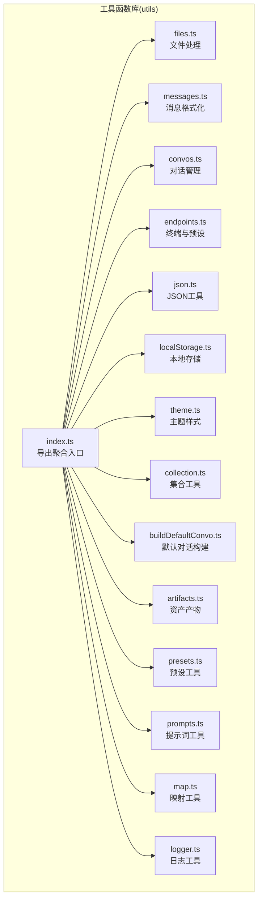
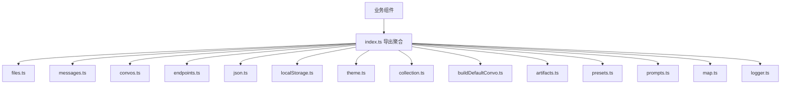
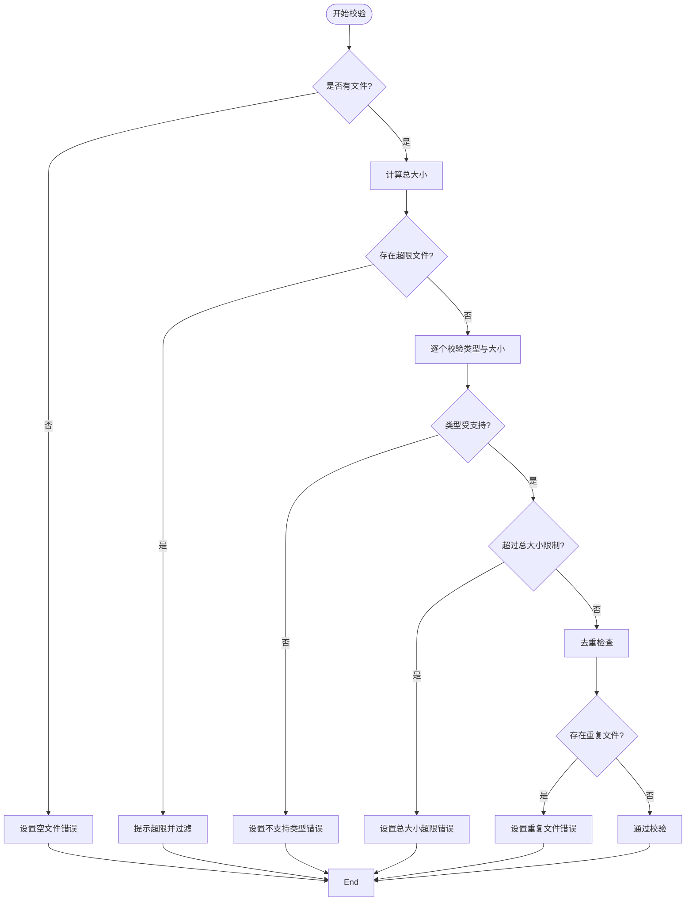
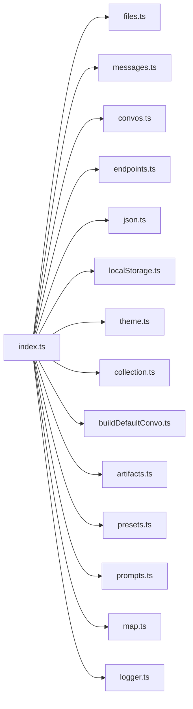

# 工具函数库

<cite>
**本文引用的文件**
- [src/frontend/client/src/utils/index.ts](file://src/frontend/client/src/utils/index.ts)
- [src/frontend/client/src/utils/files.ts](file://src/frontend/client/src/utils/files.ts)
- [src/frontend/client/src/utils/messages.ts](file://src/frontend/client/src/utils/messages.ts)
- [src/frontend/client/src/utils/convos.ts](file://src/frontend/client/src/utils/convos.ts)
- [src/frontend/client/src/utils/endpoints.ts](file://src/frontend/client/src/utils/endpoints.ts)
- [src/frontend/client/src/utils/json.ts](file://src/frontend/client/src/utils/json.ts)
- [src/frontend/client/src/utils/localStorage.ts](file://src/frontend/client/src/utils/localStorage.ts)
- [src/frontend/client/src/utils/theme.ts](file://src/frontend/client/src/utils/theme.ts)
- [src/frontend/client/src/utils/collection.ts](file://src/frontend/client/src/utils/collection.ts)
- [src/frontend/client/src/utils/buildDefaultConvo.ts](file://src/frontend/client/src/utils/buildDefaultConvo.ts)
- [src/frontend/client/src/utils/artifacts.ts](file://src/frontend/client/src/utils/artifacts.ts)
- [src/frontend/client/src/utils/presets.ts](file://src/frontend/client/src/utils/presets.ts)
- [src/frontend/client/src/utils/prompts.ts](file://src/frontend/client/src/utils/prompts.ts)
- [src/frontend/client/src/utils/map.ts](file://src/frontend/client/src/utils/map.ts)
- [src/frontend/client/src/utils/logger.ts](file://src/frontend/client/src/utils/logger.ts)
</cite>

## 目录
1. [简介](#简介)
2. [项目结构](#项目结构)
3. [核心组件](#核心组件)
4. [架构总览](#架构总览)
5. [详细组件分析](#详细组件分析)
6. [依赖关系分析](#依赖关系分析)
7. [性能考量](#性能考量)
8. [故障排查指南](#故障排查指南)
9. [结论](#结论)
10. [附录](#附录)

## 简介
本文件系统性梳理 Bisheng 客户端前端工具函数库，覆盖数据处理、格式转换、业务逻辑封装等关键能力。重点文档化以下模块：
- 文件处理工具：文件类型判定、上传校验、缓存更新、大小格式化等
- 消息格式化工具：消息文本提取、滚动控制、键生成等
- 对话管理工具：对话分组、增删改查、位置保持、模型记忆等
- 终端与预设工具：终端过滤与映射、默认模型选择、实体解析等
- JSON 工具：JSON 校验、格式化、提取
- 本地存储工具：键值读取、清理策略
- 主题与样式：字体尺寸应用、初始主题获取
- 数据集合工具：无限分页数据的增删改、归一化、缓存列表更新
- 默认对话构建：基于历史设置与可用模型生成默认对话
- 资产产物工具：产物模式、模板、依赖、代码预处理
- 提示词工具：变量替换、变量检测与提取、分组映射
- 映射工具：附件、文件、助手、代理、插件、工具调用结果的快速查找
- 日志工具：按环境与标签过滤的日志输出

## 项目结构
工具函数集中于前端客户端目录下的 utils 子目录，采用按功能域拆分的组织方式，便于按需导入与复用。

图表来源
- [src/frontend/client/src/utils/index.ts](file://src/frontend/client/src/utils/index.ts#L1-L276)
- [src/frontend/client/src/utils/files.ts](file://src/frontend/client/src/utils/files.ts#L1-L304)
- [src/frontend/client/src/utils/messages.ts](file://src/frontend/client/src/utils/messages.ts#L1-L84)
- [src/frontend/client/src/utils/convos.ts](file://src/frontend/client/src/utils/convos.ts#L1-L274)
- [src/frontend/client/src/utils/endpoints.ts](file://src/frontend/client/src/utils/endpoints.ts#L1-L263)
- [src/frontend/client/src/utils/json.ts](file://src/frontend/client/src/utils/json.ts#L1-L38)
- [src/frontend/client/src/utils/localStorage.ts](file://src/frontend/client/src/utils/localStorage.ts#L1-L46)
- [src/frontend/client/src/utils/theme.ts](file://src/frontend/client/src/utils/theme.ts#L1-L40)
- [src/frontend/client/src/utils/collection.ts](file://src/frontend/client/src/utils/collection.ts#L1-L221)
- [src/frontend/client/src/utils/buildDefaultConvo.ts](file://src/frontend/client/src/utils/buildDefaultConvo.ts#L1-L90)
- [src/frontend/client/src/utils/artifacts.ts](file://src/frontend/client/src/utils/artifacts.ts#L1-L237)
- [src/frontend/client/src/utils/presets.ts](file://src/frontend/client/src/utils/presets.ts#L1-L93)
- [src/frontend/client/src/utils/prompts.ts](file://src/frontend/client/src/utils/prompts.ts#L1-L105)
- [src/frontend/client/src/utils/map.ts](file://src/frontend/client/src/utils/map.ts#L1-L115)
- [src/frontend/client/src/utils/logger.ts](file://src/frontend/client/src/utils/logger.ts#L1-L50)

章节来源
- [src/frontend/client/src/utils/index.ts](file://src/frontend/client/src/utils/index.ts#L1-L276)

## 核心组件
- 文件处理工具：文件类型判定、上传校验、缓存更新、大小格式化
- 消息格式化工具：消息文本提取、滚动控制、键生成
- 对话管理工具：对话分组、增删改查、位置保持、模型记忆
- 终端与预设工具：终端过滤与映射、默认模型选择、实体解析
- JSON 工具：JSON 校验、格式化、提取
- 本地存储工具：键值读取、清理策略
- 主题与样式：字体尺寸应用、初始主题获取
- 数据集合工具：无限分页数据的增删改、归一化、缓存列表更新
- 默认对话构建：基于历史设置与可用模型生成默认对话
- 资产产物工具：产物模式、模板、依赖、代码预处理
- 提示词工具：变量替换、变量检测与提取、分组映射
- 映射工具：附件、文件、助手、代理、插件、工具调用结果的快速查找
- 日志工具：按环境与标签过滤的日志输出

章节来源
- [src/frontend/client/src/utils/files.ts](file://src/frontend/client/src/utils/files.ts#L1-L304)
- [src/frontend/client/src/utils/messages.ts](file://src/frontend/client/src/utils/messages.ts#L1-L84)
- [src/frontend/client/src/utils/convos.ts](file://src/frontend/client/src/utils/convos.ts#L1-L274)
- [src/frontend/client/src/utils/endpoints.ts](file://src/frontend/client/src/utils/endpoints.ts#L1-L263)
- [src/frontend/client/src/utils/json.ts](file://src/frontend/client/src/utils/json.ts#L1-L38)
- [src/frontend/client/src/utils/localStorage.ts](file://src/frontend/client/src/utils/localStorage.ts#L1-L46)
- [src/frontend/client/src/utils/theme.ts](file://src/frontend/client/src/utils/theme.ts#L1-L40)
- [src/frontend/client/src/utils/collection.ts](file://src/frontend/client/src/utils/collection.ts#L1-L221)
- [src/frontend/client/src/utils/buildDefaultConvo.ts](file://src/frontend/client/src/utils/buildDefaultConvo.ts#L1-L90)
- [src/frontend/client/src/utils/artifacts.ts](file://src/frontend/client/src/utils/artifacts.ts#L1-L237)
- [src/frontend/client/src/utils/presets.ts](file://src/frontend/client/src/utils/presets.ts#L1-L93)
- [src/frontend/client/src/utils/prompts.ts](file://src/frontend/client/src/utils/prompts.ts#L1-L105)
- [src/frontend/client/src/utils/map.ts](file://src/frontend/client/src/utils/map.ts#L1-L115)
- [src/frontend/client/src/utils/logger.ts](file://src/frontend/client/src/utils/logger.ts#L1-L50)

## 架构总览
工具函数库以“按功能域拆分 + 聚合导出”的方式组织，index.ts 作为统一入口，便于在业务组件中按需引入或整体导入。各工具模块职责清晰，耦合度低，便于单元测试与扩展。

图表来源
- [src/frontend/client/src/utils/index.ts](file://src/frontend/client/src/utils/index.ts#L1-L276)

## 详细组件分析

### 文件处理工具（files.ts）
- 功能要点
  - 文件类型判定：支持精确匹配、部分匹配、类别匹配与 Excel MIME 类型识别
  - 日期格式化：支持小屏与常规格式
  - 缓存更新：向查询缓存追加新文件
  - 字节格式化：自动选择单位并保留指定位数小数
  - 上传校验：多维校验（空文件、单文件大小、总大小、类型支持、重复文件），并提供错误提示与本地化文案
- 参数与返回
  - getFileType：输入类型字符串，返回包含图标组件、填充色与标题的对象
  - formatDate：输入日期字符串与屏幕尺寸标志，返回格式化字符串
  - addFileToCache：接收 QueryClient 与新文件对象，更新缓存列表
  - formatBytes：输入字节数与小数位，返回带单位的数值字符串
  - validateFiles：输入文件列表、现有文件集、配置与回调，返回布尔值表示是否通过
- 异常处理
  - 校验阶段对空文件、超限文件、未知类型、重复文件分别给出明确错误信息
  - 缓存更新前检查是否存在旧数据，避免重复写入
- 性能与最佳实践
  - 使用 MIME 类型与扩展名双重推断，提升兼容性
  - 校验时先计算总大小，减少后续无效操作
  - 建议在上传前进行本地预校验，降低服务端压力

图表来源
- [src/frontend/client/src/utils/files.ts](file://src/frontend/client/src/utils/files.ts#L204-L303)

章节来源
- [src/frontend/client/src/utils/files.ts](file://src/frontend/client/src/utils/files.ts#L1-L304)

### 消息格式化工具（messages.ts）
- 功能要点
  - 文本长度与末尾字符：用于生成稳定键
  - 最新文本提取：从消息内容中提取最新文本，支持索引拼接
  - 全部文本拼接：过滤并拼接所有文本片段
  - 文本键生成：结合消息 ID、长度+末尾字符、会话 ID 生成唯一键
  - 滚动控制：滚动到底部并可执行回调
- 参数与返回
  - getLengthAndLastTenChars：输入字符串，返回长度与末尾字符组合
  - getLatestText：输入消息与是否包含索引，返回最新文本
  - getAllContentText：输入消息，返回全部文本
  - getTextKey：输入消息与会话 ID，返回键字符串
  - scrollToEnd：无返回，滚动至底部
- 异常处理
  - 输入为空时返回空字符串，避免异常传播
- 性能与最佳实践
  - 文本键生成用于缓存与排序稳定性，建议在渲染前生成并复用
  - 滚动控制仅在消息 DOM 存在时执行，避免无意义操作

章节来源
- [src/frontend/client/src/utils/messages.ts](file://src/frontend/client/src/utils/messages.ts#L1-L84)

### 对话管理工具（convos.ts）
- 功能要点
  - 日期分组：按今日、昨日、近7天、近30天、年月等规则分组
  - 无限分页数据操作：新增、查找、更新、删除、字段更新（可保持位置）
  - 会话检索：按 ID 在分页数据中查找
  - 模型记忆：将最近一次选择的模型持久化到本地存储
- 参数与返回
  - groupConversationsByDate：输入对话数组，返回分组后的二维数组
  - addConversation/updateConversation/deleteConversation：对无限分页数据进行增删改
  - updateConvoFields：可选择保持原位置或移动至顶部
  - getConversationById：按 ID 查找会话
  - storeEndpointSettings：根据端点类型更新模型记忆
- 异常处理
  - 分组时忽略空值与重复 ID
  - 更新时若未找到则不变更
- 性能与最佳实践
  - 保持位置更新时避免不必要的重排，优先使用 splice 与 unshift
  - 分组排序使用稳定的时间比较，确保展示顺序一致

章节来源
- [src/frontend/client/src/utils/convos.ts](file://src/frontend/client/src/utils/convos.ts#L1-L274)

### 终端与预设工具（endpoints.ts）
- 功能要点
  - 终端过滤与映射：根据配置过滤可用终端，并按顺序排序
  - 字段读取：安全地从终端配置中读取指定属性
  - 会话切换逻辑：根据当前与新端点判断是否切换，支持模块化聊天与助手场景
  - 默认模型规格：按管理员定义、最近选择、首个顺序选择默认规格
  - 图标端点解析：根据图标 URL 或端点类型返回前端显示端点
  - 实体解析：根据端点类型从代理或助手映射中解析实体
- 参数与返回
  - getEndpointsFilter：输入配置，返回过滤映射
  - getAvailableEndpoints：输入过滤映射与配置，返回可用端点数组
  - getEndpointField：输入配置、端点与属性，返回属性值
  - getConvoSwitchLogic：输入会话与新端点，返回模板与切换决策
  - getDefaultModelSpec：输入规格数组，返回默认规格
  - getIconEndpoint：输入配置、图标 URL 与端点，返回显示端点
  - getIconKey：输入端点、类型与配置，返回图标键
  - getEntity：输入端点、ID 与映射，返回实体与类型标记
- 异常处理
  - 读取字段时对空值进行保护
  - 未找到实体时返回空值
- 性能与最佳实践
  - 切换逻辑提前计算端点类型与模块化标识，减少重复判断
  - 图标键解析优先使用显式定义，其次回退到类型或端点

章节来源
- [src/frontend/client/src/utils/endpoints.ts](file://src/frontend/client/src/utils/endpoints.ts#L1-L263)

### JSON 工具（json.ts）
- 功能要点
  - JSON 校验：判断字符串是否为合法 JSON
  - JSON 格式化：尝试格式化为可读缩进
  - JSON 提取：从文本中提取第一个完整 JSON 对象
- 参数与返回
  - isJson：输入字符串，返回布尔值
  - formatJSON：输入字符串，返回格式化后的字符串
  - extractJson：输入字符串，返回提取到的 JSON 片段
- 异常处理
  - 解析失败时返回原始字符串或空串
- 性能与最佳实践
  - 格式化前先做合法性检查，避免抛错
  - 提取时使用计数器跟踪大括号匹配，时间复杂度 O(n)

章节来源
- [src/frontend/client/src/utils/json.ts](file://src/frontend/client/src/utils/json.ts#L1-L38)

### 本地存储工具（localStorage.ts）
- 功能要点
  - 读取：批量读取最近选择模型、工具与会话设置
  - 清理：按前缀与键名规则清理本地存储项
- 参数与返回
  - getLocalStorageItems：返回模型、工具与会话设置对象
  - clearLocalStorage：可跳过特定键，清理匹配键
- 异常处理
  - 解析失败时返回空对象或空数组
- 性能与最佳实践
  - 批量读取减少多次访问本地存储
  - 清理时使用前缀匹配，避免误删

章节来源
- [src/frontend/client/src/utils/localStorage.ts](file://src/frontend/client/src/utils/localStorage.ts#L1-L46)

### 主题与样式（theme.ts）
- 功能要点
  - 字体尺寸应用：根据传入值设置 CSS 变量
  - 初始主题获取：优先读取本地存储，其次匹配系统偏好
- 参数与返回
  - applyFontSize：输入尺寸字符串，设置根节点字体变量
  - getInitialTheme：返回主题字符串
- 异常处理
  - 未定义环境时返回默认主题
- 性能与最佳实践
  - 字体变量一次性设置，避免频繁 DOM 操作

章节来源
- [src/frontend/client/src/utils/theme.ts](file://src/frontend/client/src/utils/theme.ts#L1-L40)

### 数据集合工具（collection.ts）
- 功能要点
  - 新增：若已存在则更新，否则插入到第一页顶部
  - 查找：在分页数据中定位记录
  - 更新：移除原位置并插入到第一页顶部
  - 删除：移除指定记录
  - 归一化：按页大小重组分页，支持唯一性去重
  - 字段更新：按标识字段更新并保持时间戳
  - 缓存列表更新/添加/删除：对 QueryClient 的列表进行原子更新
- 参数与返回
  - addData/updateData/deleteData：对无限分页数据进行增删改
  - findPage：返回页索引与记录索引
  - normalizeData：输入集合与唯一属性，返回重组后的分页数据
  - updateFields/updateCacheList/addToCacheList/removeFromCacheList：对缓存列表进行原子更新
- 异常处理
  - 未找到时返回原数据，避免破坏结构
- 性能与最佳实践
  - 归一化时先合并再切片，减少多次遍历
  - 缓存更新使用不可变拷贝，避免副作用

章节来源
- [src/frontend/client/src/utils/collection.ts](file://src/frontend/client/src/utils/collection.ts#L1-L221)

### 默认对话构建（buildDefaultConvo.ts）
- 功能要点
  - 基于历史设置与可用模型生成默认对话
  - 支持助手与代理端点的 ID 回填
  - 合并工具列表与端点类型
- 参数与返回
  - buildDefaultConvo：输入模型列表、会话、端点与历史设置，返回默认对话
- 异常处理
  - 端点为空时直接返回基础会话
- 性能与最佳实践
  - 优先使用历史设置中的模型与工具，提升用户体验一致性

章节来源
- [src/frontend/client/src/utils/buildDefaultConvo.ts](file://src/frontend/client/src/utils/buildDefaultConvo.ts#L1-L90)

### 资产产物工具（artifacts.ts）
- 功能要点
  - 产物模式：根据是否启用代码产物、shadcn ui 与自定义提示模式返回不同模式
  - 文件名与模板：根据类型与语言返回对应文件名与沙箱模板
  - 依赖管理：按类型返回标准依赖或专用依赖集合
  - 代码预处理：去除思考标签与无代码块的产物头
- 参数与返回
  - getArtifactsMode：输入布尔与模式标志，返回产物模式枚举
  - getArtifactFilename/getTemplate：输入类型与语言，返回文件名与模板
  - getDependencies/getProps：输入类型，返回依赖与沙箱配置
  - preprocessCodeArtifacts：输入文本，返回预处理后的文本
- 异常处理
  - 输入非字符串时返回空串
- 性能与最佳实践
  - 依赖映射集中管理，便于扩展与维护
  - 预处理正则匹配需注意边界，避免误删

章节来源
- [src/frontend/client/src/utils/artifacts.ts](file://src/frontend/client/src/utils/artifacts.ts#L1-L237)

### 预设工具（presets.ts）
- 功能要点
  - 预设标题：根据端点类型与标签生成标题
  - 工具过滤：移除不可用工具，确保预设可用性
- 参数与返回
  - getPresetTitle：输入预设与提及标志，返回标题字符串
  - removeUnavailableTools：输入预设与可用工具映射，返回过滤后的预设
- 异常处理
  - 工具为空时直接返回原预设
- 性能与最佳实践
  - 工具过滤使用映射与过滤，时间复杂度 O(n)

章节来源
- [src/frontend/client/src/utils/presets.ts](file://src/frontend/client/src/utils/presets.ts#L1-L93)

### 提示词工具（prompts.ts）
- 功能要点
  - 变量替换：替换当前日期与当前用户变量
  - 变量检测：排除内置变量后检测剩余变量
  - 变量包装与提取：提供变量包装、去重与统计信息
  - 日期时间格式化：将 ISO 时间格式化为可读字符串
  - 分组映射：将提示词分组数组映射为字典
- 参数与返回
  - replaceSpecialVars：输入文本与用户，返回替换后的文本
  - detectVariables：输入文本，返回是否存在变量
  - wrapVariable：输入变量名，返回包装后的字符串
  - extractUniqueVariables：输入文本，返回去重后的变量数组
  - extractVariableInfo：输入文本，返回变量统计信息
  - formatDateTime：输入时间字符串，返回格式化字符串
  - mapPromptGroups：输入分组数组，返回映射字典
- 异常处理
  - 输入为空时直接返回
- 性能与最佳实践
  - 变量提取使用正则循环，注意内存与时间开销

章节来源
- [src/frontend/client/src/utils/prompts.ts](file://src/frontend/client/src/utils/prompts.ts#L1-L105)

### 映射工具（map.ts）
- 功能要点
  - 附件映射：按 toolCallId 快速查找附件列表
  - 文件映射：按 file_id 快速查找文件
  - 助手与代理映射：按 id 快速查找实体
  - 插件映射：按 pluginKey 快速查找插件
  - 工具调用映射：按消息、部分索引与工具 ID 组合键查找调用结果
  - 插件处理：将字符串或对象形式的工具转换为插件对象
  - 选择插件：返回插件列表与映射
- 参数与返回
  - mapAttachments/mapFiles/mapAssistants/mapAgents：返回映射对象
  - mapPlugins/selectPlugins/processPlugins：返回映射或对象
  - mapToolCalls：返回按键聚合的结果
- 异常处理
  - 空值与无效键被跳过
- 性能与最佳实践
  - 映射建立一次，后续查询 O(1)，适合高频查找场景

章节来源
- [src/frontend/client/src/utils/map.ts](file://src/frontend/client/src/utils/map.ts#L1-L115)

### 日志工具（logger.ts）
- 功能要点
  - 条件输出：开发环境或开启开关时输出
  - 标签过滤：按逗号分隔的过滤列表决定是否输出
  - 多级别输出：支持 log、warn、error、info、debug、dir
- 参数与返回
  - logger 对象：包含多种日志方法
  - shouldLog：输入标签，返回是否允许输出
- 异常处理
  - 过滤为空时默认允许输出
- 性能与最佳实践
  - 过滤列表应尽量精简，避免过多字符串匹配

章节来源
- [src/frontend/client/src/utils/logger.ts](file://src/frontend/client/src/utils/logger.ts#L1-L50)

## 依赖关系分析
- 模块内聚与耦合
  - index.ts 作为聚合入口，仅负责导出，不引入具体实现，降低耦合
  - 各工具模块相对独立，仅依赖少量通用类型与第三方库
- 外部依赖
  - date-fns：用于日期分组与格式化
  - axios：用于文件下载
  - @tanstack/react-query：用于缓存与分页数据操作
  - dedent：用于代码块预处理
- 循环依赖
  - 未发现循环依赖迹象

图表来源
- [src/frontend/client/src/utils/index.ts](file://src/frontend/client/src/utils/index.ts#L1-L276)

## 性能考量
- 时间复杂度
  - 文件校验：O(n) 遍历文件列表与去重集合
  - 会话分组：O(n) 遍历并按规则分组，排序 O(n log n)
  - 缓存列表更新：O(m) 遍历旧列表，m 为旧列表长度
- 空间复杂度
  - 映射类工具：O(n) 建立映射表
  - 归一化：O(n) 合并与切片
- 优化建议
  - 对高频查找使用映射表
  - 对大文本处理使用惰性与流式策略
  - 对缓存更新使用不可变更新，避免深拷贝成本

## 故障排查指南
- 文件上传失败
  - 检查是否触发空文件、超限、类型不支持或重复文件错误
  - 确认 MIME 类型与扩展名是否匹配
- 会话排序异常
  - 确认 updatedAt 字段是否正确更新
  - 检查分组规则与时间范围
- 缓存未更新
  - 确认 QueryClient 的查询键与数据结构一致
  - 检查 setQueryData 的回调是否正确返回新数据
- 日志未输出
  - 检查环境变量与过滤列表
  - 确认标签是否命中过滤规则

章节来源
- [src/frontend/client/src/utils/files.ts](file://src/frontend/client/src/utils/files.ts#L204-L303)
- [src/frontend/client/src/utils/convos.ts](file://src/frontend/client/src/utils/convos.ts#L158-L274)
- [src/frontend/client/src/utils/collection.ts](file://src/frontend/client/src/utils/collection.ts#L177-L221)
- [src/frontend/client/src/utils/logger.ts](file://src/frontend/client/src/utils/logger.ts#L1-L50)

## 结论
该工具函数库以清晰的功能域划分与稳定的接口设计，支撑了前端侧的文件处理、消息格式化、对话管理、终端与预设、JSON 处理、本地存储、主题样式、集合操作、默认对话构建、资产产物、提示词与映射以及日志输出等核心能力。通过聚合导出与按需引入的方式，既保证了易用性，又降低了耦合度。建议在业务组件中遵循“单一职责”原则，优先使用现有工具函数，必要时在工具层扩展并补充测试。

## 附录
- 最佳实践清单
  - 优先使用映射工具进行高频查找
  - 对大文本处理采用惰性与流式策略
  - 缓存更新使用不可变更新，避免副作用
  - 日志输出按标签过滤，避免生产环境噪声
- 测试策略建议
  - 单元测试：针对每个工具函数的边界条件与异常分支
  - 集成测试：模拟业务流程，验证工具链组合效果
  - 性能测试：对大数据量场景进行基准测试与回归测试