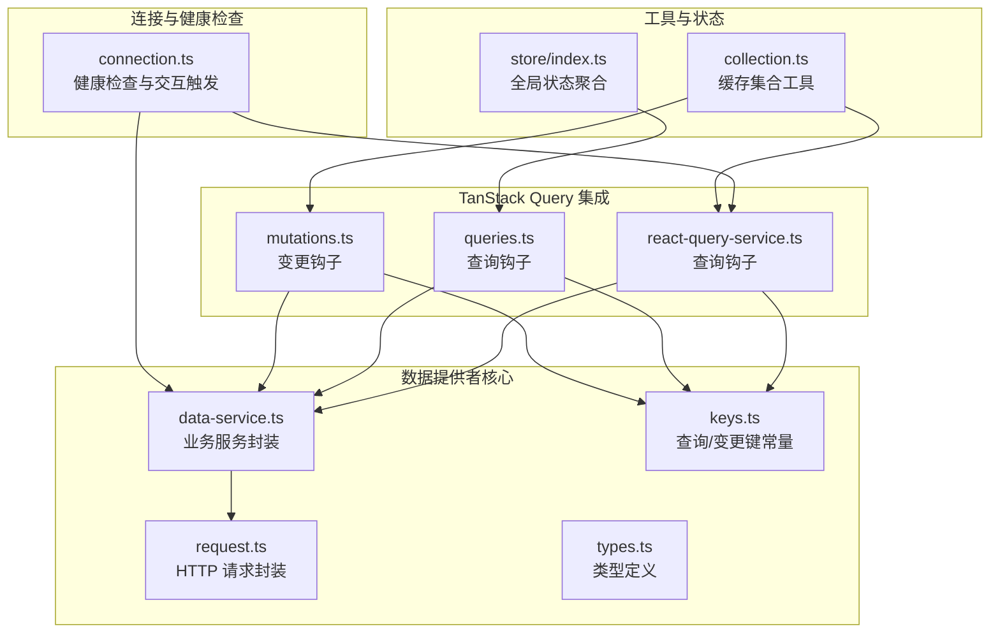
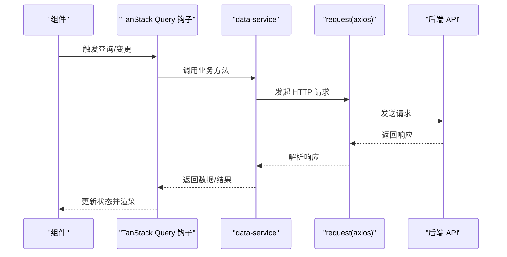
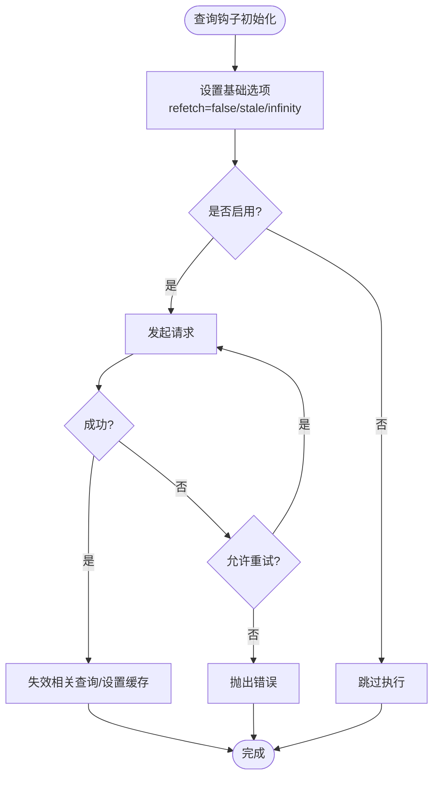
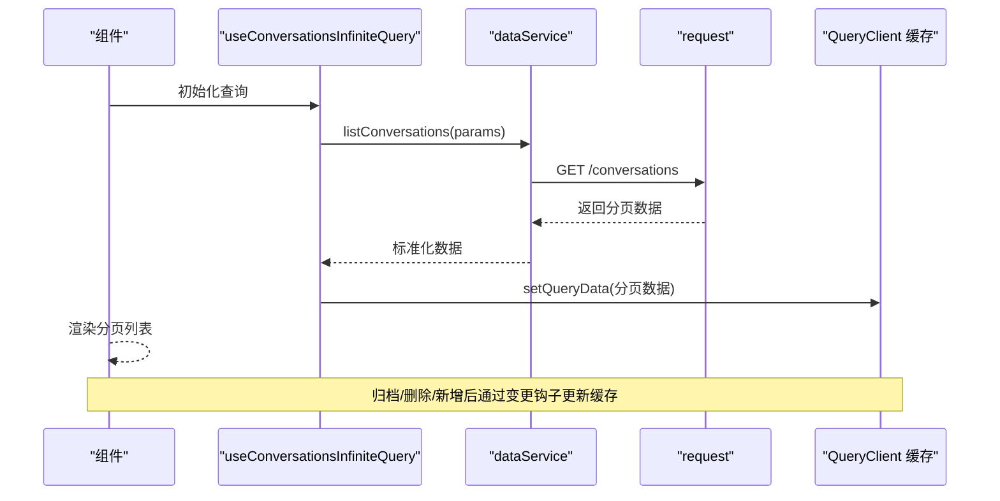
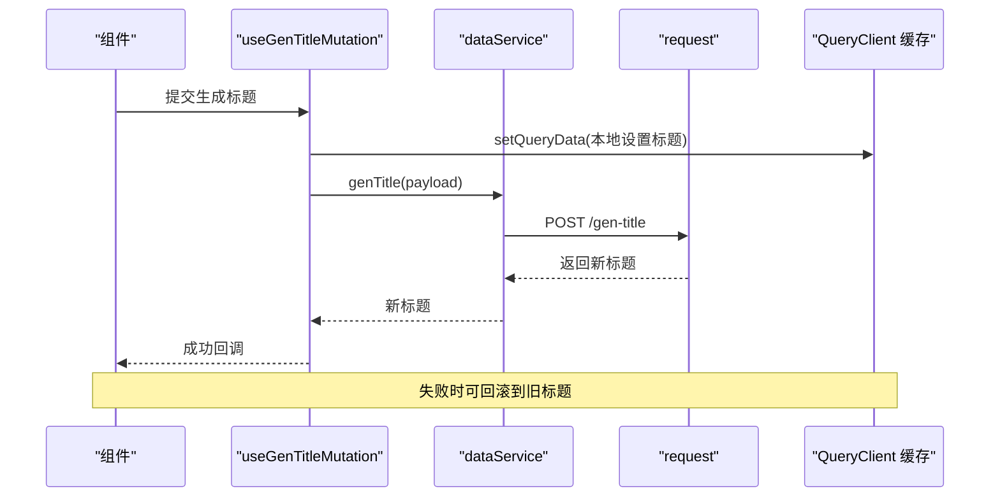
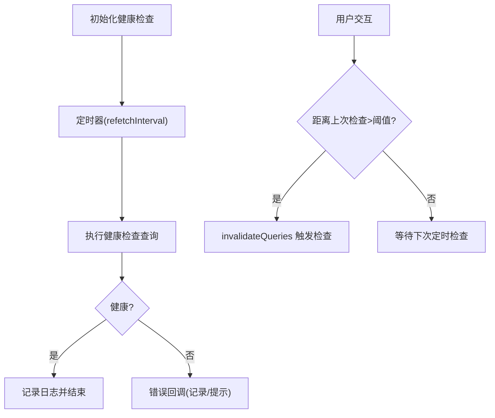
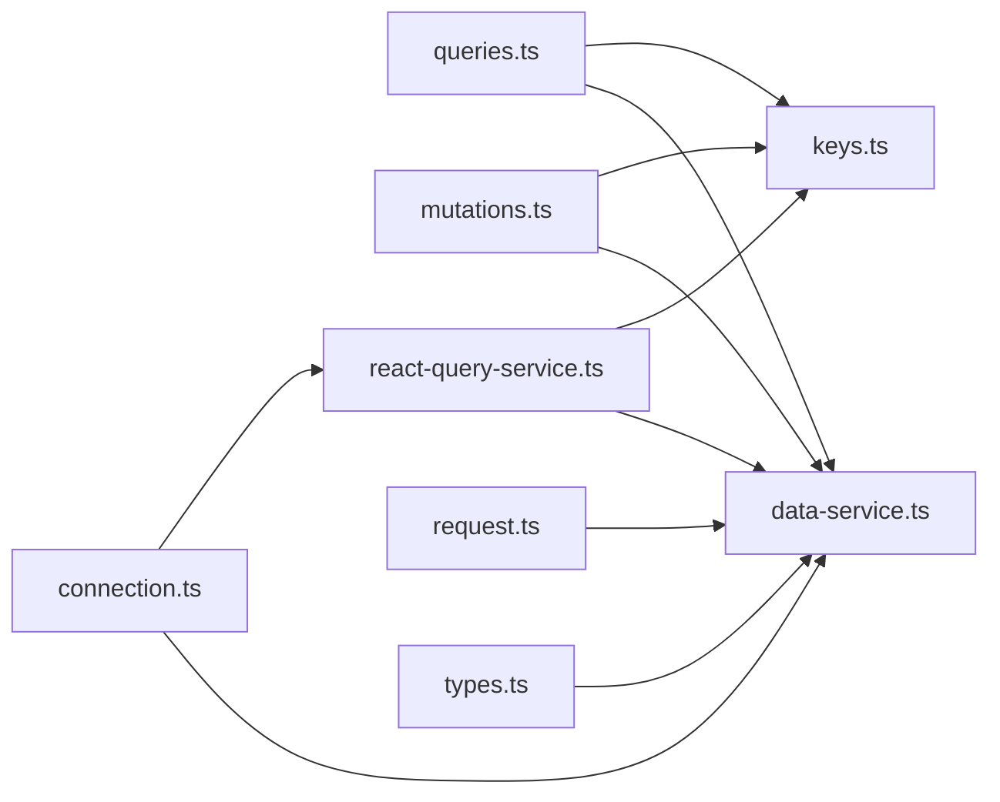

# 数据提供者系统

<cite>
**本文档引用的文件**
- [src/frontend/client/src/data-provider/data-provider/src/index.ts](file://src/frontend/client/src/data-provider/data-provider/src/index.ts)
- [src/frontend/client/src/data-provider/data-provider/src/data-service.ts](file://src/frontend/client/src/data-provider/data-provider/src/data-service.ts)
- [src/frontend/client/src/data-provider/data-provider/src/react-query/react-query-service.ts](file://src/frontend/client/src/data-provider/data-provider/src/react-query/react-query-service.ts)
- [src/frontend/client/src/data-provider/queries.ts](file://src/frontend/client/src/data-provider/queries.ts)
- [src/frontend/client/src/data-provider/mutations.ts](file://src/frontend/client/src/data-provider/mutations.ts)
- [src/frontend/client/src/data-provider/connection.ts](file://src/frontend/client/src/data-provider/connection.ts)
- [src/frontend/client/src/data-provider/data-provider/src/keys.ts](file://src/frontend/client/src/data-provider/data-provider/src/keys.ts)
- [src/frontend/client/src/data-provider/data-provider/src/request.ts](file://src/frontend/client/src/data-provider/data-provider/src/request.ts)
- [src/frontend/client/src/data-provider/data-provider/src/types.ts](file://src/frontend/client/src/data-provider/data-provider/src/types.ts)
- [src/frontend/client/src/utils/collection.ts](file://src/frontend/client/src/utils/collection.ts)
- [src/frontend/client/src/store/index.ts](file://src/frontend/client/src/store/index.ts)
- [src/frontend/client/src/pages/appChat/useWebsocket.ts](file://src/frontend/client/src/pages/appChat/useWebsocket.ts)
- [src/frontend/client/src/hooks/Websocket/index.tsx](file://src/frontend/client/src/hooks/Websocket/index.tsx)
</cite>

## 目录
1. [引言](#引言)
2. [项目结构](#项目结构)
3. [核心组件](#核心组件)
4. [架构总览](#架构总览)
5. [详细组件分析](#详细组件分析)
6. [依赖关系分析](#依赖关系分析)
7. [性能考虑](#性能考虑)
8. [故障排查指南](#故障排查指南)
9. [结论](#结论)
10. [附录](#附录)

## 引言
本文件面向 Bisheng 客户端前端“数据提供者系统”，系统性阐述数据获取、缓存与状态管理的实现架构，重点覆盖 TanStack Query 的集成与配置、查询与变更管理、连接与健康检查、数据同步与生命周期管理、缓存策略与错误处理、与后端 API 的集成方式、实时数据更新与离线支持，以及数据流优化、性能监控与调试工具的使用方法。目标是帮助开发者快速理解并高效扩展该系统。

## 项目结构
数据提供者系统位于前端客户端工程中，采用模块化组织：核心服务层封装 HTTP 请求与业务逻辑，TanStack Query 层负责查询与变更钩子，查询与变更钩子分别在独立文件中导出，连接与健康检查在独立模块中维护，键值常量集中定义，类型与工具函数辅助数据转换与集合操作。

图示来源
- [src/frontend/client/src/data-provider/data-provider/src/data-service.ts](file://src/frontend/client/src/data-provider/data-provider/src/data-service.ts#L1-L1019)
- [src/frontend/client/src/data-provider/data-provider/src/request.ts](file://src/frontend/client/src/data-provider/data-provider/src/request.ts#L1-L187)
- [src/frontend/client/src/data-provider/data-provider/src/keys.ts](file://src/frontend/client/src/data-provider/data-provider/src/keys.ts#L1-L76)
- [src/frontend/client/src/data-provider/data-provider/src/types.ts](file://src/frontend/client/src/data-provider/data-provider/src/types.ts#L1-L534)
- [src/frontend/client/src/data-provider/data-provider/src/react-query/react-query-service.ts](file://src/frontend/client/src/data-provider/data-provider/src/react-query/react-query-service.ts#L1-L380)
- [src/frontend/client/src/data-provider/queries.ts](file://src/frontend/client/src/data-provider/queries.ts#L1-L570)
- [src/frontend/client/src/data-provider/mutations.ts](file://src/frontend/client/src/data-provider/mutations.ts#L1-L1099)
- [src/frontend/client/src/data-provider/connection.ts](file://src/frontend/client/src/data-provider/connection.ts#L1-L48)
- [src/frontend/client/src/utils/collection.ts](file://src/frontend/client/src/utils/collection.ts#L189-L220)
- [src/frontend/client/src/store/index.ts](file://src/frontend/client/src/store/index.ts#L1-L33)

章节来源
- [src/frontend/client/src/data-provider/data-provider/src/index.ts](file://src/frontend/client/src/data-provider/data-provider/src/index.ts#L1-L37)
- [src/frontend/client/src/data-provider/data-provider/src/data-service.ts](file://src/frontend/client/src/data-provider/data-provider/src/data-service.ts#L1-L1019)
- [src/frontend/client/src/data-provider/data-provider/src/request.ts](file://src/frontend/client/src/data-provider/data-provider/src/request.ts#L1-L187)

## 核心组件
- 业务服务封装（data-service）：统一暴露各类后端 API 调用，包含认证、对话、助手、工具、文件、语音等能力，负责参数构造、响应解析与部分数据转换。
- TanStack Query 查询与变更钩子：提供 useQuery/useMutation 封装，统一配置过期、重试、失效策略，结合查询键进行缓存与同步。
- 查询与变更钩子：按功能域拆分（如对话、助手、提示词、标签等），在各自文件中导出钩子，便于按需引入与测试。
- 健康检查与连接管理：提供定时健康检查与交互式健康检查触发，确保网络连通性与服务可用性。
- 缓存工具与集合操作：提供 setQueryData 批量更新、列表增删改写等工具，保障复杂场景下的缓存一致性。
- 全局状态与开关：通过 Recoil 状态控制查询启用/禁用，配合查询钩子的 enabled 选项实现全局暂停/恢复。

章节来源
- [src/frontend/client/src/data-provider/data-provider/src/data-service.ts](file://src/frontend/client/src/data-provider/data-provider/src/data-service.ts#L1-L1019)
- [src/frontend/client/src/data-provider/data-provider/src/react-query/react-query-service.ts](file://src/frontend/client/src/data-provider/data-provider/src/react-query/react-query-service.ts#L1-L380)
- [src/frontend/client/src/data-provider/queries.ts](file://src/frontend/client/src/data-provider/queries.ts#L1-L570)
- [src/frontend/client/src/data-provider/mutations.ts](file://src/frontend/client/src/data-provider/mutations.ts#L1-L1099)
- [src/frontend/client/src/data-provider/connection.ts](file://src/frontend/client/src/data-provider/connection.ts#L1-L48)
- [src/frontend/client/src/utils/collection.ts](file://src/frontend/client/src/utils/collection.ts#L189-L220)
- [src/frontend/client/src/store/index.ts](file://src/frontend/client/src/store/index.ts#L1-L33)

## 架构总览
系统以“请求层 → 业务服务层 → TanStack Query 层 → 组件层”的分层架构运行。请求层基于 axios 封装，统一处理拦截器与刷新流程；业务服务层对接后端接口，提供领域内 API；TanStack Query 层负责缓存、失效、并发与乐观更新；组件层通过钩子消费数据并驱动 UI 更新。

图示来源
- [src/frontend/client/src/data-provider/data-provider/src/data-service.ts](file://src/frontend/client/src/data-provider/data-provider/src/data-service.ts#L1-L1019)
- [src/frontend/client/src/data-provider/data-provider/src/request.ts](file://src/frontend/client/src/data-provider/data-provider/src/request.ts#L1-L187)
- [src/frontend/client/src/data-provider/data-provider/src/react-query/react-query-service.ts](file://src/frontend/client/src/data-provider/data-provider/src/react-query/react-query-service.ts#L1-L380)

## 详细组件分析

### TanStack Query 集成与配置
- 查询钩子：统一设置 refetchOnWindowFocus/refetchOnReconnect/refetchOnMount/false，避免无意义的自动刷新；staleTime/cacheTime 控制缓存新鲜度与内存占用；部分查询禁用 retry 以降低重试成本。
- 变更钩子：在 onSuccess 中调用 queryClient.invalidateQueries 或 setQueryData 实现乐观更新与缓存同步，保证多处缓存一致。
- 查询键：集中定义于 keys.ts，确保跨模块一致的键空间，便于精确失效与缓存命中。

图示来源
- [src/frontend/client/src/data-provider/data-provider/src/react-query/react-query-service.ts](file://src/frontend/client/src/data-provider/data-provider/src/react-query/react-query-service.ts#L1-L380)
- [src/frontend/client/src/data-provider/data-provider/src/keys.ts](file://src/frontend/client/src/data-provider/data-provider/src/keys.ts#L1-L76)

章节来源
- [src/frontend/client/src/data-provider/data-provider/src/react-query/react-query-service.ts](file://src/frontend/client/src/data-provider/data-provider/src/react-query/react-query-service.ts#L1-L380)
- [src/frontend/client/src/data-provider/data-provider/src/keys.ts](file://src/frontend/client/src/data-provider/data-provider/src/keys.ts#L1-L76)

### 查询管理与数据同步
- 对话与消息：提供按会话 ID 的消息查询与共享消息查询，支持分享态读取；通过 setQueryData 在变更后即时更新本地缓存。
- 助手与工具：按端点与版本动态加载助手列表、单个助手详情、动作与文档，结合端点配置与用户密钥状态决定是否启用。
- 提示词与分类：提供分页查询与随机推荐，支持按组与标签过滤。
- 标签与归档：提供对话标签的增删改与批量替换，支持归档/取消归档后的缓存同步。

图示来源
- [src/frontend/client/src/data-provider/queries.ts](file://src/frontend/client/src/data-provider/queries.ts#L119-L147)
- [src/frontend/client/src/data-provider/data-provider/src/data-service.ts](file://src/frontend/client/src/data-provider/data-provider/src/data-service.ts#L725-L780)
- [src/frontend/client/src/data-provider/mutations.ts](file://src/frontend/client/src/data-provider/mutations.ts#L139-L210)

章节来源
- [src/frontend/client/src/data-provider/queries.ts](file://src/frontend/client/src/data-provider/queries.ts#L1-L570)
- [src/frontend/client/src/data-provider/mutations.ts](file://src/frontend/client/src/data-provider/mutations.ts#L1-L1099)

### 变更操作与乐观更新
- 对话标题生成：先在本地设置标题，再异步提交后端，失败回滚。
- 对话更新/归档/删除：通过 setQueryData 与 normalizeData 保持分页缓存一致性；删除后从所有相关查询中清理。
- 标签管理：支持创建、更新、删除标签，并在所有对话与缓存中同步替换。

图示来源
- [src/frontend/client/src/data-provider/mutations.ts](file://src/frontend/client/src/data-provider/mutations.ts#L33-L59)
- [src/frontend/client/src/data-provider/data-provider/src/data-service.ts](file://src/frontend/client/src/data-provider/data-provider/src/data-service.ts#L1-L1019)

章节来源
- [src/frontend/client/src/data-provider/mutations.ts](file://src/frontend/client/src/data-provider/mutations.ts#L1-L1099)

### 连接管理与健康检查
- 周期性健康检查：定时轮询后端健康接口，避免长驻连接带来的资源消耗。
- 交互式健康检查：在用户交互后若超过阈值则主动触发检查，提升体验。
- 错误处理：记录日志并降级处理，不影响主流程。

图示来源
- [src/frontend/client/src/data-provider/connection.ts](file://src/frontend/client/src/data-provider/connection.ts#L1-L48)

章节来源
- [src/frontend/client/src/data-provider/connection.ts](file://src/frontend/client/src/data-provider/connection.ts#L1-L48)

### 缓存策略与集合工具
- 列表增删改：addToCacheList/removeFromCacheList 支持在查询缓存中追加或移除条目，适用于消息、标签等列表型数据。
- 本地化更新：通过 setQueryData 对象属性更新，减少不必要的重渲染。
- 分页规范化：在归档/删除/新增后，使用 normalizeData 保持分页结构与页面大小一致。

章节来源
- [src/frontend/client/src/utils/collection.ts](file://src/frontend/client/src/utils/collection.ts#L189-L220)
- [src/frontend/client/src/data-provider/mutations.ts](file://src/frontend/client/src/data-provider/mutations.ts#L164-L197)

### 生命周期管理与全局开关
- 查询启用/禁用：通过 store.queriesEnabled 控制全局查询开关，避免在特定场景下触发网络请求。
- 查询键空间：集中定义 QueryKeys/MutationKeys，确保跨模块一致的失效与缓存策略。

章节来源
- [src/frontend/client/src/store/index.ts](file://src/frontend/client/src/store/index.ts#L1-L33)
- [src/frontend/client/src/data-provider/data-provider/src/keys.ts](file://src/frontend/client/src/data-provider/data-provider/src/keys.ts#L1-L76)

### 与后端 API 的集成方式
- 请求封装：request.ts 基于 axios，统一处理 Content-Type、多部分上传、TTS 下载与响应类型；内置拦截器处理 401/403 等错误。
- 业务服务：data-service.ts 将端点、参数与响应映射为领域模型，屏蔽底层差异。
- 类型体系：types.ts 定义请求/响应/错误等强类型，确保调用安全与 IDE 支持。

章节来源
- [src/frontend/client/src/data-provider/data-provider/src/request.ts](file://src/frontend/client/src/data-provider/data-provider/src/request.ts#L1-L187)
- [src/frontend/client/src/data-provider/data-provider/src/data-service.ts](file://src/frontend/client/src/data-provider/data-provider/src/data-service.ts#L1-L1019)
- [src/frontend/client/src/data-provider/data-provider/src/types.ts](file://src/frontend/client/src/data-provider/data-provider/src/types.ts#L1-L534)

### 实时数据更新与离线支持
- WebSocket：聊天与工作台任务流通过 WebSocket 推送实时消息，支持断线重连与状态同步。
- 离线策略：查询默认禁用自动刷新，结合缓存时间与手动失效，减少离线时的无效请求；健康检查在交互时触发，提升弱网体验。

章节来源
- [src/frontend/client/src/pages/appChat/useWebsocket.ts](file://src/frontend/client/src/pages/appChat/useWebsocket.ts#L33-L50)
- [src/frontend/client/src/hooks/Websocket/index.tsx](file://src/frontend/client/src/hooks/Websocket/index.tsx#L1-L310)
- [src/frontend/client/src/data-provider/data-provider/src/react-query/react-query-service.ts](file://src/frontend/client/src/data-provider/data-provider/src/react-query/react-query-service.ts#L1-L380)

## 依赖关系分析

图示来源
- [src/frontend/client/src/data-provider/queries.ts](file://src/frontend/client/src/data-provider/queries.ts#L1-L570)
- [src/frontend/client/src/data-provider/mutations.ts](file://src/frontend/client/src/data-provider/mutations.ts#L1-L1099)
- [src/frontend/client/src/data-provider/data-provider/src/react-query/react-query-service.ts](file://src/frontend/client/src/data-provider/data-provider/src/react-query/react-query-service.ts#L1-L380)
- [src/frontend/client/src/data-provider/data-provider/src/keys.ts](file://src/frontend/client/src/data-provider/data-provider/src/keys.ts#L1-L76)
- [src/frontend/client/src/data-provider/data-provider/src/data-service.ts](file://src/frontend/client/src/data-provider/data-provider/src/data-service.ts#L1-L1019)
- [src/frontend/client/src/data-provider/connection.ts](file://src/frontend/client/src/data-provider/connection.ts#L1-L48)
- [src/frontend/client/src/data-provider/data-provider/src/request.ts](file://src/frontend/client/src/data-provider/data-provider/src/request.ts#L1-L187)
- [src/frontend/client/src/data-provider/data-provider/src/types.ts](file://src/frontend/client/src/data-provider/data-provider/src/types.ts#L1-L534)

章节来源
- [src/frontend/client/src/data-provider/queries.ts](file://src/frontend/client/src/data-provider/queries.ts#L1-L570)
- [src/frontend/client/src/data-provider/mutations.ts](file://src/frontend/client/src/data-provider/mutations.ts#L1-L1099)
- [src/frontend/client/src/data-provider/data-provider/src/react-query/react-query-service.ts](file://src/frontend/client/src/data-provider/data-provider/src/react-query/react-query-service.ts#L1-L380)

## 性能考虑
- 查询配置：默认关闭 refetchOnWindowFocus/refetchOnReconnect/refetchOnMount，降低后台切换与网络波动带来的重复请求；对模型配置等静态数据设置 staleTime=Infinity，减少不必要刷新。
- 缓存时间：对分页列表设置合理的 cacheTime，避免长时间驻留内存；对高频但小体量的数据设置较短 staleTime，平衡新鲜度与内存。
- 乐观更新：在变更成功后立即更新本地缓存，减少等待时间；失败时回滚，保证一致性。
- 并发控制：通过 queryClient.getQueryData/getQueryCache 获取当前缓存，避免重复请求与竞态。
- 网络拦截：在 request 层统一处理 401/403，避免组件层分散处理导致的重复请求与状态混乱。

## 故障排查指南
- 健康检查失败：查看 connection.ts 中的错误回调与日志输出，确认后端可达性与网络状态。
- 查询未生效：检查查询键是否正确、enabled 是否被全局开关禁用、staleTime/cacheTime 是否过短导致频繁失效。
- 变更未同步：确认 onSuccess 中是否调用了 invalidateQueries 或 setQueryData，以及是否遗漏了相关查询键。
- WebSocket 断连：检查 useWebsocket 与 hooks/Websocket 中的重连逻辑与最大重试次数，确认协议与路径正确。
- 401/403：查看 request.ts 的拦截器逻辑，确认是否需要登录或令牌刷新流程。

章节来源
- [src/frontend/client/src/data-provider/connection.ts](file://src/frontend/client/src/data-provider/connection.ts#L1-L48)
- [src/frontend/client/src/data-provider/data-provider/src/react-query/react-query-service.ts](file://src/frontend/client/src/data-provider/data-provider/src/react-query/react-query-service.ts#L1-L380)
- [src/frontend/client/src/data-provider/mutations.ts](file://src/frontend/client/src/data-provider/mutations.ts#L1-L1099)
- [src/frontend/client/src/data-provider/data-provider/src/request.ts](file://src/frontend/client/src/data-provider/data-provider/src/request.ts#L1-L187)
- [src/frontend/client/src/pages/appChat/useWebsocket.ts](file://src/frontend/client/src/pages/appChat/useWebsocket.ts#L33-L50)
- [src/frontend/client/src/hooks/Websocket/index.tsx](file://src/frontend/client/src/hooks/Websocket/index.tsx#L1-L310)

## 结论
数据提供者系统通过清晰的分层与统一的 TanStack Query 集成，实现了稳定、可扩展且高性能的数据访问与状态管理。查询与变更钩子的标准化配置、精确的缓存策略与交互式健康检查，共同保障了用户体验与系统可靠性。建议在后续迭代中持续优化缓存键设计、增强错误边界与可观测性，并根据业务增长调整并发与刷新策略。

## 附录
- 关键文件清单与职责概览
  - data-service.ts：后端 API 调用封装与领域模型转换
  - request.ts：axios 封装与拦截器
  - react-query-service.ts：查询/变更钩子与缓存策略
  - queries.ts/mutations.ts：按功能域拆分的钩子导出
  - connection.ts：健康检查与交互触发
  - keys.ts：查询/变更键常量
  - collection.ts：缓存集合工具
  - store/index.ts：全局状态聚合与查询开关