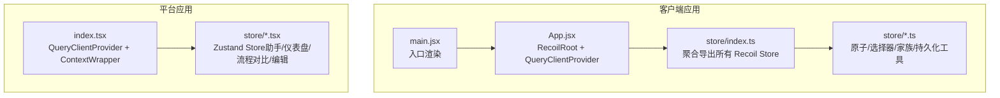
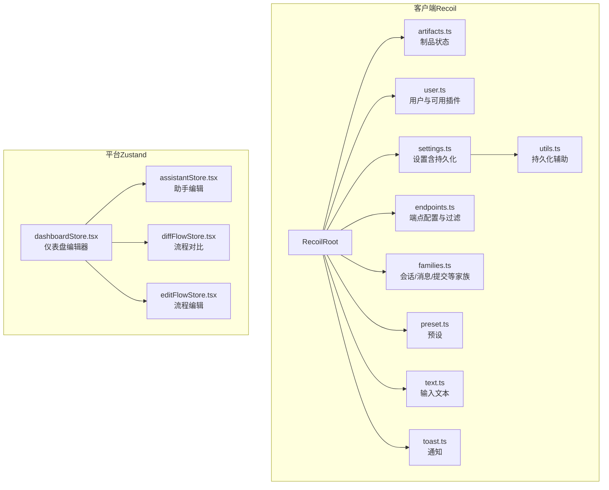
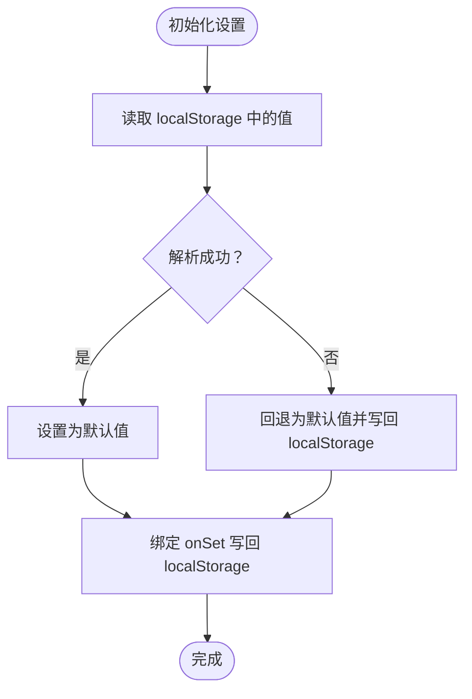
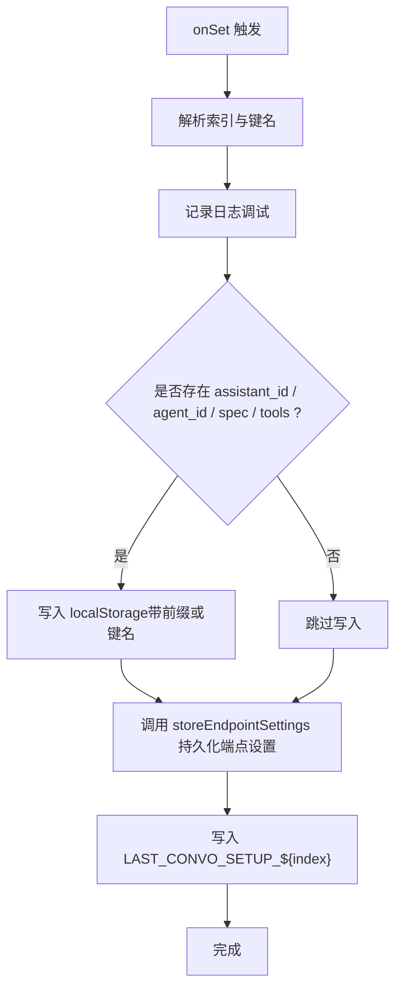
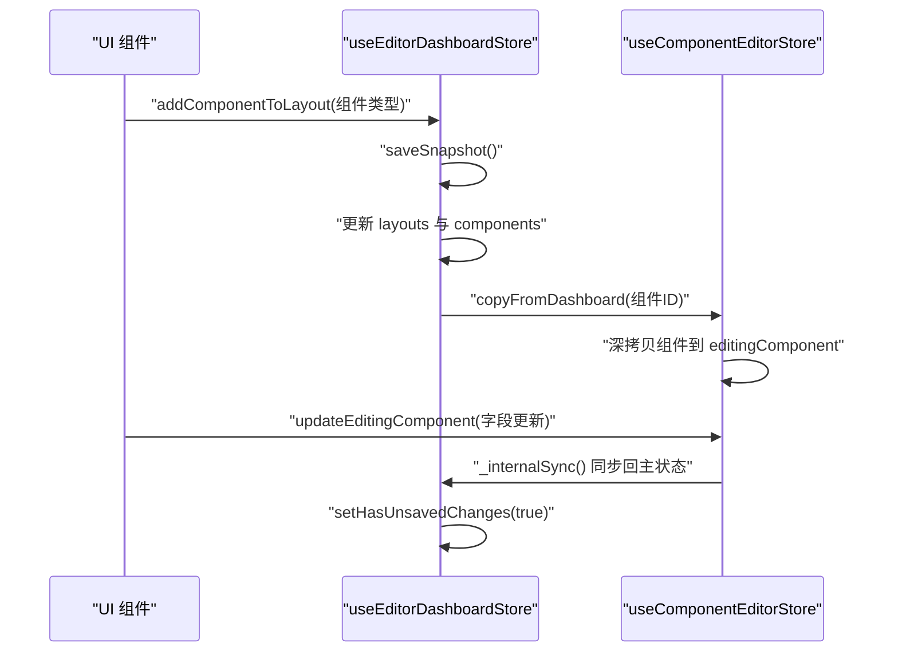
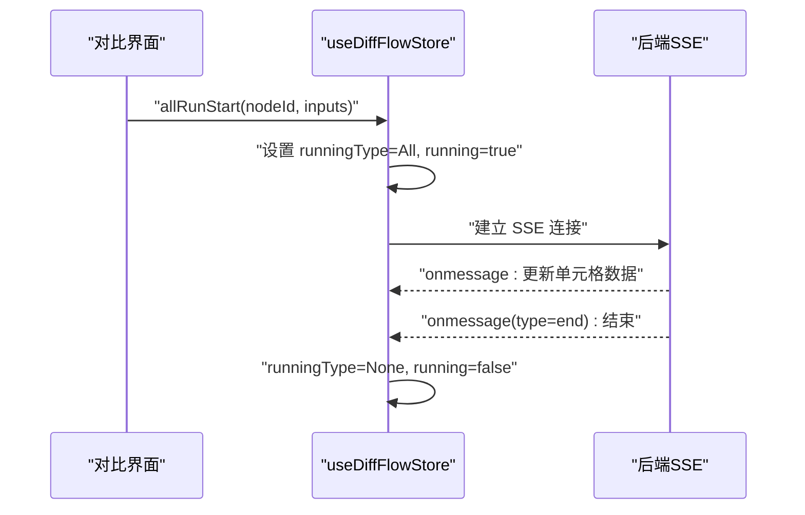
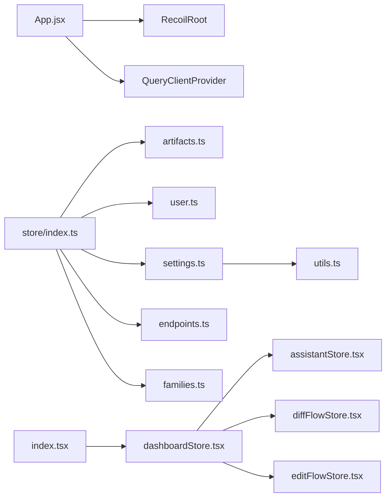

# 状态管理系统

<cite>
**本文引用的文件**
- [src/frontend/client/src/App.jsx](file://src/frontend/client/src/App.jsx)
- [src/frontend/client/src/main.jsx](file://src/frontend/client/src/main.jsx)
- [src/frontend/client/src/store/index.ts](file://src/frontend/client/src/store/index.ts)
- [src/frontend/client/src/store/artifacts.ts](file://src/frontend/client/src/store/artifacts.ts)
- [src/frontend/client/src/store/user.ts](file://src/frontend/client/src/store/user.ts)
- [src/frontend/client/src/store/settings.ts](file://src/frontend/client/src/store/settings.ts)
- [src/frontend/client/src/store/endpoints.ts](file://src/frontend/client/src/store/endpoints.ts)
- [src/frontend/client/src/store/families.ts](file://src/frontend/client/src/store/families.ts)
- [src/frontend/client/src/store/preset.ts](file://src/frontend/client/src/store/preset.ts)
- [src/frontend/client/src/store/text.ts](file://src/frontend/client/src/store/text.ts)
- [src/frontend/client/src/store/toast.ts](file://src/frontend/client/src/store/toast.ts)
- [src/frontend/client/src/store/utils.ts](file://src/frontend/client/src/store/utils.ts)
- [src/frontend/platform/src/index.tsx](file://src/frontend/platform/src/index.tsx)
- [src/frontend/platform/src/store/assistantStore.tsx](file://src/frontend/platform/src/store/assistantStore.tsx)
- [src/frontend/platform/src/store/dashboardStore.tsx](file://src/frontend/platform/src/store/dashboardStore.tsx)
- [src/frontend/platform/src/store/diffFlowStore.tsx](file://src/frontend/platform/src/store/diffFlowStore.tsx)
- [src/frontend/platform/src/store/editFlowStore.tsx](file://src/frontend/platform/src/store/editFlowStore.tsx)
</cite>

## 目录
1. [简介](#简介)
2. [项目结构](#项目结构)
3. [核心组件](#核心组件)
4. [架构总览](#架构总览)
5. [组件详解](#组件详解)
6. [依赖分析](#依赖分析)
7. [性能考量](#性能考量)
8. [故障排查指南](#故障排查指南)
9. [结论](#结论)
10. [附录](#附录)

## 简介
本文件系统性梳理 Bisheng 客户端前端状态管理方案，覆盖两类主流状态库：Recoil（客户端）与 Zustand（平台侧）。文档重点阐述：
- 本地状态管理与全局状态管理的边界与协作
- 持久化存储策略（内存 + localStorage）
- 各类 Store 的职责分工（制品、端点配置、用户信息、会话家族、预设、文本、提示框等）
- 状态更新机制、订阅模式与响应式设计
- 状态与 UI 的绑定关系、性能优化与内存管理
- 状态调试工具使用与常见问题排查

## 项目结构
前端状态相关代码分布于两个入口应用：
- 客户端应用（client）：基于 React + Recoil，集中于 src/frontend/client/src/store
- 平台应用（platform）：基于 React + Zustand，集中于 src/frontend/platform/src/store

图表来源
- [src/frontend/client/src/App.jsx](file://src/frontend/client/src/App.jsx#L1-L53)
- [src/frontend/client/src/main.jsx](file://src/frontend/client/src/main.jsx#L1-L18)
- [src/frontend/client/src/store/index.ts](file://src/frontend/client/src/store/index.ts#L1-L33)
- [src/frontend/platform/src/index.tsx](file://src/frontend/platform/src/index.tsx#L1-L36)

章节来源
- [src/frontend/client/src/App.jsx](file://src/frontend/client/src/App.jsx#L1-L53)
- [src/frontend/client/src/main.jsx](file://src/frontend/client/src/main.jsx#L1-L18)
- [src/frontend/client/src/store/index.ts](file://src/frontend/client/src/store/index.ts#L1-L33)
- [src/frontend/platform/src/index.tsx](file://src/frontend/platform/src/index.tsx#L1-L36)

## 核心组件
- 客户端 Recoil Store 聚合导出：统一挂载与命名空间隔离，便于按模块引入与调试
- 客户端持久化工具：基于 Recoil effects 与 localStorage 的双向同步
- 客户端会话家族：围绕“会话维度”的原子家族与选择器家族，支持多会话并行与清理
- 平台 Zustand Store：以功能域划分（助手、仪表盘、流程对比、流程编辑），具备撤销/重做与快照能力

章节来源
- [src/frontend/client/src/store/index.ts](file://src/frontend/client/src/store/index.ts#L1-L33)
- [src/frontend/client/src/store/utils.ts](file://src/frontend/client/src/store/utils.ts#L1-L32)
- [src/frontend/client/src/store/families.ts](file://src/frontend/client/src/store/families.ts#L1-L408)
- [src/frontend/platform/src/store/assistantStore.tsx](file://src/frontend/platform/src/store/assistantStore.tsx#L1-L87)
- [src/frontend/platform/src/store/dashboardStore.tsx](file://src/frontend/platform/src/store/dashboardStore.tsx#L1-L720)
- [src/frontend/platform/src/store/diffFlowStore.tsx](file://src/frontend/platform/src/store/diffFlowStore.tsx#L1-L266)
- [src/frontend/platform/src/store/editFlowStore.tsx](file://src/frontend/platform/src/store/editFlowStore.tsx#L1-L53)

## 架构总览
客户端采用 Recoil 的原子（atom）、选择器（selector）、原子家族（atomFamily）与选择器家族（selectorFamily）构建状态树；平台采用 Zustand 的 slice store 管理复杂业务状态，并通过 Provider 层级注入。

图表来源
- [src/frontend/client/src/store/artifacts.ts](file://src/frontend/client/src/store/artifacts.ts#L1-L49)
- [src/frontend/client/src/store/user.ts](file://src/frontend/client/src/store/user.ts#L1-L18)
- [src/frontend/client/src/store/settings.ts](file://src/frontend/client/src/store/settings.ts#L1-L80)
- [src/frontend/client/src/store/endpoints.ts](file://src/frontend/client/src/store/endpoints.ts#L1-L56)
- [src/frontend/client/src/store/families.ts](file://src/frontend/client/src/store/families.ts#L1-L408)
- [src/frontend/client/src/store/preset.ts](file://src/frontend/client/src/store/preset.ts#L1-L18)
- [src/frontend/client/src/store/text.ts](file://src/frontend/client/src/store/text.ts#L1-L9)
- [src/frontend/client/src/store/toast.ts](file://src/frontend/client/src/store/toast.ts#L1-L15)
- [src/frontend/client/src/store/utils.ts](file://src/frontend/client/src/store/utils.ts#L1-L32)
- [src/frontend/platform/src/store/assistantStore.tsx](file://src/frontend/platform/src/store/assistantStore.tsx#L1-L87)
- [src/frontend/platform/src/store/dashboardStore.tsx](file://src/frontend/platform/src/store/dashboardStore.tsx#L1-L720)
- [src/frontend/platform/src/store/diffFlowStore.tsx](file://src/frontend/platform/src/store/diffFlowStore.tsx#L1-L266)
- [src/frontend/platform/src/store/editFlowStore.tsx](file://src/frontend/platform/src/store/editFlowStore.tsx#L1-L53)

## 组件详解

### 客户端状态聚合与入口
- 入口文件在客户端应用中通过 RecoilRoot 包裹，确保所有组件可访问 Recoil 状态树
- store/index.ts 将各模块导出的 Recoil 对象聚合，形成统一命名空间，便于按需引入与调试

章节来源
- [src/frontend/client/src/App.jsx](file://src/frontend/client/src/App.jsx#L1-L53)
- [src/frontend/client/src/main.jsx](file://src/frontend/client/src/main.jsx#L1-L18)
- [src/frontend/client/src/store/index.ts](file://src/frontend/client/src/store/index.ts#L1-L33)

### 制品状态（Artifacts）
- 关键原子：制品映射、当前选中制品 ID、制品面板可见性
- 设计要点：以 key-value 映射承载多制品，配合 effects 实现变更日志记录，便于调试与审计

章节来源
- [src/frontend/client/src/store/artifacts.ts](file://src/frontend/client/src/store/artifacts.ts#L1-L49)

### 用户与可用插件（User）
- 关键原子：当前用户信息、可用插件集合
- 设计要点：将用户态与插件态解耦，避免 UI 层直接依赖后端返回的复杂结构

章节来源
- [src/frontend/client/src/store/user.ts](file://src/frontend/client/src/store/user.ts#L1-L18)

### 设置与持久化（Settings + Utils）
- 静态设置：滚动控制、侧边栏显示、设置视图等
- 持久化设置：通过 atomWithLocalStorage 将设置写入 localStorage，并在初始化时恢复
- 设计要点：将“静态”与“持久化”两类设置分离，降低副作用复杂度

图表来源
- [src/frontend/client/src/store/utils.ts](file://src/frontend/client/src/store/utils.ts#L1-L32)
- [src/frontend/client/src/store/settings.ts](file://src/frontend/client/src/store/settings.ts#L1-L80)

章节来源
- [src/frontend/client/src/store/settings.ts](file://src/frontend/client/src/store/settings.ts#L1-L80)
- [src/frontend/client/src/store/utils.ts](file://src/frontend/client/src/store/utils.ts#L1-L32)

### 端点配置（Endpoints）
- 关键原子：端点配置映射、端点查询开关
- 关键选择器：插件列表选择器、端点过滤映射
- 设计要点：以枚举键名组织配置，选择器对配置进行派生与过滤，减少 UI 层重复计算

章节来源
- [src/frontend/client/src/store/endpoints.ts](file://src/frontend/client/src/store/endpoints.ts#L1-L56)

### 会话家族（Conversations Family）
- 原子家族：按会话索引维护会话、最新消息、提交、文本、选项设置、弹窗显示等
- 选择器家族：按会话索引提供只读派生视图
- 清理工具：提供批量清理会话、提交、最新消息的能力，支持跳过根会话
- 设计要点：通过 effects 将关键会话信息持久化到 localStorage，支持重启恢复

图表来源
- [src/frontend/client/src/store/families.ts](file://src/frontend/client/src/store/families.ts#L70-L115)

章节来源
- [src/frontend/client/src/store/families.ts](file://src/frontend/client/src/store/families.ts#L1-L408)

### 预设与文本（Preset, Text）
- 预设：默认预设与预设模态可见性
- 文本：通用输入文本原子
- 设计要点：将 UI 交互状态与业务数据解耦，便于复用与测试

章节来源
- [src/frontend/client/src/store/preset.ts](file://src/frontend/client/src/store/preset.ts#L1-L18)
- [src/frontend/client/src/store/text.ts](file://src/frontend/client/src/store/text.ts#L1-L9)

### 提示框（Toast）
- 关键原子：提示框状态（打开、消息、严重级别、图标）
- 设计要点：统一的提示框状态，便于全局控制与样式一致性

章节来源
- [src/frontend/client/src/store/toast.ts](file://src/frontend/client/src/store/toast.ts#L1-L15)

### 平台状态：助手编辑（assistantStore）
- 状态：助手基础信息、提示词、引导语、工具、工作流、知识库、状态等
- 行为：分发动作更新助手状态、加载助手详情、保存后标记未更改、销毁时重置
- 设计要点：集中式 reducer 更新，简化复杂对象的局部更新

章节来源
- [src/frontend/platform/src/store/assistantStore.tsx](file://src/frontend/platform/src/store/assistantStore.tsx#L1-L87)

### 平台状态：仪表盘编辑器（dashboardStore）
- 状态：当前仪表盘、布局、刷新触发器、查询组件参数、历史快照（撤销/重做）
- 行为：添加/删除/复制组件、更新组件、刷新单个/联动图表、自动刷新初始化、撤销/重做、快照保存
- 设计要点：将“主状态”与“影子编辑状态”解耦，支持组件级折叠状态持久化与批量操作

图表来源
- [src/frontend/platform/src/store/dashboardStore.tsx](file://src/frontend/platform/src/store/dashboardStore.tsx#L112-L211)
- [src/frontend/platform/src/store/dashboardStore.tsx](file://src/frontend/platform/src/store/dashboardStore.tsx#L577-L716)

章节来源
- [src/frontend/platform/src/store/dashboardStore.tsx](file://src/frontend/platform/src/store/dashboardStore.tsx#L1-L720)

### 平台状态：流程对比（diffFlowStore）
- 状态：多版本流程数组、问题列表、运行状态、单元格引用
- 行为：初始化首个版本、添加/移除对比版本、批量/行列运行、事件流接收结果
- 设计要点：基于 SSE 的流式结果更新，结合运行类型区分全量/行/列对比

图表来源
- [src/frontend/platform/src/store/diffFlowStore.tsx](file://src/frontend/platform/src/store/diffFlowStore.tsx#L138-L192)
- [src/frontend/platform/src/store/diffFlowStore.tsx](file://src/frontend/platform/src/store/diffFlowStore.tsx#L204-L248)

章节来源
- [src/frontend/platform/src/store/diffFlowStore.tsx](file://src/frontend/platform/src/store/diffFlowStore.tsx#L1-L266)

### 平台状态：流程编辑（editFlowStore）
- 状态：原始流程、编辑副本、序列化字符串、正在编辑的节点
- 行为：切换技能时加载流程，克隆以便保存前编辑，序列化用于变更检测
- 设计要点：通过序列化字符串快速判断是否发生改动，避免深层比较

章节来源
- [src/frontend/platform/src/store/editFlowStore.tsx](file://src/frontend/platform/src/store/editFlowStore.tsx#L1-L53)

## 依赖分析
- 客户端
  - RecoilRoot 作为全局状态容器，包裹 QueryClientProvider 与主题/无障碍等 Provider
  - store/index.ts 将各模块导出的 Recoil 对象聚合，形成统一入口
  - settings.ts 依赖 utils.ts 提供的持久化辅助函数
  - families.ts 依赖 localStorage 前缀常量与端点设置存储工具
- 平台
  - index.tsx 注入 QueryClientProvider 与 ContextWrapper
  - dashboardStore 与其他 store（assistant/diff/edit）协同，形成完整的编辑工作流

图表来源
- [src/frontend/client/src/App.jsx](file://src/frontend/client/src/App.jsx#L1-L53)
- [src/frontend/client/src/store/index.ts](file://src/frontend/client/src/store/index.ts#L1-L33)
- [src/frontend/client/src/store/settings.ts](file://src/frontend/client/src/store/settings.ts#L1-L80)
- [src/frontend/client/src/store/utils.ts](file://src/frontend/client/src/store/utils.ts#L1-L32)
- [src/frontend/client/src/store/families.ts](file://src/frontend/client/src/store/families.ts#L1-L408)
- [src/frontend/platform/src/index.tsx](file://src/frontend/platform/src/index.tsx#L1-L36)
- [src/frontend/platform/src/store/dashboardStore.tsx](file://src/frontend/platform/src/store/dashboardStore.tsx#L1-L720)
- [src/frontend/platform/src/store/assistantStore.tsx](file://src/frontend/platform/src/store/assistantStore.tsx#L1-L87)
- [src/frontend/platform/src/store/diffFlowStore.tsx](file://src/frontend/platform/src/store/diffFlowStore.tsx#L1-L266)
- [src/frontend/platform/src/store/editFlowStore.tsx](file://src/frontend/platform/src/store/editFlowStore.tsx#L1-L53)

章节来源
- [src/frontend/client/src/App.jsx](file://src/frontend/client/src/App.jsx#L1-L53)
- [src/frontend/client/src/store/index.ts](file://src/frontend/client/src/store/index.ts#L1-L33)
- [src/frontend/platform/src/index.tsx](file://src/frontend/platform/src/index.tsx#L1-L36)

## 性能考量
- 原子家族与选择器家族
  - 通过按索引拆分状态，避免全局重渲染；仅受影响的分支订阅者更新
  - 使用 selector 完成派生计算，减少重复计算与内存占用
- 持久化策略
  - settings.ts 将持久化与静态设置分离，仅对必要字段写入 localStorage，降低 IO 开销
  - families.ts 在 effects 中按需写入关键字段，避免大对象频繁序列化
- 平台 Store
  - dashboardStore 限制历史快照数量（最多 50 步），防止内存膨胀
  - 通过 isInternalOperation 标志避免撤销/重做过程中的快照循环
- 请求缓存
  - 客户端与平台均使用 QueryClientProvider，合理配置 refetch 策略，避免重复请求

章节来源
- [src/frontend/client/src/store/settings.ts](file://src/frontend/client/src/store/settings.ts#L1-L80)
- [src/frontend/client/src/store/families.ts](file://src/frontend/client/src/store/families.ts#L1-L408)
- [src/frontend/platform/src/store/dashboardStore.tsx](file://src/frontend/platform/src/store/dashboardStore.tsx#L454-L473)

## 故障排查指南
- 状态未持久化或恢复失败
  - 检查 settings.ts 中的持久化键名与默认值是否一致
  - 若 localStorage 中存在异常 JSON，utils.ts 会回退默认值并重写，确认错误日志
- 会话状态未恢复
  - 检查 families.ts 中 effects 是否正确写入 localStorage（assistant_id、agent_id、spec、tools、LAST_CONVO_SETUP_*）
  - 确认 storeEndpointSettings 工具调用是否成功
- 提示框不显示
  - 检查 toastState 的 open/message/severity 字段是否被正确更新
- 图表刷新无效
  - 检查 dashboardStore 的 chartRefreshTriggers 是否被正确递增
  - 确认查询组件参数 queryComponentParams 是否已设置
- 对比运行无结果
  - 检查 diffFlowStore 的 SSE 连接是否建立，onerror 是否触发
  - 确认 cellRefs 是否正确绑定到对应单元格实例

章节来源
- [src/frontend/client/src/store/utils.ts](file://src/frontend/client/src/store/utils.ts#L1-L32)
- [src/frontend/client/src/store/families.ts](file://src/frontend/client/src/store/families.ts#L70-L115)
- [src/frontend/client/src/store/toast.ts](file://src/frontend/client/src/store/toast.ts#L1-L15)
- [src/frontend/platform/src/store/dashboardStore.tsx](file://src/frontend/platform/src/store/dashboardStore.tsx#L269-L358)
- [src/frontend/platform/src/store/diffFlowStore.tsx](file://src/frontend/platform/src/store/diffFlowStore.tsx#L204-L248)

## 结论
Bisheng 前端状态管理在客户端采用 Recoil 的原子/选择器/家族体系，在平台采用 Zustand 的功能域 Store。二者分别针对不同场景：客户端强调细粒度状态与持久化，平台强调复杂业务流程与编辑体验。通过清晰的职责划分、合理的持久化策略与完善的调试与性能优化手段，整体状态管理具备良好的可维护性与扩展性。

## 附录
- 调试建议
  - 客户端：利用 effects 日志定位状态变更来源；使用 React DevTools + Recoil Tracer 查看订阅关系
  - 平台：在 dashboardStore 中开启 debugLog 输出，观察快照与撤销/重做链路
- 最佳实践
  - 将 UI 交互状态与业务数据分离，优先使用 selector/selectorFamily 进行派生
  - 对大对象持久化采用按需写入策略，避免频繁序列化
  - 在平台 Store 中谨慎使用深拷贝，必要时使用结构化克隆或浅拷贝+增量更新