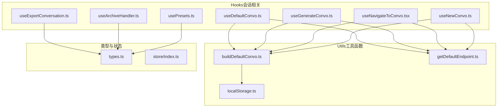
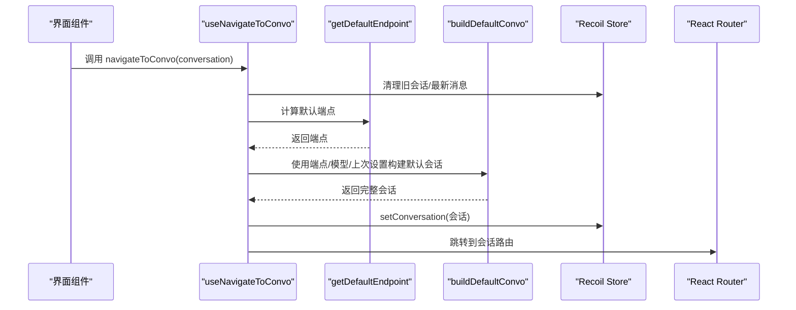
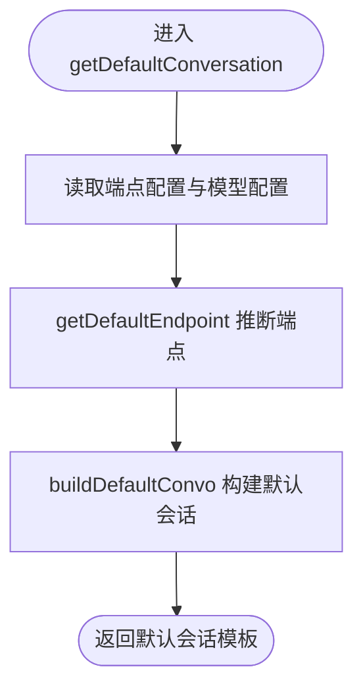
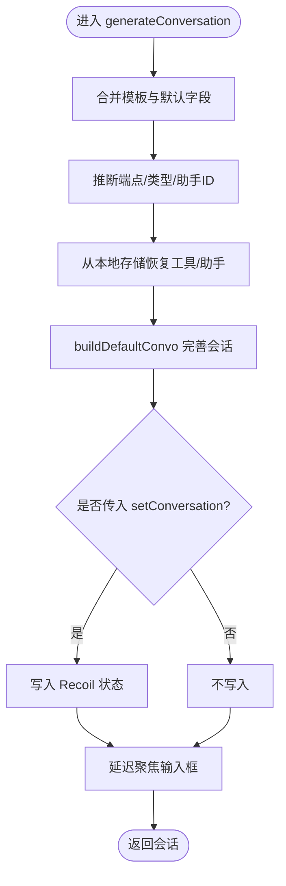
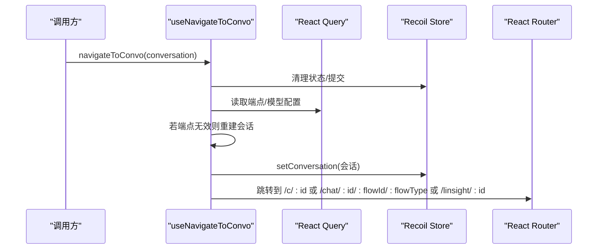
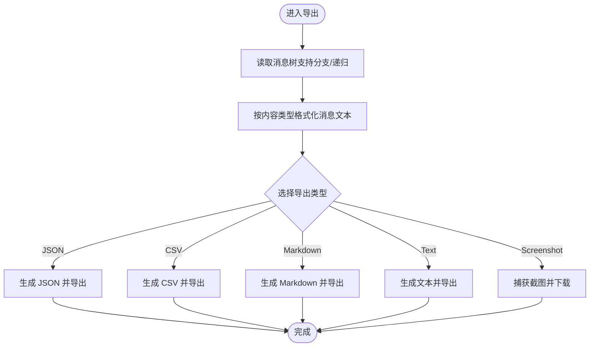
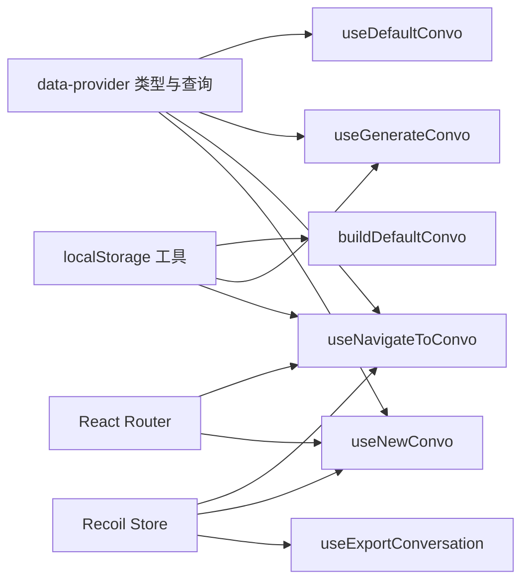

# 会话管理 Hook

<cite>
**本文引用的文件**
- [useDefaultConvo.ts](file://src/frontend/client/src/hooks/Conversations/useDefaultConvo.ts)
- [useGenerateConvo.ts](file://src/frontend/client/src/hooks/Conversations/useGenerateConvo.ts)
- [useNavigateToConvo.tsx](file://src/frontend/client/src/hooks/Conversations/useNavigateToConvo.tsx)
- [useExportConversation.ts](file://src/frontend/client/src/hooks/Conversations/useExportConversation.ts)
- [useArchiveHandler.ts](file://src/frontend/client/src/hooks/Conversations/useArchiveHandler.ts)
- [usePresets.ts](file://src/frontend/client/src/hooks/Conversations/usePresets.ts)
- [useNewConvo.ts](file://src/frontend/client/src/hooks/useNewConvo.ts)
- [buildDefaultConvo.ts](file://src/frontend/client/src/utils/buildDefaultConvo.ts)
- [getDefaultEndpoint.ts](file://src/frontend/client/src/utils/getDefaultEndpoint.ts)
- [localStorage.ts](file://src/frontend/client/src/utils/localStorage.ts)
- [types.ts](file://src/frontend/client/src/data-provider/data-provider/src/types.ts)
- [store/index.ts](file://src/frontend/client/src/store/index.ts)
</cite>

## 目录
1. [简介](#简介)
2. [项目结构](#项目结构)
3. [核心组件](#核心组件)
4. [架构总览](#架构总览)
5. [详细组件分析](#详细组件分析)
6. [依赖关系分析](#依赖关系分析)
7. [性能考量](#性能考量)
8. [故障排查指南](#故障排查指南)
9. [结论](#结论)
10. [附录](#附录)

## 简介
本技术文档聚焦于 Bisheng 前端“会话管理”相关自定义 Hook，系统性阐述其设计模式与实现原理，覆盖会话创建、导航、归档、导出等关键能力。重点文档化以下核心 Hook：useDefaultConvo、useGenerateConvo、useNavigateToConvo，并说明它们在会话状态管理、本地存储、会话列表维护中的职责与交互方式；同时给出参数接口、返回值结构、使用约束及与聊天数据、用户偏好设置的最佳实践。

## 项目结构
围绕会话管理的相关代码主要位于前端客户端的 hooks/Conversations 与 utils 目录，配合 data-provider 类型定义与 store 状态管理：

**图表来源**
- [useDefaultConvo.ts](file://src/frontend/client/src/hooks/Conversations/useDefaultConvo.ts#L1-L37)
- [useGenerateConvo.ts](file://src/frontend/client/src/hooks/Conversations/useGenerateConvo.ts#L1-L150)
- [useNavigateToConvo.tsx](file://src/frontend/client/src/hooks/Conversations/useNavigateToConvo.tsx#L1-L111)
- [useExportConversation.ts](file://src/frontend/client/src/hooks/Conversations/useExportConversation.ts#L1-L382)
- [useArchiveHandler.ts](file://src/frontend/client/src/hooks/Conversations/useArchiveHandler.ts#L1-L52)
- [usePresets.ts](file://src/frontend/client/src/hooks/Conversations/usePresets.ts#L1-L256)
- [useNewConvo.ts](file://src/frontend/client/src/hooks/useNewConvo.ts#L1-L292)
- [buildDefaultConvo.ts](file://src/frontend/client/src/utils/buildDefaultConvo.ts#L1-L90)
- [getDefaultEndpoint.ts](file://src/frontend/client/src/utils/getDefaultEndpoint.ts#L1-L66)
- [localStorage.ts](file://src/frontend/client/src/utils/localStorage.ts#L1-L45)
- [types.ts](file://src/frontend/client/src/data-provider/data-provider/src/types.ts#L1-L200)
- [store/index.ts](file://src/frontend/client/src/store/index.ts#L1-L33)

**章节来源**
- [useDefaultConvo.ts](file://src/frontend/client/src/hooks/Conversations/useDefaultConvo.ts#L1-L37)
- [useGenerateConvo.ts](file://src/frontend/client/src/hooks/Conversations/useGenerateConvo.ts#L1-L150)
- [useNavigateToConvo.tsx](file://src/frontend/client/src/hooks/Conversations/useNavigateToConvo.tsx#L1-L111)
- [useExportConversation.ts](file://src/frontend/client/src/hooks/Conversations/useExportConversation.ts#L1-L382)
- [useArchiveHandler.ts](file://src/frontend/client/src/hooks/Conversations/useArchiveHandler.ts#L1-L52)
- [usePresets.ts](file://src/frontend/client/src/hooks/Conversations/usePresets.ts#L1-L256)
- [useNewConvo.ts](file://src/frontend/client/src/hooks/useNewConvo.ts#L1-L292)
- [buildDefaultConvo.ts](file://src/frontend/client/src/utils/buildDefaultConvo.ts#L1-L90)
- [getDefaultEndpoint.ts](file://src/frontend/client/src/utils/getDefaultEndpoint.ts#L1-L66)
- [localStorage.ts](file://src/frontend/client/src/utils/localStorage.ts#L1-L45)
- [types.ts](file://src/frontend/client/src/data-provider/data-provider/src/types.ts#L1-L200)
- [store/index.ts](file://src/frontend/client/src/store/index.ts#L1-L33)

## 核心组件
- useDefaultConvo：基于端点配置与模型配置，生成默认会话模板，用于后续创建或切换会话。
- useGenerateConvo：根据模板、预设与模型配置生成具体会话对象，支持助手端点与工具选择逻辑，并可回填到 Recoil 状态。
- useNavigateToConvo：负责导航到指定会话，处理端点缺失/变更场景下的兜底重建、消息查询缓存失效与路由跳转。
- useExportConversation：将会话消息树导出为多种格式（JSON、CSV、Markdown、文本、截图），并可包含选项与分支/递归控制。
- useArchiveHandler：封装归档/取消归档会话的调用与导航回退逻辑。
- usePresets：管理预设集合、默认预设加载、导入/导出/删除/更新预设，以及与会话切换的联动。
- useNewConvo：统一的新建/切换会话入口，负责端点推断、助手 ID 选择、默认模型回填、路由跳转与焦点管理。

**章节来源**
- [useDefaultConvo.ts](file://src/frontend/client/src/hooks/Conversations/useDefaultConvo.ts#L11-L34)
- [useGenerateConvo.ts](file://src/frontend/client/src/hooks/Conversations/useGenerateConvo.ts#L20-L147)
- [useNavigateToConvo.tsx](file://src/frontend/client/src/hooks/Conversations/useNavigateToConvo.tsx#L9-L108)
- [useExportConversation.ts](file://src/frontend/client/src/hooks/Conversations/useExportConversation.ts#L29-L381)
- [useArchiveHandler.ts](file://src/frontend/client/src/hooks/Conversations/useArchiveHandler.ts#L9-L51)
- [usePresets.ts](file://src/frontend/client/src/hooks/Conversations/usePresets.ts#L23-L255)
- [useNewConvo.ts](file://src/frontend/client/src/hooks/useNewConvo.ts#L35-L289)

## 架构总览
下图展示会话管理 Hook 的高层交互：从“端点/模型配置”和“本地存储”中提取上下文，构建默认会话，再通过导航 Hook 完成路由与状态同步，最终由导出/归档等 Hook 完成数据持久化与外部输出。

**图表来源**
- [useNavigateToConvo.tsx](file://src/frontend/client/src/hooks/Conversations/useNavigateToConvo.tsx#L17-L70)
- [getDefaultEndpoint.ts](file://src/frontend/client/src/utils/getDefaultEndpoint.ts#L54-L63)
- [buildDefaultConvo.ts](file://src/frontend/client/src/utils/buildDefaultConvo.ts#L10-L87)
- [store/index.ts](file://src/frontend/client/src/store/index.ts#L1-L33)

## 详细组件分析

### useDefaultConvo：默认会话模板生成
- 职责：根据端点配置与模型配置，结合上次会话设置，生成标准化的默认会话模板。
- 关键流程：
  - 读取端点配置与模型配置。
  - 通过 getDefaultEndpoint 推断端点。
  - 调用 buildDefaultConvo 生成会话对象。
- 参数与返回：
  - 输入：{ conversation, preset }
  - 返回：默认会话模板（Partial<TConversation>）
- 使用约束：
  - 需确保端点配置与模型配置已就绪。
  - 若 preset 提供了 endpointType，将被保留以避免端点混用。

**图表来源**
- [useDefaultConvo.ts](file://src/frontend/client/src/hooks/Conversations/useDefaultConvo.ts#L17-L31)
- [getDefaultEndpoint.ts](file://src/frontend/client/src/utils/getDefaultEndpoint.ts#L54-L63)
- [buildDefaultConvo.ts](file://src/frontend/client/src/utils/buildDefaultConvo.ts#L10-L87)

**章节来源**
- [useDefaultConvo.ts](file://src/frontend/client/src/hooks/Conversations/useDefaultConvo.ts#L1-L37)
- [buildDefaultConvo.ts](file://src/frontend/client/src/utils/buildDefaultConvo.ts#L1-L90)
- [getDefaultEndpoint.ts](file://src/frontend/client/src/utils/getDefaultEndpoint.ts#L1-L66)

### useGenerateConvo：会话生成与助手/工具适配
- 职责：根据模板、预设与模型配置生成具体会话对象，处理助手端点与工具选择，必要时回填到 Recoil。
- 关键流程：
  - 合并模板与默认字段。
  - 推断端点类型与助手 ID。
  - 依据本地存储恢复上次工具/助手选择。
  - 调用 buildDefaultConvo 完善会话。
  - 可选设置到 Recoil 并延迟聚焦输入框。
- 参数与返回：
  - 输入：{ index, rootIndex, setConversation?, template?, preset?, modelsData? }
  - 返回：{ generateConversation }
- 使用约束：
  - 当存在 rootConvo 且 conversationId 已存在时，会复制 conversationId。
  - 若端点非助手端点却携带 assistant_id，将被清理。

**图表来源**
- [useGenerateConvo.ts](file://src/frontend/client/src/hooks/Conversations/useGenerateConvo.ts#L52-L144)
- [buildDefaultConvo.ts](file://src/frontend/client/src/utils/buildDefaultConvo.ts#L10-L87)
- [localStorage.ts](file://src/frontend/client/src/utils/localStorage.ts#L1-L45)

**章节来源**
- [useGenerateConvo.ts](file://src/frontend/client/src/hooks/Conversations/useGenerateConvo.ts#L1-L150)
- [buildDefaultConvo.ts](file://src/frontend/client/src/utils/buildDefaultConvo.ts#L1-L90)
- [localStorage.ts](file://src/frontend/client/src/utils/localStorage.ts#L1-L45)

### useNavigateToConvo：会话导航与路由跳转
- 职责：导航到指定会话，处理端点缺失/变更场景下的兜底重建、消息查询缓存失效与路由跳转。
- 关键流程：
  - 校验输入会话，记录已设置会话标记。
  - 清理最新消息与会话状态。
  - 若会话端点无效，重新推断端点并重建会话。
  - 写入 Recoil 会话状态，按 flowType 跳转不同路由。
- 参数与返回：
  - 输入：navigateToConvo(conversation?, _resetLatestMessage?, invalidateMessages?)
  - 返回：{ navigateToConvo, navigateWithLastTools }
- 使用约束：
  - invalidateMessages 为真时，会失效对应会话的消息查询缓存。
  - navigateWithLastTools 对 gptPlugins 端点自动回填上次工具集。

**图表来源**
- [useNavigateToConvo.tsx](file://src/frontend/client/src/hooks/Conversations/useNavigateToConvo.tsx#L17-L70)
- [store/index.ts](file://src/frontend/client/src/store/index.ts#L1-L33)

**章节来源**
- [useNavigateToConvo.tsx](file://src/frontend/client/src/hooks/Conversations/useNavigateToConvo.tsx#L1-L111)

### useExportConversation：会话导出
- 职责：将会话消息树导出为多种格式（JSON、CSV、Markdown、文本、截图），并可包含选项与分支/递归控制。
- 关键流程：
  - 读取消息树（支持分支与递归）。
  - 根据内容类型格式化消息文本。
  - 生成目标格式并触发下载。
- 参数与返回：
  - 输入：{ conversation, filename, type, includeOptions, exportBranches, recursive }
  - 返回：{ exportConversation }
- 使用约束：
  - type 支持 json/text/markdown/csv/screenshot。
  - includeOptions 控制是否导出会话选项。

**图表来源**
- [useExportConversation.ts](file://src/frontend/client/src/hooks/Conversations/useExportConversation.ts#L50-L381)

**章节来源**
- [useExportConversation.ts](file://src/frontend/client/src/hooks/Conversations/useExportConversation.ts#L1-L382)

### useArchiveHandler：会话归档/取消归档
- 职责：封装归档/取消归档会话的调用与导航回退逻辑。
- 关键流程：
  - 调用归档/取消归档 Mutation。
  - 成功时若当前会话即目标会话或为 new，则新建会话并跳转至 /c/new。
- 参数与返回：
  - 输入：(e?) => Promise<void>
  - 返回：无（副作用：导航与刷新视图）

**章节来源**
- [useArchiveHandler.ts](file://src/frontend/client/src/hooks/Conversations/useArchiveHandler.ts#L1-L52)

### usePresets：预设管理与会话联动
- 职责：管理预设集合、默认预设加载、导入/导出/删除/更新预设，以及与会话切换的联动。
- 关键流程：
  - 加载预设并设置默认预设。
  - 选择预设时计算是否需要切换端点类型与模块化会话。
  - 更新默认预设时触发新建会话。
- 参数与返回：
  - 输入：无（内部持有 Recoil 状态）
  - 返回：{ presetsQuery, onSetDefaultPreset, onFileSelected, onSelectPreset, onChangePreset, clearAllPresets, onDeletePreset, submitPreset, exportPreset }

**章节来源**
- [usePresets.ts](file://src/frontend/client/src/hooks/Conversations/usePresets.ts#L1-L256)

### useNewConvo：新建/切换会话统一入口
- 职责：统一的新建/切换会话入口，负责端点推断、助手 ID 选择、默认模型回填、路由跳转与焦点管理。
- 关键流程：
  - 推断端点与端点类型，处理助手端点与助手 ID。
  - 回填默认模型与工具，构建完整会话。
  - 写入 Recoil 并跳转到 /c/new。
- 参数与返回：
  - 输入：{ template?, preset?, modelsData?, disableFocus?, buildDefault?, keepLatestMessage?, keepAddedConvos? }
  - 返回：{ switchToConversation, newConversation }

**章节来源**
- [useNewConvo.ts](file://src/frontend/client/src/hooks/useNewConvo.ts#L35-L289)

## 依赖关系分析
- 端点与模型配置：通过 data-provider 的 react-query 查询获取，作为会话构建与端点推断的基础。
- 本地存储：通过 localStorage 工具读取上次选择的模型、工具、会话设置，作为默认值回填的重要来源。
- Recoil 状态：会话状态、提交状态、临时状态等均通过 store 中的 atoms/selectors 管理，保证跨组件共享与响应式更新。
- 导航与路由：useNavigateToConvo 与 useNewConvo 负责路由跳转，确保会话切换后的 URL 与状态一致。

**图表来源**
- [types.ts](file://src/frontend/client/src/data-provider/data-provider/src/types.ts#L1-L200)
- [localStorage.ts](file://src/frontend/client/src/utils/localStorage.ts#L1-L45)
- [store/index.ts](file://src/frontend/client/src/store/index.ts#L1-L33)
- [useDefaultConvo.ts](file://src/frontend/client/src/hooks/Conversations/useDefaultConvo.ts#L1-L37)
- [useGenerateConvo.ts](file://src/frontend/client/src/hooks/Conversations/useGenerateConvo.ts#L1-L150)
- [useNavigateToConvo.tsx](file://src/frontend/client/src/hooks/Conversations/useNavigateToConvo.tsx#L1-L111)
- [useNewConvo.ts](file://src/frontend/client/src/hooks/useNewConvo.ts#L1-L292)
- [buildDefaultConvo.ts](file://src/frontend/client/src/utils/buildDefaultConvo.ts#L1-L90)

**章节来源**
- [types.ts](file://src/frontend/client/src/data-provider/data-provider/src/types.ts#L1-L200)
- [store/index.ts](file://src/frontend/client/src/store/index.ts#L1-L33)

## 性能考量
- 查询缓存与失效：useNavigateToConvo 在会话切换时可选择失效消息查询缓存，避免陈旧数据影响渲染。
- 延迟聚焦：useGenerateConvo 与 useNewConvo 使用定时器延迟聚焦输入框，减少首屏渲染压力。
- 本地存储读取：默认会话回填依赖本地存储，建议在首次渲染前完成初始化，避免阻塞。
- 大消息导出：导出 CSV/JSON 时建议限制分支与递归深度，避免一次性处理过多节点导致卡顿。

## 故障排查指南
- 端点无效或被移除
  - 现象：导航到会话时报错或端点不生效。
  - 处理：useNavigateToConvo 会在端点无效时重新推断端点并重建会话；检查端点配置是否正确。
- 工具/助手 ID 不可用
  - 现象：gptPlugins 端点缺少工具或助手端点缺少助手 ID。
  - 处理：useGenerateConvo 与 useNewConvo 会尝试从本地存储恢复上次选择；若不存在则清空并回退。
- 导出失败
  - 现象：导出 CSV/JSON/截图失败。
  - 处理：检查消息树是否为空、截图捕获权限与浏览器兼容性；确认导出类型与参数合法。
- 归档失败
  - 现象：归档/取消归档按钮无响应或报错。
  - 处理：useArchiveHandler 已内置错误提示；确认当前会话 ID 有效并在当前路由。

**章节来源**
- [useNavigateToConvo.tsx](file://src/frontend/client/src/hooks/Conversations/useNavigateToConvo.tsx#L36-L59)
- [useGenerateConvo.ts](file://src/frontend/client/src/hooks/Conversations/useGenerateConvo.ts#L92-L116)
- [useNewConvo.ts](file://src/frontend/client/src/hooks/useNewConvo.ts#L116-L134)
- [useExportConversation.ts](file://src/frontend/client/src/hooks/Conversations/useExportConversation.ts#L147-L156)
- [useArchiveHandler.ts](file://src/frontend/client/src/hooks/Conversations/useArchiveHandler.ts#L30-L49)

## 结论
Bisheng 的会话管理 Hook 通过“端点/模型配置 + 本地存储 + Recoil 状态”的组合，实现了默认会话生成、会话创建与切换、导航与路由跳转、导出与归档等完整闭环。核心 Hook 设计清晰、职责明确，具备良好的扩展性与可维护性。在实际使用中，应关注端点有效性、本地存储回填与查询缓存失效策略，以获得更佳的用户体验。

## 附录

### 参数与返回值速查
- useDefaultConvo
  - 输入：{ conversation, preset }
  - 返回：默认会话模板（Partial<TConversation>）
- useGenerateConvo
  - 输入：{ index, rootIndex, setConversation?, template?, preset?, modelsData? }
  - 返回：{ generateConversation }
- useNavigateToConvo
  - 输入：navigateToConvo(conversation?, _resetLatestMessage?, invalidateMessages?)
  - 返回：{ navigateToConvo, navigateWithLastTools }
- useExportConversation
  - 输入：{ conversation, filename, type, includeOptions, exportBranches, recursive }
  - 返回：{ exportConversation }
- useArchiveHandler
  - 输入：(e?) => Promise<void>
  - 返回：无
- usePresets
  - 输入：无（内部持有 Recoil 状态）
  - 返回：{ presetsQuery, onSetDefaultPreset, onFileSelected, onSelectPreset, onChangePreset, clearAllPresets, onDeletePreset, submitPreset, exportPreset }
- useNewConvo
  - 输入：{ template?, preset?, modelsData?, disableFocus?, buildDefault?, keepLatestMessage?, keepAddedConvos? }
  - 返回：{ switchToConversation, newConversation }

### 最佳实践
- 会话创建优先使用 useDefaultConvo 与 useGenerateConvo，确保端点与模型一致性。
- 切换会话时使用 useNavigateToConvo，必要时开启 invalidateMessages 以刷新消息缓存。
- 导出前先构建消息树，合理设置分支与递归参数，避免大文件导出阻塞。
- 归档/取消归档时注意当前路由与会话 ID，确保切换后回到安全页面。
- 预设与会话联动时，优先使用 usePresets 的 onSelectPreset，以获得端点类型与模块化会话的正确切换。