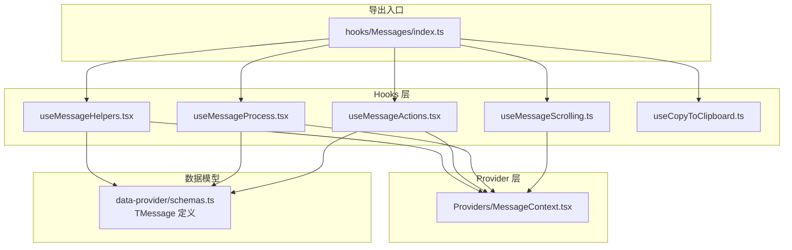
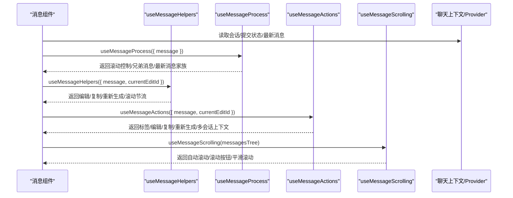
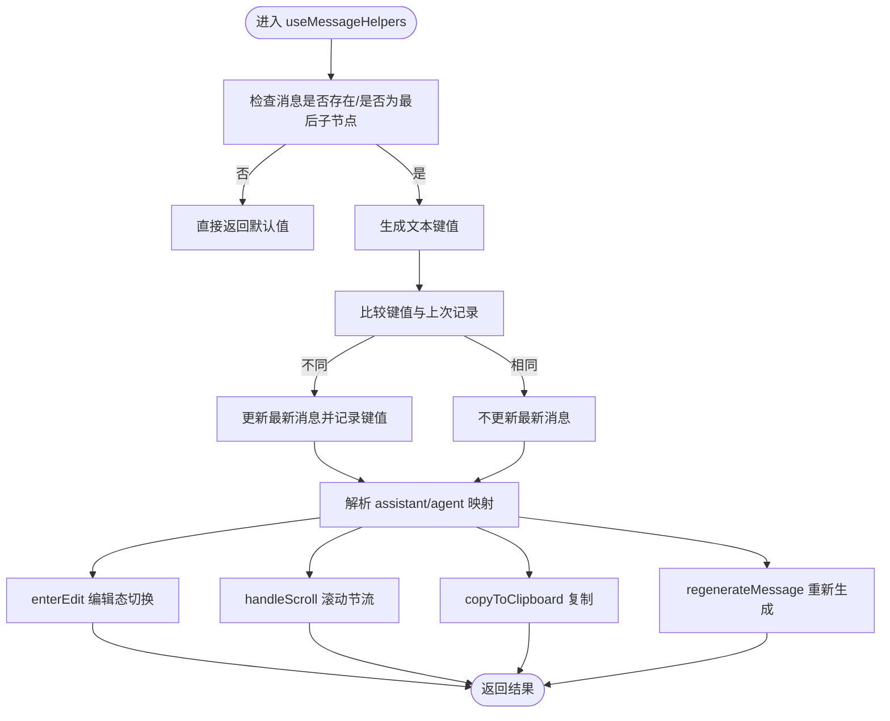
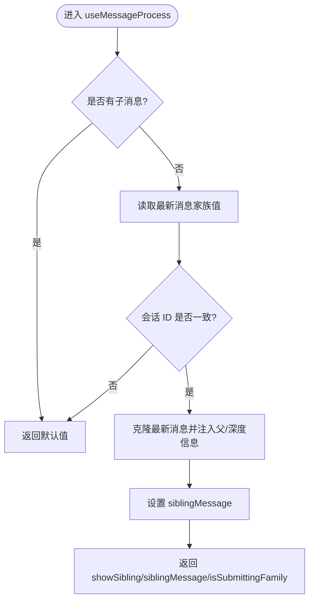
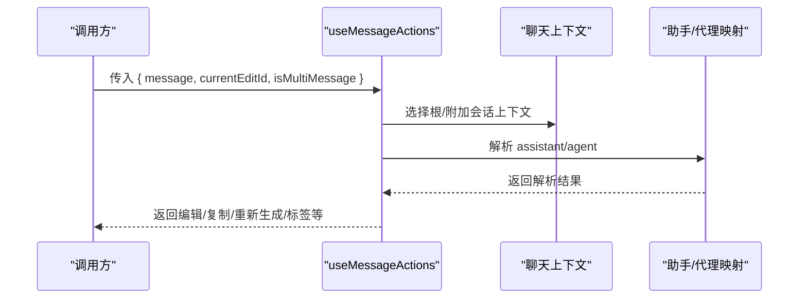
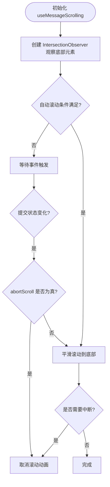
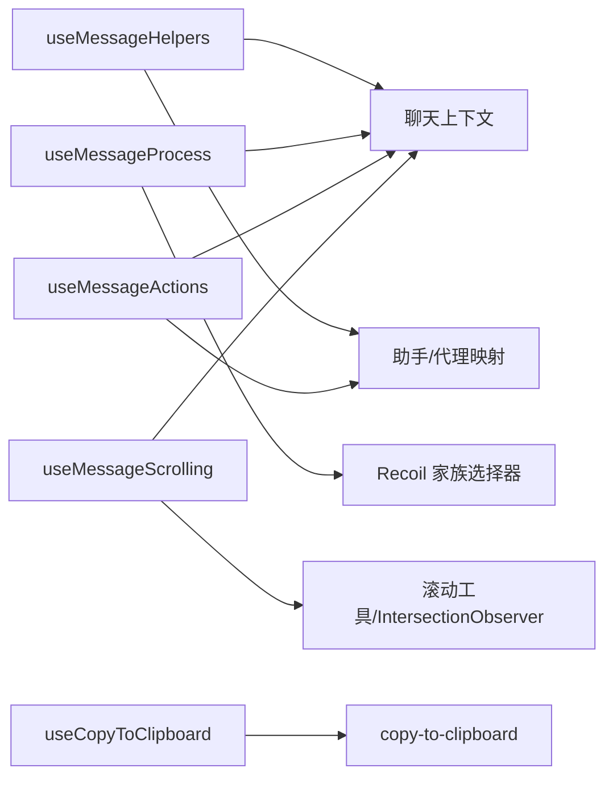

# 消息处理 Hook

<cite>
**本文引用的文件**
- [src/frontend/client/src/hooks/Messages/index.ts](file://src/frontend/client/src/hooks/Messages/index.ts)
- [src/frontend/client/src/hooks/Messages/useMessageHelpers.tsx](file://src/frontend/client/src/hooks/Messages/useMessageHelpers.tsx)
- [src/frontend/client/src/hooks/Messages/useMessageProcess.tsx](file://src/frontend/client/src/hooks/Messages/useMessageProcess.tsx)
- [src/frontend/client/src/hooks/Messages/useMessageActions.tsx](file://src/frontend/client/src/hooks/Messages/useMessageActions.tsx)
- [src/frontend/client/src/hooks/Messages/useMessageScrolling.ts](file://src/frontend/client/src/hooks/Messages/useMessageScrolling.ts)
- [src/frontend/client/src/hooks/Messages/useCopyToClipboard.ts](file://src/frontend/client/src/hooks/Messages/useCopyToClipboard.ts)
- [src/frontend/client/src/Providers/MessageContext.tsx](file://src/frontend/client/src/Providers/MessageContext.tsx)
- [src/frontend/client/src/data-provider/data-provider/src/schemas.ts](file://src/frontend/client/src/data-provider/data-provider/src/schemas.ts)
</cite>

## 目录
1. [简介](#简介)
2. [项目结构](#项目结构)
3. [核心组件](#核心组件)
4. [架构总览](#架构总览)
5. [详细组件分析](#详细组件分析)
6. [依赖关系分析](#依赖关系分析)
7. [性能考量](#性能考量)
8. [故障排查指南](#故障排查指南)
9. [结论](#结论)
10. [附录](#附录)

## 简介
本文件系统性梳理 Bisheng 前端“消息处理 Hook”体系，聚焦于消息构建、处理、交互与滚动等关键能力，重点覆盖以下核心 Hook：useMessageHelpers、useMessageProcess、useMessageActions、useMessageScrolling 及其配套工具 useCopyToClipboard。文档将从架构、数据流、处理逻辑、错误处理与性能优化等方面进行深入解析，并给出与聊天组件、文件上传/下载、富文本渲染等模块的集成要点与最佳实践。

## 项目结构
消息处理 Hook 集中位于前端客户端的 hooks/Messages 目录，通过统一导出入口集中暴露给业务组件使用；同时配合 Provider 上下文（如 MessageContext）与数据层模型（TMessage）完成跨组件协作。

图表来源
- [src/frontend/client/src/hooks/Messages/index.ts](file://src/frontend/client/src/hooks/Messages/index.ts#L1-L9)
- [src/frontend/client/src/hooks/Messages/useMessageHelpers.tsx](file://src/frontend/client/src/hooks/Messages/useMessageHelpers.tsx#L1-L135)
- [src/frontend/client/src/hooks/Messages/useMessageProcess.tsx](file://src/frontend/client/src/hooks/Messages/useMessageProcess.tsx#L1-L114)
- [src/frontend/client/src/hooks/Messages/useMessageActions.tsx](file://src/frontend/client/src/hooks/Messages/useMessageActions.tsx#L1-L131)
- [src/frontend/client/src/hooks/Messages/useMessageScrolling.ts](file://src/frontend/client/src/hooks/Messages/useMessageScrolling.ts#L1-L114)
- [src/frontend/client/src/Providers/MessageContext.tsx](file://src/frontend/client/src/Providers/MessageContext.tsx#L1-L12)
- [src/frontend/client/src/data-provider/data-provider/src/schemas.ts](file://src/frontend/client/src/data-provider/data-provider/src/schemas.ts#L508-L518)

章节来源
- [src/frontend/client/src/hooks/Messages/index.ts](file://src/frontend/client/src/hooks/Messages/index.ts#L1-L9)

## 核心组件
- useMessageHelpers：负责单条消息的辅助能力，包括编辑态切换、滚动节流控制、最新消息追踪、复制到剪贴板、智能助手/代理信息解析、重新生成消息等。
- useMessageProcess：面向消息树的处理逻辑，负责兄弟消息展示、滚动控制、多会话提交状态合并、最新消息家族值联动等。
- useMessageActions：面向消息交互动作，负责编辑、复制、重新生成、标签显示（用户名/代理名/助手名）、多会话上下文选择等。
- useMessageScrolling：负责消息列表自动滚动、滚动按钮显隐、IntersectionObserver 观察器、平滑滚动与中断控制。
- useCopyToClipboard：通用复制能力，支持纯文本与富文本内容拼接复制。

章节来源
- [src/frontend/client/src/hooks/Messages/useMessageHelpers.tsx](file://src/frontend/client/src/hooks/Messages/useMessageHelpers.tsx#L1-L135)
- [src/frontend/client/src/hooks/Messages/useMessageProcess.tsx](file://src/frontend/client/src/hooks/Messages/useMessageProcess.tsx#L1-L114)
- [src/frontend/client/src/hooks/Messages/useMessageActions.tsx](file://src/frontend/client/src/hooks/Messages/useMessageActions.tsx#L1-L131)
- [src/frontend/client/src/hooks/Messages/useMessageScrolling.ts](file://src/frontend/client/src/hooks/Messages/useMessageScrolling.ts#L1-L114)
- [src/frontend/client/src/hooks/Messages/useCopyToClipboard.ts](file://src/frontend/client/src/hooks/Messages/useCopyToClipboard.ts#L1-L46)

## 架构总览
消息处理 Hook 与 Provider、数据模型、聊天上下文协同工作，形成“输入消息 -> 处理/加工 -> 渲染/交互 -> 状态更新”的闭环。

图表来源
- [src/frontend/client/src/hooks/Messages/useMessageProcess.tsx](file://src/frontend/client/src/hooks/Messages/useMessageProcess.tsx#L10-L113)
- [src/frontend/client/src/hooks/Messages/useMessageHelpers.tsx](file://src/frontend/client/src/hooks/Messages/useMessageHelpers.tsx#L9-L134)
- [src/frontend/client/src/hooks/Messages/useMessageActions.tsx](file://src/frontend/client/src/hooks/Messages/useMessageActions.tsx#L22-L129)
- [src/frontend/client/src/hooks/Messages/useMessageScrolling.ts](file://src/frontend/client/src/hooks/Messages/useMessageScrolling.ts#L12-L112)

## 详细组件分析

### useMessageHelpers 组件分析
- 职责与功能
  - 编辑态切换：enterEdit，支持取消编辑。
  - 滚动节流：handleScroll，基于节流函数在滚动事件中设置/清除中断滚动标记。
  - 最新消息追踪：根据消息键值与会话 ID 判断是否更新最新消息。
  - 助手/代理解析：根据会话端点类型与模型键，从映射表中解析 assistant 或 agent。
  - 重新生成：regenerateMessage，受提交状态与发送方限制。
  - 复制到剪贴板：基于 useCopyToClipboard，支持文本与富文本内容拼接。
- 关键输入输出
  - 输入：TMessageProps（包含 message、currentEditId、setCurrentEditId 等）
  - 输出：对象包含 ask、edit、agent、index、isLast、assistant、enterEdit、conversation、isSubmitting、handleScroll、latestMessage、handleContinue、copyToClipboard、regenerateMessage 等字段
- 使用约束
  - 必须在聊天上下文中使用，且会话 ID 不为新建会话时才进行最新消息更新。
  - 在用户正在提交且当前消息为用户发送时，禁止重新生成。
- 性能与健壮性
  - 使用 useMemo 缓存 assistant/agent 解析结果，避免重复计算。
  - 使用节流函数控制滚动事件频率，降低重排压力。

图表来源
- [src/frontend/client/src/hooks/Messages/useMessageHelpers.tsx](file://src/frontend/client/src/hooks/Messages/useMessageHelpers.tsx#L31-L134)

章节来源
- [src/frontend/client/src/hooks/Messages/useMessageHelpers.tsx](file://src/frontend/client/src/hooks/Messages/useMessageHelpers.tsx#L1-L135)

### useMessageProcess 组件分析
- 职责与功能
  - 兄弟消息展示：当自身无子消息且最新消息家族存在且无子消息时，构造兄弟消息用于渲染。
  - 滚动控制：与 useMessageHelpers 类似，基于 isSubmitting 合并状态设置中断滚动标记。
  - 最新消息家族联动：通过 Recoil 家族选择器获取指定索引的最新消息。
- 关键输入输出
  - 输入：{ message?: TMessage | null }
  - 输出：对象包含 showSibling、handleScroll、conversation、siblingMessage、setSiblingMessage、isSubmittingFamily、latestMultiMessage
- 使用约束
  - 仅在自身无子消息时尝试挂载兄弟消息。
  - 会话 ID 与消息会话一致时才进行兄弟消息挂载。
- 性能与健壮性
  - 使用 useMemo 计算 isSubmitting 合并状态，减少不必要的重渲染。
  - 通过 useState 控制兄弟消息，避免重复对象引用导致的渲染问题。

图表来源
- [src/frontend/client/src/hooks/Messages/useMessageProcess.tsx](file://src/frontend/client/src/hooks/Messages/useMessageProcess.tsx#L83-L102)

章节来源
- [src/frontend/client/src/hooks/Messages/useMessageProcess.tsx](file://src/frontend/client/src/hooks/Messages/useMessageProcess.tsx#L1-L114)

### useMessageActions 组件分析
- 职责与功能
  - 编辑态切换：enterEdit，支持取消编辑。
  - 助手/代理解析：根据会话端点类型与模型键解析 assistant/agent。
  - 多会话上下文选择：isMultiMessage 决定使用主会话还是附加会话上下文。
  - 标签显示：根据消息发送方、用户名显示策略、代理/助手名称生成可读标签。
  - 重新生成：regenerateMessage，受提交状态与发送方限制。
  - 复制到剪贴板：基于 useCopyToClipboard。
- 关键输入输出
  - 输入：TMessageActions（message、currentEditId、setCurrentEditId、可选 isMultiMessage）
  - 输出：对象包含 ask、edit、index、agent、assistant、enterEdit、conversation、messageLabel、isSubmitting、latestMessage、handleContinue、copyToClipboard、setLatestMessage、regenerateMessage
- 使用约束
  - 当 isMultiMessage 为真时，使用附加会话上下文；否则使用根会话上下文。
  - 用户正在提交且消息为用户发送时，禁止重新生成。

图表来源
- [src/frontend/client/src/hooks/Messages/useMessageActions.tsx](file://src/frontend/client/src/hooks/Messages/useMessageActions.tsx#L22-L129)

章节来源
- [src/frontend/client/src/hooks/Messages/useMessageActions.tsx](file://src/frontend/client/src/hooks/Messages/useMessageActions.tsx#L1-L131)

### useMessageScrolling 组件分析
- 职责与功能
  - 自动滚动：在提交状态或自动滚动开启时，平滑滚动到底部。
  - 滚动按钮：通过 IntersectionObserver 判断底部元素是否可见，决定是否显示“回到底部”按钮。
  - 中断滚动：在 isSubmitting 期间允许滚动，但可通过 abortScroll 标记取消正在进行的滚动。
- 关键输入输出
  - 输入：messagesTree?: TMessage[] | null
  - 输出：对象包含 scrollableRef、messagesEndRef、scrollToBottom、showScrollButton、handleSmoothToRef、debouncedHandleScroll、conversation
- 使用约束
  - 新建会话时不自动滚动。
  - 若 abortScroll 为真，则取消正在进行的滚动动画。

图表来源
- [src/frontend/client/src/hooks/Messages/useMessageScrolling.ts](file://src/frontend/client/src/hooks/Messages/useMessageScrolling.ts#L30-L102)

章节来源
- [src/frontend/client/src/hooks/Messages/useMessageScrolling.ts](file://src/frontend/client/src/hooks/Messages/useMessageScrolling.ts#L1-L114)

### useCopyToClipboard 组件分析
- 职责与功能
  - 将消息文本与富文本内容拼接后复制到剪贴板，并在 3 秒后恢复“已复制”状态。
  - 支持 content 数组中多种内容类型的过滤与拼接（例如只拼接文本类型）。
- 关键输入输出
  - 输入：Partial<Pick<TMessage, 'text' | 'content'>>
  - 输出：copyToClipboard 回调函数
- 使用约束
  - 复制完成后会清理定时器，避免内存泄漏。

章节来源
- [src/frontend/client/src/hooks/Messages/useCopyToClipboard.ts](file://src/frontend/client/src/hooks/Messages/useCopyToClipboard.ts#L1-L46)

## 依赖关系分析
- 组件耦合
  - useMessageHelpers/useMessageActions 依赖聊天上下文与助手/代理映射，具备较强上下文耦合。
  - useMessageProcess 依赖 Recoil 家族选择器与聊天上下文，关注消息树与多会话状态。
  - useMessageScrolling 依赖自动滚动开关与滚动工具，关注 UI 行为。
- 外部依赖
  - lodash.throttle：用于滚动事件节流。
  - copy-to-clipboard：用于复制文本。
  - Recoil：用于状态选择器与全局状态联动。
- 潜在循环依赖
  - Hooks 之间无直接相互依赖，主要通过 Provider 与数据模型间接耦合，未见循环依赖迹象。

图表来源
- [src/frontend/client/src/hooks/Messages/useMessageHelpers.tsx](file://src/frontend/client/src/hooks/Messages/useMessageHelpers.tsx#L13-L25)
- [src/frontend/client/src/hooks/Messages/useMessageProcess.tsx](file://src/frontend/client/src/hooks/Messages/useMessageProcess.tsx#L24-L28)
- [src/frontend/client/src/hooks/Messages/useMessageActions.tsx](file://src/frontend/client/src/hooks/Messages/useMessageActions.tsx#L37-L45)
- [src/frontend/client/src/hooks/Messages/useMessageScrolling.ts](file://src/frontend/client/src/hooks/Messages/useMessageScrolling.ts#L18-L18)
- [src/frontend/client/src/hooks/Messages/useCopyToClipboard.ts](file://src/frontend/client/src/hooks/Messages/useCopyToClipboard.ts#L1-L46)

## 性能考量
- 节流与防抖
  - 滚动事件统一使用节流，降低频繁计算与重排开销。
- 计算缓存
  - 助手/代理解析与 isSubmitting 合并均使用 useMemo，避免重复计算。
- 状态最小化
  - useMessageProcess 通过 useState 控制兄弟消息，避免不必要的对象深拷贝。
- 异步滚动中断
  - 提供 abortScroll 机制，可在提交过程中及时中断滚动动画，提升交互流畅度。

## 故障排查指南
- 最新消息未更新
  - 检查消息键值生成逻辑与会话 ID 是否变化。
  - 确认当前会话是否为新建会话（新建会话不更新最新消息）。
- 滚动按钮不出现
  - 检查 IntersectionObserver 初始化与阈值配置。
  - 确认容器与底部元素引用是否正确赋值。
- 复制失败或内容异常
  - 检查 content 数组中类型过滤逻辑与文本拼接顺序。
  - 确认复制回调是否在 3 秒内被重置。
- 重新生成无效
  - 确认 isSubmitting 状态与消息发送方标志位。
  - 检查聊天上下文中的 regenerate 方法是否可用。

章节来源
- [src/frontend/client/src/hooks/Messages/useMessageHelpers.tsx](file://src/frontend/client/src/hooks/Messages/useMessageHelpers.tsx#L31-L62)
- [src/frontend/client/src/hooks/Messages/useMessageProcess.tsx](file://src/frontend/client/src/hooks/Messages/useMessageProcess.tsx#L30-L63)
- [src/frontend/client/src/hooks/Messages/useMessageScrolling.ts](file://src/frontend/client/src/hooks/Messages/useMessageScrolling.ts#L30-L48)
- [src/frontend/client/src/hooks/Messages/useCopyToClipboard.ts](file://src/frontend/client/src/hooks/Messages/useCopyToClipboard.ts#L19-L42)

## 结论
消息处理 Hook 体系围绕“消息构建、处理、交互、滚动”四大维度展开，通过 Provider 与数据模型解耦，结合节流、缓存与状态选择器实现高性能与高可用。建议在实际使用中：
- 明确多会话场景下的上下文选择（isMultiMessage）。
- 合理利用兄弟消息与最新消息家族联动，增强消息树渲染体验。
- 在滚动场景中配合 abortScroll 与自动滚动策略，平衡用户体验与性能。

## 附录

### 数据模型与上下文
- TMessage 定义
  - 字段概览：包含 children、content、files、depth、siblingIndex、attachments、clientTimestamp 等扩展字段，支持消息树与富文本/附件等复杂内容。
- MessageContext
  - 字段概览：messageId、nextType、partIndex、isExpanded、conversationId，用于消息片段级上下文传递。

章节来源
- [src/frontend/client/src/data-provider/data-provider/src/schemas.ts](file://src/frontend/client/src/data-provider/data-provider/src/schemas.ts#L508-L518)
- [src/frontend/client/src/Providers/MessageContext.tsx](file://src/frontend/client/src/Providers/MessageContext.tsx#L1-L12)